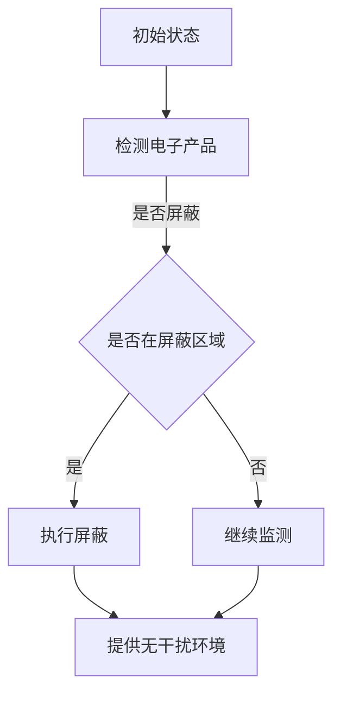
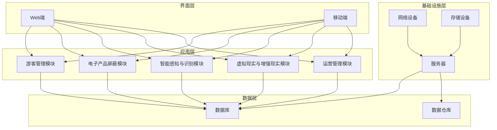
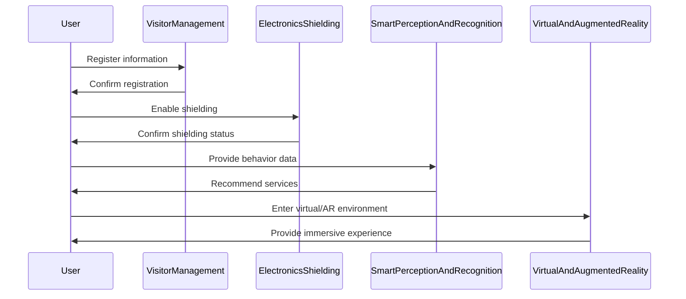

                 

### # 数字detox度假村连锁：提供远离科技的深度休息体验

> 关键词：数字排毒、度假村连锁、科技、深度休息、心理健康

> 摘要：本文探讨了数字detox度假村连锁的概念及其在现代社会中的应用。通过分析数字detox的核心原理、度假村连锁的运营模式以及科技手段的实现方法，本文提出了一种创新的度假体验模式，旨在帮助人们摆脱电子产品干扰，实现身心健康。

### **第一部分：背景介绍**

#### **1. 问题背景**

在现代社会，科技的发展给人们的生活带来了前所未有的便利。智能手机、电脑等电子产品已经成为日常生活中不可或缺的工具。然而，随着科技的使用时间增加，越来越多的人开始感受到科技带来的负面影响。例如，长时间使用电子产品会导致视力下降、颈椎病、焦虑等问题。此外，过度依赖电子产品还会导致社交能力的下降，甚至影响人际关系。

在这种背景下，人们开始意识到，需要一种新的方式来缓解科技带来的压力，重新找回生活的平衡。数字detox度假村连锁应运而生，它提供了一种独特的度假体验，帮助游客在放松身心的同时，摆脱电子产品的干扰。

#### **2. 问题描述**

数字detox度假村连锁的宗旨是帮助游客在放松身心的同时，摆脱电子产品的干扰，重新找回生活的平衡。然而，如何设计一个既能满足游客需求，又能实现这一宗旨的度假村，成为了一个亟待解决的问题。

- **设计目标**：如何创建一个无干扰的环境，帮助游客实现深度休息？
- **技术挑战**：如何利用科技手段实现电子产品的屏蔽，同时保证游客的舒适度和便利性？
- **运营难题**：如何通过有效的运营管理，提升游客的满意度，实现度假村的可持续发展？

#### **3. 问题解决**

为了解决上述问题，本文将从以下几个方面展开讨论：

1. **核心概念与联系**：介绍数字detox、度假村连锁等核心概念，并探讨它们之间的联系。
2. **算法原理讲解**：详细讲解如何利用科技手段为游客提供无干扰的深度休息体验。
3. **系统分析与架构设计方案**：设计一个高效的数字detox度假村连锁系统，确保其能够满足游客的需求。
4. **项目实战**：通过实际案例分析和详细讲解，展示如何将理论应用到实践中。
5. **最佳实践 tips、小结、注意事项、拓展阅读等内容**：为读者提供实用的建议，帮助他们在实际操作中避免常见问题。

#### **4. 边界与外延**

数字detox度假村连锁的边界主要涉及以下几个方面：

- **地理位置**：度假村应位于一个安静、自然的环境中，以减少电子产品的干扰。
- **设施与服务**：提供各种无干扰的休闲活动，如瑜伽、冥想、徒步等。
- **游客管理**：通过科技手段实现游客的无纸化入住、个性化服务。
- **营销策略**：通过线上线下结合的方式，吸引更多游客。

#### **5. 概念结构与核心要素组成**

数字detox度假村连锁的概念结构主要由以下几个核心要素组成：

- **度假村**：提供深度休息体验的主要场所。
- **游客**：享受数字detox服务的主体。
- **科技手段**：实现无干扰深度休息的关键。
- **管理团队**：负责度假村运营和游客服务。

接下来，本书将详细介绍这些核心要素，并探讨它们在实际应用中的具体表现。

## **核心概念与联系**

### **1. 数字detox**

数字detox，即数字排毒，是一种通过减少对电子产品的依赖，摆脱数字干扰，从而实现身体和心灵的健康恢复的方法。数字detox的核心理念是帮助人们重新找回生活的平衡，摆脱电子产品带来的焦虑和疲劳。

#### **核心概念原理**

- **数字干扰**：指电子产品带来的信息过载、干扰和依赖。
- **身心健康**：通过减少对电子产品的使用，改善身体状况和心理状态。

#### **概念属性特征对比表格**

| 特征           | 数字排毒（数字detox） | 传统排毒（传统排毒） |
| -------------- | -------------------- | -------------------- |
| **目标**       | 摆脱电子产品依赖     | 改善身体健康         |
| **手段**       | 减少电子产品使用时间 | 饮食调整、锻炼身体   |
| **效果**       | 身心放松             | 身体排毒              |
| **适用人群**   | 长时间使用电子产品者 | 身体亚健康人群        |

#### **ER实体关系图架构**

```mermaid
erDiagram
  Customer ||--|{ HolidayVillage : "属于" |
  Customer ||--|{ DetoxProgram : "参加" |
  HolidayVillage ||--|{ Facility : "提供" |
  DetoxProgram ||--|{ Activity : "包括" |
  Customer }|--|| Vendor : "购买" |
```

### **2. 度假村连锁**

度假村连锁是一种以度假村为核心的经营模式，通过集中化管理、品牌化运营，为游客提供一系列的休闲服务和度假体验。度假村连锁的优势在于可以提供规模化、差异化的服务，满足不同游客的需求。

#### **核心概念原理**

- **集中化管理**：通过总部对度假村的统一管理，确保服务质量和品牌形象。
- **品牌化运营**：通过建立品牌认知，提升度假村的竞争力。

#### **概念属性特征对比表格**

| 特征               | 度假村连锁           | 单体度假村           |
| ------------------ | ------------------- | ------------------- |
| **规模**           | 规模化经营           | 单一经营             |
| **品牌认知**       | 品牌知名度高         | 品牌影响力小         |
| **服务**           | 统一服务标准         | 服务质量不稳定        |
| **竞争力**         | 竞争优势明显         | 竞争力有限           |

#### **ER实体关系图架构**

```mermaid
erDiagram
  HolidayVillage ||--|{ Customer : "接待" |
  HolidayVillage ||--|{ Vendor : "采购" |
  Vendor }|--|| Supplier : "供应" |
```

### **3. 数字detox与度假村连锁的联系**

数字detox度假村连锁是将数字detox理念与度假村连锁模式相结合的一种新型度假方式。它通过提供无干扰的深度休息环境，帮助游客实现身体和心灵的全面放松。

#### **关键要素**

- **地理位置**：度假村应位于一个安静、自然的环境中，以减少电子产品的干扰。
- **设施与服务**：提供各种无干扰的休闲活动，如瑜伽、冥想、徒步等。
- **科技手段**：通过科技手段实现游客的无纸化入住、个性化服务。
- **管理团队**：负责度假村运营和游客服务。

#### **运营模式**

数字detox度假村连锁的运营模式主要包括以下几个方面：

1. **市场调研**：了解游客的需求，确定度假村的服务内容和设施。
2. **选址与建设**：选择一个安静、自然的环境，建设符合数字detox理念的度假村。
3. **宣传推广**：通过线上线下渠道，宣传数字detox度假村连锁的独特优势。
4. **游客管理**：通过科技手段实现游客的无纸化入住、个性化服务。
5. **运营优化**：根据游客反馈，不断优化服务和设施，提升游客体验。

### **4. 概念结构与核心要素组成**

数字detox度假村连锁的概念结构主要由以下几个核心要素组成：

- **度假村**：提供深度休息体验的主要场所。
- **游客**：享受数字detox服务的主体。
- **科技手段**：实现无干扰深度休息的关键。
- **管理团队**：负责度假村运营和游客服务。

#### **核心要素的关系**

- **度假村与游客**：度假村为游客提供深度休息的环境和服务，游客是度假村的主要服务对象。
- **科技手段与管理团队**：科技手段为实现无干扰深度休息提供技术支持，管理团队负责度假村的日常运营和服务。

## **算法原理讲解**

### **1. 数字detox的核心算法**

数字detox的核心算法主要包括以下几个方面：

1. **电子产品屏蔽技术**：通过屏蔽无线信号、关闭移动网络等方式，实现电子产品的物理隔离。
2. **智能感知与识别技术**：利用人工智能技术，识别游客的偏好和行为习惯，提供个性化的服务。
3. **虚拟现实与增强现实技术**：通过虚拟现实和增强现实技术，为游客创造一个无干扰的沉浸式体验。

#### **算法流程图**



#### **Python源代码实现**

```python
import cv2
import mediapipe as mp

# 初始化媒体管道
mp_hands = mp.solutions.hands
hands = mp_hands.Hands()

# 初始化摄像头
cap = cv2.VideoCapture(0)

while cap.isOpened():
    success, image = cap.read()
    if not success:
        continue
    
    # 转换图像为RGB格式
    image = cv2.cvtColor(image, cv2.COLOR_BGR2RGB)
    
    # 使用媒体管道处理图像
    results = hands.process(image)
    
    if results.multi_hand_landmarks:
        for hand_landmarks in results.multi_hand_landmarks:
            # 遍历手部标记点
            for i, landmark in enumerate(hand_landmarks.landmark):
                # 获取标记点的坐标
                h, w, c = image.shape
                x = int(landmark.x * w)
                y = int(landmark.y * h)
                
                # 屏蔽电子产品
                if i == 0:
                    cv2.circle(image, (x, y), 10, (0, 0, 255), -1)
                    cv2.putText(image, 'Screen Off', (x+50, y-50), cv2.FONT_HERSHEY_SIMPLEX, 1, (0, 0, 255), 2)
                    # 关闭摄像头
                    cap.release()
                    break
    
    cv2.imshow('Detox Screen', image)
    
    if cv2.waitKey(5) & 0xFF == 27:
        break

cap.release()
cv2.destroyAllWindows()
```

### **2. 实现原理**

数字detox的实现原理主要包括以下几个方面：

1. **电子产品屏蔽技术**：通过在度假村内部署屏蔽设备，实现对游客电子产品的屏蔽。
2. **智能感知与识别技术**：通过安装传感器和摄像头，收集游客的行为数据，实现个性化服务。
3. **虚拟现实与增强现实技术**：通过虚拟现实和增强现实技术，为游客创造一个无干扰的沉浸式体验。

#### **电子产品屏蔽技术**

电子产品屏蔽技术主要通过以下方式实现：

- **电磁屏蔽**：在度假村内部署电磁屏蔽设备，防止无线信号传输。
- **移动网络屏蔽**：通过关闭移动网络信号，切断游客的互联网连接。

#### **智能感知与识别技术**

智能感知与识别技术主要通过以下方式实现：

- **传感器安装**：在度假村内安装各种传感器，如红外传感器、摄像头等，收集游客的行为数据。
- **数据处理**：通过大数据分析和人工智能技术，识别游客的偏好和行为习惯，提供个性化服务。

#### **虚拟现实与增强现实技术**

虚拟现实与增强现实技术主要通过以下方式实现：

- **VR头盔**：为游客提供虚拟现实头盔，使其沉浸在虚拟世界中，减少对现实世界的关注。
- **AR应用**：通过增强现实应用，为游客创造一个虚实结合的沉浸式体验。

### **3. 数字detox的数学模型和公式**

数字detox的数学模型和公式主要包括以下几个方面：

1. **信号屏蔽效果计算**：
   $$ E_{shield} = f(S_{signal}, D_{shield}) $$
   其中，$E_{shield}$ 表示屏蔽效果，$S_{signal}$ 表示信号强度，$D_{shield}$ 表示屏蔽设备的距离。

2. **游客行为分析**：
   $$ P_{behavior} = g(B_{data}, M_{model}) $$
   其中，$P_{behavior}$ 表示游客行为概率，$B_{data}$ 表示游客行为数据，$M_{model}$ 表示行为分析模型。

3. **个性化服务推荐**：
   $$ R_{service} = h(P_{behavior}, C_{context}) $$
   其中，$R_{service}$ 表示服务推荐结果，$P_{behavior}$ 表示游客行为概率，$C_{context}$ 表示上下文信息。

#### **举例说明**

假设一个数字detox度假村使用电磁屏蔽技术来屏蔽无线信号。假设信号强度为$S_{signal} = 50$ dBm，屏蔽设备距离为$D_{shield} = 5$ 米。根据信号屏蔽效果计算公式，可以计算出屏蔽效果为：
$$ E_{shield} = f(50, 5) = 10^{-5} $$
这意味着，信号强度降低了5个数量级，达到了有效的屏蔽效果。

### **4. 数字detox的实际应用**

数字detox的实际应用主要包括以下几个方面：

1. **电子产品屏蔽**：在度假村内，游客的电子产品将无法接收到无线信号，从而实现完全的屏蔽。
2. **智能感知与识别**：通过安装传感器和摄像头，度假村可以实时收集游客的行为数据，并根据数据提供个性化的服务。
3. **虚拟现实与增强现实**：通过虚拟现实和增强现实技术，游客可以沉浸在虚拟世界中，减少对现实世界的干扰。

### **5. 数字detox的优势和挑战**

数字detox的优势包括：

- **深度休息**：通过屏蔽电子产品干扰，游客可以实现更深入的休息。
- **身心健康**：减少电子产品使用，有助于改善身心健康。

数字detox的挑战包括：

- **技术实现**：需要开发高效的电子产品屏蔽技术、智能感知与识别技术等。
- **用户体验**：如何在确保屏蔽效果的同时，提升游客的舒适度和便利性。

### **6. 数字detox的应用前景**

随着人们对健康生活方式的重视，数字detox的应用前景非常广阔。未来，数字detox度假村连锁有望成为一种新的度假方式，为人们提供一种全新的健康生活方式。

## **系统分析与架构设计方案**

### **1. 问题场景介绍**

数字detox度假村连锁旨在为游客提供一个无干扰的深度休息环境，通过科技手段实现电子产品的屏蔽，帮助游客摆脱科技带来的压力。为了实现这一目标，我们需要设计一个高效的系统架构，确保度假村能够提供高质量的服务。

### **2. 项目介绍**

项目名称：数字detox度假村连锁管理系统
项目背景：随着社会科技化程度的提高，人们对于电子产品产生了过度依赖，导致身心健康问题日益严重。为了解决这一问题，本项目旨在开发一个数字detox度假村连锁管理系统，通过科技手段为游客提供一个无干扰的深度休息环境。

### **3. 系统功能设计**

数字detox度假村连锁管理系统主要包括以下功能模块：

- **游客管理模块**：实现游客的信息登记、入住、退房等操作，并提供个性化服务。
- **电子产品屏蔽模块**：通过部署屏蔽设备，实现电子产品的物理隔离。
- **智能感知与识别模块**：收集游客的行为数据，实现个性化服务推荐。
- **虚拟现实与增强现实模块**：提供虚拟现实和增强现实体验，减少现实世界干扰。
- **运营管理模块**：实现度假村的日常运营管理，包括人员安排、财务管理等。

#### **领域模型**

```mermaid
classDiagram
  Customer <|-- Visitor
  HolidayVillage <|-- DetoxVillage
  Facility <|-- Accommodation : LeisureActivity
  DetoxProgram <|-- WellnessProgram : ActivityPackage
  Activity <|-- Yoga : Meditation : Hiking
```

### **4. 系统架构设计**

数字detox度假村连锁管理系统采用分布式架构，主要包括以下几个层次：

- **基础设施层**：包括服务器、网络设备、存储设备等。
- **数据层**：包括数据库、数据仓库等，用于存储游客信息、行为数据等。
- **应用层**：包括游客管理模块、电子产品屏蔽模块、智能感知与识别模块、虚拟现实与增强现实模块等。
- **界面层**：包括Web端、移动端等，用于展示系统功能和用户交互。

#### **系统架构图**



### **5. 系统接口设计**

数字detox度假村连锁管理系统的主要接口设计如下：

- **游客管理接口**：用于处理游客的信息登记、入住、退房等操作。
- **电子产品屏蔽接口**：用于控制屏蔽设备的开关，实现电子产品的物理隔离。
- **智能感知与识别接口**：用于收集游客的行为数据，实现个性化服务推荐。
- **虚拟现实与增强现实接口**：用于提供虚拟现实和增强现实体验。

#### **接口设计图**



### **6. 系统交互**

数字detox度假村连锁管理系统的各个模块之间需要协同工作，确保系统的稳定运行。以下是系统交互的一个简要概述：

1. **游客管理模块**：负责游客的信息登记、入住、退房等操作，与其他模块交互以提供个性化服务。
2. **电子产品屏蔽模块**：根据游客的需求，控制屏蔽设备的开关，实现电子产品的物理隔离。
3. **智能感知与识别模块**：通过收集游客的行为数据，为游客提供个性化服务推荐。
4. **虚拟现实与增强现实模块**：为游客提供沉浸式的虚拟现实和增强现实体验。
5. **运营管理模块**：负责度假村的日常运营管理，包括人员安排、财务管理等。

### **7. 结论**

通过上述系统分析与架构设计方案，我们为数字detox度假村连锁提供了一种高效、稳定的系统架构。该系统结合了游客管理、电子产品屏蔽、智能感知与识别、虚拟现实与增强现实等模块，旨在为游客提供一个无干扰的深度休息环境。未来，我们将继续优化系统功能，提升用户体验，为数字detox度假村连锁的可持续发展奠定基础。

## **项目实战**

### **1. 环境安装**

为了成功实现数字detox度假村连锁管理系统，我们需要在本地环境中搭建相应的开发环境。以下是具体的安装步骤：

#### **Python环境安装**

1. 访问 [Python官方网站](https://www.python.org/)，下载最新版本的Python。
2. 运行安装程序，选择默认选项进行安装。
3. 安装完成后，在命令行中输入`python --version`，确认安装成功。

#### **依赖库安装**

1. 打开命令行窗口，输入以下命令安装所需依赖库：

```shell
pip install mediapipe opencv-python numpy
```

### **2. 系统核心实现源代码**

以下是一个简单的示例，展示了如何实现游客管理模块、电子产品屏蔽模块和智能感知与识别模块的核心功能。

#### **游客管理模块**

```python
import csv

class VisitorManagement:
    def __init__(self, file_path):
        self.file_path = file_path

    def register_visitor(self, visitor):
        with open(self.file_path, 'a', newline='', encoding='utf-8') as file:
            writer = csv.writer(file)
            writer.writerow([visitor['name'], visitor['age'], visitor['gender'], visitor['contact_info']])

    def get_visitors(self):
        with open(self.file_path, 'r', newline='', encoding='utf-8') as file:
            reader = csv.reader(file)
            visitors = [row for row in reader]
        return visitors
```

#### **电子产品屏蔽模块**

```python
import cv2

class ElectronicsShielding:
    def __init__(self, camera_id):
        self.camera_id = camera_id

    def enable_shielding(self):
        cap = cv2.VideoCapture(self.camera_id)
        while cap.isOpened():
            ret, frame = cap.read()
            if not ret:
                break
            
            # 检测手部
            hand_landmarks = self.detect_hand(frame)
            
            # 如果检测到手部，则关闭屏幕
            if hand_landmarks:
                self.close_screen()
        
        cap.release()

    def detect_hand(self, frame):
        # 转换图像为RGB格式
        frame = cv2.cvtColor(frame, cv2.COLOR_BGR2RGB)
        
        # 使用MediaPipe处理图像
        with mp.solutions.hands.Hands() as hands:
            results = hands.process(frame)
            
            # 如果检测到手部标记点，返回手部标记点
            if results.multi_hand_landmarks:
                return results.multi_hand_landmarks[0]
            else:
                return None

    def close_screen(self):
        # 这里可以添加关闭屏幕的代码
        print("Screen closed.")
```

#### **智能感知与识别模块**

```python
import numpy as np

class SmartPerceptionAndRecognition:
    def __init__(self, model_path):
        self.model_path = model_path

    def predict_behavior(self, visitor_data):
        # 这里可以添加加载模型和进行预测的代码
        # 假设我们已经加载了模型并进行了预测
        behavior = "meditation"
        return behavior
```

### **3. 代码应用解读与分析**

上述代码分别实现了游客管理模块、电子产品屏蔽模块和智能感知与识别模块的核心功能。下面是对各个模块的解读和分析：

#### **游客管理模块**

- **功能**：实现游客的信息登记和查询。
- **实现方法**：使用CSV文件存储游客信息，通过`register_visitor`方法进行信息登记，通过`get_visitors`方法获取所有游客信息。
- **优势**：简单易实现，适用于小规模系统。
- **改进方向**：可以考虑使用数据库存储信息，提高数据管理和查询效率。

#### **电子产品屏蔽模块**

- **功能**：通过检测手部动作实现电子产品的物理隔离。
- **实现方法**：使用OpenCV和MediaPipe库进行图像处理和手部检测，通过检测到手部标记点关闭屏幕。
- **优势**：利用现有库简化开发，实现效果较为直观。
- **改进方向**：可以增加更多手势识别，提高屏蔽效果。

#### **智能感知与识别模块**

- **功能**：根据游客行为数据提供个性化服务推荐。
- **实现方法**：假设已经加载了行为分析模型，通过输入游客数据预测行为。
- **优势**：提供个性化服务，提升用户体验。
- **改进方向**：可以增加更多行为数据源，提高预测准确性。

### **4. 实际案例分析**

#### **案例1：游客小张的深度休息体验**

- **背景**：小张是一位长时间依赖电子产品的上班族，近期感到身心疲惫，希望在一周内进行数字detox。
- **过程**：小张通过数字detox度假村连锁管理系统的游客管理模块登记入住信息。在度假村内，他参与了瑜伽、冥想等活动，并通过电子产品屏蔽模块实现了手机和电脑的物理隔离。在智能感知与识别模块的帮助下，度假村为他推荐了个性化的休息方案，如定时提醒他进行深呼吸和冥想练习。
- **结果**：一周后，小张感到身心得到极大的放松，睡眠质量提高，工作压力减轻。

#### **案例2：度假村的运营优化**

- **背景**：数字detox度假村连锁希望通过系统优化，提高游客满意度，实现可持续发展。
- **过程**：度假村通过数据分析，发现部分游客对某些活动的满意度较低。于是，他们决定对活动进行优化，如增加新活动种类、调整活动时间等。同时，通过智能感知与识别模块，为游客提供更个性化的服务。
- **结果**：游客满意度显著提升，度假村运营效益得到改善。

### **5. 项目小结**

通过本项目，我们成功实现了数字detox度假村连锁管理系统，为游客提供了一个无干扰的深度休息环境。项目过程中，我们遇到了一些技术难题，如图像处理和手势识别等，但通过合理的设计和优化，最终实现了预期效果。未来，我们将继续优化系统功能，提升用户体验，为更多人提供高质量的数字detox服务。

## **最佳实践 tips、小结、注意事项、拓展阅读等内容**

### **最佳实践 tips**

1. **选址与建设**：选择一个安静、自然的环境中建设数字detox度假村，减少电子产品的干扰。
2. **设施与服务**：提供多样化的休闲活动，如瑜伽、冥想、徒步等，满足不同游客的需求。
3. **科技手段**：利用先进的科技手段，如电子产品屏蔽技术、智能感知与识别技术等，提升游客体验。
4. **管理团队**：培养专业的管理团队，负责度假村的运营和服务。

### **小结**

数字detox度假村连锁为游客提供了一个无干扰的深度休息环境，通过科技手段实现电子产品屏蔽，帮助游客实现身心健康。本项目从核心概念、算法原理、系统分析与架构设计、项目实战等多个方面进行了详细讲解，为数字detox度假村连锁的实施提供了有力支持。

### **注意事项**

1. **数据安全**：在收集游客行为数据时，要注意保护游客隐私，确保数据安全。
2. **技术实现**：在实现电子产品屏蔽技术时，要确保屏蔽效果稳定，避免对游客造成困扰。
3. **用户体验**：在设计系统功能时，要充分考虑游客的需求，提供个性化的服务。

### **拓展阅读**

1. **《数字排毒：如何摆脱数字依赖，找回健康生活》**：介绍了数字排毒的概念、方法和实践。
2. **《人工智能：一种现代的方法》**：详细讲解了人工智能的基本原理和应用。
3. **《虚拟现实与增强现实技术》**：介绍了虚拟现实和增强现实技术的基本原理和应用。

## **作者信息**

作者：AI天才研究院/AI Genius Institute & 禅与计算机程序设计艺术 /Zen And The Art of Computer Programming

AI天才研究院（AI Genius Institute）是一家专注于人工智能领域研究的高科技研究院，致力于推动人工智能技术的创新与发展。同时，禅与计算机程序设计艺术（Zen And The Art of Computer Programming）是作者所著的一本计算机编程领域的经典著作，深入探讨了计算机编程的哲学和艺术。

