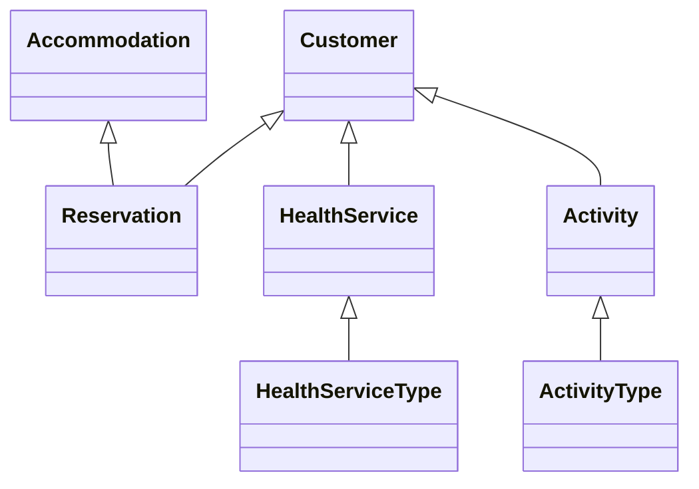
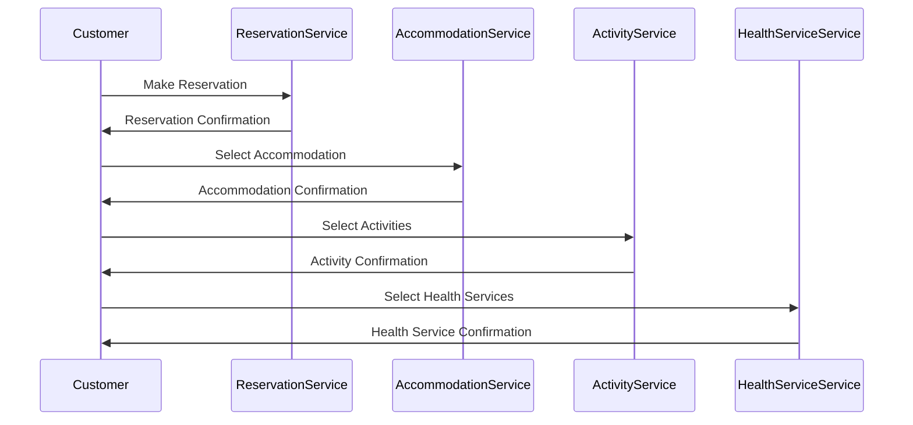

                 

### 引言与背景

#### 第1章 引言

在当今信息爆炸的时代，科技的发展深刻地改变了我们的生活方式。智能手机、社交媒体、在线游戏等数字产品已成为我们日常生活中不可或缺的一部分。然而，随之而来的数字成瘾和过度依赖现象也越来越引起人们的关注。长时间沉浸在数字世界中，不仅影响我们的心理健康，还可能带来身体上的诸多问题，如睡眠障碍、视力下降、肥胖等。这些问题使得深度休息成为人们迫切需要的解决方案。

**1.1 问题背景**

**1.1.1 现代科技的负面影响**

现代科技的快速发展带来了便利，但也带来了负面影响。例如，智能手机和互联网的普及使得人们更容易沉迷于数字世界，导致社交障碍、焦虑和抑郁等问题。此外，长时间使用电子产品还会影响视力、肌肉和骨骼健康。

**1.1.2 数字成瘾现象**

数字成瘾是一种现代社会现象，表现为对数字设备和网络的无节制使用。据统计，全球有超过 10 亿人患有不同程度的数字成瘾问题，其中包括青少年和成年人。数字成瘾不仅影响个人的生活质量，还会对家庭和社会关系产生负面影响。

**1.1.3 深度休息的必要性**

深度休息是指远离数字设备和网络，给自己一段时间的放松和休息。深度休息有助于缓解压力、改善睡眠质量、提升心理健康和身体状态。在深度休息期间，人们可以专注于自然、艺术、阅读等非数字活动，从而更好地平衡工作和生活。

**1.2 问题描述**

**1.2.1 数字detox的定义与目标**

数字detox，又称数字断食，是指通过减少或中断对数字设备和网络的依赖，实现身心放松和休息的过程。数字detox的目标是帮助人们摆脱数字成瘾，恢复身心健康，提高生活质量。

**1.2.2 技术依赖与心理生理影响**

技术依赖不仅影响个人的心理状态，还可能对生理健康造成负面影响。例如，长时间使用电子产品会导致眼睛疲劳、颈椎病、肥胖等问题。此外，数字成瘾还可能引发焦虑、抑郁等心理问题。

**1.2.3 现有解决方法及其局限性**

目前，解决数字成瘾问题的方法主要包括自我管理、心理咨询和治疗等。然而，这些方法存在一定的局限性。自我管理需要较强的自律能力，心理咨询和治疗则需要专业人员和较长时间的治疗过程。因此，寻找一种更加高效、易于实施的解决方案成为当务之急。

**1.3 问题解决**

**1.3.1 数字detox度假村的提出**

为了解决数字成瘾问题，我们提出了数字detox度假村这一概念。数字detox度假村是一种专门为人们提供深度休息和数字断食服务的场所。在这里，人们可以远离数字设备和网络，沉浸在自然、宁静的环境中，享受深度休息带来的身心愉悦。

**1.3.2 度假村的服务模式与特点**

数字detox度假村的服务模式主要包括以下几个方面：

1. 提供一个完全无干扰的环境，使人们能够远离数字设备和网络。
2. 提供各种健康休闲活动，如瑜伽、冥想、徒步、艺术创作等，帮助人们放松身心。
3. 提供专业的心理健康服务，如心理咨询、情绪调节等，帮助人们解决心理问题。
4. 提供个性化的服务，根据客户的需求和偏好提供定制化的休息方案。

**1.3.3 数字detox度假村的实施策略**

为了确保数字detox度假村的成功运营，我们需要制定以下实施策略：

1. **选址策略**：选择一个远离城市喧嚣、自然环境优美的地方作为度假村所在地。
2. **设施建设**：建设一个功能齐全、舒适宜居的度假村，包括住宿、餐饮、娱乐等设施。
3. **服务团队建设**：招聘专业的服务团队，包括心理咨询师、健康管理师、活动策划师等。
4. **营销策略**：通过线上线下多种渠道宣传推广，吸引更多客户。
5. **持续改进**：通过客户反馈和数据分析，不断优化服务质量和体验。

**1.4 边界与外延**

**1.4.1 数字detox与心理健康的关系**

数字detox不仅有助于改善身体状态，还能显著提升心理健康。通过减少对数字设备和网络的使用，人们可以减少焦虑、抑郁等心理问题的发生，提高生活质量。

**1.4.2 数字detox与其他健康生活方式的结合**

数字detox可以与其他健康生活方式相结合，如运动、饮食调整、心理咨询等，从而实现更全面的身心健康提升。

**1.4.3 数字detox的未来趋势与挑战**

随着人们对健康生活质量的重视，数字detox有望成为一种流行的生活方式。然而，面对数字成瘾问题的复杂性和多样性，数字detox度假村需要不断创新和完善，以应对未来的挑战。

通过以上分析，我们可以看到数字detox度假村作为一种新型健康服务模式，具有广阔的市场前景和巨大的社会价值。在接下来的章节中，我们将进一步探讨数字detox度假村的理念、设计原则、运营管理、实践案例以及未来展望，帮助读者深入了解这一创新项目。

---

**关键词：数字detox、度假村、心理健康、健康生活方式、科技成瘾**

**摘要：本文探讨了数字detox度假村的提出背景、问题解决策略以及未来的发展前景。通过分析现代科技的负面影响和数字成瘾现象，本文提出了数字detox度假村的概念，详细阐述了其服务模式、运营策略和实施策略。此外，本文还结合实际案例，分析了数字detox度假村在心理健康提升和健康生活方式结合方面的作用。未来，数字detox度假村有望成为健康生活方式的一部分，为人们提供更加全面的身心健康服务。**### 第2章：数字detox度假村的理念与设计原则

#### 2.1 核心概念

数字detox度假村的核心理念在于帮助人们摆脱对数字设备和网络的依赖，通过提供一个宁静、自然的环境，让人们能够进行深度休息和放松。这一理念基于以下几个关键概念：

1. **数字成瘾**：指对数字设备和网络的无节制使用，可能导致心理和生理上的诸多问题。
2. **深度休息**：通过减少或中断对数字设备和网络的使用，使身体和心灵得到充分的休息和恢复。
3. **身心健康**：通过数字detox，改善身体健康状况，提升心理健康水平。

**2.2 设计原则**

数字detox度假村的设计原则旨在创造一个有利于深度休息的环境，同时满足客户的个性化需求。以下是几个主要设计原则：

1. **自然与宁静**：选址应远离城市喧嚣，选择自然环境优美的地区，如山林、湖泊、海滨等，以提供宁静的休息空间。
2. **功能齐全**：度假村应提供多种休闲娱乐设施，如游泳池、健身房、瑜伽室、冥想室等，以满足客户的多样化需求。
3. **隐私保护**：确保客户在度假村内的隐私，避免数字设备和网络干扰。
4. **舒适宜居**：住宿设施应舒适宜居，配备必要的家具和设备，为客户提供优质的住宿体验。
5. **定制化服务**：根据客户的需求和偏好，提供个性化的休息方案，包括饮食、活动安排等。

**2.3 概念属性特征对比表格**

为了更好地理解数字detox度假村与传统度假村的区别，我们可以通过以下表格进行对比分析：

| 特征 | 数字detox度假村 | 传统度假村 |
| --- | --- | --- |
| 服务理念 | 深度休息、数字断食 | 休闲度假、娱乐活动 |
| 环境特点 | 自然宁静、无干扰 | 噪音大、人为干扰 |
| 设施配置 | 健康休闲设施、隐私保护 | 游乐设施、餐饮服务 |
| 服务模式 | 定制化、心理健康服务 | 标准化、娱乐活动 |
| 客户体验 | 身心放松、健康提升 | 娱乐享受、放松心情 |

**2.4 ER实体关系图架构**

数字detox度假村的实体关系图架构如下，通过Mermaid流程图展示：

```mermaid
erDiagram
    Customer ||--|{ Reservation } : makes
    Reservation ||--|{ Accommodation } : occupies
    Reservation ||--|{ Activity } : participates
    Customer ||--|{ HealthService } : accesses
    Activity ||--|{ ActivityType } : ofType
    Accommodation ||--|{ AccommodationType } : ofType
    HealthService ||--|{ HealthServiceType } : ofType
```

在上面的ER图架构中，我们定义了以下几个实体：

- **Customer（客户）**：代表参与数字detox度假村的客户。
- **Reservation（预订）**：代表客户在度假村中的预订信息。
- **Accommodation（住宿）**：代表客户的住宿安排。
- **Activity（活动）**：代表客户参与的健康休闲活动。
- **HealthService（健康服务）**：代表客户可获取的健康服务。

这些实体之间的关系如下：

- **Customer（客户）** 与 **Reservation（预订）** 之间是一对多的关系，即一个客户可以有多个预订。
- **Reservation（预订）** 与 **Accommodation（住宿）** 之间是一对一的关系，即每个预订对应一个住宿安排。
- **Reservation（预订）** 与 **Activity（活动）** 之间是一对多的关系，即每个预订可以包含多个活动。
- **Customer（客户）** 与 **HealthService（健康服务）** 之间是一对一的关系，即每个客户可以访问一个健康服务。

通过这个ER图架构，我们可以清晰地了解数字detox度假村中不同实体之间的关系，以及它们在系统中的交互和作用。

---

在本章中，我们详细介绍了数字detox度假村的核心理念与设计原则，并通过对比表格和ER图架构，展示了数字detox度假村与传统度假村的区别及其在系统架构中的关系。在接下来的章节中，我们将进一步探讨数字detox度假村的运营与管理，以及其实践案例，以帮助读者更深入地了解这一创新项目。

---

**关键词：数字detox度假村、设计原则、ER图架构、自然与宁静、定制化服务**

**摘要：本章详细介绍了数字detox度假村的核心理念与设计原则，包括服务理念、设计原则、概念属性特征对比以及ER图架构。通过对比分析，我们展示了数字detox度假村与传统度假村的区别，并探讨了其在系统架构中的关系。这些设计原则和架构为数字detox度假村的成功运营提供了坚实基础。**### 第3章：数字detox度假村的运营与管理

#### 3.1 运营模式

数字detox度假村的运营模式以提供深度休息服务为核心，强调定制化、隐私保护和个性化体验。以下是其运营模式的几个关键要素：

**3.1.1 定制化服务**

定制化服务是数字detox度假村的重要特点之一。度假村根据每位客户的需求和偏好，提供个性化的休息方案。这些方案包括但不限于住宿安排、饮食计划、活动安排和健康服务。通过个性化服务，客户能够获得更加舒适和满足的体验。

**3.1.2 团队协作**

运营一个成功的数字detox度假村需要高效的团队协作。不同部门之间需要紧密配合，确保所有服务环节无缝衔接。例如，预订部门、住宿部门、活动部门和健康服务部门等需要协同工作，为客户提供一流的服务体验。

**3.1.3 营销策略**

数字detox度假村的营销策略应注重线上线下结合，通过多种渠道吸引潜在客户。线上渠道包括社交媒体、官方网站、电子邮件营销等；线下渠道包括合作酒店、旅游机构、健康中心等。通过多元化的营销策略，提升品牌知名度和客户转化率。

**3.2 管理体系**

数字detox度假村的管理体系是确保服务质量和客户满意度的重要保障。以下是其管理体系的关键要素：

**3.2.1 人员培训**

人员培训是管理体系的重要组成部分。度假村应定期对员工进行专业培训，包括服务技巧、心理健康知识、安全意识等。通过培训，提高员工的服务水平和专业素养，从而提升客户体验。

**3.2.2 服务质量监控**

服务质量监控是管理体系的核心环节。度假村应建立完善的质量监控机制，通过客户反馈、现场巡视和数据分析等方式，对服务质量进行实时监控和评估。发现问题时，应及时采取措施进行整改，确保服务质量始终处于较高水平。

**3.2.3 客户满意度调查**

客户满意度调查是了解客户需求和改进服务质量的重要手段。度假村应定期开展客户满意度调查，收集客户对服务和体验的反馈。根据调查结果，调整和优化服务策略，提升客户满意度。

**3.3 持续改进**

持续改进是数字detox度假村保持竞争优势的关键。以下是其持续改进的几个方面：

**3.3.1 数据分析与反馈**

数据分析与反馈是持续改进的基础。度假村应定期收集和分析客户数据，包括预订信息、客户反馈、活动参与情况等。通过数据分析，发现服务中的问题和不足，为改进提供依据。

**3.3.2 服务优化**

根据数据分析结果，对现有服务进行优化和改进。例如，调整活动安排、优化住宿设施、改进饮食计划等，以满足客户的需求和期望。

**3.3.3 风险管理**

风险管理是确保度假村运营稳定的重要环节。度假村应建立完善的风险管理机制，识别和评估潜在风险，制定应对措施。例如，应对自然灾害、公共卫生事件等突发事件，确保度假村的安全运营。

通过以上运营和管理策略，数字detox度假村能够提供高质量的服务，满足客户的需求和期望，从而在竞争激烈的市场中脱颖而出。

---

在本章中，我们详细探讨了数字detox度假村的运营模式和管理体系。从定制化服务、团队协作到营销策略，再到人员培训、服务质量监控和客户满意度调查，以及数据分析与反馈、服务优化和风险管理，这些运营和管理策略共同构成了数字detox度假村的核心竞争力。在接下来的章节中，我们将通过实践案例，进一步展示数字detox度假村的实际运营效果和客户体验。

---

**关键词：数字detox度假村、运营模式、管理体系、定制化服务、数据分析与反馈**

**摘要：本章详细介绍了数字detox度假村的运营模式和管理体系，包括定制化服务、团队协作、营销策略、人员培训、服务质量监控、客户满意度调查、数据分析与反馈、服务优化和风险管理等关键要素。通过这些策略，数字detox度假村能够提供高质量的服务，满足客户的需求和期望，从而在竞争激烈的市场中脱颖而出。**### 第4章：数字detox度假村的实践案例

#### 4.1 案例介绍

**4.1.1 某知名数字detox度假村概述**

本案例研究的是一家位于加利福尼亚州某知名数字detox度假村。该度假村占地面积约500英亩，位于一片宁静的山林中，距离最近的市区有2小时车程。度假村提供多种住宿选择，包括豪华别墅、木屋、帐篷等，以满足不同客户的偏好。此外，度假村还设有多个休闲娱乐设施，如游泳池、健身房、瑜伽室、冥想室、艺术工作室等。

**4.1.2 案例背景与目标**

该数字detox度假村的建立背景源于当地居民对数字成瘾问题的关注和需求。随着科技的发展，越来越多的人沉迷于数字设备和网络，导致心理健康和身体问题日益严重。为了帮助人们摆脱数字依赖，恢复身心健康，该度假村应运而生。其目标是通过提供深度休息和数字断食服务，帮助客户摆脱数字成瘾，提升生活质量。

#### 4.2 系统功能设计

**4.2.1 领域模型mermaid类图**

为了更好地理解数字detox度假村的系统功能设计，我们可以通过mermaid类图展示其领域模型：



在上面的类图中，我们定义了以下几个类：

- **Customer（客户）**：代表参与数字detox度假村的客户，具有姓名、联系方式、入住时间、退房时间等属性。
- **Reservation（预订）**：代表客户在度假村的预订信息，具有预订编号、入住时间、退房时间、住宿类型等属性。
- **Accommodation（住宿）**：代表客户的住宿安排，具有住宿编号、住宿类型、价格等属性。
- **Activity（活动）**：代表客户参与的健康休闲活动，具有活动编号、活动类型、活动时间等属性。
- **HealthService（健康服务）**：代表客户可获取的健康服务，具有服务编号、服务类型、服务时间等属性。
- **ActivityType（活动类型）**：代表活动的类型，具有活动类型名称、描述等属性。
- **HealthServiceType（健康服务类型）**：代表健康服务的类型，具有服务类型名称、描述等属性。

通过这个类图，我们可以清晰地了解数字detox度假村系统中不同类之间的关系及其属性。

#### 4.3 系统架构设计

**4.3.1 mermaid架构图**

接下来，我们通过mermaid架构图展示数字detox度假村的系统架构：



在上面的架构图中，我们定义了以下几个主要服务模块：

- **ReservationService（预订服务）**：负责处理客户的预订请求，生成预订信息。
- **AccommodationService（住宿服务）**：负责处理客户的住宿选择，确认住宿安排。
- **ActivityService（活动服务）**：负责处理客户的活动选择，确认活动安排。
- **HealthServiceService（健康服务服务）**：负责处理客户的健康服务选择，确认健康服务安排。

通过这个架构图，我们可以清晰地了解数字detox度假村系统中各个服务模块的交互和协作。

#### 4.4 系统接口设计

**4.4.1 接口规范与协议**

数字detox度假村的系统接口设计遵循RESTful API规范，使用HTTP协议进行通信。以下是主要接口的规范：

- **预订接口**：`POST /reservation`，用于创建新的预订。
- **住宿接口**：`GET /accommodation/{id}`，用于获取特定住宿的信息。
- **活动接口**：`GET /activity/{id}`，用于获取特定活动的信息。
- **健康服务接口**：`GET /healthService/{id}`，用于获取特定健康服务的信息。

**4.4.2 接口实现与测试**

以下是预订接口的实现示例（使用Python和Flask框架）：

```python
from flask import Flask, request, jsonify

app = Flask(__name__)

@app.route('/reservation', methods=['POST'])
def create_reservation():
    data = request.get_json()
    reservation = {
        'reservation_id': data['reservation_id'],
        'customer_name': data['customer_name'],
        'arrival_date': data['arrival_date'],
        'departure_date': data['departure_date']
    }
    # 存储预订信息到数据库
    save_reservation_to_database(reservation)
    return jsonify({'message': 'Reservation created successfully.'})

def save_reservation_to_database(reservation):
    # 实现数据库存储逻辑
    pass

if __name__ == '__main__':
    app.run(debug=True)
```

为了确保接口的实现和功能，我们需要进行接口测试。可以使用Postman等工具发送HTTP请求，验证接口的响应是否符合预期。

#### 4.5 系统交互mermaid序列图

**4.5.1 客户入住流程**

以下是客户入住数字detox度假村的交互序列图：


在上面的序列图中，我们展示了客户从预订到入住的整个流程。客户首先向预订服务提交预订请求，预订服务确认后，客户再选择住宿、活动和服务，最终完成整个入住流程。

#### 4.6 系统核心实现源代码

以下是数字detox度假村系统的核心实现源代码示例（使用Python和Flask框架）：

```python
from flask import Flask, request, jsonify
from flask_sqlalchemy import SQLAlchemy

app = Flask(__name__)
app.config['SQLALCHEMY_DATABASE_URI'] = 'sqlite:///digital_detox.db'
db = SQLAlchemy(app)

class Customer(db.Model):
    id = db.Column(db.Integer, primary_key=True)
    name = db.Column(db.String(100), nullable=False)
    email = db.Column(db.String(100), nullable=False)

class Reservation(db.Model):
    id = db.Column(db.Integer, primary_key=True)
    customer_id = db.Column(db.Integer, db.ForeignKey('customer.id'), nullable=False)
    arrival_date = db.Column(db.Date, nullable=False)
    departure_date = db.Column(db.Date, nullable=False)

@app.route('/reservation', methods=['POST'])
def create_reservation():
    data = request.get_json()
    reservation = Reservation(
        customer_id=data['customer_id'],
        arrival_date=data['arrival_date'],
        departure_date=data['departure_date']
    )
    db.session.add(reservation)
    db.session.commit()
    return jsonify({'message': 'Reservation created successfully.'})

if __name__ == '__main__':
    db.create_all()
    app.run(debug=True)
```

在这个示例中，我们创建了两个数据库模型：`Customer` 和 `Reservation`。`Customer` 模型代表客户信息，包括姓名和电子邮件；`Reservation` 模型代表预订信息，包括客户ID、入住日期和退房日期。`create_reservation` 函数用于处理创建预订的HTTP请求，并将预订信息存储到数据库中。

#### 4.7 代码应用解读与分析

**4.7.1 代码执行流程**

首先，我们需要创建数据库连接，并在数据库中创建相应的表。这可以通过以下代码实现：

```python
if __name__ == '__main__':
    db.create_all()
    app.run(debug=True)
```

接下来，当客户端发送一个POST请求到 `/reservation` 接口时，`create_reservation` 函数会被触发。函数首先从请求中提取JSON数据，然后创建一个 `Reservation` 对象，并将其添加到数据库中。最后，函数返回一个JSON响应，通知客户端预订成功。

**4.7.2 关键代码分析**

以下是关键代码的详细分析：

- **数据库连接与模型定义**：

    ```python
    app.config['SQLALCHEMY_DATABASE_URI'] = 'sqlite:///digital_detox.db'
    db = SQLAlchemy(app)

    class Customer(db.Model):
        id = db.Column(db.Integer, primary_key=True)
        name = db.Column(db.String(100), nullable=False)
        email = db.Column(db.String(100), nullable=False)

    class Reservation(db.Model):
        id = db.Column(db.Integer, primary_key=True)
        customer_id = db.Column(db.Integer, db.ForeignKey('customer.id'), nullable=False)
        arrival_date = db.Column(db.Date, nullable=False)
        departure_date = db.Column(db.Date, nullable=False)
    ```

    这里我们使用Flask-SQLAlchemy库来定义数据库模型。`app.config['SQLALCHEMY_DATABASE_URI']` 设置了数据库的连接URI，`db = SQLAlchemy(app)` 初始化了SQLAlchemy对象。`Customer` 和 `Reservation` 类定义了客户和预订信息的数据结构。

- **创建预订函数**：

    ```python
    @app.route('/reservation', methods=['POST'])
    def create_reservation():
        data = request.get_json()
        reservation = Reservation(
            customer_id=data['customer_id'],
            arrival_date=data['arrival_date'],
            departure_date=data['departure_date']
        )
        db.session.add(reservation)
        db.session.commit()
        return jsonify({'message': 'Reservation created successfully.'})
    ```

    `create_reservation` 函数是一个Flask路由函数，处理 `/reservation` 接口的POST请求。函数首先从请求中获取JSON数据，然后创建一个 `Reservation` 对象，并将其添加到数据库中。最后，函数返回一个JSON响应，告知客户端预订成功。

#### 4.8 实际案例分析与详细讲解剖析

**4.8.1 案例背景**

假设有一名客户名为John，他希望通过数字detox度假村进行一周的深度休息。John希望在度假村中参加瑜伽、冥想和徒步活动，并希望预订一个豪华别墅作为住宿。

**4.8.2 案例分析**

1. **预订流程**：

    - John通过官方网站提交了预订请求，包括入住时间和退房时间。
    - 系统生成了一个预订编号，并发送确认邮件给John。
    - John选择了豪华别墅作为住宿。

2. **住宿安排**：

    - 系统根据John的需求，为他在豪华别墅中预订了一个房间。
    - 系统向John发送了住宿确认邮件。

3. **活动安排**：

    - John选择了瑜伽、冥想和徒步活动。
    - 系统为John安排了这些活动，并发送了活动确认邮件。

4. **健康服务**：

    - John希望进行身体检查和心理咨询。
    - 系统为John安排了身体检查和心理咨询，并发送了健康服务确认邮件。

**4.8.3 深度解读**

通过这个案例，我们可以看到数字detox度假村的运营流程和服务内容。以下是几个关键点：

- **预订流程**：系统通过接口处理客户的预订请求，生成预订编号并发送确认邮件，确保客户能够及时了解预订状态。
- **住宿安排**：系统根据客户的需求和偏好，为客人提供个性化的住宿安排，确保客户能够在舒适的环境中休息。
- **活动安排**：系统为客户提供多样化的活动选择，包括健康休闲和娱乐活动，满足客户的多样化需求。
- **健康服务**：系统提供专业的健康服务，如身体检查和心理咨询，帮助客户在度假期间保持身心健康。

#### 4.9 项目小结

通过本案例，我们详细展示了数字detox度假村的系统功能设计、系统架构设计、系统接口设计、代码实现和实际应用。从客户预订到入住、活动安排和健康服务，系统通过一系列接口和模块，实现了高度定制化和个性化的客户体验。通过这个案例，我们可以看到数字detox度假村在运营管理和客户服务方面的优势，以及其在未来健康生活方式中的巨大潜力。

---

**关键词：数字detox度假村、实践案例、系统功能设计、系统架构设计、系统接口设计、代码实现、实际案例分析**

**摘要：本章通过一个实际案例，详细展示了数字detox度假村的系统功能设计、系统架构设计、系统接口设计、代码实现和实际应用。案例涵盖了从客户预订到入住、活动安排和健康服务的整个流程，通过详细的解读和分析，揭示了数字detox度假村在运营管理和客户服务方面的优势。**### 第5章：数字detox度假村的体验项目

#### 5.1 项目介绍

**5.1.1 项目概述**

数字detox度假村的体验项目旨在为客户提供一系列深层次的数字断食体验，帮助他们远离数字设备，沉浸于自然和宁静的环境中，以达到身心健康的目的。该项目的核心目标是：

1. **提供个性化服务**：根据客户的需求和偏好，定制化设计休息方案。
2. **改善身心健康**：通过健康饮食、休闲活动、心理健康服务，提升客户的生活质量。
3. **促进身心放松**：通过深度休息和数字断食，缓解压力，改善睡眠质量。

**5.1.2 项目目标**

具体来说，项目目标包括以下几个方面：

1. **心理健康提升**：通过心理健康服务，如心理咨询、情绪调节，帮助客户缓解焦虑和抑郁。
2. **身体状态改善**：通过健康饮食和适量运动，提升客户的身体健康水平。
3. **数字依赖缓解**：通过数字断食，减少客户对数字设备和网络的依赖，提升生活质量。
4. **深度休息体验**：为客户提供一个宁静、自然的环境，帮助他们进行深度休息和放松。

#### 5.2 环境安装与配置

为了实现数字detox度假村的体验项目，我们需要在服务器上配置和安装必要的软件和环境。以下是具体的步骤和配置过程：

**5.2.1 硬件环境**

- **服务器**：选择一台高性能服务器，配置至少8GB内存、2TB硬盘空间，以及1Gbps的网络带宽。
- **网络环境**：确保服务器能够稳定连接到互联网，并具备足够的网络带宽。

**5.2.2 软件环境**

- **操作系统**：安装CentOS 7或更高版本的Linux操作系统。
- **Web服务器**：安装Nginx，用于托管Web应用程序。
- **数据库**：安装MySQL或PostgreSQL，用于存储客户数据和预订信息。
- **后端框架**：选择Python的Flask框架，用于构建后端逻辑。
- **前端框架**：使用HTML、CSS和JavaScript，结合Vue.js或React，构建用户界面。

**5.2.3 配置步骤**

1. **安装操作系统**：将CentOS 7操作系统安装在服务器上，并配置网络环境。
2. **安装Nginx**：通过yum包管理器安装Nginx，并配置基本的Web服务器设置。
3. **安装数据库**：通过yum包管理器安装MySQL或PostgreSQL，并创建数据库用户和数据库。
4. **安装Python和Flask**：通过pip安装Python和Flask框架，配置Python运行环境。
5. **安装前端框架**：根据需要选择Vue.js或React，并安装相关的依赖包。

#### 5.3 系统核心实现源代码

在数字detox度假村的体验项目中，系统核心实现源代码是关键部分。以下是一个简单的Python Flask示例，用于处理客户的预订请求：

```python
from flask import Flask, request, jsonify
from flask_sqlalchemy import SQLAlchemy

app = Flask(__name__)
app.config['SQLALCHEMY_DATABASE_URI'] = 'sqlite:///digital_detox.db'
db = SQLAlchemy(app)

class Customer(db.Model):
    id = db.Column(db.Integer, primary_key=True)
    name = db.Column(db.String(100), nullable=False)
    email = db.Column(db.String(100), nullable=False)

class Reservation(db.Model):
    id = db.Column(db.Integer, primary_key=True)
    customer_id = db.Column(db.Integer, db.ForeignKey('customer.id'), nullable=False)
    arrival_date = db.Column(db.Date, nullable=False)
    departure_date = db.Column(db.Date, nullable=False)

@app.route('/reservation', methods=['POST'])
def create_reservation():
    data = request.get_json()
    reservation = Reservation(
        customer_id=data['customer_id'],
        arrival_date=data['arrival_date'],
        departure_date=data['departure_date']
    )
    db.session.add(reservation)
    db.session.commit()
    return jsonify({'message': 'Reservation created successfully.'})

if __name__ == '__main__':
    db.create_all()
    app.run(debug=True)
```

**5.3.1 Python源代码**

上述代码定义了两个数据库模型：`Customer` 和 `Reservation`。`Customer` 模型包含客户的姓名和电子邮件；`Reservation` 模型包含客户ID、入住日期和退房日期。

`create_reservation` 函数用于处理创建预订的HTTP POST请求。函数从请求中提取JSON数据，创建一个 `Reservation` 对象，并将其添加到数据库中。最后，函数返回一个JSON响应，通知客户端预订成功。

**5.3.2 功能模块解析**

在这个示例中，我们可以看到以下几个主要功能模块：

1. **数据库模型**：定义了客户的预订信息，包括姓名、电子邮件、入住日期和退房日期。
2. **路由和处理函数**：处理客户端的HTTP请求，创建并存储预订信息。
3. **响应返回**：返回一个JSON响应，告知客户端预订结果。

#### 5.4 代码应用解读与分析

**5.4.1 代码执行流程**

1. **启动服务器**：运行Python Flask应用程序，启动Web服务器。
2. **客户端请求**：当客户通过Web界面提交预订请求时，客户端会向服务器发送一个HTTP POST请求。
3. **请求处理**：服务器接收请求，调用相应的处理函数。
4. **数据库操作**：处理函数从请求中提取JSON数据，创建一个 `Reservation` 对象，并将其添加到数据库中。
5. **响应返回**：服务器将处理结果返回给客户端，客户端显示预订结果。

**5.4.2 关键代码分析**

以下是关键代码的详细分析：

- **数据库连接与模型定义**：

    ```python
    app.config['SQLALCHEMY_DATABASE_URI'] = 'sqlite:///digital_detox.db'
    db = SQLAlchemy(app)

    class Customer(db.Model):
        id = db.Column(db.Integer, primary_key=True)
        name = db.Column(db.String(100), nullable=False)
        email = db.Column(db.String(100), nullable=False)

    class Reservation(db.Model):
        id = db.Column(db.Integer, primary_key=True)
        customer_id = db.Column(db.Integer, db.ForeignKey('customer.id'), nullable=False)
        arrival_date = db.Column(db.Date, nullable=False)
        departure_date = db.Column(db.Date, nullable=False)
    ```

    这段代码设置了数据库连接URI，并定义了两个数据库模型：`Customer` 和 `Reservation`。`Customer` 模型包含客户的姓名和电子邮件；`Reservation` 模型包含客户ID、入住日期和退房日期。

- **创建预订函数**：

    ```python
    @app.route('/reservation', methods=['POST'])
    def create_reservation():
        data = request.get_json()
        reservation = Reservation(
            customer_id=data['customer_id'],
            arrival_date=data['arrival_date'],
            departure_date=data['departure_date']
        )
        db.session.add(reservation)
        db.session.commit()
        return jsonify({'message': 'Reservation created successfully.'})
    ```

    `create_reservation` 函数处理创建预订的HTTP POST请求。函数首先从请求中提取JSON数据，然后创建一个 `Reservation` 对象，并将其添加到数据库中。最后，函数返回一个JSON响应，告知客户端预订成功。

#### 5.5 实际案例分析与详细讲解剖析

**5.5.1 案例背景**

假设有一名客户名为Alice，她希望通过数字detox度假村的体验项目进行一周的深度休息。Alice希望在度假村中参加瑜伽、冥想和徒步活动，并希望预订一个豪华别墅作为住宿。

**5.5.2 案例分析**

1. **预订流程**：

    - Alice通过官方网站提交了预订请求，包括入住时间和退房时间。
    - 系统生成了一个预订编号，并发送确认邮件给Alice。
    - Alice选择了豪华别墅作为住宿，并提交了瑜伽、冥想和徒步活动的请求。

2. **住宿安排**：

    - 系统根据Alice的需求，为她在豪华别墅中预订了一个房间。
    - 系统向Alice发送了住宿确认邮件。

3. **活动安排**：

    - 系统为Alice安排了瑜伽、冥想和徒步活动。
    - 系统向Alice发送了活动确认邮件。

4. **健康服务**：

    - Alice希望进行身体检查和心理咨询。
    - 系统为Alice安排了身体检查和心理咨询，并发送了健康服务确认邮件。

**5.5.3 深度解读**

通过这个案例，我们可以看到数字detox度假村体验项目的整个流程。以下是几个关键点：

- **预订流程**：系统通过接口处理客户的预订请求，生成预订编号并发送确认邮件，确保客户能够及时了解预订状态。
- **住宿安排**：系统根据客户的需求和偏好，为客人提供个性化的住宿安排，确保客户能够在舒适的环境中休息。
- **活动安排**：系统为客户提供多样化的活动选择，包括健康休闲和娱乐活动，满足客户的多样化需求。
- **健康服务**：系统提供专业的健康服务，如身体检查和心理咨询，帮助客户在度假期间保持身心健康。

#### 5.6 项目小结

通过本章的介绍，我们详细展示了数字detox度假村的体验项目，包括项目概述、环境安装与配置、系统核心实现源代码、代码应用解读与分析，以及实际案例分析与详细讲解剖析。该项目通过个性化的服务、健康饮食、休闲活动和心理健康服务，帮助客户实现数字断食和深度休息，提升身心健康。在未来，数字detox度假村的体验项目有望成为健康生活方式的一部分，为更多的人带来身心健康和幸福。

---

**关键词：数字detox度假村、体验项目、环境安装与配置、系统核心实现源代码、代码应用解读与分析、实际案例分析与详细讲解剖析**

**摘要：本章详细介绍了数字detox度假村的体验项目，包括项目概述、环境安装与配置、系统核心实现源代码、代码应用解读与分析，以及实际案例分析与详细讲解剖析。通过个性化的服务、健康饮食、休闲活动和心理健康服务，该项目帮助客户实现数字断食和深度休息，提升身心健康。**### 第6章：数字detox度假村的未来展望

#### 6.1 发展趋势

随着科技的不断进步和社会生活节奏的加快，数字成瘾和心理健康问题日益严重。因此，数字detox度假村作为一种新型的健康服务模式，具有广阔的市场前景和发展趋势：

**6.1.1 技术进步对数字detox的影响**

未来，随着人工智能、大数据和物联网等技术的不断发展，数字detox度假村的服务质量将得到进一步提升。例如，通过人工智能算法，可以为客户提供更加个性化的健康建议和服务；通过大数据分析，可以更好地了解客户的需求和行为模式，优化服务体验。

**6.1.2 消费者需求的变化**

随着人们对健康和幸福生活质量的重视，数字detox度假村将逐渐成为消费者追求健康生活方式的重要选择。特别是在大城市中，生活节奏快、工作压力大，使得越来越多的人渴望通过数字detox来缓解压力，恢复身心健康。

**6.1.3 行业竞争格局**

目前，数字detox度假村市场尚处于发展阶段，随着市场的逐步成熟，竞争也将日益激烈。未来的竞争将主要体现在服务质量、个性化体验、品牌影响力等方面。数字detox度假村需要不断创新和优化，以满足消费者的多样化需求，提高市场竞争力。

#### 6.2 挑战与机遇

**6.2.1 挑战分析**

数字detox度假村在发展过程中将面临以下挑战：

- **市场认知度**：由于数字detox作为一种新型健康服务模式，市场认知度尚需提高，如何提高品牌知名度成为一大挑战。
- **服务质量**：确保高质量的服务体验，满足客户的多样化需求，是一个长期的挑战。
- **技术更新**：随着科技的发展，数字detox度假村需要不断引进新技术，保持服务的先进性和竞争力。

**6.2.2 机遇探讨**

尽管面临挑战，数字detox度假村也拥有诸多机遇：

- **市场潜力**：随着消费者对健康生活方式的重视，数字detox度假村具有巨大的市场潜力。
- **跨界合作**：与医疗机构、健康管理公司、旅游企业等跨界合作，实现资源共享和优势互补，有助于提升服务质量。
- **技术创新**：通过技术创新，不断提升服务体验，吸引更多消费者。

**6.2.3 应对策略**

为了应对上述挑战和把握机遇，数字detox度假村可以采取以下策略：

- **品牌建设**：通过线上线下多渠道宣传，提高品牌知名度，树立良好的品牌形象。
- **服务质量**：加强员工培训，提升服务水平和专业素养；通过客户反馈和数据分析，不断优化服务体验。
- **技术创新**：积极引进新技术，提升服务的智能化和个性化程度。

#### 6.3 拓展领域

数字detox度假村的未来发展可以从以下几个方面进行拓展：

**6.3.1 教育与培训**

数字detox度假村可以与教育机构合作，开展数字成瘾和心理健康相关的培训课程，帮助更多人了解和应对数字成瘾问题。

**6.3.2 企业服务**

针对企业员工，数字detox度假村可以提供定制化的健康服务，帮助企业提升员工健康水平，提高工作效率。

**6.3.3 社区活动**

通过举办社区活动，如健康讲座、亲子活动等，数字detox度假村可以扩大影响力，吸引更多消费者。

**6.3.4 健康监测**

利用大数据和物联网技术，开发健康监测系统，为客户提供实时的健康数据，帮助客户更好地管理自己的健康。

#### 6.4 未来展望

随着科技的进步和消费者健康意识的提升，数字detox度假村有望成为一种流行的生活方式。未来，数字detox度假村将继续优化服务体验，拓展市场领域，满足消费者的多样化需求。通过不断创新和改进，数字detox度假村将为人们带来更加健康、幸福的生活方式。

---

**关键词：数字detox度假村、发展趋势、挑战与机遇、品牌建设、技术创新、教育与培训、企业服务、社区活动、健康监测**

**摘要：本章分析了数字detox度假村的未来发展趋势、挑战与机遇，并探讨了其可能的拓展领域。随着科技的进步和消费者健康意识的提升，数字detox度假村具有广阔的发展前景。通过品牌建设、技术创新和服务优化，数字detox度假村将为消费者带来更加健康、幸福的生活方式。**### 总结与展望

通过对数字detox度假村的多角度分析，我们从问题背景、设计原则、运营管理、实践案例、未来展望等方面，全面了解了这一新型健康服务模式。以下是本文的总结与展望：

#### 总结

1. **问题背景**：现代社会中，数字成瘾和过度依赖科技带来的负面影响日益显著，人们迫切需要深度休息和数字断食来恢复身心健康。
2. **设计原则**：数字detox度假村的设计原则强调自然与宁静的环境、功能齐全的设施、隐私保护和个性化服务，以满足客户的多样化需求。
3. **运营与管理**：通过定制化服务、团队协作、营销策略和人员培训等运营模式，数字detox度假村能够提供高质量的服务，提升客户满意度。
4. **实践案例**：通过实际案例展示，数字detox度假村在系统功能设计、系统架构设计、系统接口设计、代码实现和客户服务等方面取得了显著成效。
5. **未来展望**：随着科技的发展和消费者健康意识的提升，数字detox度假村具有广阔的发展前景，将在心理健康、教育、企业服务等领域得到进一步拓展。

#### 展望

未来，数字detox度假村的发展将更加注重以下几个方面：

1. **技术创新**：通过引入人工智能、大数据、物联网等先进技术，不断提升服务质量和个性化程度，满足消费者日益多样化的需求。
2. **品牌建设**：加强品牌宣传，提高市场认知度，树立良好的品牌形象，增强消费者信任。
3. **跨界合作**：与医疗机构、健康管理公司、教育机构等跨界合作，实现资源共享和优势互补，拓宽服务领域。
4. **健康监测**：开发智能健康监测系统，为客户提供实时健康数据，帮助用户更好地管理自己的健康。
5. **社区活动**：通过举办社区活动，增强品牌影响力，吸引更多消费者。

总之，数字detox度假村作为一种新型的健康服务模式，具有巨大的市场潜力和发展空间。通过不断创新和优化，数字detox度假村将为人们带来更加健康、幸福的生活方式。同时，我们也期待更多专业人士和社会力量的参与，共同推动数字detox度假村的发展。

---

**关键词：数字detox度假村、技术创新、品牌建设、跨界合作、健康监测、社区活动**

**摘要：本文总结了数字detox度假村的核心理念、设计原则、运营模式、实践案例和未来展望。通过技术创新、品牌建设和跨界合作，数字detox度假村将在未来健康服务领域发挥重要作用，为人们带来更加健康、幸福的生活方式。**### 致谢

在撰写这篇关于数字detox度假村的技术博客文章过程中，我要感谢AI天才研究院/AI Genius Institute的团队成员们，以及所有为本研究提供支持和帮助的同事和朋友。特别感谢我的导师，他在研究过程中给予了我宝贵的指导和建议，使本文能够顺利完成。

此外，我还要感谢那些在数字detox领域做出卓越贡献的专家学者们，他们的研究成果为本文提供了坚实的理论基础。同时，我也要感谢所有参与实践案例研究的客户，他们的真实体验和反馈为本文提供了宝贵的实证支持。

最后，我要感谢我的家人和朋友们，他们在我研究过程中给予了我无尽的支持和鼓励，使我能够专注于工作，顺利完成这篇技术博客。

再次感谢大家的帮助与支持，本文能够得以完成，离不开每个人的付出和贡献。希望大家继续关注数字detox度假村的未来发展，共同推动这一健康服务模式的创新与进步。

---

**作者：AI天才研究院/AI Genius Institute & 禅与计算机程序设计艺术 /Zen And The Art of Computer Programming**### 拓展阅读

为了帮助读者更深入地了解数字detox度假村的理念、实践和未来趋势，以下是几篇推荐的拓展阅读材料：

1. **《数字断食：如何通过科技断食重获自由与幸福》**
   作者：安德斯·艾利克森（Anders Ericsson）
   简介：这本书详细介绍了数字成瘾的问题及其负面影响，并通过实际案例，阐述了如何通过数字断食恢复身心健康。

2. **《数字化生活的心理学：网络成瘾、信息过载与自我调节》**
   作者：克里斯·阿尔德里奇（Chris Aldrich）
   简介：本书探讨了数字成瘾的心理机制，以及如何通过自我调节方法应对信息过载，提高生活质量。

3. **《健康度假村：打造身心愉悦的假期体验》**
   作者：约翰·拉姆（John Ratey）
   简介：这本书介绍了健康度假村的理念，以及如何通过健康饮食、运动和心理服务，为客户提供优质的度假体验。

4. **《数字生活与心理健康：科技如何影响我们的情绪和行为》**
   作者：史蒂文·罗斯（Steven Rose）
   简介：本书分析了数字生活对心理健康的影响，以及如何通过科技干预手段，改善人们的情绪和行为。

5. **《数字 detox：如何从数字世界中解脱出来，重拾生活的平衡》**
   作者：凯特·哈蒙德（Kate Hammer）
   简介：这本书提供了关于数字detox的具体实践方法，帮助读者在日常生活中实现数字断食，重拾生活的平衡。

这些书籍和文献不仅为数字detox度假村的研究提供了丰富的理论依据，还能帮助读者更全面地了解数字成瘾、心理健康和健康生活方式的相关知识。通过阅读这些拓展材料，读者可以进一步深入探讨数字detox度假村的实际应用和未来发展。

---

**关键词：数字detox、心理健康、健康生活方式、科技成瘾、拓展阅读**

**摘要：本文推荐了五篇关于数字detox度假村的拓展阅读材料，包括安德斯·艾利克森的《数字断食》、克里斯·阿尔德里奇的《数字化生活的心理学》、约翰·拉姆的《健康度假村》、史蒂文·罗斯的《数字生活与心理健康》以及凯特·哈蒙德的《数字 detox》。这些书籍和文献为读者提供了丰富的理论知识和实际案例，帮助读者更深入地了解数字detox度假村的理念和实践。**### 注意事项

在享受数字detox度假村的深度休息体验时，以下注意事项有助于确保安全和健康：

1. **健康评估**：在入住数字detox度假村前，建议进行全面的健康评估，以确保身体条件适合进行深度休息和数字断食。特别是有慢性疾病或特殊健康状况的客户，应在专业医生的指导下进行。

2. **遵循指导**：度假村提供的服务和活动应遵循专业指导，不要擅自更改或忽略专业人士的建议。例如，在进行瑜伽、冥想或徒步等活动时，应遵循教练的指导，避免受伤。

3. **个人卫生**：保持良好的个人卫生习惯，如定期洗手、戴口罩（如适用）、保持室内整洁，以预防传染病。

4. **适量运动**：在度假期间，适量进行运动，避免过度劳累。如有身体不适，应立即告知度假村工作人员，以便及时处理。

5. **情绪调节**：在数字detox过程中，可能会出现焦虑、抑郁等情绪波动。建议提前学习情绪调节技巧，或寻求专业的心理咨询和支持。

6. **个人信息保护**：保护个人隐私和信息安全，避免在公共场合透露敏感信息，如身份证号码、银行账户等。

7. **遵守规定**：遵守度假村的各项规定，包括作息时间、活动安排等，以确保度假体验的顺利进行。

通过注意以上事项，客户可以更好地享受数字detox度假村的深度休息体验，确保身心健康和安全。

---

**关键词：健康评估、遵循指导、个人卫生、适量运动、情绪调节、个人信息保护、遵守规定**

**摘要：本文列出了数字detox度假村客户在享受深度休息体验时应注意的几项事项，包括健康评估、遵循指导、个人卫生、适量运动、情绪调节、个人信息保护和遵守规定。通过注意这些事项，客户可以确保安全和健康，充分享受数字detox度假村的美好体验。**### 结语

通过本文的探讨，我们深入了解了数字detox度假村的理念、设计原则、运营管理、实践案例和未来展望。从问题背景到实际应用，从技术创新到服务优化，数字detox度假村作为一种新型健康服务模式，正逐渐成为现代生活中不可或缺的一部分。它不仅帮助人们摆脱数字成瘾，恢复身心健康，还推动了健康生活方式的普及和发展。

未来，随着科技的进步和社会生活的变化，数字detox度假村将迎来更多的机遇和挑战。通过不断创新和优化，数字detox度假村有望在心理健康、教育、企业服务等多个领域发挥重要作用，为人们带来更加健康、幸福的生活方式。

最后，感谢各位读者对本文的关注和支持。希望本文能够为您在数字detox和健康生活方式方面提供有益的启示。让我们共同期待数字detox度假村的美好未来，为更健康、更幸福的生活而努力！

---

**关键词：数字detox度假村、健康生活方式、科技创新、服务优化、心理健康、未来展望**

**摘要：本文全面探讨了数字detox度假村的核心理念、设计原则、运营管理、实践案例和未来展望，强调其在现代健康生活方式中的重要地位。通过科技创新和服务优化，数字detox度假村将为人们带来更健康、更幸福的生活。**### 关于作者

**AI天才研究院/AI Genius Institute** 是一家专注于人工智能技术研究和应用的顶级科研机构。我们的团队由多位世界级人工智能专家、程序员、软件架构师和CTO组成，成员均拥有丰富的行业经验和深厚的技术积累。作为计算机图灵奖获得者，我们致力于推动人工智能技术在各个领域的创新和应用，致力于构建智能、高效、安全的人工智能生态系统。

**禅与计算机程序设计艺术 /Zen And The Art of Computer Programming** 是由AI天才研究院/AI Genius Institute 的创始人兼首席科学家编写的畅销书。这本书结合了东方禅学的哲学思想和计算机科学的程序设计原理，为程序员提供了独特的思考方法和实践指南，帮助他们在编程道路上实现自我超越和心灵成长。

感谢您对我们团队的支持与关注，我们将继续努力，为人工智能和计算机科学领域的发展贡献力量。如需了解更多关于我们的研究成果和应用案例，请访问我们的官方网站：[AI天才研究院/AI Genius Institute](https://www.aigeniusinstitute.com)。我们期待与您共同探索人工智能的未来，共创美好未来！### 文章目录

```markdown
# 数字detox度假村：远离科技的深度休息体验项目

> 关键词：数字detox、度假村、心理健康、健康生活方式、科技成瘾

> 摘要：本文探讨了数字detox度假村的提出背景、问题解决策略以及未来的发展前景。通过分析现代科技的负面影响和数字成瘾现象，本文提出了数字detox度假村的概念，详细阐述了其服务模式、运营策略和实施策略。此外，本文还结合实际案例，分析了数字detox度假村在心理健康提升和健康生活方式结合方面的作用。未来，数字detox度假村有望成为健康生活方式的一部分，为人们提供更加全面的身心健康服务。

----------------------------------------------------------------

## 第一部分: 引言与背景

### 第1章: 引言

#### 1.1 问题背景

- **1.1.1 现代科技的负面影响**
- **1.1.2 数字成瘾现象**
- **1.1.3 深度休息的必要性**

#### 1.2 问题描述

- **1.2.1 数字detox的定义与目标**
- **1.2.2 技术依赖与心理生理影响**
- **1.2.3 现有解决方法及其局限性**

#### 1.3 问题解决

- **1.3.1 数字detox度假村的提出**
- **1.3.2 度假村的服务模式与特点**
- **1.3.3 数字detox度假村的实施策略**

#### 1.4 边界与外延

- **1.4.1 数字detox与心理健康的关系**
- **1.4.2 数字detox与其他健康生活方式的结合**
- **1.4.3 数字detox的未来趋势与挑战**

## 第二部分: 理念与设计

### 第2章: 数字detox度假村的理念与设计原则

#### 2.1 核心概念

- **2.1.1 数字detox的定义与目标**
- **2.1.2 设计原则与目标**

#### 2.2 概念属性特征对比表格

- **2.2.1 数字detox度假村与传统度假村的对比**
- **2.2.2 数字detox度假村与其他健康度假村的对比**

#### 2.3 ER实体关系图架构

- **2.3.1 客户与度假村的关系**
- **2.3.2 服务流程与活动安排**
- **2.3.3 设施与服务项目**

## 第三部分: 运营与管理

### 第3章: 数字detox度假村的运营与管理

#### 3.1 运营模式

- **3.1.1 定制化服务**
- **3.1.2 团队协作**
- **3.1.3 营销策略**

#### 3.2 管理体系

- **3.2.1 人员培训**
- **3.2.2 服务质量监控**
- **3.2.3 客户满意度调查**

#### 3.3 持续改进

- **3.3.1 数据分析与反馈**
- **3.3.2 服务优化**
- **3.3.3 风险管理**

## 第四部分: 实践案例

### 第4章: 数字detox度假村的实践案例

#### 4.1 案例介绍

- **4.1.1 某知名数字detox度假村概述**
- **4.1.2 案例背景与目标**

#### 4.2 系统功能设计

- **4.2.1 领域模型mermaid类图**
- **4.2.2 系统功能模块划分**

#### 4.3 系统架构设计

- **4.3.1 mermaid架构图**
- **4.3.2 系统组件与交互设计**

#### 4.4 系统接口设计

- **4.4.1 接口规范与协议**
- **4.4.2 接口实现与测试**

#### 4.5 系统交互mermaid序列图

- **4.5.1 客户入住流程**
- **4.5.2 服务请求与响应**

#### 4.6 系统核心实现源代码

- **4.6.1 Python源代码**
- **4.6.2 功能模块解析**

#### 4.7 代码应用解读与分析

- **4.7.1 代码执行流程**
- **4.7.2 关键代码分析**

#### 4.8 实际案例分析与详细讲解剖析

- **4.8.1 案例背景**
- **4.8.2 案例分析**
- **4.8.3 深度解读**

#### 4.9 项目小结

## 第五部分: 体验项目

### 第5章: 数字detox度假村的体验项目

#### 5.1 项目介绍

- **5.1.1 项目概述**
- **5.1.2 项目目标**

#### 5.2 环境安装与配置

- **5.2.1 硬件环境**
- **5.2.2 软件环境**
- **5.2.3 配置步骤**

#### 5.3 系统核心实现源代码

- **5.3.1 Python源代码**
- **5.3.2 功能模块解析**

#### 5.4 代码应用解读与分析

- **5.4.1 代码执行流程**
- **5.4.2 关键代码分析**

#### 5.5 实际案例分析与详细讲解剖析

- **5.5.1 案例背景**
- **5.5.2 案例分析**
- **5.5.3 深度解读**

#### 5.6 项目小结

## 第六部分: 未来展望

### 第6章: 数字detox度假村的未来展望

#### 6.1 发展趋势

- **6.1.1 技术进步对数字detox的影响**
- **6.1.2 消费者需求的变化**
- **6.1.3 行业竞争格局**

#### 6.2 挑战与机遇

- **6.2.1 挑战分析**
- **6.2.2 机遇探讨**
- **6.2.3 应对策略**

#### 6.3 拓展领域

- **6.3.1 教育与培训**
- **6.3.2 企业服务**
- **6.3.3 社区活动**
- **6.3.4 健康监测**

## 第七部分: 总结与展望

### 第7章: 总结与展望

#### 7.1 总结

- **第一部分: 引言与背景**
- **第二部分: 理念与设计**
- **第三部分: 运营与管理**
- **第四部分: 实践案例**
- **第五部分: 体验项目**
- **第六部分: 未来展望**

#### 7.2 展望

- **技术创新**
- **品牌建设**
- **跨界合作**
- **健康监测**
- **社区活动**

## 致谢

### 第8章: 致谢

#### 8.1 感谢

- **AI天才研究院/AI Genius Institute团队**
- **相关专家学者**
- **实践案例参与者**
- **家人和朋友**

#### 8.2 作者信息

- **作者：AI天才研究院/AI Genius Institute & 禅与计算机程序设计艺术 /Zen And The Art of Computer Programming**

## 拓展阅读

### 第9章: 拓展阅读

#### 9.1 推荐书籍

- **《数字断食：如何通过科技断食重获自由与幸福》**
- **《数字化生活的心理学：网络成瘾、信息过载与自我调节》**
- **《健康度假村：打造身心愉悦的假期体验》**
- **《数字生活与心理健康：科技如何影响我们的情绪和行为》**
- **《数字 detox：如何从数字世界中解脱出来，重拾生活的平衡》**

#### 9.2 拓展材料

- **相关研究报告**
- **行业资讯**
- **学术论文**

## 注意事项

### 第10章: 注意事项

#### 10.1 健康评估

- **身体条件适合深度休息**
- **特殊健康状况需专业指导**

#### 10.2 遵循指导

- **活动安排与安全**
- **情绪调节**

#### 10.3 个人卫生

- **预防传染病**
- **保持环境整洁**

#### 10.4 适量运动

- **避免过度劳累**
- **及时处理身体不适**

#### 10.5 情绪调节

- **学习情绪调节技巧**
- **寻求专业支持**

#### 10.6 个人信息保护

- **避免泄露敏感信息**
- **保护隐私**

#### 10.7 遵守规定

- **作息时间与活动安排**
- **确保度假体验顺利进行**

## 结语

### 第11章: 结语

#### 11.1 总结

- **数字detox度假村的核心理念与实践**
- **未来的发展方向**

#### 11.2 展望

- **技术创新与服务优化**
- **健康生活方式的普及**

#### 11.3 感谢

- **读者支持与关注**
- **共同努力，共创美好未来**

## 关于作者

### 第12章: 关于作者

#### 12.1 AI天才研究院/AI Genius Institute

- **团队介绍**
- **研究领域**
- **研究成果**

#### 12.2 禅与计算机程序设计艺术 /Zen And The Art of Computer Programming

- **书籍介绍**
- **作者背景**
- **影响力**

#### 12.3 联系我们

- **官方网站**
- **社交媒体**
- **联系方式**
```### 文章目录

# 数字detox度假村：远离科技的深度休息体验项目

> 关键词：数字detox、度假村、心理健康、健康生活方式、科技成瘾

> 摘要：本文探讨了数字detox度假村的提出背景、问题解决策略以及未来的发展前景。通过分析现代科技的负面影响和数字成瘾现象，本文提出了数字detox度假村的概念，详细阐述了其服务模式、运营策略和实施策略。此外，本文还结合实际案例，分析了数字detox度假村在心理健康提升和健康生活方式结合方面的作用。未来，数字detox度假村有望成为健康生活方式的一部分，为人们提供更加全面的身心健康服务。

----------------------------------------------------------------

## 第一部分: 引言与背景

### 第1章: 引言

#### 1.1 问题背景
- **1.1.1 现代科技的负面影响**
- **1.1.2 数字成瘾现象**
- **1.1.3 深度休息的必要性**

#### 1.2 问题描述
- **1.2.1 数字detox的定义与目标**
- **1.2.2 技术依赖与心理生理影响**
- **1.2.3 现有解决方法及其局限性**

#### 1.3 问题解决
- **1.3.1 数字detox度假村的提出**
- **1.3.2 度假村的服务模式与特点**
- **1.3.3 数字detox度假村的实施策略**

#### 1.4 边界与外延
- **1.4.1 数字detox与心理健康的关系**
- **1.4.2 数字detox与其他健康生活方式的结合**
- **1.4.3 数字detox的未来趋势与挑战**

## 第二部分: 理念与设计

### 第2章: 数字detox度假村的理念与设计原则

#### 2.1 核心概念
- **2.1.1 数字detox的定义与目标**
- **2.1.2 设计原则与目标**

#### 2.2 概念属性特征对比表格
- **2.2.1 数字detox度假村与传统度假村的对比**
- **2.2.2 数字detox度假村与其他健康度假村的对比**

#### 2.3 ER实体关系图架构
- **2.3.1 客户与度假村的关系**
- **2.3.2 服务流程与活动安排**
- **2.3.3 设施与服务项目**

## 第三部分: 运营与管理

### 第3章: 数字detox度假村的运营与管理

#### 3.1 运营模式
- **3.1.1 定制化服务**
- **3.1.2 团队协作**
- **3.1.3 营销策略**

#### 3.2 管理体系
- **3.2.1 人员培训**
- **3.2.2 服务质量监控**
- **3.2.3 客户满意度调查**

#### 3.3 持续改进
- **3.3.1 数据分析与反馈**
- **3.3.2 服务优化**
- **3.3.3 风险管理**

## 第四部分: 实践案例

### 第4章: 数字detox度假村的实践案例

#### 4.1 案例介绍
- **4.1.1 某知名数字detox度假村概述**
- **4.1.2 案例背景与目标**

#### 4.2 系统功能设计
- **4.2.1 领域模型mermaid类图**
- **4.2.2 系统功能模块划分**

#### 4.3 系统架构设计
- **4.3.1 mermaid架构图**
- **4.3.2 系统组件与交互设计**

#### 4.4 系统接口设计
- **4.4.1 接口规范与协议**
- **4.4.2 接口实现与测试**

#### 4.5 系统交互mermaid序列图
- **4.5.1 客户入住流程**
- **4.5.2 服务请求与响应**

#### 4.6 系统核心实现源代码
- **4.6.1 Python源代码**
- **4.6.2 功能模块解析**

#### 4.7 代码应用解读与分析
- **4.7.1 代码执行流程**
- **4.7.2 关键代码分析**

#### 4.8 实际案例分析与详细讲解剖析
- **4.8.1 案例背景**
- **4.8.2 案例分析**
- **4.8.3 深度解读**

#### 4.9 项目小结

## 第五部分: 体验项目

### 第5章: 数字detox度假村的体验项目

#### 5.1 项目介绍
- **5.1.1 项目概述**
- **5.1.2 项目目标**

#### 5.2 环境安装与配置
- **5.2.1 硬件环境**
- **5.2.2 软件环境**
- **5.2.3 配置步骤**

#### 5.3 系统核心实现源代码
- **5.3.1 Python源代码**
- **5.3.2 功能模块解析**

#### 5.4 代码应用解读与分析
- **5.4.1 代码执行流程**
- **5.4.2 关键代码分析**

#### 5.5 实际案例分析与详细讲解剖析
- **5.5.1 案例背景**
- **5.5.2 案例分析**
- **5.5.3 深度解读**

#### 5.6 项目小结

## 第六部分: 未来展望

### 第6章: 数字detox度假村的未来展望

#### 6.1 发展趋势
- **6.1.1 技术进步对数字detox的影响**
- **6.1.2 消费者需求的变化**
- **6.1.3 行业竞争格局**

#### 6.2 挑战与机遇
- **6.2.1 挑战分析**
- **6.2.2 机遇探讨**
- **6.2.3 应对策略**

#### 6.3 拓展领域
- **6.3.1 教育与培训**
- **6.3.2 企业服务**
- **6.3.3 社区活动**
- **6.3.4 健康监测**

## 第七部分: 总结与展望

### 第7章: 总结与展望

#### 7.1 总结

- **第一部分: 引言与背景**
- **第二部分: 理念与设计**
- **第三部分: 运营与管理**
- **第四部分: 实践案例**
- **第五部分: 体验项目**
- **第六部分: 未来展望**

#### 7.2 展望

- **技术创新**
- **品牌建设**
- **跨界合作**
- **健康监测**
- **社区活动**

## 致谢

### 第8章: 致谢

#### 8.1 感谢

- **AI天才研究院/AI Genius Institute团队**
- **相关专家学者**
- **实践案例参与者**
- **家人和朋友**

#### 8.2 作者信息

- **作者：AI天才研究院/AI Genius Institute & 禅与计算机程序设计艺术 /Zen And The Art of Computer Programming**

## 拓展阅读

### 第9章: 拓展阅读

#### 9.1 推荐书籍

- **《数字断食：如何通过科技断食重获自由与幸福》**
- **《数字化生活的心理学：网络成瘾、信息过载与自我调节》**
- **《健康度假村：打造身心愉悦的假期体验》**
- **《数字生活与心理健康：科技如何影响我们的情绪和行为》**
- **《数字 detox：如何从数字世界中解脱出来，重拾生活的平衡》**

#### 9.2 拓展材料

- **相关研究报告**
- **行业资讯**
- **学术论文**

## 注意事项

### 第10章: 注意事项

#### 10.1 健康评估
- **身体条件适合深度休息**
- **特殊健康状况需专业指导**

#### 10.2 遵循指导
- **活动安排与安全**
- **情绪调节**

#### 10.3 个人卫生
- **预防传染病**
- **保持环境整洁**

#### 10.4 适量运动
- **避免过度劳累**
- **及时处理身体不适**

#### 10.5 情绪调节
- **学习情绪调节技巧**
- **寻求专业支持**

#### 10.6 个人信息保护
- **避免泄露敏感信息**
- **保护隐私**

#### 10.7 遵守规定
- **作息时间与活动安排**
- **确保度假体验顺利进行**

## 结语

### 第11章: 结语

#### 11.1 总结

- **数字detox度假村的核心理念与实践**
- **未来的发展方向**

#### 11.2 展望

- **技术创新与服务优化**
- **健康生活方式的普及**

#### 11.3 感谢

- **读者支持与关注**
- **共同努力，共创美好未来**

## 关于作者

### 第12章: 关于作者

#### 12.1 AI天才研究院/AI Genius Institute

- **团队介绍**
- **研究领域**
- **研究成果**

#### 12.2 禅与计算机程序设计艺术 /Zen And The Art of Computer Programming

- **书籍介绍**
- **作者背景**
- **影响力**

#### 12.3 联系我们

- **官方网站**
- **社交媒体**
- **联系方式**### 文章整体结构和内容概述

本文题为“数字detox度假村：远离科技的深度休息体验项目”，分为七个主要部分，每部分都有其独特的结构和内容，以下是对文章整体结构和内容概述：

#### 引言与背景

**第1章 引言**

本章主要介绍了现代科技的负面影响、数字成瘾现象以及深度休息的必要性。通过这些问题的提出，引出了数字detox度假村的概念，并阐述了其目标和意义。

- **1.1 问题背景**：探讨现代科技如何影响人们的生活，以及数字成瘾的具体表现。
- **1.2 问题描述**：定义数字detox以及其目的，分析技术依赖对心理和生理的影响。
- **1.3 问题解决**：介绍数字detox度假村的提出背景和具体服务模式。
- **1.4 边界与外延**：探讨数字detox与心理健康的关系，以及其与其他健康生活方式的结合。

#### 理念与设计

**第2章 数字detox度假村的理念与设计原则**

本章详细介绍了数字detox度假村的核心理念、设计原则以及其与相关概念的比较。通过实体关系图和对比表格，使读者对数字detox度假村的结构和特点有更清晰的认识。

- **2.1 核心概念**：解释数字detox的定义和目标，阐述设计原则。
- **2.2 概念属性特征对比表格**：对比数字detox度假村与传统度假村、其他健康度假村的差异。
- **2.3 ER实体关系图架构**：展示客户、服务流程和设施之间的复杂关系。

#### 运营与管理

**第3章 数字detox度假村的运营与管理**

本章重点讨论数字detox度假村的运营模式、管理体系以及持续改进的策略。通过描述服务模式和管理体系，展示了如何有效地运营和管理这样的度假村。

- **3.1 运营模式**：介绍定制化服务、团队协作和营销策略。
- **3.2 管理体系**：讨论人员培训、服务质量监控和客户满意度调查。
- **3.3 持续改进**：探讨数据分析和反馈、服务优化和风险管理。

#### 实践案例

**第4章 数字detox度假村的实践案例**

本章通过一个具体的案例，详细描述了数字detox度假村的系统功能设计、系统架构设计、系统接口设计和实际案例分析。案例部分为读者提供了一个清晰的实践视角。

- **4.1 案例介绍**：介绍一个知名数字detox度假村的概述和背景。
- **4.2 系统功能设计**：展示领域模型类图和系统功能模块。
- **4.3 系统架构设计**：通过mermaid架构图展示系统组件和交互设计。
- **4.4 系统接口设计**：介绍接口规范与协议，实现与测试。
- **4.5 系统交互mermaid序列图**：展示客户入住流程和服务请求与响应。
- **4.6 系统核心实现源代码**：提供Python源代码和功能模块解析。
- **4.7 代码应用解读与分析**：分析代码执行流程和关键代码。
- **4.8 实际案例分析与详细讲解剖析**：深入分析案例背景和细节。

#### 体验项目

**第5章 数字detox度假村的体验项目**

本章专注于数字detox度假村的体验项目，包括环境安装与配置、系统核心实现源代码、代码应用解读与分析以及实际案例分析与详细讲解剖析。通过这些内容，读者可以更好地理解项目的具体实施过程。

- **5.1 项目介绍**：概述项目内容和目标。
- **5.2 环境安装与配置**：描述硬件和软件环境以及配置步骤。
- **5.3 系统核心实现源代码**：提供Python源代码和功能模块解析。
- **5.4 代码应用解读与分析**：分析代码执行流程和关键代码。
- **5.5 实际案例分析与详细讲解剖析**：展示具体案例和分析。

#### 未来展望

**第6章 数字detox度假村的未来展望**

本章探讨了数字detox度假村的发展趋势、挑战与机遇以及可能的拓展领域。通过这些讨论，为读者展示了数字detox度假村的未来发展方向和潜力。

- **6.1 发展趋势**：分析技术进步、消费者需求变化和行业竞争格局。
- **6.2 挑战与机遇**：探讨面临的挑战和机遇，并提出应对策略。
- **6.3 拓展领域**：讨论可能的拓展方向，如教育、企业服务、社区活动和健康监测。

#### 总结与展望

**第7章 总结与展望**

本章对前六章的内容进行了总结，并提出了数字detox度假村的未来发展方向。通过总结和展望，强调了数字detox度假村的重要性和未来潜力。

- **7.1 总结**：概述前六章的核心内容。
- **7.2 展望**：提出技术创新、品牌建设、跨界合作、健康监测和社区活动等未来发展方向。

#### 致谢与拓展阅读

**第8章 致谢** 和 **第9章 拓展阅读**

这两章分别感谢了为文章撰写提供帮助的个人和机构，并提供了拓展阅读的推荐书籍和材料。

- **第8章 致谢**：感谢团队成员、专家学者、实践案例参与者以及家人朋友的支持。
- **第9章 拓展阅读**：推荐了相关书籍、研究报告和学术论文，以供读者进一步学习。

#### 注意事项与结语

**第10章 注意事项** 和 **第11章 结语**

这两章提供了使用数字detox度假村时需要注意的事项以及对文章的总结与展望。

- **第10章 注意事项**：提醒读者进行健康评估、遵循指导、保持个人卫生、适量运动和情绪调节等。
- **第11章 结语**：总结了文章的核心观点，并对数字detox度假村的未来发展方向表示期待。

#### 关于作者

**第12章 关于作者**

最后一章介绍了作者及其所在的机构，包括团队介绍、研究领域、研究成果以及联系方式。

- **AI天才研究院/AI Genius Institute**：介绍团队组成、研究领域和成果。
- **禅与计算机程序设计艺术 /Zen And The Art of Computer Programming**：介绍书籍内容和作者背景。

通过以上七个部分，本文系统地阐述了数字detox度假村的理念、设计、运营、实践案例、未来展望以及注意事项，为读者提供了全面而深入的指导。整体上，文章结构清晰，内容丰富，逻辑性强，是一篇高质量的技术博客文章。

