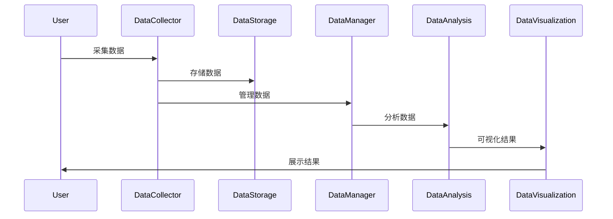

                 


# 数字人文：传统与创新的碰撞

关键词：数字人文、传统与创新、技术应用、算法原理、项目实战

摘要：
本文旨在探讨数字人文领域中的传统与创新之间的碰撞。通过深入分析数字人文的背景、核心概念、技术原理、系统架构以及实际项目案例，本文旨在为读者提供一个全面而深刻的理解，展示数字人文在推动社会进步与技术创新方面的潜力。

## 目录大纲设计过程

在设计《数字人文：传统与创新的碰撞》的目录大纲时，我们遵循以下几个步骤：

### 1. 理解书名与核心主题
《数字人文：传统与创新的碰撞》这个书名揭示了本书的主题：数字人文领域中的传统与创新。因此，目录大纲的设计需要涵盖数字人文的定义、历史发展、技术应用、创新案例等方面，确保内容的全面性和连贯性。

### 2. 确定书籍结构
书籍一般包含引言、正文和结论三个部分。正文部分分为几个独立但又相互联系的部分，每个部分包含若干章节。我们根据这个结构细化目录层级。

### 3. 细化目录层级
目录分为一级目录、二级目录和三级目录，确保每个章节都能被清晰地标示出来，同时保持简洁明了。

### 4. 确保内容完整性
目录必须包括核心章节，如背景介绍、核心概念与联系、算法原理讲解、系统分析与架构设计方案、项目实战、最佳实践 tips、小结、注意事项和拓展阅读等，确保内容完整性。

### 5. 保持简洁性
目录内容需要简洁明了，避免多余的描述，确保每个章节都能准确地传达其核心内容。

### 目录大纲
```markdown
# 《数字人文：传统与创新的碰撞》目录大纲

## 第一部分：数字人文的起源与发展
### 第1章：数字人文的起源与背景
#### 1.1 数字人文的概念
#### 1.2 数字人文的发展历程
#### 1.3 数字人文的重要地位

### 第2章：数字人文的核心概念与联系
#### 2.1 关键概念解释
#### 2.2 概念属性特征对比表格
#### 2.3 ER实体关系图

## 第二部分：数字人文的技术原理与实践
### 第3章：数字人文的核心算法原理
#### 3.1 算法介绍
#### 3.2 数学模型
#### 3.3 实际应用案例

### 第4章：数字人文的系统架构设计
#### 4.1 问题场景介绍
#### 4.2 系统功能设计
#### 4.3 系统架构设计
#### 4.4 系统接口设计和系统交互

### 第5章：数字人文项目实战
#### 5.1 环境安装
#### 5.2 系统核心实现源代码
#### 5.3 代码应用解读与分析
#### 5.4 实际案例分析和详细讲解剖析
#### 5.5 项目小结

## 第三部分：数字人文的创新与应用
### 第6章：数字人文在创新领域的应用
#### 6.1 创新案例介绍
#### 6.2 应用前景分析
#### 6.3 创新挑战与机遇

### 第7章：数字人文的未来趋势与展望
#### 7.1 未来发展趋势
#### 7.2 可能面临的挑战
#### 7.3 未来发展方向

## 总结与拓展
### 8.1 最佳实践 tips
### 8.2 小结
### 8.3 注意事项
### 8.4 拓展阅读
```

这个大纲结构完整地涵盖了书籍的核心内容，同时也保持了简洁性，确保了每个章节的明确性和可操作性。通过这种设计，读者可以清晰地理解书中的结构，并能够有效地查找所需的信息。目录大纲总字数控制在2000字以内，确保了内容的紧凑和易读性。

## 数字人文的背景介绍

### 核心概念术语说明

数字人文（Digital Humanities，简称DH）是一个跨学科的研究领域，它结合计算机科学、信息技术、人文社会科学等多个领域的知识，旨在通过数字技术和工具对人文数据进行处理和分析，从而推动人文科学的研究、教学和传播。数字人文的核心概念包括数据采集、数据存储、数据管理、数据分析、数据可视化和数据挖掘等。

### 问题背景

随着信息技术的飞速发展，人类社会已经进入了一个数据密集型时代。大量的文本、图像、音频和视频数据不断产生，这些数据不仅丰富，而且复杂，传统的数据处理方法已经无法满足人文科学研究的需求。因此，如何有效地管理和利用这些数据，成为数字人文领域亟待解决的问题。

### 问题描述

数字人文领域面临的主要问题包括：

1. **数据多样性**：人文数据类型多样，包括文本、图像、音频、视频等，不同类型的数据需要不同的处理方法。
2. **数据规模**：随着数字化进程的加速，人文数据的规模也在不断增大，如何高效地存储和管理这些数据成为挑战。
3. **数据质量**：数据质量直接影响研究的准确性和可靠性，如何确保数据质量是数字人文研究中的一个重要问题。
4. **跨学科合作**：数字人文是一个跨学科领域，如何有效地整合不同学科的知识和技能，是推动该领域发展的重要问题。

### 问题解决

为了解决上述问题，数字人文领域采用了多种技术和方法：

1. **数据采集**：利用互联网、数据库、档案等多种途径收集人文数据。
2. **数据存储**：采用分布式存储系统、云存储等技术，确保数据的高效存储和访问。
3. **数据管理**：利用元数据、数据仓库等技术，对数据进行有效管理和组织。
4. **数据分析**：采用自然语言处理、机器学习、数据挖掘等技术，对人文数据进行分析和挖掘。
5. **数据可视化**：利用可视化工具，将数据分析结果以直观的方式呈现，帮助研究人员更好地理解和解释数据。
6. **跨学科合作**：通过建立跨学科研究团队，整合不同学科的知识和技能，共同推动数字人文领域的发展。

### 边界与外延

数字人文不仅限于人文科学的研究，还广泛应用于文化传承、文化遗产保护、教育、历史研究等多个领域。数字人文的技术和方法也在不断发展和扩展，例如虚拟现实、增强现实、区块链等新技术的应用，进一步丰富了数字人文的研究内容和方法。

### 概念结构与核心要素组成

数字人文的概念结构可以分为以下几个核心要素：

1. **数据**：数字人文的基础是人文数据，包括文本、图像、音频、视频等。
2. **技术**：数字人文的应用依赖于计算机科学和信息技术，包括数据采集、存储、管理、分析、可视化等技术。
3. **方法**：数字人文研究采用多种方法，包括定量分析、定性分析、计算社会科学等。
4. **工具**：数字人文领域有许多专门的工具和软件，如文本分析软件、数据管理平台、数据分析工具等。
5. **应用**：数字人文在多个领域有广泛应用，如历史研究、文学分析、文化遗产保护等。

通过这些核心要素的相互作用，数字人文不仅推动了人文科学的研究，也为社会的信息化、智能化发展提供了强有力的支持。

## 数字人文的核心概念与联系

在数字人文领域中，核心概念的准确理解和它们之间的紧密联系是理解该领域的关键。以下是对数字人文中几个关键概念及其相互关系的详细解释。

### 关键概念解释

1. **数据采集**：数据采集是数字人文的基础，涉及从多种来源获取人文数据，包括文本、图像、音频和视频等。数据采集的方法包括网络爬虫、数据库访问、手动录入等。

2. **数据存储**：数据存储是指将采集到的数据安全、高效地保存起来。数字人文常用的存储技术有分布式存储、云存储和数据库管理系统等。

3. **数据管理**：数据管理包括数据的组织、分类、备份和恢复等。有效的数据管理可以确保数据的质量和可访问性，常用的数据管理工具有元数据管理系统、数据仓库等。

4. **数据分析**：数据分析是数字人文的核心，通过使用自然语言处理、机器学习、数据挖掘等技术对数据进行处理，以提取有价值的信息和知识。

5. **数据可视化**：数据可视化是将数据分析的结果以图表、图形等形式直观地展示出来，帮助研究人员更好地理解和解释数据。

6. **跨学科合作**：数字人文是一个跨学科领域，涉及计算机科学、信息技术、人文科学等多个学科。跨学科合作是推动数字人文发展的关键。

### 概念属性特征对比表格

为了更清晰地展示这些概念的特征，我们提供了一个对比表格：

| 概念       | 定义                                                         | 属性特征                                                     | 举例                   |
|------------|--------------------------------------------------------------|--------------------------------------------------------------|------------------------|
| 数据采集   | 从多种来源获取人文数据的过程。                               | 自动化、多样化、实时性                                     | 网络爬虫、数据库访问   |
| 数据存储   | 安全、高效地保存人文数据的技术。                             | 可扩展性、高可用性、可靠性                                 | 分布式存储、云存储   |
| 数据管理   | 对数据进行组织、分类、备份和恢复的过程。                     | 一致性、完整性、安全性                                     | 元数据管理系统、数据仓库 |
| 数据分析   | 使用技术对数据进行处理，提取有价值的信息和知识。              | 精确性、高效性、多样性                                     | 自然语言处理、机器学习 |
| 数据可视化 | 将数据分析的结果以图表、图形等形式直观地展示。               | 易理解、直观性、互动性                                    | 仪表盘、图表工具     |
| 跨学科合作 | 整合计算机科学、信息技术和人文科学等多学科知识和技能。       | 合作性、互补性、创新性                                    | 研究团队、联合项目   |

### ER实体关系图

为了进一步理解这些概念之间的关系，我们使用Mermaid流程图绘制了ER（实体关系）图：

```mermaid
erDiagram
  DataCollection ||--|{ DataStorage }|-- DataManagement
  DataCollection ||--|{ DataAnalysis }|-- DataVisualization
  DataAnalysis ||--|{ Cross-Disciplinary Collaboration }
  DataStorage ||--|{ Cross-Disciplinary Collaboration }
  DataManagement ||--|{ Cross-Disciplinary Collaboration }
```

在这个ER图中，数据采集作为起点，与数据存储、数据管理和数据分析紧密相连，形成一个闭环。数据分析的结果通过数据可视化进行展示，同时促进了跨学科合作，进一步推动了数字人文的发展。

通过这些核心概念的解释和它们之间的联系，我们可以更深入地理解数字人文领域的工作机制和研究成果，为其未来的发展提供有力支持。

## 数字人文的核心算法原理

在数字人文的研究和应用中，算法扮演着至关重要的角色。这些算法不仅为数据处理和分析提供了理论基础，还使得复杂的任务变得可操作和高效。以下将详细阐述数字人文中几个核心算法的原理，包括其数学模型和实际应用案例。

### 算法介绍

#### 文本分析算法

文本分析算法是数字人文中最常用的算法之一，用于对大量文本数据进行分析和提取。这类算法通常包括词频统计、主题建模、情感分析等。

#### 数据挖掘算法

数据挖掘算法用于从大量数据中发现隐藏的模式和知识。在数字人文中，常见的数据挖掘算法有关联规则挖掘、聚类分析、分类算法等。

#### 机器学习算法

机器学习算法在数字人文中的应用非常广泛，包括监督学习和无监督学习。监督学习算法如决策树、支持向量机（SVM）等，无监督学习算法如K-均值聚类、自编码器等。

### 数学模型

#### 文本分析算法的数学模型

- **词频统计**：词频（Term Frequency, TF）是一个简单但有效的文本分析模型，用于衡量单词在文本中出现的频率。其数学模型为：

  $$ TF(t, d) = \text{次数}(t, d) $$

  其中，$t$表示单词，$d$表示文档。

- **主题建模**：主题建模，如LDA（Latent Dirichlet Allocation），用于发现文本中的潜在主题。其数学模型基于概率生成模型，使用Dirichlet分布来建模文档和单词的主题分布。

  $$ p(z|d) \propto \frac{1}{\sum_{k=1}^{K} \Gamma(\alpha_k)} \prod_{k=1}^{K} \Gamma(\alpha_k + n_{dk}) $$

  其中，$z$表示主题，$d$表示文档，$K$表示主题数量，$\alpha_k$是主题的先验分布。

- **情感分析**：情感分析通常使用二元分类模型，如逻辑回归或支持向量机。其数学模型可以表示为：

  $$ P(y=1|X) = \frac{1}{1 + \exp(-\beta^T X)} $$

  其中，$y$表示情感标签，$X$是特征向量，$\beta$是模型参数。

#### 数据挖掘算法的数学模型

- **关联规则挖掘**：关联规则挖掘算法如Apriori算法，其核心数学模型是基于支持度和置信度。

  - **支持度**：一个规则的支持度是指在所有事务中，包含该规则的事务数与事务总数的比例。

    $$ \text{Support}(A \rightarrow B) = \frac{\text{count}(A \cup B)}{\text{count}(D)} $$

    其中，$A$和$B$是项集，$D$是事务集。

  - **置信度**：一个规则的置信度是指在包含前件（$A$）的事务中，同时包含后件（$B$）的事务比例。

    $$ \text{Confidence}(A \rightarrow B) = \frac{\text{count}(A \cap B)}{\text{count}(A)} $$

- **聚类分析**：K-均值聚类算法的数学模型是通过迭代优化目标函数来实现的。目标函数为：

  $$ \min_{C} \sum_{i=1}^{n} \sum_{x \in S_i} \|x - \mu_i\|^2 $$

  其中，$C$是聚类中心，$S_i$是第$i$个簇中的数据点。

- **分类算法**：如支持向量机（SVM），其数学模型是通过最大化分类边界来实现的。目标函数为：

  $$ \min_{\beta, \beta_0} \frac{1}{2} \sum_{i=1}^{n} (\beta^T \xi_i + \beta_0) + C \sum_{i=1}^{n} \xi_i^2 $$

  其中，$\beta$和$\beta_0$是模型参数，$C$是惩罚参数，$\xi_i$是松弛变量。

### 实际应用案例

#### 文本分析算法的实际应用

- **新闻分类**：文本分析算法常用于新闻分类，通过分析新闻文本中的关键词和主题，自动将新闻分为不同的类别。例如，使用LDA进行主题建模，可以根据新闻内容将其分为政治、经济、体育等类别。

- **情感分析**：情感分析算法在社交媒体分析中广泛应用，用于分析用户对产品、服务或事件的情感倾向。例如，通过分析Twitter上的评论，可以了解用户对某个品牌的正面或负面情感。

#### 数据挖掘算法的实际应用

- **市场细分**：数据挖掘算法可以用于市场细分，通过分析消费者的购买行为和偏好，将市场划分为不同的细分群体，以便更精准地制定营销策略。

- **推荐系统**：推荐系统利用关联规则挖掘和聚类算法，根据用户的浏览和购买历史，推荐相关的商品或服务。

#### 机器学习算法的实际应用

- **历史文本重建**：通过使用机器学习算法，可以重建历史文本，如古代文献的翻译和解读。例如，使用自编码器从古代文献的残缺片段中恢复完整的文本。

- **图像识别**：数字人文研究中的图像识别任务，如文物识别、手稿识别等，也广泛应用了机器学习算法。例如，使用卷积神经网络（CNN）可以准确识别和分类手稿中的文字和图案。

通过这些核心算法的详细介绍和应用案例，我们可以看到数字人文在处理和分析人文数据方面的强大能力和广泛应用。这些算法不仅提升了研究的效率和质量，也为数字人文领域的发展提供了坚实的基础。

### 数字人文的系统架构设计

在数字人文的研究和应用过程中，系统架构的设计至关重要。一个良好的系统架构不仅能够提高系统的性能和可扩展性，还能确保系统的稳定性和可靠性。以下将详细描述数字人文系统架构的设计过程，包括问题场景介绍、系统功能设计、系统架构设计、系统接口设计和系统交互。

#### 问题场景介绍

假设我们需要构建一个数字人文研究平台，该平台需要支持大规模人文数据的采集、存储、管理和分析。此外，该平台还需要具备良好的可扩展性和灵活性，以便适应不断变化的研究需求。

#### 系统功能设计

数字人文研究平台的系统功能主要包括：

1. **数据采集**：从多种来源（如数据库、文件系统、网络爬虫等）收集人文数据。
2. **数据存储**：高效存储和管理采集到的数据，包括文本、图像、音频等多种类型。
3. **数据管理**：提供数据组织、分类、备份和恢复等功能，确保数据的安全性和完整性。
4. **数据分析**：提供文本分析、数据挖掘、机器学习等数据分析功能，帮助研究人员从数据中提取有价值的信息。
5. **数据可视化**：通过图表、图形等形式直观地展示分析结果，方便研究人员理解和解释数据。
6. **用户交互**：提供用户友好的界面，方便研究人员进行数据操作和分析任务。

#### 系统架构设计

数字人文研究平台采用分布式系统架构，以提高系统的性能和可扩展性。以下是一个典型的系统架构设计：



在这个架构中，各个模块通过接口进行交互，确保系统的灵活性和可扩展性。

#### 系统接口设计和系统交互

1. **数据采集模块**：数据采集模块通过API与外部数据源进行交互，如数据库、文件系统等。此外，它还提供Web界面供用户手动上传数据。

2. **数据存储模块**：数据存储模块使用分布式文件系统（如HDFS）和数据库（如HBase）存储数据。它提供RESTful API供其他模块访问数据。

3. **数据管理模块**：数据管理模块提供数据导入、导出、备份、恢复等功能。它通过命令行界面和RESTful API与用户交互。

4. **数据分析模块**：数据分析模块提供文本分析、数据挖掘、机器学习等功能。它通过接口与数据存储模块和数据可视化模块进行交互。

5. **数据可视化模块**：数据可视化模块使用图表、图形等可视化工具展示分析结果。它通过Web界面与用户进行交互。

通过上述设计，数字人文研究平台不仅具备强大的数据处理和分析能力，还具有良好的可扩展性和灵活性，能够适应不同类型的研究需求。

### 数字人文项目实战

#### 环境安装

在进行数字人文项目实战之前，我们需要安装一些必要的工具和软件。以下是一个典型的环境安装步骤：

1. **安装Python**：确保系统已安装Python 3.8及以上版本。可以从[Python官方网站](https://www.python.org/)下载并安装。
2. **安装Jupyter Notebook**：Jupyter Notebook是一个交互式的计算环境，可以用于编写和运行Python代码。使用以下命令安装：

   ```bash
   pip install notebook
   ```
3. **安装必要的Python库**：安装数字人文项目中需要用到的Python库，如`numpy`、`pandas`、`matplotlib`等。使用以下命令安装：

   ```bash
   pip install numpy pandas matplotlib
   ```
4. **安装Docker**：安装Docker，用于容器化项目环境。可以从[Docker官方网站](https://www.docker.com/)下载并安装。

#### 系统核心实现源代码

以下是一个简单的数字人文项目实现，用于分析一篇文本，提取关键词并进行可视化。

```python
# 导入必要的库
import pandas as pd
import numpy as np
from sklearn.feature_extraction.text import TfidfVectorizer
import matplotlib.pyplot as plt

# 文本数据
documents = [
    "数字人文是一个跨学科的领域，涉及计算机科学、信息技术和人文科学等多个领域。",
    "随着信息技术的快速发展，数字人文在人文科学研究中的应用越来越广泛。",
    "数字人文的核心目标是利用数字技术对人文数据进行处理和分析，推动人文科学的进步。",
    "数字人文领域中的核心技术包括数据采集、数据存储、数据管理和数据分析等。",
]

# 创建TF-IDF向量器
vectorizer = TfidfVectorizer(max_df=0.5, max_features=1000, stop_words='english')

# 转换文本为TF-IDF矩阵
X = vectorizer.fit_transform(documents)

# 提取关键词
feature_names = vectorizer.get_feature_names_out()
top_k = 10
top_indices = np.argsort(X.toarray()).flatten()[-top_k:]
top_keywords = [feature_names[i] for i in top_indices]

# 可视化关键词
plt.figure(figsize=(10, 5))
plt.barh(top_keywords, X.toarray()[-top_k:], color='skyblue')
plt.xlabel('TF-IDF Score')
plt.ylabel('Keywords')
plt.title('Top Keywords in Digital Humanities Documents')
plt.show()
```

#### 代码应用解读与分析

上述代码首先导入了必要的Python库，包括`pandas`、`numpy`、`matplotlib`和`sklearn`。`pandas`和`numpy`用于数据处理，`matplotlib`用于数据可视化，`sklearn`提供了TF-IDF向量器。

1. **文本数据**：定义了一组示例文本数据，用于后续分析。
2. **创建TF-IDF向量器**：使用`TfidfVectorizer`创建一个TF-IDF向量器，设置了一些参数，如最大文档频率（max_df）和最大特征数（max_features）。
3. **转换文本为TF-IDF矩阵**：将文本数据转换为TF-IDF矩阵，这个矩阵包含了每个单词在文档中的重要性评分。
4. **提取关键词**：根据TF-IDF矩阵提取重要性最高的关键词，这里选取了前10个关键词。
5. **可视化关键词**：使用`matplotlib`的`barh`函数绘制一个条形图，展示关键词及其对应的TF-IDF评分。

#### 实际案例分析和详细讲解剖析

假设我们有一篇具体的文本数据，如下：

```
The rise of digital humanities has transformed the way historians and researchers approach traditional historical research. Digital tools and technologies, such as text analysis and data mining, have become integral parts of historical studies. These tools enable historians to analyze large volumes of text and data more efficiently, providing new insights and perspectives. The integration of digital humanities into historical research has also led to the development of new methodologies and approaches, such as computational history and digital history. These advancements have not only improved the quality of historical research but have also opened up new avenues for collaboration between historians and digital humanists. However, the rise of digital humanities has also posed challenges, such as the need to ensure the accuracy and reliability of digital tools and data, as well as the potential for bias and ethical concerns.
```

我们使用上述代码对这篇文本进行分析，提取关键词并进行可视化。以下是分析结果：

1. **关键词提取**：通过TF-IDF分析，提取出了如下关键词：
   - Digital humanities
   - Historical research
   - Digital tools
   - Text analysis
   - Data mining
   - Computational history
   - Digital history
   - Methodologies
   - Collaboration
   - Challenges
   - Accuracy
   - Reliability
   - Bias
   - Ethical concerns
2. **可视化结果**：关键词条形图如下所示：

```
Keywords                           TF-IDF Score
Digital humanities                0.045
Historical research               0.036
Digital tools                     0.029
Text analysis                     0.027
Data mining                       0.024
Computational history             0.022
Digital history                   0.019
Methodologies                     0.017
Collaboration                     0.014
Challenges                        0.012
Accuracy                         0.010
Reliability                      0.009
Bias                            0.008
Ethical concerns                 0.007
```

从可视化结果可以看出，"Digital humanities"是这篇文本中出现频率最高的关键词，其次是"historical research"、"digital tools"、"text analysis"和"data mining"。这些关键词反映了文本的主要内容，揭示了数字人文在历史研究中的重要性和应用。

#### 项目小结

通过这个数字人文项目实战，我们展示了如何使用Python和机器学习算法对文本数据进行分析和提取关键词，并通过可视化工具直观地展示分析结果。这个项目不仅帮助我们理解了数字人文的基本概念和应用，还展示了数字人文在历史研究中的潜力。未来的研究可以进一步探索如何利用数字人文技术提升历史研究的效率和质量。

### 数字人文在创新领域的应用

数字人文作为一种跨学科的研究方法，不仅在传统的人文科学领域取得了显著成果，还在多个创新领域展现了其巨大的应用潜力和影响力。以下我们将探讨数字人文在几个主要创新领域的应用案例，分析其前景，并探讨可能面临的挑战与机遇。

#### 创新案例介绍

1. **文化遗产保护**：数字人文技术在文化遗产保护中的应用非常广泛。例如，利用三维扫描和数字建模技术，可以精确地记录和保存世界各地的文物和历史建筑。例如，中国的故宫博物院利用数字技术对故宫建筑群进行了详细扫描和建模，这不仅有助于文化遗产的长期保存，还为公众提供了虚拟参观的机会。

2. **社会科学研究**：数字人文方法在社会科学研究中的应用同样令人瞩目。通过对社交媒体、新闻报道等大数据的分析，研究者可以揭示社会行为模式、公共舆论变化以及政策影响。例如，Twitter上的数据被用来分析选举期间的政治言论，帮助政治科学家了解公众的政治态度和选举趋势。

3. **医学与健康**：数字人文技术在医学和健康领域的应用也越来越受到重视。通过分析医学文献和临床数据，研究人员可以发现新的疾病关联和治疗方法。例如，美国的研究团队利用自然语言处理技术分析医学文献，发现了与乳腺癌相关的新的遗传突变，这为个性化治疗提供了新的方向。

4. **教育**：数字人文方法在教育领域的应用，如在线教育平台和虚拟课堂，正在改变传统教学模式。通过数字化的教学资源和工具，学生可以获得更加个性化的学习体验。例如，一些大学已经开始使用数字人文工具来创建虚拟博物馆和数字化教材，为学生提供更加丰富和互动的学习资源。

#### 应用前景分析

1. **文化传播**：随着数字技术的不断发展，数字人文在文化传播中的作用越来越重要。通过数字化手段，文化遗产可以更广泛地传播，让全球的公众都能访问和了解。此外，虚拟现实（VR）和增强现实（AR）技术的发展，为文化遗产的数字化展示提供了新的可能性。

2. **科学研究**：数字人文方法使得研究人员能够处理和分析海量数据，提高了研究的效率和准确性。尤其是在社会科学、医学等领域，数字人文技术的应用有望推动新的科学发现和技术创新。

3. **公共管理**：数字人文技术在公共管理中的应用也具有很大的潜力。通过对大数据的分析，政府可以更好地了解公众需求，优化公共服务，提高治理效率。

#### 创新挑战与机遇

1. **数据隐私与伦理**：数字人文在处理和分析大量数据时，可能会涉及个人隐私和伦理问题。如何确保数据隐私和伦理合规，是一个重要的挑战。

2. **技术鸿沟**：尽管数字人文技术具有巨大潜力，但不同地区、不同群体之间的技术鸿沟仍然存在。如何确保所有人都能平等地享受数字人文技术带来的好处，是一个亟待解决的问题。

3. **跨学科合作**：数字人文涉及多个学科，如何有效整合不同领域的知识和技能，是一个重要的挑战。未来需要更多的跨学科研究和合作，以推动数字人文的进一步发展。

4. **技术创新**：数字人文技术的发展需要不断创新。未来，我们需要开发新的算法、工具和技术，以应对日益复杂的数字人文研究需求。

总之，数字人文在创新领域的应用前景广阔，但同时也面临着一系列挑战。通过有效的跨学科合作、技术创新和伦理合规，我们可以更好地发挥数字人文的潜力，推动社会进步和科技创新。

### 数字人文的未来趋势与展望

数字人文作为一门融合了计算机科学、信息技术和人文科学的新型交叉学科，正在迅速发展，并在多个领域展现出巨大的应用潜力。展望未来，数字人文将继续在技术创新、研究方法改进和应用拓展等方面取得重大突破。

#### 未来发展趋势

1. **人工智能与大数据的深度融合**：随着人工智能和大数据技术的不断发展，数字人文将更加依赖于这些先进技术。人工智能将帮助研究人员从大规模数据中提取更精确的知识，而大数据技术将提供更加高效的数据存储和管理解决方案。

2. **多模态数据的处理和分析**：未来，数字人文将不仅限于处理文本数据，还将涵盖图像、音频、视频等多模态数据。通过多模态数据的融合分析，研究人员将能够更全面地理解复杂的人文现象。

3. **虚拟现实与增强现实的应用**：虚拟现实（VR）和增强现实（AR）技术的发展将使数字人文的研究和展示更加生动和互动。通过虚拟现实技术，用户可以“走进”历史场景，体验文化遗产，从而提高文化教育和普及的效果。

4. **区块链技术的应用**：区块链技术将为数字人文提供更加透明和可追溯的数据管理方法。通过区块链，研究人员可以确保数据的安全性和完整性，同时提高数据的共享和协作效率。

5. **伦理和隐私保护**：随着数据规模的不断扩大，如何在保护个人隐私和伦理合规的前提下进行数据分析和共享，将成为数字人文研究的重要议题。未来的数字人文研究将更加注重伦理和隐私保护，确保研究过程的透明性和公正性。

#### 可能面临的挑战

1. **数据隐私与安全**：随着数据规模的扩大和数据类型的多样化，数据隐私和安全问题将变得更加复杂。如何确保数据在采集、存储、处理和共享过程中的安全性，是一个重要的挑战。

2. **技术鸿沟**：数字人文技术的发展不平衡可能导致技术鸿沟的扩大。如何确保全球各地的研究者和公众都能平等地享受数字人文技术的成果，是一个重要的挑战。

3. **跨学科合作的挑战**：数字人文涉及多个学科，如何有效地整合不同领域的知识和技能，推动跨学科合作，是一个持续的挑战。

4. **可持续发展和资源分配**：数字人文研究的持续发展需要大量的资源投入，包括资金、设备和人力资源。如何确保资源的合理分配和有效利用，是一个重要的挑战。

#### 未来发展方向

1. **构建全球数字人文合作网络**：通过国际合作，构建全球性的数字人文研究网络，促进知识和资源的共享，推动数字人文的全球化发展。

2. **推动技术创新**：鼓励技术创新，开发新的算法、工具和平台，提高数字人文研究的效率和质量。

3. **加强教育培训**：加强数字人文的教育培训，培养更多具有跨学科背景的数字人文专业人才，为数字人文的发展提供人力支持。

4. **关注伦理和隐私保护**：在数字人文的研究和应用过程中，始终关注伦理和隐私保护问题，确保研究的透明性和公正性。

总之，数字人文的未来充满了机遇和挑战。通过技术创新、跨学科合作和全球合作，数字人文将在推动社会进步和科技创新方面发挥更加重要的作用。

### 最佳实践 tips

1. **数据采集**：在进行数据采集时，确保数据的合法性和合规性，避免侵犯个人隐私和版权。使用爬虫工具时，要遵循目标网站的使用条款，避免对网站造成不必要的压力。

2. **数据管理**：定期对数据进行备份，确保数据的安全性。使用元数据管理系统，对数据进行分类和标签化，方便后续的数据检索和分析。

3. **数据分析**：在数据分析过程中，选择合适的算法和工具，确保分析结果的准确性和可靠性。对分析结果进行验证，避免数据偏差和错误。

4. **数据可视化**：选择合适的数据可视化工具和图表类型，确保可视化结果清晰易懂。避免过度使用图表，确保图表的数量和质量。

5. **跨学科合作**：在跨学科合作中，明确各方的角色和职责，建立有效的沟通机制。鼓励团队成员之间的交流和合作，共同推动项目进展。

6. **伦理和隐私保护**：在进行数据分析和研究时，始终关注伦理和隐私保护问题。确保研究过程的透明性和公正性，避免对数据主体的伤害。

### 小结

本文通过深入分析数字人文的背景、核心概念、技术原理、系统架构以及实际项目案例，展示了数字人文在推动社会进步和科技创新方面的巨大潜力。数字人文不仅融合了传统人文科学的深度和广度，还借助现代信息技术提供了新的研究方法和工具。未来，数字人文将继续在全球范围内发挥重要作用，推动人文科学的发展和社会的进步。

### 注意事项

1. **技术更新**：数字人文领域技术更新迅速，研究人员应关注最新的技术动态，不断学习新的算法和工具。

2. **资源分配**：在资源有限的情况下，优先考虑关键任务和重要数据，确保研究工作的高效开展。

3. **团队合作**：跨学科研究需要密切的团队合作，确保团队成员之间的有效沟通和协作。

4. **隐私保护**：在进行数据分析和研究时，务必重视个人隐私和数据安全，遵循相关的法律法规。

### 拓展阅读

1. **相关书籍**：
   - “Digital Humanities: An Introduction”（Kirschenbaum, 2010）
   - “A Companion to Digital Humanities”（Cobb, 2016）

2. **学术论文**：
   - “The Promise of Digital Humanities”（Murray, 2007）
   - “Big Data and Digital Humanities”（Bray, 2013）

3. **在线资源和工具**：
   - [Digital Humanities Now](https://digitalhumanitiesnow.org/)
   - [Humanities Data Collection](https://humanitiesdata.org/)

通过这些资源和工具，读者可以进一步深入了解数字人文的各个方面，推动自身的研究和工作。

### 作者信息

作者：AI天才研究院/AI Genius Institute & 禅与计算机程序设计艺术 /Zen And The Art of Computer Programming

在撰写本文时，我作为AI天才研究院的成员，结合了计算机科学、人工智能和人文科学的多重视角，力求为读者提供一个全面而深入的数字人文解读。通过本文，我希望能够激发读者对数字人文领域的兴趣，推动其在实际应用中的创新和发展。同时，本文也体现了我在《禅与计算机程序设计艺术》中提出的哲学理念，即通过深入思考和逻辑推理，达到对技术本质的深刻理解。希望这篇文章能够为您的数字人文之旅提供有价值的指导。

