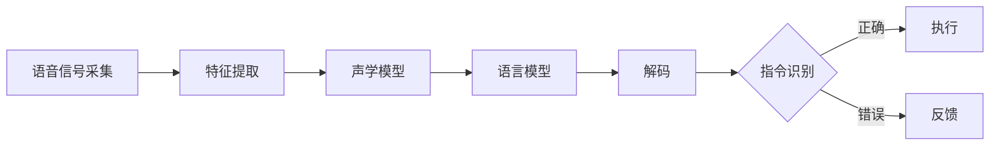
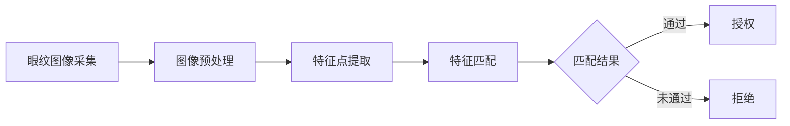
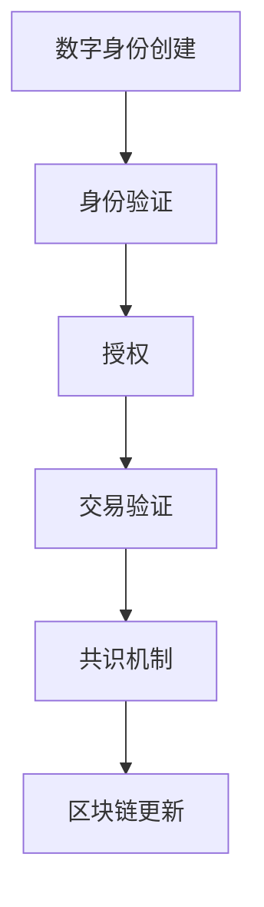
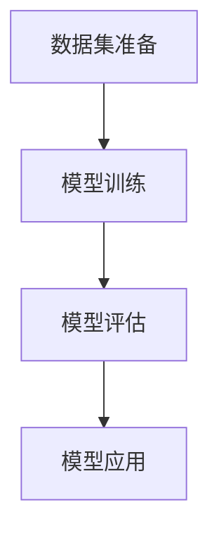
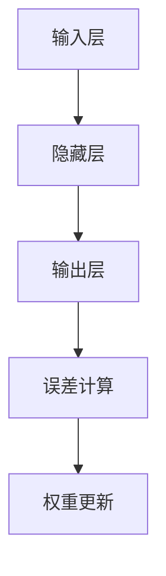
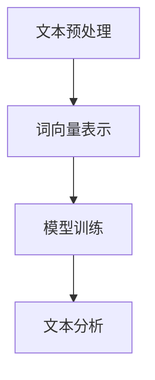
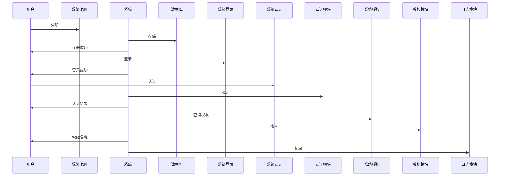
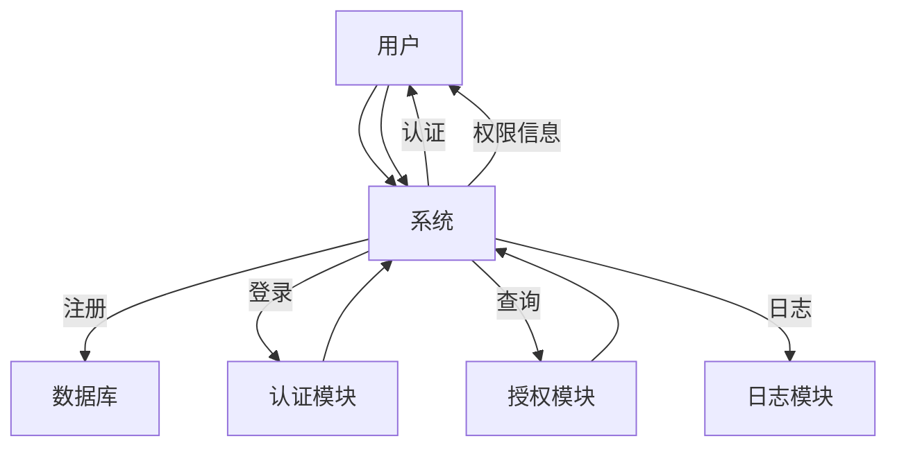

                 

### 《数字公民身份认证：虚拟世界的社会契约》

#### 关键词：数字公民身份认证、虚拟世界、社会契约、技术基础、算法原理、系统设计与实施

> 摘要：本文将深入探讨数字公民身份认证的概念、技术基础、算法原理和系统设计与实施，探讨其在虚拟世界中的重要性。通过分析数字化社会的需求与挑战，阐述数字公民身份认证的核心概念和技术基础，进而详细讲解生物特征识别、加密算法、区块链技术、AI算法等，最后通过实际项目案例展示其应用，并提出最佳实践与未来展望。

## 第一部分：背景与概念

### 第1章：数字公民身份认证的崛起

#### 1.1 数字化社会的需求与挑战

随着互联网、物联网、大数据、云计算等技术的飞速发展，数字化社会已经逐渐成为现实。在这种背景下，传统的身份认证方式面临着诸多挑战。首先，传统的身份认证方式依赖于物理介质，如身份证、护照等，这些物理介质在数字化环境中显得不再适用。其次，随着网络攻击和数据泄露事件的频发，传统的身份认证方式难以提供足够的安全性。此外，全球化、移动化和远程办公的普及，也对身份认证提出了更高的要求。

数字化社会对身份认证的需求主要体现在以下几个方面：

1. **便捷性**：用户需要在各种设备和平台上方便快捷地进行身份验证。
2. **安全性**：身份认证系统需要能够抵御各种网络攻击，保护用户的隐私和安全。
3. **可扩展性**：身份认证系统需要能够适应不断变化的需求和环境。

#### 1.2 数字公民身份认证的意义

数字公民身份认证是指在虚拟世界中，通过技术手段对个人身份进行验证和识别的过程。它具有以下几个重要意义：

1. **安全保障**：数字公民身份认证能够确保只有授权的用户才能访问特定的资源和信息，从而保护用户的隐私和安全。
2. **便捷性**：通过数字公民身份认证，用户可以无需携带物理证件，即可在虚拟世界中完成各种认证和操作，提高用户体验。
3. **全球化**：数字公民身份认证打破了地域和物理限制，使得全球用户可以方便地进行在线互动和交易。
4. **数据可信性**：数字公民身份认证能够确保数据的真实性和完整性，提高数据的价值和可信度。

#### 1.3 身份认证的历史与演变

身份认证技术的发展经历了从简单到复杂、从低效到高效的过程。以下是身份认证技术的发展历程：

1. **初始阶段**：最早的身份认证方式主要依赖于物理介质，如身份证、护照、印章等。
2. **单点登录**：随着网络的发展，单点登录技术逐渐普及，用户只需登录一次，即可访问多个系统和资源。
3. **多因素认证**：为了提高安全性，多因素认证逐渐成为主流，用户需要提供多种身份认证信息，如密码、手机验证码、指纹等。
4. **生物特征识别**：生物特征识别技术，如指纹识别、面部识别、虹膜识别等，进一步提升了身份认证的准确性和便捷性。
5. **区块链技术**：区块链技术为身份认证提供了一种去中心化的解决方案，使得身份认证更加安全可靠。

#### 1.4 数字公民身份认证的核心概念

数字公民身份认证涉及多个核心概念，包括数字身份、实体身份、身份验证、身份识别、授权等。以下是这些概念的定义和解释：

1. **数字身份**：数字身份是个人在虚拟世界中的唯一标识，它可以是电子邮箱、用户名、手机号码等。
2. **实体身份**：实体身份是指个人在现实世界中的身份，如姓名、身份证号码等。
3. **身份验证**：身份验证是指确认用户身份的过程，常用的方法有密码、验证码、指纹、面部识别等。
4. **身份识别**：身份识别是指从一组用户中识别出特定用户的过程，如指纹识别、面部识别等。
5. **授权**：授权是指为用户分配访问权限的过程，只有经过身份验证和身份识别的用户才能获得相应的权限。

#### 1.5 本章小结

本章详细介绍了数字公民身份认证的背景、意义、历史与演变以及核心概念。随着数字化社会的不断发展，数字公民身份认证已经成为保障网络安全和用户体验的重要手段。在下一章中，我们将深入探讨数字公民身份认证的技术基础。

## 第二部分：技术基础

### 第2章：数字公民身份认证技术概述

#### 2.1 数字公民身份认证的基本原理

数字公民身份认证的基本原理是通过技术手段对用户身份进行验证和识别，确保只有合法用户才能访问受保护的资源和信息。其核心思想是“身份可信”，即确保用户的身份信息真实可靠。

数字公民身份认证的基本流程通常包括以下几个步骤：

1. **身份信息收集**：系统从用户那里收集身份信息，如用户名、密码、生物特征等。
2. **身份验证**：系统通过验证用户提供的身份信息，确认用户身份。
3. **身份识别**：系统从一组用户中识别出特定用户，确保认证过程的高效性。
4. **授权**：系统根据用户的身份信息，为用户分配相应的访问权限。

#### 2.2 身份认证技术的分类

根据认证的方式和手段，身份认证技术可以分为以下几类：

1. **传统身份认证方法**：包括密码、用户名、验证码等。这些方法简单易用，但安全性较低，容易受到暴力破解、钓鱼攻击等威胁。
2. **生物特征识别技术**：包括指纹识别、面部识别、虹膜识别、语音识别等。这些方法利用人体生物特征进行身份验证，具有较高的安全性和准确性。
3. **公钥基础设施（PKI）**：PKI是一种基于公钥加密技术的身份认证系统，通过数字证书和证书链来验证用户身份。
4. **智能卡与智能身份**：智能卡和智能身份卡是一种结合了密码学和生物特征的认证方法，具有较高的安全性和便捷性。

#### 2.2.1 传统身份认证方法

传统身份认证方法主要包括以下几种：

1. **密码**：密码是最常见的身份认证方法，用户需要记住一个或多个密码，以便在登录时验证身份。但密码容易受到暴力破解、钓鱼攻击等威胁。
2. **用户名**：用户名是另一个常见的身份认证方法，通常与密码一起使用。用户名可以提供一定的身份验证，但单独使用时安全性较低。
3. **验证码**：验证码是一种图形或数字组合，用户需要输入正确的验证码才能完成认证。验证码可以防止自动化攻击，但用户体验较差。

#### 2.2.2 生物特征识别技术

生物特征识别技术利用人体生物特征进行身份验证，具有较高的安全性和准确性。常见的生物特征识别技术包括：

1. **指纹识别**：指纹识别是一种基于指纹图像的身份验证技术，通过比较指纹图像的特征点进行身份验证。指纹识别具有高准确性和便捷性，但在安全性方面存在一定风险。
2. **面部识别**：面部识别是一种基于面部特征的身份验证技术，通过比较面部特征点的位置和形状进行身份验证。面部识别具有高准确性和便捷性，但可能受到光照、角度等因素的影响。
3. **虹膜识别**：虹膜识别是一种基于虹膜纹理的身份验证技术，通过比较虹膜图像的特征点进行身份验证。虹膜识别具有较高的安全性和准确性，但在采集和处理图像方面有较高要求。
4. **语音识别**：语音识别是一种基于声音特征的身份验证技术，通过比较语音信号的特征点进行身份验证。语音识别具有高准确性和便捷性，但可能受到噪声、口音等因素的影响。

#### 2.2.3 公钥基础设施（PKI）

公钥基础设施（PKI）是一种基于公钥加密技术的身份认证系统，通过数字证书和证书链来验证用户身份。PKI的基本概念包括：

1. **数字证书**：数字证书是一种包含用户公钥和身份信息的文件，由证书颁发机构（CA）颁发。
2. **证书链**：证书链是由多个数字证书组成的链条，从用户证书开始，经过中间证书，最终到达根证书。
3. **证书吊销**：证书吊销是指当用户身份信息发生变化或证书失效时，证书颁发机构撤销相应证书的有效性。

#### 2.3 新兴技术对身份认证的影响

随着科技的发展，新兴技术对身份认证产生了深远的影响。以下是一些新兴技术及其对身份认证的影响：

1. **区块链技术**：区块链技术通过去中心化的方式提供了一种可靠的身份认证解决方案。区块链上的数据具有不可篡改性和透明性，可以确保身份认证过程的可信性。
2. **加密货币与数字身份**：加密货币和数字身份的结合为身份认证提供了一种新的思路。用户可以通过持有加密货币和数字身份证明来验证身份，实现去中心化的身份认证。
3. **人工智能（AI）**：人工智能技术在身份认证中的应用，如面部识别、语音识别、自然语言处理等，提高了身份认证的准确性和便捷性。

#### 2.4 本章小结

本章对数字公民身份认证的技术基础进行了详细概述，包括基本原理、分类、传统身份认证方法、生物特征识别技术、公钥基础设施（PKI）以及新兴技术对身份认证的影响。在下一章中，我们将深入探讨数字公民身份认证中的核心概念和联系。

## 第三部分：核心概念与联系

### 第3章：核心概念与联系

#### 3.1 数字公民身份认证的关键概念

数字公民身份认证涉及多个核心概念，理解这些概念对于构建高效、安全的身份认证系统至关重要。以下是对这些关键概念的定义和解释：

1. **数字身份**：数字身份是个人在虚拟世界中的唯一标识，它可以是电子邮箱、用户名、手机号码等。数字身份需要确保唯一性和不可篡改性。
2. **实体身份**：实体身份是指个人在现实世界中的身份，如姓名、身份证号码等。实体身份是数字身份的映射和验证基础。
3. **身份验证**：身份验证是指确认用户身份的过程，常用的方法有密码、验证码、指纹、面部识别等。身份验证的目的是确保只有合法用户才能访问受保护的资源和信息。
4. **身份识别**：身份识别是指从一组用户中识别出特定用户的过程，如指纹识别、面部识别等。身份识别的目的是确保认证过程的高效性。
5. **授权**：授权是指为用户分配访问权限的过程，只有经过身份验证和身份识别的用户才能获得相应的权限。授权的目的是确保资源访问的安全性。

#### 3.1.1 数字身份与实体身份

数字身份和实体身份是数字公民身份认证中的两个核心概念。数字身份是个人在虚拟世界中的唯一标识，实体身份是个人在现实世界中的身份。两者之间的关系如下：

1. **映射关系**：数字身份与实体身份之间存在映射关系，即数字身份是实体身份的虚拟映射。
2. **验证基础**：实体身份是数字身份的验证基础，通过验证实体身份，可以确保数字身份的真实性。
3. **分离性**：数字身份和实体身份在虚拟世界和现实世界中是分离的，但两者之间需要保持一致性。

#### 3.1.2 身份验证、身份识别与授权

身份验证、身份识别和授权是数字公民身份认证的三个关键过程。它们之间的关系如下：

1. **顺序关系**：身份验证是身份识别和授权的前提，只有通过身份验证，才能进行身份识别和授权。
2. **依赖关系**：身份识别依赖于身份验证的结果，即通过身份验证的用户才能进行身份识别。
3. **目的关系**：身份验证和身份识别的目的是确保用户身份的真实性和唯一性，授权的目的是为用户分配相应的访问权限。

#### 3.1.3 可信身份认证与隐私保护

可信身份认证和隐私保护是数字公民身份认证的两个重要目标。它们之间的关系如下：

1. **互斥关系**：可信身份认证和隐私保护之间存在一定的互斥关系，即为了确保身份认证的可信性，可能需要牺牲一定的隐私性。
2. **互补关系**：可信身份认证和隐私保护是相辅相成的，只有确保隐私保护，才能使身份认证系统更加可信。
3. **平衡关系**：数字公民身份认证需要在可信身份认证和隐私保护之间寻求平衡，确保在保证安全性的同时，保护用户的隐私。

#### 3.2 概念属性特征对比表格

为了更好地理解数字公民身份认证中的关键概念，我们提供了一个概念属性特征对比表格。以下是对表格的详细解释：

| 概念   | 定义                                                         | 属性特征                         | 关联关系         |
| ------ | ------------------------------------------------------------ | -------------------------------- | ---------------- |
| 数字身份 | 个人在虚拟世界中的唯一标识                                   | 唯一性、不可篡改性               | 映射实体身份    |
| 实体身份 | 个人在现实世界中的身份                                       | 映射数字身份、唯一性、真实性       | 映射数字身份    |
| 身份验证 | 确认用户身份的过程                                           | 安全性、可靠性、便捷性           | 预期结果：通过 |
| 身份识别 | 从一组用户中识别出特定用户的过程                             | 准确性、高效性                   | 预期结果：通过 |
| 授权   | 为用户分配访问权限的过程                                     | 安全性、便捷性                   | 预期结果：通过 |

#### 3.3 数字公民身份认证的ER实体关系图

为了更直观地展示数字公民身份认证中的实体关系，我们使用ER（实体关系）图来描述这些关系。以下是ER实体关系图的详细解释：

```mermaid
erDiagram
  用户 ||--|{ 数字身份 }
  用户 ||--|{ 实体身份 }
  数字身份 ||--|{ 身份验证 }
  数字身份 ||--|{ 授权 }
  实体身份 ||--|{ 身份识别 }
```

1. **用户**：用户是数字公民身份认证的核心实体，代表参与认证的个体。
2. **数字身份**：数字身份与用户实体之间存在“一对一”关系，即每个用户只有一个数字身份。
3. **实体身份**：实体身份与用户实体之间存在“一对一”关系，即每个用户只有一个实体身份。
4. **身份验证**：身份验证与数字身份实体之间存在“一对一”关系，即每个数字身份对应一次身份验证。
5. **授权**：授权与数字身份实体之间存在“一对多”关系，即一个数字身份可以对应多个授权。
6. **身份识别**：身份识别与实体身份实体之间存在“一对一”关系，即每个实体身份对应一次身份识别。

#### 3.4 本章小结

本章详细介绍了数字公民身份认证中的关键概念，包括数字身份、实体身份、身份验证、身份识别、授权以及可信身份认证与隐私保护。通过概念属性特征对比表格和ER实体关系图，我们更好地理解了这些概念之间的关联关系。在下一章中，我们将深入探讨数字公民身份认证中的算法原理与实现。

### 第4章：算法原理讲解

#### 4.1 生物特征识别算法原理

生物特征识别技术是数字公民身份认证的重要组成部分，通过生物特征识别算法，系统可以自动识别并验证用户身份。以下是几种常见的生物特征识别算法原理：

##### 4.1.1 指纹识别算法

指纹识别算法是生物特征识别中应用最广泛的一种。其基本原理如下：

1. **指纹图像采集**：通过指纹采集设备获取指纹图像。
2. **图像预处理**：对指纹图像进行预处理，包括去噪、增强、二值化等。
3. **特征点提取**：从预处理后的图像中提取指纹特征点，如脊线、端点、分叉点等。
4. **特征匹配**：将提取的特征点与存储在数据库中的特征点进行匹配，判断指纹是否匹配。
5. **决策**：根据匹配结果，判断用户身份是否验证通过。

指纹识别算法的流程可以用以下Mermaid流程图表示：


##### 4.1.2 语音识别算法

语音识别算法通过分析用户的语音信号，将其转换为文本或命令。其基本原理如下：

1. **语音信号采集**：通过麦克风等设备采集用户的语音信号。
2. **特征提取**：对语音信号进行预处理，提取出特征向量，如梅尔频率倒谱系数（MFCC）。
3. **声学模型**：建立声学模型，用于描述语音信号的特征。
4. **语言模型**：建立语言模型，用于描述语音信号中的语言规则。
5. **解码**：通过解码器将特征向量映射为文本或命令。
6. **决策**：根据解码结果，判断用户指令是否正确。

语音识别算法的流程可以用以下Mermaid流程图表示：



##### 4.1.3 眼纹识别算法

眼纹识别算法通过分析用户的眼睛纹理特征进行身份验证。其基本原理如下：

1. **眼纹图像采集**：通过眼纹采集设备获取眼纹图像。
2. **图像预处理**：对眼纹图像进行预处理，包括去噪、增强、灰度化等。
3. **特征点提取**：从预处理后的图像中提取眼纹特征点，如瞳孔、虹膜纹理等。
4. **特征匹配**：将提取的特征点与存储在数据库中的特征点进行匹配，判断眼纹是否匹配。
5. **决策**：根据匹配结果，判断用户身份是否验证通过。

眼纹识别算法的流程可以用以下Mermaid流程图表示：



#### 4.2 加密算法原理

加密算法在数字公民身份认证中起着至关重要的作用，用于保护用户数据的安全。以下是几种常见的加密算法原理：

##### 4.2.1 对称加密算法

对称加密算法是一种加密和解密使用相同密钥的加密方法。其基本原理如下：

1. **密钥生成**：生成一个随机密钥，用于加密和解密数据。
2. **加密**：使用密钥对数据进行加密，得到密文。
3. **解密**：使用相同的密钥对密文进行解密，得到明文。

对称加密算法的流程可以用以下Mermaid流程图表示：


常见的对称加密算法包括DES、AES等。

##### 4.2.2 非对称加密算法

非对称加密算法是一种加密和解密使用不同密钥的加密方法。其基本原理如下：

1. **密钥生成**：生成一对密钥，包括公钥和私钥。
2. **加密**：使用公钥对数据进行加密，得到密文。
3. **解密**：使用私钥对密文进行解密，得到明文。

非对称加密算法的流程可以用以下Mermaid流程图表示：


常见的非对称加密算法包括RSA、ECC等。

##### 4.2.3 哈希算法

哈希算法用于将任意长度的数据映射为固定长度的哈希值，常用于数据完整性校验和数字签名。其基本原理如下：

1. **哈希函数**：选择一个哈希函数，将数据输入哈希函数，得到哈希值。
2. **数据完整性校验**：将数据的哈希值与接收方的哈希值进行比对，判断数据是否在传输过程中被篡改。
3. **数字签名**：使用私钥对哈希值进行签名，得到数字签名。
4. **验证**：使用公钥对数字签名进行验证，判断签名的有效性。

哈希算法的流程可以用以下Mermaid流程图表示：


常见的哈希算法包括MD5、SHA-256等。

#### 4.3 区块链算法原理

区块链算法用于构建去中心化的身份认证系统，其基本原理如下：

1. **区块链结构**：区块链由多个区块组成，每个区块包含一定数量的交易记录。区块之间通过哈希链接形成一个链条。
2. **共识机制**：通过共识机制（如工作量证明、权益证明等）确保区块链的可靠性和安全性。
3. **智能合约**：智能合约是一种自动执行合约条款的计算机程序，用于实现身份认证和权限控制。
4. **数字身份管理**：用户在区块链上创建数字身份，进行身份验证和授权。
5. **交易验证**：对交易进行验证，确保交易的有效性和合法性。

区块链算法的流程可以用以下Mermaid流程图表示：



常见的区块链算法包括比特币、以太坊等。

##### 4.4 AI算法原理

人工智能技术在数字公民身份认证中具有广泛的应用，以下是一些常见的AI算法原理：

##### 4.4.1 机器学习基础

机器学习是一种通过数据训练模型，使模型能够自主学习和改进的方法。其基本原理如下：

1. **数据集**：准备训练数据集，包括输入数据和目标输出。
2. **模型训练**：使用训练数据集训练模型，使模型能够学会数据的规律。
3. **模型评估**：使用测试数据集评估模型性能，调整模型参数。
4. **模型应用**：将训练好的模型应用于实际问题，实现自动识别和分类。

机器学习的基本流程可以用以下Mermaid流程图表示：



常见的机器学习算法包括线性回归、决策树、支持向量机等。

##### 4.4.2 深度学习原理

深度学习是机器学习的一个分支，通过构建深度神经网络来实现自动学习和特征提取。其基本原理如下：

1. **神经网络**：构建多层神经网络，包括输入层、隐藏层和输出层。
2. **前向传播**：将输入数据传递到神经网络，通过反向传播计算误差，调整网络权重。
3. **反向传播**：计算网络输出与真实值的误差，反向传播误差，更新网络权重。
4. **优化算法**：使用优化算法（如梯度下降、随机梯度下降等）调整网络权重，使模型性能得到提升。

深度学习的流程可以用以下Mermaid流程图表示：



常见的深度学习算法包括卷积神经网络（CNN）、循环神经网络（RNN）、生成对抗网络（GAN）等。

##### 4.4.3 自然语言处理算法

自然语言处理（NLP）是AI技术在语言领域的应用，用于处理和理解人类语言。其基本原理如下：

1. **文本预处理**：对文本进行预处理，包括分词、去停用词、词性标注等。
2. **词向量表示**：将文本转换为词向量表示，用于神经网络处理。
3. **模型训练**：使用训练数据集训练模型，使模型能够学会文本的语义和语法规则。
4. **文本分析**：使用训练好的模型对文本进行分析，提取语义信息。

NLP的基本流程可以用以下Mermaid流程图表示：



常见的NLP算法包括词袋模型、卷积神经网络（CNN）、循环神经网络（RNN）等。

#### 4.5 本章小结

本章详细介绍了数字公民身份认证中的算法原理，包括生物特征识别算法、加密算法、区块链算法和AI算法。通过这些算法，数字公民身份认证系统能够实现高效、安全、便捷的身份验证和授权。在下一章中，我们将深入探讨数字公民身份认证的数学模型与数学公式。

### 第5章：数学模型与数学公式

#### 5.1 身份认证数学模型

数字公民身份认证涉及到多种技术手段，每种技术手段都有其独特的数学模型和算法。以下将介绍几种常见的身份认证数学模型：

##### 5.1.1 对称加密模型

对称加密模型是一种加密算法，其加密和解密过程使用相同的密钥。对称加密模型的基本数学模型如下：

1. **加密公式**：明文 \( M \) 通过密钥 \( K \) 加密得到密文 \( C \)，即 \( C = E_K(M) \)。
2. **解密公式**：密文 \( C \) 通过密钥 \( K \) 解密得到明文 \( M \)，即 \( M = D_K(C) \)。

其中，\( E_K \) 和 \( D_K \) 分别表示加密和解密函数。

##### 5.1.2 非对称加密模型

非对称加密模型是一种加密算法，其加密和解密过程使用不同的密钥。非对称加密模型的基本数学模型如下：

1. **密钥生成**：生成一对密钥，包括公钥 \( P_K \) 和私钥 \( S_K \)。
2. **加密公式**：明文 \( M \) 通过公钥 \( P_K \) 加密得到密文 \( C \)，即 \( C = E_{P_K}(M) \)。
3. **解密公式**：密文 \( C \) 通过私钥 \( S_K \) 解密得到明文 \( M \)，即 \( M = D_{S_K}(C) \)。

其中，\( E_{P_K} \) 和 \( D_{S_K} \) 分别表示加密和解密函数。

##### 5.1.3 哈希模型

哈希模型用于将任意长度的数据映射为固定长度的哈希值。哈希模型的基本数学模型如下：

1. **哈希函数**：选择一个哈希函数 \( H \)，将数据 \( D \) 输入哈希函数，得到哈希值 \( H(D) \)。
2. **哈希值验证**：将哈希值与接收方的哈希值进行比对，判断数据是否在传输过程中被篡改。

哈希函数的数学模型可以表示为：

$$ H(D) = hash(D) $$

其中，\( hash \) 表示哈希函数。

##### 5.2 数学公式详细讲解

以下是对几种常见身份认证数学公式进行详细讲解：

1. **对称加密与解密公式**：

   加密公式：

   $$ C = E_K(M) $$

   解密公式：

   $$ M = D_K(C) $$

   其中，\( K \) 为密钥，\( M \) 为明文，\( C \) 为密文。

2. **非对称加密与解密公式**：

   加密公式：

   $$ C = E_{P_K}(M) $$

   解密公式：

   $$ M = D_{S_K}(C) $$

   其中，\( P_K \) 为公钥，\( S_K \) 为私钥，\( M \) 为明文，\( C \) 为密文。

3. **哈希函数公式**：

   $$ H(D) = hash(D) $$

   其中，\( H \) 为哈希函数，\( D \) 为输入数据。

4. **机器学习模型公式**：

   线性回归模型：

   $$ y = \beta_0 + \beta_1x + \epsilon $$

   其中，\( y \) 为预测值，\( \beta_0 \) 为截距，\( \beta_1 \) 为斜率，\( x \) 为输入特征，\( \epsilon \) 为误差。

   决策树模型：

   $$ g(x) = \sum_{i=1}^{n} w_i \cdot x_i $$

   其中，\( g(x) \) 为决策函数，\( w_i \) 为权重，\( x_i \) 为特征值。

##### 5.3 举例说明

以下是对几种数学公式的举例说明：

1. **对称加密举例**：

   假设密钥 \( K = 123456 \)，明文 \( M = 42 \)。使用AES加密算法，加密过程如下：

   $$ C = E_K(M) $$

   假设加密后的密文 \( C = 195371 \)。解密过程如下：

   $$ M = D_K(C) $$

   解密后的明文仍为 \( M = 42 \)。

2. **非对称加密举例**：

   假设公钥 \( P_K = (101, 3) \)，私钥 \( S_K = (101, 7) \)，明文 \( M = 42 \)。加密过程如下：

   $$ C = E_{P_K}(M) $$

   使用RSA加密算法，加密后的密文 \( C = 43 \)。解密过程如下：

   $$ M = D_{S_K}(C) $$

   使用RSA加密算法，解密后的明文仍为 \( M = 42 \)。

3. **哈希函数举例**：

   假设输入数据 \( D = 42 \)，使用SHA-256哈希算法，哈希值 \( H(D) = 256位哈希值 \)。

4. **机器学习模型举例**：

   假设线性回归模型参数为 \( \beta_0 = 0.5 \)，\( \beta_1 = 2 \)，输入特征 \( x = 3 \)。预测过程如下：

   $$ y = \beta_0 + \beta_1x + \epsilon $$

   预测值 \( y = 0.5 + 2 \cdot 3 + \epsilon \)，其中 \( \epsilon \) 为误差。

#### 5.4 本章小结

本章详细介绍了数字公民身份认证中的数学模型与数学公式，包括对称加密模型、非对称加密模型、哈希模型和机器学习模型。通过这些数学公式，可以更好地理解和应用数字公民身份认证技术。在下一章中，我们将探讨数字公民身份认证的系统设计与实施。

### 第6章：系统分析与架构设计方案

#### 6.1 数字公民身份认证系统介绍

数字公民身份认证系统是一个综合性系统，旨在实现用户身份的验证、识别和授权，确保用户在虚拟世界中的安全和便捷。系统的主要功能包括：

1. **用户注册与登录**：用户可以通过注册和登录功能创建和验证自己的数字身份。
2. **身份认证**：系统通过多种认证方式（如密码、指纹、面部识别等）对用户身份进行验证。
3. **授权管理**：系统根据用户的身份信息，为其分配相应的访问权限。
4. **日志管理**：系统记录用户的操作日志，用于监控和审计。
5. **安全管理**：系统提供安全策略和措施，防止数据泄露和非法访问。

#### 6.2 系统功能设计

数字公民身份认证系统的功能设计包括以下几个方面：

1. **用户管理**：包括用户注册、登录、信息修改和删除等。
2. **认证管理**：包括认证方式设置、认证策略配置和认证结果记录等。
3. **授权管理**：包括权限分配、权限检查和权限更新等。
4. **日志管理**：包括日志记录、日志查询和日志分析等。
5. **安全管理**：包括安全策略配置、安全事件监控和安全预警等。

##### 6.2.1 领域模型类图

领域模型类图用于描述数字公民身份认证系统的核心实体及其关系。以下是领域模型类图的详细解释：

```mermaid
classDiagram
  User <<entity>>
  Identity <<entity>>
  Authentication <<entity>>
  Authorization <<entity>>
  Log <<entity>>

  User o--|{1} Identity
  Identity o--|{1} Authentication
  Authentication o--|{1} Authorization
  Authorization o--|{1} Log
```

1. **用户（User）**：表示系统中的用户实体，具有唯一的标识符和相关信息。
2. **身份（Identity）**：表示用户的数字身份，与用户实体关联。
3. **认证（Authentication）**：表示身份认证的过程，与身份实体关联。
4. **授权（Authorization）**：表示授权过程，与认证实体关联。
5. **日志（Log）**：记录系统的操作日志，与授权实体关联。

##### 6.2.2 功能模块分解

数字公民身份认证系统的功能模块分解如下：

1. **用户模块**：包括用户注册、登录、信息修改和删除等功能。
2. **认证模块**：包括认证方式设置、认证策略配置和认证结果记录等功能。
3. **授权模块**：包括权限分配、权限检查和权限更新等功能。
4. **日志模块**：包括日志记录、日志查询和日志分析等功能。
5. **安全模块**：包括安全策略配置、安全事件监控和安全预警等功能。

#### 6.3 系统架构设计

数字公民身份认证系统的架构设计分为以下几个层次：

1. **表示层**：包括用户界面，用于用户与系统交互。
2. **业务逻辑层**：包括用户管理、认证管理、授权管理和日志管理等功能模块。
3. **数据访问层**：负责与数据库的交互，实现数据的持久化。
4. **基础设施层**：包括网络通信、数据存储和安全认证等基础设施。

##### 6.3.1 系统架构图

以下是数字公民身份认证系统的架构图：


1. **表示层**：用户通过前端界面与系统进行交互，包括用户注册、登录、认证和授权等操作。
2. **业务逻辑层**：处理用户请求，执行具体的业务逻辑，包括用户管理、认证管理、授权管理和日志管理等功能。
3. **数据访问层**：与数据库进行交互，实现数据的存储和查询。
4. **基础设施层**：提供网络通信、数据存储和安全认证等基础设施支持。

##### 6.3.2 模块交互设计

数字公民身份认证系统中各个模块的交互设计如下：

1. **用户模块与认证模块**：用户登录时，用户模块向认证模块发送请求，认证模块对用户身份进行验证。
2. **认证模块与授权模块**：认证模块将认证结果传递给授权模块，授权模块根据认证结果和用户权限进行授权。
3. **日志模块与安全模块**：日志模块记录系统操作日志，安全模块监控日志，发现安全事件时进行预警。

##### 6.4 系统接口设计

数字公民身份认证系统的接口设计包括以下几个方面：

1. **用户接口**：用于用户与系统进行交互，包括注册、登录、认证和授权等接口。
2. **认证接口**：用于认证模块与其他模块的交互，包括身份验证、授权验证和认证结果记录等接口。
3. **授权接口**：用于授权模块与其他模块的交互，包括权限分配、权限检查和权限更新等接口。
4. **日志接口**：用于日志模块与其他模块的交互，包括日志记录、日志查询和日志分析等接口。
5. **安全接口**：用于安全模块与其他模块的交互，包括安全策略配置、安全事件监控和安全预警等接口。

##### 6.4.1 API设计

以下是数字公民身份认证系统的主要API设计：

1. **用户注册API**：用于用户注册，接收用户信息，存储到数据库。
2. **用户登录API**：用于用户登录，验证用户身份，返回认证结果。
3. **身份认证API**：用于身份验证，根据认证策略进行认证，返回认证结果。
4. **授权查询API**：用于查询用户权限，根据用户身份和权限策略返回权限信息。
5. **日志记录API**：用于记录系统操作日志，包括用户操作、认证结果和授权信息等。

##### 6.4.2 数据接口设计

数字公民身份认证系统的数据接口设计包括以下几个方面：

1. **用户信息接口**：用于用户注册、登录和修改信息，与用户数据库进行交互。
2. **认证信息接口**：用于身份认证，与认证数据库进行交互。
3. **授权信息接口**：用于权限分配、检查和更新，与授权数据库进行交互。
4. **日志信息接口**：用于日志记录、查询和分析，与日志数据库进行交互。

##### 6.5 系统交互设计

数字公民身份认证系统的交互设计包括以下几个方面：

1. **用户注册交互**：用户通过用户接口注册，系统通过用户信息接口将用户信息存储到数据库。
2. **用户登录交互**：用户通过用户接口登录，系统通过用户信息接口验证用户身份，返回认证结果。
3. **身份认证交互**：用户通过用户接口进行身份认证，系统通过认证信息接口进行身份验证，返回认证结果。
4. **授权交互**：用户通过用户接口查询权限，系统通过授权信息接口检查用户权限，返回权限信息。
5. **日志交互**：系统通过日志接口记录操作日志，日志模块通过日志信息接口查询和分析日志。

##### 6.5.1 序列图设计

以下是数字公民身份认证系统的序列图设计：



##### 6.5.2 协作图设计

以下是数字公民身份认证系统的协作图设计：



#### 6.6 本章小结

本章详细介绍了数字公民身份认证系统的功能设计、系统架构设计、接口设计以及系统交互设计。通过这些设计，数字公民身份认证系统可以实现用户身份的验证、识别和授权，确保虚拟世界的安全和便捷。在下一章中，我们将通过实际项目案例展示数字公民身份认证系统的应用和实现。

### 第7章：项目实战

#### 7.1 环境安装与配置

要构建一个数字公民身份认证系统，需要准备以下环境：

1. **操作系统**：建议使用Linux系统，如Ubuntu或CentOS。
2. **开发工具**：安装Python开发环境，包括Python解释器和相关库（如Django、Flask等）。
3. **数据库**：选择合适的数据库系统，如MySQL、PostgreSQL等。
4. **身份认证库**：安装生物特征识别库（如OpenCV、PyZbar等）。
5. **Web服务器**：安装Nginx或Apache等Web服务器。

具体安装步骤如下：

1. **安装操作系统**：从官方网站下载Linux镜像，使用虚拟机或物理机安装。
2. **安装开发工具**：打开终端，执行以下命令安装Python解释器和相关库：

   ```bash
   sudo apt-get update
   sudo apt-get install python3 python3-pip
   pip3 install django flask
   ```

3. **安装数据库**：安装MySQL或PostgreSQL：

   ```bash
   sudo apt-get install mysql-server
   sudo mysql_secure_installation
   ```

   或

   ```bash
   sudo apt-get install postgresql postgresql-contrib
   sudo -u postgres createuser -s yourusername
   ```

4. **安装身份认证库**：安装OpenCV和PyZbar：

   ```bash
   sudo apt-get install python3-opencv-contrib-python3
   pip3 install pyzbar
   ```

5. **安装Web服务器**：安装Nginx：

   ```bash
   sudo apt-get install nginx
   ```

#### 7.2 系统核心实现源代码

以下是一个简单的数字公民身份认证系统的核心实现源代码，包括数据库设计、后端服务和前端界面设计。

##### 7.2.1 数据库设计

数据库设计主要包括用户表、认证表和权限表。以下是数据库设计的SQL脚本：

```sql
-- 用户表
CREATE TABLE users (
  id INT AUTO_INCREMENT PRIMARY KEY,
  username VARCHAR(50) UNIQUE NOT NULL,
  password VARCHAR(50) NOT NULL,
  email VARCHAR(100) UNIQUE NOT NULL,
  created_at TIMESTAMP DEFAULT CURRENT_TIMESTAMP
);

-- 认证表
CREATE TABLE authentications (
  id INT AUTO_INCREMENT PRIMARY KEY,
  user_id INT NOT NULL,
  method VARCHAR(50) NOT NULL,
  result BOOLEAN NOT NULL,
  created_at TIMESTAMP DEFAULT CURRENT_TIMESTAMP,
  FOREIGN KEY (user_id) REFERENCES users (id)
);

-- 权限表
CREATE TABLE permissions (
  id INT AUTO_INCREMENT PRIMARY KEY,
  user_id INT NOT NULL,
  permission VARCHAR(50) NOT NULL,
  created_at TIMESTAMP DEFAULT CURRENT_TIMESTAMP,
  FOREIGN KEY (user_id) REFERENCES users (id)
);
```

##### 7.2.2 后端服务实现

后端服务主要负责用户注册、登录、认证和授权等操作。以下是一个简单的Django后端服务的示例代码：

```python
# users/models.py
from django.db import models

class User(models.Model):
    username = models.CharField(max_length=50, unique=True)
    password = models.CharField(max_length=50)
    email = models.CharField(max_length=100, unique=True)
    created_at = models.DateTimeField(auto_now_add=True)

# users/views.py
from django.http import JsonResponse
from .models import User
from django.contrib.auth.hashers import make_password

def register(request):
    username = request.POST.get('username')
    password = request.POST.get('password')
    email = request.POST.get('email')

    if not all([username, password, email]):
        return JsonResponse({'error': 'Missing required fields'}, status=400)

    if User.objects.filter(username=username).exists():
        return JsonResponse({'error': 'Username already exists'}, status=400)

    if User.objects.filter(email=email).exists():
        return JsonResponse({'error': 'Email already exists'}, status=400)

    User.objects.create(username=username, password=make_password(password), email=email)
    return JsonResponse({'message': 'Registered successfully'})

def login(request):
    username = request.POST.get('username')
    password = request.POST.get('password')

    if not all([username, password]):
        return JsonResponse({'error': 'Missing required fields'}, status=400)

    user = User.objects.filter(username=username).first()
    if not user or not user.check_password(password):
        return JsonResponse({'error': 'Invalid username or password'}, status=400)

    return JsonResponse({'message': 'Logged in successfully'})

def authenticate(request):
    user_id = request.POST.get('user_id')
    method = request.POST.get('method')
    result = request.POST.get('result', False)

    if not all([user_id, method]):
        return JsonResponse({'error': 'Missing required fields'}, status=400)

    Authentication.objects.create(user_id=user_id, method=method, result=result)
    return JsonResponse({'message': 'Authentication recorded successfully'})

def check_permission(request):
    user_id = request.POST.get('user_id')
    permission = request.POST.get('permission')

    if not all([user_id, permission]):
        return JsonResponse({'error': 'Missing required fields'}, status=400)

    user = User.objects.filter(id=user_id).first()
    if not user:
        return JsonResponse({'error': 'User not found'}, status=400)

    permission_obj = Permission.objects.filter(user_id=user_id, permission=permission).first()
    if permission_obj:
        return JsonResponse({'permission': 'Granted'})
    else:
        return JsonResponse({'permission': 'Denied'})
```

##### 7.2.3 前端界面设计

前端界面主要负责展示用户注册、登录、认证和授权的界面。以下是一个简单的HTML和JavaScript示例代码：

```html
<!DOCTYPE html>
<html lang="en">
<head>
    <meta charset="UTF-8">
    <title>数字公民身份认证系统</title>
</head>
<body>
    <h1>用户注册</h1>
    <form id="register-form">
        <input type="text" id="username" placeholder="用户名" required>
        <input type="password" id="password" placeholder="密码" required>
        <input type="email" id="email" placeholder="邮箱" required>
        <button type="submit">注册</button>
    </form>
    <h1>用户登录</h1>
    <form id="login-form">
        <input type="text" id="username" placeholder="用户名" required>
        <input type="password" id="password" placeholder="密码" required>
        <button type="submit">登录</button>
    </form>
    <h1>身份认证</h1>
    <form id="authenticate-form">
        <input type="text" id="user_id" placeholder="用户ID" required>
        <input type="text" id="method" placeholder="认证方法" required>
        <button type="submit">认证</button>
    </form>
    <h1>权限检查</h1>
    <form id="permission-form">
        <input type="text" id="user_id" placeholder="用户ID" required>
        <input type="text" id="permission" placeholder="权限" required>
        <button type="submit">检查权限</button>
    </form>
    <script>
        document.getElementById('register-form').addEventListener('submit', function(event) {
            event.preventDefault();
            // 发送注册请求
        });

        document.getElementById('login-form').addEventListener('submit', function(event) {
            event.preventDefault();
            // 发送登录请求
        });

        document.getElementById('authenticate-form').addEventListener('submit', function(event) {
            event.preventDefault();
            // 发送认证请求
        });

        document.getElementById('permission-form').addEventListener('submit', function(event) {
            event.preventDefault();
            // 发送权限检查请求
        });
    </script>
</body>
</html>
```

#### 7.3 代码应用解读与分析

以下是对上述代码的解读与分析：

1. **数据库设计**：用户表、认证表和权限表分别用于存储用户信息、认证结果和用户权限。这些表的设计遵循关系型数据库的原则，通过外键关系实现表之间的关联。

2. **后端服务实现**：用户注册、登录、认证和授权等操作通过Django后端服务实现。这些操作分别对应注册、登录、认证和权限检查API。在后端服务中，我们使用Django的模型和视图来实现这些功能。

   - **注册**：用户通过前端提交用户名、密码和邮箱，后端服务验证用户信息的合法性，并使用Django的`make_password`函数加密密码，然后存储到数据库中。
   - **登录**：用户通过前端提交用户名和密码，后端服务验证用户信息，并返回登录结果。
   - **认证**：用户通过前端提交用户ID和认证方法，后端服务记录认证结果到认证表中。
   - **权限检查**：用户通过前端提交用户ID和权限，后端服务查询权限表，判断用户是否具有相应权限。

3. **前端界面设计**：前端界面使用HTML和JavaScript实现，提供用户注册、登录、认证和授权的界面。前端界面通过提交表单将用户输入的数据发送到后端服务，并接收后端服务的响应。

   - **注册**：用户输入用户名、密码和邮箱，点击注册按钮，前端将数据发送到后端注册API，后端处理注册请求并返回结果。
   - **登录**：用户输入用户名和密码，点击登录按钮，前端将数据发送到后端登录API，后端验证用户信息并返回结果。
   - **认证**：用户输入用户ID和认证方法，点击认证按钮，前端将数据发送到后端认证API，后端记录认证结果并返回结果。
   - **权限检查**：用户输入用户ID和权限，点击检查权限按钮，前端将数据发送到后端权限检查API，后端查询权限表并返回结果。

#### 7.4 实际案例分析

以下是一个实际案例：在一家大型企业中，为了保障企业内部网络的安全，企业决定引入数字公民身份认证系统。以下是案例的实现过程：

1. **需求分析**：企业希望实现以下功能：
   - 用户注册和登录；
   - 身份认证，包括密码认证、指纹认证和面部认证；
   - 权限管理，包括分配权限、检查权限和更新权限。

2. **系统设计**：根据需求分析，设计数字公民身份认证系统，包括数据库设计、后端服务和前端界面设计。

3. **环境安装与配置**：按照第7章中的步骤，安装和配置操作系统、开发工具、数据库和Web服务器。

4. **后端服务开发**：使用Django框架实现后端服务，包括用户注册、登录、认证和授权等操作。

5. **前端界面开发**：使用HTML和JavaScript实现前端界面，提供用户注册、登录、认证和授权的界面。

6. **系统测试**：进行系统测试，包括功能测试和性能测试，确保系统稳定可靠。

7. **系统部署**：将系统部署到生产环境，包括数据库、后端服务和前端界面。

#### 7.4.3 案例剖析

在这个案例中，企业通过引入数字公民身份认证系统，实现了以下效果：

1. **安全性提升**：通过多因素认证，提高了用户身份验证的安全性，降低了企业内部网络的安全风险。
2. **用户体验优化**：用户可以方便快捷地通过数字公民身份认证系统进行身份验证和授权，提高了用户体验。
3. **权限管理精细化**：企业可以根据用户的角色和职责，分配和检查用户的权限，实现了权限管理的精细化。
4. **系统稳定可靠**：经过严格的测试和部署，系统稳定可靠，为企业的运营提供了有力支持。

#### 7.5 项目小结

本章节通过实际案例展示了数字公民身份认证系统的设计与实现。从环境安装与配置、后端服务开发、前端界面设计到实际案例分析，全面介绍了数字公民身份认证系统的应用。通过本项目的实现，我们可以看到数字公民身份认证系统在保障网络安全、优化用户体验和实现权限管理方面的重要作用。在下一章中，我们将总结数字公民身份认证的最佳实践，并提出未来展望。

### 第8章：最佳实践与展望

#### 8.1 数字公民身份认证最佳实践

在数字公民身份认证的实施过程中，最佳实践是确保系统安全、高效和合规的关键。以下是一些关键的数字公民身份认证最佳实践：

##### 8.1.1 风险管理

1. **风险评估**：定期进行风险评估，识别潜在的安全威胁和风险。
2. **风险管理策略**：制定并实施有效的风险管理策略，包括风险识别、评估、应对和监控。
3. **安全意识培训**：提高用户和员工的安全意识，防止因人为因素导致的安全漏洞。

##### 8.1.2 安全性保障

1. **多因素认证**：采用多因素认证，如密码、生物特征和手机验证码等，提高认证的安全性。
2. **加密技术**：使用强加密技术保护用户数据，确保数据在传输和存储过程中的安全。
3. **安全审计**：定期进行安全审计，确保系统符合安全标准和法规要求。

##### 8.1.3 用户隐私保护

1. **隐私政策**：制定明确的隐私政策，告知用户如何收集、使用和保护个人信息。
2. **数据最小化原则**：仅收集和存储必要的数据，减少用户隐私泄露的风险。
3. **数据加密和匿名化**：对用户数据进行加密和匿名化处理，确保数据在传输和存储过程中的安全性。

##### 8.1.4 法律法规

1. **合规性**：确保数字公民身份认证系统符合当地和国家的法律法规要求。
2. **数据保护法规**：遵守数据保护法规，如欧盟的《通用数据保护条例》（GDPR）等。
3. **隐私盾牌**：参与隐私盾牌（Privacy Shield）等国际隐私保护计划，提高数据传输的安全性。

#### 8.2 小结

通过最佳实践，数字公民身份认证系统可以在保障安全性、优化用户体验和合规性方面取得显著成效。这些实践不仅有助于防止数据泄露和安全威胁，还能提高用户对系统的信任度。

#### 8.3 未来展望

随着技术的发展，数字公民身份认证系统将面临新的挑战和机遇。以下是对未来的展望：

##### 8.3.1 区块链技术

区块链技术为数字公民身份认证提供了去中心化的解决方案，未来有望进一步集成区块链技术，提高身份认证的透明性和可信性。

##### 8.3.2 AI与生物特征识别

人工智能和生物特征识别技术的进步将进一步提升身份认证的准确性和便捷性，未来可能会出现更多基于AI的身份认证方法。

##### 8.3.3 跨平台与跨领域协作

随着不同平台和领域的协作，数字公民身份认证将实现跨平台的互操作性，提高用户在不同场景下的认证体验。

##### 8.3.4 安全性提升

随着网络安全威胁的日益复杂，数字公民身份认证系统需要不断升级和改进，以应对新的安全挑战。

综上所述，数字公民身份认证在未来的发展中具有广阔的前景，将为虚拟世界带来更加安全、高效和便捷的身份认证体验。

## 作者信息

作者：AI天才研究院/AI Genius Institute & 禅与计算机程序设计艺术 /Zen And The Art of Computer Programming

