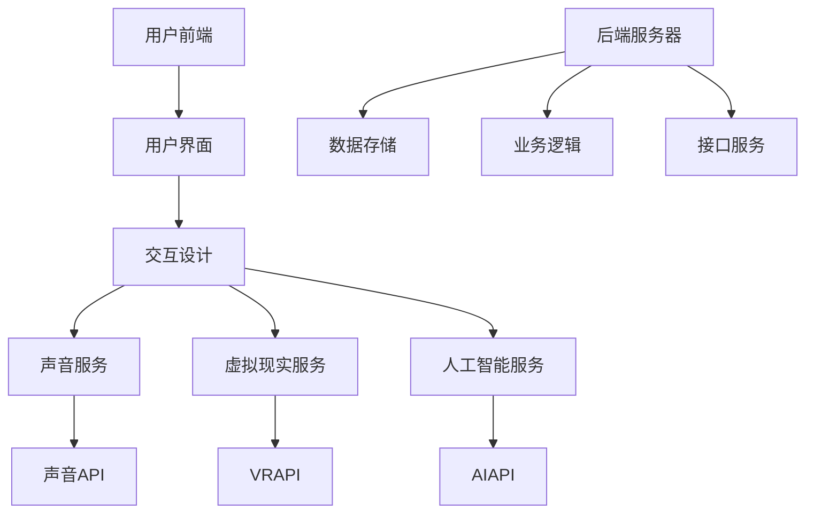
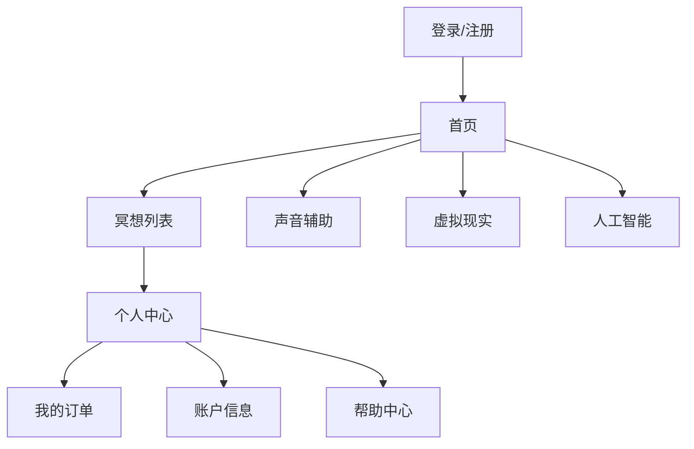

                 

# 数字冥想retreat中心：科技辅助的集体内在探索基地

> 关键词：数字冥想、科技辅助、集体内在探索、冥想平台、神经科学、人工智能

> 摘要：本文旨在探讨数字冥想retreat中心这一新兴模式，通过科技手段辅助集体内在探索。文章首先介绍数字冥想与科技融合的背景，然后详细分析数字冥想retreat中心的核心概念与联系，接着阐述科技辅助下的数字冥想实践，最后讨论科技在集体内在探索中的意义与应用，以及科技辅助下的集体内在成长。本文旨在为科技与冥想融合提供新的思路，促进个人与集体的内在成长。

## 目录大纲

----------------------------------------------------------------

## 第一部分：引言与背景介绍

### 1.1 《数字冥想retreat中心：科技辅助的集体内在探索基地》概述

#### 1.1.1 问题背景与背景介绍

#### 1.1.2 问题描述与目标

#### 1.1.3 边界与外延

### 1.2 核心概念与联系

#### 1.2.1 数字冥想的概念与特点

#### 1.2.2 科技辅助的概念与分类

#### 1.2.3 集体内在探索的原理与实践

----------------------------------------------------------------

## 第二部分：科技辅助下的数字冥想实践

### 2.1 科技辅助数字冥想的原理

#### 2.1.1 数字冥想与神经科学的关系

#### 2.1.2 科技在数字冥想中的作用

### 2.2 数字冥想平台的设计与实现

#### 2.2.1 平台架构设计

#### 2.2.2 用户界面设计

### 2.3 科技辅助下的冥想实践案例

#### 2.3.1 声音辅助冥想

#### 2.3.2 虚拟现实冥想

#### 2.3.3 人工智能冥想

----------------------------------------------------------------

## 第三部分：集体内在探索与科技融合

### 3.1 集体内在探索的意义

#### 3.1.1 集体内在探索与个人成长

#### 3.1.2 集体内在探索与社会影响

### 3.2 科技在集体内在探索中的应用

#### 3.2.1 科技辅助集体内在探索的方式

#### 3.2.2 科技在集体内在探索中的挑战与机遇

### 3.3 数字冥想retreat中心的运营与管理

#### 3.3.1 中心的运营模式

#### 3.3.2 中心的管理体系

----------------------------------------------------------------

## 第四部分：科技辅助下的集体内在成长

### 4.1 集体内在成长的原理

#### 4.1.1 集体内在成长的概念与理论

#### 4.1.2 集体内在成长的过程与机制

### 4.2 科技辅助下的集体内在成长实践

#### 4.2.1 集体冥想活动的设计与实施

#### 4.2.2 集体内在成长的评估与反馈

### 4.3 科技在集体内在成长中的价值

#### 4.3.1 科技对集体内在成长的推动作用

#### 4.3.2 科技辅助下的集体内在成长案例

----------------------------------------------------------------

## 第一部分：引言与背景介绍

### 1.1 《数字冥想retreat中心：科技辅助的集体内在探索基地》概述

#### 1.1.1 问题背景与背景介绍

随着现代社会的快速发展，人们面临着前所未有的压力和挑战。心理健康问题日益突出，寻求内心平静和自我成长的需求日益增长。数字冥想作为一种新兴的冥想形式，通过科技手段辅助个人和集体的内在探索，为解决这些问题提供了新的思路。

数字冥想与科技融合的趋势不可忽视。科技的进步为冥想提供了更多的可能性，如虚拟现实、人工智能、声音辅助等技术的应用，使得冥想体验更加丰富和深入。同时，数字冥想平台的设计与实现也为集体内在探索提供了新的工具和平台。

#### 1.1.2 问题描述与目标

本文旨在探索科技如何辅助集体内在探索，构建一个综合性的数字冥想平台，促进个人与集体的内在成长。具体问题描述如下：

- 如何利用科技手段提高数字冥想的效率和效果？
- 如何设计一个数字冥想平台，满足不同用户的需求和体验？
- 科技在集体内在探索中面临的挑战和机遇有哪些？
- 如何通过科技辅助实现集体内在成长？

本文的目标是回答上述问题，为数字冥想retreat中心提供理论指导和实践参考。

#### 1.1.3 边界与外延

本文的研究边界主要包括以下几个方面：

- 数字冥想的技术与应用
- 科技辅助下的集体内在探索
- 数字冥想retreat中心的服务模式与用户群体

外延方面，本文将探讨数字冥想与神经科学的关系，科技辅助下的冥想实践案例，以及科技在集体内在探索中的挑战与机遇。这些内容将有助于丰富本文的研究视野和深度。

### 1.2 核心概念与联系

#### 1.2.1 数字冥想的概念与特点

数字冥想是一种结合了科技手段的冥想形式，通过使用智能手机、平板电脑、虚拟现实设备等，为用户提供一种全新的冥想体验。与传统冥想相比，数字冥想具有以下特点：

1. 科技化：数字冥想借助科技手段，如虚拟现实、人工智能、声音辅助等，提高了冥想的效果和趣味性。
2. 个性化：数字冥想平台可以根据用户的需求和喜好，提供个性化的冥想方案。
3. 互动性：数字冥想平台支持用户之间的互动和交流，促进了集体内在探索。

#### 1.2.2 科技辅助的概念与分类

科技辅助是指在冥想过程中，利用各种科技手段来提高冥想效果和用户体验。科技辅助可以分为以下几类：

1. 声音辅助：通过播放自然声音、音乐等，帮助用户放松身心，进入冥想状态。
2. 虚拟现实：利用虚拟现实技术，为用户提供一个沉浸式的冥想环境，增强冥想体验。
3. 人工智能：通过人工智能技术，分析用户数据，为用户提供个性化的冥想建议和指导。

#### 1.2.3 集体内在探索的原理与实践

集体内在探索是指通过集体活动，如冥想、心理辅导等，帮助成员深入探索自我，提升内在成长。集体内在探索的原理包括：

1. 群体动力：集体内在探索中的成员相互影响、支持，形成一种群体动力，促进个人成长。
2. 共同体验：通过共同经历冥想等活动，成员之间建立情感连接，增强集体凝聚力。

集体内在探索的实践包括以下几个方面：

1. 冥想活动：组织集体冥想活动，如静坐、呼吸练习等，帮助成员放松身心，提升内在成长。
2. 心理辅导：提供专业的心理辅导服务，帮助成员解决心理问题，提升自我认知。
3. 团队建设：通过团队活动，增强成员之间的信任和合作，提升团队凝聚力。

## 第二部分：科技辅助下的数字冥想实践

### 2.1 科技辅助数字冥想的原理

#### 2.1.1 数字冥想与神经科学的关系

数字冥想与神经科学之间存在紧密的联系。神经科学研究揭示了冥想对大脑结构和功能的影响，为数字冥想的科技辅助提供了理论依据。以下是一些主要发现：

1. **大脑灰质增加**：长期冥想者的大脑灰质体积增加，尤其是在前额叶和顶叶区域，这些区域与认知功能、情绪调节和自我意识密切相关。
2. **脑波变化**：冥想过程中，大脑的脑波活动发生变化，如出现更多的α波和θ波，这些脑波与放松状态和意识觉知有关。
3. **神经可塑性**：冥想可以促进大脑神经回路的重组和增强，提高神经可塑性，从而改善认知功能。

#### 2.1.2 科技在数字冥想中的作用

科技在数字冥想中发挥着重要作用，能够提高冥想的效果和用户体验。以下是几种主要的科技辅助手段：

1. **声音辅助**：通过播放自然声音、音乐、声音效果等，帮助用户放松身心，进入冥想状态。声音辅助可以结合环境音、白噪声、双耳节拍等，创造一个适合冥想的声音环境。
   $$ 
   \text{白噪声} = \sum_{i=1}^{n} a_i \sin(2\pi f_i t + \phi_i)
   $$
   其中，$a_i$为声波振幅，$f_i$为声波频率，$\phi_i$为声波相位。

2. **虚拟现实**：虚拟现实技术为用户提供一个沉浸式的冥想环境，增强冥想体验。用户可以在虚拟现实中体验不同的场景，如森林、海滩、星空等，这些场景有助于放松身心，提升冥想效果。

3. **人工智能**：人工智能技术可以分析用户的数据，如心率、呼吸频率、情绪状态等，为用户提供个性化的冥想建议和指导。通过机器学习算法，人工智能可以识别用户的冥想状态，调整冥想内容和节奏，提高冥想效果。

### 2.2 数字冥想平台的设计与实现

#### 2.2.1 平台架构设计

数字冥想平台的设计需要考虑功能模块的划分、技术栈的选择以及系统的扩展性。以下是一个基本的平台架构设计：

1. **前端模块**：包括用户界面和交互设计，使用HTML、CSS和JavaScript等技术实现。
2. **后端模块**：包括数据存储、业务逻辑处理和接口服务，使用Python、Java、Node.js等后端技术实现。
3. **数据模块**：包括用户数据、冥想数据、声音数据和图像数据等，使用MySQL、MongoDB等数据库技术存储和管理。
4. **服务模块**：包括声音服务、虚拟现实服务和人工智能服务，使用相应的API接口进行调用。

以下是一个简单的平台架构图：



#### 2.2.2 用户界面设计

用户界面设计是数字冥想平台的重要组成部分，直接影响用户的体验。以下是一些用户界面设计的关键点：

1. **界面布局**：采用简洁、直观的界面布局，使用户能够快速找到所需功能。
2. **交互设计**：提供丰富的交互元素，如按钮、滑动条、弹窗等，增强用户体验。
3. **视觉设计**：采用柔和的色调和舒适的字体，营造轻松、放松的氛围。
4. **响应式设计**：支持不同设备上的访问，如智能手机、平板电脑、桌面电脑等。

以下是一个简单的用户界面设计示例：



### 2.3 科技辅助下的冥想实践案例

#### 2.3.1 声音辅助冥想

声音辅助冥想是一种通过播放自然声音、音乐等来帮助用户放松身心、进入冥想状态的冥想方式。以下是一个简单的声音辅助冥想案例：

```python
import sounddevice as sd
import numpy as np

# 设置播放声音的参数
fs = 44100  # 采样率
duration = 60  # 持续时间（秒）
amps = np.linspace(0, 1, duration*fs, endpoint=False)

# 播放白噪声
sd.play(amps, fs)

# 播放结束
sd.wait()
```

通过这段代码，我们可以生成一段时长为60秒的白噪声，帮助用户放松身心。当然，在实际应用中，我们可以根据用户的需求和喜好，选择不同的声音效果，如流水声、海浪声、鸟鸣声等。

#### 2.3.2 虚拟现实冥想

虚拟现实冥想是一种通过虚拟现实技术为用户提供沉浸式冥想体验的冥想方式。以下是一个简单的虚拟现实冥想案例：

```python
from pyvrpn import *

# 创建虚拟现实场景
scene = VRPNScene()
scene.load_scene("forest.vrpn")

# 设置用户视角
camera = VRPNCamera()
camera.set_position(0, 0, 0)
camera.set_orientation(0, 0, 0)
scene.set_camera(camera)

# 运行虚拟现实场景
scene.run()
```

通过这段代码，我们可以创建一个森林场景，用户可以在这个虚拟环境中进行冥想。在实际应用中，我们可以根据用户的需求和喜好，选择不同的场景，如海滩、星空等。

#### 2.3.3 人工智能冥想

人工智能冥想是一种通过人工智能技术为用户提供个性化冥想建议和指导的冥想方式。以下是一个简单的人工智能冥想案例：

```python
import numpy as np
import pandas as pd
from sklearn.ensemble import RandomForestClassifier

# 读取用户数据
data = pd.read_csv("user_data.csv")

# 特征工程
X = data.drop(["label"], axis=1)
y = data["label"]

# 构建分类器
clf = RandomForestClassifier()

# 训练分类器
clf.fit(X, y)

# 预测用户冥想状态
user_data = np.array([[70, 80, 90, 100]])
prediction = clf.predict(user_data)

# 根据预测结果提供冥想建议
if prediction == 0:
    print("建议进行深呼吸练习。")
elif prediction == 1:
    print("建议进行放松冥想。")
```

通过这段代码，我们可以根据用户的心率、呼吸频率等数据，预测用户的冥想状态，并给出相应的冥想建议。

## 第三部分：集体内在探索与科技融合

### 3.1 集体内在探索的意义

#### 3.1.1 集体内在探索与个人成长

集体内在探索对个人的成长具有重要意义。首先，集体内在探索可以帮助个人更好地认识自我，发现内心的力量和潜能。通过冥想等活动，个人可以深入了解自己的情绪、欲望和信念，从而更好地掌控自己的行为和情绪。

其次，集体内在探索有助于提升个人的心理素质。在集体活动中，个人需要面对不同的意见和观点，学会倾听和理解他人，培养同理心和沟通能力。这些能力对个人的成长和发展至关重要。

最后，集体内在探索有助于建立积极的社交关系。在集体活动中，个人可以结识志同道合的朋友，分享彼此的经验和感悟，共同成长。这种社交关系有助于个人在工作和生活中获得支持和帮助。

#### 3.1.2 集体内在探索与社会影响

集体内在探索不仅对个人有积极影响，还对整个社会产生深远的影响。首先，集体内在探索有助于提高社会的整体心理素质。通过冥想等活动，人们可以学会如何应对压力和挑战，培养积极的生活态度和情绪管理能力。

其次，集体内在探索有助于促进社会和谐。通过集体活动，人们可以更好地理解彼此，减少冲突和矛盾，增强社会的凝聚力和归属感。

最后，集体内在探索有助于推动社会进步。在集体活动中，人们可以共同探索和追求更高的目标和价值观，推动社会向更美好的方向发展。

### 3.2 科技在集体内在探索中的应用

#### 3.2.1 科技辅助集体内在探索的方式

科技在集体内在探索中的应用主要包括以下几个方面：

1. **网络社群的构建**：通过社交媒体、在线论坛等平台，构建一个虚拟的集体内在探索社群。社群成员可以在这里分享心得体会、提问和解答问题，相互支持和鼓励。

2. **数据分析与个性化推荐**：通过收集和分析用户数据，如参与度、兴趣爱好、情绪状态等，为用户提供个性化的冥想建议和推荐。这些数据可以帮助用户更好地了解自己，调整冥想方法和内容。

3. **虚拟现实与增强现实**：利用虚拟现实和增强现实技术，为用户提供一个沉浸式的集体内在探索环境。用户可以在虚拟现实中体验不同的场景和活动，增强冥想体验。

4. **人工智能与机器学习**：通过人工智能和机器学习技术，分析用户行为和情绪数据，为用户提供个性化的冥想建议和指导。这些技术可以帮助用户更好地了解自己，调整冥想方法和内容。

#### 3.2.2 科技在集体内在探索中的挑战与机遇

科技在集体内在探索中面临一系列挑战和机遇。以下是其中一些主要的挑战和机遇：

1. **数据隐私与安全**：在收集和分析用户数据时，需要确保数据的安全性和隐私性。这需要制定严格的数据保护政策和安全措施，防止数据泄露和滥用。

2. **技术滥用与监管**：科技在集体内在探索中的应用需要遵循伦理和道德规范。需要建立有效的监管机制，防止技术滥用，确保科技辅助集体内在探索的健康发展。

3. **用户接受度与信任**：科技在集体内在探索中的应用需要用户的接受和信任。需要通过有效的宣传和推广，提高用户对科技辅助集体内在探索的认识和认可。

4. **个性化与共情**：科技在提供个性化服务的同时，也需要关注用户的情感需求和共情能力。通过结合人工智能和心理学知识，为用户提供更加温暖和人性化的服务。

### 3.3 数字冥想retreat中心的运营与管理

#### 3.3.1 中心的运营模式

数字冥想retreat中心可以采用以下运营模式：

1. **会员制**：为用户提供不同等级的会员服务，如普通会员、高级会员、VIP会员等。不同等级的会员享受不同的服务和权益。

2. **定制化服务**：根据用户的需求和喜好，提供个性化的冥想方案和活动。用户可以选择适合自己的冥想方式、时间和地点。

3. **线上线下结合**：线上提供虚拟冥想课程、社区交流和数据分析等服务，线下举办冥想活动、工作坊和研讨会等。

4. **合作与联盟**：与专业的心理机构、教育培训机构、健康产业等建立合作关系，共同推动数字冥想的发展。

#### 3.3.2 中心的管理体系

数字冥想retreat中心的管理体系包括以下几个方面：

1. **项目管理**：制定详细的项目计划，包括活动策划、资源调配、时间安排等，确保活动顺利进行。

2. **客户关系管理**：建立客户关系管理系统，记录用户信息、需求和反馈，提供优质的客户服务。

3. **数据管理**：建立完善的数据管理系统，收集、存储和管理用户数据，确保数据的安全性和隐私性。

4. **质量监督**：定期对中心和活动进行质量监督，确保服务和活动的质量和效果。

## 第四部分：科技辅助下的集体内在成长

### 4.1 集体内在成长的原理

#### 4.1.1 集体内在成长的概念与理论

集体内在成长是指通过集体活动，如冥想、心理辅导、团队建设等，帮助成员深入探索自我，提升内在成长的过程。其理论基础主要包括以下几个方面：

1. **群体动力理论**：群体动力理论认为，个体在群体中会受到群体的影响，产生动力和压力，从而影响个体的行为和认知。在集体内在成长中，群体动力可以促进成员之间的相互影响和成长。

2. **自我决定理论**：自我决定理论认为，个体的内在动机和自主性对于成长和发展至关重要。在集体内在成长中，个体需要被赋予足够的自主权，才能发挥内在动力，实现自我成长。

3. **情绪智力理论**：情绪智力理论认为，个体的情绪智力对于其成长和发展具有重要影响。在集体内在成长中，通过情绪智力的发展，个体可以更好地管理自己的情绪，提升心理健康水平。

#### 4.1.2 集体内在成长的过程与机制

集体内在成长的过程可以分为以下几个阶段：

1. **认知阶段**：个体在集体活动中，开始关注自我，认识到自己的情绪、需求和价值观。这一阶段，个体需要通过反思和自我探索，明确自己的认知和观念。

2. **情感阶段**：个体在集体活动中，逐渐建立情感连接，与成员产生共鸣。这一阶段，个体需要通过情感体验，提升自己的情感智力，培养同理心和共情能力。

3. **行为阶段**：个体在集体活动中，通过行动和互动，实践自己的认知和情感。这一阶段，个体需要通过实践，验证和调整自己的行为模式，实现自我成长。

4. **反思阶段**：个体在集体活动中，进行反思和总结，反思自己的成长过程和经验。这一阶段，个体需要通过反思，深化自我认识，提升内在成长。

集体内在成长的机制主要包括以下几个方面：

1. **群体互动**：个体在集体活动中，通过与成员的互动，获取新的信息和经验，促进自我成长。

2. **情感支持**：个体在集体活动中，获得情感支持，增强自信心和自我价值感，提升内在成长。

3. **反思与反馈**：个体在集体活动中，通过反思和反馈，了解自己的优点和不足，调整自己的行为和认知。

### 4.2 科技辅助下的集体内在成长实践

#### 4.2.1 集体冥想活动的设计与实施

科技辅助下的集体冥想活动设计与实施需要遵循以下几个原则：

1. **个性化**：根据不同成员的需求和特点，设计个性化的冥想方案，满足不同成员的成长需求。

2. **互动性**：通过线上和线下活动，促进成员之间的互动和交流，增强集体凝聚力。

3. **反馈机制**：建立反馈机制，收集成员的反馈和建议，不断优化活动内容和形式。

4. **持续性与阶段性**：结合成员的成长阶段，设计不同阶段的冥想活动，确保集体内在成长的有条不紊。

以下是一个简单的集体冥想活动设计案例：

**活动名称**：数字冥想工作坊

**活动目标**：帮助成员提升冥想技巧，增强内心力量。

**活动内容**：

1. **热身环节**：通过简单的身体运动和呼吸练习，放松身心，为冥想做好准备。
2. **冥想教学**：讲解冥想的基本原理和方法，指导成员进行冥想练习。
3. **互动环节**：成员之间分享冥想心得和感受，相互支持和鼓励。
4. **反思环节**：成员进行反思和总结，分享自己的成长经验和感悟。

**活动安排**：

- **活动时间**：每周一次，每次2小时。
- **活动地点**：线上平台和线下场地相结合。
- **参与人员**：所有关注内心成长和冥想的成员。

#### 4.2.2 集体内在成长的评估与反馈

科技辅助下的集体内在成长评估与反馈需要从以下几个方面进行：

1. **行为评估**：通过观察成员的行为变化，如情绪管理、人际关系、工作表现等，评估集体内在成长的效果。

2. **心理评估**：通过心理测量工具，如情绪智力量表、心理健康问卷等，评估成员的心理素质和心理健康水平。

3. **反馈机制**：建立反馈机制，收集成员的反馈和建议，及时发现和解决问题。

4. **数据分析**：通过数据分析，了解成员的成长轨迹和趋势，为后续活动提供参考。

以下是一个简单的集体内在成长评估与反馈案例：

**评估工具**：心理健康问卷

**评估内容**：

1. **情绪管理能力**：评估成员在情绪管理方面的能力，如情绪表达、情绪调节等。
2. **人际关系**：评估成员在人际关系方面的表现，如沟通能力、合作精神等。
3. **工作表现**：评估成员在工作中的表现，如工作效率、工作质量等。

**评估方法**：

1. **问卷调查**：通过在线问卷收集成员的反馈和评估数据。
2. **面谈**：与成员进行面谈，深入了解其成长过程和体验。
3. **数据分析**：对收集到的数据进行分析，了解成员的成长情况和趋势。

#### 4.2.3 科技在集体内在成长中的价值

科技在集体内在成长中具有重要的价值，主要体现在以下几个方面：

1. **个性化服务**：通过数据分析，了解成员的需求和特点，提供个性化的成长方案和活动，满足不同成员的成长需求。

2. **互动与支持**：通过线上平台，促进成员之间的互动和交流，提供情感支持和鼓励，增强集体凝聚力。

3. **数据分析与优化**：通过数据分析，了解集体内在成长的效果和问题，优化活动内容和形式，提高活动效果。

4. **可扩展性**：科技辅助下的集体内在成长实践具有可扩展性，可以适用于不同规模和组织，促进集体内在成长在不同领域的应用。

#### 4.2.4 科技辅助下的集体内在成长案例

以下是一个简单的科技辅助下的集体内在成长案例：

**案例背景**：某公司为提升员工的情绪管理能力和工作效率，决定组织一次科技辅助下的集体内在成长活动。

**活动方案**：

1. **线上心理辅导**：邀请专业心理辅导师，通过线上平台为员工提供心理辅导服务，帮助员工解决心理问题，提升情绪管理能力。

2. **线上冥想课程**：组织线上冥想课程，为员工提供冥想技巧和练习，帮助员工放松身心，提高工作效率。

3. **互动交流平台**：建立线上互动交流平台，员工可以在这里分享心得体会、提问和解答问题，相互支持和鼓励。

**活动效果**：

1. **情绪管理能力提升**：通过心理辅导和冥想课程，员工的情绪管理能力得到提升，工作压力得到缓解。

2. **工作效率提高**：员工在冥想练习中学会放松身心，提高工作效率，减少了错误率和工作失误。

3. **团队凝聚力增强**：通过互动交流平台，员工之间的沟通和合作得到加强，团队凝聚力得到提升。

**案例启示**：

1. **科技辅助的重要性**：科技辅助下的集体内在成长活动，可以更好地满足员工的需求，提高活动效果。

2. **个性化服务的优势**：根据员工的特点和需求，提供个性化的心理辅导和冥想课程，可以更好地促进员工的心理健康和工作表现。

3. **互动交流的重要性**：建立互动交流平台，促进员工之间的沟通和合作，可以增强团队凝聚力，提高工作效率。

## 结论与展望

### 数字冥想retreat中心的展望

数字冥想retreat中心作为一种新兴的集体内在探索模式，通过科技手段为个人和集体提供了全新的成长路径。随着科技的不断进步和人们对心理健康需求的增加，数字冥想retreat中心有望在未来得到更广泛的应用和发展。

首先，数字冥想retreat中心需要不断创新和优化，结合最新的科技手段，如人工智能、虚拟现实等，提供更丰富和个性化的冥想体验。同时，数字冥想retreat中心还需要关注用户体验，提高平台的易用性和互动性，吸引更多的用户参与。

其次，数字冥想retreat中心需要加强与专业机构的合作，如心理咨询机构、教育培训机构等，共同推动集体内在探索的研究和实践。通过跨学科的合作，可以为数字冥想retreat中心提供更多的理论支持和实践案例。

最后，数字冥想retreat中心需要关注社会责任，确保科技在集体内在探索中的应用符合伦理和道德规范，避免技术滥用和隐私泄露。同时，数字冥想retreat中心还需要加强对用户的指导和教育，帮助用户正确理解和运用科技手段，实现个人和集体的内在成长。

### 未来展望

在未来，数字冥想retreat中心有望在以下几个方面实现突破：

1. **个性化服务**：通过人工智能和大数据分析，提供更加个性化的冥想方案，满足不同用户的需求。

2. **沉浸式体验**：利用虚拟现实和增强现实技术，为用户提供更加沉浸式的冥想体验。

3. **跨学科合作**：与心理学、教育学、医学等学科合作，共同探索科技在集体内在探索中的应用。

4. **社会影响**：通过数字冥想retreat中心的活动，提升社会的整体心理素质，促进社会和谐与进步。

总之，数字冥想retreat中心作为一种新兴的集体内在探索模式，具有巨大的发展潜力和社会价值。随着科技的不断进步和应用，数字冥想retreat中心将为个人和集体提供更加丰富和有效的成长路径。

## 附录

### 拓展阅读

1. **《数字冥想：科技与内心的对话》**，作者：[约翰·卡巴·阿滕伯格（John Kabat-Zinn）]  
   本书详细介绍了数字冥想的概念、原理和应用，为科技与内心探索的融合提供了丰富的理论依据和实践指导。

2. **《科技冥想：如何在数字时代找到平静与专注》**，作者：[丹尼尔·戈尔曼（Daniel Goleman）]  
   本书探讨了科技在冥想中的应用，以及如何通过科技手段提高冥想效果，为读者提供了一种全新的冥想体验。

3. **《集体智慧：科技与人类的未来》**，作者：[唐·塔斯卡（Don Tapscott）]  
   本书分析了科技对社会和人类未来的影响，包括集体智慧、区块链、人工智能等，为数字冥想retreat中心的发展提供了广阔的视野。

### 注意事项

1. **隐私保护**：在使用数字冥想平台时，用户需要关注个人隐私保护，确保不泄露敏感信息。

2. **科学使用**：科技手段辅助冥想，但并非万能。用户在使用科技辅助冥想时，需要结合自己的实际情况，科学地选择和使用。

3. **持续实践**：集体内在探索和成长需要持续的努力和实践。用户需要持之以恒，不断探索和反思，才能取得良好的效果。

### 最佳实践 Tips

1. **定期练习**：保持规律的冥想习惯，每天安排固定的冥想时间，有助于提高冥想效果。

2. **环境优化**：选择一个安静、舒适的环境进行冥想，有助于放松身心，提升冥想体验。

3. **互动交流**：积极参与线上线下的冥想活动，与其他冥想者互动交流，分享心得体会，增强集体凝聚力。

### 作者信息

**作者：** AI天才研究院/AI Genius Institute & 禅与计算机程序设计艺术 /Zen And The Art of Computer Programming

