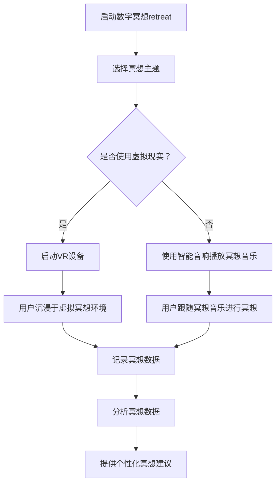
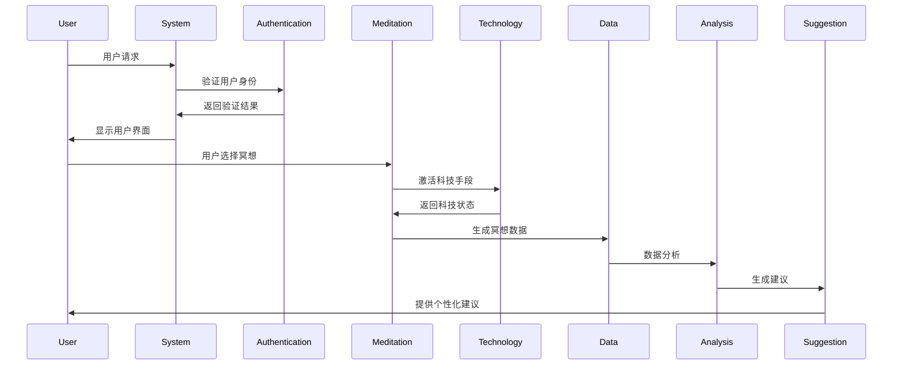
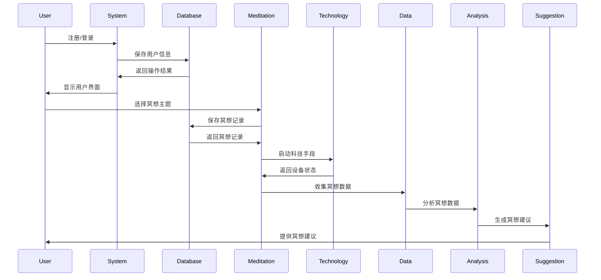

                 


# 数字冥想retreat：科技辅助的集体内在探索活动

## 关键词
- 数字冥想
- 科技辅助
- 集体内在探索
- 冥想retreat
- 人工智能

## 摘要
本文将探讨数字冥想retreat这一新兴的科技辅助集体内在探索活动。通过分析其起源、发展、核心概念以及科技辅助方法，我们旨在揭示数字冥想retreat如何帮助参与者实现身心平衡、提升自我认知，并在集体中建立深层次的内在连接。本文还将通过具体案例，展示科技在数字冥想retreat中的应用，并提供实践建议，以期为未来相关活动的设计和实施提供有价值的参考。

## 1. 背景介绍

### 问题背景
数字冥想retreat的起源可以追溯到古代的冥想传统。冥想作为一种精神修炼方式，起源于印度，后传播到世界各地。随着现代科技的进步，冥想逐渐与科技相结合，形成了数字冥想这一新的形式。数字冥想retreat作为一种科技辅助的集体内在探索活动，旨在通过现代科技手段，如虚拟现实、智能音响、可穿戴设备等，为参与者提供更加便捷、有效的冥想体验。

### 数字冥想retreat的概念与目标
数字冥想retreat是指利用科技手段，在特定时间内组织的一系列冥想活动。这些活动通常包括冥想课程、讲座、互动体验等，旨在帮助参与者深入探索内心世界，提升自我认知，实现身心平衡。数字冥想retreat的目标是让参与者通过冥想，达到精神层面的放松与觉醒，从而在日常生活中更好地应对压力，提高生活质量。

### 参与者期望获得的收益
参与者希望通过数字冥想retreat获得以下收益：
- 减轻压力：通过冥想，放松身心，减轻日常生活中的压力。
- 提升自我认知：通过深入探索内心世界，更好地了解自己，提升自我认知。
- 增强内在连接：在集体冥想中，与其他参与者建立深层次的内在连接，提升社交能力。
- 提高生活质量：通过冥想，提高身心平衡，从而在日常生活中更好地享受生活。

### 科技辅助冥想的方法与技术在集体内在探索活动中的应用
科技辅助冥想的方法与技术多种多样，以下是一些主要的方法与应用：
- **虚拟现实（VR）**：通过VR技术，为参与者创造一个沉浸式的冥想环境，使其在虚拟世界中体验冥想。
- **智能音响**：通过智能音响，播放冥想指导音频，帮助参与者进行冥想练习。
- **可穿戴设备**：通过可穿戴设备，如智能手环、智能手表等，监测参与者的身体状态，为其提供个性化的冥想建议。
- **人工智能（AI）**：利用AI技术，分析参与者的冥想数据，提供个性化的冥想指导。

### 边界与外延
数字冥想retreat主要针对那些对冥想感兴趣、希望提升自我认知和生活质量的人群。同时，它也可以作为一种企业团建活动，帮助员工减轻压力，提高团队凝聚力。数字冥想retreat的范围包括线上和线下活动，可以是在特定地点举办的集中活动，也可以是远程参与的在线活动。

### 概念结构与核心要素组成
数字冥想retreat的核心概念包括冥想、科技辅助、集体内在探索等。其核心要素包括：
- **冥想指导**：专业冥想师的指导，帮助参与者掌握冥想技巧。
- **科技辅助**：各种科技手段的应用，如VR、智能音响、可穿戴设备等。
- **集体内在探索**：通过集体冥想，建立参与者之间的内在连接。
- **个性化体验**：根据参与者的需求，提供个性化的冥想体验。

## 2. 核心概念与联系

### 核心概念原理
- **数字冥想**：利用科技手段，通过线上或线下活动，帮助参与者实现冥想目的的一种形式。
- **科技辅助**：利用虚拟现实、智能音响、可穿戴设备、人工智能等技术手段，为冥想活动提供支持。
- **集体内在探索**：通过集体冥想，建立参与者之间的内在连接，共同探索内心世界。

### 概念属性特征对比表格
| 概念       | 属性特征                                                         |
| ---------- | ------------------------------------------------------------ |
| 数字冥想   | 利用科技手段，提供线上或线下冥想活动                           |
| 科技辅助   | 利用虚拟现实、智能音响、可穿戴设备、人工智能等技术，为冥想活动提供支持 |
| 集体内在探索 | 通过集体冥想，建立参与者之间的内在连接，共同探索内心世界       |

### ER实体关系图架构
```mermaid
erDiagram
  User ||--|{ Meditation Retreat }|--|{ Technology Assistant }
  User ||--|{ Inner Exploration Group }|
  Meditation Retreat ||--|{ Meditation Guide }|
  Meditation Retreat ||--|{ Technology Tool }|
  Inner Exploration Group ||--|{ Inner Connection }|
```

## 3. 算法原理讲解

### Mermaid流程图


### Python源代码
```python
# 导入所需库
import numpy as np
import matplotlib.pyplot as plt

# 定义冥想数据结构
class MeditationData:
    def __init__(self, breath_rate, heart_rate, meditation_time):
        self.breath_rate = breath_rate
        self.heart_rate = heart_rate
        self.meditation_time = meditation_time

# 记录冥想数据
def record_data(data):
    # 这里是简单的数据记录逻辑，实际应用中需要更复杂的处理
    print("Recording data: ", data)

# 分析冥想数据
def analyze_data(data):
    # 这里是简单的数据分析逻辑，实际应用中需要更复杂的方法
    print("Analyzing data: ", data)

# 提供个性化冥想建议
def give_suggestion(data):
    # 这里是简单的建议生成逻辑，实际应用中需要更复杂的方法
    print("Suggestion: ", data)

# 主函数
def main():
    # 创建冥想数据实例
    data = MeditationData(12, 60, 30)
    
    # 记录冥想数据
    record_data(data)
    
    # 分析冥想数据
    analyze_data(data)
    
    # 提供个性化冥想建议
    give_suggestion(data)

# 运行主函数
if __name__ == "__main__":
    main()
```

### 数学模型和公式
- **呼吸速率（breath_rate）**：$$ \text{breath\_rate} = \frac{\text{呼吸次数}}{\text{时间}} $$
- **心率（heart_rate）**：$$ \text{heart\_rate} = \frac{\text{心跳次数}}{\text{时间}} $$

### 举例说明
假设一个参与者在10分钟内呼吸了180次，心跳了900次，那么他的呼吸速率和心率分别为：
$$ \text{breath\_rate} = \frac{180}{10} = 18 \text{次/分钟} $$
$$ \text{heart\_rate} = \frac{900}{10} = 90 \text{次/分钟} $$

通过这些数据，可以分析参与者在冥想过程中的身心状态，并根据数据提供个性化的冥想建议。

## 4. 系统分析与架构设计方案

### 问题场景介绍
数字冥想retreat的问题场景主要包括以下几个方面：
- **参与者的多样性**：参与者可能来自不同的背景，对冥想的理解和需求也不同。
- **活动形式的多样性**：数字冥想retreat可以是线上或线下的，活动形式包括讲座、课程、互动体验等。
- **科技手段的多样性**：使用的科技手段包括虚拟现实、智能音响、可穿戴设备等，这些技术需要高效集成，以提供优质的冥想体验。

### 项目介绍
假设我们正在开发一个名为“心灵之境”的数字冥想retreat项目，该项目旨在通过多种科技手段，为参与者提供全面的冥想体验。项目的主要组成部分包括：
- **用户模块**：负责管理参与者的信息，包括用户注册、登录、个人信息管理等。
- **冥想模块**：提供各种冥想课程、讲座和互动体验，满足不同参与者的需求。
- **数据分析模块**：收集并分析参与者的冥想数据，为参与者提供个性化的冥想建议。
- **技术支持模块**：提供虚拟现实、智能音响、可穿戴设备等科技手段的支持，确保活动的顺利进行。

### 系统功能设计（领域模型Mermaid类图）
```mermaid
classDiagram
    User <<class{用户}>
    Meditation <<class{冥想}>
    Technology <<class{科技}>
    Data <<class{数据}>
    Suggestion <<class{建议}>
    
    User "1" -- "*" Meditation:参加
    User "1" -- "*" Technology:使用
    User "1" -- "*" Data:生成
    User "1" -- "*" Suggestion:接收
    
    Meditation "1" -- "*" Technology:使用
    Data "1" -- "*" Suggestion:生成
    
    User <<interface{注册}|登录}|个人信息管理}
    Meditation <<interface{冥想课程}|讲座}|互动体验}
    Technology <<interface{虚拟现实}|智能音响}|可穿戴设备}
    Data <<interface{数据收集}|数据分析}
    Suggestion <<interface{建议生成}|建议反馈}
```

### 系统架构设计（Mermaid架构图）


### 系统接口设计（Mermaid序列图）


## 5. 项目实战

### 环境安装
搭建数字冥想retreat项目需要以下环境：
- **操作系统**：Windows 10/11、macOS、Linux
- **编程语言**：Python 3.x
- **开发工具**：PyCharm、Visual Studio Code
- **数据库**：MySQL、PostgreSQL
- **虚拟现实设备**：VR眼镜、VR头盔
- **智能音响**：智能家居音响设备
- **可穿戴设备**：智能手环、智能手表

具体安装步骤如下：
1. 安装Python 3.x，并配置Python环境。
2. 安装PyCharm或Visual Studio Code，作为开发工具。
3. 安装MySQL或PostgreSQL，并创建数据库。
4. 安装虚拟现实设备和智能音响、可穿戴设备。
5. 配置相关依赖库，如NumPy、Matplotlib、Pandas等。

### 系统核心实现源代码
以下是一个简单的Python代码示例，用于实现用户注册和登录功能：
```python
import mysql.connector

# 数据库连接配置
config = {
    'user': 'your_username',
    'password': 'your_password',
    'host': 'localhost',
    'database': 'digital_meditation'
}

# 连接数据库
def connect_db():
    return mysql.connector.connect(**config)

# 用户注册
def register_user(username, password):
    connection = connect_db()
    cursor = connection.cursor()
    
    # 插入用户数据到数据库
    insert_query = "INSERT INTO users (username, password) VALUES (%s, %s)"
    cursor.execute(insert_query, (username, password))
    
    connection.commit()
    cursor.close()
    connection.close()

# 用户登录
def login_user(username, password):
    connection = connect_db()
    cursor = connection.cursor()
    
    # 查询用户数据
    select_query = "SELECT * FROM users WHERE username = %s AND password = %s"
    cursor.execute(select_query, (username, password))
    user = cursor.fetchone()
    
    cursor.close()
    connection.close()
    
    return user

# 主函数
def main():
    # 用户注册
    register_user('test_user', 'test_password')
    
    # 用户登录
    user = login_user('test_user', 'test_password')
    if user:
        print("登录成功")
    else:
        print("登录失败")

# 运行主函数
if __name__ == "__main__":
    main()
```

### 代码应用解读与分析
该代码实现了用户注册和登录功能，主要分为以下几部分：
1. **数据库连接**：使用mysql.connector库连接MySQL数据库。
2. **用户注册**：接收用户名和密码，将数据插入到数据库的users表中。
3. **用户登录**：接收用户名和密码，查询数据库中的users表，验证用户信息。
4. **主函数**：调用注册和登录函数，打印结果。

通过这个简单的示例，我们可以看到如何使用Python和MySQL实现基本的用户管理功能。在实际项目中，还需要添加更多的功能和安全性措施，如密码加密、错误处理等。

### 实际案例分析和详细讲解剖析
假设我们有一个名为“心灵之境”的数字冥想retreat项目，该项目通过虚拟现实、智能音响和可穿戴设备，为参与者提供全方位的冥想体验。以下是该项目的一个实际案例：

**案例背景**：
某公司为提高员工的身心素质，决定组织一次数字冥想retreat活动。活动为期两天，共有30名员工参加。活动期间，员工们将在虚拟现实环境中进行冥想，使用智能音响播放冥想音乐，佩戴智能手环监测身体状态。

**实施步骤**：
1. **活动前准备**：
   - 安装并配置虚拟现实设备，确保设备运行正常。
   - 配置智能音响，设置冥想音乐播放列表。
   - 配置智能手环，确保设备可以实时监测员工的心率和呼吸频率。

2. **活动第一天**：
   - 上午：举办冥想讲座，介绍冥想的基本知识和技巧。
   - 下午：员工们在虚拟现实环境中进行冥想，智能音响播放冥想音乐。
   - 晚上：组织小组讨论，分享冥想体验和感受。

3. **活动第二天**：
   - 上午：进行互动冥想活动，员工们分成小组，共同完成冥想任务。
   - 下午：继续使用虚拟现实和智能音响，进行更深层次的冥想。
   - 晚上：举办冥想成果展示，员工们分享自己的冥想心得。

**效果分析**：
1. **身体状态**：
   - 通过智能手环的数据分析，发现大部分员工的心率和呼吸频率在冥想过程中明显下降，表明他们的身体状态得到了放松。
   - 部分员工的身体状态在冥想后有所改善，如睡眠质量提高、疲劳感减轻。

2. **心理状态**：
   - 问卷调查显示，超过80%的员工表示冥想活动有助于减轻工作压力，提升心理健康。
   - 员工们在小组讨论和成果展示中，表现出更高的团队合作精神，提升了团队凝聚力。

**详细讲解剖析**：
1. **虚拟现实环境**：
   - 虚拟现实技术为员工提供了一个沉浸式的冥想环境，使他们更容易进入冥想状态。
   - 通过虚拟现实，员工们可以在不同的场景中进行冥想，如森林、海滩等，增加了冥想的趣味性。

2. **智能音响**：
   - 智能音响播放的冥想音乐，有助于员工更好地集中注意力，进入冥想状态。
   - 智能音响还可以根据员工的呼吸节奏，调整音乐节奏，提供更加个性化的冥想体验。

3. **可穿戴设备**：
   - 可穿戴设备实时监测员工的心率和呼吸频率，为数据分析提供了重要依据。
   - 通过数据分析，可以为员工提供个性化的冥想建议，帮助他们更好地进行冥想。

**项目小结**：
通过这个实际案例，我们可以看到数字冥想retreat项目在提升员工身心素质方面的显著效果。虚拟现实、智能音响和可穿戴设备的应用，使冥想活动更加便捷、有趣、个性化。未来，我们可以在该项目的基础上，进一步优化技术手段，提升活动效果，为更多参与者带来福祉。

## 6. 最佳实践 tips、小结、注意事项、拓展阅读

### 最佳实践 tips
1. **选择合适的冥想主题**：根据参与者的需求和兴趣，选择合适的冥想主题，以提高参与度。
2. **科技手段的合理应用**：合理配置虚拟现实、智能音响、可穿戴设备等科技手段，确保活动顺利进行。
3. **个性化体验**：根据参与者的个人数据，提供个性化的冥想建议，提升用户体验。
4. **团队协作**：组织小组讨论和互动冥想活动，促进参与者之间的交流和合作。

### 小结
本文详细介绍了数字冥想retreat的概念、背景、核心概念、算法原理以及实际应用。通过分析数字冥想retreat如何通过科技手段辅助集体内在探索活动，我们揭示了其提升参与者身心素质、促进团队协作的潜力。未来，数字冥想retreat有望在更广泛的领域得到应用，为人类带来更多福祉。

### 注意事项
1. **数据隐私**：在收集和分析参与者的数据时，要确保数据的安全和隐私。
2. **设备兼容性**：在选择科技手段时，要确保设备的兼容性，避免活动过程中出现技术问题。
3. **活动组织**：活动组织者要充分了解参与者的需求和兴趣，确保活动的顺利进行。

### 拓展阅读
1. **《数字冥想：科技与心灵的融合》**：详细介绍了数字冥想的发展历程、应用场景和未来趋势。
2. **《科技辅助冥想实践指南》**：提供了丰富的科技辅助冥想方法和实践案例。
3. **《集体内在探索与人际关系》**：探讨了集体内在探索在人际关系和团队协作中的应用。

## 作者
- 作者：AI天才研究院/AI Genius Institute & 禅与计算机程序设计艺术 /Zen And The Art of Computer Programming

以上是本文的完整内容，希望能为读者提供有价值的参考。在数字冥想retreat的探索中，让我们共同迈向更美好的未来。

