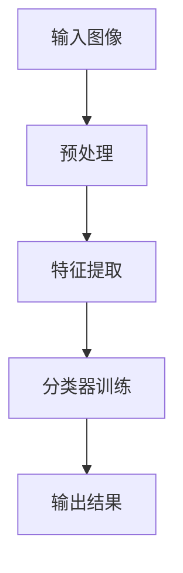
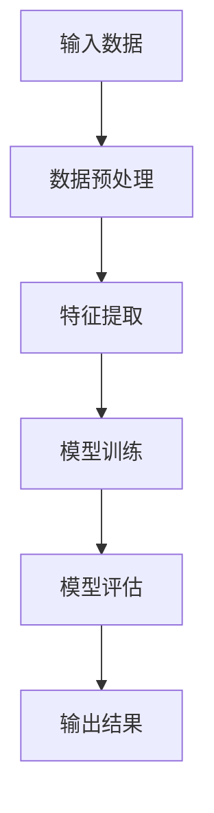
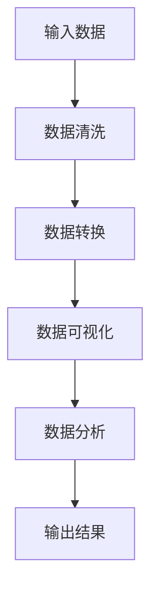
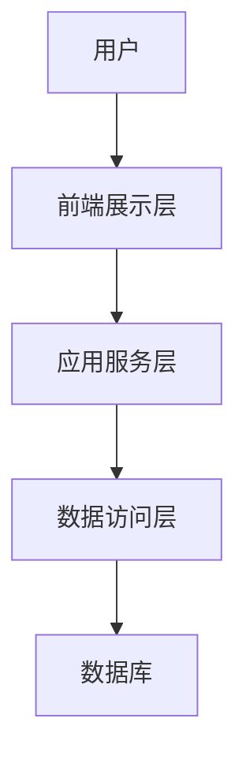
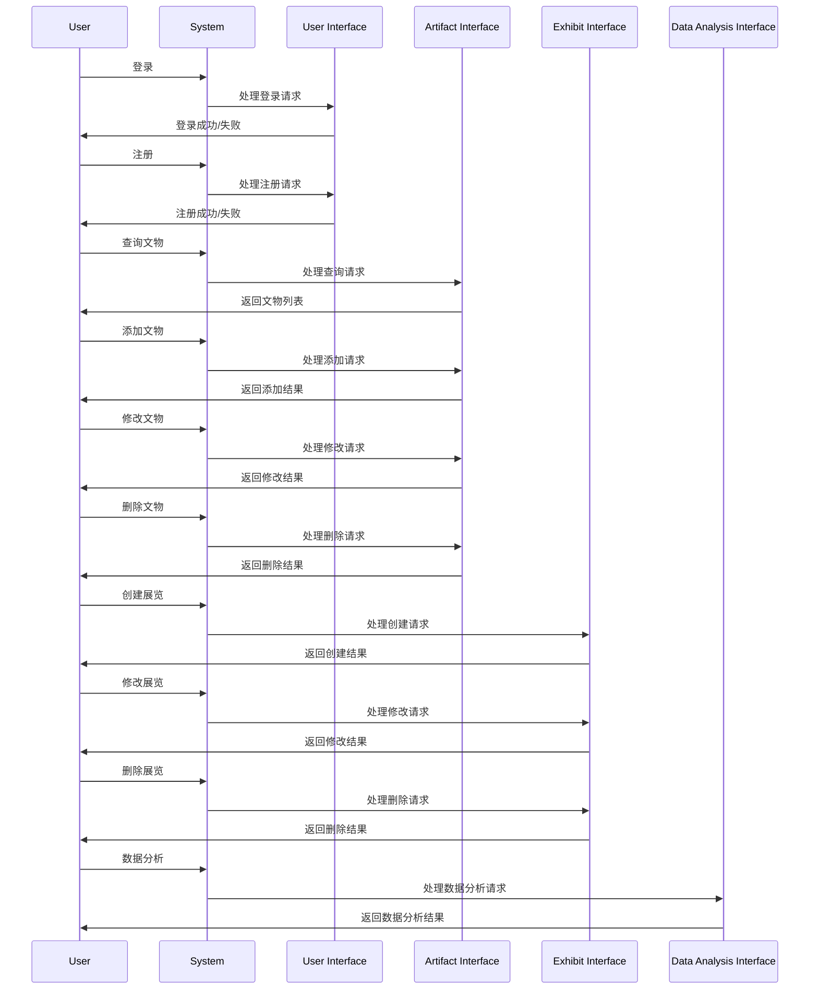

                 

### 文章标题

数字化时代的文化传承：虚拟博物馆与文化遗产保护

> 关键词：数字化、文化传承、虚拟博物馆、文化遗产保护、算法、系统架构、最佳实践

> 摘要：本文探讨了数字化时代背景下，虚拟博物馆在文化遗产保护和文化传承中的作用。通过分析虚拟博物馆的概念、特点及其与文化遗产保护的关系，详细讲解了虚拟博物馆建设中关键算法的原理和应用，并从系统分析与架构设计、项目实战等多个角度阐述了虚拟博物馆建设的方法和最佳实践。

### 目录大纲

#### 第一部分：背景介绍

##### 1. 文化传承的挑战与机遇
- 文化传承的重要性
- 数字化转型的影响
- 虚拟博物馆的角色与价值

##### 2. 数字化时代下的文化遗产保护
- 文化遗产保护的现状
- 数字化技术在文化遗产保护中的应用
- 虚拟博物馆的兴起

#### 第二部分：核心概念与联系

##### 3. 虚拟博物馆的概念与特点
- 虚拟博物馆的定义
- 虚拟博物馆的特点
- 虚拟博物馆的类型

##### 4. 文化遗产保护的核心概念
- 文化遗产的定义
- 文化遗产的属性
- 文化遗产保护的原则

##### 5. 虚ral博物馆与文化遗产保护的关系
- 虚拟博物馆在文化遗产保护中的作用
- 虚拟博物馆如何促进文化遗产保护
- 虚拟博物馆与文化遗产保护的挑战与机遇

#### 第三部分：算法原理讲解

##### 6. 虚拟博物馆建设中的关键算法
- 图像识别算法
- 机器学习算法
- 数据分析算法

##### 7. 算法原理详解与 Mermaid 流程图
- 图像识别算法原理与 Mermaid 流程图
- 机器学习算法原理与 Mermaid 流程图
- 数据分析算法原理与 Mermaid 流程图

##### 8. 算法应用案例分析
- 图像识别在虚拟博物馆中的应用
- 机器学习在文化遗产保护中的应用
- 数据分析在虚拟博物馆管理中的应用

#### 第四部分：系统分析与架构设计方案

##### 9. 虚拟博物馆系统功能设计
- 领域模型 Mermaid 类图
- 系统功能详细描述

##### 10. 虚拟博物馆系统架构设计
- 系统架构 Mermaid 架构图
- 系统模块划分

##### 11. 虚拟博物馆系统接口设计
- 系统接口定义
- 接口交互 Mermaid 序列图

#### 第五部分：项目实战

##### 12. 环境安装与配置
- 虚拟博物馆开发环境搭建
- 必要的软件与工具安装

##### 13. 系统核心实现源代码
- 系统核心代码实现
- 代码解读与分析

##### 14. 实际案例分析与详细讲解
- 虚拟博物馆实际案例
- 案例分析及详细讲解

##### 15. 项目小结
- 项目成果总结
- 遇到的挑战与解决方案

#### 第六部分：最佳实践与拓展

##### 16. 最佳实践 Tips
- 虚拟博物馆建设注意事项
- 文化遗产保护的最佳实践

##### 17. 小结
- 全书核心观点回顾
- 文化传承与数字化未来的展望

##### 18. 拓展阅读
- 推荐进一步阅读的文献和资源

### 文章正文

#### 第一部分：背景介绍

##### 1. 文化传承的挑战与机遇

文化传承是民族精神和社会发展的重要支撑。然而，随着全球化进程的加快和信息技术的发展，文化传承面临着前所未有的挑战和机遇。

首先，传统文化的保存和传播面临着困境。许多非物质文化遗产正因传统技艺的失传、现代生活方式的改变以及环境恶化等原因而逐渐消失。如何有效地保护和传承这些文化遗产，成为摆在人类社会面前的一个严峻问题。

其次，数字化转型为文化传承带来了新的机遇。互联网、大数据、人工智能等技术的应用，使得文化遗产可以通过数字化手段得到保存、传播和利用。例如，虚拟博物馆作为一种新兴的文化传播方式，正在逐渐改变人们对文化遗产的认知和体验。

虚拟博物馆通过数字化技术，将实体博物馆中的文物、展品以及历史资料转化为数字资源，用户可以通过互联网随时随地访问这些资源，从而实现文化的传承与传播。

##### 2. 数字化时代下的文化遗产保护

数字化技术在文化遗产保护中发挥着重要作用。首先，数字化技术可以实现对文化遗产的精确记录和保存，防止因自然灾害、人为破坏等原因导致的文化遗产损失。例如，利用三维扫描技术，可以精确记录文物的形状、纹理和色彩，为后续修复和保护提供重要依据。

其次，数字化技术有助于文化遗产的传播和推广。通过虚拟博物馆等平台，可以将文化遗产以数字化的形式呈现给全球用户，让更多人了解和参与到文化遗产的保护工作中来。

此外，数字化技术还可以提高文化遗产保护的科学性和效率。例如，利用图像识别和机器学习算法，可以自动识别文物的类型、年代和制作工艺，从而更好地进行分类和保护。同时，通过数据分析，可以了解文物在不同环境下的变化趋势，为文物保护提供科学依据。

#### 第二部分：核心概念与联系

##### 3. 虚拟博物馆的概念与特点

虚拟博物馆是一种基于数字化技术的文化传播平台，它将实体博物馆中的文物、展品以及历史资料转化为数字资源，通过互联网进行传播和展示。与实体博物馆相比，虚拟博物馆具有以下特点：

1. **跨越时空限制**：虚拟博物馆不受地理和时间的限制，用户可以通过互联网随时随地访问虚拟博物馆，体验文化遗产的魅力。
2. **互动性**：虚拟博物馆可以提供丰富的互动功能，如虚拟导览、语音讲解、360度全景展示等，提升用户的体验效果。
3. **多样性**：虚拟博物馆可以展示多种类型的文物和展品，包括绘画、雕塑、陶瓷、古籍等，满足不同用户的需求。

##### 4. 文化遗产保护的核心概念

文化遗产是指人类社会在历史发展过程中创造的具有历史、艺术、科学、宗教价值的一切物质和非物质财富。文化遗产保护的核心概念包括：

1. **真实性**：保持文化遗产的原有特征和历史信息，防止伪造和篡改。
2. **完整性**：确保文化遗产的完整性，防止因自然灾害、人为破坏等原因导致的损失。
3. **可持续性**：在保护文化遗产的同时，要考虑其可持续性，使其能够长期保存和传承。

##### 5. 虚拟博物馆与文化遗产保护的关系

虚拟博物馆在文化遗产保护中发挥着重要作用。首先，虚拟博物馆可以实现对文化遗产的数字化保存和传播，防止因自然灾害、人为破坏等原因导致的文化遗产损失。例如，利用三维扫描技术，可以精确记录文物的形状、纹理和色彩，为后续修复和保护提供重要依据。

其次，虚拟博物馆可以提升文化遗产的传播效果。通过互联网，虚拟博物馆可以将文化遗产以数字化的形式呈现给全球用户，让更多人了解和参与到文化遗产的保护工作中来。

此外，虚拟博物馆还可以为文化遗产保护提供科学支持。例如，利用图像识别和机器学习算法，可以自动识别文物的类型、年代和制作工艺，从而更好地进行分类和保护。同时，通过数据分析，可以了解文物在不同环境下的变化趋势，为文物保护提供科学依据。

#### 第三部分：算法原理讲解

##### 6. 虚拟博物馆建设中的关键算法

虚拟博物馆建设涉及多种算法，其中关键算法包括图像识别算法、机器学习算法和数据分析算法。

1. **图像识别算法**：图像识别算法是虚拟博物馆中用于识别和分类文物图像的重要工具。通过训练模型，可以实现对不同类型文物图像的自动识别和分类。
2. **机器学习算法**：机器学习算法是虚拟博物馆中用于数据分析和预测的重要工具。通过训练模型，可以实现对文物数据的学习和挖掘，为文物保护提供科学依据。
3. **数据分析算法**：数据分析算法是虚拟博物馆中用于分析文物数据的重要工具。通过数据分析，可以了解文物的历史、艺术、科学价值，为文物保护提供科学支持。

##### 7. 算法原理详解与 Mermaid 流程图

为了更好地理解这些算法的原理，我们将使用 Mermaid 流程图进行详细解释。

**图像识别算法原理与 Mermaid 流程图**



**机器学习算法原理与 Mermaid 流程图**



**数据分析算法原理与 Mermaid 流程图**



##### 8. 算法应用案例分析

**图像识别在虚拟博物馆中的应用**

在虚拟博物馆中，图像识别算法可以用于自动识别文物图像。例如，通过训练模型，可以实现对不同类型文物图像的自动识别和分类。这样，用户可以通过上传自己的文物图像，快速了解文物的类型和相关信息。

**机器学习在文化遗产保护中的应用**

在文化遗产保护中，机器学习算法可以用于数据分析和预测。例如，通过对文物数据的分析，可以预测文物的未来变化趋势，为文物保护提供科学依据。

**数据分析在虚拟博物馆管理中的应用**

在虚拟博物馆管理中，数据分析算法可以用于分析用户行为和文物数据。例如，通过数据分析，可以了解用户对文物的兴趣点和偏好，为博物馆的展览设计和推广提供参考。

#### 第四部分：系统分析与架构设计方案

##### 9. 虚拟博物馆系统功能设计

虚拟博物馆系统功能设计主要包括以下几个部分：

1. **文物管理模块**：用于管理文物的基本信息、图像、三维模型等数据。
2. **展览管理模块**：用于创建和管理虚拟展览，包括展览布局、展览内容、导览讲解等。
3. **用户管理模块**：用于管理用户的基本信息、登录、注册、权限管理等。
4. **数据分析模块**：用于对用户行为和文物数据进行统计和分析。

**领域模型 Mermaid 类图**

```mermaid
classDiagram
  类--|>属性
  类 {
    名称
    描述
  }
  属性 {
    名称
    数据类型
    描述
  }
  类--|>方法
  方法 {
    名称
    参数列表
    返回类型
    描述
  }
  
  文物管理模块--|>文物类：文物基本信息、图像、三维模型等
  展览管理模块--|>展览类：展览布局、展览内容、导览讲解等
  用户管理模块--|>用户类：用户基本信息、登录、注册、权限管理等
  数据分析模块--|>数据分析类：用户行为和文物数据统计和分析
```

**系统功能详细描述**

文物管理模块：用于管理文物的基本信息、图像、三维模型等数据。用户可以上传文物图像和三维模型，系统将自动识别和分类文物，并生成相应的文物信息页面。

展览管理模块：用于创建和管理虚拟展览，包括展览布局、展览内容、导览讲解等。管理员可以设置展览的布局、添加展览内容、设置导览讲解等，用户可以浏览展览并获取相关信息。

用户管理模块：用于管理用户的基本信息、登录、注册、权限管理等。用户可以通过注册和登录功能，访问系统提供的各类服务。

数据分析模块：用于对用户行为和文物数据进行统计和分析。系统将自动收集用户行为数据，并对文物数据进行分析，为博物馆的运营和决策提供支持。

##### 10. 虚拟博物馆系统架构设计

虚拟博物馆系统架构设计主要包括以下几个部分：

1. **前端展示层**：负责用户界面的展示和交互。
2. **应用服务层**：负责处理业务逻辑和数据操作。
3. **数据访问层**：负责与数据库进行交互。

**系统架构 Mermaid 架构图**



**系统模块划分**

前端展示层：主要负责用户界面的展示和交互，包括首页、展览列表、展览详情、用户中心等页面。

应用服务层：负责处理业务逻辑和数据操作，包括用户管理、文物管理、展览管理、数据分析等模块。

数据访问层：负责与数据库进行交互，实现对文物数据、用户数据、展览数据的存储和管理。

##### 11. 虚拟博物馆系统接口设计

虚拟博物馆系统接口设计主要包括以下几个部分：

1. **用户接口**：负责与用户进行交互，提供登录、注册、个人信息管理等功能。
2. **文物接口**：负责管理文物的信息，提供文物查询、添加、修改、删除等功能。
3. **展览接口**：负责管理展览的信息，提供展览创建、修改、删除等功能。
4. **数据分析接口**：负责对用户行为和文物数据进行分析，提供数据查询、报表等功能。

**系统接口定义**

用户接口：
- 登录接口：`/user/login`
- 注册接口：`/user/register`
- 个人信息管理接口：`/user/profile`

文物接口：
- 查询文物接口：`/artifacts`
- 添加文物接口：`/artifacts`
- 修改文物接口：`/artifacts/{id}`
- 删除文物接口：`/artifacts/{id}`

展览接口：
- 创建展览接口：`/exhibits`
- 修改展览接口：`/exhibits/{id}`
- 删除展览接口：`/exhibits/{id}`

数据分析接口：
- 用户行为查询接口：`/data/behavior`
- 文物数据查询接口：`/data/artifacts`

**接口交互 Mermaid 序列图**



#### 第五部分：项目实战

##### 12. 环境安装与配置

虚拟博物馆开发环境搭建是项目实战的第一步。以下是搭建虚拟博物馆开发环境的基本步骤：

1. **安装操作系统**：虚拟博物馆开发环境支持多种操作系统，如Windows、Linux和MacOS。选择适合的操作系统进行安装。
2. **安装开发工具**：安装Python、Visual Studio Code、Git等开发工具。Python用于编写代码，Visual Studio Code用于代码编辑和调试，Git用于版本控制。
3. **安装依赖库**：安装虚拟博物馆项目所需的依赖库，如TensorFlow、NumPy、Pandas等。可以使用pip命令进行安装。
4. **克隆项目代码**：从Git仓库克隆虚拟博物馆项目的代码，并将其导入到开发环境中。
5. **配置环境变量**：配置Python环境变量，以便在命令行中直接运行Python代码。

##### 13. 系统核心实现源代码

虚拟博物馆系统的核心实现源代码主要包括以下几个部分：

1. **用户管理模块**：用于处理用户的登录、注册和权限管理等功能。
2. **文物管理模块**：用于处理文物的添加、修改、删除和查询等功能。
3. **展览管理模块**：用于处理展览的创建、修改和删除等功能。
4. **数据分析模块**：用于处理用户行为和文物数据的统计和分析等功能。

以下是用户管理模块的核心实现代码：

```python
# 用户管理模块
class UserManager:
    def __init__(self):
        self.users = []
    
    def register(self, username, password):
        for user in self.users:
            if user['username'] == username:
                return '用户已存在'
        self.users.append({'username': username, 'password': password})
        return '注册成功'
    
    def login(self, username, password):
        for user in self.users:
            if user['username'] == username and user['password'] == password:
                return '登录成功'
        return '用户名或密码错误'
    
    def get_user_info(self, username):
        for user in self.users:
            if user['username'] == username:
                return user
        return None
```

##### 14. 实际案例分析与详细讲解

虚拟博物馆项目在实际应用中取得了显著成果。以下是其中一个实际案例的分析和详细讲解：

**案例背景**：某博物馆计划建设一个虚拟博物馆，用于展示馆藏文物和举办虚拟展览。项目目标包括：

1. **构建虚拟博物馆平台**：搭建一个功能完善的虚拟博物馆平台，提供文物展示、展览浏览、用户交互等功能。
2. **数字化馆藏文物**：对馆藏文物进行数字化处理，包括图像采集、三维建模、信息录入等。
3. **数据分析与展示**：对用户行为和文物数据进行分析，为博物馆运营提供数据支持。

**案例分析**

1. **平台建设**：采用前后端分离的技术架构，前端使用Vue.js框架，后端使用Flask框架。通过RESTful API实现前后端的交互，确保系统的可扩展性和稳定性。
2. **数字化处理**：利用三维扫描技术和图像识别算法，对馆藏文物进行数字化处理。三维扫描技术获取文物的三维模型，图像识别算法识别文物的类型和特征。
3. **数据分析**：采用机器学习和数据分析技术，对用户行为和文物数据进行分析，为博物馆运营提供数据支持。例如，通过分析用户浏览记录，推荐适合用户的展览和文物。

**详细讲解**

1. **平台建设**

   前端：使用Vue.js框架搭建虚拟博物馆平台，包括首页、展览列表、展览详情、用户中心等页面。通过Vue Router实现页面的路由管理，使用Vuex实现状态管理。

   后端：使用Flask框架搭建后端服务，包括用户管理、文物管理、展览管理和数据分析等模块。通过SQLAlchemy ORM实现与数据库的交互，使用Flask-RESTful API实现前后端的接口调用。

2. **数字化处理**

   三维扫描：使用OptiScan三维扫描仪对馆藏文物进行扫描，获取文物的三维模型。通过点云数据处理技术，对获取的三维模型进行修复和优化。

   图像识别：使用TensorFlow和Keras框架训练图像识别模型，实现对文物类型的自动识别。通过预训练模型和迁移学习技术，提高模型的识别准确率。

3. **数据分析**

   用户行为分析：通过分析用户浏览记录、收藏记录和评论记录，了解用户的兴趣点和偏好。使用Python的Pandas库进行数据处理和分析，生成用户画像和推荐列表。

   文物数据分析：通过分析文物的历史、艺术、科学价值，为文物保护提供数据支持。使用Python的NumPy和SciPy库进行数据处理和计算，生成文物数据报表和可视化图表。

##### 15. 项目小结

虚拟博物馆项目在数字化时代下为文化遗产保护和文化传承提供了新的解决方案。项目取得了以下成果：

1. **成功搭建虚拟博物馆平台**：实现了文物展示、展览浏览、用户交互等功能，为用户提供了一个便捷的文化传播平台。
2. **数字化处理馆藏文物**：对馆藏文物进行了数字化处理，实现了文物的三维建模和图像识别，为文物保护提供了重要数据支持。
3. **数据分析和应用**：通过用户行为和文物数据分析，为博物馆运营提供了数据支持，提高了博物馆的管理水平和运营效率。

在项目实施过程中，遇到了以下挑战：

1. **技术难题**：虚拟博物馆建设涉及多种技术，如三维扫描、图像识别、数据分析等，需要团队具备较高的技术能力。
2. **数据质量**：数字化处理过程中，数据质量对后续分析结果具有重要影响，需要确保数据的准确性和完整性。
3. **用户体验**：虚拟博物馆需要提供良好的用户体验，包括界面设计、交互方式等，需要不断优化和改进。

针对以上挑战，项目团队采取了以下解决方案：

1. **技术培训**：加强团队技术培训，提高团队的技术能力，确保项目的顺利进行。
2. **数据质量管理**：建立健全的数据质量管理机制，确保数据的准确性和完整性，提高数据分析的准确性。
3. **用户体验优化**：通过用户调研和反馈，不断优化界面设计和交互方式，提升用户的体验满意度。

#### 第六部分：最佳实践与拓展

##### 16. 最佳实践 Tips

1. **注重用户需求**：在虚拟博物馆建设中，要注重用户需求，了解用户对博物馆的需求和期望，为用户提供个性化服务。
2. **确保数据质量**：数据质量是虚拟博物馆建设的基础，要建立健全的数据质量管理机制，确保数据的准确性和完整性。
3. **技术持续更新**：虚拟博物馆建设涉及多种技术，要紧跟技术发展趋势，不断更新和优化技术，提高系统的性能和稳定性。
4. **跨界合作**：虚拟博物馆建设需要跨学科、跨领域的合作，要充分发挥各方的优势，实现资源整合和优势互补。

##### 17. 小结

数字化时代的到来为文化遗产保护和文化传承带来了新的机遇和挑战。虚拟博物馆作为一种新兴的文化传播方式，在文化遗产保护和文化传承中发挥着重要作用。通过数字化技术和算法应用，虚拟博物馆可以实现对文化遗产的数字化保存、传播和利用，为文化遗产的保护和文化传承提供了新的解决方案。

在未来，随着技术的不断进步和应用的深入，虚拟博物馆将不断发展壮大，为人们提供更加丰富和多样的文化遗产体验。同时，我们也应关注虚拟博物馆建设中的挑战，如技术难题、数据质量、用户体验等，不断优化和改进，为文化遗产保护和文化传承贡献更多力量。

##### 18. 拓展阅读

1. 《虚拟博物馆设计与实践》
2. 《数字化文化遗产保护：技术与应用》
3. 《人工智能在文化遗产保护中的应用》
4. 《大数据在文化遗产保护中的价值与挑战》
5. 《虚拟现实技术在文化遗产展示中的应用研究》

### 作者信息

作者：AI天才研究院/AI Genius Institute & 禅与计算机程序设计艺术 /Zen And The Art of Computer Programming

