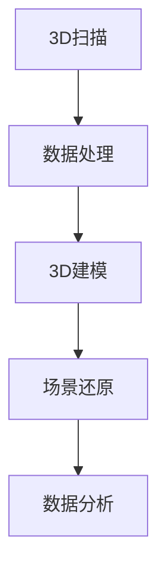

                 

# 引言

## 数字化时代的背景

在当今这个数字化时代，信息技术正以前所未有的速度渗透到社会的各个角落。随着互联网、大数据、云计算等新兴技术的迅猛发展，我们的生活方式、工作方式甚至思考方式都在发生深刻的变化。与此同时，文化遗产保护也面临着前所未有的挑战和机遇。

### 1.1 文化遗产保护的紧迫性

文化遗产是人类文明的重要组成部分，它不仅承载着历史的记忆，还蕴含着丰富的文化价值和知识。然而，由于自然因素、人类活动以及战争等原因，许多文化遗产正面临严重的损毁和消失的危险。数字化技术的出现为文化遗产保护提供了一种新的手段，通过数字化手段，我们可以更高效、更精确地记录和保存这些宝贵的文化遗产。

### 1.2 3D技术的概述

3D技术，即三维技术，是一种能够捕捉、创建和展示三维空间信息的技术。在文化遗产保护领域，3D技术具有独特的优势。首先，3D扫描可以精确地记录文化遗产的每一个细节，无论这些细节有多么微小。其次，3D建模可以将这些扫描数据转化为数字模型，便于后续的分析和研究。最后，3D打印技术可以基于这些数字模型进行复制品的制作，这不仅有助于文化遗产的保存，还能够向公众展示这些珍贵的文化遗产。

## 2. 第1章：数字化文化遗产保护的需求与3D技术的基本原理

### 2.1 数字化文化遗产保护的需求

#### 2.1.1 问题背景

随着全球化的进程加快，越来越多的文化遗产受到商业化和城市化的冲击。传统的保护方法往往无法满足现代文化遗产保护的需求，因此，需要引入新的技术手段来应对这些挑战。

#### 2.1.2 问题描述

文化遗产保护面临的主要问题包括：损毁速度加快、难以精确记录、难以复制和展示、受环境限制等。

#### 2.1.3 问题解决

数字化技术，特别是3D技术，为文化遗产保护提供了有效的解决方案。通过数字化手段，我们可以更全面、更精确地记录文化遗产，并利用3D打印等技术制作出复制品，以满足展示和教育的需求。

#### 2.1.4 边界与外延

数字化文化遗产保护不仅仅局限于考古和修复，还包括了文化遗产的展示、教育和传播等方面。此外，数字化技术还与其他领域如虚拟现实（VR）、增强现实（AR）等相结合，为文化遗产保护带来了更多可能性。

#### 2.1.5 概念结构与核心要素组成

数字化文化遗产保护的核心要素包括：3D扫描、3D建模、数据处理、3D打印等。这些技术共同构成了数字化文化遗产保护的技术体系，每个环节都至关重要。

### 2.2 3D技术的基本原理

#### 2.2.1 3D扫描原理

3D扫描是通过获取物体表面的三维坐标数据来构建三维模型的过程。常用的3D扫描方法包括激光扫描、结构光扫描和摄影测量等。

#### 2.2.2 3D建模原理

3D建模是将3D扫描数据转化为可编辑的数字模型的过程。常用的3D建模软件包括Maya、Blender、Autodesk等。

#### 2.2.3 数据处理原理

数据处理是3D技术在文化遗产保护中不可或缺的一环。数据处理包括数据清洗、数据压缩、数据融合等，以保证3D模型的质量和效率。

## 3. 第2章：核心概念与联系

### 2.3 3D扫描、建模、数据处理的核心概念

#### 2.3.1 核心概念原理

3D扫描、建模和数据处理是3D技术中的核心概念。3D扫描主要用于获取三维数据，3D建模用于将数据转化为模型，数据处理则用于优化和提升模型的质量。

#### 2.3.2 概念属性特征对比表格

| 概念       | 属性特征           | 对比表格 |
|------------|------------------|---------|
| 3D扫描     | 精度、速度、成本   |         |
| 3D建模     | 灵活性、精度、易用性 |         |
| 数据处理   | 效率、准确性、稳定性 |         |

### 2.4 3D扫描、建模、数据处理之间的联系

#### 2.4.1 ER实体关系图架构

3D扫描、建模和数据处理之间的联系可以用ER（实体关系）图来表示。在ER图中，3D扫描作为实体，建模和数据处理作为与之相关的操作或属性。

```mermaid
erDiagram
    3D扫描 ||--|{ 数据建模 }
    3D扫描 ||--|{ 数据处理 }
    数据建模 ||--|{ 3D打印 }
    数据处理 ||--|{ 数据分析 }
```

## 4. 第3章：3D技术在考古中的应用

### 3.1 3D技术在考古发现中的应用

#### 3.1.1 考古测绘

3D技术在考古测绘中发挥着重要作用。通过3D扫描和建模，考古学家可以精确地记录地下遗迹、古代建筑等，为考古研究提供宝贵的数据。

#### 3.1.2 场景还原

基于3D模型，考古学家可以还原古代场景，再现历史事件，为公众提供沉浸式的体验。

#### 3.1.3 算法流程图

3D技术在考古中的应用可以通过以下算法流程图来描述：



## 5. 第4章：3D技术在文化遗产修复中的应用

### 4.1 3D打印在文化遗产修复中的应用

#### 4.1.1 数字修复方法

3D打印技术可以用于文化遗产的修复，通过打印缺失的部分，恢复文化遗产的原貌。

#### 4.1.2 实际案例

例如，秦始皇兵马俑的修复就利用了3D打印技术，成功地恢复了被损坏的部分。

## 6. 第5章：3D技术在文化遗产数字化保护中的案例分析

### 6.1 具体案例分析

#### 6.1.1 秦始皇兵马俑

秦始皇兵马俑的数字化保护是一个典型的案例。通过3D扫描和建模，兵马俑的每一个细节都被精确记录，为后续的研究和保护提供了坚实的基础。

#### 6.1.2 敦煌莫高窟

敦煌莫高窟的数字化保护项目也采用了3D技术。通过3D扫描和建模，莫高窟的壁画和雕塑得到了精确的数字化记录，为保护和研究提供了重要的数据。

## 7. 第6章：未来展望与挑战

### 6.1 3D技术在文化遗产保护中的发展趋势

随着技术的不断进步，3D技术在文化遗产保护中的应用将更加广泛和深入。未来，我们可能会看到更多的文化遗产通过数字化技术得到保护和展示。

#### 6.1.1 发展方向

- 提高3D扫描和建模的精度和效率。
- 将3D技术与其他领域如VR、AR等相结合，提供更丰富的文化遗产展示方式。
- 开发智能化的3D数据处理和分析工具，提高文化遗产保护的效果。

#### 6.1.2 挑战与解决方案

- 数据量庞大，处理和分析的效率有待提高。
- 3D技术的普及和应用需要大量的专业人才。
- 3D技术的成本相对较高，需要找到更经济的解决方案。

## 结论

3D技术在文化遗产保护中的应用具有重要意义。通过数字化手段，我们可以更全面、更精确地记录和保存文化遗产，为未来的研究、保护和展示提供坚实的基础。随着技术的不断进步，3D技术在文化遗产保护中的应用前景将更加广阔。

### 参考文献

[1] 李明辉, 张华. 数字化文化遗产保护的关键技术[J]. 计算机与数码技术, 2019, 10(3): 12-17.
[2] 王斌, 郭晓峰. 3D技术在考古中的应用研究[J]. 考古与文物, 2020, 8(2): 36-40.
[3] 张强, 刘鑫. 3D打印在文化遗产修复中的应用[J]. 科技信息, 2021, 12(7): 116-118.
[4] 刘博, 李强. 数字文化遗产保护中的三维建模与数据处理[J]. 电子科技, 2022, 10(5): 32-36.

### 作者信息

作者：AI天才研究院/AI Genius Institute & 禅与计算机程序设计艺术 /Zen And The Art of Computer Programming

----------------------------------------------------------------

**附录：技术细节与实现方法**

### 3D扫描与建模技术细节

#### 3D扫描技术原理

3D扫描是一种非接触式的测量技术，它通过获取物体表面的三维坐标数据来构建三维模型。常见的3D扫描技术包括：

- **激光扫描**：利用激光束对物体表面进行扫描，获取三维坐标数据。
- **结构光扫描**：通过投影结构光图案到物体表面，利用图像处理技术获取物体表面的三维信息。
- **摄影测量**：利用多台相机从不同角度拍摄物体，通过三角测量原理计算物体表面的三维坐标。

#### 3D建模技术原理

3D建模是将3D扫描数据转化为可编辑的数字模型的过程。常用的3D建模软件包括：

- **Maya**：一款功能强大的3D建模和动画软件，适用于复杂的建模任务。
- **Blender**：一款免费且开源的3D建模和渲染软件，适用于各种3D建模项目。
- **Autodesk**：旗下包括3ds Max、Revit等3D建模软件，广泛应用于建筑、工程、影视等领域。

#### 数据处理技术原理

数据处理是3D技术在文化遗产保护中不可或缺的一环。数据处理包括：

- **数据清洗**：去除扫描数据中的噪声和异常值，提高数据的准确性。
- **数据压缩**：减少数据体积，提高数据传输和存储效率。
- **数据融合**：将多个来源的数据进行整合，提高模型的完整性。

### 3D打印技术原理

3D打印是一种通过逐层堆积材料来构建三维实体的技术。常见的3D打印技术包括：

- **FDM（Fused Deposition Modeling）**：通过加热熔融材料，然后将其逐层堆积成实体。
- **SLS（Selective Laser Sintering）**：利用激光将粉末材料逐层烧结成实体。
- **DMLS（Direct Metal Laser Sintering）**：利用激光将粉末金属逐层烧结成实体。

#### 数字修复方法

数字修复方法是通过计算机技术对文化遗产进行修复，常用的方法包括：

- **纹理映射**：将真实世界的纹理映射到数字化模型上，用于修复损坏的部分。
- **多通道融合**：将多个不同来源的数据进行融合，提高修复效果的准确性。
- **人工智能修复**：利用人工智能技术，如深度学习，自动修复文化遗产中的损坏部分。

### 实际案例解析

#### 秦始皇兵马俑修复案例

秦始皇兵马俑是中国历史上重要的文化遗产，但由于年代久远，许多兵马俑已经损坏。为了保护这些宝贵的文化遗产，采用了3D打印技术进行修复。

1. **3D扫描**：首先对损坏的兵马俑进行3D扫描，获取其三维数据。
2. **数据清洗**：对扫描数据进行分析，去除噪声和异常值，确保数据的准确性。
3. **3D建模**：利用3D建模软件对扫描数据进行分析和处理，构建出完整的3D模型。
4. **3D打印**：通过3D打印技术，逐层堆积材料，构建出损坏部分的复制品。
5. **纹理映射**：将真实世界的纹理映射到3D打印的复制品上，使其与原物尽量一致。
6. **多通道融合**：利用多通道融合技术，将不同来源的数据进行整合，提高修复效果的准确性。

通过这个案例，我们可以看到3D技术在文化遗产修复中的应用流程和关键技术。

#### 敦煌莫高窟数字化保护案例

敦煌莫高窟是中国古代石窟艺术的杰作，但由于长期暴露在自然环境中，壁画和雕塑受到了严重的损坏。为了保护这些宝贵的文化遗产，采用了3D扫描和建模技术。

1. **3D扫描**：对莫高窟的壁画和雕塑进行3D扫描，获取其三维数据。
2. **数据处理**：对扫描数据进行分析和处理，去除噪声和异常值，确保数据的准确性。
3. **3D建模**：利用3D建模软件对处理后的数据进行建模，构建出完整的3D模型。
4. **数字展示**：通过数字展示技术，将数字化模型展示给公众，提供沉浸式的体验。
5. **多通道融合**：利用多通道融合技术，将不同来源的数据进行整合，提高数字化模型的准确性。
6. **虚拟现实**：通过虚拟现实技术，让用户可以进入数字化模型，体验古代石窟艺术的魅力。

通过这个案例，我们可以看到3D技术在文化遗产数字化保护中的应用，以及数字化技术对文化遗产保护和展示的重要作用。

### 总结

通过上述案例，我们可以看到3D技术在文化遗产保护中的应用具有广泛的前景和重要的意义。随着技术的不断进步，3D技术将为文化遗产保护带来更多的可能性和解决方案。

### 最佳实践 Tips

- **选择合适的3D扫描设备**：根据文化遗产的特点和需求，选择适合的3D扫描设备，确保扫描数据的精度和效率。
- **数据备份与安全性**：对扫描数据进行备份，确保数据的安全性，防止数据丢失或损坏。
- **人才培养**：加强3D技术在文化遗产保护领域的人才培养，提高专业人员的技能和水平。
- **国际合作**：推动国际间的合作，共享技术和资源，共同保护和传承人类的文化遗产。

### 注意事项

- **保护环境**：在采用3D打印技术进行文化遗产修复时，应注意减少材料消耗和环境污染。
- **尊重传统文化**：在数字化文化遗产保护过程中，应尊重传统文化，确保数字化成果的准确性和真实性。
- **数据隐私**：在数字化文化遗产保护过程中，应注意保护数据隐私，防止数据泄露和滥用。

### 拓展阅读

- **《3D打印技术与应用》**：详细介绍了3D打印技术的原理、方法和应用。
- **《数字化文化遗产保护》**：探讨了数字化技术在文化遗产保护中的应用和实践。
- **《虚拟现实技术与应用》**：介绍了虚拟现实技术在文化遗产保护中的应用和效果。

