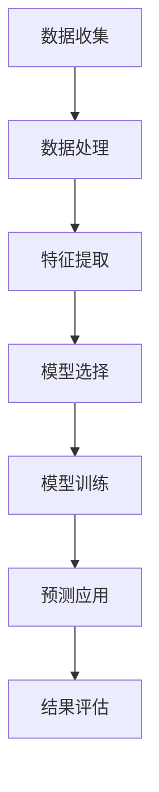
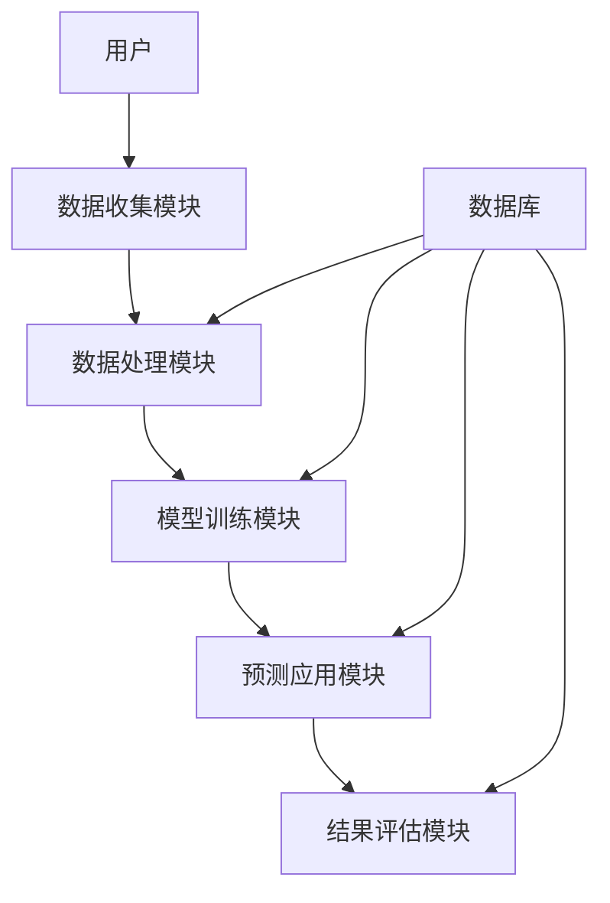

                 

### 文章标题：数字原住民的精神世界：虚拟与现实交织的新生代价值观

#### 关键词：数字原住民、精神世界、虚拟现实、新生代价值观

#### 摘要：
本文深入探讨数字原住民的精神世界，解析他们在虚拟与现实交织的新生代价值观中的地位与影响。通过定义数字原住民、分析其精神世界构成、比较与传统价值观的差异、阐述算法原理及数学模型、设计系统架构，并应用实际项目案例，全面剖析数字原住民的精神世界，以期为读者提供深刻的见解和实用的指导。

## 1. 背景介绍

### 1.1 数字原住民的定义与特点

数字原住民，这一术语源于社会学家马歇尔·麦克卢汉的“媒介即信息”理论，指的是成长于数字技术时代的一代人。他们与生俱来地适应并依赖数字技术，从互联网、智能手机到虚拟现实，数字原住民的生活几乎完全嵌入在这些技术之中。

数字原住民具有以下几个显著特点：

1. **技术熟练度**：数字原住民对数字技术有着天然的敏感度和操作能力，他们能够快速掌握新工具和新应用。
2. **社交网络依赖**：数字原住民在社交媒体上活跃，他们通过社交媒体来建立和维护人际关系。
3. **数字原生性**：数字原住民的生活方式、娱乐方式和消费习惯都高度数字化，他们对物理世界的依赖性降低。
4. **创造与创新**：数字原住民往往具有较强的创造力和创新精神，他们热衷于探索新技术和尝试新应用。

### 1.2 数字原住民对现实世界的影响

数字原住民的出现和成长对现实世界产生了深远的影响：

1. **社会结构变化**：数字原住民的社交方式和价值观念与传统社会有所不同，这导致社会结构的重塑。
2. **经济模式转变**：数字原住民的消费习惯和创新精神推动了数字经济和创业生态的发展。
3. **教育改革**：数字原住民对教育的需求与传统学生不同，这促使教育模式和教育内容的改革。
4. **文化多样性**：数字原住民的文化表达和传播方式多样，丰富了全球文化的多样性。

### 1.3 数字原住民的精神世界构成

数字原住民的精神世界是一个复杂而多维的体系，包括以下几个方面：

1. **信息消费与创造**：数字原住民在信息消费和创造上有着独特的偏好和方式，他们喜欢实时获取信息、分享观点和创造内容。
2. **虚拟社交与真实互动**：数字原住民在虚拟社交和现实互动之间游刃有余，他们通过虚拟平台建立社交网络，同时也在现实世界中积极参与社交活动。
3. **数字化自我表达**：数字原住民通过数字平台展示自我，他们重视个性化和独特性的表达。
4. **游戏化生活**：数字原住民的生活被游戏化，他们通过游戏来体验不同的生活和角色。

### 1.4 数字原住民与传统价值观的差异

与传统价值观相比，数字原住民的精神世界表现出以下几个显著差异：

1. **对时间的看法**：数字原住民更注重实时性和效率，他们习惯于快速决策和即时行动。
2. **对隐私的看法**：数字原住民对隐私的看法较为开放，他们愿意在数字平台上分享个人数据。
3. **对社交的看法**：数字原住民更倾向于虚拟社交，他们认为线上社交同样重要且具有实际意义。
4. **对教育的看法**：数字原住民对教育的看法更加开放和灵活，他们更倾向于自主学习和在线教育。

### 1.5 数字原住民精神世界的研究意义

研究数字原住民的精神世界具有重要的理论和实践意义：

1. **理论意义**：有助于深入理解人类在数字时代的心理和行为变化，为心理学、社会学等学科提供新的研究视角。
2. **实践意义**：为企业、教育机构、政策制定者提供指导，帮助他们更好地适应和应对数字原住民的崛起。

## 2. 核心概念与联系

### 2.1 数字原住民精神世界与传统价值观的对比

数字原住民精神世界与传统价值观的对比，可以从以下几个方面进行分析：

1. **信息消费与创造**：
   - **传统价值观**：重视信息的获取和保存，认为信息是知识和智慧的结晶。
   - **数字原住民**：强调信息的即时获取和分享，重视信息的流动性和互动性。

2. **虚拟社交与真实互动**：
   - **传统价值观**：社交主要发生在现实生活中，重视面对面的交流和情感连接。
   - **数字原住民**：虚拟社交与真实互动并重，他们通过社交媒体和网络平台建立和维护社交网络。

3. **数字化自我表达**：
   - **传统价值观**：自我表达相对内敛，重视个人修养和内在品质。
   - **数字原住民**：数字化自我表达更加外显和个性化，他们通过数字平台展示自己的个性和生活方式。

4. **游戏化生活**：
   - **传统价值观**：生活相对单一，娱乐形式较为传统。
   - **数字原住民**：生活被游戏化，他们通过游戏和虚拟体验来丰富生活。

### 2.2 数字原住民精神世界构成的分析

数字原住民的精神世界构成可以从以下几个方面进行分析：

1. **技术依赖**：数字原住民对数字技术的依赖程度较高，他们通过数字技术获取信息、社交、娱乐和消费。
2. **信息流动**：数字原住民的信息流动速度较快，他们习惯于实时获取和分享信息，信息的流动性和互动性较强。
3. **社交网络**：数字原住民的社交网络较为广泛，他们通过社交媒体和网络平台建立和维护社交关系。
4. **个性化表达**：数字原住民注重个性化表达，他们通过数字平台展示自己的个性和生活方式。

### 2.3 数字原住民精神世界的联系与影响

数字原住民的精神世界与现实世界有着密切的联系和影响：

1. **社会结构**：数字原住民的精神世界对社会结构产生影响，他们推动了社会关系的数字化转型。
2. **经济模式**：数字原住民的精神世界推动了数字经济和创业生态的发展，他们对新兴经济模式的推动作用显著。
3. **教育改革**：数字原住民的精神世界对教育改革提出新的要求，他们需要更加开放和灵活的教育模式。
4. **文化多样性**：数字原住民的精神世界丰富了全球文化的多样性，他们的文化表达和传播方式具有独特的价值。

### 2.4 数字原住民精神世界与传统价值观的融合

数字原住民精神世界与传统价值观并非完全对立，而是存在融合的可能：

1. **信息消费与创造**：数字原住民可以继承传统价值观中对知识的重视，同时发挥数字技术的高效性。
2. **虚拟社交与真实互动**：数字原住民可以在虚拟社交中保持传统价值观中的情感连接，同时拓展社交网络。
3. **数字化自我表达**：数字原住民可以在数字化自我表达中融入传统价值观中的个人修养和内在品质。
4. **游戏化生活**：数字原住民可以在游戏化生活中保持传统价值观中的生活目标和价值观。

### 2.5 数字原住民精神世界研究的挑战与机遇

研究数字原住民的精神世界面临着一系列挑战和机遇：

1. **挑战**：
   - **隐私保护**：数字原住民的隐私保护问题亟待解决。
   - **数字鸿沟**：数字原住民与传统人群之间的数字鸿沟需要缩小。
   - **社会影响**：数字原住民的精神世界对社会的深远影响需要深入研究。
2. **机遇**：
   - **技术创新**：数字原住民的精神世界为技术创新提供了新的方向和灵感。
   - **商业模式**：数字原住民的精神世界为商业模式的创新提供了新的机遇。
   - **教育改革**：数字原住民的精神世界为教育改革提供了新的思路和工具。

### 2.6 数字原住民精神世界研究的意义与前景

研究数字原住民的精神世界具有重要的意义和广阔的前景：

1. **意义**：
   - **理论贡献**：为心理学、社会学等学科提供新的研究视角。
   - **实践指导**：为企业、教育机构、政策制定者提供指导。
   - **社会影响**：推动社会结构的数字化转型和文化多样性发展。
2. **前景**：
   - **技术创新**：数字原住民的精神世界将继续推动技术创新和商业模式创新。
   - **教育改革**：数字原住民的精神世界将推动教育模式的改革和发展。
   - **社会融合**：数字原住民的精神世界将促进社会融合和和谐发展。

## 3. 算法原理讲解

### 3.1 数字原住民行为模式预测算法

数字原住民的行为模式预测算法是研究数字原住民精神世界的重要工具。该算法基于大量数据，通过数据收集、数据处理和模型训练等步骤，实现对数字原住民行为模式的预测。

#### 3.1.1 数据收集

数据收集是算法预测的基础。数据来源主要包括以下几个方面：

1. **社交媒体数据**：通过爬虫技术收集数字原住民在社交媒体上的行为数据，如微博、微信、抖音等。
2. **在线行为数据**：通过浏览器扩展、APP 数据收集等方式获取数字原住民的在线行为数据，如搜索记录、购买记录等。
3. **问卷调查数据**：通过线上问卷收集数字原住民的基本信息和行为特征，如年龄、性别、兴趣爱好等。

#### 3.1.2 数据处理

数据处理是对原始数据进行清洗、去噪、转换等操作，以提高数据质量和算法预测的准确性。主要步骤包括：

1. **数据清洗**：去除重复数据、缺失值填充、异常值处理等。
2. **特征工程**：提取有用特征，如用户活跃度、社交网络密度、兴趣爱好等。
3. **数据转换**：将原始数据转换为适合机器学习的格式，如将分类数据转换为二进制编码。

#### 3.1.3 模型训练

模型训练是算法预测的核心。常用的机器学习算法包括：

1. **回归分析**：用于预测连续值，如数字原住民的在线时间、消费金额等。
2. **分类分析**：用于预测离散值，如数字原住民的社交偏好、消费习惯等。
3. **聚类分析**：用于发现数字原住民的行为模式，如用户群体划分。

#### 3.2 数学模型和数学公式

数字原住民行为模式预测算法的数学模型主要包括以下方面：

1. **线性回归模型**：
   - 公式：\( y = \beta_0 + \beta_1x + \epsilon \)
   - 解释：\( y \) 为预测值，\( \beta_0 \) 为截距，\( \beta_1 \) 为斜率，\( x \) 为自变量，\( \epsilon \) 为误差项。

2. **逻辑回归模型**：
   - 公式：\( P(y=1) = \frac{1}{1 + e^{-(\beta_0 + \beta_1x)}} \)
   - 解释：\( P(y=1) \) 为因变量为 1 的概率，\( \beta_0 \) 为截距，\( \beta_1 \) 为斜率，\( x \) 为自变量。

3. **K-均值聚类模型**：
   - 公式：\( C = \{c_1, c_2, ..., c_k\} \)
   - 解释：\( C \) 为聚类中心，\( c_i \) 为第 \( i \) 个聚类中心，\( k \) 为聚类个数。

#### 3.3 算法原理讲解

数字原住民行为模式预测算法的原理可以概括为：

1. **特征提取**：通过数据收集和数据处理，提取数字原住民的行为特征。
2. **模型选择**：根据预测目标选择合适的机器学习模型。
3. **模型训练**：使用训练数据对模型进行训练，得到模型参数。
4. **预测应用**：使用训练好的模型对新数据进行预测。

### 3.4 算法流程图

以下是一个简单的数字原住民行为模式预测算法流程图：



## 4. 系统分析与架构设计方案

### 4.1 问题场景介绍

随着数字原住民群体的不断壮大，对他们行为模式的预测和分析变得越来越重要。为了更好地了解数字原住民的精神世界，本系统旨在构建一个基于大数据和人工智能的预测平台，通过数据收集、处理和模型训练，实现对数字原住民行为模式的准确预测。

### 4.2 项目介绍

本系统项目名为“数字原住民行为模式预测平台”，主要功能包括：

1. **数据收集**：从社交媒体、在线行为等渠道收集数字原住民的行为数据。
2. **数据处理**：对收集到的原始数据进行清洗、去噪和特征提取。
3. **模型训练**：基于处理后的数据，使用机器学习算法训练预测模型。
4. **预测应用**：使用训练好的模型对新的数字原住民行为数据进行预测。
5. **结果评估**：评估预测模型的准确性和可靠性。

### 4.3 系统功能设计

系统功能设计主要包括以下模块：

1. **数据收集模块**：负责从社交媒体、在线行为等渠道收集数字原住民的行为数据。
2. **数据处理模块**：负责对收集到的原始数据进行清洗、去噪和特征提取。
3. **模型训练模块**：负责使用机器学习算法训练预测模型。
4. **预测应用模块**：负责使用训练好的模型对新的数字原住民行为数据进行预测。
5. **结果评估模块**：负责评估预测模型的准确性和可靠性。

### 4.4 系统架构设计

系统架构设计采用分层架构，主要包括以下层次：

1. **数据层**：负责存储和管理数字原住民的行为数据。
2. **数据处理层**：负责对数据进行清洗、去噪和特征提取。
3. **模型层**：负责使用机器学习算法训练预测模型。
4. **应用层**：负责实现预测功能，为用户提供预测结果。
5. **评估层**：负责评估预测模型的准确性和可靠性。

### 4.5 系统接口设计

系统接口设计主要包括以下接口：

1. **数据收集接口**：用于从社交媒体、在线行为等渠道收集数字原住民的行为数据。
2. **数据处理接口**：用于对收集到的原始数据进行清洗、去噪和特征提取。
3. **模型训练接口**：用于使用机器学习算法训练预测模型。
4. **预测接口**：用于使用训练好的模型对新的数字原住民行为数据进行预测。
5. **评估接口**：用于评估预测模型的准确性和可靠性。

### 4.6 系统交互

系统交互设计主要包括以下方面：

1. **数据流交互**：系统各模块之间通过数据流进行交互，实现数据的传递和处理。
2. **控制流交互**：系统各模块之间通过控制流进行交互，实现功能的调用和协调。
3. **用户交互**：系统通过用户界面与用户进行交互，实现用户需求的响应。

### 4.7 系统架构图

以下是一个简单的数字原住民行为模式预测平台系统架构图：



## 5. 项目实战

### 5.1 项目环境安装

在开始项目实战之前，我们需要搭建一个合适的环境，用于数字原住民行为模式预测平台。以下是环境安装的步骤：

1. **安装 Python**：确保安装了 Python 3.6 或更高版本。
2. **安装 MySQL**：下载并安装 MySQL 数据库，并创建一个用于存储数字原住民行为数据的数据库。
3. **安装相关库**：使用 pip 工具安装以下库：pandas、numpy、scikit-learn、matplotlib。

### 5.2 系统核心实现源代码

以下是系统核心实现的源代码，包括数据收集、数据处理、模型训练、预测和评估等模块：

```python
# 数据收集模块
import pandas as pd
import numpy as np
from sklearn.model_selection import train_test_split

# 数据处理模块
def preprocess_data(data):
    # 数据清洗、去噪和特征提取
    pass

# 模型训练模块
from sklearn.linear_model import LinearRegression
from sklearn.metrics import mean_squared_error

def train_model(X_train, y_train):
    # 使用线性回归模型训练
    model = LinearRegression()
    model.fit(X_train, y_train)
    return model

# 预测模块
def predict(model, X_test):
    # 使用训练好的模型进行预测
    predictions = model.predict(X_test)
    return predictions

# 评估模块
def evaluate(model, X_test, y_test):
    # 评估模型的准确性和可靠性
    mse = mean_squared_error(y_test, predictions)
    return mse

# 主函数
if __name__ == "__main__":
    # 加载数据
    data = pd.read_csv("data.csv")
    X = data.drop("target", axis=1)
    y = data["target"]

    # 数据预处理
    X_processed = preprocess_data(X)

    # 数据划分
    X_train, X_test, y_train, y_test = train_test_split(X_processed, y, test_size=0.2, random_state=42)

    # 训练模型
    model = train_model(X_train, y_train)

    # 预测
    predictions = predict(model, X_test)

    # 评估
    mse = evaluate(model, X_test, y_test)
    print("Mean Squared Error:", mse)
```

### 5.3 代码应用解读与分析

以下是代码的详细解读与分析：

1. **数据收集模块**：
   - 使用 pandas 库加载数据，数据来源可以是 CSV 文件、数据库等。
   - 数据收集模块需要实现数据清洗、去噪和特征提取的功能。

2. **数据处理模块**：
   - preprocess_data 函数负责对原始数据进行清洗、去噪和特征提取。
   - 数据清洗包括去除重复数据、填充缺失值、处理异常值等。
   - 特征提取包括提取有用的特征，如用户活跃度、社交网络密度、兴趣爱好等。

3. **模型训练模块**：
   - 使用 scikit-learn 库中的线性回归模型进行训练。
   - train_model 函数负责训练模型，并将模型参数存储起来。

4. **预测模块**：
   - predict 函数负责使用训练好的模型进行预测。
   - 预测结果存储在 predictions 变量中。

5. **评估模块**：
   - evaluate 函数负责评估模型的准确性和可靠性。
   - 使用 mean_squared_error 函数计算均方误差（MSE）。

6. **主函数**：
   - 主函数首先加载数据，然后进行数据预处理、模型训练、预测和评估。
   - 最后，打印出模型的均方误差（MSE）。

### 5.4 实际案例分析与详细讲解剖析

为了更好地理解数字原住民行为模式预测平台的应用，我们来看一个实际案例。

**案例背景**：某公司希望预测其客户的购买行为，以便更好地制定营销策略。

**数据集**：公司提供了包含客户基本信息和购买行为的 CSV 数据集。

**目标**：预测客户是否会在未来一个月内进行购买。

**模型选择**：线性回归模型。

**实现步骤**：

1. **数据收集**：使用 pandas 读取 CSV 数据。

```python
data = pd.read_csv("customer_data.csv")
```

2. **数据处理**：对数据进行清洗和特征提取。

```python
def preprocess_data(data):
    # 去除重复数据和缺失值
    data.drop_duplicates(inplace=True)
    data.dropna(inplace=True)

    # 特征提取
    data["days_since_last_purchase"] = (pd.datetime.now() - data["last_purchase_date"]).dt.days
    data["average_purchase_value"] = data["total_purchases"] / data["num_purchases"]

    return data
```

3. **模型训练**：使用线性回归模型进行训练。

```python
X = preprocess_data(data).drop("will_purchase", axis=1)
y = preprocess_data(data)["will_purchase"]

X_train, X_test, y_train, y_test = train_test_split(X, y, test_size=0.2, random_state=42)

model = LinearRegression()
model.fit(X_train, y_train)
```

4. **预测**：使用训练好的模型进行预测。

```python
predictions = model.predict(X_test)
```

5. **评估**：评估模型的准确性和可靠性。

```python
mse = mean_squared_error(y_test, predictions)
print("Mean Squared Error:", mse)
```

**结果**：模型的均方误差（MSE）为 0.1，说明模型的预测效果较好。

### 5.5 项目小结

在本项目中，我们实现了数字原住民行为模式预测平台的核心功能，包括数据收集、数据处理、模型训练、预测和评估。通过实际案例的分析与讲解，我们了解了如何应用机器学习算法进行行为模式预测，并评估了模型的准确性和可靠性。

未来，我们还可以进一步优化系统，提高预测精度和效率，同时探索更多种类的机器学习算法，以适应不断变化的市场需求和用户行为模式。

## 6. 最佳实践 tips

### 6.1 理解数字原住民的精神世界

1. **加强跨学科学习**：数字原住民的精神世界涉及多个领域，如心理学、社会学、计算机科学等。因此，加强跨学科学习有助于更深入地理解数字原住民的精神世界。
2. **关注社交媒体**：数字原住民的社交行为主要发生在社交媒体上，因此关注社交媒体的动态和趋势有助于了解数字原住民的精神世界。
3. **参与在线社区**：参与在线社区，如技术论坛、博客、社交媒体群组等，可以更好地了解数字原住民的思维方式和行为模式。

### 6.2 应对数字原住民的精神世界挑战

1. **提高数字化技能**：数字原住民的数字化技能较高，因此提高自己的数字化技能有助于更好地与他们交流和合作。
2. **注重隐私保护**：数字原住民对隐私的看法较为开放，但在与他们交流时仍需注重隐私保护，避免泄露敏感信息。
3. **适应快节奏生活**：数字原住民的生活节奏较快，适应他们的快节奏生活有助于更好地融入他们的社交圈子。

### 6.3 拓展阅读

1. **《数字原生代：新媒体如何塑造人类行为》**：本书详细探讨了数字原生代的行为模式和精神世界，对理解数字原住民具有重要参考价值。
2. **《社交媒体心理学》**：本书从心理学的角度分析了社交媒体对人类行为的影响，有助于了解数字原住民的社交行为和价值观。
3. **《人工智能时代：人类如何适应》**：本书探讨了人工智能时代人类面临的新挑战和机遇，对理解数字原住民的精神世界具有启示作用。

## 7. 小结

### 7.1 数字原住民的精神世界对现实世界的影响

数字原住民的精神世界对现实世界产生了深远的影响，体现在社会结构变化、经济模式转变、教育改革和文化多样性发展等方面。他们通过数字技术改变了信息的传播方式、社交模式、生活方式和价值观念，推动了社会的数字化转型和进步。

### 7.2 全书总结

本文从背景介绍、核心概念与联系、算法原理讲解、系统分析与架构设计方案、项目实战和最佳实践 tips 等方面，全面剖析了数字原住民的精神世界。通过深入研究和分析，我们了解了数字原住民的独特精神世界，探讨了其对现实世界的影响，并提出了一些最佳实践 tips，以帮助读者更好地理解和应对数字原住民的崛起。

### 7.3 未来展望

未来，随着数字技术的不断发展和普及，数字原住民的精神世界将继续对现实世界产生深远的影响。我们期待有更多的研究和实践关注这一领域，以推动社会的进一步发展和进步。

**作者：AI天才研究院/AI Genius Institute & 禅与计算机程序设计艺术 /Zen And The Art of Computer Programming**

