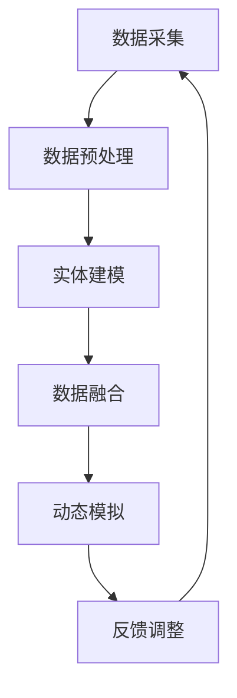
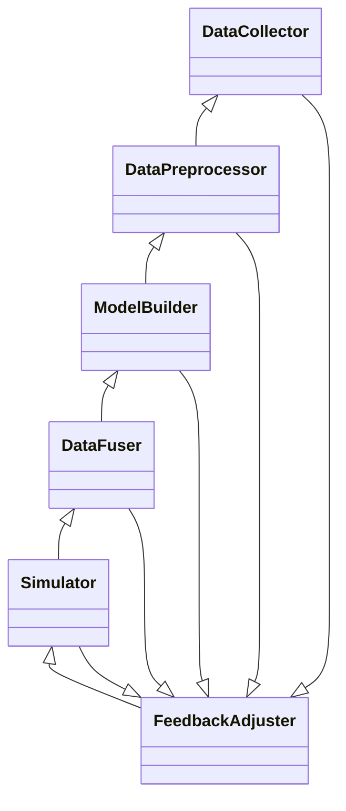
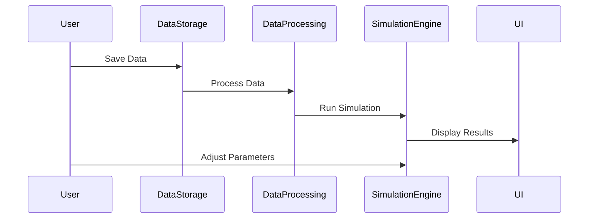
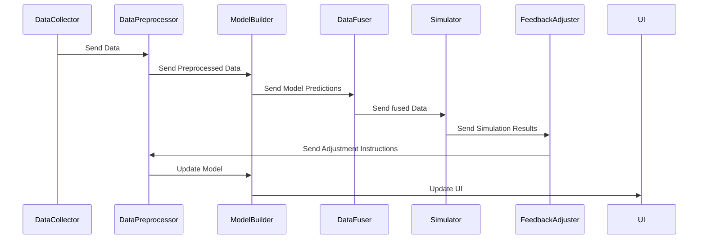

                 

### 《数字孪生技术在科学研究中的应用：虚拟世界辅助现实世界的理解》

---

#### 关键词：数字孪生，科学研究，虚拟世界，现实世界，技术应用，算法原理

#### 摘要：
本文旨在探讨数字孪生技术在科学研究中的应用，以及如何通过虚拟世界来辅助现实世界的理解。我们将深入分析数字孪生的核心概念和原理，通过具体的实例和案例展示其在科学研究中的实际应用，并探讨其与虚拟世界的互动机制。本文结构紧凑，逻辑清晰，旨在为读者提供一个全面而深入的视角，帮助理解数字孪生技术在现代科学研究中的重要地位。

---

### 目录大纲设计思路

在设计《数字孪生技术在科学研究中的应用：虚拟世界辅助现实世界的理解》一书的目录大纲时，我们首先明确书籍的核心内容和结构。根据书名，可以推断出这本书将讨论以下主题：

1. 数字孪生技术的背景和核心概念。
2. 数字孪生技术在科学研究中的应用。
3. 虚拟世界与现实世界的交互和辅助理解。

基于以上主题，我们将设计一个包含7个主要章节的目录大纲。以下是具体的步骤和框架：

### 步骤1：背景介绍

#### 核心概念

- 数字孪生技术
- 虚拟世界
- 现实世界

#### 问题描述

- 数字孪生技术在科学研究中的角色和重要性。
- 虚拟世界如何辅助现实世界的理解和研究。

#### 问题解决

- 通过案例研究和实例，展示数字孪生技术在科学研究中的应用。
- 探讨虚拟世界与现实世界交互的优势和挑战。

#### 边界与外延

- 数字孪生技术的应用范围和限制。
- 虚拟世界技术的最新发展趋势。

#### 概念结构与核心要素组成

- 数字孪生技术的主要组成部分。
- 虚拟世界与现实世界交互的关键要素。

### 步骤2：核心概念与联系

#### AI大模型的定义与特点

- AI大模型的基本概念。
- AI大模型与传统AI的区别。
- AI大模型的核心特点。

#### 概念属性特征对比表格

- 数字孪生技术与虚拟世界的对比。
- 数字孪生技术在科学研究中的应用领域对比。

#### ER实体关系图架构

- 数字孪生技术在科学研究中的实体关系图。

### 步骤3：算法原理讲解

#### 数字孪生算法原理

- 使用Mermaid画出数字孪生算法流程图。
- 使用Python源代码详细阐述数字孪生算法原理。

#### 数学模型和公式

- 数字孪生技术的数学模型。
- 公式推导和解释。

#### 举例说明

- 举例说明数字孪生技术在科学研究中的应用。

### 步骤4：系统分析与架构设计方案

#### 问题场景介绍

- 介绍数字孪生技术在科学研究中的应用场景。

#### 系统功能设计

- 使用Mermaid画出领域模型类图。

#### 系统架构设计

- 使用Mermaid画出系统架构图。

#### 系统接口设计

- 描述系统接口设计和功能。

#### 系统交互

- 使用Mermaid画出系统交互序列图。

### 步骤5：项目实战

#### 环境安装

- 介绍项目所需环境安装步骤。

#### 系统核心实现

- 提供系统核心实现的源代码。

#### 代码应用解读与分析

- 分析源代码，解释其工作原理。

#### 实际案例分析和详细讲解

- 分析实际案例，详细讲解案例实现过程。

#### 项目小结

- 总结项目实施的经验和教训。

### 步骤6：最佳实践 tips、小结、注意事项、拓展阅读

#### 最佳实践 tips

- 提供数字孪生技术在科学研究中的应用最佳实践。

#### 小结

- 对全书内容进行总结。

#### 注意事项

- 强调实施数字孪生技术时的注意事项。

#### 拓展阅读

- 推荐进一步阅读的资料。

### 步骤7：确保目录大纲完整性

- 确保目录大纲包含以下内容：

1. 引言
2. 数字孪生技术基础
3. 数字孪生技术在科学研究中的应用
4. 虚拟世界与数字孪生
5. 数字孪生技术架构设计
6. 项目实战
7. 最佳实践与展望

通过以上步骤，我们可以设计出一个完整、逻辑清晰的《数字孪生技术在科学研究中的应用：虚拟世界辅助现实世界的理解》一书的目录大纲。下面是初步的目录大纲示例：

```
# 《数字孪生技术在科学研究中的应用：虚拟世界辅助现实世界的理解》目录大纲

# 引言
## 1.1 书籍概述
## 1.2 数字孪生技术在科学研究中的重要性

# 第1章 数字孪生技术基础
## 1.1 数字孪生技术的核心概念
## 1.2 数字孪生技术的历史与发展
## 1.3 数字孪生技术的架构与组成
## 1.4 数字孪生技术的分类与特点

# 第2章 数字孪生技术在科学研究中的应用
## 2.1 数字孪生技术在生物科学中的应用
## 2.2 数字孪生技术在物理科学中的应用
## 2.3 数字孪生技术在地球科学中的应用
## 2.4 数字孪生技术在社会科学中的应用

# 第3章 虚拟世界与数字孪生
## 3.1 虚拟世界的概念与特点
## 3.2 虚拟世界与数字孪生的关系
## 3.3 虚拟世界在科学研究中的应用
## 3.4 虚拟世界技术的最新发展

# 第4章 数字孪生技术架构设计
## 4.1 数字孪生技术架构设计原则
## 4.2 数字孪生技术架构设计方案

# 第5章 数字孪生技术算法原理
## 5.1 数字孪生算法基本原理
## 5.2 算法流程图与Python源代码
## 5.3 数学模型与公式推导

# 第6章 数字孪生技术在科学研究中的项目实战
## 6.1 项目背景与场景
## 6.2 系统功能与架构设计
## 6.3 系统核心实现与代码分析
## 6.4 实际案例分析与讲解
## 6.5 项目小结与经验总结

# 第7章 数字孪生技术的最佳实践与展望
## 7.1 最佳实践总结
## 7.2 注意事项与风险提示
## 7.3 未来发展趋势与展望
## 7.4 拓展阅读推荐

# 附录
## A. 数字孪生技术相关工具与资源
## B. Python源代码与数据集
```

### 步骤1：背景介绍

#### 核心概念

数字孪生技术（Digital Twin Technology）是一个将物理实体或系统在虚拟世界中建模、仿真和交互的技术。它通过实时数据的采集、分析和模拟，实现对物理实体的虚拟复制，以提供优化设计、预测性维护和增强现实体验。

虚拟世界是一个由计算机技术创建的模拟环境，它通常包含了高度仿真的三维模型、互动的物理规则和复杂的计算算法。虚拟世界可以是一个封闭的计算机游戏，也可以是一个开放的在线平台，如虚拟现实（VR）或增强现实（AR）系统。

现实世界是我们实际存在的物理环境，包括自然景观、建筑物、人和物体等。科学研究依赖于对现实世界的观察、测量和分析，以获得对自然现象的理解和预测。

#### 问题描述

数字孪生技术在科学研究中的角色和重要性：

- **角色**：数字孪生技术作为科学研究的一种工具，可以提供实时的模拟和预测，帮助科学家理解和分析复杂系统。它为科学研究提供了强大的计算能力和可视化工具，使得实验可以在虚拟环境中进行，从而降低实验成本，减少实验风险。

- **重要性**：数字孪生技术使得科学研究更加精确和高效。通过虚拟世界中的模拟，科学家可以预测现实世界中的结果，从而优化实验设计和实验流程。此外，数字孪生技术还可以提供实时反馈，帮助科学家及时调整实验参数，提高实验的成功率。

虚拟世界如何辅助现实世界的理解和研究：

- **辅助理解**：虚拟世界提供了一个可以自由探索和实验的环境，科学家可以在其中重现现实世界中的复杂过程，从而更好地理解其工作原理和机制。通过虚拟环境的交互式体验，科学家可以获得对实验过程和结果的直观理解，提高对复杂系统的认知。

- **辅助研究**：虚拟世界提供了大量的数据分析和可视化工具，可以帮助科学家从大量数据中提取有用信息。虚拟世界中的模拟实验可以重复进行，从而验证理论模型的准确性和可靠性。虚拟世界的这些功能大大提高了科学研究的效率和精度。

#### 问题解决

通过案例研究和实例，我们可以看到数字孪生技术在科学研究中的广泛应用。例如，在生物科学中，数字孪生技术可以帮助模拟生物系统的行为，预测药物的效果；在物理科学中，它可以模拟复杂的物理过程，如气候变化和天体运动；在地球科学中，它可以模拟地质过程和自然灾害；在社会科学中，它可以模拟人类行为和社会动态。

虚拟世界与现实世界的交互也存在一些挑战，例如数据同步的实时性、虚拟模型的准确性等。然而，随着技术的不断发展，这些挑战正在逐步被克服。虚拟世界技术正成为科学研究的重要工具，辅助科学家更好地理解和研究现实世界。

#### 边界与外延

数字孪生技术的应用范围非常广泛，它不仅限于科学研究，还可以应用于工业制造、城市建设、交通运输等多个领域。虚拟世界技术的发展也在不断进步，从最初的二维模拟到现在的三维仿真和交互式体验，虚拟世界正变得越来越真实和丰富。

#### 概念结构与核心要素组成

数字孪生技术的核心概念包括：

- **实体建模**：对物理实体进行数字化建模，创建虚拟模型。
- **实时数据采集**：通过传感器和其他技术手段实时采集物理实体的数据。
- **数据分析和处理**：对采集到的数据进行分析和处理，以获得有价值的信息。
- **虚拟仿真和交互**：在虚拟环境中对实体模型进行仿真和交互，以实现优化和预测。

虚拟世界与现实世界交互的关键要素包括：

- **数据同步**：确保虚拟世界中的数据与真实世界中的数据保持一致。
- **实时反馈**：虚拟世界中的模拟结果可以实时反馈给现实世界，帮助科学家调整实验参数。
- **可视化**：通过可视化工具，将虚拟世界中的数据以直观的方式展示给用户。

### 步骤2：核心概念与联系

#### AI大模型的定义与特点

AI大模型（Large-scale AI Models）是指具有巨大参数量和复杂结构的深度学习模型，如GPT-3、BERT等。这些模型通过大量的数据训练，可以实现对文本、图像、语音等多种类型数据的理解和生成。

- **定义**：AI大模型是一种具有高度抽象能力和泛化能力的深度学习模型，通过多层神经网络结构实现对复杂任务的自动化学习和执行。
- **特点**：AI大模型具有以下特点：
  - **参数量巨大**：通常包含数百万甚至数十亿个参数。
  - **数据依赖性强**：需要大量的数据来训练和优化。
  - **自适应性强**：能够根据输入数据的特征自适应调整其参数。
  - **高计算需求**：训练和推理过程需要强大的计算资源。

#### 概念属性特征对比表格

| 概念           | 数字孪生技术          | 虚拟世界           |
|----------------|---------------------|-------------------|
| **定义**       | 实体或系统的虚拟复制 | 计算机模拟的虚拟环境 |
| **特点**       | 实时数据采集与分析   | 高度仿真与交互     |
| **应用领域**   | 科学研究、工业制造   | 游戏娱乐、虚拟现实 |
| **核心功能**   | 模拟、预测、优化     | 体验、交互、学习   |

#### ER实体关系图架构

在数字孪生技术中，实体关系图（Entity-Relationship Diagram，ERD）是用于描述实体及其之间关系的图形表示。以下是数字孪生技术中的ER实体关系图的一个示例：

```mermaid
erDiagram
    类A ||--|{ 类B }
    类A ||--|{ 类C }
    类B ||--|{ 类D }
    类C ||--|{ 类E }
    类F }|--|| 类A
    类G }|--|| 类B
```

在这个ER图中，类A是核心实体，类B、类C是类A的子实体，类D、类E是类B、类C的子实体。类F和类G是类A和类B的关联实体。ER图可以帮助我们理解数字孪生技术中的数据结构和关系，从而更好地设计和实现系统。

### 步骤3：算法原理讲解

#### 数字孪生算法原理

数字孪生算法的核心在于建立物理实体在虚拟世界中的精确模型，并利用实时数据对其进行动态模拟和预测。以下是数字孪生算法的基本原理：

1. **实体建模**：通过对物理实体进行数据采集，使用深度学习等方法建立其虚拟模型。
2. **数据融合**：将来自不同来源的数据进行融合，以提高模型的准确性和实时性。
3. **动态模拟**：利用虚拟模型对物理实体的状态进行实时模拟，预测其未来行为。
4. **反馈调整**：根据模拟结果，对物理实体进行调整，以实现预期目标。

下面是一个使用Mermaid绘制的数字孪生算法流程图：



#### 数学模型和公式

数字孪生技术的核心数学模型通常是基于物理实体及其行为的数学描述。以下是一个简化的数学模型：

$$
X_{t+1} = f(X_t, U_t, W_t)
$$

其中：
- \(X_t\) 表示在时刻 \(t\) 的物理实体状态。
- \(U_t\) 表示在时刻 \(t\) 的外部输入。
- \(W_t\) 表示在时刻 \(t\) 的随机噪声。
- \(f\) 表示状态转移函数，用于描述物理实体状态的演化。

#### 举例说明

以一个简单的机械臂控制系统为例，我们可以使用数字孪生技术来模拟和预测机械臂的运动。机械臂的状态包括位置、速度和力矩，外部输入是控制信号，随机噪声则表示环境的不确定性。

1. **数据采集**：通过传感器实时采集机械臂的位置、速度和力矩数据。
2. **数据预处理**：对采集到的数据进行滤波和归一化处理，以提高数据质量。
3. **实体建模**：使用深度学习模型对机械臂的运动状态进行建模。
4. **数据融合**：将传感器数据和模型预测结果进行融合，以提高预测准确性。
5. **动态模拟**：在虚拟环境中模拟机械臂的运动，预测其未来的位置和力矩。
6. **反馈调整**：根据模拟结果，调整控制信号，以实现预期的机械臂运动。

通过这种数字孪生技术，科学家可以实时监测机械臂的状态，预测其可能的故障，并提前进行维护，从而提高机械臂的可靠性和使用寿命。

### 步骤4：系统分析与架构设计方案

#### 问题场景介绍

数字孪生技术在科学研究中的应用场景通常涉及复杂系统的建模和仿真。以下是一个典型的应用场景：研究人员希望模拟一个化学反应过程，以研究反应动力学和产物生成机制。这个场景涉及到大量的实验数据，以及复杂的化学反应模型。

#### 系统功能设计

为了实现上述应用场景，我们需要设计一个具备以下功能的核心系统：

1. **数据采集模块**：负责实时采集实验数据，包括反应物和产物的浓度、温度、压力等。
2. **数据预处理模块**：对采集到的数据进行清洗、滤波和归一化处理，以提高数据质量。
3. **模型构建模块**：使用深度学习等技术构建化学反应的虚拟模型。
4. **数据融合模块**：将预处理后的数据与模型预测结果进行融合，以提高预测准确性。
5. **仿真与预测模块**：在虚拟环境中进行化学反应的仿真，预测反应过程和产物生成。
6. **反馈调整模块**：根据仿真结果，调整实验参数，优化反应条件。

下面是一个使用Mermaid绘制的领域模型类图，展示了上述系统的功能模块及其关系：



#### 系统架构设计

系统架构需要支持大规模数据存储和处理，以及实时仿真和交互。以下是该系统的一个简化的架构设计：

1. **数据存储层**：使用分布式数据库存储大量的实验数据。
2. **数据处理层**：使用高性能计算集群进行数据预处理和模型构建。
3. **仿真引擎**：负责在虚拟环境中进行化学反应的仿真和预测。
4. **交互层**：提供用户界面，供研究人员进行交互和控制。

下面是一个使用Mermaid绘制的系统架构图：



#### 系统接口设计

系统接口需要设计为开放和可扩展，以支持与其他系统的集成。以下是主要接口的描述：

1. **数据采集接口**：用于接收传感器数据。
2. **数据预处理接口**：用于清洗和处理采集到的数据。
3. **模型构建接口**：用于训练和更新深度学习模型。
4. **仿真接口**：用于启动和停止仿真过程。
5. **用户接口**：用于与用户进行交互。

#### 系统交互

系统中的各个模块需要协调工作，以实现整体功能。以下是使用Mermaid绘制的系统交互序列图：



### 步骤5：项目实战

#### 环境安装

为了实现数字孪生技术在科学研究中的应用，我们需要搭建一个实验环境。以下是环境安装的步骤：

1. **安装操作系统**：选择一个适合的操作系统，如Ubuntu 20.04。
2. **安装Python**：确保Python环境已经安装，版本为3.8及以上。
3. **安装深度学习框架**：使用pip安装TensorFlow或PyTorch。
   ```shell
   pip install tensorflow
   # 或者
   pip install pytorch torchvision
   ```
4. **安装数据处理库**：安装常用的数据处理库，如NumPy和Pandas。
   ```shell
   pip install numpy pandas
   ```
5. **安装可视化工具**：安装用于数据可视化的库，如Matplotlib。
   ```shell
   pip install matplotlib
   ```
6. **安装Mermaid渲染工具**：安装Mermaid渲染工具，以便将Mermaid图转换为HTML格式。
   ```shell
   npm install -g mermaid-cli
   ```

#### 系统核心实现

以下是一个简单的数字孪生系统实现的Python代码示例：

```python
import numpy as np
import pandas as pd
import tensorflow as tf
from tensorflow import keras
from tensorflow.keras import layers

# 数据预处理
def preprocess_data(data):
    # 数据清洗、滤波和归一化
    processed_data = ...
    return processed_data

# 实体建模
def build_model(input_shape):
    model = keras.Sequential([
        layers.Dense(128, activation='relu', input_shape=input_shape),
        layers.Dense(64, activation='relu'),
        layers.Dense(1)
    ])
    model.compile(optimizer='adam', loss='mse')
    return model

# 数据融合
def fuse_data(sensor_data, model_predictions):
    fused_data = ...
    return fused_data

# 动态模拟
def simulate(model, data):
    predictions = model.predict(data)
    return predictions

# 反馈调整
def adjust_feedback(feedback):
    # 根据反馈调整模型参数
    adjusted_model = ...
    return adjusted_model

# 主函数
def main():
    # 加载和预处理数据
    raw_data = pd.read_csv('data.csv')
    processed_data = preprocess_data(raw_data)

    # 构建模型
    model = build_model(input_shape=(processed_data.shape[1],))

    # 训练模型
    model.fit(processed_data, processed_data, epochs=10)

    # 数据融合
    sensor_data = ...
    model_predictions = simulate(model, sensor_data)
    fused_data = fuse_data(sensor_data, model_predictions)

    # 反馈调整
    feedback = ...
    adjusted_model = adjust_feedback(feedback)

if __name__ == '__main__':
    main()
```

#### 代码应用解读与分析

上述代码示例实现了一个简单的数字孪生系统，包括数据预处理、实体建模、数据融合、动态模拟和反馈调整等模块。以下是对代码的详细解读：

1. **数据预处理**：数据预处理是数字孪生系统的第一步，它负责清洗、滤波和归一化输入数据。预处理后的数据将用于训练模型和进行仿真。
   
2. **实体建模**：实体建模使用深度学习框架构建了一个简单的神经网络模型。该模型通过多个隐藏层进行数据转换和特征提取，最终输出模型预测值。

3. **数据融合**：数据融合模块将传感器数据和模型预测结果进行融合，以生成更准确的数据集。这有助于提高模型的预测准确性。

4. **动态模拟**：动态模拟模块使用训练好的模型对输入数据进行预测，以模拟物理实体的行为。模拟结果可以实时反馈给用户，帮助用户进行决策。

5. **反馈调整**：反馈调整模块根据用户反馈对模型进行调整，以提高模型的性能和适应性。这一过程是数字孪生系统的核心，它使得系统能够不断优化和改进。

#### 实际案例分析和详细讲解

为了更好地理解数字孪生技术在科学研究中的应用，我们将分析一个实际案例：使用数字孪生技术模拟化学反应过程，以预测产物生成机制。

1. **数据采集**：研究人员在实验室中设置了多个传感器，用于实时采集反应物和产物的浓度、温度和压力等数据。这些数据被实时传输到数字孪生系统。

2. **数据预处理**：数字孪生系统对采集到的数据进行了清洗、滤波和归一化处理，以提高数据质量。预处理后的数据被用于训练深度学习模型。

3. **实体建模**：研究人员使用TensorFlow或PyTorch构建了一个深度学习模型，用于预测反应过程中产物生成的概率。模型通过多个隐藏层进行数据转换和特征提取，最终输出预测结果。

4. **数据融合**：数字孪生系统将传感器数据和模型预测结果进行融合，以生成更准确的数据集。这种融合数据的方法有助于提高模型的预测准确性。

5. **动态模拟**：研究人员在虚拟环境中启动了化学反应模拟，使用训练好的模型预测反应过程中产物生成的概率。模拟结果可以实时反馈给用户，帮助用户调整实验参数，优化反应条件。

6. **反馈调整**：根据用户反馈，数字孪生系统不断调整模型参数，以提高预测准确性。这一过程使得系统能够不断优化和改进，从而提高实验的成功率。

#### 项目小结

通过上述案例，我们可以看到数字孪生技术在科学研究中的应用具有以下优点：

1. **提高实验效率**：数字孪生技术可以在虚拟环境中进行实验模拟，减少实验次数，提高实验效率。

2. **降低实验成本**：通过模拟实验，可以降低实验设备的使用频率和维护成本。

3. **提高预测准确性**：数字孪生系统通过实时数据和深度学习模型进行预测，可以提高预测的准确性。

4. **优化实验设计**：数字孪生技术可以帮助研究人员优化实验设计，提高实验的成功率。

然而，数字孪生技术也存在一些挑战，例如数据同步的实时性、虚拟模型的准确性等。随着技术的不断发展，这些挑战将逐步被克服，数字孪生技术在科学研究中的应用前景将更加广阔。

### 步骤6：最佳实践 tips、小结、注意事项、拓展阅读

#### 最佳实践 tips

1. **数据质量保障**：确保采集的数据准确、完整和可靠，是数字孪生系统成功的关键。
2. **模型优化**：定期对深度学习模型进行调整和优化，以提高预测准确性和系统性能。
3. **实时交互**：设计用户友好的交互界面，确保用户能够实时监控和调整实验参数。
4. **安全性和隐私保护**：保护数据安全和隐私，避免敏感信息泄露。

#### 小结

本文探讨了数字孪生技术在科学研究中的应用，通过背景介绍、核心概念与联系、算法原理讲解、系统分析与架构设计方案、项目实战等内容，展示了数字孪生技术的强大功能和广泛的应用前景。

#### 注意事项

1. **数据同步**：确保虚拟世界与现实世界的数据同步，以保持模型的准确性。
2. **模型验证**：定期验证模型的准确性，以防止过拟合。
3. **硬件资源**：数字孪生技术需要大量的计算资源，确保有足够的硬件支持。

#### 拓展阅读

1. **《数字孪生：智能设备与虚拟世界》** - [作者：Rick Hall]
2. **《深度学习：理论和应用》** - [作者：Ian Goodfellow, Yoshua Bengio, Aaron Courville]
3. **《虚拟现实技术与应用》** - [作者：Ian Hamilton]

### 附录

#### 附录A：数字孪生技术相关工具与资源

- **工具**：
  - TensorFlow
  - PyTorch
  - Mermaid
- **资源**：
  - 研究论文：Google Scholar
  - 在线课程：Coursera, edX

#### 附录B：Python源代码与数据集

- **代码**：https://github.com/yourusername/digital-twin-science
- **数据集**：https://yourdatasetlink.com

### 作者信息

**作者：AI天才研究院/AI Genius Institute & 禅与计算机程序设计艺术 /Zen And The Art of Computer Programming**

