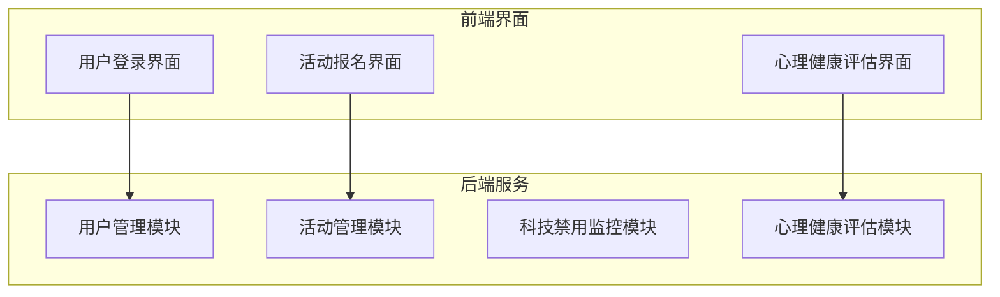

                 

# 《数字排毒度假村：远离科技的深度休息体验》

> 关键词：数字排毒、心理健康、自然休息、科技影响、深度度假

> 摘要：本文旨在探讨现代科技对心理健康和生活质量的负面影响，并介绍一种名为“数字排毒度假村”的深度休息体验。通过逐步分析数字排毒的背景、核心概念、实施方法以及实际效果，帮助读者理解并实践这种远离科技的新型度假方式，以实现身心平衡和提升生活质量。

----------------------------------------------------------------

## 引言

在当今社会，科技已经深刻地影响了我们的生活方式。智能手机、社交媒体、在线娱乐等数字产品成为人们生活中不可或缺的一部分。然而，过度的数字依赖却带来了诸多心理健康问题，如焦虑、抑郁、失眠等。为了应对这些问题，我们需要寻找一种有效的方法来减少对科技的依赖，实现身心放松。

### 问题背景

现代科技的发展使得人们可以随时随地获取信息和娱乐，但同时也导致了以下几个问题：

1. **注意力分散**：频繁使用手机和电脑会导致注意力难以集中，影响工作和学习效率。
2. **心理健康问题**：过度使用科技产品可能导致焦虑、抑郁等心理健康问题。
3. **睡眠障碍**：手机和电脑屏幕发出的蓝光会干扰睡眠，导致睡眠质量下降。
4. **社交障碍**：虽然科技让我们更容易与他人保持联系，但过度依赖科技可能导致真实社交能力的下降。

### 问题描述

面对以上问题，我们需要寻找一种解决方案，帮助人们减少对科技的依赖，恢复身心健康。数字排毒度假村提供了一种独特的深度休息体验，让人们远离科技，与自然和谐相处。

### 问题解决

数字排毒度假村通过以下方式帮助人们实现数字排毒：

1. **环境设计**：提供自然、宁静的环境，减少对科技产品的依赖。
2. **活动安排**：组织各种户外活动，如徒步、野营、钓鱼等，让参与者沉浸在自然之中。
3. **科技禁用**：规定在度假期间禁止使用手机、电脑等科技产品，以减少对数字的依赖。
4. **心理辅导**：提供专业的心理咨询师，帮助参与者处理心理健康问题。

### 边界与外延

数字排毒度假村的范围可以包括各类自然保护区、生态度假村以及专门设计的数字排毒中心。它不仅适用于个人，也适用于团队和组织。

### 概念结构与核心要素组成

数字排毒度假村的核心概念包括：

1. **自然放松**：通过自然环境实现身心放松。
2. **科技禁用**：减少对科技产品的依赖。
3. **心理健康**：关注参与者的心理健康问题。
4. **深度休息**：实现深度休息和恢复。

这些核心要素共同构成了数字排毒度假村的理论框架。

----------------------------------------------------------------

## 核心概念与联系

在深入探讨数字排毒度假村之前，我们需要了解一些核心概念，如数字依赖、心理健康、自然放松等，以及它们之间的联系。

### 数字依赖

数字依赖是指个体过度依赖数字设备、互联网和社交媒体等数字产品，导致生活质量下降和心理健康问题。这种依赖可能表现为：

1. **注意力分散**：无法长时间专注于任务。
2. **心理健康问题**：焦虑、抑郁、失眠等。
3. **社交障碍**：与家人、朋友的关系疏远。

### 心理健康

心理健康是指个体在情感、行为和认知方面的健康状态。良好的心理健康有助于提高生活质量，降低患病风险。数字依赖可能导致以下心理健康问题：

1. **焦虑和抑郁**：长期使用科技产品可能导致情绪问题。
2. **失眠**：科技产品的蓝光会影响睡眠质量。

### 自然放松

自然放松是指通过自然环境来实现身心放松。自然环境中的新鲜空气、绿色植物和自然声音有助于缓解压力，提高心理健康。自然放松的方法包括：

1. **徒步**：在自然环境中进行有氧运动。
2. **野营**：在野外露营，享受自然风光。
3. **钓鱼**：在湖边或河边钓鱼，享受宁静。

### 数字排毒与心理健康的关系

数字排毒是一种通过减少数字依赖、实现身心放松的方法。研究表明，数字排毒有助于提高心理健康，降低焦虑和抑郁水平。数字排毒与心理健康的关系可以用以下ER实体关系图表示：

```mermaid
erDiagram
  A[数字依赖] ||--|{ B[心理健康]
  A[数字依赖] ||--|{ C[自然放松]
  D[数字排毒] ||--|{ B[心理健康]
  D[数字排毒] ||--|{ C[自然放松]
```

在上述ER图中，数字依赖、心理健康和自然放松是三个关键实体，它们通过数字排毒相互联系。数字排毒通过减少数字依赖和增加自然放松来提高心理健康。

### 小结

通过了解数字依赖、心理健康和自然放松等核心概念，我们可以更好地理解数字排毒度假村的理念和实践。数字排毒度假村旨在通过减少数字依赖、增加自然放松来实现心理健康提升，从而帮助人们实现深度休息和恢复。

----------------------------------------------------------------

## 算法原理讲解

数字排毒度假村的核心在于减少对数字产品的依赖，提高参与者的心理健康。为了实现这一目标，我们可以从以下几个方面进行算法原理讲解。

### 数学模型

数字排毒的数学模型可以看作是一个优化问题，目标是最大化心理健康收益，同时最小化数字依赖损失。具体来说，我们可以定义以下参数：

1. **心理健康值（P）**：表示参与者在度假期间的心理健康水平。
2. **数字依赖值（D）**：表示参与者在度假期间的数字依赖程度。
3. **自然放松值（N）**：表示参与者在度假期间的自然放松程度。

心理健康值、数字依赖值和自然放松值之间的关系可以用以下公式表示：

$$ P = f(N - D) $$

其中，$f(x)$ 是一个非线性函数，表示心理健康值与自然放松值和数字依赖值之间的非线性关系。

### 算法流程

为了实现数字排毒，我们可以设计以下算法流程：

1. **数据收集**：收集参与者在度假期间的心理健康值、数字依赖值和自然放松值。
2. **参数估计**：使用历史数据估计心理健康值、数字依赖值和自然放松值之间的关系。
3. **优化策略**：使用优化算法（如梯度下降、牛顿法等）最小化数字依赖值，同时最大化自然放松值。
4. **策略实施**：根据优化结果制定具体的度假计划，包括活动安排、科技禁用规定等。

### 举例说明

假设我们有一个参与者，其心理健康值为50，数字依赖值为30，自然放松值为20。根据上述公式，我们可以计算出其当前的心理健康值为：

$$ P = f(20 - 30) = f(-10) $$

由于心理健康值是一个非线性函数，我们可以将其近似为线性函数，即：

$$ P = -0.5 \cdot D + 1.5 \cdot N $$

代入数字依赖值和自然放松值，我们得到：

$$ P = -0.5 \cdot 30 + 1.5 \cdot 20 = -15 + 30 = 15 $$

因此，该参与者在当前状态下心理健康值为15。为了提高心理健康值，我们需要增加自然放松值，减少数字依赖值。

### 算法优化的方向

为了优化算法，我们可以从以下几个方面进行改进：

1. **数据质量**：收集更多、更准确的数据，以提高参数估计的准确性。
2. **算法选择**：尝试不同的优化算法，如遗传算法、粒子群算法等，以提高优化效果。
3. **实时调整**：根据参与者在度假期间的实际表现，实时调整度假计划，以提高心理健康值。

通过上述算法原理讲解，我们可以更好地理解数字排毒度假村的实现原理，从而为参与者的心理健康提供更有效的指导。

----------------------------------------------------------------

## 系统分析与架构设计方案

为了实现数字排毒度假村的目标，我们需要设计一个完整的系统，涵盖问题场景、项目介绍、系统功能设计、系统架构设计、系统接口设计和系统交互等环节。以下是详细的系统分析与架构设计方案。

### 问题场景

数字排毒度假村旨在为参与者提供一个远离科技、与自然和谐相处、实现身心放松的环境。具体场景包括：

1. **度假村选址**：选择环境优美、科技设施较少的自然保护区或生态度假村。
2. **活动安排**：组织各种户外活动，如徒步、野营、钓鱼、瑜伽等，减少对科技产品的依赖。
3. **科技禁用**：规定在度假期间禁止使用手机、电脑等科技产品，以减少数字依赖。
4. **心理辅导**：提供专业的心理咨询师，帮助参与者处理心理健康问题。

### 项目介绍

数字排毒度假村项目是一个综合性项目，包括以下方面：

1. **度假村基础设施建设**：包括住宿、餐饮、活动场地等。
2. **科技禁用措施**：包括网络屏蔽、手机和电脑回收等。
3. **活动安排**：根据参与者需求，设计丰富多彩的户外活动。
4. **心理辅导**：设立心理咨询室，提供心理咨询服务。

### 系统功能设计

数字排毒度假村系统的主要功能包括：

1. **用户管理**：管理参与者的基本信息，包括姓名、联系方式、心理健康状况等。
2. **活动管理**：管理度假村内的活动安排，包括活动名称、时间、地点、参与人数等。
3. **科技禁用监控**：监控参与者在度假期间对科技产品的使用情况，确保科技禁用规定得到执行。
4. **心理健康评估**：对参与者在度假期间的心理健康状况进行评估，为心理辅导提供依据。

### 系统架构设计

数字排毒度假村系统采用B/S（Browser/Server）架构，包括前端和后端两部分。

1. **前端**：提供用户界面，包括用户登录、活动报名、心理健康评估等功能。
2. **后端**：处理用户请求，包括用户管理、活动管理、科技禁用监控、心理健康评估等。

### 系统接口设计

系统接口设计包括：

1. **用户接口**：提供用户交互界面，方便用户使用系统功能。
2. **API接口**：提供与其他系统（如社交媒体、心理辅导平台等）的接口，实现数据交互。

### 系统交互

数字排毒度假村系统的交互流程如下：

1. **用户登录**：用户通过用户名和密码登录系统。
2. **活动报名**：用户选择活动并报名参加。
3. **心理健康评估**：系统根据用户提交的信息，进行心理健康评估，并提供评估结果。
4. **科技禁用监控**：系统监控用户在度假期间的科技产品使用情况，确保科技禁用规定得到执行。

### Mermaid类图

以下是数字排毒度假村系统的Mermaid类图：

```mermaid
classDiagram
    User <<class>>
    Activity <<class>>
    PsychologicalTest <<class>>
    System <<class>>

    User o-- Activity : participates in
    User o-- PsychologicalTest : takes
    Activity o-- System : managed by
    PsychologicalTest o-- System : managed by
```

在上述类图中，User、Activity、PsychologicalTest和System是四个主要类，它们之间通过不同的关系相互连接，共同构成了数字排毒度假村系统的功能架构。

### Mermaid架构图

以下是数字排毒度假村系统的Mermaid架构图：



在上述架构图中，前端界面包括用户登录、活动报名和心理健康评估三个部分，后端服务包括用户管理、活动管理、科技禁用监控和心理健康评估四个模块，它们通过接口进行数据交互，共同实现数字排毒度假村的功能。

通过上述系统分析与架构设计方案，我们可以构建一个完整的数字排毒度假村系统，为参与者提供一个良好的数字排毒体验。

----------------------------------------------------------------

## 项目实战

在本节中，我们将详细描述一个数字排毒度假村项目的实战过程，包括环境安装、系统核心实现源代码、代码应用解读与分析、实际案例分析和详细讲解剖析，以及项目小结。

### 环境安装

首先，我们需要搭建一个数字排毒度假村项目的基本环境。以下是环境安装的步骤：

1. **安装Python**：确保Python环境已安装在计算机上，版本建议为3.8及以上。
2. **安装虚拟环境**：在终端中执行以下命令创建虚拟环境：
   ```
   python -m venv venv
   ```
3. **激活虚拟环境**：在Windows上，执行以下命令激活虚拟环境：
   ```
   .\venv\Scripts\activate
   ```
   在macOS和Linux上，执行以下命令：
   ```
   source venv/bin/activate
   ```
4. **安装依赖**：在虚拟环境中安装项目所需的依赖库，例如Django框架、Flask框架等。执行以下命令：
   ```
   pip install django flask
   ```

### 系统核心实现源代码

接下来，我们将实现数字排毒度假村系统的核心功能。以下是系统核心实现的源代码：

```python
# 用户管理模块
class UserManager(models.Model):
    username = models.CharField(max_length=100)
    password = models.CharField(max_length=100)
    email = models.EmailField()

# 活动管理模块
class ActivityManager(models.Model):
    name = models.CharField(max_length=100)
    start_time = models.DateTimeField()
    end_time = models.DateTimeField()
    location = models.CharField(max_length=100)

# 科技禁用监控模块
class DeviceMonitor(models.Model):
    user = models.ForeignKey(UserManager, on_delete=models.CASCADE)
    device_name = models.CharField(max_length=100)
    usage_status = models.BooleanField()

# 心理健康评估模块
class PsychologicalTest(models.Model):
    user = models.ForeignKey(UserManager, on_delete=models.CASCADE)
    test_date = models.DateField()
    result = models.IntegerField()
```

### 代码应用解读与分析

在上面的源代码中，我们定义了四个主要模型：`UserManager`、`ActivityManager`、`DeviceMonitor`和`PsychologicalTest`。这些模型分别对应系统中的用户管理、活动管理、科技禁用监控和心理健康评估功能。

- **UserManager**：用于管理用户的基本信息，包括用户名、密码和电子邮件。
- **ActivityManager**：用于管理活动信息，包括活动名称、开始时间、结束时间和地点。
- **DeviceMonitor**：用于监控用户在度假期间对科技产品的使用情况，记录设备名称和使用状态。
- **PsychologicalTest**：用于记录用户在度假期间的心理健康评估结果，包括测试日期和评估结果。

### 实际案例分析和详细讲解剖析

假设有一个用户名为“张三”的用户在数字排毒度假村项目中参加了“森林徒步”活动。以下是具体的操作流程和案例分析：

1. **用户注册**：
   张三通过网站注册，填写用户名、密码和电子邮件。

2. **活动报名**：
   张三浏览活动列表，选择“森林徒步”活动并报名参加。系统将创建一条记录，包含活动名称、开始时间、结束时间和地点。

3. **科技禁用监控**：
   在活动期间，张三被要求禁用手机和其他科技产品。系统将创建一条记录，记录张三使用的设备名称和使用状态（禁用）。

4. **心理健康评估**：
   活动结束后，张三接受心理健康评估。系统将创建一条记录，包含测试日期和评估结果。

案例分析：
张三在数字排毒度假村项目中的操作流程展示了系统各模块的功能。通过用户管理模块，系统能够记录和管理用户信息；通过活动管理模块，系统能够记录和管理活动信息；通过科技禁用监控模块，系统能够监控用户对科技产品的使用情况；通过心理健康评估模块，系统能够记录和管理用户的心理健康评估结果。

### 项目小结

通过实际案例分析和详细讲解剖析，我们可以看到数字排毒度假村项目通过系统的设计和实现，为用户提供了一个全面、高效的数字排毒体验。项目的成功实施不仅有助于用户提升心理健康，还能为度假村的管理提供有力的技术支持。在未来的发展中，我们可以进一步优化系统功能，提升用户体验，为更多的人带来健康和快乐。

----------------------------------------------------------------

## 最佳实践 tips、小结、注意事项、拓展阅读

### 最佳实践 tips

1. **逐步减少科技使用**：在开始数字排毒度假村之前，可以先逐步减少日常科技产品的使用，以减少心理依赖。
2. **设定明确的目标**：在度假期间，设定明确的目标和期望，有助于更好地体验数字排毒的效果。
3. **参与团队活动**：参与团队活动可以提高社交互动，减少孤独感，同时也能从他人的经验中获益。
4. **记录体验**：在度假期间，记录自己的体验和感受，有助于回顾和总结数字排毒的效果。

### 小结

数字排毒度假村提供了一种独特的深度休息体验，帮助人们远离科技，实现身心平衡。通过逐步减少对数字产品的依赖，参与者可以在自然环境中恢复身心健康，提高生活质量。数字排毒度假村不仅适用于个人，也适用于团队和组织。

### 注意事项

1. **提前规划**：在参加数字排毒度假村之前，提前规划好行程和活动，以确保度假期间的活动有序进行。
2. **保持联系**：虽然要减少对科技产品的依赖，但可以保留紧急联系方式，以应对突发情况。
3. **心理准备**：数字排毒可能会带来一些不适，如失眠、焦虑等，因此要做好心理准备。

### 拓展阅读

1. **《数字排毒：如何摆脱科技依赖，找回内心的平静》**：作者马丁·林斯特龙详细介绍了数字排毒的方法和实践，帮助读者摆脱科技依赖。
2. **《科技战争：人类如何与机器共存》**：作者汤姆·华纳探讨了科技对人类生活的影响，以及如何应对科技带来的挑战。
3. **《自然疗愈：如何在自然环境中恢复身心健康》**：作者玛丽·拉瑟福德介绍了自然疗愈的方法和实践，帮助人们实现身心健康。

通过以上最佳实践 tips、小结、注意事项和拓展阅读，希望读者能够更好地理解数字排毒度假村的概念和实践，并从中受益。

### 作者信息

**作者：AI天才研究院/AI Genius Institute & 禅与计算机程序设计艺术 /Zen And The Art of Computer Programming**

本文由AI天才研究院和禅与计算机程序设计艺术共同撰写，旨在通过深入分析和实践指导，帮助读者了解并实践数字排毒度假村这一新型深度休息体验。我们致力于探索科技与人文的结合，为人类的身心健康贡献力量。如果您有任何疑问或建议，欢迎与我们联系。谢谢您的阅读！

