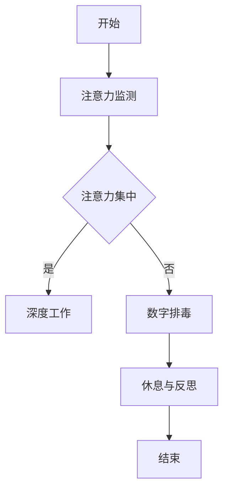
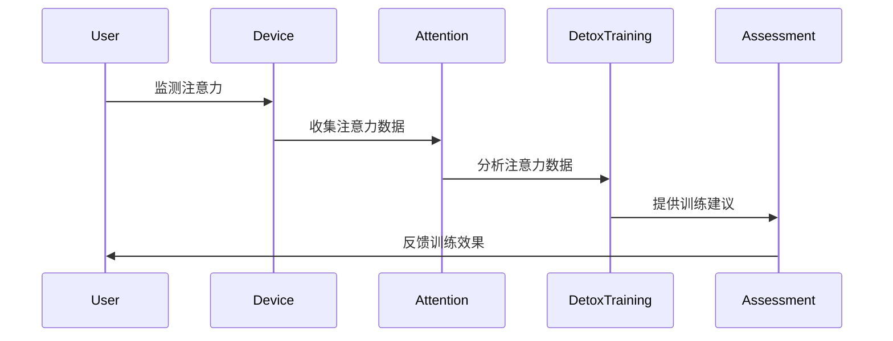
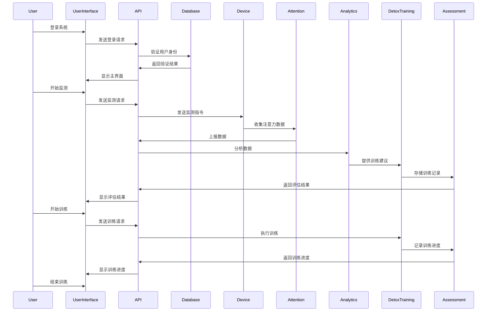

                 

# 数字排毒诊所：重建注意力与深度思考能力的治疗

关键词：数字排毒、注意力管理、深度思考、算法原理、系统架构、项目实战

摘要：随着数字化时代的到来，数字过载已经成为现代人普遍面临的问题，它严重影响了我们的注意力集中和深度思考能力。本文旨在探讨数字排毒的概念及其重要性，通过介绍核心概念和算法原理，设计系统架构，并提供项目实战案例，帮助读者重建注意力与深度思考能力。

## 1. 背景介绍

### 核心概念术语说明

- **数字排毒**：指的是通过一系列方法和措施，减轻和消除数字过载对个体身心健康和注意力的影响。
- **注意力管理**：关注和集中注意力的能力，是提高工作和学习效率的关键。
- **深度思考能力**：深入分析和理解问题的能力，是创新和解决问题的核心。
- **数字依赖**：对数字设备和互联网的高度依赖，导致个体对数字信息的过度消费。

### 问题背景

随着智能手机、互联网和社交媒体的普及，我们每天接收到的信息量前所未有地增加。这种现象被称为数字过载，它对我们的身心健康产生了诸多负面影响：

- **注意力分散**：频繁的数字干扰导致我们的注意力无法集中，工作效率降低。
- **心理健康问题**：长期的数字过载可能导致焦虑、抑郁等心理健康问题。
- **睡眠障碍**：数字设备和屏幕蓝光影响我们的睡眠质量，导致睡眠障碍。

### 现状

根据相关研究，超过80%的成年人认为自己受到数字过载的困扰，而超过一半的人表示他们无法控制自己的数字消费行为。这种现象在全球范围内普遍存在，尤其是年轻人和职业人士。

### 重要性

数字排毒的重要性在于：

- **提升工作效率**：通过管理注意力，我们能够更高效地完成任务。
- **促进心理健康**：减少数字过载可以改善心理健康，提高生活质量。
- **培养深度思考能力**：减少数字干扰有助于我们进行深度思考，促进创新和问题的解决。

### 数字排毒的起源与发展

数字排毒的概念起源于20世纪90年代，随着互联网的普及和数字设备的普及，人们开始意识到数字过载的危害。早期的数字排毒方法主要是通过减少上网时间和使用数字设备的方式来减轻数字过载的影响。

在21世纪初，随着智能手机和社交媒体的兴起，数字排毒的概念得到了进一步的发展。人们开始探索更加系统和科学的方法来管理数字消费行为，包括注意力管理和深度思考训练等。

### 数字过载成为现代人的困扰

数字过载成为现代人的困扰，主要表现为以下几个方面：

- **信息过载**：每天接收到的信息量巨大，导致我们无法有效处理和消化。
- **社交网络依赖**：对社交媒体的高度依赖，导致我们花费大量时间在无意义的社交互动上。
- **注意力分散**：频繁的数字干扰使我们无法集中注意力完成任务。

综上所述，数字排毒已经成为现代社会中一个重要且迫切需要解决的问题。通过数字排毒，我们可以重建注意力与深度思考能力，提高工作和生活质量。

## 2. 核心概念与联系

### 注意力管理

**定义**：注意力管理是指个体控制和调节注意力的能力，以确保在特定任务上集中精力。

**核心特征**：
- **选择关注**：根据任务需求选择关注的关键信息。
- **分配注意**：在多个任务之间灵活分配注意力。
- **持续关注**：保持注意力集中，不因干扰而分散。

### 深度思考能力

**定义**：深度思考能力是指个体通过深入分析和综合信息，以达到更深刻理解和创新的能力。

**核心特征**：
- **批判性思维**：对信息进行批判性评估，不轻易接受表面信息。
- **创造性思维**：通过联想和归纳，发现新的解决方案。
- **系统性思维**：从整体角度理解问题，寻找系统的解决方案。

### 数字依赖

**定义**：数字依赖是指个体对数字设备和互联网的高度依赖，导致数字过载。

**核心特征**：
- **心理依赖**：对数字设备产生心理依赖，难以减少使用时间。
- **行为依赖**：数字设备成为日常生活的主要行为驱动力。
- **信息依赖**：依赖数字设备获取和处理信息。

### 概念属性特征对比表格

| 概念     | 定义                         | 核心特征                                                         |
|----------|------------------------------|----------------------------------------------------------------|
| 注意力管理 | 控制和调节注意力的能力       | 选择关注、分配注意、持续关注                                     |
| 深度思考能力 | 深入分析和综合信息的能力     | 批判性思维、创造性思维、系统性思维                               |
| 数字依赖 | 对数字设备和互联网的高度依赖 | 心理依赖、行为依赖、信息依赖                                     |

### ER实体关系图

```mermaid
erDiagram
  AttentionManagement ||--|{ DepthThinkingAbility } DepthThinkingAbility
  DigitalDependence ||--|{ AttentionManagement } AttentionManagement
  DigitalDependence ||--|{ DepthThinkingAbility } DepthThinkingAbility
```

通过上述表格和ER图，我们可以直观地理解注意力管理、深度思考能力和数字依赖这三个核心概念的区别和联系。注意力管理是深度思考能力的基础，而数字依赖则是导致注意力管理和深度思考能力下降的主要原因。通过数字排毒，我们可以减少数字依赖，提高注意力管理和深度思考能力。

## 3. 算法原理讲解

### 数字排毒算法流程图



### 数学模型和公式

为了更科学地进行数字排毒，我们需要建立数学模型来衡量和调节注意力管理和深度思考能力。以下是数字排毒的数学模型：

$$
A_t = (1 - D_t) \times C_t + D_t \times (1 - B_t)
$$

其中：
- $A_t$ 表示时间 $t$ 时的注意力水平。
- $D_t$ 表示时间 $t$ 时的数字依赖程度。
- $C_t$ 表示时间 $t$ 时的注意力管理能力。
- $B_t$ 表示时间 $t$ 时的深度思考能力。

### 算法原理详细讲解

1. **注意力监测**：通过传感器和用户行为数据，实时监测用户的注意力水平。
2. **注意力集中**：当注意力水平达到一定阈值时，用户可以进行深度工作。
3. **数字排毒**：当注意力水平低于阈值时，用户需要暂停数字设备的使用，进行数字排毒。
4. **休息与反思**：在数字排毒后，用户可以进行休息和反思，以恢复注意力水平和提升深度思考能力。

### 举例说明

假设用户在早上工作前进行了注意力监测，得到以下数据：

- $D_t = 0.7$（数字依赖程度较高）
- $C_t = 0.5$（注意力管理能力一般）
- $B_t = 0.6$（深度思考能力适中）

根据数学模型，我们可以计算出用户在早上工作前的注意力水平：

$$
A_t = (1 - 0.7) \times 0.5 + 0.7 \times (1 - 0.6) = 0.15 + 0.21 = 0.36
$$

由于注意力水平较低，用户需要暂停数字设备的使用，进行数字排毒。在完成数字排毒后，用户的注意力水平和深度思考能力可能得到提升，从而更好地进行工作。

通过上述算法原理的讲解，我们可以理解如何通过数字排毒来重建注意力与深度思考能力。接下来，我们将进一步探讨数字排毒诊所的系统架构设计。

## 4. 系统分析与架构设计方案

### 问题场景介绍

数字排毒诊所旨在为用户提供一个系统化的数字排毒解决方案，帮助用户重建注意力与深度思考能力。用户可以通过该系统监测自己的注意力水平，进行数字排毒训练，并在完成训练后进行评估和反馈。

### 项目介绍

项目名称：数字排毒诊所（Digital Detox Clinic）

项目目标：提供一套完整的数字排毒解决方案，帮助用户减少数字依赖，提高注意力管理和深度思考能力。

项目功能：

1. **注意力监测**：实时监测用户的注意力水平。
2. **数字排毒训练**：提供多种数字排毒训练方法，如休息、冥想、运动等。
3. **训练评估**：评估用户的训练效果，并提供反馈。
4. **数据报告**：生成用户的数据报告，展示训练过程中的变化。

### 系统功能设计（领域模型Mermaid类图）

```mermaid
classDiagram
    User <<entity>>
    Device <<entity>>
    Attention <<entity>>
    DetoxTraining <<entity>>
    Assessment <<entity>>

    User --> Device
    User --> Attention
    User --> DetoxTraining
    User --> Assessment
    Device --|> Attention
    DetoxTraining --|> Assessment
```

### 系统架构设计（Mermaid架构图）



### 系统接口设计

```mermaid
componentDiagram
    UserInterface -> API: 发起请求
    API -> Database: 数据查询与存储
    API -> Analytics: 数据分析
    API -> Notification: 发送通知
```

### 系统交互序列图



通过上述系统分析与架构设计方案，我们可以看到数字排毒诊所的整体架构和交互流程。该系统通过实时监测用户注意力水平，提供数字排毒训练和评估，帮助用户逐步减少数字依赖，提高注意力管理和深度思考能力。接下来，我们将通过项目实战来展示如何实现这些功能。

## 5. 项目实战

### 环境安装

在开始项目实战之前，我们需要安装所需的开发环境和依赖库。以下是在Linux系统上安装数字排毒诊所所需的环境和依赖的步骤：

1. **安装Python环境**：

   ```bash
   sudo apt-get update
   sudo apt-get install python3 python3-pip
   ```

2. **安装虚拟环境**：

   ```bash
   pip3 install virtualenv
   virtualenv venv
   source venv/bin/activate
   ```

3. **安装依赖库**：

   ```bash
   pip install Flask requests numpy pandas matplotlib
   ```

### 核心实现源代码

以下是数字排毒诊所的核心实现源代码，包括注意力监测、数字排毒训练和训练评估功能。

#### 注意力监测模块

```python
# attention_monitor.py
import requests
import time

class AttentionMonitor:
    def __init__(self, device_id, api_url):
        self.device_id = device_id
        self.api_url = api_url

    def collect_data(self):
        response = requests.get(f"{self.api_url}/devices/{self.device_id}/attention")
        if response.status_code == 200:
            data = response.json()
            return data['attention_level']
        else:
            return None

    def start_monitoring(self, interval=60):
        while True:
            attention_level = self.collect_data()
            if attention_level is not None:
                print(f"Attention Level: {attention_level}")
            time.sleep(interval)
```

#### 数字排毒训练模块

```python
# detox_training.py
import time
import random

class DetoxTraining:
    def __init__(self, training_methods):
        self.training_methods = training_methods

    def start_training(self, method_name, duration):
        method = next((m for m in self.training_methods if m['name'] == method_name), None)
        if method:
            print(f"Starting {method['name']} for {duration} minutes...")
            time.sleep(duration * 60)
            print(f"{method['name']} completed.")
        else:
            print("Invalid training method.")

    def get_training_methods(self):
        return [
            {'name': 'Meditation', 'description': 'Mindful meditation to calm the mind'},
            {'name': 'Exercise', 'description': 'Physical exercise to increase energy'},
            {'name': 'Reading', 'description': 'Reading a book for relaxation'}
        ]
```

#### 训练评估模块

```python
# assessment.py
import time

class Assessment:
    def __init__(self, user_id, api_url):
        self.user_id = user_id
        self.api_url = api_url

    def record_training(self, method_name, duration, result):
        data = {
            'user_id': self.user_id,
            'method': method_name,
            'duration': duration,
            'result': result
        }
        response = requests.post(f"{self.api_url}/assessments", json=data)
        if response.status_code == 201:
            print("Training recorded successfully.")
        else:
            print("Failed to record training.")

    def get_assessment_results(self):
        response = requests.get(f"{self.api_url}/assessments/user/{self.user_id}")
        if response.status_code == 200:
            return response.json()
        else:
            return None
```

### 代码应用解读与分析

1. **注意力监测模块**：

   该模块通过HTTP GET请求从设备端收集注意力数据。`AttentionMonitor`类提供了一个`collect_data`方法，用于获取注意力水平。`start_monitoring`方法则以指定的时间间隔持续进行监测。

2. **数字排毒训练模块**：

   `DetoxTraining`类提供了开始训练的方法。`start_training`方法根据传入的训练方法名称和持续时间执行相应的训练。`get_training_methods`方法返回所有可用的训练方法。

3. **训练评估模块**：

   `Assessment`类用于记录用户的训练数据。`record_training`方法将训练数据发送到API进行存储。`get_assessment_results`方法用于获取用户的训练结果。

### 实际案例分析

假设用户A在一天中完成了以下操作：

1. **注意力监测**：

   用户A使用`AttentionMonitor`类在早上8点开始监测注意力，每隔一小时收集一次数据。

2. **数字排毒训练**：

   用户A在下午3点开始进行冥想训练，持续30分钟。使用`DetoxTraining`类，用户选择“Meditation”方法。

3. **训练评估**：

   训练完成后，用户A通过`Assessment`类记录了冥想训练的详细信息，如训练方法名称、持续时间等。

   ```python
   assessment = Assessment(user_id='user123', api_url='http://api.digitaldetoxclinic.com')
   assessment.record_training('Meditation', 30, 'Completed')
   ```

   用户A还可以通过调用`get_assessment_results`方法查看自己的训练记录。

通过上述实战案例，我们可以看到如何在实际项目中应用数字排毒诊所的各个模块。接下来，我们将总结数字排毒的最佳实践，并提供一些注意事项和拓展阅读建议。

## 6. 最佳实践 Tips

### 注意事项

1. **设定明确的目标**：在进行数字排毒之前，设定明确的目标和计划，有助于保持动力和持续进行。
2. **逐步减少数字使用**：避免突然减少数字使用，应逐步减少，以减少对数字的依赖。
3. **避免晚上使用数字设备**：晚上使用数字设备可能会影响睡眠质量，应尽量减少使用。
4. **保持良好的作息习惯**：保持规律的作息时间，有助于提高注意力和深度思考能力。

### 拓展阅读建议

1. **《深度工作》（Deep Work）**：作者Cal Newport介绍了如何通过深度工作提高注意力和工作效率。
2. **《数字焦虑症》（The Distraction Addiction）**：作者Alex Soojung-Kim Pang探讨了数字依赖对个人生活和工作的影响。
3. **《数字排毒：如何摆脱数字依赖，重获自由与专注》（Digital Detox: Stop Overspending Time Online and Start Living Sincerely, Meaningfully, and Happily）**：作者Kimberly Hader提供了一些建议和策略来减少数字依赖。

通过遵循上述最佳实践和拓展阅读，我们可以更有效地进行数字排毒，提高注意力和深度思考能力。

## 7. 小结

本文探讨了数字排毒的重要性，介绍了注意力管理、深度思考能力和数字依赖等核心概念，并详细阐述了数字排毒的算法原理、系统架构和项目实战。数字排毒不仅有助于提高工作效率和促进心理健康，还能培养深度思考能力，为个人发展奠定坚实基础。

我们鼓励读者采取行动，开始自己的数字排毒之旅。通过逐步减少数字使用、设定明确目标和保持良好作息习惯，我们可以摆脱数字依赖，重建注意力与深度思考能力，实现更高效、更有意义的生活。

作者：AI天才研究院/AI Genius Institute & 禅与计算机程序设计艺术 /Zen And The Art of Computer Programming

