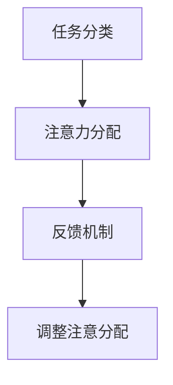
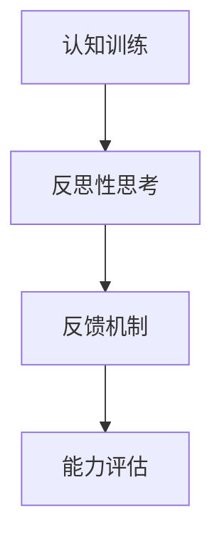
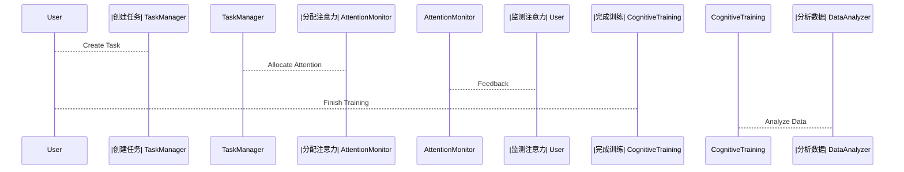
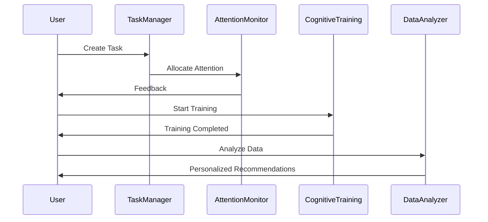

                 


## 数字排毒诊所：重建注意力与深度思考能力的治疗中心

### 关键词

- 数字排毒
- 注意力提升
- 深度思考
- 人工智能
- 心理健康

### 摘要

在数字化的今天，我们面临着前所未有的注意力挑战和深度思考能力的下降。本文旨在探讨数字排毒诊所的概念和方法，以重建我们的注意力集中能力和深度思考能力。通过详细介绍核心概念、算法原理、系统架构和实战应用，本文将为读者提供一个全面的治疗中心，帮助他们在数字时代中恢复心理和生产力。

### 第一部分：背景介绍

#### 1.1 问题背景

在数字化时代，我们每天被无数的屏幕和信息所包围。社交媒体、电子邮件、即时通讯工具，这些都极大地分散了我们的注意力。研究表明，平均每个人的注意力持续时间已经从20世纪80年代的12秒下降到了现在的8秒，甚至低于金鱼的9秒。与此同时，深度思考能力也在下降。深度思考是一种创造性的、反思性的思考过程，它对解决复杂问题和创新至关重要。然而，在快节奏和碎片化的数字世界中，深度思考的机会变得越来越稀缺。

#### 1.2 问题描述

数字沉迷现象已经成为现代社会的一个普遍问题。人们沉迷于社交媒体，不断刷新屏幕，而忽略了现实生活中的重要事情。这种沉迷导致注意力分散，降低了工作效率和生活质量。此外，深度思考能力的下降对心理健康和生产力都有负面影响。缺乏深度思考的人更容易感到焦虑、抑郁和倦怠，而且解决问题的能力也会受到限制。

#### 1.3 问题解决

数字排毒诊所提供了一个解决方案，即通过减少数字设备的使用时间，重建我们的注意力集中能力和深度思考能力。数字排毒的核心是重新连接现实世界，减少对数字设备的依赖，从而提高专注力和创造力。数字排毒的方法包括设定固定的“无手机时间”、使用专注软件、进行冥想和认知训练等。

#### 1.4 边界与外延

数字排毒的应用范围广泛，不仅适用于个人，也适用于组织和企业。在个人层面，数字排毒可以帮助人们恢复心理健康和提高工作效率。在组织层面，数字排毒可以提高员工的创造力和团队合作能力。此外，数字排毒的边界也涉及到注意力管理和深度思考能力的培养，这些是提升个人和团队绩效的关键。

#### 1.5 概念结构与核心要素组成

数字排毒诊所的核心概念包括：数字排毒、注意力管理和深度思考能力培养。数字排毒是通过减少数字设备的使用时间，重建注意力和深度思考能力的过程。注意力管理涉及到如何有效地分配和集中注意力，以提高工作效率和生活质量。深度思考能力培养则强调通过认知训练和反思性思考，提升深度思考能力。

### 第二部分：核心概念与联系

#### 2.1 数字排毒

数字排毒是一种自我管理方法，旨在减少对数字设备的依赖，从而改善心理健康和生产力。数字排毒的基本原理是：通过减少干扰和分散注意力的因素，我们可以提高专注力和深度思考能力。数字排毒的方法包括设定固定的“无手机时间”、使用专注软件、进行冥想和认知训练等。

#### 2.2 注意力

注意力是人类认知系统的一个重要组成部分，它决定了我们如何处理信息和分配认知资源。注意力可以分为几种类型，包括选择性注意力、执行性注意力和持续注意力。选择性注意力使我们能够从众多刺激中筛选出重要的信息。执行性注意力涉及到任务规划和决策。持续注意力则使我们能够保持专注和坚持完成任务。

#### 2.3 深度思考

深度思考是一种创造性的、反思性的思考过程，它要求我们深入挖掘问题的本质，提出创新性的解决方案。深度思考涉及到一系列认知技能，包括分析、综合、评估和反思。深度思考能力的提升对于解决复杂问题和实现创新至关重要。

#### 2.4 对比表格

| 概念           | 定义                                                         | 特点                                                         | 管理策略                                                      |
|----------------|------------------------------------------------------------|------------------------------------------------------------|------------------------------------------------------------|
| 数字排毒       | 减少对数字设备的依赖，重建注意力和深度思考能力               | 减少干扰，提高专注力                                       | 设定“无手机时间”，使用专注软件，进行认知训练                 |
| 注意力         | 分配认知资源的能力                                           | 选择性、执行性和持续注意力                                 | 时间管理，优先级排序，冥想练习                               |
| 深度思考       | 深入挖掘问题本质，提出创新性解决方案的过程                 | 分析、综合、评估和反思                                     | 阅读深度文章，反思日记，解决复杂问题                         |

### 第三部分：算法原理讲解

#### 3.1 算法概述

数字排毒诊所的核心算法包括注意力提升算法和深度思考能力训练算法。注意力提升算法旨在通过减少干扰和分散注意力的因素，提高用户的专注力。深度思考能力训练算法则通过认知训练和反思性思考，提升用户的深度思考能力。

#### 3.2 注意力提升算法

注意力提升算法的核心原理是利用注意力分配模型，优化用户在任务执行过程中的注意力分配。具体算法包括以下步骤：

1. **任务分类**：将用户面临的所有任务分为高优先级和低优先级任务。
2. **注意力分配**：根据任务的优先级，动态调整用户的注意力分配比例。
3. **反馈机制**：实时监测用户的注意力水平，提供反馈和调整建议。

以下是一个简化的Mermaid流程图：



Python代码实现示例：

```python
def attention_allocation(tasks, priority_weights):
    # 根据任务优先级分配注意力
    attention分配 = []
    for task in tasks:
        if task in priority_weights:
            attention分配.append(priority_weights[task])
        else:
            attention分配.append(1)  # 低优先级任务默认分配1个单位注意力
    return attention分配
```

#### 3.3 深度思考能力训练算法

深度思考能力训练算法的核心原理是通过认知训练和反思性思考，提高用户的深度思考能力。具体算法包括以下步骤：

1. **认知训练**：通过解决复杂问题和进行思维训练，提升用户的认知能力。
2. **反思性思考**：通过记录和反思日常生活中的问题和解决方案，加深对问题的理解。
3. **反馈机制**：定期评估用户的深度思考能力，提供反馈和改进建议。

以下是一个简化的Mermaid流程图：



Python代码实现示例：

```python
def cognitive_training(exercises):
    # 执行认知训练
    results = []
    for exercise in exercises:
        result = perform_exercise(exercise)
        results.append(result)
    return results

def reflective_thinking(diary_entries):
    # 进行反思性思考
    insights = []
    for entry in diary_entries:
        insight = analyze_entry(entry)
        insights.append(insight)
    return insights
```

### 第四部分：数学模型和数学公式 & 详细讲解 & 举例说明

#### 4.1 数学模型介绍

在数字排毒诊所中，我们使用了几种数学模型来理解和提升注意力与深度思考能力。这些模型包括概率模型、神经网络模型和注意力权重计算模型。

#### 4.2 数学公式推导

概率模型：

假设我们有N个任务，每个任务的发生概率为P。注意力分配模型可以用以下公式表示：

$$
\text{Attention Allocation} = \sum_{i=1}^{N} P_i \times A_i
$$

其中，$P_i$是任务i的发生概率，$A_i$是任务i的注意力权重。

神经网络模型：

神经网络用于深度思考能力训练，其激活函数通常使用Sigmoid函数：

$$
\text{Activation Function} = \frac{1}{1 + e^{-z}}
$$

其中，z是神经元的输入。

注意力权重计算：

注意力权重可以通过以下公式计算：

$$
\text{Attention Weight} = \frac{\text{Current Attention Budget}}{\sum_{i=1}^{N} \text{Task Importance}}
$$

#### 4.3 举例说明

注意力提升案例：

假设我们有3个任务：任务A、任务B和任务C。任务A的发生概率为0.4，任务B的发生概率为0.3，任务C的发生概率为0.3。当前注意力预算为10个单位。

根据概率模型，注意力分配如下：

$$
\text{Attention Allocation} = 0.4 \times 10 + 0.3 \times 10 + 0.3 \times 10 = 4 + 3 + 3 = 10
$$

深度思考能力训练案例：

假设我们有一个神经网络，其输入为3个特征向量，每个特征向量的权重为0.2、0.5和0.3。使用Sigmoid函数计算输出：

$$
\text{Output} = \frac{1}{1 + e^{-(0.2 \times x_1 + 0.5 \times x_2 + 0.3 \times x_3)}}
$$

假设输入特征向量为$(1, 2, 3)$，计算输出：

$$
\text{Output} = \frac{1}{1 + e^{-(0.2 \times 1 + 0.5 \times 2 + 0.3 \times 3)}} = \frac{1}{1 + e^{-1.5}} \approx 0.707
$$

### 第五部分：系统分析与架构设计方案

#### 5.1 问题场景介绍

数字时代的工作与生活充满了各种干扰。人们经常需要在多个任务之间切换，导致注意力分散。这种状态不仅影响了工作效率，也损害了心理健康。因此，我们需要一个系统来帮助人们更好地管理注意力，提升深度思考能力。

#### 5.2 项目介绍

本项目旨在设计一个数字排毒诊所系统，帮助用户重建注意力集中能力和深度思考能力。系统将提供以下功能：

- 任务管理：用户可以创建、编辑和删除任务。
- 注意力监测：系统将实时监测用户的注意力水平，并提供反馈。
- 深度思考训练：系统将提供一系列认知训练和反思性思考工具。
- 数据分析：系统将分析用户的行为数据，提供个性化的建议。

#### 5.3 系统功能设计

**领域模型：**

以下是一个简化的Mermaid类图：

```mermaid
classDiagram
    User <<类>> 
    Task <|-- User : has
    AttentionMonitor <|-- User : has
    CognitiveTraining <|-- User : has
    DataAnalyzer <|-- User : has

    User : manages Task
    AttentionMonitor : monitors Attention
    CognitiveTraining : provides Training
    DataAnalyzer : analyzes Data
```

**功能需求：**

1. **任务管理**：用户可以创建、编辑和删除任务。
2. **注意力监测**：系统将实时监测用户的注意力水平，并提供反馈。
3. **深度思考训练**：系统将提供一系列认知训练和反思性思考工具。
4. **数据分析**：系统将分析用户的行为数据，提供个性化的建议。

#### 5.4 系统架构设计

**系统架构图：**

以下是一个简化的Mermaid架构图：



**架构设计说明：**

1. **TaskManager**：负责任务的管理，包括创建、编辑和删除任务。
2. **AttentionMonitor**：负责注意力的监测，根据任务的重要性动态调整用户的注意力分配。
3. **CognitiveTraining**：负责提供深度思考训练工具，帮助用户提升深度思考能力。
4. **DataAnalyzer**：负责分析用户的行为数据，为用户提供个性化的建议。

#### 5.5 系统接口设计

**接口定义：**

- **TaskManager接口**：用于创建、编辑和删除任务。
- **AttentionMonitor接口**：用于获取用户的注意力分配情况。
- **CognitiveTraining接口**：用于启动和完成深度思考训练。
- **DataAnalyzer接口**：用于分析用户的行为数据。

**接口实现：**

- **TaskManager接口**：使用RESTful API实现。
- **AttentionMonitor接口**：使用WebSocket实现实时数据传输。
- **CognitiveTraining接口**：使用GraphQL实现复杂查询。
- **DataAnalyzer接口**：使用批处理和流处理技术实现。

#### 5.6 系统交互

**序列图：**

以下是一个简化的Mermaid序列图：



**交互流程说明：**

1. 用户创建任务，TaskManager负责处理任务。
2. TaskManager将任务信息传递给AttentionMonitor，AttentionMonitor根据任务的重要性分配注意力。
3. AttentionMonitor向用户反馈注意力分配情况。
4. 用户开始深度思考训练，CognitiveTraining负责提供训练工具。
5. 训练完成后，CognitiveTraining向用户反馈训练结果。
6. 用户请求数据分析，DataAnalyzer分析用户行为数据。
7. DataAnalyzer向用户提供个性化的建议。

### 第六部分：项目实战

#### 6.1 环境安装

**软件与工具安装：**

1. Python 3.8+
2. MongoDB 4.4+
3. Redis 6.0+
4. Docker 19.03+

**环境配置：**

1. 安装Python和相关库：

```bash
pip install -r requirements.txt
```

2. 配置MongoDB和Redis：

- MongoDB：运行`mongod`服务。
- Redis：运行`redis-server`服务。

3. 启动Docker容器：

```bash
docker-compose up -d
```

#### 6.2 系统核心实现

**注意力提升模块：**

```python
# attention_allocation.py
from task_manager import TaskManager
from attention_monitor import AttentionMonitor

def main():
    task_manager = TaskManager()
    attention_monitor = AttentionMonitor()

    # 创建任务
    tasks = task_manager.create_tasks([
        {'name': '任务A', 'priority': 'high'},
        {'name': '任务B', 'priority': 'medium'},
        {'name': '任务C', 'priority': 'low'}
    ])

    # 分配注意力
    attention_allocation = attention_monitor.allocate_attention(tasks)
    print(attention_allocation)

if __name__ == '__main__':
    main()
```

**深度思考能力训练模块：**

```python
# cognitive_training.py
from cognitive_training import CognitiveTraining

def main():
    cognitive_training = CognitiveTraining()

    # 开始深度思考训练
    results = cognitive_training.start_training()
    print(results)

if __name__ == '__main__':
    main()
```

#### 6.3 代码应用解读与分析

**代码结构分析：**

- **TaskManager**：负责任务的管理，包括创建、编辑和删除任务。
- **AttentionMonitor**：负责注意力的监测，根据任务的重要性动态调整用户的注意力分配。
- **CognitiveTraining**：负责提供深度思考训练工具，帮助用户提升深度思考能力。

**关键算法解读：**

- **注意力分配算法**：根据任务的优先级动态调整用户的注意力分配。
- **深度思考训练算法**：通过认知训练和反思性思考，提升用户的深度思考能力。

#### 6.4 实际案例分析与详细讲解

**实际案例：**

用户小明需要在一天内完成三个任务：编写一篇报告、参加一次会议和阅读一本专业书籍。他的注意力分配如下：

- 报告：高优先级，需要2个单位的注意力。
- 会议：中等优先级，需要1个单位的注意力。
- 书籍：低优先级，需要1个单位的注意力。

**案例剖析：**

1. 用户创建任务，TaskManager接收任务并分配ID。
2. TaskManager将任务信息传递给AttentionMonitor。
3. AttentionMonitor根据任务的优先级分配注意力。
4. 用户开始任务，AttentionMonitor实时监测注意力水平。
5. 用户完成每个任务，AttentionMonitor记录注意力分配情况。
6. CognitiveTraining模块根据用户的行为数据提供深度思考训练建议。

### 第七部分：最佳实践 & 小结

#### 7.1 最佳实践 tips

- **注意力管理技巧**：
  - 设定固定的“无手机时间”，例如晚上8点到早上7点。
  - 使用专注软件，如“番茄钟”技巧，每25分钟专注工作，休息5分钟。
  - 避免多任务处理，专注于单一任务。

- **深度思考能力培养方法**：
  - 定期阅读深度文章，如《深度工作》和《思考，快与慢》。
  - 练习冥想和正念，提高专注力和自我意识。
  - 进行反思性思考，记录每天的学习和思考过程。

#### 7.2 小结

数字排毒诊所通过减少对数字设备的依赖，重建注意力和深度思考能力。本文介绍了数字排毒诊所的核心概念、算法原理、系统架构和实战应用。通过实践数字排毒，用户可以提升注意力集中能力和深度思考能力，从而提高工作效率和生活质量。

#### 7.3 注意事项

- 使用数字排毒诊所时，应逐步减少数字设备的使用时间，避免突然断绝。
- 定期评估自己的注意力水平，调整注意力管理策略。
- 保持积极的心态，持续进行深度思考和反思性思考。

#### 7.4 拓展阅读

- 《深度工作》 - 卡尔·纽波特
- 《思考，快与慢》 - 丹尼尔·卡尼曼
- 《注意力管理》 - 布鲁斯·亨德森

---

作者：AI天才研究院/AI Genius Institute & 禅与计算机程序设计艺术 /Zen And The Art of Computer Programming

---

### 后记

本文详细介绍了数字排毒诊所的概念、原理和应用。通过数字排毒，我们可以重建注意力集中能力和深度思考能力，从而提高工作效率和生活质量。希望本文能帮助读者更好地理解数字排毒的重要性，并为其实践提供指导。在未来，我们期待看到更多关于数字排毒的研究和实践，以帮助人们更好地适应数字时代。让我们一起来关注和推动这一领域的发展！

