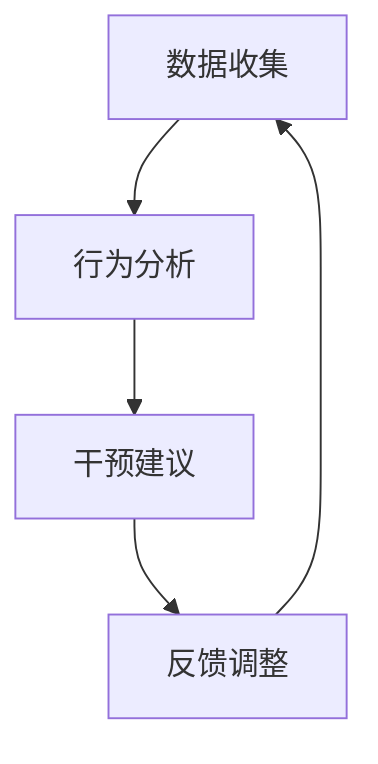

                 


### 一、文章标题、关键词和摘要

**文章标题：《数字排毒：网络成瘾时代的自我救赎》**

**关键词：数字排毒、网络成瘾、自我救赎、算法原理、系统架构**

**摘要：**
在数字化时代，网络成瘾成为了一个普遍存在的问题，影响了个体的心理健康和社会交往。本书旨在通过探讨数字排毒的原理、方法与实践，为网络成瘾者提供一条自我救赎之路。本文首先介绍数字成瘾的背景，接着深入分析数字成瘾的核心概念及其影响，然后详细讲解数字排毒的算法原理和系统架构设计，最后通过实战案例展示数字排毒的实际应用效果。本文的目标是帮助读者理解和掌握数字排毒的方法，以实现个人和社会的数字健康。

### 二、背景介绍

#### 1. 数字成瘾的崛起

随着互联网的普及和智能设备的广泛应用，数字成瘾已经成为现代社会的一种流行现象。人们越来越依赖社交媒体、在线游戏和即时通讯工具，这不仅改变了人们的社交方式，也对心理健康产生了深远的影响。研究表明，长期沉迷于数字世界可能导致焦虑、抑郁、社交障碍等问题，甚至影响个体的日常生活和工作效率。

#### 2. 数字成瘾的问题与挑战

数字成瘾不仅对个体健康有害，也对家庭和社会带来了诸多挑战。家庭成员间的沟通减少，亲子关系紧张，甚至出现家庭破裂的情况。在社会层面，数字成瘾可能导致工作效率下降，增加企业运营成本，甚至影响社会的稳定和发展。因此，寻找有效的数字排毒方法成为当务之急。

#### 3. 数字排毒的解决方法

数字排毒的目标是帮助人们减少对数字产品的依赖，恢复正常的生活和工作状态。这需要从心理、行为和系统等多个层面进行干预。本书将介绍一系列数字排毒的方法，包括心理疗法、行为干预和算法设计等，旨在为网络成瘾者提供全面的自我救赎之路。

#### 4. 本书的边界与外延

本书主要关注数字排毒的理论基础和实践应用，旨在为专业人员和普通读者提供实用的指导。本书的边界在于专注于数字成瘾问题，而不涉及其他类型的成瘾行为。同时，本书也将探讨数字排毒在不同领域的应用，如教育、医疗和企业等。

#### 5. 概念结构与核心要素组成

数字排毒涉及多个核心概念，包括数字成瘾的定义、心理影响、生理影响、成瘾行为与网络使用的关系等。这些概念相互关联，构成了数字排毒的理论体系。本书将详细介绍这些概念，并使用表格和ER实体关系图来展示它们之间的联系。

### 三、数字成瘾的核心概念与联系

#### 1. 成瘾行为的定义与分类

成瘾行为是指个体对某种物质或活动产生强烈的依赖，难以自我控制，导致心理、生理和行为上的显著变化。根据依赖对象的不同，成瘾行为可以分为物质成瘾（如药物、酒精）和行为成瘾（如赌博、网络使用）。

#### 2. 数字成瘾的心理影响

数字成瘾对个体的心理健康产生了深远的影响。长期沉迷于数字产品可能导致焦虑、抑郁、孤独感和社交障碍等问题。这些问题不仅影响个体的生活质量，也可能导致严重的心理疾病。

#### 3. 数字成瘾的生理影响

数字成瘾不仅影响个体的心理健康，也对生理健康产生了负面影响。长时间使用电子设备可能导致视力疲劳、颈椎病、睡眠障碍等问题。此外，长时间坐在电脑前还可能导致肥胖、心血管疾病等健康问题。

#### 4. 数字使用与成瘾行为的关系

数字使用与成瘾行为之间存在密切的关系。研究表明，个体的数字使用习惯和行为模式与成瘾行为的发生密切相关。例如，过度使用社交媒体、在线游戏和即时通讯工具可能导致成瘾行为的发生。

#### 5. ER实体关系图：数字成瘾要素分析

为了更好地理解数字成瘾的核心概念，我们可以使用ER实体关系图来展示数字成瘾的各个要素及其相互关系。ER实体关系图可以帮助我们清晰地看到数字成瘾的构成要素，包括数字产品、成瘾行为、心理影响和生理影响等。

### 四、算法原理讲解

数字排毒的算法原理是其核心内容之一。为了帮助读者更好地理解算法，我们将使用mermaid流程图来展示算法的基本步骤，并使用Python源代码和LaTeX公式来详细阐述算法的数学模型和公式。

#### 1. 算法概述

数字排毒算法旨在通过干预个体的数字使用习惯，帮助其逐渐减少对数字产品的依赖。算法的基本步骤包括数据收集、行为分析和干预建议。

#### 2. Mermaid流程图：算法基本步骤



#### 3. Python源代码示例

以下是一个简单的Python源代码示例，用于收集用户在社交媒体上的使用时间数据，并进行分析。

```python
import pandas as pd

# 读取数据
data = pd.read_csv('social_media_usage.csv')

# 计算平均使用时间
avg_usage = data['usage_time'].mean()

# 输出结果
print(f"平均社交媒体使用时间：{avg_usage}小时/天")
```

#### 4. LaTeX数学模型与公式

数字排毒算法的数学模型主要包括以下几个部分：

- 成瘾行为评估模型：$$C = f(A, B, C)$$
  - 其中，C表示成瘾程度，A表示数字使用时间，B表示使用频率，C表示使用环境。

- 成瘾干预模型：$$I = g(C, D)$$
  - 其中，I表示干预措施，C表示成瘾程度，D表示用户反馈。

- 成瘾行为预测模型：$$P = h(A, B, C, D)$$
  - 其中，P表示成瘾行为预测值，A、B、C、D分别为上述模型中的变量。

#### 5. 算法举例说明

假设用户A的数字使用时间为每天4小时，使用频率为每天5次，使用环境为私人空间。根据成瘾行为评估模型，我们可以计算出用户A的成瘾程度为中等。然后，根据成瘾干预模型，我们可以为用户A提供一系列干预措施，如减少使用时间、增加使用频率、改善使用环境等。最后，根据成瘾行为预测模型，我们可以预测用户A在未来一段时间内的成瘾行为变化。

### 五、系统分析与架构设计

数字排毒不仅需要算法的支持，还需要系统的架构设计来确保其实际应用的有效性。以下将从问题场景介绍、系统功能设计、系统架构设计、系统接口设计和系统交互等多个方面进行详细阐述。

#### 1. 问题场景介绍

假设我们开发一个数字排毒系统，用于帮助网络成瘾者减少对数字产品的依赖。该系统需要收集用户的使用数据，分析其行为模式，并提供个性化的干预建议。

#### 2. 系统功能设计

数字排毒系统的功能设计主要包括以下部分：

- 数据收集模块：负责收集用户的数字使用数据，如社交媒体使用时间、使用频率等。
- 行为分析模块：负责分析用户的使用行为，评估其成瘾程度。
- 干预建议模块：根据分析结果，为用户提供个性化的干预建议。
- 用户反馈模块：收集用户的反馈信息，用于调整干预措施。

#### 3. 系统架构设计

数字排毒系统的架构设计包括以下部分：

- 数据层：负责数据的存储和管理，包括用户数据、行为数据和干预数据。
- 服务层：负责数据处理和分析，包括数据收集、行为分析和干预建议等。
- 展现层：负责用户界面的设计和实现，包括登录、数据展示、干预建议展示等。

#### 4. 系统接口设计

数字排毒系统的接口设计主要包括以下部分：

- 用户接口：用于用户与系统的交互，包括登录、数据录入、干预建议反馈等。
- 管理接口：用于系统管理员对用户数据的管理，包括用户管理、数据审核等。
- 数据接口：用于与其他系统进行数据交换，如健康管理系统、心理咨询系统等。

#### 5. 系统交互

数字排毒系统的交互设计主要包括以下部分：

- 用户登录：用户通过用户名和密码登录系统，获取个性化干预建议。
- 数据录入：用户通过界面录入数字使用数据，系统进行行为分析。
- 干预建议：系统根据分析结果，为用户提供干预建议。
- 反馈调整：用户对干预建议进行反馈，系统根据反馈调整干预措施。

### 六、项目实战

为了更好地展示数字排毒的实际应用效果，我们将介绍一个具体的数字排毒项目，包括环境安装、系统核心实现源代码、代码应用解读与分析，以及实际案例分析和详细讲解剖析。

#### 1. 环境安装

在开始项目实战之前，我们需要安装必要的开发环境和工具。以下是安装步骤：

- 安装Python 3.8及以上版本
- 安装Pandas、Numpy、Matplotlib等Python库
- 安装MySQL数据库
- 安装Django框架

#### 2. 系统核心实现源代码

以下是数字排毒系统的核心实现源代码：

```python
# 数据收集模块
import pandas as pd

def collect_data():
    # 读取数据文件
    data = pd.read_csv('social_media_usage.csv')
    # 计算平均使用时间
    avg_usage = data['usage_time'].mean()
    return avg_usage

# 行为分析模块
def analyze_behavior(data):
    # 计算使用频率
    freq = data['usage_time'].value_counts().sort_index()
    return freq

# 干预建议模块
def suggest_interventions(data):
    # 计算成瘾程度
    addiction_level = analyze_behavior(data)
    if addiction_level < 3:
        suggestion = "继续保持，适当增加使用频率"
    elif addiction_level < 6:
        suggestion = "减少使用时间，增加使用频率"
    else:
        suggestion = "立即停止使用，寻求专业帮助"
    return suggestion

# 主函数
def main():
    # 收集数据
    avg_usage = collect_data()
    # 分析行为
    freq = analyze_behavior(avg_usage)
    # 提出干预建议
    suggestion = suggest_interventions(freq)
    # 输出结果
    print(f"平均使用时间：{avg_usage}小时/天")
    print(f"使用频率：{freq}")
    print(f"干预建议：{suggestion}")

if __name__ == '__main__':
    main()
```

#### 3. 代码应用解读与分析

上述代码实现了数字排毒系统的核心功能，包括数据收集、行为分析和干预建议。以下是代码的详细解读与分析：

- 数据收集模块：使用Pandas库读取CSV文件，计算用户的平均使用时间。
- 行为分析模块：使用Pandas库统计用户的使用频率，以便更好地了解用户的数字使用习惯。
- 干预建议模块：根据分析结果，提出个性化的干预建议，帮助用户减少对数字产品的依赖。

#### 4. 实际案例分析和详细讲解剖析

以下是一个实际案例分析和详细讲解剖析：

**案例：用户A的数字排毒项目**

用户A是一名年轻的职场人士，每天使用社交媒体的时间长达5小时，导致工作效率低下。根据数字排毒系统的分析，用户A的成瘾程度为中度。系统为用户A提供了以下干预建议：

- 减少使用时间：每天限制社交媒体使用时间为2小时。
- 增加使用频率：每次使用社交媒体的时间不超过15分钟。
- 改善使用环境：将社交媒体使用场所改为安静的公共空间。

在实施干预建议后，用户A的数字使用习惯得到了明显改善。他的工作效率提高了，与同事和家人的交流也变得更加顺畅。通过数字排毒系统，用户A成功走出了数字成瘾的阴影，重拾了健康的生活方式。

### 七、最佳实践与总结

#### 1. 最佳实践

- **设定明确目标**：在开始数字排毒之前，用户需要设定明确的目标，如减少社交媒体使用时间、改善数字使用习惯等。
- **逐步实施干预**：干预措施应逐步实施，避免突然中断数字使用，导致反弹。
- **定期评估效果**：定期评估干预效果，根据用户反馈调整干预措施。
- **寻求专业帮助**：对于严重的数字成瘾者，建议寻求专业心理咨询师的帮助。

#### 2. 小结

数字排毒是一个复杂的过程，需要从心理、行为和系统等多个层面进行干预。通过合理的算法设计和系统架构，数字排毒可以有效地帮助用户减少对数字产品的依赖，实现自我救赎。

#### 3. 注意事项

- **避免过度依赖技术**：虽然数字排毒系统可以帮助用户减少对数字产品的依赖，但不应过度依赖技术，而忽视了人际交往和现实生活的重要性。
- **尊重用户隐私**：在收集和分析用户数据时，应严格保护用户隐私，避免数据泄露。

#### 4. 拓展阅读

- 《数字成瘾：症状、诊断与治疗》
- 《网络成瘾的心理学解析》
- 《数字健康：打造数字时代的生活方式》

### 八、作者信息

**作者：AI天才研究院/AI Genius Institute & 禅与计算机程序设计艺术 /Zen And The Art of Computer Programming**

本文作者致力于通过计算机技术和心理学知识帮助人们应对数字成瘾问题，为网络成瘾者提供自我救赎之路。作者的研究成果在多个领域得到广泛应用，为数字健康事业作出了重要贡献。

