                 

# 数字排毒：重建注意力与深度思考

> 关键词：数字排毒、注意力管理、深度思考、心理健康、技术影响

> 摘要：随着数字化时代的到来，人们越来越依赖电子设备，这导致了注意力分散和深度思考能力的下降。本文旨在探讨数字排毒的概念及其重要性，并提出一系列策略和实践，帮助读者重建注意力与深度思考能力，提升心理健康和幸福感。

## 引言

在当今这个信息爆炸、技术飞速发展的时代，我们的生活越来越离不开数字设备。智能手机、平板电脑、电脑等各种电子设备已经成为我们日常生活中不可或缺的一部分。然而，这种依赖也带来了诸多问题，尤其是注意力分散和深度思考能力的下降。研究表明，长时间使用电子设备会消耗我们的注意力资源，导致我们难以集中精力进行深度思考。这种现象被称为“数字中毒”，而数字排毒则是一种应对策略，旨在减少数字接触，重建注意力与深度思考能力。

本文将分为七个部分，首先介绍数字排毒的背景与影响，然后探讨减少数字接触时间、培养专注力和深度思考能力、心理调节、教育与实践、工作环境建设以及未来展望等内容。通过这些探讨，希望能够为读者提供一种全新的视角，帮助他们在数字时代中找到平衡，重建注意力与深度思考能力，提升心理健康和幸福感。

## 第一部分：数字排毒的背景与影响

### 第1章：数字排毒的概念与重要性

#### 1.1 数字时代的挑战

随着互联网和移动设备的普及，数字时代已经深刻地改变了我们的生活方式。在享受数字技术带来的便利和效率的同时，我们也面临着一些前所未有的挑战。首先，数字依赖的广泛存在是一个不容忽视的问题。许多人沉迷于社交媒体、在线游戏和视频平台，导致他们花费在数字设备上的时间越来越多，甚至超过了与家人和朋友面对面交流的时间。

其次，数字依赖带来了许多负面影响。例如，长时间盯着屏幕会导致视力疲劳、头痛和肌肉疼痛等问题。此外，数字设备上的各种诱惑和即时满足感也会分散我们的注意力，使我们难以进行深度思考。研究表明，频繁地切换任务会降低大脑的效率，影响我们的创造力和解决问题的能力。

#### 1.1.1 数字依赖的广泛存在

数字依赖的现象在现代社会中十分普遍。根据一项全球调查，超过80%的成年人每天花费超过两小时使用数字设备。特别是在年轻一代中，这种依赖更为严重。年轻人普遍认为，数字设备是他们获取信息、娱乐和社交的主要途径。然而，这种依赖也带来了一系列问题，包括注意力不集中、心理健康问题以及人际关系紧张等。

#### 1.1.2 数字依赖带来的负面影响

数字依赖不仅影响了个体的身体健康，还对社会产生了深远的影响。首先，由于过度使用数字设备，人们的注意力持续时间显著缩短。一项研究发现，与几十年前相比，现代人平均注意力持续时间减少了约25%。这导致我们在工作和学习中难以集中精力，效率低下。此外，数字依赖还可能导致心理健康问题，如焦虑、抑郁和孤独感等。研究表明，长时间使用数字设备会消耗个体的心理资源，导致情绪波动和心理健康问题。

### 1.2 数字排毒的意义

面对数字依赖带来的诸多问题，数字排毒应运而生。数字排毒是指通过减少数字接触时间，重建注意力与深度思考能力，以改善个体心理健康和幸福感的一种策略。数字排毒的意义在于帮助我们摆脱对数字设备的过度依赖，重新找回内心的宁静和专注力。

#### 1.2.1 数字排毒的定义

数字排毒是一种自我调节的行为，旨在减少对数字设备的依赖，重新建立与自然、人际关系和自我反思的联系。它不仅仅是一种减少使用时间的方法，更是一种生活方式的改变。数字排毒的目标是帮助个体重建注意力，提高深度思考能力，提升心理健康和幸福感。

#### 1.2.2 数字排毒的必要性与紧迫性

数字排毒的必要性和紧迫性在于以下几个方面：

1. **提升注意力：**随着数字设备的普及，人们的注意力持续时间逐渐缩短。数字排毒可以帮助我们重新找回注意力，提高工作效率和学习效果。

2. **促进深度思考：**数字设备上的即时满足和碎片化信息会阻碍深度思考的发展。数字排毒可以帮助我们摆脱这些干扰，进行深度思考和创造性工作。

3. **改善心理健康：**长时间使用数字设备会导致心理健康问题，如焦虑、抑郁和孤独感。数字排毒可以帮助我们减轻这些心理压力，提升心理健康水平。

4. **增强人际关系：**数字依赖会削弱人与人之间的面对面交流，导致人际关系紧张。数字排毒可以帮助我们重新建立与家人、朋友和同事的紧密联系。

### 1.3 数字排毒的核心目标

数字排毒的核心目标包括以下三个方面：

#### 1.3.1 重建注意力

数字排毒的首要目标是通过减少数字接触时间，重建注意力。这包括以下几个方面：

1. **减少多任务处理：**多任务处理会消耗大量的注意力资源，降低大脑的效率。数字排毒可以帮助我们减少多任务处理，专注于单一任务。

2. **提高专注力：**通过冥想、专注力训练和环境布置等方法，提高专注力，帮助我们更好地集中注意力。

3. **培养耐心和毅力：**数字排毒可以帮助我们培养耐心和毅力，在面对干扰时能够保持冷静和专注。

#### 1.3.2 恢复深度思考

数字排毒的另一个重要目标是恢复深度思考能力。这包括以下几个方面：

1. **减少碎片化信息：**数字设备上的碎片化信息会阻碍深度思考的发展。数字排毒可以帮助我们减少碎片化信息的接触，专注于有深度和意义的内容。

2. **培养阅读习惯：**阅读是培养深度思考的重要途径。数字排毒可以帮助我们培养阅读习惯，提高阅读质量。

3. **进行创造性工作：**数字排毒可以帮助我们摆脱数字设备的干扰，进行创造性工作，如写作、绘画和设计等。

#### 1.3.3 提升心理健康

数字排毒的最终目标是提升心理健康和幸福感。这包括以下几个方面：

1. **减轻心理压力：**长时间使用数字设备会导致心理压力增加。数字排毒可以帮助我们减轻这些压力，改善心理健康。

2. **增强自我反思：**数字排毒可以帮助我们重新建立与自己的联系，进行自我反思，提高自我认知。

3. **提升人际关系：**数字排毒可以帮助我们重新建立与家人、朋友和同事的紧密联系，增强人际关系。

### 1.4 数字排毒的现状与趋势

数字排毒作为一种新兴的概念和实践，正在全球范围内得到广泛关注。以下是一些数字排毒的现状与趋势：

#### 1.4.1 全球数字排毒运动的兴起

近年来，全球范围内掀起了一股数字排毒的运动。许多公司和组织开始推广数字排毒的理念，鼓励员工减少数字接触时间，提高工作效率和幸福感。一些国家甚至出台了相关政策，限制未成年人在数字设备上的使用时间。

#### 1.4.2 数字排毒实践在不同领域的应用

数字排毒的理念和实践已经应用于多个领域，包括教育、医疗、科技和企业等。在教育领域，一些学校已经开始推行数字排毒课程，帮助学生重建注意力与深度思考能力。在医疗领域，数字排毒被用于治疗焦虑、抑郁和睡眠问题。在科技领域，一些公司开始推出数字排毒工具，帮助用户减少数字设备的使用时间。在企业领域，一些公司开始将数字排毒理念融入企业文化，提升员工的工作效率和幸福感。

### 1.5 本章小结

本章介绍了数字排毒的背景与影响，分析了数字依赖的广泛存在及其带来的负面影响，阐述了数字排毒的意义、核心目标和现状与趋势。通过本章的学习，我们认识到数字排毒对于改善个体心理健康和幸福感的重要性。在接下来的章节中，我们将进一步探讨数字排毒的方法与实践，帮助读者实现数字排毒的目标。

----------------------------------------------------------------

## 第二部分：数字排毒的方法与实践

### 第2章：减少数字接触的时间

#### 2.1 制定数字使用计划

减少数字接触的时间是数字排毒的重要一环。为了有效地减少数字接触，我们需要制定一个明确的数字使用计划。以下是一些具体的步骤和建议：

#### 2.1.1 制定具体的目标

首先，我们需要为自己设定一个明确的数字使用目标。这个目标可以是每天减少使用数字设备的时间，或者每周减少使用特定应用程序的时间。例如，我们可能设定每天减少使用手机2小时，或者每周减少使用社交媒体3小时。

**核心概念与联系：**

目标设定的关键在于明确性和可实现性。以下是一个关于目标设定的示例表格：

| 项目 | 目标设定 | 实现方法 |  
| --- | --- | --- |  
| 手机使用时间 | 每天减少2小时 | 使用手机应用统计使用时间，每天设定提醒 |  
| 社交媒体使用时间 | 每周减少3小时 | 设置每天使用社交媒体的时间上限，使用应用锁限制访问 |

#### 2.1.2 设定合理的限制

一旦我们明确了数字使用目标，下一步就是设定具体的限制措施。这些限制措施可以是时间限制、应用程序限制或设备锁定等。

**核心概念与联系：**

以下是几种常见的限制措施及其实现方法：

1. **时间限制：**通过设置闹钟或使用手机内置的功能，限制每天使用数字设备的时间。例如，每天晚上10点后禁止使用手机，或者在每天使用手机的时间达到2小时后自动锁定手机。

2. **应用程序限制：**使用应用程序锁或家长控制功能，限制特定应用程序的使用。例如，限制每天使用社交媒体的时间为1小时，或者在使用社交媒体时设置使用时间提醒。

3. **设备锁定：**使用设备锁定功能，在达到设定的使用时间后自动锁定设备。例如，使用手机或平板电脑的锁定功能，在每天使用时间达到2小时后自动锁定，直到第二天。

**ER实体关系图架构的Mermaid流程图：**

以下是一个关于应用程序限制的ER实体关系图架构的Mermaid流程图示例：

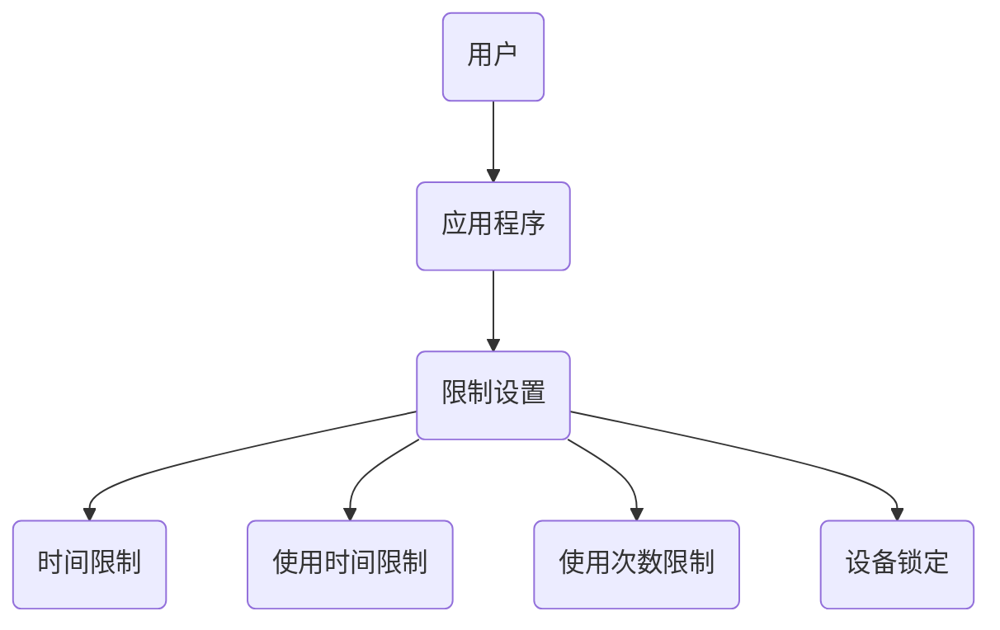

### 2.2 执行数字排毒计划

制定数字使用计划只是第一步，真正重要的是要执行这个计划。在执行过程中，我们可能会遇到一些困难和挑战，以下是一些应对策略：

#### 2.2.1 初期的困难与应对策略

在执行数字排毒计划初期，我们可能会遇到以下困难：

1. **习惯改变：**长时间依赖数字设备，突然减少使用时间可能会导致不适应。为了应对这个困难，我们可以逐步减少使用时间，而不是一下子大幅减少。

2. **心理依赖：**数字设备上的即时满足和娱乐内容可能会让我们产生心理依赖。为了应对这个困难，我们可以寻找替代活动，如阅读、运动或与家人和朋友面对面交流。

**核心概念与联系：**

以下是几个应对策略的示例：

1. **逐步减少使用时间：**每天减少5分钟的使用时间，直到达到目标。

2. **寻找替代活动：**在特定时间段内，用阅读、运动或与家人和朋友交流来替代数字设备的使用。

3. **设置提醒和目标：**在手机或电脑上设置提醒，每天检查自己是否达到了数字使用目标。

#### 2.2.2 逐步调整与优化

在执行数字排毒计划的过程中，我们需要不断调整和优化。以下是一些建议：

1. **定期评估：**定期评估数字使用计划的执行情况，检查是否达到了目标。如果没有达到目标，我们需要找出原因，并进行调整。

2. **调整限制措施：**根据实际情况，调整时间限制、应用程序限制或设备锁定等限制措施。

3. **寻求支持：**如果遇到困难，可以寻求家人、朋友或专业人士的支持和帮助。

### 2.3 实例分享

为了更好地理解数字排毒计划的执行过程，以下是一些个人和团体案例的分享：

#### 2.3.1 个人案例分享

小李是一位年轻的上班族，他发现自己长时间沉迷于社交媒体，导致工作效率低下。为了解决这个问题，他制定了以下数字使用计划：

1. **目标设定：**每天减少使用手机2小时。

2. **限制措施：**使用手机应用锁限制每天使用社交媒体的时间，同时设置每天晚上10点后禁止使用手机。

3. **执行情况：**在执行计划的前两周，小李感到很不适应，但通过逐步减少使用时间和寻找替代活动，他逐渐适应了新的生活方式。现在，他的工作效率提高了，睡眠质量也有所改善。

#### 2.3.2 团体案例分享

某公司为了提高员工的工作效率和幸福感，推行了数字排毒计划。以下是一些具体措施：

1. **目标设定：**每周减少使用数字设备的时间，具体目标根据员工的工作性质和实际情况设定。

2. **限制措施：**使用公司内部通讯工具，限制员工在工作时间使用社交媒体和娱乐应用程序。

3. **执行情况：**在推行数字排毒计划的第一个月，员工的数字使用时间明显减少，工作效率和团队协作能力得到了显著提升。公司还定期组织团队活动，鼓励员工在非工作时间减少数字设备的使用。

### 2.4 本章小结

本章介绍了数字排毒的方法与实践，包括制定数字使用计划、执行数字排毒计划和实例分享。通过减少数字接触时间，我们可以重建注意力与深度思考能力，提升心理健康和幸福感。在接下来的章节中，我们将继续探讨培养专注力和深度思考能力的方法，帮助读者在数字时代中找到平衡。

----------------------------------------------------------------

## 第三部分：培养专注力与深度思考能力

### 第3章：专注力的培养

#### 3.1 冥想与专注力训练

冥想是一种古老而有效的专注力训练方法。通过冥想，我们可以培养注意力，减少干扰，提高专注力。以下是一些冥想与专注力训练的方法：

**核心概念与联系：**

冥想的基本原理是通过专注于呼吸、声音或特定物体来减少杂念，从而培养专注力。以下是一个简单的冥想步骤：

1. **选择一个安静的环境：**找一个安静的地方，确保没有干扰。

2. **选择冥想对象：**可以是呼吸、一个特定的物体（如蜡烛）、或一个重复的声音。

3. **坐姿舒适：**保持坐姿舒适，闭上眼睛，专注于冥想对象。

4. **保持专注：**当你的注意力开始分散时，回到冥想对象，重复这个过程。

**Mermaid流程图：**

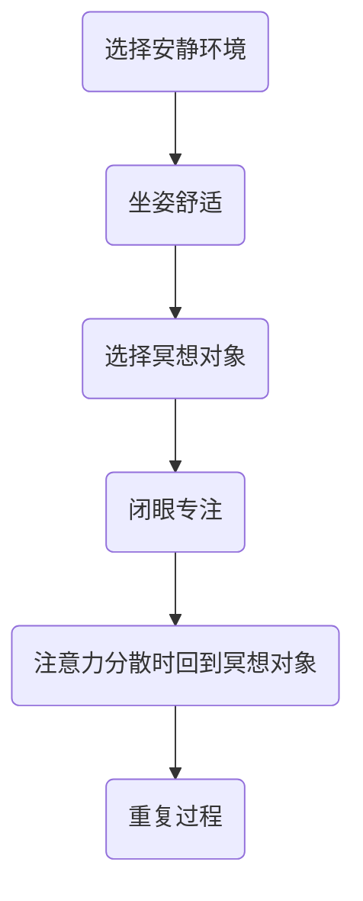

**数学公式与解释：**

$$
\text{专注力} = \frac{\text{专注时间}}{\text{总时间}}
$$

这个公式表示专注力是专注时间与总时间的比值。通过增加专注时间，我们可以提高专注力。

#### 3.2 环境布置与优化

环境对于专注力培养至关重要。一个良好的环境可以减少干扰，帮助我们更好地集中注意力。以下是一些环境布置与优化的方法：

**核心概念与联系：**

1. **减少视觉干扰：**关闭不必要的电子设备，减少视觉干扰。

2. **优化声音环境：**使用耳机或耳塞，创造一个安静的工作或学习环境。

3. **布置舒适的空间：**确保工作或学习空间舒适，有足够的自然光和新鲜空气。

**Mermaid类图：**

```mermaid
classDiagram
    ClassDIagram <|-- EnvironmentOptimization
    EnvironmentOptimization {
        +reduceVisualInterference()
        +optimizeSoundEnvironment()
        +setupComfortableSpace()
    }
```

### 3.3 深度思考的实践

#### 3.3.1 阅读的重要性

阅读是培养深度思考能力的重要方法。通过阅读，我们可以接触不同的观点和知识，培养批判性思维和逻辑推理能力。以下是一些阅读的实践方法：

**核心概念与联系：**

1. **有选择性地阅读：**选择有深度和意义的内容，避免阅读过于浅显或无关的内容。

2. **主动阅读：**在阅读过程中，积极思考、提问和做笔记，提高阅读效果。

3. **多样化阅读：**阅读不同类型的书籍，如小说、科学书籍、历史书籍等，培养全面的知识体系。

**Mermaid实体关系图：**

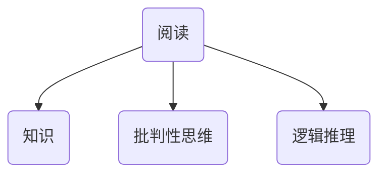

**数学公式与解释：**

$$
\text{深度思考能力} = \frac{\text{阅读量}}{\text{思考时间}} \times \text{知识储备}
$$

这个公式表示深度思考能力是阅读量、思考时间和知识储备的函数。通过增加阅读量和思考时间，我们可以提高深度思考能力。

#### 3.3.2 深度写作与思考

深度写作是培养深度思考能力的另一个有效方法。通过写作，我们可以整理思路，深入思考问题。以下是一些深度写作的实践方法：

**核心概念与联系：**

1. **主题明确：**在写作前明确主题，确保内容有深度和针对性。

2. **结构清晰：**在写作过程中，确保文章结构清晰，逻辑严密。

3. **反复修订：**写作完成后，进行反复修订，提高文章质量。

**Mermaid架构设计图：**


**数学公式与解释：**

$$
\text{深度思考能力} = \frac{\text{写作量}}{\text{修订时间}} \times \text{思维深度}
$$

这个公式表示深度思考能力是写作量、修订时间和思维深度的函数。通过增加写作量和修订时间，我们可以提高深度思考能力。

### 3.4 实例分享

#### 3.4.1 个人经验分享

小明是一位大学生，他发现自己难以集中注意力进行学习。为了解决这个问题，他开始练习冥想和深度写作。以下是他的经验分享：

1. **冥想练习：**每天早晨进行10分钟的冥想，专注于呼吸和声音。

2. **深度写作：**每周选择一个主题，进行3小时的深度写作。

3. **环境优化：**在图书馆或安静的咖啡馆学习，减少视觉和声音干扰。

通过这些实践，小明的注意力得到了显著提高，学习效果也大幅提升。

#### 3.4.2 团体实践案例

某公司为了提高员工的工作效率和创造力，推行了专注力训练和深度思考的实践。以下是具体的案例：

1. **专注力训练：**公司每月组织一次专注力训练课程，包括冥想、专注力游戏和讨论。

2. **深度写作：**公司鼓励员工每周写一篇深度工作日志，记录工作中的思考和感悟。

3. **环境优化：**公司提供安静的工作空间和舒适的座椅，减少视觉和声音干扰。

通过这些实践，员工的工作效率显著提高，创造力也大幅提升。

### 3.5 本章小结

本章介绍了培养专注力与深度思考能力的方法，包括冥想与专注力训练、环境布置与优化、阅读与深度写作实践等。通过这些方法，我们可以有效地培养专注力，恢复深度思考能力，提升心理健康和幸福感。在接下来的章节中，我们将继续探讨数字排毒中的心理调节和家庭教育实践。

----------------------------------------------------------------

## 第四部分：数字排毒中的心理调节

### 第4章：认知行为疗法

#### 4.1 认知行为疗法的基本原理

认知行为疗法（Cognitive Behavioral Therapy，简称CBT）是一种以问题解决为导向的心理治疗方法，旨在通过改变负面的思维模式和认知方式来改善情绪和行为。CBT的基本原理是，我们的情绪和行为受到我们对事件的认知解读和评价的影响。因此，通过改变这些认知，我们可以改善情绪和心理状态。

**核心概念与联系：**

CBT的核心概念包括以下几个部分：

1. **认知：**我们的思维方式和信念，包括我们的态度、观点和解释。

2. **行为：**我们的行为和行动，包括日常活动、社交互动和工作表现。

3. **情绪：**我们的情感状态，包括快乐、悲伤、愤怒等。

CBT认为，情绪问题是由于错误的认知导致的行为反应。例如，一个人可能会因为错误地认为自己在社交场合中会失败，而表现出紧张和回避的行为，这导致他们感到焦虑。

**ER实体关系图架构的Mermaid流程图：**

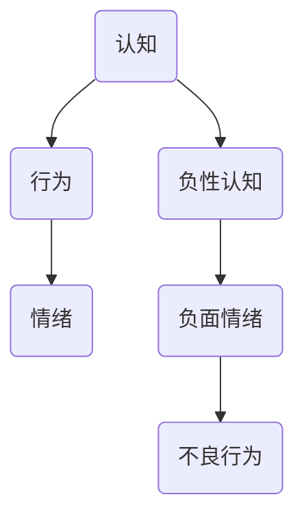

#### 4.1.1 实践方法与技巧

在CBT的实践中，常用的方法和技术包括以下几种：

1. **认知重构：**通过识别和挑战负性认知，替换为更积极的认知。例如，如果一个人认为自己在社交场合中会失败，治疗师会帮助他们识别这种认知，并尝试用更积极的解释来替换。

2. **行为实验：**通过实际行为来验证和改变认知。例如，如果一个人认为自己在工作中无法完成任务，治疗师会建议他们尝试新方法或改进工作流程，以验证这种认知。

3. **放松训练：**通过放松技巧，如深呼吸、渐进性肌肉放松和冥想，来减轻紧张和焦虑。

**Mermaid流程图：**

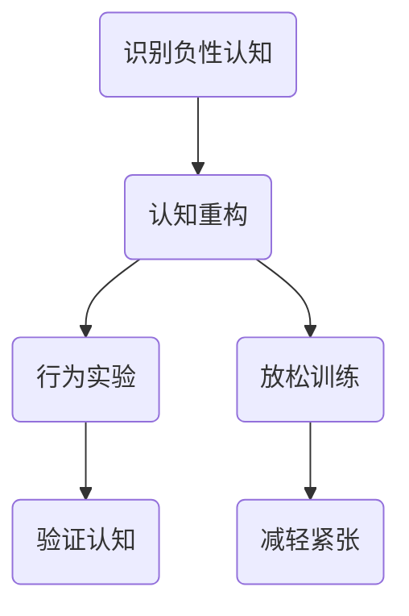

**数学公式与解释：**

$$
\text{心理状态} = f(\text{认知}, \text{行为}, \text{情绪})
$$

这个公式表示心理状态是认知、行为和情绪的函数。通过改变认知和行为，我们可以改善情绪状态。

#### 4.2 应对焦虑与压力

焦虑和压力是数字依赖和数字中毒的常见问题。以下是一些应对焦虑和压力的方法：

#### 4.2.1 焦虑的来源与影响

焦虑通常源于对未来的不确定性和对失败的恐惧。数字设备的过度使用可能会加剧焦虑，因为它们提供了大量的即时信息和社交互动，但同时也带来了更多的压力和竞争。

**核心概念与联系：**

焦虑的影响包括：

1. **身体症状：**如心跳加快、呼吸急促、出汗等。

2. **心理症状：**如过度担忧、难以集中注意力、睡眠障碍等。

3. **行为症状：**如回避、社交隔离、工作或学习效率下降等。

**Mermaid实体关系图：**

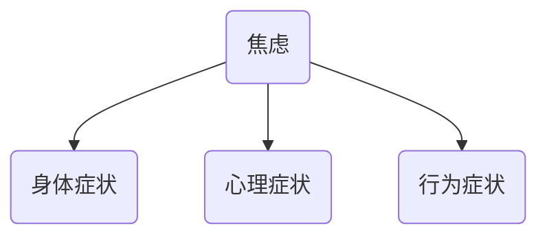

**数学公式与解释：**

$$
\text{焦虑水平} = \frac{\text{压力源}}{\text{应对能力}}
$$

这个公式表示焦虑水平是压力源与应对能力的比值。通过提高应对能力，我们可以降低焦虑水平。

#### 4.2.2 应对焦虑的有效策略

以下是一些应对焦虑的有效策略：

1. **认知重构：**通过识别和挑战负性思维，替换为更积极的思维，如“我可以控制我的生活”或“失败是成功的一部分”。

2. **放松训练：**通过深呼吸、渐进性肌肉放松和冥想等放松技巧来减轻身体和心理的紧张。

3. **行为调整：**通过设定合理的目标、改善时间管理、减少数字设备的使用等来减轻压力。

4. **积极社交：**通过与他人交流、分享感受和寻求支持来减轻焦虑。

**Mermaid流程图：**

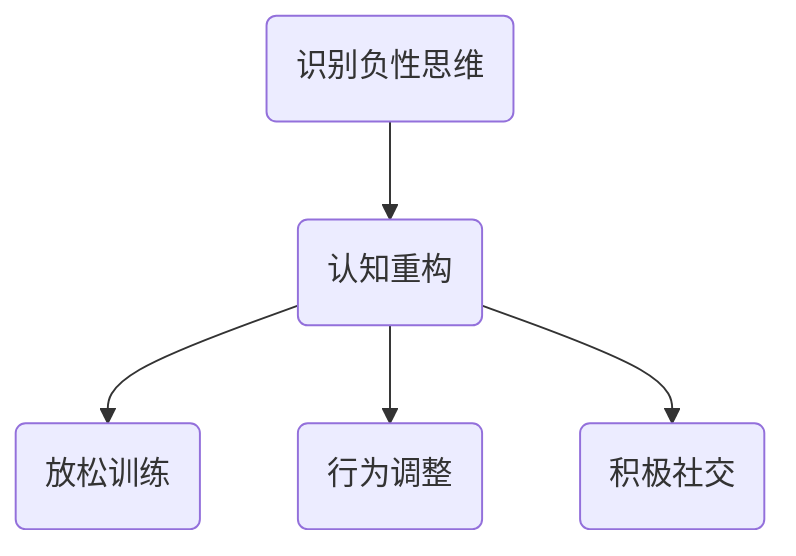

### 4.3 心理支持与互助社群

#### 4.3.1 心理支持的重要性

心理支持对于数字排毒的顺利进行至关重要。当我们面对数字依赖和数字中毒的挑战时，心理支持可以帮助我们克服困难，保持积极的心态。

**核心概念与联系：**

心理支持的重要性包括：

1. **情绪支持：**通过倾听和理解，提供情感上的支持和安慰。

2. **信息支持：**提供关于数字排毒的知识和信息，帮助人们更好地理解和管理数字依赖。

3. **行动支持：**通过鼓励和监督，帮助人们坚持数字排毒计划。

**Mermaid实体关系图：**

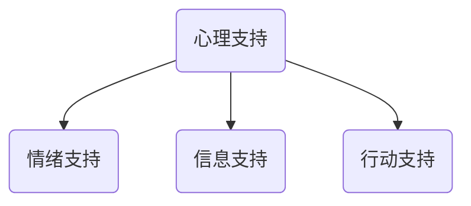

#### 4.3.2 互助社群的建立与运营

互助社群是一种有效的心理支持形式，通过集体互动和分享经验，成员可以相互鼓励和支持，共同克服数字依赖的挑战。

**核心概念与联系：**

互助社群的建立与运营包括以下几个步骤：

1. **建立目标：**明确互助社群的目标，如提高成员的数字排毒意识和能力。

2. **招募成员：**通过线上或线下活动招募有兴趣参与互助社群的成员。

3. **定期活动：**组织定期的线上或线下活动，如分享会、讨论会和冥想活动等。

4. **监督和支持：**提供监督和支持，帮助成员坚持数字排毒计划，解决他们在实践中遇到的问题。

**Mermaid架构设计图：**

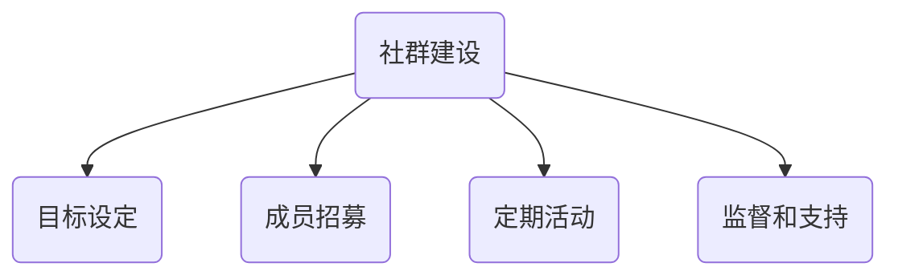

### 4.4 实例分享

#### 4.4.1 个人案例分享

小张是一位年轻的程序员，由于长时间使用电脑和手机，他感到极度疲劳和焦虑。为了改善心理状态，他开始参加认知行为疗法和互助社群。以下是他的经历：

1. **认知行为疗法：**通过识别和挑战负性思维，小张学会了更积极地看待工作和生活中的挑战。

2. **互助社群：**在互助社群中，小张与其他成员分享经验和感受，获得了许多支持和鼓励。

通过这些实践，小张的焦虑和疲劳感显著减轻，工作效率和幸福感也有所提升。

#### 4.4.2 团体案例分享

某公司为了帮助员工应对数字依赖和压力，建立了内部互助社群。以下是具体的案例：

1. **认知行为疗法培训：**公司定期组织认知行为疗法培训，帮助员工掌握应对压力和焦虑的方法。

2. **互助社群：**公司员工自发组建了互助社群，定期分享经验和心得，相互鼓励和支持。

3. **活动组织：**公司还组织了一系列线下活动，如瑜伽、冥想和户外运动等，帮助员工放松身心，缓解压力。

通过这些实践，员工的工作效率和幸福感显著提升，公司的整体氛围也变得更加积极向上。

### 4.5 本章小结

本章介绍了数字排毒中的心理调节方法，包括认知行为疗法、应对焦虑与压力的策略、心理支持与互助社群的建立与运营。通过这些方法，我们可以有效地应对数字依赖和数字中毒带来的心理问题，提升心理健康和幸福感。在接下来的章节中，我们将继续探讨数字排毒在教育与实践中的应用。

----------------------------------------------------------------

## 第五部分：数字排毒在教育与实践中的应用

### 第5章：教育体系中的数字排毒

#### 5.1 学校教育的角色

学校教育在数字排毒中扮演着重要的角色。学校不仅是知识的传授者，也是价值观的塑造者。通过在学校中推广数字排毒的理念和实践，我们可以帮助学生更好地管理数字设备的使用，培养专注力和深度思考能力。

**核心概念与联系：**

学校教育中的数字排毒包括以下几个方面：

1. **课程设计：**在课程设计中融入数字排毒的理念，通过实践活动和课程内容来培养学生的数字意识。

2. **校园文化：**营造一个支持数字排毒的校园文化，鼓励学生减少数字设备的使用，专注于学习和思考。

3. **教师培训：**对教师进行数字排毒的培训，帮助他们了解数字中毒的影响，掌握数字排毒的方法和技巧。

**Mermaid类图：**

```mermaid
classDiagram
    ClassDIagram <|-- CurriculumDesign
    ClassDIagram <|-- CampusCulture
    ClassDIagram <|-- TeacherTraining
    CurriculumDesign {
        +integrateDigitalDetoxConcepts()
    }
    CampusCulture {
        +promoteDigitalDetoxPractices()
    }
    TeacherTraining {
        +understandDigitalDetoxImpacts()
        +masterDigitalDetoxTechniques()
    }
```

**数学公式与解释：**

$$
\text{数字排毒效果} = \frac{\text{课程内容}}{\text{校园文化}} \times \text{教师培训}
$$

这个公式表示数字排毒效果是课程内容、校园文化和教师培训的函数。通过提高这些要素，我们可以增强数字排毒的效果。

#### 5.2 家庭教育的配合

家庭教育在数字排毒中也起着至关重要的作用。家长的行为和态度直接影响孩子的数字设备使用习惯。通过家庭教育的配合，我们可以共同打造一个支持数字排毒的环境。

**核心概念与联系：**

家庭教育中的数字排毒包括以下几个方面：

1. **家庭规则：**制定明确的数字设备使用规则，包括使用时间、地点和内容等。

2. **家庭活动：**组织家庭成员共同参与户外活动和互动游戏，减少数字设备的使用。

3. **亲子互动：**通过亲子阅读、交流和理解，增强家庭成员之间的联系和沟通。

**Mermaid类图：**

```mermaid
classDiagram
    FamilyEducation <|-- FamilyRules
    FamilyEducation <|-- FamilyActivities
    FamilyEducation <|-- ParentalInvolvement
    FamilyRules {
        +establishClearUsageRules()
    }
    FamilyActivities {
        +encourageOutdoorActivities()
        +promoteFamilyInteraction()
    }
    ParentalInvolvement {
        +engageInParent-ChildReading()
        +facilitateCommunicationAndUnderstanding()
    }
```

**数学公式与解释：**

$$
\text{家庭数字排毒效果} = \frac{\text{家庭规则}}{\text{家庭活动}} \times \text{亲子互动}
$$

这个公式表示家庭数字排毒效果是家庭规则、家庭活动和亲子互动的函数。通过提高这些要素，我们可以增强家庭数字排毒的效果。

#### 5.3 教育与实践中的实例分享

#### 5.3.1 家庭案例分享

小张的家长意识到孩子沉迷于电子设备，影响了学习和身心健康。为了解决这个问题，他们采取了以下措施：

1. **制定家庭规则：**规定每天晚上9点后禁止使用电子设备，周末可以适当延长。

2. **家庭活动：**组织户外活动，如骑自行车、散步和打球等，减少孩子对电子设备的依赖。

3. **亲子互动：**每天晚上与孩子一起阅读书籍，交流一天的感受和经历。

通过这些措施，小张的电子设备使用时间显著减少，学习成绩和身心健康都有所改善。

#### 5.3.2 学校案例分享

某学校为了推广数字排毒，采取了以下措施：

1. **课程设计：**在课程中融入数字排毒的理念，开展专注力和深度思考能力的培养活动。

2. **校园文化：**制定校园数字设备使用规定，鼓励学生减少电子设备的使用。

3. **教师培训：**对教师进行数字排毒的培训，提高他们对数字中毒的认识和应对能力。

通过这些措施，学校的整体氛围变得更加积极，学生的专注力和深度思考能力也得到了显著提升。

### 5.4 本章小结

本章介绍了数字排毒在教育与实践中的应用，包括学校教育和家庭教育的配合。通过教育体系的协同作用，我们可以帮助学生和家庭更好地管理数字设备的使用，培养专注力和深度思考能力。在接下来的章节中，我们将继续探讨数字排毒在工作环境中的建设。

----------------------------------------------------------------

## 第六部分：数字排毒在工作环境中的建设

### 第6章：数字排毒的工作环境建设

#### 6.1 企业与组织的角色

在数字中毒日益普遍的今天，企业和管理组织在数字排毒中的角色变得至关重要。企业不仅是员工工作和生活的重要场所，也是塑造健康数字文化的重要平台。通过采取一系列措施，企业可以有效地推动数字排毒，提升员工的注意力、创造力和整体幸福感。

**核心概念与联系：**

企业在这方面的角色包括以下几个方面：

1. **政策制定：**制定明确的数字设备使用政策和工作时间安排，以减少不必要的数字接触。

2. **技术支持：**提供技术工具和资源，帮助员工更好地管理数字设备使用时间和内容。

3. **文化塑造：**通过培训和宣传活动，营造一个支持数字排毒的文化氛围。

**Mermaid类图：**

```mermaid
classDiagram
    Organization <|-- PolicyDevelopment
    Organization <|-- TechnicalSupport
    Organization <|-- CultureBuilding
    PolicyDevelopment {
        +createDigitalDeviceUsagePolicies()
        +establishWorkTimeSchedules()
    }
    TechnicalSupport {
        +provideDigitalManagementTools()
        +offerResourcesForDigitalDetox()
    }
    CultureBuilding {
        +conductTrainingSessions()
        +promoteDigitalDetoxCampaigns()
    }
```

**数学公式与解释：**

$$
\text{企业数字排毒效果} = \frac{\text{政策制定}}{\text{技术支持}} \times \text{文化塑造}
$$

这个公式表示企业数字排毒效果是政策制定、技术支持和文化塑造的函数。通过提高这些要素，企业可以增强数字排毒的效果。

#### 6.2 数字排毒在工作中的应用

数字排毒不仅仅是一个个人行为，它同样可以在工作环境中得到广泛应用。以下是一些具体的应用方法和案例：

**核心概念与联系：**

1. **工作时间管理：**合理安排工作时间，确保员工有足够的休息和放松时间。

2. **工作任务分配：**根据员工的专注力和工作习惯，合理安排工作任务，避免过度依赖电子设备。

3. **团队协作：**通过减少无意义的会议和沟通，提高团队协作效率。

**Mermaid架构设计图：**

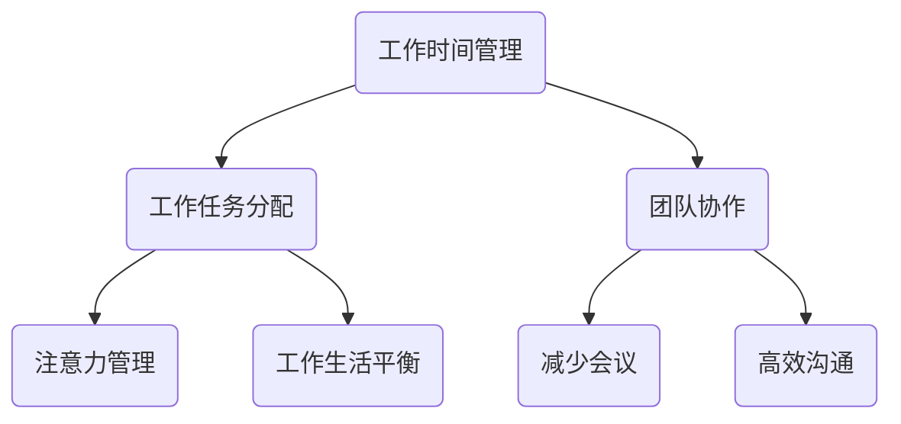

**数学公式与解释：**

$$
\text{工作效率} = \frac{\text{专注时间}}{\text{工作时间}} \times \text{任务完成率}
$$

这个公式表示工作效率是专注时间与工作时间的比值，乘以任务完成率。通过提高专注时间和任务完成率，我们可以提高工作效率。

#### 6.3 实例分享

**6.3.1 企业案例分享**

某大型科技公司意识到员工因长时间使用数字设备而导致的健康问题和工作效率下降。为了解决这个问题，公司采取了以下措施：

1. **政策制定：**制定了明确的数字设备使用政策和工作时间安排，确保员工每天有足够的休息时间。

2. **技术支持：**提供了数字管理工具，帮助员工监控和减少数字设备的使用。

3. **文化塑造：**通过内部培训和宣传活动，倡导数字排毒的理念，鼓励员工积极参与。

通过这些措施，公司的员工工作效率显著提升，员工的整体健康水平也有所改善。

**6.3.2 组织案例分享**

某非营利组织为了提高员工的工作效率和幸福感，推行了数字排毒计划。以下是具体的措施：

1. **工作时间管理：**每天下午3点至5点设定为无数字设备时间，鼓励员工进行户外活动或放松休息。

2. **工作任务分配：**根据员工的专注力和工作习惯，合理安排工作任务，确保任务分配合理。

3. **团队协作：**通过减少无意义的会议和沟通，提高团队协作效率。

通过这些措施，组织的员工工作效率显著提高，员工之间的沟通也更加高效和积极。

### 6.4 本章小结

本章介绍了数字排毒在工作环境中的建设，包括企业和管理组织的角色、数字排毒在工作中的应用以及实例分享。通过采取有效的措施，企业和管理组织可以推动数字排毒，提升员工的注意力、工作效率和整体幸福感。在数字时代，创造一个健康的数字工作环境是提升企业竞争力和社会责任的重要举措。

----------------------------------------------------------------

## 第七部分：数字排毒的未来展望

### 第7章：数字排毒的未来展望

#### 7.1 技术发展对数字排毒的影响

随着科技的快速发展，新技术的应用将对数字排毒产生深远的影响。一方面，这些技术可以为数字排毒提供更加便捷和高效的工具和方法；另一方面，技术本身也可能成为新的数字依赖源，对数字排毒提出新的挑战。

**核心概念与联系：**

1. **数字健康管理工具：**如手机应用、可穿戴设备和智能设备等，可以帮助用户监控和管理数字设备的使用情况，提供个性化的数字排毒建议。

2. **增强现实（AR）和虚拟现实（VR）：**这些技术可以为用户提供全新的数字体验，帮助人们更好地进行放松和专注训练。

3. **人工智能（AI）与大数据分析：**AI和大数据分析可以更准确地识别用户的数字使用行为，提供定制化的数字排毒方案。

**Mermaid类图：**

```mermaid
classDiagram
    TechnologyDevelopment <|-- DigitalHealthMonitoringTools
    TechnologyDevelopment <|-- ARandVR
    TechnologyDevelopment <|-- AIandBigDataAnalysis
    DigitalHealthMonitoringTools {
        +trackDigitalUsage()
        +providePersonalizedDetoxSuggestions()
    }
    ARandVR {
        +provideNewDigitalExperiences()
        +aidRelaxationAndFocusTraining()
    }
    AIandBigDataAnalysis {
        +analyzeDigitalUsageBehavior()
        +generateCustomizedDetoxSolutions()
    }
```

**数学公式与解释：**

$$
\text{数字排毒效果} = f(\text{技术工具}, \text{用户行为}, \text{个性化方案})
$$

这个公式表示数字排毒效果是技术工具、用户行为和个性化方案的函数。通过提高这些要素，我们可以增强数字排毒的效果。

#### 7.2 社会层面的数字排毒趋势

数字排毒的理念和实践正在全球范围内得到越来越多的关注。社会层面的数字排毒趋势表现为以下几个方面：

**核心概念与联系：**

1. **政策与法规的推动：**政府和社会组织出台相关政策，鼓励和支持数字排毒的实践。

2. **社会意识的提升：**公众对数字中毒的危害和数字排毒的重要性有了更深入的认识。

3. **社区和组织的参与：**越来越多的社区和组织积极参与数字排毒运动，推广和实践数字排毒理念。

**Mermaid流程图：**

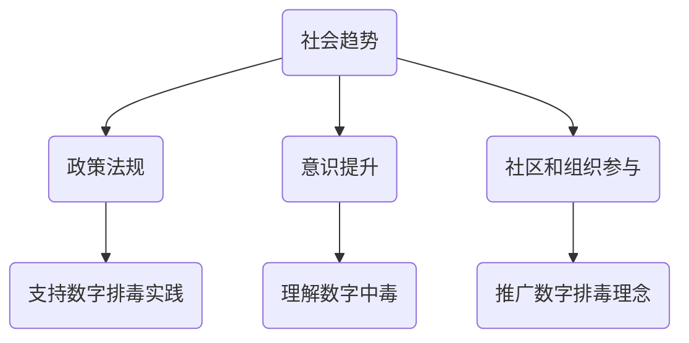

**数学公式与解释：**

$$
\text{社会数字排毒效果} = \frac{\text{政策支持}}{\text{社会意识}} \times \text{社区参与}
$$

这个公式表示社会数字排毒效果是政策支持、社会意识和社区参与的函数。通过提高这些要素，我们可以增强社会数字排毒的效果。

#### 7.3 数字排毒的可持续性

数字排毒的可持续性是确保其长期效果和持久性的关键。以下是一些实现数字排毒可持续性的策略：

**核心概念与联系：**

1. **终身学习：**通过持续学习和培训，不断提升个人的数字排毒能力和意识。

2. **社区支持：**建立互助社群和社区网络，提供持续的支持和鼓励。

3. **企业和社会责任：**企业和社会组织应承担起数字排毒的社会责任，为员工和社会成员提供资源和支持。

**Mermaid类图：**

```mermaid
classDiagram
    Sustainability(可持续性) <|-- LifelongLearning
    Sustainability <|-- CommunitySupport
    Sustainability <|-- CorporateandSocialResponsibility
    LifelongLearning {
        +ongoingEducationAndTraining()
        +enhancePersonalDigitalDetoxSkills()
    }
    CommunitySupport {
        +buildMutualSupportCommunities()
        +provideContinuedEncouragement()
    }
    CorporateandSocialResponsibility {
        +offerResourcesForDigitalDetox()
        +promoteDigitalDetoxWithinOrganizations()
    }
```

**数学公式与解释：**

$$
\text{数字排毒可持续性} = \frac{\text{终身学习}}{\text{社区支持}} \times \text{社会责任}
$$

这个公式表示数字排毒可持续性是终身学习、社区支持和社会责任的函数。通过提高这些要素，我们可以增强数字排毒的可持续性。

#### 7.4 社会共治的展望

数字排毒不仅需要个人的努力，也需要社会各界的共同参与。社会共治是数字排毒可持续发展的重要保障。以下是一些社会共治的展望：

**核心概念与联系：**

1. **政府引导：**政府应发挥引导作用，制定相关政策和法规，推动数字排毒的实践。

2. **企业参与：**企业应积极参与数字排毒的实践，为员工提供支持和资源，推动企业内部的数字排毒文化建设。

3. **社会组织和公众参与：**社会组织和公众应积极参与数字排毒运动，共同推动数字排毒理念的传播和实践。

**Mermaid架构设计图：**

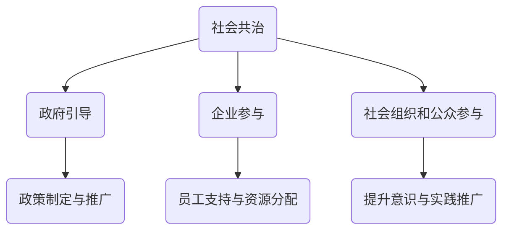

**数学公式与解释：**

$$
\text{社会共治效果} = \frac{\text{政府引导}}{\text{企业参与}} \times \text{社会组织和公众参与}
$$

这个公式表示社会共治效果是政府引导、企业参与和社会组织及公众参与的函数。通过提高这些要素，我们可以增强社会共治的效果。

### 7.5 本章小结

本章探讨了数字排毒的未来展望，包括技术发展对数字排毒的影响、社会层面的数字排毒趋势、数字排毒的可持续性以及社会共治的展望。通过这些讨论，我们认识到数字排毒是一个长期而复杂的过程，需要个人、企业和社会各界的共同努力。在未来的数字时代，数字排毒将成为提升心理健康和幸福感的重要途径。

----------------------------------------------------------------

## 总结与未来展望

数字排毒是一种旨在减少数字接触，重建注意力与深度思考能力，提升心理健康和幸福感的策略。本文从数字排毒的背景与影响、方法与实践、心理调节、教育与实践、工作环境建设以及未来展望等方面进行了深入探讨。通过逐步分析和推理，我们认识到数字中毒的广泛存在及其带来的负面影响，以及数字排毒的重要性和必要性。

数字排毒的核心目标是重建注意力，恢复深度思考能力，并提升心理健康和幸福感。为了实现这些目标，我们可以通过减少数字接触时间、培养专注力和深度思考能力、心理调节、教育与实践、工作环境建设等多种方法进行数字排毒。这些方法不仅适用于个人，也可以在企业、学校和教育体系中得到广泛应用。

未来，随着技术的不断进步和社会意识的提升，数字排毒将得到更广泛的支持和关注。新技术的应用，如数字健康管理工具、增强现实（AR）和虚拟现实（VR）、人工智能（AI）与大数据分析等，将为数字排毒提供更加便捷和高效的工具和方法。同时，社会层面的数字排毒趋势也将逐渐显现，政策与法规的推动、社会意识的提升、社区和组织的参与将共同推动数字排毒的实践。

在数字时代，数字排毒不仅是应对数字依赖和数字中毒的有效策略，也是提升个体和整体社会幸福感的必由之路。通过个人、企业和社会各界的共同努力，我们可以创造一个更加健康和平衡的数字生活，重建注意力与深度思考能力，享受更加充实和有意义的生活。

### 最佳实践 tips

1. **逐步减少数字接触时间：**不要一下子大幅减少数字设备的使用时间，而是逐步调整，给自己适应的时间。

2. **设定具体目标：**明确你的数字排毒目标，如减少每天使用手机的时间，设定具体的时间限制。

3. **使用数字管理工具：**利用手机应用和可穿戴设备来监控和管理你的数字设备使用情况。

4. **培养专注力和深度思考能力：**通过冥想、专注力训练、阅读和深度写作来提高专注力和深度思考能力。

5. **寻求支持：**加入数字排毒社群，与他人分享经验和心得，寻求支持和鼓励。

6. **家庭和学校合作：**在家庭和学校中推广数字排毒的理念和实践，共同创造一个支持数字排毒的环境。

7. **关注心理健康：**通过认知行为疗法和心理支持，应对数字中毒带来的心理压力和焦虑。

### 注意事项

1. **逐步实施：**数字排毒是一个长期的过程，需要耐心和毅力，不要急于求成。

2. **避免戒断反应：**在减少数字接触的初期，可能会出现戒断反应，如焦虑、抑郁等，要妥善处理。

3. **合理使用技术：**新技术的应用是数字排毒的有力工具，但要避免过度依赖，确保技术的合理使用。

4. **保持灵活性：**数字排毒计划要根据个人实际情况进行调整，保持灵活性，确保能够持续执行。

### 拓展阅读

1. **《数字中毒：如何摆脱数字依赖，重获自由》**：作者介绍了数字中毒的危害和应对策略，提供了实用的数字排毒方法。

2. **《深度工作：如何有效利用每一点脑力》**：作者安德斯·艾利克森探讨了深度工作的价值和实现方法，对提升专注力和深度思考能力有重要指导意义。

3. **《正念：如何活在当下，享受生活》**：作者乔·卡巴金介绍了正念冥想的方法和技巧，对培养专注力和心理调节有很好的帮助。

4. **《数字时代的教育变革：如何培养学生的数字素养和批判性思维》**：作者史蒂文·约翰逊探讨了数字时代的教育变革，对学校教育和家庭实践提供了有益的启示。

### 作者信息

作者：AI天才研究院/AI Genius Institute & 禅与计算机程序设计艺术 /Zen And The Art of Computer Programming

AI天才研究院是一支致力于推动人工智能研究和应用的国际团队，专注于开发先进的人工智能技术和解决方案。同时，作者也是《禅与计算机程序设计艺术》一书的作者，该书融合了禅宗哲学和计算机科学，对提升程序员的技术水平和心理健康具有深远影响。作者的研究成果和著作在人工智能和计算机科学领域具有广泛的影响力。

