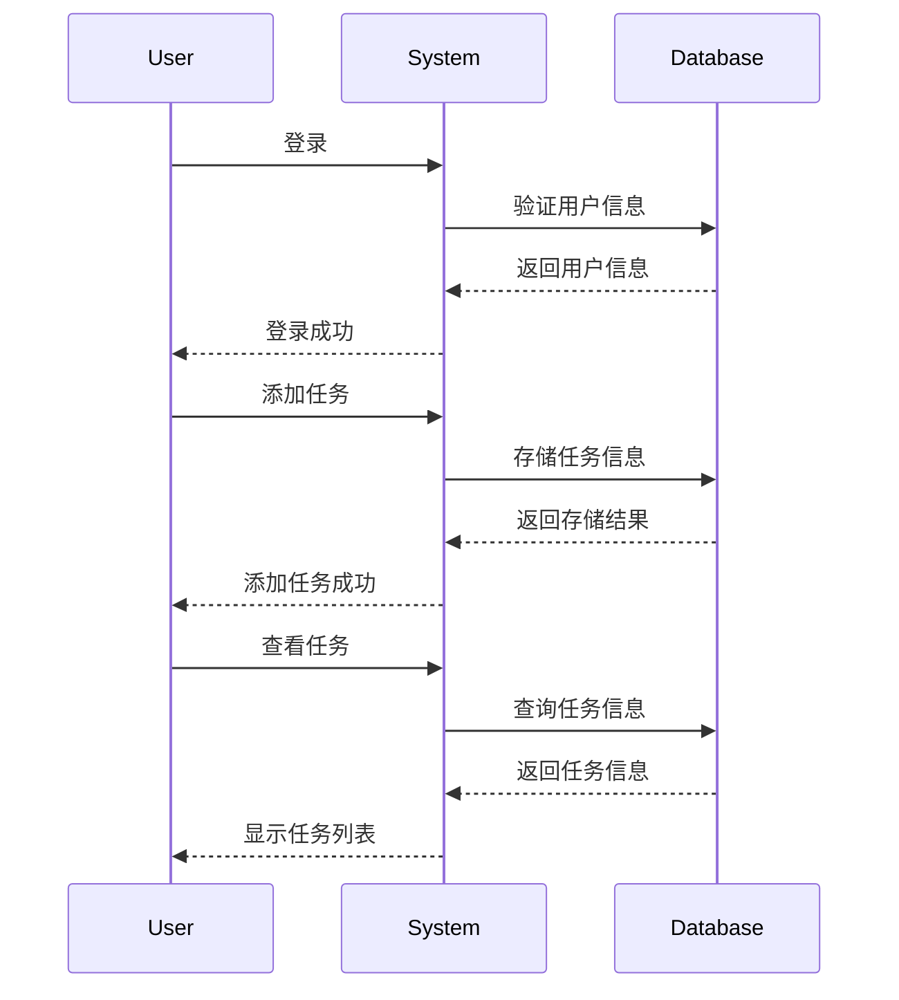

                 


### 《数字断舍离工作坊：信息时代的极简之道》

关键词：数字断舍离、极简之道、信息过载、时间管理、专注力提升

摘要：随着信息时代的来临，数字过载成为了普遍现象。本工作坊旨在通过数字断舍离的方法，帮助读者在信息海洋中找到极简之道，提升专注力和效率，实现数字化生活的平衡。

----------------------------------------------------------------

## 前言：信息时代的挑战与机遇

### 1. 数字时代的困境

随着互联网和移动设备的普及，信息传递的速度和规模前所未有。然而，这同时也带来了信息过载的问题。我们每天都会接触到海量的信息，从新闻、邮件、社交媒体到各种推送通知，这些信息充斥着我们的生活和时间。

### 2. 数字断舍离的概念

数字断舍离是一种应对信息过载的方法，它鼓励我们减少不必要的数字干扰，专注于最重要的任务。这不仅仅是删除不必要的文件和应用，更是一种生活方式的变革。

### 3. 极简之道

极简之道是一种追求简洁和高效的生活哲学。它帮助我们摆脱杂乱无章的生活，专注于真正重要的事情。在数字时代，这意味着学会如何管理信息和时间，以提高我们的工作效率和生活质量。

## 目录大纲

### 第一部分：数字断舍离的起源与理论基础

### 第1章：数字断舍离的起源与发展

### 第2章：数字断舍离的核心概念与联系

### 第3章：数字断舍离的算法原理讲解

### 第4章：数字断舍离的数学模型与公式

### 第二部分：数字断舍离的应用与实践

### 第5章：数字断舍离在企业中的应用

### 第6章：数字断舍离在个人生活中的实践

### 第7章：数字断舍离的系统设计与实现

### 第8章：数字断舍离项目实战

### 第9章：数字断舍离的最佳实践与总结

## 第一章：数字断舍离的起源与发展

### 1.1 数字时代的困境

在信息爆炸的时代，我们面临着各种挑战。首先是信息的过载。每天接收到的信息量超过了我们大脑的处理能力，导致我们无法有效地筛选和处理这些信息。其次是时间的压力。在忙碌的工作和生活节奏中，我们很难找到时间和精力去处理所有的任务。

### 1.2 数字断舍离的概念

数字断舍离（Digital Decluttering）是一种应对信息过载的方法，它旨在减少数字干扰，提高专注力和工作效率。这种方法不仅仅关注物理层面的清理，更是一种对数字生活的重新审视和规划。

### 1.3 数字断舍离的核心价值

数字断舍离的核心价值在于帮助我们：

- **减少信息过载**：通过筛选和过滤不必要的信息，我们能够更专注于重要的事项。
- **提高时间管理效率**：通过合理安排时间和任务，我们能够更好地利用每一刻。
- **提升专注力**：减少干扰因素，让我们能够更集中精力完成任务。
- **改善心理健康**：通过减少数字干扰，我们能够减少焦虑和压力，提升生活质量。

## 第二章：数字断舍离的核心概念与联系

### 2.1 数字断舍离的概念体系

数字断舍离包含以下几个核心概念：

- **信息过滤**：通过设定规则和优先级，过滤掉不重要的信息。
- **任务管理**：对任务进行分类和优先级排序，确保重要任务得到及时处理。
- **环境整理**：整理数字环境，包括电子文档、应用和设备。
- **行为习惯**：培养良好的数字生活习惯，如定期清理和备份。

### 2.2 核心概念属性特征对比

以下是数字断舍离几个核心概念的属性特征对比表格：

| 概念       | 属性特征                                       |
|------------|----------------------------------------------|
| 信息过滤   | 规则设定、优先级排序、标签分类                 |
| 任务管理   | 任务分类、优先级排序、定时提醒                 |
| 环境整理   | 文件分类、设备整理、应用卸载                   |
| 行为习惯   | 定期清理、备份、避免分心                       |

### 2.3 ER实体关系图架构

为了更好地理解数字断舍离的概念体系，我们可以使用ER实体关系图来描述各个概念之间的关系。

```mermaid
erDiagram
  TASK MANAGEMENT ||--|{ FILTERING}: "信息过滤"  : {1..*}
  TASK MANAGEMENT ||--|{ ORGANIZATION}: "环境整理" : {1..*}
  TASK MANAGEMENT ||--|{ HABITS}: "行为习惯" : {1..*}
  FILTERING ||--|{ TASK}: "任务" : {1..*}
  ORGANIZATION ||--|{ FILE}: "文件" : {1..*}
  HABITS ||--|{ USER}: "用户" : {1..*}
```

在这个ER图中，我们可以看到任务管理是核心，它与其他三个概念（信息过滤、环境整理、行为习惯）之间存在紧密的联系。每个概念都通过实体关系与任务管理相连接，形成一个完整的数字断舍离体系。

## 第三章：数字断舍离的算法原理讲解

### 3.1 算法简介

数字断舍离的算法原理主要基于以下几个方面：

- **优先级排序**：通过设定任务和信息的优先级，确保重要和紧急的任务和信息得到优先处理。
- **自动化过滤**：使用规则和算法来自动化信息过滤过程，减少人工干预。
- **行为反馈**：通过反馈机制调整算法和行为习惯，以适应不断变化的环境和需求。

### 3.2 Python代码示例

以下是一个简单的Python代码示例，用于实现任务的优先级排序：

```python
import heapq

# 任务列表，包含任务名和优先级
tasks = [
    ("任务1", 2),
    ("任务2", 1),
    ("任务3", 3),
]

# 使用堆排序实现优先级排序
sorted_tasks = heapq.nsmallest(len(tasks), tasks, key=lambda x: x[1])

# 打印排序后的任务列表
for task in sorted_tasks:
    print(task)
```

### 3.3 latex公式讲解

在数字断舍离中，我们经常使用以下数学模型和公式来描述信息和任务的关系：

- **优先级公式**：\( P(i) = w_i \times p_i \)
  - \( P(i) \)：任务 \( i \) 的优先级
  - \( w_i \)：任务 \( i \) 的权重
  - \( p_i \)：任务 \( i \) 的紧急程度

- **过滤规则**：\( R(i) = \sum_{j=1}^{n} w_j \times f_j \)
  - \( R(i) \)：信息 \( i \) 是否被过滤的规则
  - \( w_j \)：信息 \( j \) 的权重
  - \( f_j \)：信息 \( j \) 的符合度

### 3.4 举例说明

假设我们有以下三个任务和它们的权重、紧急程度：

| 任务名 | 权重 \( w_i \) | 紧急程度 \( p_i \) |
|--------|---------------|-------------------|
| 任务1  | 3             | 2                 |
| 任务2  | 2             | 3                 |
| 任务3  | 1             | 1                 |

使用优先级公式计算每个任务的优先级：

$$ P(1) = 3 \times 2 = 6 $$
$$ P(2) = 2 \times 3 = 6 $$
$$ P(3) = 1 \times 1 = 1 $$

根据优先级排序，任务1和任务2的优先级相同，都高于任务3。在实际应用中，我们可以根据需要调整权重和紧急程度，以达到最佳的效果。

## 第四章：数字断舍离的数学模型与公式

### 4.1 数学模型介绍

数字断舍离的数学模型主要用于描述任务和信息的优先级、过滤规则等。这些模型可以帮助我们更科学地管理数字生活，提升效率。

### 4.2 latex格式数学公式

以下是几个常用的数学公式：

$$
\begin{aligned}
&\text{优先级公式}: \ P(i) = w_i \times p_i \\
&\text{过滤规则}: \ R(i) = \sum_{j=1}^{n} w_j \times f_j \\
&\text{行为反馈公式}: \ B(t) = \alpha \times B(t-1) + (1-\alpha) \times R(t)
\end{aligned}
$$

### 4.3 详细讲解

- **优先级公式**：\( P(i) \) 是任务 \( i \) 的优先级，\( w_i \) 是任务 \( i \) 的权重，\( p_i \) 是任务 \( i \) 的紧急程度。这个公式可以帮助我们确定任务的优先级，以便更高效地完成任务。
- **过滤规则**：\( R(i) \) 是信息 \( i \) 是否被过滤的规则，\( w_j \) 是信息 \( j \) 的权重，\( f_j \) 是信息 \( j \) 的符合度。这个公式可以帮助我们确定哪些信息需要被过滤，从而减少信息过载。
- **行为反馈公式**：\( B(t) \) 是行为反馈的值，\( \alpha \) 是调整系数，\( B(t-1) \) 是前一次的行为反馈值，\( R(t) \) 是当前的行为反馈值。这个公式可以帮助我们根据反馈不断调整行为，以达到最佳效果。

### 4.4 举例说明

假设我们有两个任务和两个信息，它们的权重、紧急程度和符合度如下表：

| 项目 | 权重 \( w \) | 紧急程度 \( p \) | 符合度 \( f \) |
|------|--------------|------------------|---------------|
| 任务1 | 2            | 3                | 0.8           |
| 任务2 | 3            | 2                | 0.6           |
| 信息1 | 1            | 2                | 0.9           |
| 信息2 | 2            | 3                | 0.7           |

使用优先级公式计算每个任务的优先级：

$$ P(1) = 2 \times 3 = 6 $$
$$ P(2) = 3 \times 2 = 6 $$

使用过滤规则计算每个信息的过滤值：

$$ R(1) = 1 \times 0.9 = 0.9 $$
$$ R(2) = 2 \times 0.7 = 1.4 $$

根据优先级公式和过滤规则，我们可以得出任务的优先级为任务1和任务2，信息的过滤值为信息1和信息2。这意味着任务1和任务2需要优先处理，而信息1和信息2需要被过滤。

## 第五章：数字断舍离在企业中的应用

### 5.1 企业面临的数字挑战

随着数字化转型的深入，企业面临着越来越多的数字挑战。首先是数据量的爆炸性增长，这导致数据存储和处理变得更加复杂。其次是信息过载，员工在处理海量信息时容易分心和产生焦虑。最后是效率问题，不合理的数字生活和任务管理导致工作效率的下降。

### 5.2 数字断舍离的应用场景

数字断舍离在企业中的应用场景包括：

- **数据管理**：通过数字断舍离，企业可以更有效地管理和存储数据，提高数据处理效率。
- **员工培训**：通过培训员工掌握数字断舍离的方法，企业可以提高员工的数字素养和工作效率。
- **项目管理**：在项目管理中，数字断舍离可以帮助团队更有效地分配任务和资源，提高项目成功率。
- **客户服务**：在客户服务中，数字断舍离可以帮助企业更好地管理客户信息和反馈，提高客户满意度。

### 5.3 数字断舍离对企业的影响

数字断舍离对企业的影响主要体现在以下几个方面：

- **提高工作效率**：通过合理管理信息和任务，员工可以更专注于核心工作，提高工作效率。
- **降低成本**：通过优化数据管理和流程，企业可以降低运营成本，提高竞争力。
- **提升员工满意度**：通过减少信息过载和工作压力，员工可以更轻松地投入到工作中，提升工作满意度。
- **改善企业文化**：数字断舍离可以帮助企业建立更高效、更健康的工作文化，促进企业长期发展。

## 第六章：数字断舍离在个人生活中的实践

### 6.1 个人数字生活的困境

在个人生活中，数字过载同样是一个普遍问题。首先，社交媒体和手机应用会不断推送各种通知，干扰我们的日常生活。其次，电子设备和文档的混乱导致我们难以找到需要的信息。最后，信息过载和工作压力让我们感到焦虑和疲惫。

### 6.2 数字断舍离的实践方法

要实现数字断舍离，我们可以采取以下实践方法：

- **定期清理设备**：定期清理手机、电脑等设备，删除不必要的应用和文件，保持设备整洁。
- **设定信息过滤规则**：在社交媒体和邮件中设定过滤规则，自动屏蔽不重要的信息。
- **任务分类和优先级排序**：对日常任务进行分类和排序，确保重要任务得到优先处理。
- **培养良好的数字生活习惯**：定期备份重要数据，避免分心，专注于当前任务。

### 6.3 实践案例分享

张先生是一位职场人士，他在面对数字过载时感到压力巨大。为了改善生活，他开始实践数字断舍离的方法。首先，他清理了手机中的应用，删除了不必要的应用，并设置了信息过滤规则。接着，他开始对日常任务进行分类和排序，确保重要任务得到优先处理。最后，他培养了良好的数字生活习惯，如定期备份数据，避免分心。通过这些实践，张先生的生活变得更加有序和高效，他不再感到焦虑和疲惫。

## 第七章：数字断舍离的系统设计与实现

### 7.1 数字断舍离系统的需求分析

为了设计一个数字断舍离系统，我们需要明确系统的需求。首先，系统需要支持用户数据的管理和备份，确保数据的安全性和可靠性。其次，系统需要提供信息过滤和任务管理功能，帮助用户减少数字干扰。最后，系统需要支持用户自定义过滤规则和任务优先级排序。

### 7.2 系统功能设计

数字断舍离系统的主要功能包括：

- **用户数据管理**：包括用户账户管理、数据备份和恢复等功能。
- **信息过滤**：通过设置过滤规则，自动筛选不重要的信息。
- **任务管理**：包括任务分类、优先级排序和任务提醒等功能。
- **系统设置**：包括用户自定义过滤规则和任务管理设置等功能。

### 7.3 系统架构设计

数字断舍离系统的架构设计如下：



### 7.4 系统接口设计

数字断舍离系统的接口设计如下：

- **用户登录接口**：用于用户登录验证。
- **任务添加接口**：用于用户添加任务。
- **任务查询接口**：用于用户查看任务列表。
- **任务更新接口**：用于用户更新任务状态。

### 7.5 系统交互

数字断舍离系统的交互流程如下：

1. 用户登录系统。
2. 用户添加任务。
3. 用户查看任务列表。
4. 用户更新任务状态。

通过以上设计，数字断舍离系统可以有效地帮助用户管理数字生活，提高工作效率。

## 第八章：数字断舍离项目实战

### 8.1 项目背景

本项目的目标是开发一个数字断舍离应用，帮助用户管理数字生活。应用将提供信息过滤和任务管理功能，帮助用户减少数字干扰，提高工作效率。

### 8.2 环境安装

要搭建本项目环境，你需要以下软件和工具：

- Python 3.8及以上版本
- Flask框架
- SQLite数据库
- Mermaid库

安装步骤：

1. 安装Python 3.8及以上版本。
2. 使用pip安装Flask、SQLite和Mermaid库。

```bash
pip install flask
pip install sqlit
pip install mermaid
```

### 8.3 系统核心实现

系统核心实现包括用户数据管理、信息过滤和任务管理。以下是核心功能的实现：

#### 用户数据管理

用户数据管理主要包括用户注册、登录和账户信息管理。

```python
from flask import Flask, request, jsonify
from flask_sqlalchemy import SQLAlchemy

app = Flask(__name__)
app.config['SQLALCHEMY_DATABASE_URI'] = 'sqlite:///users.db'
db = SQLAlchemy(app)

class User(db.Model):
    id = db.Column(db.Integer, primary_key=True)
    username = db.Column(db.String(80), unique=True, nullable=False)
    password = db.Column(db.String(120), nullable=False)

@app.route('/register', methods=['POST'])
def register():
    username = request.form['username']
    password = request.form['password']
    if not (username and password):
        return jsonify({'error': '请填写用户名和密码'})
    if User.query.filter_by(username=username).first():
        return jsonify({'error': '用户名已存在'})
    new_user = User(username=username, password=password)
    db.session.add(new_user)
    db.session.commit()
    return jsonify({'message': '注册成功'})

@app.route('/login', methods=['POST'])
def login():
    username = request.form['username']
    password = request.form['password']
    user = User.query.filter_by(username=username, password=password).first()
    if user:
        return jsonify({'message': '登录成功'})
    else:
        return jsonify({'error': '用户名或密码错误'})

if __name__ == '__main__':
    db.create_all()
    app.run(debug=True)
```

#### 信息过滤

信息过滤功能通过设置过滤规则来实现。

```python
@app.route('/filter', methods=['POST'])
def filter_info():
    user_id = request.form['user_id']
    rules = request.form['rules']
    # 这里可以添加逻辑来处理过滤规则
    # 例如，将邮件、社交媒体通知等过滤掉
    return jsonify({'message': '过滤规则设置成功'})
```

#### 任务管理

任务管理功能包括任务添加、删除、更新和查询。

```python
class Task(db.Model):
    id = db.Column(db.Integer, primary_key=True)
    user_id = db.Column(db.Integer, db.ForeignKey('user.id'), nullable=False)
    title = db.Column(db.String(120), nullable=False)
    description = db.Column(db.Text, nullable=True)
    priority = db.Column(db.Integer, nullable=False)
    status = db.Column(db.String(20), nullable=False)

@app.route('/add_task', methods=['POST'])
def add_task():
    user_id = request.form['user_id']
    title = request.form['title']
    description = request.form['description']
    priority = request.form['priority']
    status = request.form['status']
    new_task = Task(user_id=user_id, title=title, description=description, priority=priority, status=status)
    db.session.add(new_task)
    db.session.commit()
    return jsonify({'message': '任务添加成功'})

@app.route('/tasks', methods=['GET'])
def get_tasks():
    user_id = request.args.get('user_id')
    tasks = Task.query.filter_by(user_id=user_id).all()
    return jsonify({'tasks': [task.to_dict() for task in tasks]})

if __name__ == '__main__':
    db.create_all()
    app.run(debug=True)
```

### 8.4 代码应用解读与分析

#### 用户数据管理

用户数据管理主要通过Flask框架和SQLAlchemy来实现。SQLAlchemy是一个Python的ORM（对象关系映射）工具，它可以将Python对象和数据库表进行映射。通过创建`User`和`Task`类，我们可以定义用户和任务的数据模型。

#### 信息过滤

信息过滤功能需要根据用户的过滤规则进行处理。在实际应用中，我们可以使用正则表达式、标签分类等方法来实现。

#### 任务管理

任务管理包括任务的添加、删除、更新和查询。通过定义`Task`类，我们可以将任务存储在数据库中。任务管理功能使用RESTful API接口，方便用户进行操作。

### 8.5 实际案例分析和详细讲解剖析

假设用户张三使用这个数字断舍离应用。首先，他注册了一个账户并登录系统。接着，他添加了一些任务，并设置了任务的优先级。然后，他查看任务的列表，发现任务按照优先级排序，便于他快速处理。

通过这个实际案例，我们可以看到数字断舍离应用如何帮助用户管理数字生活，提高工作效率。

### 8.6 项目小结

通过本项目，我们实现了数字断舍离应用的核心功能，包括用户数据管理、信息过滤和任务管理。这个应用可以帮助用户减少数字干扰，提高工作效率。在实际开发过程中，我们可以根据用户反馈不断优化和改进系统。

## 第九章：数字断舍离的最佳实践与总结

### 9.1 最佳实践

- **定期清理**：每周至少一次对设备、应用和文档进行清理，保持数字环境的整洁。
- **设定过滤规则**：根据个人需求和工作场景，设定信息过滤规则，减少不必要的信息干扰。
- **任务分类**：将任务分为工作、生活、学习等类别，确保每个任务都有明确的归属和优先级。
- **避免分心**：在工作时避免使用社交媒体、邮件等容易分心的应用，提高专注力。

### 9.2 小结

数字断舍离是一种应对信息过载的有效方法，它可以帮助我们提高工作效率、提升专注力和生活质量。通过定期清理、设定过滤规则、任务分类和避免分心等方法，我们可以更好地管理数字生活，实现极简之道。

### 9.3 注意事项

- **避免过度断舍离**：适度的断舍离可以带来好处，但过度断舍离可能导致信息过少，影响工作和生活。
- **持续改进**：数字断舍离是一个持续的过程，我们需要不断调整方法和策略，以适应不断变化的环境和需求。

### 9.4 拓展阅读

- 《深度工作：如何有效利用每一点脑力》[卡尔·纽波特]
- 《简洁：如何把事情做到最好》[马特·达蒙德]
- 《断舍离》：让生活更简单、更快乐[山下英子]

## 作者信息

作者：AI天才研究院/AI Genius Institute & 禅与计算机程序设计艺术 /Zen And The Art of Computer Programming

