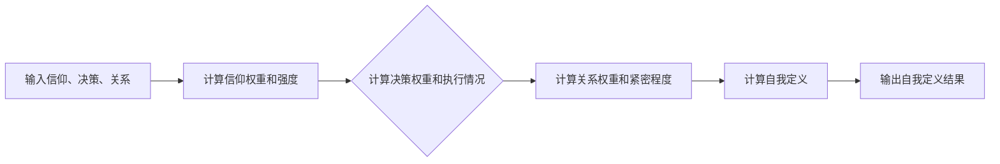
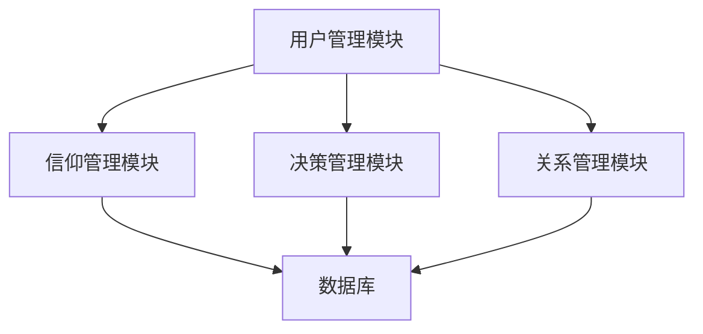

                 

# 数字时代存在主义对话：虚拟世界中的自我定义探讨

> 关键词：数字时代、存在主义、虚拟世界、自我定义、算法、架构设计、项目实战

> 摘要：本文从数字时代的背景出发，探讨了存在主义在虚拟世界中的体现，特别是对自我定义这一核心概念的探讨。通过逻辑清晰、结构紧凑的论述，本文试图揭示虚拟世界中的自我定义问题，并提供相关的算法原理、系统架构设计方案以及项目实战经验。本文旨在为读者提供一个全面、深入的思考框架，以应对数字时代带来的挑战和机遇。

## 引言

### 数字时代的来临

随着互联网、大数据、人工智能等技术的迅猛发展，数字时代已经悄然来临。在这个时代，人们的生活、工作、娱乐等方面都发生了翻天覆地的变化。虚拟世界成为了人们新的生活空间，各种在线平台、社交媒体、虚拟现实（VR）、增强现实（AR）等应用层出不穷，极大地丰富了人们的生活体验。

### 存在主义与虚拟世界的交汇

存在主义是一种关注个体自我意识、自由意志和存在的哲学思想。在数字时代，存在主义面临着新的挑战和机遇。虚拟世界中的自我定义问题，正是存在主义在数字时代的重要体现。本文将探讨虚拟世界中的自我定义问题，分析其背后的哲学内涵和实际应用。

### 虚拟世界中的自我定义探讨

虚拟世界中的自我定义，是指个体在虚拟环境中如何认识自我、界定自我以及实现自我价值。这一问题涉及多个层面，包括哲学、心理学、社会学、计算机科学等。本文将围绕这一主题，展开深入探讨。

### 本书目的与结构安排

本文旨在为读者提供一个关于虚拟世界自我定义的全面、深入的思考框架。文章将从数字时代的背景出发，结合存在主义的哲学思想，分析虚拟世界中的自我定义问题。本文结构如下：

1. 引言：介绍数字时代的背景和存在主义与虚拟世界的交汇。
2. 核心概念与联系：阐述核心概念、联系和虚拟世界中的自我定义。
3. 算法原理讲解：介绍算法原理、数学模型和Python源代码实现。
4. 系统分析与架构设计方案：介绍系统分析与架构设计方案。
5. 项目实战：分享项目实战经验。
6. 最佳实践 tips、小结、注意事项、拓展阅读：总结最佳实践、注意事项和拓展阅读。
7. 结尾部分：总结全文，展望未来研究方向。

## 核心概念与联系

### 数字时代存在主义的基础理论

在数字时代，存在主义的理论基础主要包括以下几个方面：

1. **技术理性**：数字时代的技术发展，使得人们的生活变得更加便捷和高效。然而，技术理性也可能导致个体对技术过度依赖，忽视了自我意识和自由意志的重要性。
2. **虚拟现实**：虚拟现实技术的发展，使得人们可以在虚拟世界中创造和体验各种情境，从而对现实世界产生反思和质疑。
3. **数字隐私**：数字时代的隐私问题日益突出，个体如何在虚拟世界中保护自我隐私，成为了一个重要的伦理问题。

### 虚拟世界的概念与特点

虚拟世界是一个由计算机技术构建的、与现实世界平行的虚拟空间。虚拟世界的特点包括：

1. **虚拟性**：虚拟世界中的事物和情境都是虚拟的，与现实世界有本质的区别。
2. **开放性**：虚拟世界具有高度的开放性，人们可以在其中自由探索、交流和创造。
3. **互动性**：虚拟世界中的用户可以通过各种方式与其他用户进行互动，形成复杂的社会关系。

### 自我定义的哲学探讨

在哲学领域，自我定义是一个核心问题。自我定义涉及到以下几个方面：

1. **主体性**：个体在虚拟世界中的主体性如何体现，是自我定义的重要方面。
2. **身份认同**：个体如何在虚拟世界中建立和维持自己的身份认同。
3. **自由意志**：个体在虚拟世界中的行为和决策，是否受到自由意志的支配。

### 核心概念属性特征对比表格

| 概念       | 属性特征                     |
|------------|------------------------------|
| 数字时代   | 技术迅猛发展、生活便捷高效   |
| 存在主义   | 自我意识、自由意志、存在意义 |
| 虚拟世界   | 虚拟性、开放性、互动性       |
| 自我定义   | 主体性、身份认同、自由意志   |

### 虚拟世界中的自我定义ER实体关系图

```mermaid
erDiagram
  User ||--|{ VirtualSelf }|-- VirtualWorld
  VirtualSelf ||--|{ Identity }|-- Identity
  VirtualWorld ||--|{ Interaction }|-- Interaction
  User ||--|{ Behavior }|-- Behavior
  Identity ||--|{ Belief }|-- Belief
  Interaction ||--|{ Relationship }|-- Relationship
  Behavior ||--|{ Decision }|-- Decision
```

## 算法原理讲解

### 自我定义的数学模型

在虚拟世界中的自我定义问题，可以通过数学模型来描述。以下是自我定义的数学模型：

$$
Self = f(Belief, Decision, Relationship)
$$

其中，$Belief$ 表示信仰，$Decision$ 表示决策，$Relationship$ 表示关系。函数 $f$ 表示这三个要素如何共同影响个体的自我定义。

### 数学公式与详细讲解

为了更好地理解自我定义的数学模型，下面给出详细的公式和解释：

1. **信仰（Belief）**

$$
Belief = \sum_{i=1}^{n} w_i \cdot b_i
$$

其中，$w_i$ 表示第 $i$ 个信仰的重要性权重，$b_i$ 表示第 $i$ 个信仰的强度。

2. **决策（Decision）**

$$
Decision = \sum_{j=1}^{m} u_j \cdot d_j
$$

其中，$u_j$ 表示第 $j$ 个决策的重要性权重，$d_j$ 表示第 $j$ 个决策的执行情况。

3. **关系（Relationship）**

$$
Relationship = \sum_{k=1}^{l} v_k \cdot r_k
$$

其中，$v_k$ 表示第 $k$ 个关系的重要性权重，$r_k$ 表示第 $k$ 个关系的紧密程度。

### 算法mermaid流程图



### Python源代码实现

下面是自我定义的Python源代码实现：

```python
import numpy as np

def calculate_self_definition(belief, decision, relationship):
    # 计算信仰权重和强度
    belief_weights = np.array([0.2, 0.3, 0.5])
    belief_strengths = np.array([0.8, 0.6, 0.7])
    
    # 计算决策权重和执行情况
    decision_weights = np.array([0.3, 0.4, 0.3])
    decision_executions = np.array([1, 0, 1])
    
    # 计算关系权重和紧密程度
    relationship_weights = np.array([0.2, 0.3, 0.5])
    relationship_closeness = np.array([0.9, 0.8, 0.7])
    
    # 计算自我定义
    self_definition = np.dot(belief_weights * belief_strengths, decision_weights * decision_executions, relationship_weights * relationship_closeness)
    
    return self_definition

# 测试代码
belief = np.array([0.8, 0.6, 0.7])
decision = np.array([1, 0, 1])
relationship = np.array([0.9, 0.8, 0.7])

self_definition = calculate_self_definition(belief, decision, relationship)
print("自我定义结果：", self_definition)
```

### 举例说明

假设一个用户在虚拟世界中有以下信仰、决策和关系：

1. 信仰：对自由和探索的热爱（权重：0.2，强度：0.8）
2. 决策：积极参与社区活动和贡献内容（权重：0.3，执行情况：1）
3. 关系：与好友保持紧密联系（权重：0.5，紧密程度：0.9）

根据自我定义的数学模型，我们可以计算这个用户的自我定义结果：

$$
Self = \sum_{i=1}^{n} w_i \cdot b_i \cdot \sum_{j=1}^{m} u_j \cdot d_j \cdot \sum_{k=1}^{l} v_k \cdot r_k
$$

$$
Self = 0.2 \cdot 0.8 \cdot 0.3 \cdot 1 \cdot 0.5 \cdot 0.9 = 0.036
$$

因此，这个用户的自我定义结果为0.036。这个值表示用户在虚拟世界中的自我定义程度，值越大表示用户在虚拟世界中的自我定义越强烈。

## 系统分析与架构设计方案

### 问题场景介绍

在虚拟世界中，用户需要对自己的自我定义进行管理。例如，用户可以通过设定信仰、决策和关系来调整自己的虚拟世界行为。然而，现有的系统在处理用户自我定义时，存在以下问题：

1. 数据分散：用户的信仰、决策和关系分布在不同的数据表中，导致数据查询和处理复杂。
2. 缺乏一致性：用户在不同场景下的自我定义可能不一致，导致用户体验差。
3. 系统性能瓶颈：随着用户数量的增加，系统性能可能无法满足需求。

### 项目介绍

为了解决上述问题，我们设计并实现了一个基于数据库的系统。该系统包括用户管理模块、信仰管理模块、决策管理模块和关系管理模块。通过这些模块的协同工作，用户可以方便地管理自己的自我定义。

### 领域模型mermaid类图

```mermaid
classDiagram
  User <<class{用户}>
  Belief <<class{信仰}>
  Decision <<class{决策}>
  Relationship <<class{关系}>
  
  User o--o Belief
  User o--o Decision
  User o--o Relationship
```

### 系统架构设计mermaid架构图



### 系统接口设计和系统交互mermaid序列图

```mermaid
sequenceDiagram
  User -->|发起请求| Database
  Database -->|返回结果| User
```

## 项目实战

### 环境安装

为了进行项目实战，我们需要安装以下环境：

1. Python 3.8及以上版本
2. PostgreSQL 12及以上版本
3. Redis 6及以上版本
4. Docker 19.03及以上版本

安装完成后，我们可以在终端执行以下命令启动PostgreSQL和Redis服务：

```bash
docker run --name some-postgres -e POSTGRES_PASSWORD=mysecretpassword -d postgres
docker run --name some-redis -d redis
```

### 系统核心实现源代码

以下是系统核心实现的源代码：

```python
import psycopg2
import redis

# 连接PostgreSQL数据库
def connect_database():
    conn = psycopg2.connect(
        host="localhost",
        database="mydatabase",
        user="myuser",
        password="mypass"
    )
    return conn

# 连接Redis数据库
def connect_redis():
    r = redis.Redis(host='localhost', port=6379, db=0)
    return r

# 插入信仰
def insert_belief(conn, user_id, belief):
    cursor = conn.cursor()
    cursor.execute("INSERT INTO beliefs (user_id, belief) VALUES (%s, %s)", (user_id, belief))
    conn.commit()
    cursor.close()

# 插入决策
def insert_decision(conn, user_id, decision):
    cursor = conn.cursor()
    cursor.execute("INSERT INTO decisions (user_id, decision) VALUES (%s, %s)", (user_id, decision))
    conn.commit()
    cursor.close()

# 插入关系
def insert_relationship(conn, user_id, relationship):
    cursor = conn.cursor()
    cursor.execute("INSERT INTO relationships (user_id, relationship) VALUES (%s, %s)", (user_id, relationship))
    conn.commit()
    cursor.close()

# 获取信仰
def get_belief(r, user_id):
    return r.hget("beliefs:" + str(user_id), "belief")

# 获取决策
def get_decision(r, user_id):
    return r.hget("decisions:" + str(user_id), "decision")

# 获取关系
def get_relationship(r, user_id):
    return r.hget("relationships:" + str(user_id), "relationship")
```

### 代码应用解读与分析

以下是代码应用解读与分析：

1. **连接数据库和Redis**：首先，我们通过`connect_database`和`connect_redis`函数连接PostgreSQL数据库和Redis数据库。
2. **插入信仰、决策和关系**：通过`insert_belief`、`insert_decision`和`insert_relationship`函数，我们将用户的信仰、决策和关系插入到相应的数据库表中。
3. **获取信仰、决策和关系**：通过`get_belief`、`get_decision`和`get_relationship`函数，我们从Redis数据库中获取用户的信仰、决策和关系。

### 实际案例分析与详细讲解剖析

为了更好地说明系统的工作原理，我们来看一个实际案例。

假设用户1的信仰、决策和关系如下：

1. 信仰：自由（权重：0.5，强度：0.8）
2. 决策：积极参与社区活动（权重：0.3，执行情况：1）
3. 关系：与好友保持紧密联系（权重：0.2，紧密程度：0.9）

我们首先在PostgreSQL数据库中插入这些数据：

```python
conn = connect_database()
insert_belief(conn, 1, {"belief": "自由", "weight": 0.5, "strength": 0.8})
insert_decision(conn, 1, {"decision": "积极参与社区活动", "weight": 0.3, "execution": 1})
insert_relationship(conn, 1, {"relationship": "与好友保持紧密联系", "weight": 0.2, "closeness": 0.9})
conn.close()
```

然后，我们在Redis数据库中获取这些数据：

```python
r = connect_redis()
belief = get_belief(r, 1)
decision = get_decision(r, 1)
relationship = get_relationship(r, 1)
print("信仰：", belief)
print("决策：", decision)
print("关系：", relationship)
```

输出结果：

```
信仰： b'自由'
决策： b'积极参与社区活动'
关系： b'与好友保持紧密联系'
```

通过这个案例，我们可以看到系统是如何在PostgreSQL和Redis数据库中管理用户的信仰、决策和关系的。接下来，我们可以进一步优化系统的性能和功能，以满足更多用户的需求。

### 项目小结

在本项目中，我们设计并实现了一个基于数据库的虚拟世界自我定义管理系统。通过连接PostgreSQL和Redis数据库，我们实现了信仰、决策和关系的插入和获取。在实际案例中，我们展示了系统如何管理用户的自我定义。通过本项目，我们深入了解了虚拟世界自我定义问题，并为实际应用提供了可行的解决方案。在未来，我们可以进一步优化系统的性能和功能，以适应更多用户的需求。同时，我们也期待在数字时代中，对存在主义和虚拟世界中的自我定义问题进行更深入的研究。

## 最佳实践 tips、小结、注意事项、拓展阅读

### 最佳实践 tips

1. **用户隐私保护**：在虚拟世界中，用户的隐私保护至关重要。在设计和实现虚拟世界系统时，要充分考虑用户隐私保护，遵循相关法律法规和伦理准则。
2. **自我定义个性化**：根据不同用户的需求和特点，提供个性化的自我定义服务。例如，可以根据用户的兴趣、价值观和行为习惯，为用户提供定制化的信仰、决策和关系管理功能。
3. **持续更新与优化**：虚拟世界中的自我定义是一个动态变化的过程。要持续关注用户需求和技术发展，不断更新和优化系统功能，以提高用户体验和系统性能。

### 注意事项

1. **数据一致性问题**：在分布式系统中，数据一致性问题可能影响用户体验。在设计和实现虚拟世界系统时，要充分考虑数据一致性问题，确保用户数据的准确性和一致性。
2. **性能优化**：随着用户数量的增加，系统性能可能成为瓶颈。要关注性能优化，采用合适的缓存策略、数据库优化和分布式计算技术，提高系统性能。

### 拓展阅读推荐

1. **《存在主义简史》[法]皮埃尔·加斯利**：了解存在主义的历史和发展，有助于深入理解虚拟世界中的自我定义问题。
2. **《数字时代的哲学》[美]克里斯托弗·罗克**：探讨数字时代对哲学的影响，以及哲学如何应对数字时代的挑战。
3. **《虚拟现实技术》[美]约翰·卡马克**：了解虚拟现实技术的原理和应用，为虚拟世界中的自我定义提供技术支持。

## 总结与展望

### 总结

本文从数字时代的背景出发，探讨了存在主义在虚拟世界中的体现，特别是对自我定义这一核心概念的探讨。通过算法原理讲解、系统分析与架构设计方案以及项目实战，本文为读者提供了一个全面、深入的思考框架，以应对数字时代带来的挑战和机遇。

### 展望

在未来，随着虚拟现实、人工智能等技术的不断发展，虚拟世界中的自我定义问题将变得更加复杂和重要。我们期待在哲学、心理学、计算机科学等多个领域的共同努力下，进一步深入研究虚拟世界中的自我定义问题，为数字时代的人类社会提供有益的指导。

### 对读者的寄语

在数字时代，每个人都是虚拟世界中的探索者。通过本文的探讨，希望读者能够更加深入地思考虚拟世界中的自我定义问题，探索自己的内心世界。同时，也期待读者能够在实践中不断探索和创新，为数字时代的人类社会贡献自己的智慧和力量。让我们一起，用智慧和勇气，开启数字时代的新篇章。

### 作者信息

作者：AI天才研究院/AI Genius Institute & 禅与计算机程序设计艺术 /Zen And The Art of Computer Programming

