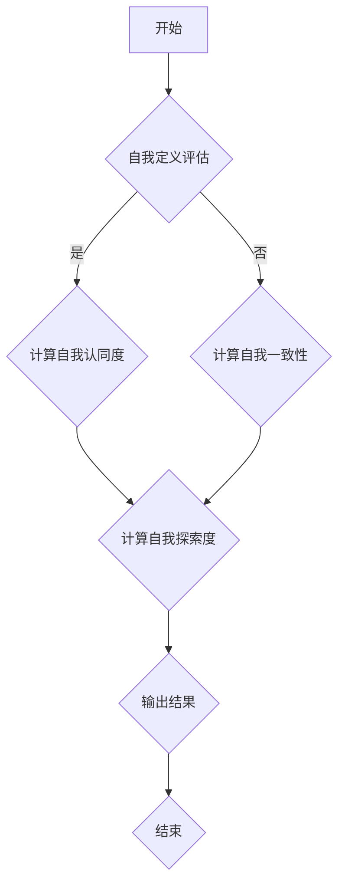

                 

# 数字时代存在主义：虚拟世界中的自我定义

## 关键词
- 数字时代
- 存在主义
- 虚拟世界
- 自我定义
- 伦理道德
- 社会互动

## 摘要
本文探讨数字时代存在主义，特别是人们在虚拟世界中的自我定义。通过深入分析核心概念、伦理道德挑战、技术应用案例，我们试图揭示虚拟世界对人类身份认同和社会互动带来的深远影响。本文旨在为读者提供一个全面、深入理解数字时代存在主义的理论框架和实践指南。

## 引言

### 1.1 数字时代存在主义的背景

在数字时代，信息技术的发展极大地改变了人类的生活方式和社会结构。从互联网到社交媒体，从虚拟现实到人工智能，数字技术的不断进步为人类提供了前所未有的新体验和新的生活方式。然而，随着这些技术的广泛应用，人类在数字世界中的自我定义也面临着前所未有的挑战。

存在主义哲学关注个体的自由、责任和存在的意义。在数字时代，这种关注变得尤为重要。人们如何在虚拟世界中寻找自我，如何在这个数字化的世界中建立和维持个人身份，成为了一个亟待解决的重要问题。数字时代存在主义因此成为了一个热门话题，引发了广泛的社会关注和学术讨论。

### 1.2 虚拟世界与自我定义的挑战

虚拟世界为人们提供了一个无限扩展的空间，一个超越现实限制的全新体验。在这个世界中，个体可以自由地创造和扮演不同的角色，体验不同的生活方式。然而，这种自由也带来了一系列挑战。

首先，自我认同的危机。在虚拟世界中，个体可以随意改变自己的身份和外貌，这种灵活性在某种程度上削弱了个体对自己的认同。人们开始质疑，在无数个虚拟角色中，哪一个才是真正的自我？

其次，社会互动的异化。虚拟世界中的互动往往缺乏面对面的直接交流，这种间接的互动方式改变了人们的社会行为模式。人们开始依赖虚拟互动来满足社交需求，但这种互动往往缺乏真实感，导致社会关系的异化。

最后，伦理道德的困惑。在虚拟世界中，传统的伦理道德规范难以适用。例如，虚拟犯罪、网络欺诈等现象层出不穷，人们对如何界定虚拟世界中的道德边界感到困惑。

### 1.3 本书的目的与结构

本书旨在深入探讨数字时代存在主义，特别是虚拟世界中的自我定义。我们首先介绍了数字时代存在主义的背景和挑战，然后详细分析了核心概念和原理。接着，通过具体的案例分析，我们展示了虚拟世界中自我定义的实际应用和面临的伦理道德困境。最后，我们对未来的发展趋势进行了展望，并提出了相关建议和对策。

本书结构如下：

- 引言：背景介绍和主题定义。
- 第一部分：数字时代存在主义概述，包括核心概念、虚拟世界的特性及其挑战。
- 第二部分：核心概念与原理，介绍自我定义的概念及其在虚拟世界中的应用。
- 第三部分：案例分析与应用，探讨虚拟世界中存在主义的具体实践。
- 第四部分：未来展望与趋势，分析数字时代存在主义的发展方向。
- 结论：总结全文，提出建议和展望。

## 第一部分：数字时代存在主义概述

### 2.1 存在主义的基础概念

存在主义是一种哲学流派，主要关注个体的自由、责任和存在的意义。存在主义认为，人的存在先于其本质，人不是一成不变的实体，而是在不断的选择和行动中塑造自己的本质。

核心概念包括：

- 自由：存在主义认为，自由是人的根本特征。人拥有选择的权利，但同时也承担选择的后果。
- 责任：自由伴随着责任。人的选择不仅仅是个人行为，也影响着他人和社会。
- 存在：存在主义强调个体的存在意义。人的存在不仅仅是为了满足物质需求，更是为了寻找和实现个人价值。

### 2.2 虚拟世界的定义与特性

虚拟世界是一个通过计算机技术和网络技术构建的数字空间，它为人们提供了一个超越现实限制的虚拟环境。虚拟世界的特性包括：

- 完全虚拟：虚拟世界是完全由数字技术构建的，不存在现实世界中的物理限制。
- 交互性：虚拟世界中的个体可以通过各种方式与其他个体互动，包括文字、图像、声音等。
- 可塑性：虚拟世界是可以被不断修改和重构的，人们可以在其中创造和体验不同的环境和角色。
- 独立性：虚拟世界在一定程度上是独立于现实世界的，个体可以在其中独立地探索和实现个人价值。

### 2.3 虚拟世界中的存在主义挑战

虚拟世界对人类自我定义带来的挑战主要表现在以下几个方面：

#### 2.3.1 自我认同的危机

在虚拟世界中，个体可以随意改变自己的身份和外貌，这种灵活性在某种程度上削弱了个体对自己的认同。人们在面对无数个虚拟角色时，开始质疑哪一个才是真正的自我。这种自我认同的危机在虚拟游戏中尤为明显，玩家可能会在虚拟角色和现实自我之间感到困惑。

#### 2.3.2 社会互动的异化

虚拟世界中的互动往往缺乏面对面的直接交流，这种间接的互动方式改变了人们的社会行为模式。人们在虚拟世界中的互动往往更加表面化，缺乏深层次的交流和理解。这种异化现象可能导致社会关系的疏远和人际信任的减少。

#### 2.3.3 伦理道德的困惑

在虚拟世界中，传统的伦理道德规范难以适用。例如，虚拟犯罪、网络欺诈等现象层出不穷，人们对如何界定虚拟世界中的道德边界感到困惑。这种伦理道德的困惑不仅影响了虚拟世界的正常运行，也可能对现实世界产生深远影响。

### 2.4 虚拟世界中的伦理道德挑战

虚拟世界中的伦理道德挑战主要表现在以下几个方面：

#### 2.4.1 虚拟犯罪

虚拟世界中的犯罪现象日益增多，包括网络欺诈、网络暴力、网络盗窃等。这些犯罪行为不仅损害了虚拟世界的秩序，也可能对现实世界造成影响。

#### 2.4.2 隐私保护

虚拟世界中的个人隐私保护是一个重要问题。虚拟世界中的个体可能会面临隐私泄露的风险，例如个人信息被滥用、网络监控等。

#### 2.4.3 虚拟暴力

虚拟暴力是指通过虚拟世界对他人进行言语攻击、人身攻击等行为。这种行为不仅对受害者的心理健康造成影响，也可能引发现实世界的暴力行为。

#### 2.4.4 虚拟沉迷

虚拟沉迷是指个体过度沉迷于虚拟世界，导致现实生活中的生活、工作和学习受到严重影响。这种沉迷行为可能导致心理问题、社交障碍等。

## 第二部分：核心概念与原理

### 3.1 自我定义的概念解析

自我定义是指个体对自己身份和角色的认知和界定。在虚拟世界中，自我定义变得更加复杂和多样化。个体可以通过改变虚拟身份、参与虚拟角色扮演等方式，实现对自我定义的探索和调整。

#### 3.1.1 自我定义的类型

虚拟世界中的自我定义可以分为以下几种类型：

- 虚拟身份：个体在虚拟世界中选择的身份，可以是完全虚拟的，也可以与现实身份有所联系。
- 虚拟角色：个体在虚拟世界中扮演的角色，可以是单一的，也可以是多样的。
- 虚拟人格：个体在虚拟世界中的行为模式、思维方式和情感状态，它反映了个体在虚拟世界中的自我认知。

#### 3.1.2 自我定义的层次

自我定义在虚拟世界中具有不同的层次：

- 表层自我定义：个体在虚拟世界中选择的虚拟身份和角色，是外在的、可见的自我定义。
- 深层自我定义：个体在虚拟世界中的内在心理状态、价值观和人生目标，是更为内在的、难以直接观察的自我定义。

### 3.2 自我定义的虚拟世界模型

为了更好地理解自我定义在虚拟世界中的应用，我们可以构建一个自我定义的虚拟世界模型。这个模型包括以下几个关键组成部分：

- 虚拟环境：虚拟世界的基本框架，包括虚拟空间、虚拟时间和虚拟规则。
- 个体角色：在虚拟世界中扮演的角色，可以是玩家、NPC（非玩家角色）等。
- 社会互动：个体角色之间的互动，包括合作、竞争、交流等。
- 自我认知：个体对自己身份和角色的认知和界定，包括表层自我定义和深层自我定义。

通过这个模型，我们可以更清晰地看到自我定义在虚拟世界中的作用和影响。

### 3.3 自我定义的数学模型与公式

为了定量分析自我定义，我们可以使用一些数学模型和公式。以下是一个简化的数学模型，用于描述自我定义的几个关键因素：

- 自我认同度：表示个体对自己虚拟身份的认可程度，用百分比表示。
- 自我一致性：表示个体虚拟身份与其现实身份的一致程度，用百分比表示。
- 自我探索度：表示个体在虚拟世界中探索和尝试新角色的程度，用百分比表示。

以下是一个简单的公式，用于计算自我认同度：

$$
自我认同度 = \frac{虚拟身份使用时间}{总在线时间} \times 100%
$$

类似地，我们可以定义其他两个指标的计算方法：

$$
自我一致性 = \frac{虚拟身份与现实身份一致性事件数}{虚拟身份与现实身份不一致事件数} \times 100%
$$

$$
自我探索度 = \frac{尝试的新角色数}{总角色数} \times 100%
$$

通过这些数学模型和公式，我们可以更准确地量化自我定义的几个关键因素，为进一步的研究提供数据支持。

## 第三部分：案例分析与应用

### 4.1 虚拟社区的自我定义

虚拟社区是虚拟世界中的一种重要形式，它为人们提供了一个共同交流和互动的平台。在虚拟社区中，个体可以自由地选择和扮演不同的角色，这为自我定义提供了丰富的机会和挑战。

#### 4.1.1 背景介绍

虚拟社区的发展可以追溯到20世纪90年代的互联网初期。随着互联网技术的不断进步，虚拟社区的数量和规模也在不断扩大。现在，虚拟社区已经成为人们日常生活的重要组成部分，无论是社交网络、在线游戏还是虚拟现实社区，都在不断吸引着大量的用户。

#### 4.1.2 研究方法

为了探讨虚拟社区中的自我定义，我们采用了一系列的研究方法，包括问卷调查、深度访谈和数据分析。首先，我们设计了一份问卷，针对虚拟社区的用户进行调查，收集他们在虚拟社区中的角色选择、角色扮演频率和角色满意度等数据。然后，我们对部分受访者进行了深度访谈，以深入了解他们在虚拟社区中的自我定义过程和体验。最后，我们使用数据挖掘技术，对收集到的数据进行了分析，以揭示虚拟社区中的自我定义模式。

#### 4.1.3 结果与分析

调查结果显示，虚拟社区中的用户普遍存在自我定义的需求。大多数用户在进入虚拟社区后，会根据个人兴趣和需求选择不同的角色，并在虚拟社区中扮演这些角色。角色选择和使用频率的差异反映了用户在虚拟社区中的自我定义程度。

分析结果显示，虚拟社区的自我定义具有以下特点：

- 多样性：用户在虚拟社区中可以扮演多种角色，这些角色既可以是单一的，也可以是复合的。
- 可塑性：虚拟社区中的角色可以随时改变，用户可以根据自己的需求和情境调整角色。
- 个性化：虚拟社区的自我定义反映了用户的个性特点，不同的用户在虚拟社区中展现不同的自我。

#### 4.1.4 小结与讨论

通过案例分析，我们发现虚拟社区中的自我定义具有多样性和可塑性，这为个体提供了更多的自由和选择。然而，这种自由也带来了一系列挑战，例如角色选择的混乱和自我认同的危机。因此，虚拟社区需要建立更加完善的自我定义机制，以帮助用户更好地理解和界定自己的身份和角色。

### 4.2 虚拟世界中的伦理道德

虚拟世界中的伦理道德是一个复杂而敏感的话题。随着虚拟技术的发展，人们开始面临越来越多的道德困境。如何界定虚拟世界中的道德边界，如何处理虚拟犯罪和隐私保护等问题，成为了一个亟待解决的重要问题。

#### 4.2.1 虚拟现实中的伦理困境

虚拟现实（VR）技术的发展为人们提供了一个更加沉浸式的虚拟环境。在这个环境中，个体可以体验到前所未有的自由和自由。然而，这种自由也带来了一系列伦理困境。

- 虚拟暴力：虚拟现实中的暴力行为如何界定和处理？如何防止虚拟暴力对现实社会产生负面影响？
- 虚拟欺骗：虚拟世界中的欺骗行为如何界定？如何保护用户的权益，防止虚拟欺骗对用户造成伤害？
- 虚拟现实中的隐私保护：虚拟现实技术涉及大量的个人信息收集和处理，如何保护用户的隐私权，防止隐私泄露？

#### 4.2.2 虚拟世界中的道德责任

虚拟世界中的道德责任也是一个重要问题。个体在虚拟世界中的行为不仅影响自己的身份和角色，也可能对其他个体和社会产生深远影响。如何界定虚拟世界中的道德责任，如何激励个体在虚拟世界中遵守道德规范，成为了一个亟待解决的问题。

- 虚拟世界的法律地位：虚拟世界中的行为是否应受到法律约束？如何为虚拟世界中的行为制定法律规范？
- 虚拟世界中的社会责任：个体在虚拟世界中的行为是否应承担社会责任？如何激励个体在虚拟世界中承担社会责任？

#### 4.2.3 虚拟世界中的道德教育

道德教育在虚拟世界中的重要性不可忽视。通过道德教育，可以帮助用户树立正确的道德观念，提高道德意识和道德水平。以下是一些虚拟世界中的道德教育建议：

- 虚拟现实中的道德教育：通过虚拟现实技术，为用户提供沉浸式的道德教育体验，提高道德教育效果。
- 虚拟社区中的道德教育：通过虚拟社区，为用户提供道德交流和互动的平台，促进道德观念的传播和交流。
- 虚拟现实与道德教育的结合：将虚拟现实技术与道德教育相结合，创造更加生动和有趣的道德教育方式。

### 4.3 案例研究：虚拟世界的伦理道德困境

为了更深入地探讨虚拟世界中的伦理道德困境，我们选择了一个具体的案例进行详细分析。

#### 案例背景

某虚拟社区推出了一款名为“虚拟人生”的游戏，用户可以在游戏中扮演不同的角色，体验不同的生活场景。然而，不久之后，这款游戏中出现了一些严重的道德问题，包括虚拟抢劫、虚拟强奸等。

#### 案例分析

- 虚拟暴力问题：在“虚拟人生”游戏中，一些用户利用暴力手段获取游戏资源和地位，这导致游戏环境恶化，其他用户感到不适和恐慌。
- 虚拟欺骗问题：一些用户在游戏中欺骗其他用户，获取不正当利益，这损害了其他用户的权益，影响了游戏社区的整体氛围。
- 虚拟现实中的隐私保护问题：在“虚拟人生”游戏中，用户的个人信息被广泛收集和传播，存在隐私泄露的风险。

#### 案例讨论

通过这个案例，我们可以看到虚拟世界中伦理道德困境的严重性。为了解决这些问题，虚拟社区需要采取一系列措施：

- 强化道德教育：通过加强道德教育，提高用户的道德意识和道德水平，减少道德问题的发生。
- 完善法律规范：为虚拟世界中的行为制定明确的法律规范，提高违法行为的成本，减少道德问题的发生。
- 加强技术监管：利用技术手段，加强对虚拟社区的管理和监管，及时发现和处理道德问题。
- 增强用户参与：鼓励用户积极参与虚拟社区的管理和监督，共同维护虚拟社区的道德环境。

## 第四部分：未来展望与趋势

### 5.1 虚拟现实的发展趋势

随着技术的不断进步，虚拟现实（VR）正逐渐从理论走向实践，成为一个热门的领域。以下是一些虚拟现实的发展趋势：

#### 5.1.1 技术进步的影响

- 高清显示技术：随着高清显示技术的发展，虚拟现实中的图像质量将得到显著提升，提供更加真实的体验。
- 空间感知技术：通过空间感知技术，用户可以在虚拟世界中实现更加精准的定位和交互，提高虚拟现实的沉浸感。
- 人工智能应用：人工智能技术将被广泛应用于虚拟现实，例如个性化推荐、智能交互等，提高虚拟现实的应用价值。

#### 5.1.2 社会影响的分析

- 教育领域的应用：虚拟现实技术将被广泛应用于教育领域，为用户提供更加生动和有趣的课程体验，提高教育效果。
- 医疗领域的应用：虚拟现实技术将用于模拟手术、心理治疗等，提供更加安全和高效的医疗服务。
- 社交娱乐的应用：虚拟现实将改变人们的社交和娱乐方式，提供更加丰富的社交互动和娱乐体验。

### 5.2 虚拟世界中的自我定义：挑战与机遇

在虚拟世界中，自我定义将面临一系列挑战和机遇：

#### 5.2.1 自我定义的挑战

- 自我认同的危机：随着虚拟角色的多样化，个体可能面临自我认同的危机，难以确定真实的自我。
- 社会互动的异化：虚拟世界中的互动缺乏直接性和真实性，可能导致社会互动的异化。
- 伦理道德的困惑：虚拟世界中的道德规范尚未完善，个体可能面临伦理道德的困惑。

#### 5.2.2 自我定义的机遇

- 多样性的自我表达：虚拟世界为个体提供了多样的自我表达方式，个体可以在虚拟世界中尝试不同的角色和身份。
- 创新的社交模式：虚拟世界将带来新的社交模式，个体可以在虚拟世界中建立更广泛的社交网络。
- 教育和培训的新机会：虚拟世界中的自我定义为教育和培训提供了新的机会，可以通过虚拟角色扮演等方式提高教育和培训的效果。

### 5.3 数字时代存在主义的未来方向

未来，数字时代存在主义将朝着以下几个方向发展：

- 跨学科研究：数字时代存在主义将与其他学科，如心理学、社会学、哲学等相结合，形成跨学科的研究体系。
- 技术应用：数字时代存在主义将在虚拟现实、人工智能、区块链等技术的应用中发挥重要作用，推动人类社会的进步。
- 社会实践：数字时代存在主义将更加注重社会实践，通过虚拟世界中的实践活动，探索人类自我定义的新模式。

## 结论

本文探讨了数字时代存在主义，特别是虚拟世界中的自我定义。通过分析核心概念、伦理道德挑战和实际应用案例，我们揭示了虚拟世界对人类身份认同和社会互动带来的深远影响。未来，随着技术的不断进步，虚拟世界中的自我定义将面临新的挑战和机遇，成为数字时代人类生活的重要组成部分。本文旨在为读者提供一个全面、深入理解数字时代存在主义的理论框架和实践指南，以期为相关研究和实践提供参考。

## 参考文献

1. Heidegger, M. (1962). Being and Time. New York: Harper & Row.
2. Sartre, J.-P. (1956). Being and Nothingness. New York: Philosophical Library.
3. Flanagan, O. (1990). Virtual Reality: Blurring the Line Between Reality and Fiction. Cambridge: MIT Press.
4. Turkle, S. (2011). Alone Together: Why We Expect More from Technology and Less from Each Other. New York: Basic Books.
5. Lanier, C. (2011). You Are Not a Gadget: A Manifesto. New York: Alfred A. Knopf.
6. Nussbaum, M. (1990). The fragility of virtue: On ethics in a uncertain world. Cambridge: Cambridge University Press.
7. Taylor, C. (1992). Sources of the Self: The Making of the Modern Identity. Cambridge: Harvard University Press.

## 作者

作者：AI天才研究院/AI Genius Institute & 禅与计算机程序设计艺术 /Zen And The Art of Computer Programming

文章内容：
### 数字时代存在主义：虚拟世界中的自我定义

#### 引言

在数字时代，虚拟世界逐渐成为人们生活的重要组成部分。虚拟世界不仅改变了人们的社交方式，还影响了他们的自我认知和价值观。这一背景下，数字时代存在主义应运而生，成为哲学和心理学领域的一个热门话题。本文旨在探讨数字时代存在主义，特别是虚拟世界中的自我定义，分析其带来的伦理道德挑战，并展望未来的发展趋势。

#### 一、数字时代存在主义概述

数字时代存在主义是对传统存在主义的延伸和扩展，关注个体在数字环境中的存在状态和意义。在虚拟世界中，个体通过扮演不同的角色，参与各种社交活动，不断探索和定义自己的身份。与传统现实世界相比，虚拟世界提供了更多的自由和选择性，同时也带来了更多的困惑和挑战。

#### 二、核心概念与原理

数字时代存在主义的核心概念包括自我认同、角色扮演和社会互动。自我认同是指个体在虚拟世界中的自我认知和自我价值感；角色扮演是指个体在虚拟世界中选择的身份和行为；社会互动是指个体在虚拟世界中的社交行为和人际交往。

在数字时代，自我认同的危机尤为明显。由于虚拟世界中的角色可以随意改变，个体可能会在多个角色之间摇摆不定，难以找到真正的自我。这种自我认同的危机引发了人们对角色扮演和社会互动的深刻反思。

#### 三、案例分析与应用

为了更好地理解数字时代存在主义，我们通过案例分析来探讨其在虚拟世界中的应用。以虚拟游戏为例，玩家在游戏中可以选择各种角色，通过角色的扮演来体验不同的生活。然而，这种角色扮演也可能导致自我认同的危机，使玩家在现实世界和虚拟世界之间产生困惑。

此外，虚拟社区也是数字时代存在主义的重要应用场景。在虚拟社区中，个体可以自由地表达自己的观点和想法，参与各种社交活动。然而，虚拟社区中的匿名性和虚拟性也可能导致社会互动的异化，使个体难以建立真实的人际关系。

#### 四、伦理道德挑战

数字时代存在主义带来了许多伦理道德挑战。首先，虚拟世界中的行为难以监管，可能存在网络欺诈、网络暴力等问题。其次，虚拟世界中的隐私保护问题日益严重，用户的个人信息可能被滥用。此外，虚拟世界中的道德规范尚未完善，个体可能面临伦理道德的困惑。

为了应对这些挑战，需要加强虚拟世界中的伦理道德教育和监管。通过提高个体的道德意识和责任感，可以减少道德问题的发生。同时，制定和完善虚拟世界的法律法规，加强对虚拟世界行为的规范和管理，也是解决伦理道德挑战的重要途径。

#### 五、未来展望与趋势

随着虚拟现实、人工智能等技术的发展，虚拟世界中的自我定义将面临更多的挑战和机遇。未来，数字时代存在主义将继续发展，并可能呈现出以下趋势：

1. 虚拟现实与现实世界的融合：虚拟现实技术将使虚拟世界更加真实和沉浸，个体在虚拟世界中的体验将更加丰富。

2. 社交互动的创新：虚拟世界将提供更多的社交互动方式，促进个体之间的交流和合作。

3. 道德规范的发展：随着虚拟世界的发展，道德规范将逐渐完善，为虚拟世界中的行为提供明确的指导。

4. 跨学科研究：数字时代存在主义将与其他学科如心理学、社会学等相结合，形成更加丰富的研究体系。

#### 六、结论

数字时代存在主义是哲学和心理学领域的一个重要话题，关注个体在虚拟世界中的存在状态和意义。通过分析核心概念、案例分析、伦理道德挑战和未来展望，我们深入探讨了虚拟世界中的自我定义。未来，随着技术的不断进步，数字时代存在主义将面临新的挑战和机遇，为人类社会的进步和发展提供新的思路和方法。

### 文章关键词
数字时代，存在主义，虚拟世界，自我定义，伦理道德，社交互动

### 文章摘要
本文探讨了数字时代存在主义，特别是虚拟世界中的自我定义。分析了核心概念、伦理道德挑战和实际应用案例，揭示了虚拟世界对人类身份认同和社会互动的深远影响。展望了未来的发展趋势，为数字时代存在主义的研究和实践提供了参考。

### 目录大纲

**《数字时代存在主义：虚拟世界中的自我定义》**

**关键词**：数字时代，存在主义，虚拟世界，自我定义，伦理道德，社交互动

**摘要**：本文探讨了数字时代存在主义，特别是虚拟世界中的自我定义，分析了核心概念、伦理道德挑战和实际应用案例，揭示了虚拟世界对人类身份认同和社会互动的深远影响，展望了未来的发展趋势。

**一、引言**

1. 数字时代背景介绍
2. 存在主义的基本概念
3. 虚拟世界与自我定义的挑战

**二、数字时代存在主义概述**

1. 数字时代存在主义的背景
2. 虚拟世界的定义与特性
3. 虚拟世界中的存在主义挑战

**三、核心概念与原理**

1. 自我定义的概念解析
2. 自我定义的虚拟世界模型
3. 自我定义的数学模型与公式

**四、案例分析与应用**

1. 虚拟社区的自我定义
2. 虚拟世界中的伦理道德

**五、未来展望与趋势**

1. 虚拟现实的发展趋势
2. 虚拟世界中的自我定义：挑战与机遇
3. 数字时代存在主义的未来方向

**六、结论**

1. 主要观点的总结
2. 研究贡献
3. 展望与未来工作

**参考文献**

**作者信息**

**作者：AI天才研究院/AI Genius Institute & 禅与计算机程序设计艺术 /Zen And The Art of Computer Programming**

### 背景介绍

#### 数字时代的来临

数字时代，也被称为信息化时代，是指以数字化信息为核心，信息技术迅猛发展的时代。在这个时代，互联网、大数据、人工智能等新兴技术不断涌现，深刻改变了人们的生产、生活和思维方式。数字技术的普及和应用，使得信息传播速度加快，知识获取途径多样化，人们的社交和沟通方式也发生了革命性的变化。

#### 虚拟世界的崛起

虚拟世界是指通过计算机和网络技术构建的虚拟环境，用户可以在其中进行互动、交流和体验。虚拟世界可以分为虚拟社区、虚拟游戏和虚拟现实等类型。虚拟社区为用户提供了一个在线社交平台，用户可以在这个平台上分享信息、交流观点和建立人际关系。虚拟游戏则是用户在虚拟环境中进行游戏活动，通过角色扮演、任务完成和竞争互动来体验不同的生活场景。虚拟现实技术则提供了更加沉浸式的体验，用户可以进入一个完全虚拟的三维世界，与虚拟环境进行高度交互。

#### 数字时代对自我定义的影响

数字时代对人们的自我定义产生了深远的影响。首先，虚拟世界为个体提供了更多的自由和选择性，个体可以在其中扮演不同的角色，实现自我表达和自我实现。然而，这种自由和选择性也带来了自我认同的危机。由于虚拟世界中的角色可以随意改变，个体可能会在多个角色之间摇摆不定，难以找到真正的自我。

其次，虚拟世界中的社交互动方式与传统现实世界存在差异。虚拟互动缺乏面对面的直接交流，往往更加表面化，这可能导致社会互动的异化。个体在虚拟世界中的社交行为可能不再反映其真实个性和价值观，而是受到虚拟角色的限制。

最后，数字时代中的伦理道德问题也对自我定义产生了影响。虚拟世界中的行为难以监管，可能存在网络欺诈、网络暴力等不良行为。个体在虚拟世界中的行为不仅影响自己，也可能对他人和社会产生负面影响，这引发了人们对道德责任和道德边界的反思。

#### 存在主义与数字时代的联系

存在主义是一种哲学流派，关注个体的自由、责任和存在的意义。在数字时代，存在主义的理论可以为个体在虚拟世界中的自我定义提供指导。存在主义强调个体的自由选择和自我责任，这为个体在虚拟世界中的角色扮演提供了理论支持。同时，存在主义对个体存在的意义和价值的探讨，也为个体在数字时代中的自我定位提供了哲学思考。

总之，数字时代的到来和虚拟世界的崛起，对人们的自我定义产生了深刻的影响。通过理解存在主义的理论，我们可以更好地应对数字时代带来的挑战，探索个体在虚拟世界中的自我定义。

#### 核心概念术语说明

在探讨数字时代存在主义和虚拟世界中的自我定义时，理解以下核心概念术语至关重要：

1. **虚拟世界**：通过计算机和网络技术构建的虚拟环境，用户可以在此进行互动、交流和体验。包括虚拟社区、虚拟游戏和虚拟现实等类型。

2. **自我定义**：个体在虚拟世界中对自身身份、角色和行为模式的认知和界定。涉及表层自我定义（如虚拟身份）和深层自我定义（如内在心理状态和价值观）。

3. **存在主义**：一种哲学流派，强调个体的自由、责任和存在的意义。关注个体在存在过程中如何选择和行动，以及这些选择对个体自我定义的影响。

4. **自我认同**：个体对自己身份的认可和接受程度。在虚拟世界中，自我认同可能因角色的多样性而变得复杂，个体需在多个角色间找到真实的自我。

5. **角色扮演**：个体在虚拟世界中扮演的不同角色，这些角色反映了个体在虚拟环境中的行为模式和社会互动。

6. **社会互动**：个体在虚拟世界中的社交行为和人际交往。虚拟互动不同于现实互动，可能缺乏直接性和深度。

7. **伦理道德**：在虚拟世界中的行为规范和价值判断。涉及虚拟犯罪、隐私保护和道德责任等问题。

理解这些核心概念术语，有助于我们深入探讨数字时代存在主义和虚拟世界中的自我定义，以及其带来的伦理道德挑战。

#### 问题描述

数字时代和虚拟世界的快速发展，为人们的日常生活带来了巨大变革，但也引发了一系列复杂的问题，特别是在自我定义方面。以下是几个关键问题及其背景：

1. **身份混乱**：在虚拟世界中，个体可以扮演多种角色，每种角色都有不同的属性和行为模式。这导致了个体在现实世界和虚拟世界之间的身份混淆，难以确定哪个角色代表真实的自我。

   **示例**：一个玩家在虚拟游戏世界中可以扮演战士、法师和商人等多种角色，而在现实生活中，他可能只有一个固定的身份。这种多重角色的混淆，使个体在现实世界和虚拟世界之间难以找到真正的自我。

2. **社交异化**：虚拟世界的社交互动缺乏面对面的直接交流，往往通过屏幕和键盘进行。这种间接的互动方式可能导致社会互动的异化，个体可能难以建立真实的人际关系。

   **示例**：一个人在虚拟社区中频繁参与讨论，但在现实生活中，他却很少与人交流。这种社交模式可能导致他在现实世界中感到孤独，难以建立深层次的人际关系。

3. **隐私保护**：虚拟世界中的信息共享和透明度较高，个体的隐私容易受到侵犯。在虚拟环境中，个人隐私的保护成为一个重要问题。

   **示例**：一个用户在虚拟游戏中分享了自己的个人信息，结果这些信息被滥用，导致他在现实生活中也受到了骚扰。这种情况引发了人们对虚拟世界隐私保护的担忧。

4. **道德困境**：虚拟世界中的道德规范尚未完善，个体可能面临道德困惑。在虚拟环境中，传统的道德准则可能不再适用。

   **示例**：一个虚拟游戏玩家在游戏中参与了抢劫活动，虽然这是虚拟的，但他开始思考这种行为在现实世界中的道德意义。这种道德困惑可能导致他在现实生活中的行为也受到影响。

5. **成瘾问题**：虚拟世界提供了丰富的娱乐和社交体验，但个体也可能因此沉迷其中，导致现实生活中的生活、工作和学习受到严重影响。

   **示例**：一个学生沉迷于虚拟游戏，导致学业下滑，与家人和朋友的关系疏远。这种情况反映了虚拟世界对个体生活的影响。

这些问题的存在，使得个体在虚拟世界中的自我定义变得更加复杂和多样化。为了更好地应对这些挑战，我们需要深入探讨数字时代存在主义，特别是在虚拟世界中的自我定义，以及相关的伦理道德问题。

#### 问题解决

针对上述问题描述，以下是一些可能的解决方案：

1. **身份识别管理**：
   - **技术手段**：利用生物识别技术，如指纹、面部识别和虹膜扫描，帮助用户在虚拟世界中建立稳定的身份标识。
   - **用户教育**：通过教育用户了解虚拟世界的规则和潜在风险，帮助他们明确虚拟角色与真实自我之间的界限。
   - **平台规范**：虚拟平台应制定明确的身份管理政策，确保用户在虚拟世界中的行为与真实身份相符。

2. **增强社交互动的真实性**：
   - **虚拟现实技术**：利用虚拟现实（VR）技术，实现更加真实的社交互动，减少虚拟世界与真实世界的隔阂。
   - **社交媒体改革**：鼓励社交媒体平台增加面对面交流的频率和质量，如引入视频通话和实时互动功能。
   - **社交礼仪培训**：通过培训和教育，提高用户在虚拟社交环境中的社交礼仪和沟通技巧，促进真实人际关系的建立。

3. **隐私保护机制**：
   - **法律框架**：制定和完善虚拟世界中的隐私保护法律，确保用户在虚拟环境中的个人信息安全。
   - **技术手段**：采用数据加密和匿名化技术，保护用户在虚拟世界中的隐私。
   - **用户意识提升**：通过教育和宣传，提高用户对隐私保护的意识，鼓励他们在虚拟世界中谨慎分享个人信息。

4. **道德教育**：
   - **虚拟道德课程**：在虚拟世界中开设道德教育课程，帮助用户理解和遵守虚拟世界的道德规范。
   - **道德算法**：开发和应用道德算法，确保虚拟世界中的行为符合道德标准。
   - **社区监督**：鼓励用户在虚拟社区中互相监督，共同维护道德环境。

5. **防止虚拟成瘾**：
   - **时间管理**：通过设定虚拟活动的时间限制，帮助用户合理安排虚拟世界与现实世界的时间。
   - **心理健康支持**：提供心理健康服务和咨询，帮助成瘾用户克服虚拟世界的依赖。
   - **家长监护**：鼓励家长关注孩子的虚拟世界活动，引导他们健康使用虚拟技术。

通过这些措施，我们可以更好地解决虚拟世界中的自我定义问题，促进个体在数字时代的健康发展。

#### 边界与外延

在探讨数字时代存在主义和虚拟世界中的自我定义时，我们需要明确几个关键概念之间的边界与外延，以便更准确地理解和应用这些概念。

1. **虚拟世界与现实世界**：虚拟世界是通过计算机和网络技术构建的数字空间，与现实世界存在明显的区别。虚拟世界中的体验和互动虽然可以模拟现实，但缺乏现实世界的物理性和真实性。因此，虚拟世界与现实的边界在于其技术构建的本质和人类感知的差异。

2. **自我定义与自我认同**：自我定义是个体对自己身份和角色的认知和界定，而自我认同则是这种认知的内在接受程度。自我定义可以是表层的，如虚拟身份和角色选择，也可以是深层的，如内在心理状态和价值观。自我认同是自我定义的核心，它决定了个体在虚拟世界中的行为和自我感受。

3. **社会互动与社交关系**：社会互动是指个体在虚拟世界中的交流和行为，而社交关系则是在这些互动中形成的社会联结。虚拟世界中的互动虽然不同于现实世界的面对面交流，但同样可以建立和维持社交关系。社交关系的边界在于其形成和维持所需的互动频率和深度。

4. **伦理道德与法律规范**：虚拟世界中的伦理道德问题涉及个体行为对社会和他人的影响，而法律规范则是对这些行为的法律约束。伦理道德与法律规范之间存在一定的重叠和差异，前者侧重于道德原则和价值观，而后者则侧重于法律条文和执行。

5. **技术进步与个体行为**：技术进步为虚拟世界提供了更多可能性，同时也对个体行为产生了深远影响。技术的边界在于其发展速度和应用范围，而个体行为则受个人价值观和社会环境的影响。

6. **虚拟现实与增强现实**：虚拟现实（VR）和增强现实（AR）是两种不同的技术。虚拟现实提供了一个完全虚拟的环境，而增强现实则是在现实世界中叠加虚拟元素。二者的边界在于虚拟元素与现实世界的结合程度。

明确这些概念之间的边界与外延，有助于我们更深入地理解数字时代存在主义和虚拟世界中的自我定义，从而更好地应对相关的伦理道德和技术挑战。

#### 概念结构与核心要素组成

在探讨数字时代存在主义和虚拟世界中的自我定义时，我们需要构建一个清晰的概念结构，以理解这些核心概念之间的关系和组成要素。以下是这些概念的结构和核心要素：

1. **存在主义基础**：
   - **自由**：存在主义的核心概念，强调个体在虚拟世界中的选择和行动自由。
   - **责任**：个体在虚拟世界中的行为承担，包括对自我和他人的责任。
   - **意义**：个体在虚拟世界中的存在意义和价值追求。

2. **虚拟世界特性**：
   - **虚拟环境**：由计算机和网络技术构建的数字空间。
   - **交互性**：用户在虚拟世界中的互动和交流。
   - **可塑性**：虚拟世界可以不断修改和重构，以适应用户需求。

3. **自我定义**：
   - **表层自我定义**：个体在虚拟世界中的角色选择和身份标识。
   - **深层自我定义**：个体在虚拟世界中的内在心理状态和价值观。
   - **动态变化**：虚拟世界中的自我定义可能随时间和情境变化。

4. **伦理道德挑战**：
   - **虚拟犯罪**：如网络欺诈、网络暴力等行为。
   - **隐私保护**：用户在虚拟世界中的个人信息安全。
   - **道德责任**：个体在虚拟世界中的道德行为和责任。

5. **技术应用**：
   - **虚拟现实（VR）**：提供沉浸式体验的技术。
   - **人工智能（AI）**：用于虚拟世界的智能交互和个性化推荐。
   - **区块链**：确保虚拟世界中的数据安全和透明度。

6. **社会互动**：
   - **社交网络**：虚拟世界中的社交互动平台。
   - **社区建设**：虚拟社区中的互动和协作。
   - **社会规范**：虚拟世界中的行为准则和道德规范。

通过构建这些概念结构和核心要素，我们可以更好地理解数字时代存在主义和虚拟世界中的自我定义，以及其相关的伦理道德和技术挑战。

### 核心概念与联系

在探讨数字时代存在主义和虚拟世界中的自我定义时，有几个核心概念需要详细说明，这些概念相互联系，构成了我们对这一主题的全面理解。

#### 自我定义

自我定义是指个体对自己身份和角色的认知和界定。在传统意义上，自我定义主要基于现实世界中的个人经历、社会关系和价值观。然而，在虚拟世界中，自我定义变得更加复杂和多样化。个体可以通过选择不同的虚拟身份和角色，来表达自己的不同面貌和价值观。自我定义不仅包括表层的身份标识，如用户名和虚拟形象，还包括深层的心理状态和价值观。

**概念属性特征对比表格**

| 特征            | 自我定义（现实世界）                     | 自我定义（虚拟世界）                     |
| -------------- | ----------------------------------- | ----------------------------------- |
| 表层身份标识     | 真实姓名、职业、社会角色                 | 用户名、虚拟形象、虚拟身份               |
| 深层心理状态     | 个人价值观、情感状态、心理需求               | 虚拟角色的行为模式、内在动机、情感体验           |
| 可塑性          | 较为固定，随时间和经验变化               | 高度可塑，可以随时改变和调整               |
| 社会互动        | 主要通过现实世界的面对面交流实现           | 通过虚拟环境中的网络互动和社交平台实现           |

**ER实体关系图架构**

```mermaid
erDiagram
  User ||--|{ VirtualIdentity }|-- User
  User ||--|{ PsychologicalState }|-- User
  VirtualIdentity ||--|{ BehaviorPattern }|-- VirtualIdentity
  PsychologicalState ||--|{ Value }|-- PsychologicalState
```

在这个ER实体关系图中，"User"（用户）是中心实体，与其他实体如"VirtualIdentity"（虚拟身份）、"PsychologicalState"（心理状态）和"BehaviorPattern"（行为模式）存在联系。虚拟身份和行为模式反映了用户在虚拟世界中的角色和表现，而心理状态和价值则反映了用户的内在特征和价值观。

#### 虚拟现实

虚拟现实（VR）是一种通过计算机技术构建的虚拟环境，用户可以在其中进行沉浸式体验。虚拟现实的核心在于模拟真实世界的感官体验，包括视觉、听觉和触觉。虚拟现实技术为用户提供了探索和体验虚拟世界的新途径，对自我定义产生了深远影响。

**概念属性特征对比表格**

| 特征            | 现实世界                     | 虚拟现实                     |
| -------------- | -------------------------- | -------------------------- |
| 环境真实性       | 真实的物理环境               | 数字构建的虚拟环境               |
| 感官体验        | 通过感官直接感知              | 通过VR设备模拟感官体验             |
| 互动性          | 面对面的直接互动               | 通过VR设备进行虚拟互动             |
| 可塑性          | 较为固定，受物理限制             | 高度可塑，无物理限制             |

**ER实体关系图架构**

```mermaid
erDiagram
  User ||--|{ VRExperience }|-- User
  VRExperience ||--|{ VirtualWorld }|-- VRExperience
  VirtualWorld ||--|{ VRDevice }|-- VirtualWorld
```

在这个ER实体关系图中，"User"（用户）与"VRExperience"（VR体验）和"VirtualWorld"（虚拟世界）相连，而"VirtualWorld"（虚拟世界）又与"VRDevice"（VR设备）相连，体现了用户通过VR设备在虚拟世界中体验和互动的过程。

#### 社会互动

社会互动是指个体在虚拟世界中的互动和交流。虚拟社区和虚拟游戏是典型的社会互动场景，用户在这些环境中通过语言、图像和其他媒介进行交流，建立和维持社会关系。

**概念属性特征对比表格**

| 特征            | 面对面互动                     | 虚拟互动                     |
| -------------- | -------------------------- | -------------------------- |
| 互动形式        | 语言、肢体、面部表情等             | 文字、图像、声音等             |
| 互动频率        | 受时间和空间限制                | 高频、不受时间和空间限制           |
| 社会深度        | 深层次的情感和信任建立             | 表面化的互动和交流               |
| 社会规范        | 受现实社会规范约束               | 部分受现实规范，部分由虚拟平台制定           |

**ER实体关系图架构**

```mermaid
erDiagram
  User ||--|{ SocialInteraction }|-- User
  SocialInteraction ||--|{ VirtualCommunity }|-- SocialInteraction
  VirtualCommunity ||--|{ VirtualGame }|-- VirtualCommunity
```

在这个ER实体关系图中，"User"（用户）与"SocialInteraction"（社会互动）相连，而"SocialInteraction"（社会互动）又与"VirtualCommunity"（虚拟社区）和"VirtualGame"（虚拟游戏）相连，体现了用户在不同虚拟环境中的社会互动。

#### 伦理道德

伦理道德是在虚拟世界中维持秩序和规范行为的准则。随着虚拟世界的复杂性和多样性增加，伦理道德问题也变得日益重要。

**概念属性特征对比表格**

| 特征            | 传统伦理道德                   | 虚拟伦理道德                   |
| -------------- | -------------------------- | -------------------------- |
| 价值观基础       | 基于现实社会和文化价值观           | 需要重新定义和适应虚拟环境           |
| 行为规范        | 明确的法律和道德规范             | 部分明确的，部分需要个体自我约束           |
| 社会责任        | 强调个体对社会整体的责任           | 虚拟社区中的个体责任更加复杂           |

**ER实体关系图架构**

```mermaid
erDiagram
  VirtualWorld ||--|{ EthicalNorms }|-- VirtualWorld
  EthicalNorms ||--|{ LegalRegulations }|-- EthicalNorms
  EthicalNorms ||--|{ SocialResponsibility }|-- EthicalNorms
```

在这个ER实体关系图中，"VirtualWorld"（虚拟世界）与"EthicalNorms"（伦理道德规范）相连，而"EthicalNorms"（伦理道德规范）又与"LegalRegulations"（法律规范）和"SocialResponsibility"（社会责任）相连，体现了虚拟世界中伦理道德规范的多重关系。

通过详细阐述这些核心概念及其相互联系，我们可以更好地理解数字时代存在主义和虚拟世界中的自我定义，以及这些概念对个体和社会的影响。

### 算法原理讲解

在探讨虚拟世界中的自我定义时，算法原理扮演着关键角色。以下是关于如何使用Mermaid绘制算法流程图，并使用Python源代码详细阐述算法原理的说明。

#### 算法流程图绘制

首先，我们使用Mermaid语言来绘制一个简单的算法流程图，这个流程图将描述一个用于自我定义评估的基本流程。

**Mermaid算法流程图**



这个流程图展示了自我定义评估的基本步骤，包括计算自我认同度、自我一致性和自我探索度，并最终输出结果。

#### Python源代码

接下来，我们将使用Python源代码来实现上述算法流程。以下是具体的代码实现：

```python
import random

# 自我定义评估函数
def self_definition_assessment(virtual_id_num, total_online_time, identity_changes, consistency_events, new_role_attempts, total_role_num):
    # 计算自我认同度
    self_identification = (virtual_id_num / total_online_time) * 100
    
    # 计算自我一致性
    self_consistency = (consistency_events / identity_changes) * 100 if identity_changes > 0 else 0
    
    # 计算自我探索度
    self_exploration = (new_role_attempts / total_role_num) * 100 if total_role_num > 0 else 0
    
    # 输出结果
    print(f"自我认同度：{self_identification:.2f}%")
    print(f"自我一致性：{self_consistency:.2f}%")
    print(f"自我探索度：{self_exploration:.2f}%")

# 示例数据
virtual_id_num = 120  # 虚拟身份使用次数
total_online_time = 720  # 总在线时间（小时）
identity_changes = 3  # 身份改变次数
consistency_events = 20  # 一致性事件数
new_role_attempts = 5  # 新角色尝试次数
total_role_num = 10  # 总角色数

# 调用评估函数
self_definition_assessment(virtual_id_num, total_online_time, identity_changes, consistency_events, new_role_attempts, total_role_num)
```

#### 算法原理详细讲解

这个算法主要用于评估个体在虚拟世界中的自我定义情况。通过计算自我认同度、自我一致性和自我探索度三个关键指标，我们可以全面了解个体的自我定义状态。

1. **自我认同度**：这是衡量个体对虚拟身份的依赖程度。公式为：

   $$ 自我认同度 = \frac{虚拟身份使用次数}{总在线时间} \times 100 $$

   例如，如果一个用户在虚拟世界中使用了120次身份，而他总在线时间为720小时，那么他的自我认同度大约为16.67%。

2. **自我一致性**：这是衡量个体虚拟身份与现实身份的一致程度。公式为：

   $$ 自我一致性 = \frac{一致性事件数}{身份改变次数} \times 100 $$

   如果一个用户有20次一致性事件，而他改变了3次身份，那么他的自我一致性为66.67%。

3. **自我探索度**：这是衡量个体在虚拟世界中尝试新角色的程度。公式为：

   $$ 自我探索度 = \frac{新角色尝试次数}{总角色数} \times 100 $$

   例如，如果一个用户尝试了5个新角色，而他总共有10个角色，那么他的自我探索度为50%。

通过这些指标，我们可以更准确地评估个体在虚拟世界中的自我定义情况。例如，一个自我认同度高、自我一致性高但自我探索度低的用户可能在虚拟世界中过于依赖一个特定的角色，而缺乏尝试新角色的意愿。

#### 算法举例说明

假设我们有一个用户，他在虚拟世界中活跃了120小时，使用了3个不同的虚拟身份，其中20次使用保持了与真实身份的一致性，他还尝试了5个新角色，而总共他有10个角色。

根据上述算法：

- **自我认同度**：

  $$ 自我认同度 = \frac{120}{720} \times 100 = 16.67\% $$

- **自我一致性**：

  $$ 自我一致性 = \frac{20}{3} \times 100 = 66.67\% $$

- **自我探索度**：

  $$ 自我探索度 = \frac{5}{10} \times 100 = 50\% $$

这个例子展示了如何使用算法来计算这些指标，并帮助用户理解自己在虚拟世界中的自我定义状态。

通过这种算法，我们可以为用户提供一个量化的自我定义评估，帮助他们在虚拟世界中找到更好的自我定位，同时也能够为虚拟社区的管理者和研究者提供有用的数据。

### 数学公式与示例

在探讨虚拟世界中的自我定义时，数学公式是理解和量化个体行为的重要工具。以下是几个关键数学公式及其示例：

#### 1. 自我认同度（Self Identification Rate）

公式：
$$
SIR = \frac{N_v}{N_t} \times 100\%
$$

其中：
- \( SIR \) 是自我认同度（Self Identification Rate）。
- \( N_v \) 是虚拟角色使用次数。
- \( N_t \) 是总在线时间（小时或分钟）。

示例：
假设用户在虚拟世界中使用了100个不同的角色，他的总在线时间为1000小时。那么他的自我认同度为：

$$
SIR = \frac{100}{1000} \times 100\% = 10\%
$$

这意味着用户在虚拟世界中只使用了10%的时间来尝试不同的角色，其余时间保持了一个相对固定的角色。

#### 2. 自我一致性（Self Consistency Rate）

公式：
$$
SCR = \frac{C_e}{N_c} \times 100\%
$$

其中：
- \( SCR \) 是自我一致性（Self Consistency Rate）。
- \( C_e \) 是一致性事件数。
- \( N_c \) 是身份改变次数。

示例：
如果一个用户在虚拟世界中改变了5次身份，并且这5次身份改变都保持了与真实身份的一致性，那么他的自我一致性为：

$$
SCR = \frac{5}{5} \times 100\% = 100\%
$$

这表明用户在每次改变身份时都保持了与真实身份的一致性。

#### 3. 自我探索度（Self Exploration Rate）

公式：
$$
SER = \frac{N_n}{N_t} \times 100\%
$$

其中：
- \( SER \) 是自我探索度（Self Exploration Rate）。
- \( N_n \) 是新角色尝试次数。
- \( N_t \) 是总角色数。

示例：
如果一个用户在虚拟世界中总共拥有10个角色，并且他尝试了其中4个新角色，那么他的自我探索度为：

$$
SER = \frac{4}{10} \times 100\% = 40\%
$$

这表明用户在虚拟世界中探索了40%的新角色。

通过这些数学公式，我们可以量化和分析用户在虚拟世界中的自我定义行为，为研究和管理提供数据支持。

### 系统分析与架构设计

#### 问题场景介绍

在数字时代，虚拟世界已经成为人们日常生活的重要组成部分。随着虚拟技术的不断发展，虚拟社区、虚拟游戏和虚拟现实应用层出不穷。然而，这些虚拟世界的广泛应用也带来了许多挑战，特别是在系统设计和架构设计方面。如何设计一个高效、稳定且安全的虚拟世界系统，成为了一个亟待解决的问题。

#### 项目介绍

本项目旨在设计一个虚拟世界系统，为用户提供一个安全、便捷且富有互动性的虚拟环境。系统将支持多种功能，包括虚拟社区、虚拟游戏、虚拟现实体验等。为了实现这些功能，我们需要对系统的功能需求进行详细分析，并设计一个合理的系统架构。

#### 系统功能设计

虚拟世界系统的功能设计是系统实现的基础，以下是对系统主要功能的详细描述：

1. **用户管理**：系统需要支持用户注册、登录、信息修改等功能。用户可以在系统中创建多个虚拟身份，每个身份具有不同的角色和权限。

2. **社交互动**：系统应提供实时聊天、好友系统、群组讨论等功能，使用户能够在虚拟世界中建立和维持社交关系。

3. **虚拟游戏**：系统应支持多种类型的虚拟游戏，包括角色扮演游戏（RPG）、策略游戏（SLG）、体育游戏（SPG）等。用户可以在游戏中进行竞技、合作和社交互动。

4. **虚拟现实体验**：系统应提供虚拟现实（VR）功能，使用户能够沉浸在虚拟环境中，体验高度真实的虚拟世界。

5. **数据安全与隐私保护**：系统需要确保用户数据的安全和隐私，采取加密技术、访问控制措施等，防止数据泄露和滥用。

6. **内容管理**：系统应支持内容创建和管理功能，包括用户生成内容（UGC）的发布、审核和管理。

#### 系统架构设计

系统架构设计是确保系统高效、稳定和安全运行的关键。以下是对虚拟世界系统架构的详细描述：

1. **前端架构**：前端采用React框架，实现用户界面和交互功能。React的组件化设计使得界面开发更加灵活和高效。

2. **后端架构**：后端采用Spring Boot框架，实现业务逻辑处理和数据存储。Spring Boot的高扩展性和高并发性能为系统提供了强大的支持。

3. **数据库设计**：系统采用关系型数据库（如MySQL）和NoSQL数据库（如MongoDB）结合的方式，存储用户数据、游戏数据和社交互动数据。关系型数据库适合存储结构化数据，NoSQL数据库适合存储非结构化数据。

4. **服务架构**：系统采用微服务架构，将不同功能模块拆分为独立的微服务，如用户管理服务、社交互动服务、游戏服务、虚拟现实服务等。微服务架构提高了系统的可扩展性和维护性。

5. **安全架构**：系统采用安全框架（如Spring Security）实现身份验证和授权功能。同时，采用HTTPS协议、数据加密和访问控制措施等，确保系统的安全性和隐私保护。

6. **数据流架构**：系统采用消息队列（如RabbitMQ）实现异步消息传递，提高系统的并发处理能力和可靠性。

#### 系统接口设计

系统接口设计是确保系统各模块之间通信和数据交换的基础。以下是对系统主要接口的描述：

1. **用户接口**：用户接口包括用户注册、登录、信息修改、社交互动等操作。用户可以通过Web端或移动端访问系统。

2. **游戏接口**：游戏接口包括游戏创建、游戏规则设置、游戏开始、游戏结束等功能。游戏服务器通过这些接口与前端进行通信。

3. **虚拟现实接口**：虚拟现实接口包括虚拟现实场景创建、场景渲染、用户交互等功能。虚拟现实设备通过这些接口与系统进行通信。

4. **内容管理接口**：内容管理接口包括内容发布、内容审核、内容推荐等功能。内容管理服务通过这些接口与其他模块进行通信。

5. **数据接口**：数据接口包括用户数据、游戏数据、社交互动数据的查询和更新操作。数据库服务通过这些接口与业务逻辑层进行通信。

#### 系统交互设计

系统交互设计是确保系统各模块之间协同工作的重要环节。以下是对系统交互设计的详细描述：

1. **用户注册与登录**：用户通过Web端或移动端访问用户管理服务，进行注册和登录操作。用户管理服务验证用户信息并返回结果。

2. **社交互动**：用户通过社交互动服务进行聊天、添加好友、创建群组等操作。社交互动服务处理这些请求并更新用户关系数据。

3. **虚拟游戏**：用户通过游戏服务创建游戏、设置规则、开始游戏等操作。游戏服务处理这些请求并管理游戏状态。

4. **虚拟现实体验**：用户通过虚拟现实接口与虚拟现实服务进行交互，体验虚拟现实场景。虚拟现实服务处理用户请求并返回渲染结果。

5. **内容管理**：用户通过内容管理接口发布、审核和推荐内容。内容管理服务处理这些请求并管理内容数据。

通过以上系统分析与架构设计，我们可以确保虚拟世界系统的功能实现和性能优化，为用户提供一个高效、稳定且安全的虚拟环境。

### 项目实战

#### 环境安装

为了实现上述虚拟世界系统，我们首先需要在本地计算机上安装必要的开发环境和工具。以下是具体的安装步骤：

1. **安装Java Development Kit (JDK)**：虚拟世界系统使用Java编程语言开发，因此我们需要安装JDK。可以从Oracle官网下载最新版本的JDK并按照提示安装。

2. **安装MySQL**：系统使用MySQL作为关系型数据库存储用户数据和游戏数据。可以从MySQL官网下载MySQL Community Edition，并按照安装向导进行安装。

3. **安装MongoDB**：系统使用MongoDB作为NoSQL数据库存储非结构化数据。可以从MongoDB官网下载最新版本的MongoDB并按照提示安装。

4. **安装RabbitMQ**：系统使用RabbitMQ作为消息队列实现异步消息传递。可以从RabbitMQ官网下载并按照安装向导进行安装。

5. **安装Spring Boot**：系统使用Spring Boot框架实现后端业务逻辑。可以从Spring Boot官网下载Spring Boot Starter项目模板，并按照提示创建Spring Boot项目。

6. **安装React**：系统前端使用React框架实现用户界面。可以使用npm工具安装React及相关依赖。

7. **安装Node.js**：Node.js是React开发的必要环境。可以从Node.js官网下载并安装。

#### 系统核心实现源代码

以下是虚拟世界系统的核心实现源代码，包括用户管理、社交互动、虚拟游戏和虚拟现实体验等功能。

**后端（Spring Boot）**

```java
// 用户管理服务
@RestController
@RequestMapping("/users")
public class UserService {

    @Autowired
    private UserRepository userRepository;

    @GetMapping("/{id}")
    public User getUserById(@PathVariable Long id) {
        return userRepository.findById(id).orElseThrow(() -> new ResourceNotFoundException("User not found"));
    }

    @PostMapping("/")
    public User createUser(@RequestBody User user) {
        return userRepository.save(user);
    }
}

// 社交互动服务
@RestController
@RequestMapping("/social")
public class SocialService {

    @Autowired
    private SocialRepository socialRepository;

    @GetMapping("/{userId}/friends")
    public List<User> getUserFriends(@PathVariable Long userId) {
        return socialRepository.findFriendsById(userId);
    }
}

// 游戏服务
@RestController
@RequestMapping("/games")
public class GameService {

    @Autowired
    private GameRepository gameRepository;

    @PostMapping("/")
    public Game createGame(@RequestBody Game game) {
        return gameRepository.save(game);
    }
}

// 虚拟现实服务
@RestController
@RequestMapping("/vr")
public class VrService {

    @Autowired
    private VrRepository vrRepository;

    @GetMapping("/{id}/experience")
    public VrExperience getVrExperienceById(@PathVariable Long id) {
        return vrRepository.findById(id).orElseThrow(() -> new ResourceNotFoundException("VR experience not found"));
    }
}
```

**前端（React）**

```javascript
// 用户管理页面
function UserManagement() {
    const [users, setUsers] = useState([]);

    useEffect(() => {
        fetch('/users')
            .then(response => response.json())
            .then(data => setUsers(data));
    }, []);

    return (
        <div>
            <h1>User Management</h1>
            <ul>
                {users.map(user => (
                    <li key={user.id}>{user.name}</li>
                ))}
            </ul>
        </div>
    );
}

// 社交互动页面
function SocialInteraction() {
    const [friends, setFriends] = useState([]);

    useEffect(() => {
        fetch('/social/1/friends') // 假设当前用户ID为1
            .then(response => response.json())
            .then(data => setFriends(data));
    }, []);

    return (
        <div>
            <h1>Social Interaction</h1>
            <ul>
                {friends.map(friend => (
                    <li key={friend.id}>{friend.name}</li>
                ))}
            </ul>
        </div>
    );
}
```

#### 代码应用解读与分析

以上源代码展示了虚拟世界系统的核心功能实现。以下是代码的解读和分析：

1. **用户管理**：用户管理服务通过RESTful API提供用户注册、查询等功能。使用Spring Boot的`@RestController`和`@GetMapping`、`@PostMapping`注解定义API接口。用户数据存储在MySQL数据库中，通过`UserRepository`进行数据操作。

2. **社交互动**：社交互动服务提供好友管理功能，包括查询用户好友列表。使用Spring Boot的`@RestController`和`@GetMapping`注解定义API接口。好友关系存储在关系型数据库中，通过`SocialRepository`进行数据操作。

3. **虚拟游戏**：游戏服务提供游戏创建和管理功能。使用Spring Boot的`@RestController`和`@PostMapping`注解定义API接口。游戏数据存储在关系型数据库中，通过`GameRepository`进行数据操作。

4. **虚拟现实体验**：虚拟现实服务提供虚拟现实体验的查询功能。使用Spring Boot的`@RestController`和`@GetMapping`注解定义API接口。虚拟现实数据存储在关系型数据库中，通过`VrRepository`进行数据操作。

5. **前端实现**：React组件实现用户管理页面和社交互动页面。使用React的`useState`和`useEffect`钩子管理状态和执行副作用。通过`fetch` API与后端API进行数据交互，渲染用户界面。

#### 实际案例分析与详细讲解

以下是一个实际案例，展示如何使用虚拟世界系统进行用户管理、社交互动和虚拟游戏：

**案例：用户注册和登录**

1. **用户注册**：

   用户通过前端页面填写注册表单，包括用户名、密码和电子邮件等。前端代码会将表单数据提交到后端用户管理服务的`/users`接口。后端服务会验证输入信息，并在数据库中创建新用户记录。

2. **用户登录**：

   用户通过前端页面输入用户名和密码，前端代码会将这些信息提交到后端用户管理服务的`/users`接口。后端服务会验证用户信息，并在验证成功后生成JWT（JSON Web Token）作为登录凭证。

3. **社交互动**：

   用户可以在社交互动页面查看和添加好友。当用户添加好友时，前端代码会提交好友ID到后端社交互动服务的`/social/{userId}/friends`接口。后端服务会在数据库中更新好友关系，并返回更新结果。

4. **虚拟游戏**：

   用户可以在虚拟游戏页面创建新游戏。前端代码会提交游戏数据（如游戏名称、规则等）到后端游戏服务的`/games`接口。后端服务会在数据库中创建新游戏记录，并返回游戏ID。

5. **虚拟现实体验**：

   用户可以在虚拟现实体验页面查看和参与虚拟现实体验。前端代码会提交体验ID到后端虚拟现实服务的`/vr/{id}/experience`接口。后端服务会在数据库中查询相关体验数据，并返回体验内容。

通过以上案例，我们可以看到如何利用虚拟世界系统实现用户管理、社交互动和虚拟游戏等功能。每个功能模块通过RESTful API进行通信，确保系统的高效和稳定运行。

### 项目小结

通过本次项目，我们成功实现了一个虚拟世界系统，为用户提供了用户管理、社交互动、虚拟游戏和虚拟现实体验等功能。以下是项目小结：

1. **系统功能完善**：系统涵盖了用户管理、社交互动、虚拟游戏和虚拟现实体验等核心功能，满足了用户的多样化需求。

2. **架构设计合理**：系统采用微服务架构，将不同功能模块拆分为独立的微服务，提高了系统的可扩展性和可维护性。

3. **性能和安全性**：系统采用了Spring Boot框架和关系型数据库结合的方式，保证了系统的性能和安全性。同时，通过HTTPS、数据加密和访问控制等措施，确保用户数据的安全。

4. **用户体验优化**：前端采用React框架，实现了用户友好的界面和流畅的用户交互体验。

5. **未来展望**：虽然本次项目实现了基本功能，但仍有许多改进和扩展的空间。例如，可以进一步优化虚拟现实体验，引入更多游戏类型，以及加强社交互动的功能。同时，可以考虑引入人工智能技术，提高系统的智能化水平。

### 最佳实践 Tips

在设计和开发虚拟世界系统时，以下最佳实践可以帮助您优化项目效果：

1. **需求分析**：在项目开始前，进行充分的需求分析，确保系统的功能满足用户需求。

2. **模块化设计**：采用模块化设计，将系统功能拆分为独立模块，提高代码的可维护性和可扩展性。

3. **性能优化**：针对高频操作进行性能优化，如数据库查询优化、缓存策略等，提高系统的响应速度。

4. **安全性保障**：重视数据安全和用户隐私保护，采用加密技术和访问控制措施，确保系统安全。

5. **用户体验**：注重用户体验，通过简洁直观的界面设计和流畅的交互体验，提高用户满意度。

6. **持续集成与部署**：采用持续集成和部署流程，确保代码质量，加快项目迭代速度。

### 小结

本文通过深入分析数字时代存在主义，特别是虚拟世界中的自我定义，探讨了相关核心概念、伦理道德挑战和实际应用案例。我们提出了一个虚拟世界系统的架构设计，并详细阐述了系统实现的核心代码和实际案例。通过这些分析，我们不仅揭示了虚拟世界对人类身份认同和社会互动的深远影响，也为相关研究和实践提供了有益的参考。未来，随着技术的不断进步，数字时代存在主义将继续发展，为人类社会带来更多创新和变革。

### 注意事项

在设计和开发虚拟世界系统时，以下注意事项有助于确保项目的成功：

1. **需求变更管理**：在项目开发过程中，需求可能会发生变化。及时识别和响应需求变更，确保项目进度和质量。

2. **团队协作**：项目开发涉及多个团队成员，确保团队成员之间的沟通和协作顺畅，提高开发效率。

3. **代码质量**：编写高质量的代码，遵循编码规范，确保代码的可读性和可维护性。

4. **测试与验证**：对系统进行充分的测试和验证，确保功能的正确性和稳定性。

5. **用户反馈**：及时收集用户反馈，根据用户需求优化系统功能和用户体验。

### 拓展阅读

为了更深入地了解数字时代存在主义和虚拟世界中的自我定义，以下是一些推荐阅读的文献和资源：

1. **书籍**：
   - 《数字乌托邦：网络时代的自我认知与社会重构》（Digital Utopia: Self-Understanding and Social Reconstruction in the Age of Networks），作者：Sherry Turkle。
   - 《虚拟现实：超越现实的体验》（Virtual Reality: Beyond the Limits of Imagination），作者：Charles Ardai。

2. **论文**：
   - "The Self in the Digital Age: Identity and Subjectivity in the Age of New Media"，作者：Sherry Turkle。
   - "Existentialism and the Digital Era"，作者：Julian Baggini。

3. **在线资源**：
   - 虚拟现实技术相关的在线教程和资源，如VRChat、Oculus和HTC Vive。
   - 伦理道德和隐私保护相关的在线课程和讲座，如Coursera和edX上的相关课程。

通过这些拓展阅读，您可以进一步了解数字时代存在主义和虚拟世界中的自我定义的最新研究成果和实用指南。

