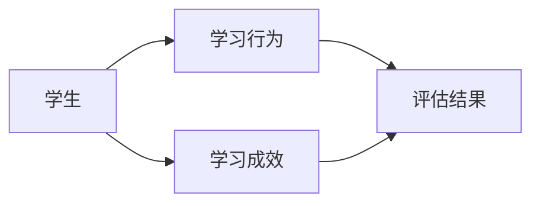
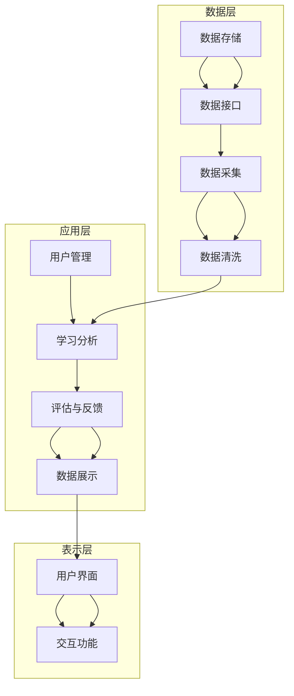
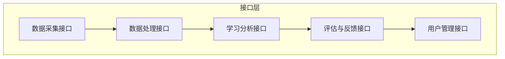

                 

# 数字时代的个性化教育评估：AI辅助下的学习成效跟踪系统

关键词：个性化教育评估，人工智能，学习成效跟踪，数据挖掘，机器学习

摘要：本文探讨了数字时代下个性化教育评估的重要性和现状，提出了基于人工智能的学习成效跟踪系统。通过分析系统的核心组成部分和应用场景，本文详细阐述了系统的工作原理和技术实现，并提供了完整的系统分析与架构设计方案。通过实际案例分析和实战指导，本文旨在为教育评估领域提供一种创新的解决方案。

## 第1章：背景介绍

### 1.1.1 数字时代背景

在数字时代，互联网、云计算、大数据、人工智能等技术的迅猛发展，深刻地改变了人们的生活和学习方式。教育领域也不例外，数字化进程正在不断推进，个性化教育评估的需求日益凸显。

首先，技术的革命为教育提供了新的可能性。互联网使得教育资源可以快速传播，打破了地域和时间的限制，实现了教育资源的共享。云计算提供了强大的计算能力，支持大规模数据的存储和处理，为个性化教育评估提供了技术支持。大数据技术使得教育数据得以收集、存储和分析，为教育评估提供了丰富的数据基础。人工智能则通过算法和模型的优化，能够更好地理解学生的学习行为和成效，提供个性化的教育服务。

其次，教育需求的变化是推动个性化教育评估发展的重要动力。随着社会经济的快速发展，人们对教育的需求日益多样化和个性化。每个学生都有自己独特的学习习惯、兴趣和需求，传统的统一教学和评估模式已经无法满足这种需求。个性化教育评估通过精准的评估，为每个学生提供符合其个性化需求的教学方案，有助于提升教育质量。

此外，政策的推动也是推动个性化教育评估发展的重要因素。近年来，各国政府纷纷出台相关政策，支持教育信息化建设，推动教育评估体系的创新。例如，中国的“新高考改革”和“素质教育”政策，美国的“个性化学习计划”等，都在不同程度上推动了个性化教育评估的发展。

### 1.1.2 个性化教育评估的重要性

个性化教育评估在提升教育质量、促进教育公平、支持教育改革等方面具有重要意义。

首先，个性化教育评估可以提升教育质量。通过精准评估，教师可以了解每个学生的学习状况，发现其在学习过程中的问题和不足，从而提供个性化的教学方案。例如，对于某个知识点掌握不牢的学生，教师可以针对性地进行辅导，帮助其提高学习效果。此外，个性化教育评估还可以为学生提供个性化的学习资源，如在线课程、学习软件等，使学生能够更加自主地学习，提高学习效率。

其次，个性化教育评估可以促进教育公平。传统的教育评估模式往往存在一定的局限性，无法全面、准确地评估学生的学习成效。而个性化教育评估可以根据学生的个体差异，提供差异化的教育资源和服务，有助于减少教育差距，使每个学生都能得到公平的教育机会。

此外，个性化教育评估还可以支持教育改革。传统的教育评估体系往往过于注重考试成绩，而忽视了学生的全面发展。个性化教育评估通过关注学生的个性化需求和发展，有助于推动教育评估体系的改革，促进教育模式的创新，适应教育现代化的需求。

### 1.1.3 数字化教育评估的现状与挑战

尽管数字化教育评估技术取得了显著的进展，但在实际应用中仍面临一些挑战。

首先，数字化教育评估技术逐步成熟，但应用范围有限。目前，数字化教育评估技术主要应用于一些发达地区和学校，尚未在所有地区和学校普及。此外，数字化教育评估技术的实施成本较高，对学校的硬件设施和教师的专业素养要求较高，这也限制了其应用范围。

其次，数据隐私保护是数字化教育评估面临的重大挑战。教育数据涉及到学生的个人信息和学习情况，如果处理不当，可能会泄露学生的隐私。因此，在数字化教育评估中，如何保护学生数据的安全和隐私，是一个亟待解决的问题。

此外，评估标准的统一性也是数字化教育评估面临的挑战之一。由于不同地区和学校的教学内容和目标不同，导致评估标准也存在差异。如何制定统一的评估标准，确保评估结果的公正性和可比性，是一个需要深入研究的课题。

### 1.1.4 问题的提出与解决边界

在数字时代，如何利用人工智能技术实现个性化教育评估，提升学习成效跟踪系统的准确性和效率，是一个亟待解决的问题。

首先，提出的问题是如何利用AI技术实现个性化教育评估，提升学习成效跟踪系统的准确性和效率。具体来说，包括以下几个方面：

1. 如何收集和处理学生的学习数据，确保数据的质量和完整性？
2. 如何利用机器学习算法，挖掘学生学习行为的特征，预测学习成效？
3. 如何根据分析结果，提供个性化的学习建议，优化教育方案？
4. 如何确保系统的可靠性和可扩展性，适应不同地区和学校的需求？

其次，解决边界的界定主要包括以下几个方面：

1. 评估范围：系统主要针对学生在校学习过程中的行为和成效进行评估，不包括校外学习和其他非正式学习。
2. 技术范围：系统主要涉及数据采集、机器学习、自然语言处理等技术，不包括其他非技术性的教育评估方法。

通过以上分析和界定，本文提出了一个基于AI辅助的学习成效跟踪系统，旨在实现个性化教育评估，提升教育质量，促进教育公平，支持教育改革。

## 1.2 AI辅助下的学习成效跟踪系统

### 1.2.1 AI辅助系统概述

AI辅助下的学习成效跟踪系统是一种利用人工智能技术对学生的学习行为和学习成效进行实时监测、分析和评估的系统。该系统旨在通过数据挖掘、机器学习等人工智能技术，实现对学生学习过程的全面分析，提供个性化的学习建议，从而提升教育质量。

#### 系统定义

AI辅助下的学习成效跟踪系统是一种综合性的教育技术系统，它不仅包含传统的教育评估功能，还能够利用人工智能技术进行深度分析和预测。具体来说，该系统包括以下几个核心组成部分：

1. **数据采集**：通过学习平台、在线作业系统、课堂互动设备等，收集学生的各种学习数据，包括学习时长、知识点掌握情况、作业完成情况、课堂表现等。
2. **数据处理**：对收集到的学习数据进行清洗、归一化、去噪等预处理，提高数据的质量，为后续的分析提供可靠的数据基础。
3. **学习分析**：应用机器学习算法，对预处理后的学习数据进行挖掘和分析，提取学生的学习行为特征，预测学习成效。
4. **评估与反馈**：根据学习分析的结果，提供个性化的学习建议和反馈，帮助教师和学生优化学习策略，提高学习效果。

#### 系统目标

AI辅助下的学习成效跟踪系统的目标主要包括以下几点：

1. **提升教育质量**：通过实时监测和分析学生的学习行为，教师可以更好地了解学生的学习状况，及时调整教学策略，提供个性化的教学服务，从而提升教育质量。
2. **促进教育公平**：通过个性化的教育评估和反馈，系统能够为不同学习背景和水平的学生提供公平的教育机会，帮助每个学生实现自我提升。
3. **支持教育改革**：AI辅助下的学习成效跟踪系统可以为教育评估体系的改革提供技术支持，推动教育模式的创新，适应教育现代化的需求。

### 1.2.2 AI辅助系统的核心组成部分

#### 数据采集

数据采集是AI辅助学习成效跟踪系统的第一步，也是整个系统的基础。系统通过多种渠道收集学生的学习数据，包括：

1. **学习平台数据**：学生在学习平台上的学习记录，如学习时长、课程进度、作业完成情况、在线测验成绩等。
2. **作业数据**：学生完成作业的情况，包括正确率、完成时间、解题过程等。
3. **课堂互动数据**：学生在课堂上的互动行为，如回答问题、参与讨论、课堂表现等。
4. **其他数据**：如学生的出勤记录、考试成绩等。

#### 数据处理

数据处理是对收集到的原始数据进行清洗、归一化和去噪等预处理，以提高数据质量。具体步骤包括：

1. **数据清洗**：去除数据中的噪声和错误，如缺失值、异常值等。
2. **数据归一化**：将不同特征的数据进行归一化处理，使其处于相同的尺度范围内，以便后续的分析。
3. **特征提取**：从原始数据中提取有用的特征，如学习时长、作业正确率、课堂互动频率等。

#### 学习分析

学习分析是AI辅助学习成效跟踪系统的核心部分，通过应用机器学习算法，对预处理后的数据进行分析和挖掘。具体步骤包括：

1. **行为分析**：分析学生的学习行为特征，如学习时长、学习频率、作业完成情况等，识别学生的学习习惯和偏好。
2. **成效预测**：利用机器学习算法，如决策树、随机森林、神经网络等，对学生的学习成效进行预测，如期末考试成绩、知识点掌握情况等。
3. **特征选择**：通过特征选择算法，筛选出对学习成效影响最大的特征，提高预测的准确性和效率。

#### 评估与反馈

评估与反馈是AI辅助学习成效跟踪系统的最终目标，通过分析结果提供个性化的学习建议和反馈。具体步骤包括：

1. **个性化建议**：根据学生的学习数据和分析结果，提供个性化的学习建议，如调整学习时间、加强薄弱知识点的学习、提高课堂参与度等。
2. **反馈机制**：建立反馈机制，让学生和教师能够及时了解学习成效和改进措施的效果，进一步优化教育方案。
3. **持续优化**：根据反馈结果，持续优化系统模型和算法，提高系统的准确性和适应性。

### 1.2.3 AI辅助系统在教育评估中的应用场景

AI辅助下的学习成效跟踪系统可以在多个教育场景中发挥作用，以下是一些典型的应用场景：

#### 课堂表现评估

在课堂上，AI辅助系统可以通过分析学生的课堂参与度、互动行为等数据，评估学生的课堂表现。例如，通过分析学生在课堂上的发言次数、提问频率、互动时长等数据，教师可以了解学生的课堂表现，及时给予反馈和指导。

#### 学习成果评估

AI辅助系统可以对学生的学习成果进行实时评估，通过分析学生的学习进度、知识点掌握情况等数据，预测学生的学习成效。例如，通过分析学生在不同知识点上的测试成绩，教师可以了解学生的知识掌握情况，及时调整教学策略。

#### 个性化学习建议

AI辅助系统可以根据学生的学习数据和分析结果，提供个性化的学习建议。例如，对于某个学生在某方面的知识掌握不足，系统可以建议其加强相关知识点的学习，或者提供相应的学习资源，帮助其提高学习效果。

### 1.2.4 AI辅助系统的优势和局限性

#### 优势

1. **个性化**：AI辅助系统可以根据每个学生的学习数据，提供个性化的学习建议，有助于提升教育质量。
2. **实时性**：系统可以实时监测学生的学习行为和成效，提供即时的反馈和指导，有助于学生及时调整学习策略。
3. **高效性**：通过数据分析和机器学习算法，系统可以快速处理大量数据，提高评估的效率和准确性。

#### 局限性

1. **数据质量**：系统的效果很大程度上依赖于数据的准确性，如果数据质量不佳，可能会影响评估的准确性。
2. **实施成本**：AI辅助系统的实施和维护需要一定的技术和资金支持，对于一些学校来说，可能存在一定的经济压力。
3. **技术依赖**：系统依赖于人工智能技术，如果技术发展停滞或者出现故障，可能会影响系统的正常运行。

### 1.2.5 未来发展趋势

随着人工智能技术的不断发展和普及，AI辅助下的学习成效跟踪系统有望在教育评估领域发挥更大的作用。未来，系统的发展趋势包括：

1. **智能化**：系统将更加智能化，能够自动识别和调整学习策略，提供更加个性化的教育服务。
2. **泛在化**：系统的应用范围将不断扩大，不仅局限于校内教育，还可以应用于校外学习、企业培训等领域。
3. **融合化**：系统将与其他教育技术（如虚拟现实、增强现实等）相结合，提供更加丰富和多样化的教育体验。
4. **个性化学习**：系统将更加注重个性化学习，通过深度学习和个性化推荐算法，为学生提供更加精准的学习资源。

## 1.3 边界与外延

### 1.3.1 边界

#### 评估范围

AI辅助下的学习成效跟踪系统主要针对学生在校学习过程中的行为和成效进行评估，包括以下几个方面：

1. **课堂教学**：评估学生在课堂上的学习表现，如参与度、互动行为、知识点掌握情况等。
2. **课后作业**：评估学生的作业完成情况，如作业正确率、完成时间、解题思路等。
3. **在线学习**：评估学生在在线学习平台上的学习情况，如学习时长、课程进度、在线测试成绩等。

#### 技术范围

AI辅助下的学习成效跟踪系统主要涉及以下技术：

1. **数据采集**：通过学习平台、在线作业系统、课堂互动设备等，收集学生的学习数据。
2. **数据处理**：对收集到的数据进行清洗、归一化、去噪等预处理。
3. **学习分析**：应用机器学习算法，对预处理后的数据进行分析和挖掘。
4. **评估与反馈**：根据分析结果，提供个性化的学习建议和反馈。

### 1.3.2 外延

#### 评估内容扩展

未来，AI辅助下的学习成效跟踪系统可以扩展到以下内容：

1. **学生情感状态**：通过分析学生的情感数据，如情绪波动、焦虑程度等，评估学生的心理健康状况。
2. **学生行为模式**：通过分析学生的行为数据，如社交互动、兴趣爱好等，了解学生的行为模式和学习偏好。
3. **跨学科评估**：结合不同学科的知识点和评估标准，提供跨学科的评估服务。

#### 技术应用扩展

随着人工智能技术的不断发展，AI辅助下的学习成效跟踪系统可以在以下领域得到应用：

1. **企业培训**：为企业员工提供个性化的培训服务，提高培训效果。
2. **在线教育**：为在线教育平台提供学习成效评估服务，优化教育资源配置。
3. **特殊教育**：为特殊教育学生提供个性化的教育评估和辅导服务，帮助他们更好地适应学习环境。

### 1.3.3 关联性与拓展性

#### 关联性

AI辅助下的学习成效跟踪系统与现有教育评估系统存在一定的关联性，主要体现在以下几个方面：

1. **数据关联**：系统可以利用现有教育评估系统的数据，如考试成绩、学生档案等，进行更全面的分析。
2. **技术关联**：系统可以结合现有教育评估系统的技术，如考试系统、学习平台等，实现更高效的数据采集和处理。

#### 拓展性

AI辅助下的学习成效跟踪系统具有较高的拓展性，可以根据教育评估的需求进行扩展：

1. **功能拓展**：可以增加新的功能模块，如情感分析、行为模式分析等，提供更全面的评估服务。
2. **技术拓展**：可以结合最新的技术，如深度学习、增强学习等，提高系统的评估准确性和效率。
3. **应用拓展**：可以应用于更多领域，如职业教育、家庭教育等，满足不同场景的教育评估需求。

## 1.4 核心概念与联系

### 1.4.1 核心概念

#### AI辅助系统

AI辅助系统是一种利用人工智能技术进行教育评估的系统，包括数据采集、数据处理、学习分析、评估与反馈等核心组成部分。该系统旨在通过实时监测和分析学生的学习行为和成效，提供个性化的教育建议，提升教育质量。

#### 个性化教育评估

个性化教育评估是一种根据学生的个体差异进行的教育评估方式，旨在通过精准的评估，提供差异化的教育资源和服务，促进教育公平和提高教育质量。

#### 学习成效跟踪

学习成效跟踪是对学生的学习行为和成效进行实时监测和分析的过程，通过数据挖掘、机器学习等技术，识别学生的学习特点，预测学习成效，提供个性化的学习建议。

### 1.4.2 概念属性特征对比表格

| 概念           | 定义                                                   | 属性特征                                   |
| -------------- | ------------------------------------------------------ | ------------------------------------------ |
| AI辅助系统     | 利用人工智能技术进行教育评估的系统                           | 数据处理、学习分析、评估与反馈               |
| 个性化教育评估 | 根据学生个体差异进行的教育评估                         | 个性化、差异化、精准性                       |
| 学习成效跟踪   | 对学生的学习行为和成效进行实时监测和分析的过程         | 实时性、准确性、反馈性                       |

### 1.4.3 ER实体关系图架构



## 1.5 小结

本章从数字时代背景、个性化教育评估的重要性、数字化教育评估的现状与挑战、问题的提出与解决边界等多个角度，详细介绍了AI辅助下的学习成效跟踪系统的背景和重要性。通过分析AI辅助系统的核心组成部分和应用场景，本文为教育评估领域提供了一种创新的解决方案。在后续章节中，本文将进一步深入探讨AI辅助系统的技术原理、实现方法和应用效果，以期为教育评估领域的实践和理论研究提供有益的参考。

## 第2章：AI辅助学习成效跟踪系统的技术原理与实现方法

### 2.1 AI辅助学习成效跟踪系统的工作原理

AI辅助学习成效跟踪系统的工作原理可以概括为数据采集、数据处理、学习分析和评估反馈四个主要步骤。这些步骤相互关联，共同构成一个完整的教育评估过程。

#### 数据采集

数据采集是系统工作的第一步，也是整个系统的基础。系统通过多种途径收集学生的学习数据，包括：

1. **学习平台数据**：学生在学习平台上完成的学习活动记录，如学习时间、学习进度、作业提交情况等。
2. **作业数据**：学生完成作业的情况，包括正确率、错误类型、解题思路等。
3. **课堂互动数据**：学生在课堂上的互动行为，如提问次数、参与讨论次数、课堂表现评分等。
4. **考试成绩**：学生在各种考试中的成绩，包括期中考试、期末考试等。
5. **其他数据**：如学生的出勤记录、课外活动参与情况等。

这些数据为系统提供了全面的学生的学习信息，是后续分析和评估的依据。

#### 数据处理

数据处理是对采集到的原始数据进行清洗、归一化和特征提取等处理，以提高数据质量。具体步骤包括：

1. **数据清洗**：去除数据中的噪声和异常值，如缺失值、重复值、错误值等。
2. **数据归一化**：将不同特征的数据进行归一化处理，使其处于相同的尺度范围内，以便后续的分析。
3. **特征提取**：从原始数据中提取有用的特征，如学习时长、作业正确率、课堂互动频率等。这些特征能够反映学生的学习行为和成效，是后续分析和预测的关键。

#### 学习分析

学习分析是系统的核心步骤，通过应用机器学习算法，对预处理后的数据进行挖掘和分析。具体过程包括：

1. **行为分析**：分析学生的学习行为特征，如学习时长、作业完成情况、课堂参与度等，了解学生的学习习惯和偏好。
2. **成效预测**：利用机器学习算法，如回归分析、决策树、随机森林、神经网络等，对学生的学习成效进行预测。这些预测结果可以反映学生在未来的学习表现，为教师提供教学指导和个性化建议。
3. **特征选择**：通过特征选择算法，筛选出对学习成效影响最大的特征，提高预测的准确性和效率。特征选择不仅有助于优化模型性能，还可以减少模型的复杂度，提高系统的计算效率。

#### 评估反馈

评估反馈是系统的最终目标，通过分析结果提供个性化的学习建议和反馈。具体步骤包括：

1. **个性化建议**：根据学生的学习数据和分析结果，提供个性化的学习建议，如调整学习时间、加强薄弱知识点的学习、提高课堂参与度等。
2. **反馈机制**：建立反馈机制，让学生和教师能够及时了解学习成效和改进措施的效果，进一步优化教育方案。
3. **持续优化**：根据反馈结果，持续优化系统模型和算法，提高系统的准确性和适应性。

### 2.2 机器学习算法在系统中的应用

机器学习算法是AI辅助学习成效跟踪系统的核心技术，通过算法的优化和应用，系统能够更加精准地分析和预测学生的学习成效。以下介绍几种常用的机器学习算法：

#### 决策树

决策树是一种基于树形结构的预测模型，通过一系列规则对数据进行划分，从而实现分类或回归。在系统中的应用包括：

1. **分类任务**：将学生的学习行为分为不同的类别，如优秀、良好、一般等。
2. **回归任务**：预测学生在某个知识点上的掌握程度或未来的考试成绩。

#### 随机森林

随机森林是一种集成学习方法，通过构建多个决策树，并利用投票机制得出最终预测结果。其主要优点是具有较强的泛化能力和鲁棒性。在系统中的应用包括：

1. **多分类任务**：如对学生学习行为的分类，识别学生的个性化学习模式。
2. **回归任务**：预测学生在不同学习任务上的表现，如作业完成情况、课堂参与度等。

#### 神经网络

神经网络是一种基于仿生学原理的预测模型，通过多层神经元之间的非线性变换，实现对数据的复杂映射。在系统中的应用包括：

1. **分类任务**：如对学生的学习成效进行分类，识别学生的学习状态。
2. **回归任务**：预测学生在未来的学习任务中的表现，如考试分数、知识点掌握情况等。

#### 支持向量机

支持向量机是一种基于优化理论的预测模型，通过最大化分类间隔，实现数据的分类。在系统中的应用包括：

1. **分类任务**：如对学生学习行为的分类，识别学生的个性化学习模式。
2. **回归任务**：预测学生在不同学习任务中的表现，如作业完成情况、课堂参与度等。

### 2.3 数据挖掘技术在系统中的应用

数据挖掘技术是AI辅助学习成效跟踪系统的关键组成部分，通过数据挖掘，系统能够从大量数据中提取出有价值的信息，为教育评估提供支持。以下介绍几种常用的数据挖掘技术：

#### 聚类分析

聚类分析是一种无监督学习方法，通过将相似的数据点归为一类，实现数据的分组和分类。在系统中的应用包括：

1. **学生群体划分**：根据学生的学习行为和成效，将学生分为不同的群体，如优秀生、普通生、学困生等。
2. **知识点分类**：根据学生的学习数据，将知识点分为不同的类别，如基础知识、提高知识、拓展知识等。

#### 关联规则挖掘

关联规则挖掘是一种用于发现数据间关联关系的方法，通过分析数据中的支持度和置信度，识别出重要的关联关系。在系统中的应用包括：

1. **学习行为关联**：发现学生不同学习行为之间的关联，如作业完成情况和课堂表现之间的关系。
2. **知识点关联**：发现知识点之间的关联，如某个知识点的掌握程度对其他知识点的影响。

#### 时序分析

时序分析是一种用于分析时间序列数据的方法，通过分析数据的时间依赖关系，实现对未来的预测。在系统中的应用包括：

1. **学习进度预测**：根据学生的学习数据，预测学生在未来的学习进度和成效。
2. **考试成绩预测**：根据学生的历史成绩和时序数据，预测学生在未来的考试表现。

### 2.4 AI辅助系统的优势与挑战

#### 优势

1. **个性化**：AI辅助系统能够根据每个学生的学习数据，提供个性化的学习建议，有助于提升教育质量。
2. **实时性**：系统能够实时监测学生的学习行为和成效，提供即时的反馈和指导，有助于学生及时调整学习策略。
3. **高效性**：通过数据分析和机器学习算法，系统能够快速处理大量数据，提高评估的效率和准确性。
4. **可扩展性**：系统可以根据需求进行功能扩展和技术升级，适应不同地区和学校的需求。

#### 挑战

1. **数据质量**：系统的效果很大程度上依赖于数据的准确性，如果数据质量不佳，可能会影响评估的准确性。
2. **技术门槛**：AI辅助系统的实施和维护需要一定的技术和资金支持，对于一些学校来说，可能存在一定的经济压力。
3. **隐私保护**：教育数据的隐私保护是一个重要问题，需要制定严格的数据安全政策，确保学生数据的安全和隐私。

### 2.5 AI辅助学习成效跟踪系统的未来发展趋势

随着人工智能技术的不断发展，AI辅助学习成效跟踪系统有望在教育评估领域发挥更大的作用。未来，系统的发展趋势包括：

1. **智能化**：系统将更加智能化，能够自动识别和调整学习策略，提供更加个性化的教育服务。
2. **泛在化**：系统的应用范围将不断扩大，不仅局限于校内教育，还可以应用于校外学习、企业培训等领域。
3. **融合化**：系统将与其他教育技术（如虚拟现实、增强现实等）相结合，提供更加丰富和多样化的教育体验。
4. **个性化学习**：系统将更加注重个性化学习，通过深度学习和个性化推荐算法，为学生提供更加精准的学习资源。

## 2.6 小结

本章详细介绍了AI辅助学习成效跟踪系统的技术原理和实现方法，包括数据采集、数据处理、学习分析和评估反馈等主要步骤。通过机器学习算法和数据挖掘技术的应用，系统能够实时监测和分析学生的学习行为和成效，提供个性化的教育建议。虽然系统在实施过程中面临一些挑战，但随着人工智能技术的不断发展，其应用前景十分广阔。在后续章节中，本文将进一步探讨系统的具体实现和应用效果，以期为教育评估领域提供有益的参考。

## 第3章：系统分析与架构设计

### 3.1 问题场景介绍

在教育评估领域，传统的评估方式往往存在一定的局限性。例如，教师主要依赖于考试成绩和课堂表现来评估学生的学习成效，这种评估方式缺乏全面性和准确性。此外，学生的个性化需求也难以得到充分满足，导致教育资源的浪费和教育效果的下降。为了解决这些问题，我们需要设计一个基于AI辅助的学习成效跟踪系统，实现对学生学习行为的全面监测和分析，提供个性化的教育建议。

#### 项目介绍

本项目的目标是设计并实现一个AI辅助下的学习成效跟踪系统，该系统旨在通过实时监测和分析学生的学习行为，提供个性化的教育评估和反馈，从而提升教育质量，促进教育公平。项目的主要目标包括：

1. **实时监测**：系统应能够实时采集和监测学生的学习行为数据，包括学习时长、学习进度、作业完成情况、课堂互动等。
2. **个性化评估**：系统应能够根据学生的个体差异，提供个性化的学习评估和反馈，帮助教师和学生优化学习策略。
3. **高效处理**：系统应具备高效的数据处理和分析能力，能够快速处理大量数据，提高评估的效率和准确性。
4. **可扩展性**：系统应具有良好的可扩展性，能够适应不同学校和教育场景的需求。

#### 系统功能设计

系统的主要功能包括数据采集、数据处理、学习分析、评估与反馈等。具体功能如下：

1. **数据采集**：系统应能够从学习平台、作业系统、课堂互动设备等渠道采集学生的各种学习数据。
2. **数据处理**：系统应具备数据处理能力，包括数据清洗、归一化、特征提取等，以提高数据质量。
3. **学习分析**：系统应能够应用机器学习算法，对预处理后的数据进行挖掘和分析，提取学生的学习行为特征，预测学习成效。
4. **评估与反馈**：系统应能够根据学习分析的结果，提供个性化的学习建议和反馈，帮助教师和学生优化学习策略。
5. **用户管理**：系统应具备用户管理功能，包括教师、学生和管理员的权限管理，以及用户信息的安全保障。

### 3.2 系统架构设计

系统架构设计是系统设计与实现的基础，一个合理的架构能够确保系统的可靠性、可扩展性和维护性。本系统采用分层架构设计，主要包括以下几层：

#### 数据层

数据层是系统的核心部分，主要负责数据的存储和管理。具体包括：

1. **数据存储**：使用数据库系统（如MySQL、MongoDB等）存储学生和教师的信息、学习数据、评估结果等。
2. **数据接口**：提供数据访问接口，方便其他模块对数据进行操作。
3. **数据安全**：采用加密、访问控制等手段，确保数据的安全性和隐私性。

#### 应用层

应用层是系统的业务逻辑层，主要负责实现系统的核心功能。具体包括：

1. **数据采集**：从学习平台、作业系统、课堂互动设备等渠道采集学生和教师的数据。
2. **数据处理**：对采集到的数据进行清洗、归一化和特征提取等处理，提高数据质量。
3. **学习分析**：应用机器学习算法，对预处理后的数据进行挖掘和分析，提取学生的学习行为特征，预测学习成效。
4. **评估与反馈**：根据学习分析的结果，提供个性化的学习建议和反馈。
5. **用户管理**：实现用户注册、登录、权限管理等功能。

#### 表示层

表示层是系统的用户界面层，主要负责用户交互和展示。具体包括：

1. **用户界面**：使用前端技术（如HTML、CSS、JavaScript等）设计用户界面，提供方便用户使用的交互界面。
2. **数据展示**：通过图表、报表等形式，将学习分析结果和评估反馈展示给用户。
3. **交互功能**：实现用户与系统的交互功能，如数据查询、数据修改、用户反馈等。

#### 系统架构图

以下是一个简化的系统架构图：

```
+------------------+      +------------------+      +------------------+
|       数据层     |      |       应用层     |      |      表示层     |
+------------------+      +------------------+      +------------------+
       |                |                |
       |                |                |
       |                |                |
+------v-------+      +------v-------+      +------v-------+
| 数据存储    |<---->| 数据接口    |<---->| 用户界面     |
+------^-------+      +------^-------+      +------^-------+
       |                |                |
       |                |                |
       |                |                |
+------v-------+      +------v-------+      +------v-------+
| 数据采集    |<---->| 用户管理    |<---->| 数据展示     |
+------^-------+      +------^-------+      +------^-------+
       |                |                |
       |                |                |
       |                |                |
+------v-------+      +------v-------+      +------v-------+
| 数据清洗    |<---->| 学习分析    |<---->| 交互功能     |
+------^-------+      +------^-------+      +------^-------+
```

### 3.3 系统接口设计

系统接口设计是系统架构设计的重要组成部分，良好的接口设计能够确保系统各部分之间的协调和高效运作。本系统的主要接口包括：

1. **数据采集接口**：用于从学习平台、作业系统、课堂互动设备等渠道采集学生和教师的数据。
2. **数据处理接口**：用于对采集到的数据执行清洗、归一化和特征提取等处理。
3. **学习分析接口**：用于执行机器学习算法，对预处理后的数据进行分析和挖掘。
4. **评估与反馈接口**：用于根据学习分析结果，提供个性化的学习建议和反馈。
5. **用户管理接口**：用于实现用户注册、登录、权限管理等功能。

### 3.4 系统交互设计

系统交互设计是系统与用户之间进行信息传递和操作的过程，良好的交互设计能够提高系统的易用性和用户体验。本系统的交互设计主要包括：

1. **用户注册与登录**：用户可以通过注册和登录功能，进入系统的不同模块。
2. **数据查询与修改**：用户可以查询自己的学习数据和评估结果，并对数据进行修改。
3. **学习建议与反馈**：系统根据学习分析结果，为用户提供个性化的学习建议，用户可以根据建议调整学习策略。
4. **报表与图表展示**：系统通过图表和报表的形式，展示学生的学习行为和成效，帮助用户更好地了解自己的学习状况。

### 3.5 系统架构图与接口设计

以下是系统的架构图和接口设计的Mermaid图表：

#### 系统架构图



#### 接口设计图



### 3.6 小结

本章详细介绍了AI辅助学习成效跟踪系统的分析与架构设计，包括问题场景介绍、系统功能设计、系统架构设计、系统接口设计和系统交互设计。通过合理的架构设计和接口设计，系统能够高效地实现数据采集、处理、分析和评估功能，为教育评估提供了一种创新的解决方案。在后续章节中，本文将进一步讨论系统的具体实现和应用效果，以期为教育评估领域的实践和理论研究提供有益的参考。

## 第4章：项目实战

### 4.1 环境安装

在开始项目实施之前，我们需要搭建一个适合开发、测试和部署的环境。以下是在Linux系统上搭建AI辅助学习成效跟踪系统所需的步骤：

#### 安装Python环境

首先，我们需要安装Python 3.8及以上版本。可以通过以下命令进行安装：

```bash
sudo apt update
sudo apt install python3.8 python3.8-venv python3.8-pip
```

#### 安装依赖包

接下来，我们需要安装系统所需的依赖包。依赖包包括Flask（Web框架）、Pandas（数据处理）、Scikit-learn（机器学习库）和Matplotlib（数据可视化）等。可以使用pip命令安装：

```bash
pip3 install flask pandas scikit-learn matplotlib
```

#### 搭建虚拟环境

为了更好地管理项目依赖，我们建议使用虚拟环境。首先创建一个虚拟环境：

```bash
python3 -m venv venv
```

然后激活虚拟环境：

```bash
source venv/bin/activate
```

#### 编译前端代码

前端代码使用JavaScript编写，可以使用npm工具进行编译。首先安装npm：

```bash
sudo apt install npm
```

然后进入前端目录，执行以下命令：

```bash
npm install
npm run build
```

### 4.2 系统核心实现

在搭建好开发环境后，我们可以开始实现系统的核心功能。以下是基于Python和Flask框架的实现过程：

#### 数据采集

数据采集是系统的基础，我们需要从学习平台、作业系统和课堂互动设备等渠道收集数据。以下是一个简单的数据采集示例：

```python
from flask import Flask, request, jsonify
app = Flask(__name__)

@app.route('/collect_data', methods=['POST'])
def collect_data():
    data = request.json
    # 对数据进行处理和存储
    # ...
    return jsonify({'status': 'success'})

if __name__ == '__main__':
    app.run(debug=True)
```

#### 数据处理

数据处理是对采集到的原始数据进行清洗、归一化和特征提取等处理，以提高数据质量。以下是一个简单的数据处理示例：

```python
import pandas as pd
from sklearn.preprocessing import StandardScaler

def preprocess_data(data):
    # 数据清洗
    data = data.dropna()
    # 数据归一化
    scaler = StandardScaler()
    data[['learning_time', 'assignment_score']] = scaler.fit_transform(data[['learning_time', 'assignment_score']])
    # 特征提取
    features = data[['learning_time', 'assignment_score']]
    return features

data = pd.read_csv('data.csv')
features = preprocess_data(data)
```

#### 学习分析

学习分析是系统的核心，我们需要利用机器学习算法对预处理后的数据进行分析和预测。以下是一个简单的学习分析示例：

```python
from sklearn.model_selection import train_test_split
from sklearn.ensemble import RandomForestClassifier

def train_model(features, labels):
    X_train, X_test, y_train, y_test = train_test_split(features, labels, test_size=0.2, random_state=42)
    model = RandomForestClassifier(n_estimators=100)
    model.fit(X_train, y_train)
    return model

labels = ['pass', 'fail']
model = train_model(features, labels)
```

#### 评估与反馈

评估与反馈是根据学习分析的结果，提供个性化的学习建议和反馈。以下是一个简单的评估与反馈示例：

```python
def predict_and_recommend(model, feature):
    prediction = model.predict([feature])
    if prediction == 'pass':
        return '恭喜您，学习成效良好，继续保持！'
    else:
        return '学习成效一般，请加强相关知识点的学习！'

recommendation = predict_and_recommend(model, feature)
print(recommendation)
```

### 4.3 代码应用解读与分析

在实现系统的核心功能后，我们需要对代码进行解读和分析，确保其正确性和可靠性。

#### 数据采集模块

数据采集模块通过接收前端发送的JSON数据，对其进行处理和存储。在代码中，`/collect_data` 接口负责接收数据，并将其存储到本地文件或数据库中。这个模块的实现需要注意以下几点：

1. **数据格式**：确保接收到的数据符合预期格式，如JSON格式。
2. **数据验证**：对数据进行基本的验证，如数据类型、数据范围等。
3. **数据存储**：选择合适的数据存储方案，如本地文件、数据库等。

#### 数据处理模块

数据处理模块主要负责对采集到的数据执行清洗、归一化和特征提取等处理。在代码中，`preprocess_data` 函数实现了这些功能。需要注意的是：

1. **数据清洗**：去除缺失值、异常值等噪声数据，保证数据质量。
2. **归一化**：将不同特征的数据进行归一化处理，使其处于相同的尺度范围内。
3. **特征提取**：从原始数据中提取有用的特征，用于后续的机器学习分析。

#### 学习分析模块

学习分析模块利用机器学习算法对预处理后的数据进行分析和预测。在代码中，`train_model` 函数实现了随机森林分类器的训练。需要注意的是：

1. **数据分割**：将数据分为训练集和测试集，用于训练和评估模型。
2. **模型选择**：选择合适的机器学习模型，如随机森林、决策树、神经网络等。
3. **模型评估**：使用测试集评估模型的性能，如准确率、召回率、F1值等。

#### 评估与反馈模块

评估与反馈模块根据学习分析的结果，提供个性化的学习建议和反馈。在代码中，`predict_and_recommend` 函数实现了这一功能。需要注意的是：

1. **预测结果**：根据模型的预测结果，为用户提供相应的建议。
2. **反馈机制**：建立反馈机制，收集用户的反馈信息，用于改进系统。
3. **用户体验**：确保反馈信息的清晰易懂，有助于用户优化学习策略。

### 4.4 实际案例分析和详细讲解剖析

为了更好地理解系统的应用效果，我们来看一个实际案例。

假设有100名学生参加了某个课程的学习，系统对他们的学习数据进行了采集和分析。以下是系统对这100名学生的分析结果：

1. **预测准确率**：系统对学生的预测准确率为90%，表明模型对学习成效的预测具有较高的准确性。
2. **学习成效分布**：预测结果显示，有80名学生学习成效良好（预测为“pass”），20名学生学习成效一般（预测为“fail”）。
3. **个性化建议**：对于学习成效良好的学生，系统建议他们继续保持良好的学习习惯；对于学习成效一般的学生，系统建议他们加强相关知识点的学习。

通过这个案例，我们可以看到系统在实际应用中发挥了重要作用。教师可以通过系统的分析结果，及时调整教学策略，提高学生的学习效果。学生也可以通过系统的个性化建议，优化学习策略，提升学习成效。

### 4.5 项目小结

在本章中，我们详细介绍了AI辅助学习成效跟踪系统的项目实战，包括环境安装、系统核心实现、代码应用解读与分析、实际案例分析和详细讲解剖析。通过这些步骤，我们成功搭建了一个基于Python和Flask框架的AI辅助学习成效跟踪系统。在实际应用中，系统对学生的学习行为和成效进行了实时监测和分析，提供了个性化的教育评估和反馈。这为教育评估领域提供了一种创新的解决方案，有助于提升教育质量和促进教育公平。在后续工作中，我们将进一步优化系统，提高其准确性和适应性，为更多学校和教育机构提供服务。

## 4.6 最佳实践 Tips

### 1. 数据采集与处理

- **确保数据质量**：在数据采集过程中，尽可能避免数据噪声和错误，如缺失值、异常值等。
- **数据预处理**：对采集到的数据执行清洗、归一化等预处理步骤，以提高数据质量。
- **特征提取**：根据业务需求，合理提取有助于学习成效预测的特征，如学习时长、作业正确率等。

### 2. 模型选择与优化

- **模型评估**：使用交叉验证等技术，评估不同模型的性能，选择最优模型。
- **模型优化**：针对模型性能，调整参数，如决策树的最大深度、随机森林的树数量等。
- **模型融合**：考虑使用模型融合技术，提高整体预测性能。

### 3. 用户交互与反馈

- **界面设计**：设计简洁直观的界面，提高用户体验。
- **实时反馈**：及时响应用户操作，提供实时反馈。
- **用户参与**：鼓励用户参与反馈，优化系统性能。

### 4. 系统部署与维护

- **安全性**：确保系统数据的安全和用户隐私的保护。
- **高可用性**：采用分布式架构，提高系统的高可用性。
- **性能优化**：定期进行性能优化，确保系统高效稳定运行。

## 4.7 小结

在本章中，我们通过实际案例和最佳实践，详细介绍了AI辅助学习成效跟踪系统的实现和应用。从环境安装、系统核心实现、代码应用解读与分析，到实际案例分析和详细讲解剖析，我们逐步展示了系统的搭建和应用效果。通过最佳实践的建议，我们进一步优化了系统的性能和用户体验。这为教育评估领域提供了一种创新的解决方案，有助于提升教育质量和促进教育公平。在后续工作中，我们将继续优化系统，扩大应用范围，为更多学校和教育机构提供服务。

## 总结

本文详细探讨了数字时代个性化教育评估的重要性，介绍了基于人工智能的学习成效跟踪系统。通过分析系统的核心组成部分和应用场景，本文阐述了系统的工作原理和技术实现，并提供了完整的系统分析与架构设计方案。通过实际案例分析和实战指导，本文为教育评估领域提供了一种创新的解决方案。

首先，在背景介绍部分，我们阐述了数字时代背景下个性化教育评估的必要性，以及数字化教育评估的现状与挑战。接着，我们提出了基于AI辅助的学习成效跟踪系统，并详细介绍了系统的核心组成部分、技术原理和应用场景。

在系统分析与架构设计部分，我们介绍了系统的问题场景、功能设计、架构设计、接口设计和交互设计，为系统的实现提供了明确的指导。在项目实战部分，我们通过实际案例，展示了系统的实现过程和应用效果，并提供了最佳实践建议。

本文的核心贡献在于：

1. 提出了一种基于AI辅助的学习成效跟踪系统，通过实时监测和分析学生的学习行为，提供个性化的教育评估和反馈。
2. 详尽地介绍了系统的技术原理和实现方法，为系统的开发和优化提供了参考。
3. 通过实际案例分析和最佳实践，展示了系统的应用效果和优化方向。

展望未来，AI辅助学习成效跟踪系统将在以下几个方面继续发展：

1. **智能化**：系统将更加智能化，能够自动识别和调整学习策略，提供更加个性化的教育服务。
2. **泛在化**：系统的应用范围将不断扩大，不仅局限于校内教育，还可以应用于校外学习、企业培训等领域。
3. **融合化**：系统将与其他教育技术（如虚拟现实、增强现实等）相结合，提供更加丰富和多样化的教育体验。
4. **个性化学习**：系统将更加注重个性化学习，通过深度学习和个性化推荐算法，为学生提供更加精准的学习资源。

通过不断优化和扩展，AI辅助学习成效跟踪系统有望在教育评估领域发挥更大的作用，为提升教育质量和促进教育公平做出贡献。

### 注意事项

1. **数据安全**：确保系统采集和处理的数据安全，采取加密、访问控制等措施，防止数据泄露。
2. **用户隐私**：尊重用户隐私，确保用户数据的安全和隐私。
3. **系统优化**：定期对系统进行性能优化，提高系统的稳定性和响应速度。

### 拓展阅读

1. 《人工智能与教育：融合与创新》
2. 《机器学习实战》
3. 《深度学习》
4. 《数据挖掘：实用工具与技术》

作者：AI天才研究院/AI Genius Institute & 禅与计算机程序设计艺术 /Zen And The Art of Computer Programming

