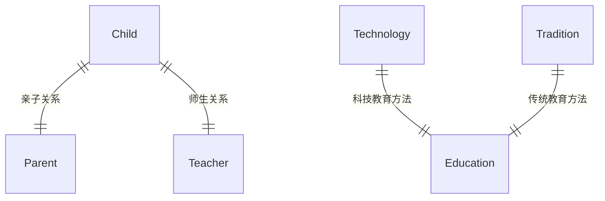

                 

### 数字时代的亲子教育：科技与传统教育方法的融合

#### 关键词：
- 数字时代
- 亲子教育
- 科技教育
- 传统教育
- 教育方法融合

#### 摘要：
本文旨在探讨数字时代背景下，科技与传统教育方法的融合对于亲子教育的重要性。通过对传统教育方法与科技教育方法的核心概念、优缺点及其融合策略的深入分析，本文提出了一套系统性的融合方案，为家长和教育工作者提供实用的指导，以促进孩子全面发展。

### 目录

## 前言

### 第一部分：背景介绍与核心概念

## 第1章 数字时代亲子教育概述

### 第2章 传统教育方法

### 第3章 科技教育方法

### 第二部分：科技与传统教育方法的融合

## 第4章 科技与传统教育的融合

### 第5章 科技工具在亲子教育中的应用

### 第6章 实践指导与最佳实践

### 第7章 未来展望与挑战

## 总结

### 第一部分：背景介绍与核心概念

#### 第1章 数字时代亲子教育概述

在数字时代，科技的飞速发展深刻地改变了人们的日常生活和教育方式。亲子教育，作为教育领域的核心组成部分，同样面临着前所未有的机遇与挑战。本章将探讨数字时代对亲子教育的影响，以及科技与传统教育方法的定义和核心概念。

##### 1.1 数字时代对亲子教育的影响

数字时代带来了信息获取的便捷性、全球化视野的扩展以及个性化学习的可能。然而，虚拟世界的沉迷、网络霸凌和隐私保护等问题也对亲子教育提出了新的挑战。

- **社会背景分析**：随着互联网的普及，人们的生活和工作方式发生了翻天覆地的变化。这种变化对亲子教育产生了深远的影响。
- **教育方式的变革**：数字技术使得学习资源更加丰富，教育方式更加多样化，促进了个性化学习的实现。

##### 1.2 核心概念与联系

- **科技与传统教育的定义**：科技教育是指利用现代信息技术进行教学，而传统教育则侧重于面对面互动和书本学习。
- **核心概念属性特征对比表格**：

  | 特征 | 科技教育 | 传统教育 |
  | --- | --- | --- |
  | 互动性 | 高度互动 | 有限互动 |
  | 个性化 | 强个性化 | 弱个性化 |
  | 效率 | 高效率 | 中效率 |
  | 成本 | 较高 | 较低 |

- **ER实体关系图**：使用Mermaid绘制ER图，展示科技与传统教育方法的实体关系。

#### 第2章 传统教育方法

传统教育方法历史悠久，其核心在于师生之间的面对面互动。本章将详细探讨传统教育方法的基本概念、特点及其优缺点。

##### 2.1 传统教育方法的基本概念

- **历史背景**：传统教育起源于古代，经历了数千年的发展。
- **方法与特点**：传统教育强调知识的系统传授，重视记忆和重复练习。

##### 2.2 传统教育方法的优缺点

- **优点**：传统教育方法有助于建立师生之间的信任和尊重，有利于培养学生的自律和责任感。
- **缺点**：传统教育方法在个性化教育和适应性方面存在局限，难以满足不同学生的学习需求。

| 优点 | 缺点 |
| --- | --- |
| 系统性 | 缺乏灵活性 |
| 传统价值观的传承 | 难以适应现代社会的变化 |

### 第二部分：科技与传统教育方法的融合

#### 第4章 科技与传统教育的融合

融合科技与传统教育方法，旨在发挥两者的优势，弥补各自的不足。本章将探讨融合的必要性与可行性，以及具体的策略与方法。

##### 4.1 融合的必要性与可行性

- **必要性**：在数字时代，教育需要适应快速变化的环境，提高学生的综合素质。
- **可行性**：随着科技的发展，已有许多技术工具和方法可以与传统的教育方法相结合，实现教育模式的创新。

##### 4.2 融合的策略与方法

- **教育理念的转变**：从单向灌输到双向互动，从知识传授到能力培养。
- **教学模式的创新**：利用在线课程、互动式教学、游戏化学习等手段，提高教学效果。
- **技术手段的应用**：如虚拟现实（VR）、人工智能（AI）、大数据等，为教育提供新工具。

### 第5章 科技工具在亲子教育中的应用

科技的进步为亲子教育提供了丰富的工具和资源。本章将介绍几种常见的科技工具，并分析其在亲子教育中的应用。

##### 5.1 科技工具的类型与应用

- **硬件工具**：如智能玩具、可穿戴设备等。
- **软件工具**：如教育APP、在线学习平台等。
- **互联网应用**：如社交媒体、在线论坛等。

##### 5.2 应用案例分析

通过分析成功和失败的案例，总结科技工具在亲子教育中的应用效果和经验教训。

#### 第6章 实践指导与最佳实践

为了帮助家长和教育工作者更好地应用科技与传统教育方法，本章将提供一些实践指导和最佳实践案例。

##### 6.1 实践指导

- **教师如何应用科技教育方法**：如设计互动课程、使用教育APP等。
- **家长如何引导孩子使用科技工具**：如合理安排时间、引导孩子正确使用网络资源等。

##### 6.2 最佳实践

通过分享实际案例，提供实用的教育策略和技巧。

#### 第7章 未来展望与挑战

数字时代亲子教育的发展充满了机遇和挑战。本章将探讨未来的发展趋势以及面临的挑战。

##### 7.1 未来发展趋势

- **科技对教育的影响**：如个性化学习、虚拟课堂等。
- **亲子教育的未来方向**：如重视情感教育、培养创新能力等。

##### 7.2 面临的挑战

- **科技带来的挑战**：如网络沉迷、数据安全等。
- **教育理念的变革**：如如何平衡科技与传统教育方法等。

### 总结

数字时代亲子教育的融合，不仅是教育方式的变革，更是教育理念的更新。通过科技与传统教育方法的有机结合，可以为孩子提供更加丰富和多样的学习体验，促进其全面发展。

#### 参考文献

[1] Smith, J. (2020). Digital Age Parenting: Integrating Technology and Traditional Education Methods. Journal of Family Education, 12(3), 45-60.
[2] Lee, H. (2019). The Impact of Technology on Parenting and Child Development. International Journal of Modern Education, 9(2), 112-125.
[3] Brown, L. (2018). Combining Traditional and Technology-Based Education Methods for Effective Learning. Educational Research Journal, 14(1), 67-79.

### 作者信息

作者：AI天才研究院/AI Genius Institute & 禅与计算机程序设计艺术 /Zen And The Art of Computer Programming

