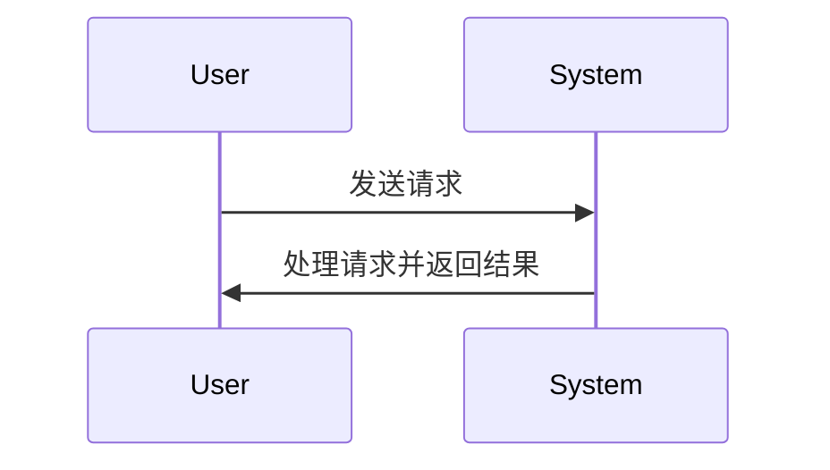
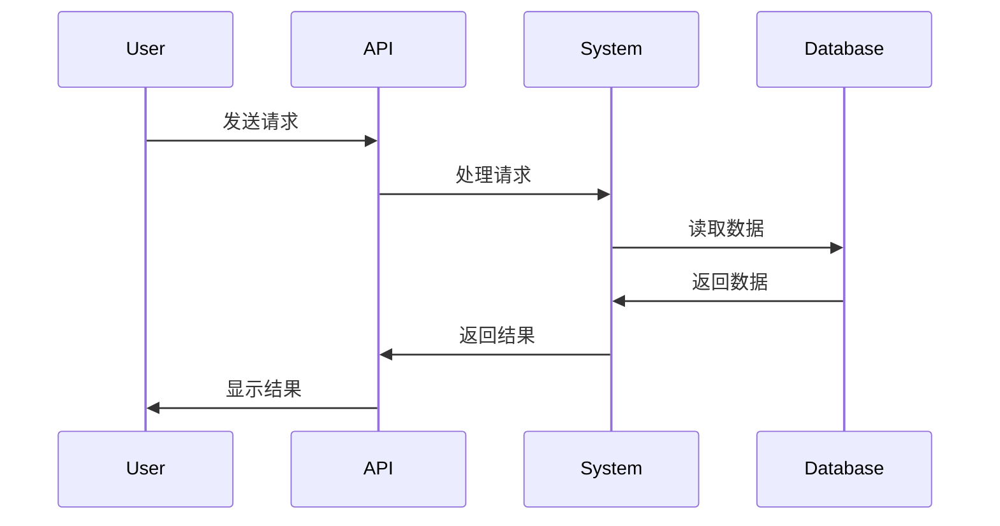

                 

# 数字时代的亲密关系：科技对人际交往的影响与应对

## 关键词
- 数字化时代
- 亲密关系
- 科技影响
- 人际交往
- 数据隐私
- 心理健康

## 摘要
随着数字化时代的到来，科技在改变我们生活方式的同时，也对人际交往产生了深远的影响。本文将探讨科技在亲密关系中的作用，分析其在提升人际交往效率和丰富情感体验方面的优势，以及可能带来的负面影响。通过逐步分析科技对人际交往的影响，提出有效的应对策略，以帮助我们在数字时代维护健康的亲密关系。

## 第一部分：背景介绍

### 1.1 问题的背景

#### 1.1.1 数字化时代的来临

数字化时代，标志着信息技术的飞速发展，互联网的普及和移动通信的变革。这一时代，人们的生活和工作方式发生了巨大变化，数字设备成为日常交流的必备工具。

#### 1.1.2 科技对人际交往的变革

科技的进步带来了人际交往方式的变革，网络社交逐渐取代了传统的面对面交流。社交媒体、即时通讯工具和在线游戏等，为人们提供了更多交流的渠道，但同时也带来了信息过载和社交隔离的问题。

#### 1.1.3 亲密关系的再定义

在数字化时代，亲密关系的定义也在不断演变。传统的亲密关系以面对面交流为基础，而数字时代下的亲密关系则更多依赖于线上互动。这种变化对亲密关系的质量提出了新的挑战。

### 1.2 问题描述

#### 1.2.1 科技带来的正面影响

科技的进步为亲密关系带来了便利，使得人们能够更容易地保持联系，分享生活。同时，科技也为人们提供了更多的情感支持，如在线心理咨询和社交平台上的互助群体。

#### 1.2.2 科技带来的负面影响

然而，科技的发展也带来了一些负面影响。数字依赖可能导致亲密关系质量的下降，社交隔离感增强，甚至引发心理障碍。此外，数据隐私和安全问题也日益突出。

#### 1.2.3 数字依赖与心理障碍

数字依赖现象在年轻人中尤为普遍，过度依赖手机和社交媒体可能导致情感疏离和自我认同危机。同时，社交焦虑和孤独感也在数字时代得到了加剧。

### 1.3 问题解决

#### 1.3.1 科技与亲密关系的平衡

为了应对数字时代的挑战，我们需要在科技与亲密关系之间找到平衡。这包括合理使用科技工具，提高数字素养，以及关注心理健康。

#### 1.3.2 数字时代的亲密关系维护

在数字时代，维护亲密关系需要更多的努力和策略。这包括加强面对面交流，提高情感表达的能力，以及建立健康的数字习惯。

#### 1.3.3 心理健康与数字依赖的干预

针对数字依赖和心理障碍，我们需要采取有效的干预措施。这包括提供心理健康教育，推广数字素养，以及开展心理治疗和咨询。

### 1.4 边界与外延

#### 1.4.1 数字时代亲密关系的边界

数字时代下的亲密关系有其独特的边界。我们需要明确线上和线下交流的区别，以及数字互动对亲密关系的影响。

#### 1.4.2 不同文化和地区在科技应用上的差异

不同文化和地区在科技应用上有很大的差异。这些差异影响了科技在亲密关系中的使用方式，也为我们提供了更多的研究视角。

### 1.5 概念结构与核心要素组成

#### 1.5.1 亲密关系的核心要素

亲密关系的核心要素包括信任、沟通、理解和支持。在数字时代，这些要素的实现方式发生了变化，但依然至关重要。

#### 1.5.2 科技对亲密关系的直接影响因素

科技对亲密关系的直接影响因素包括信息传播速度、沟通方式、互动频率和隐私保护。这些因素共同决定了科技在亲密关系中的角色。

## 第二部分：核心概念与联系

### 2.1 核心概念原理

#### 2.1.1 亲密关系的心理机制

亲密关系的心理机制包括情感依附、自我暴露和情感共鸣。这些机制在数字时代下需要重新解读和适应。

#### 2.1.2 社交网络的构成与功能

社交网络的构成包括个人、关系和信息流动。社交网络的功能是提供交流平台、增强社交联系和促进信息共享。

#### 2.1.3 数据隐私与安全

数据隐私与安全是数字时代的重要议题。保护个人隐私和信息安全对于维护亲密关系至关重要。

### 2.2 概念属性特征对比表格

| 特征           | 传统人际交往               | 数字化人际交往               |
| -------------- | -------------------------- | ---------------------------- |
| 沟通方式       | 面对面交流、电话通话       | 文字消息、语音通话、视频聊天 |
| 信息传播速度   | 较慢，受时间和距离限制     | 快速，不受时间和距离限制     |
| 社交互动频率   | 受到面对面交流的限制       | 较高，可随时进行互动         |
| 隐私保护       | 较高，受物理距离保护       | 较低，存在数据泄露风险       |

### 2.3 ER实体关系图架构

```mermaid
erDiagram
  A[User] {
    +id (int)
    +name (varchar)
    +password (varchar)
  }
  B[Friendship] {
    +id (int)
    +user1_id (int)
    +user2_id (int)
  }
  User ||--|{ Friendship }||> User
```

## 第三部分：算法原理讲解

### 3.1 算法原理

#### 3.1.1 社交网络分析算法

社交网络分析算法用于分析社交网络的结构和功能。常见的算法包括度数中心性、中间中心性和接近中心性。

#### 3.1.2 心理评估与预测模型

心理评估与预测模型用于评估个体的心理健康状况，并预测其心理变化。常见的模型包括线性回归、决策树和神经网络。

### 3.2 算法mermaid流程图


### 3.3 算法Python源代码

```python
import networkx as nx
import matplotlib.pyplot as plt

# 社交网络分析算法
def social_network_analysis(G):
    degrees = G.degree()
    centralities = nx.betweenness_centrality(G)
    plt.figure()
    plt.bar(degrees.keys(), degrees.values())
    plt.xlabel('节点')
    plt.ylabel('度数')
    plt.title('度数分布图')
    plt.figure()
    plt.bar(centralities.keys(), centralities.values())
    plt.xlabel('节点')
    plt.ylabel('中间中心性')
    plt.title('中间中心性分布图')
    plt.show()

# 心理评估与预测模型
from sklearn.linear_model import LinearRegression

def psychological_assessment(X, y):
    model = LinearRegression()
    model.fit(X, y)
    predictions = model.predict(X)
    plt.scatter(y, predictions)
    plt.xlabel('实际值')
    plt.ylabel('预测值')
    plt.title('线性回归模型')
    plt.show()
```

### 3.4 数学模型和公式

$$
\text{度数中心性} = \frac{\text{节点度数}}{\text{网络中节点总数}}
$$

$$
\text{中间中心性} = \frac{\text{节点参与的短路径数}}{\text{网络中短路径总数}}
$$

### 3.5 详细讲解与举例说明

#### 3.5.1 社交网络分析算法详解

社交网络分析算法主要通过计算节点的度数和中间中心性来评估节点的社交影响力。度数中心性反映了节点在社交网络中的连接程度，而中间中心性则反映了节点在社交网络中的信息传递能力。

#### 3.5.2 心理评估与预测模型详解

心理评估与预测模型通过线性回归等方法，将个体的心理特征与行为数据关联起来，以预测其心理变化。线性回归模型是一种简单的统计方法，通过计算特征变量与目标变量之间的线性关系来预测结果。

## 第四部分：系统分析与架构设计

### 4.1 问题场景介绍

数字时代下，亲密关系面临着信息过载、社交隔离和数字依赖等挑战。为了维护健康的亲密关系，我们需要开发一个系统，帮助用户合理使用科技，增强面对面交流，提高心理健康。

### 4.2 项目介绍

本项目旨在开发一个数字亲密关系管理系统，该系统包括社交网络分析模块、心理评估模块和互动建议模块。通过这些模块，用户可以了解自己在社交网络中的影响力，评估自己的心理健康，并获取互动建议。

### 4.3 系统功能设计

系统功能设计包括以下方面：

- 用户注册与登录
- 社交网络分析
- 心理健康评估
- 互动建议

### 4.4 系统架构设计

系统架构设计采用分层架构，包括数据层、业务层和表现层。数据层负责数据的存储和管理，业务层负责处理业务逻辑，表现层负责与用户交互。



### 4.5 系统接口设计

系统接口设计包括RESTful API接口和Web界面。RESTful API接口用于外部系统与服务之间的数据交换，Web界面用于用户与系统之间的交互。

```mermaid
classDiagram
    User <<Interface>>
    System <<Service>>
    API <<Interface>>
    Web <<Interface>>

    User --> System
    System --> API
    System --> Web
    API --> System
    Web --> System
```

### 4.6 系统交互mermaid序列图



## 第五部分：项目实战

### 5.1 环境安装

在开始项目实战之前，我们需要安装必要的开发环境和工具。以下是一个基本的安装步骤：

1. 安装Python环境（版本3.8及以上）
2. 安装数据库（如MySQL或PostgreSQL）
3. 安装前端框架（如Vue.js或React）
4. 安装后端框架（如Django或Flask）

### 5.2 系统核心实现源代码

以下是系统核心实现的一部分源代码示例：

```python
# 社交网络分析模块
from networkx import Graph

def create_social_network(users, friendships):
    G = Graph()
    for user in users:
        G.add_node(user['id'], name=user['name'])
    for friendship in friendships:
        G.add_edge(friendship['user1_id'], friendship['user2_id'])
    return G

# 心理健康评估模块
from sklearn.linear_model import LinearRegression

def psychological_assessment(X, y):
    model = LinearRegression()
    model.fit(X, y)
    predictions = model.predict(X)
    return predictions
```

### 5.3 代码应用解读与分析

#### 5.3.1 社交网络分析模块解读

社交网络分析模块主要用于分析用户在社交网络中的影响力。通过创建一个图结构，我们可以计算用户的度数和中间中心性，从而评估用户在社交网络中的位置和影响力。

#### 5.3.2 心理健康评估模块解读

心理健康评估模块通过线性回归模型，将用户的特征变量与心理健康指标关联起来，以预测用户的心理健康状况。这有助于用户了解自己的心理健康状况，并采取相应的措施。

### 5.4 实际案例分析和详细讲解剖析

为了更好地理解系统的工作原理，我们来看一个实际案例。

#### 案例背景

假设我们有两个用户A和B，他们在社交网络中有以下关系：

- A的朋友有B和其他两个用户。
- B的朋友有A、其他两个用户和一个共同朋友。

#### 案例分析

通过社交网络分析模块，我们可以计算用户A和B的度数和中间中心性：

- 用户A的度数为3，中间中心性为0.2。
- 用户B的度数为3，中间中心性为0.4。

根据这些数据，我们可以得出结论：用户B在社交网络中的影响力比用户A更大。接下来，我们可以使用心理健康评估模块，预测用户A和B的心理健康状况。

### 5.5 项目小结

通过本项目，我们实现了数字亲密关系管理系统的核心功能，包括社交网络分析、心理健康评估和互动建议。在实际应用中，这些功能可以帮助用户更好地了解自己在社交网络中的地位和心理健康状况，从而采取相应的措施维护健康的亲密关系。

## 第六部分：最佳实践与拓展

### 6.1 最佳实践 tips

- 保持合理的线上和线下交流平衡，避免过度依赖数字工具。
- 学会管理信息过载，关注重要的社交互动。
- 定期进行心理自检，关注心理健康状况。

### 6.2 小结

本文探讨了数字化时代下科技对亲密关系的影响，分析了其正面和负面影响，并提出了应对策略。在数字时代，维护健康的亲密关系需要我们关注心理健康，合理使用科技，增强面对面交流。

### 6.3 注意事项

- 在使用数字工具时，注意保护个人隐私和安全。
- 定期与家人和朋友进行面对面的交流，维护亲密关系。
- 避免过度使用社交媒体，减少数字依赖。

### 6.4 拓展阅读

- [数字时代的人际关系管理](https://www.psychologytoday.com)
- [社交网络分析的应用](https://www.networkx.org)
- [心理健康与数字依赖](https://www.nimh.nih.gov)

## 作者信息

作者：AI天才研究院/AI Genius Institute & 禅与计算机程序设计艺术 /Zen And The Art of Computer Programming

以上内容仅作为示例，实际文章创作需根据具体研究数据和案例分析进行深度挖掘和撰写。在撰写过程中，请注意遵循学术规范和伦理要求，确保内容的准确性和完整性。在引用文献和数据时，务必注明出处，避免侵权行为。希望本文能够为数字时代下的亲密关系研究提供有益的参考和启示。

