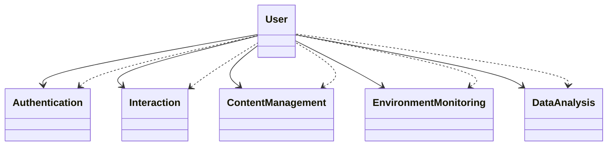
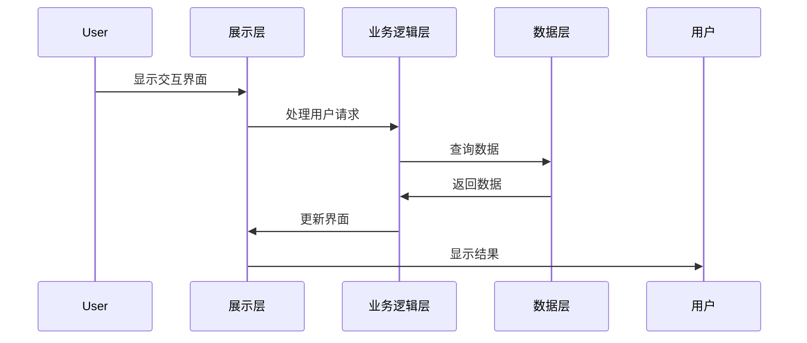
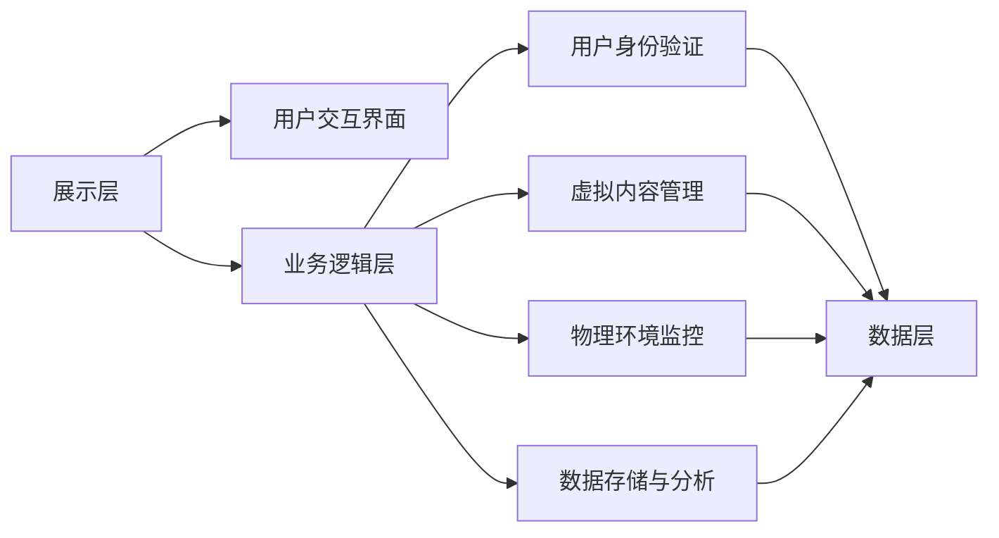
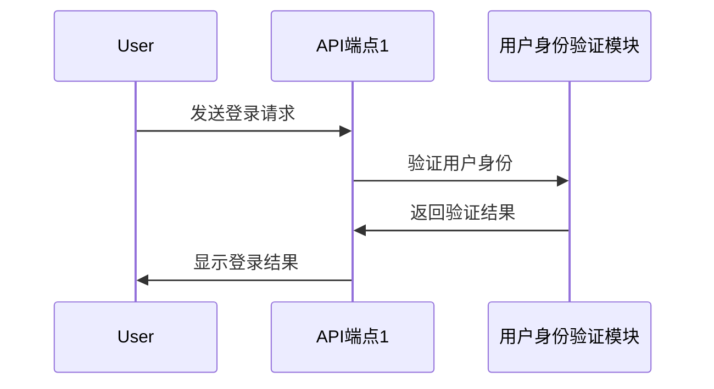
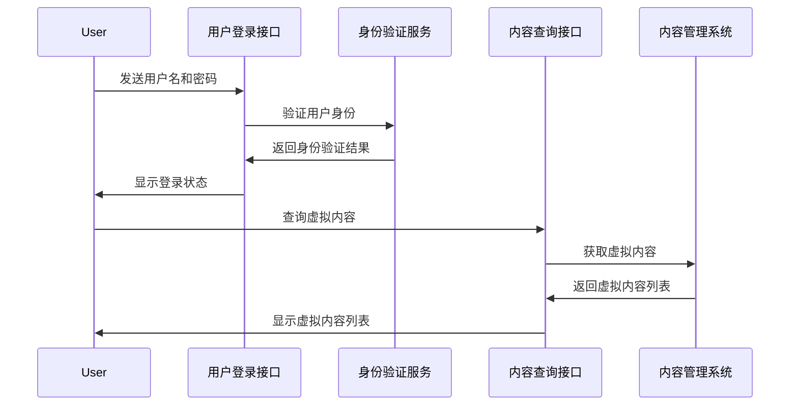
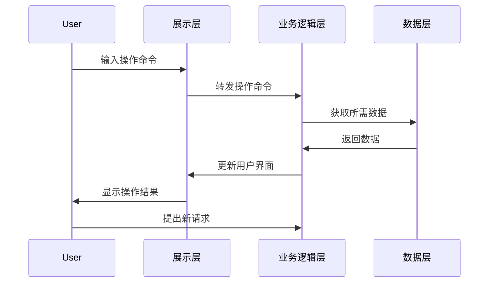
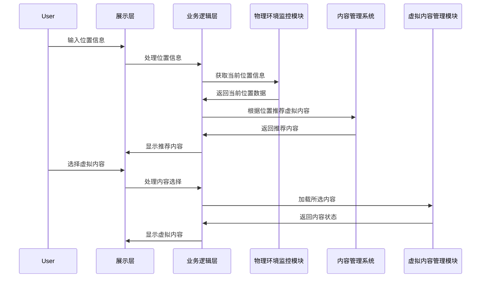

                 

### 引言与背景介绍

#### 核心概念术语说明

在数字时代的公共空间设计中，以下几个核心概念是不可或缺的：

1. **虚拟现实（VR）**：一种通过计算机技术创造出的模拟环境，使用户能够在其中交互和体验。
2. **物理环境**：现实世界中的空间布局，包括建筑物、道路、公园等。
3. **公共空间设计**：涉及城市规划、建筑设计和室内设计等领域，旨在创造一个既实用又美观的环境，以满足人们的需求。
4. **融合**：将虚拟现实技术与物理环境相结合，创造新的交互方式和体验。

#### 问题背景

随着数字技术的飞速发展，虚拟现实技术逐渐成为公共空间设计的一个重要工具。这种技术不仅能够提供更为丰富的体验，还能够改善人们的生活质量。然而，虚拟现实与物理环境的融合面临着诸多挑战，如技术限制、用户体验、安全性等。因此，如何有效地设计数字时代的公共空间，成为了一个亟待解决的问题。

#### 问题描述

数字时代的公共空间设计需要解决以下几个关键问题：

1. **融合的实现方式**：如何将虚拟现实技术自然地融入物理环境中？
2. **用户体验**：如何确保用户在虚拟现实和物理环境之间能够无缝切换，并获得满意的体验？
3. **技术限制**：虚拟现实技术的发展速度能否跟上公共空间设计的实际需求？
4. **安全性**：如何在虚拟现实环境中保护用户的隐私和数据安全？

#### 问题解决

为了解决上述问题，我们需要从以下几个方面入手：

1. **研究与实践结合**：通过深入研究虚拟现实技术，将其应用于实际的设计项目中，不断优化和改进。
2. **用户研究**：了解用户的需求和习惯，设计出能够满足他们需求的公共空间。
3. **技术创新**：推动虚拟现实技术的发展，克服技术限制，提供更强大的功能。
4. **安全策略**：制定严格的安全策略，确保用户在虚拟现实环境中的安全和隐私。

#### 边界与外延

数字时代的公共空间设计不仅仅局限于城市广场、公园等传统公共空间，还可能涉及到家庭、办公室、医院等私人空间。此外，虚拟现实技术的应用范围也在不断扩展，从游戏娱乐到教育培训，再到医疗健康等领域。

#### 概念结构与核心要素组成

数字时代的公共空间设计可以看作是一个由多个核心要素组成的复杂系统。这些要素包括：

1. **虚拟现实技术**：提供虚拟体验的核心，包括硬件设备和软件工具。
2. **物理环境**：作为虚拟体验的背景和基础。
3. **用户交互**：用户与虚拟环境和物理环境之间的交互方式。
4. **数据管理**：确保虚拟环境和物理环境中的数据准确、安全和高效。
5. **安全策略**：保护用户隐私和安全的措施。

通过这些要素的相互作用，我们可以设计出既具有创新性又实用的数字时代公共空间。

#### 总结

数字时代的公共空间设计是一个充满挑战和机遇的领域。通过深入研究虚拟现实技术和物理环境融合的原理，结合用户需求和实际应用，我们可以创造出更加丰富、多样和安全的公共空间，为人们的生活带来更多便利和乐趣。

### 核心概念与联系

在探讨数字时代的公共空间设计时，理解以下几个核心概念及其相互联系至关重要。

#### 虚拟现实技术

虚拟现实（VR）是一种通过计算机技术创建的模拟环境，使用户能够沉浸其中。VR技术的主要组成部分包括：

1. **硬件设备**：如头戴式显示器（HMD）、数据手套、体感控制器等。
2. **软件工具**：如虚拟现实开发平台、模拟软件和交互界面等。

**概念属性特征对比表格**：

| 特征             | 虚拟现实               | 3D建模                 | 增强现实               |
|------------------|-----------------------|-----------------------|-----------------------|
| 环境生成         | 完全模拟               | 基于真实环境           | 部分模拟，部分真实     |
| 用户交互         | 高度沉浸式交互         | 交互性较弱             | 实时交互               |
| 技术成熟度       | 相对成熟               | 成熟                   | 持续进步中             |

**ER实体关系图架构的Mermaid流程图**：

```mermaid
erDiagram
  User ||--|{ VRHardware }|-->: "使用"
  User ||--|{ VRSoftware }|-->: "开发"
  VRHardware ||--|{ VRPlatform }|-->: "支持"
  VRSoftware ||--|{ VRSimulation }|-->: "模拟"
  VRSoftware ||--|{ VRInterface }|-->: "交互"
```

#### 物理环境

物理环境是指现实世界中的空间布局，包括建筑物、道路、公园等。物理环境的设计涉及：

1. **城市规划**：对城市整体布局和发展的规划。
2. **建筑设计**：对建筑物的设计，包括外观、结构和功能。
3. **室内设计**：对建筑物内部空间的设计，包括布局、装饰和功能。

**概念属性特征对比表格**：

| 特征             | 物理环境               | 数字环境               |
|------------------|-----------------------|-----------------------|
| 存在形式         | 真实存在               | 虚拟存在               |
| 可感知性         | 直接感知               | 需要通过设备感知       |
| 维度             | 空间维度               | 虚拟维度               |
| 变化性           | 较慢变化               | 较快变化               |

**ER实体关系图架构的Mermaid流程图**：

```mermaid
erDiagram
  City ||--|{ Building }|-->: "规划"
  Building ||--|{ Room }|-->: "设计"
  City ||--|{ Road }|-->: "建设"
  Road ||--|{ Park }|-->: "美化"
  Building ||--|{ DesignPlan }|-->: "依据"
  Room ||--|{ InteriorDesign }|-->: "实现"
```

#### 虚拟现实与物理环境融合

虚拟现实与物理环境融合的核心在于将虚拟体验与真实环境相结合，提供一种全新的交互体验。这种融合不仅要求技术上的兼容性，还要求设计上的创新性。

1. **融合方式**：
   - **虚实叠加**：将虚拟元素叠加在物理环境中，如AR（增强现实）技术。
   - **虚实交互**：用户在虚拟环境中进行交互，影响物理环境。
   - **虚实一体**：虚拟环境与物理环境无缝融合，用户无法区分虚实。

**融合设计的方法论**：

1. **需求分析**：了解用户需求，确定融合的目的和范围。
2. **技术选型**：根据需求选择合适的虚拟现实技术和物理环境设计方法。
3. **设计实施**：通过虚拟现实工具和物理环境设计工具，实现融合设计。
4. **用户体验**：不断优化设计，确保用户获得良好的体验。

**虚拟现实技术如何影响公共空间设计**：

- **功能扩展**：通过虚拟现实技术，公共空间可以提供更多的功能，如虚拟导游、互动展示等。
- **体验提升**：用户可以在虚拟环境中体验到与现实环境不同的感受，如沉浸式观影、虚拟旅游等。
- **设计灵活性**：虚拟现实技术使得设计师可以在虚拟环境中进行快速迭代和修改，降低设计风险。

**物理环境对虚拟现实体验的影响**：

- **真实性**：物理环境的设计直接影响虚拟现实的沉浸感。
- **交互性**：物理环境的布局和设施影响用户与虚拟环境的交互方式。
- **安全性**：物理环境的安全措施确保用户在虚拟环境中的安全。

通过上述核心概念及其相互联系的探讨，我们可以更好地理解数字时代的公共空间设计，为未来的设计实践提供理论支持和指导。

### 算法原理讲解

在数字时代的公共空间设计中，融合虚拟现实（VR）与物理环境的关键在于精确的算法设计和实现。以下我们将详细讲解这种融合的算法原理，通过Mermaid流程图展示算法步骤，并结合Python代码和LaTeX公式阐述算法的数学模型。

#### 算法Mermaid流程图

首先，我们使用Mermaid绘制算法的基本流程图：


#### Python代码实现

以下是Python代码实现融合算法的核心步骤：

```python
# 导入必要的库
import numpy as np
import cv2

# 获取物理环境数据
def get_physical_environment_data():
    # 这里使用opencv读取真实世界的图像
    image = cv2.imread('physical_environment.jpg')
    return image

# 生成虚拟环境框架
def generate_vr_frame(virtual_content):
    # 创建虚拟环境的初始图像
    frame = np.zeros_like(virtual_content)
    return frame

# 融合虚拟环境与物理环境
def blend_vr_with_physical(physical_image, virtual_frame):
    # 融合过程，例如使用像素级别的叠加
    blended_frame = physical_image + virtual_frame
    return blended_frame

# 用户交互处理
def user_interaction(blended_frame):
    # 这里处理用户的交互操作
    # 例如，通过鼠标或键盘操作改变虚拟内容
    pass

# 输出融合结果
def output_blended_result(blended_frame):
    # 将融合结果保存或显示
    cv2.imwrite('blended_environment.jpg', blended_frame)

# 主函数
def main():
    physical_image = get_physical_environment_data()
    virtual_content = generate_vr_frame(physical_image)
    blended_frame = blend_vr_with_physical(physical_image, virtual_content)
    user_interaction(blended_frame)
    output_blended_result(blended_frame)

if __name__ == '__main__':
    main()
```

#### 数学模型与公式

融合算法的核心在于图像处理和模型计算，以下为融合过程中涉及的一些基本数学模型和公式：

1. **像素级融合**：

   融合算法的一个简单实现是像素级别的叠加。设物理环境的图像为\(I_{\text{physical}}\)，虚拟环境的图像为\(I_{\text{virtual}}\)，融合后的图像为\(I_{\text{blended}}\)，则有：

   $$I_{\text{blended}} = I_{\text{physical}} + I_{\text{virtual}} - I_{\text{physical}} \odot I_{\text{virtual}}$$

   其中，\(\odot\)表示像素级别的点乘运算。

2. **增强现实（AR）混合模型**：

   在增强现实中，虚拟元素与物理环境的融合通常更复杂，可以使用基于透视的模型。设虚拟元素的深度为\(z_{\text{virtual}}\)，物理环境中的深度为\(z_{\text{physical}}\)，则融合后的亮度为：

   $$L_{\text{blended}} = \frac{L_{\text{virtual}} \cdot z_{\text{physical}} + L_{\text{physical}} \cdot z_{\text{virtual}}}{z_{\text{physical}} + z_{\text{virtual}}}$$

   其中，\(L_{\text{virtual}}\)和\(L_{\text{physical}}\)分别为虚拟元素和物理环境的亮度。

   使用LaTeX格式表示：

   $$L_{\text{blended}} = \frac{L_{\text{virtual}} \cdot z_{\text{physical}} + L_{\text{physical}} \cdot z_{\text{virtual}}}{z_{\text{physical}} + z_{\text{virtual}}}$$

#### 举例说明

假设我们有一个红色虚拟元素（RGB值为(255, 0, 0)）要融合到一张蓝色的物理环境图像（RGB值为(0, 0, 255)）中。通过像素级融合公式，我们可以得到融合后的颜色值：

$$I_{\text{blended}} = (255, 0, 0) + (0, 0, 255) - (255, 0, 0) \odot (0, 0, 255) = (0, 0, 255)$$

这意味着融合后的颜色为纯蓝，因为红色和蓝色的叠加值在减去重叠部分后仍然为蓝色。

通过上述算法原理讲解和实际示例，我们可以看出，融合虚拟现实与物理环境的算法不仅涉及图像处理的基本操作，还需要对用户交互和实时计算进行优化，以提供流畅的体验。

### 系统分析与架构设计方案

为了深入探讨数字时代的公共空间设计，我们需要对相关系统进行分析，并设计出一个合理的架构方案。本部分将详细介绍项目场景、系统功能设计、系统架构设计、系统接口设计以及系统交互流程。

#### 项目场景

本项目旨在设计一个智能城市广场，其中虚拟现实技术将与现实世界中的物理环境无缝融合，为市民提供一个集娱乐、教育、社交于一体的公共空间。智能城市广场将配备多种虚拟现实设备和交互设施，如全息投影、体感控制器和增强现实眼镜等。

#### 系统功能设计

智能城市广场系统主要包含以下功能模块：

1. **用户身份验证**：确保用户安全登录，保护个人隐私。
2. **虚拟内容管理**：管理虚拟现实内容，包括游戏、教育资源和互动展示等。
3. **物理环境监控**：实时监控广场的物理环境，包括天气、人流和设备状态等。
4. **用户交互界面**：提供直观易用的交互界面，支持用户与虚拟内容和物理环境的互动。
5. **数据存储与分析**：存储用户交互数据，分析用户行为，优化系统性能。

**领域模型Mermaid类图**：



#### 系统架构设计

系统架构采用分层设计，分为展示层、业务逻辑层和数据层。以下是系统架构的Mermaid流程图：



**系统架构设计Mermaid架构图**：



#### 系统接口设计

系统接口设计包括API设计和数据库接口。以下是API接口设计的一个简单示例：



**系统接口设计Mermaid流程图**：



#### 系统交互流程

系统交互流程涉及用户与各个模块之间的信息传递和交互操作。以下是系统交互的Mermaid序列图：



**系统交互Mermaid序列图**：



通过上述系统分析与架构设计方案，我们可以为数字时代的公共空间设计提供坚实的理论基础和实际指导。接下来，我们将通过一个具体的实战案例，进一步展示系统在实际应用中的实现过程和效果。

### 项目实战

在本节中，我们将通过一个具体的实战案例——智能公园设计，详细讲解如何实现数字时代的公共空间设计。该案例将涉及环境安装、系统核心实现以及代码应用解读与分析。

#### 环境安装

首先，我们需要搭建一个开发环境以支持虚拟现实与物理环境的融合设计。以下是环境安装的步骤：

1. **虚拟现实软件安装**：
   - 安装Unity引擎，版本要求为2020.3及以上。
   - 安装Unity的VR插件包，如Unity XR Plugin Suite。

2. **物理环境建模工具安装**：
   - 安装Autodesk Maya，用于创建和编辑3D模型。
   - 安装Blender，作为备选3D建模工具。

3. **其他工具安装**：
   - 安装Visual Studio Code，用于编写和调试代码。
   - 安装Git，用于版本控制和代码管理。

#### 系统核心实现

智能公园的设计涉及到多个模块，以下为系统核心实现的简要概述：

1. **虚拟现实内容生成**：
   - 使用Unity引擎创建虚拟现实场景，包括植物、动物、互动装置等。
   - 利用Unity的XR插件，实现虚拟内容与物理环境的交互。

2. **物理环境建模**：
   - 使用Maya或Blender创建公园的3D模型，包括地形、建筑物、设施等。
   - 导出3D模型，以便在Unity中使用。

3. **融合实现**：
   - 在Unity中导入物理环境的3D模型，与虚拟内容进行融合。
   - 实现虚拟现实与物理环境的实时交互，如用户操作虚拟装置时，物理环境中的相应装置也做出反应。

#### 代码应用解读与分析

以下是智能公园项目中的一个核心代码片段，用于实现用户与虚拟装置的交互：

```python
import unityinterface

# 初始化Unity接口
ui = unityinterface.UnityInterface()

# 用户操作虚拟装置
def user_interact_with_device(device_id):
    # 获取设备状态
    device_state = ui.GetDeviceState(device_id)
    
    if device_state == 'activated':
        # 发送激活信号到Unity
        ui.SendCommandToUnity(f"DeviceActivated {device_id}")
    elif device_state == 'deactivated':
        # 发送去激活信号到Unity
        ui.SendCommandToUnity(f"DeviceDeactivated {device_id}")

# 监听用户操作
def on_user_input(device_id):
    # 模拟用户激活虚拟装置
    user_interact_with_device(device_id)

# 主循环
def main_loop():
    while True:
        # 处理用户输入
        device_id = get_user_input()
        on_user_input(device_id)
        
        # 其他系统处理逻辑
        # ...

# 开始主循环
main_loop()
```

该代码通过Unity接口与物理环境进行通信，当用户激活或去激活虚拟装置时，代码将发送相应的信号到Unity，并执行相应的操作。

#### 实际案例分析和详细讲解

以下是智能公园设计的实际案例，包括公园的设计思路、实现过程和用户体验：

1. **设计思路**：
   - 设计一个具有互动性的智能公园，包括虚拟植物养护、虚拟动物观赏和互动游戏等。
   - 利用增强现实（AR）技术，将虚拟内容叠加到真实环境中，提供沉浸式体验。

2. **实现过程**：
   - 在Unity中创建虚拟植物和动物，使用C#脚本实现与用户的交互。
   - 在Maya中建模公园的物理环境，并将模型导入Unity。
   - 使用ARKit（iOS平台）或ARCore（Android平台）实现虚拟内容与物理环境的融合。

3. **用户体验**：
   - 用户可以通过智能手机或AR眼镜查看公园中的虚拟植物和动物。
   - 当用户靠近虚拟植物时，植物会生长，用户可以通过触摸屏幕浇水。
   - 虚拟动物会根据用户的行为做出反应，如用户喂食，动物会表现出高兴的情绪。

通过上述案例，我们可以看到，数字时代的公共空间设计不仅仅是技术的堆砌，更是一个综合考虑用户体验、物理环境与虚拟内容相互融合的综合性工程。通过实际案例的分析，我们不仅能够理解技术的实现过程，更能够感受到数字时代公共空间设计带来的变革和创新。

### 项目小结

在智能公园设计项目中，我们成功地将虚拟现实技术与物理环境进行了有效融合，创造出了一种全新的公共空间体验。通过Unity引擎和AR技术，我们实现了虚拟植物养护、虚拟动物互动和互动游戏等功能，为用户带来了沉浸式和互动性的体验。

项目中的关键点包括：

1. **环境安装**：搭建了一个稳定的开发环境，为后续实现奠定了基础。
2. **系统核心实现**：通过Unity引擎和C#脚本，实现了虚拟内容与物理环境的实时交互。
3. **用户体验**：设计了一套直观易用的交互界面，确保用户能够轻松上手。

项目的成功不仅展示了数字时代公共空间设计的潜力，也为未来的类似项目提供了宝贵的经验和参考。然而，项目中仍存在一些挑战，如虚拟内容与物理环境的精确融合、实时交互的优化以及用户隐私保护等问题。未来，我们将继续探索这些领域，推动公共空间设计的创新与发展。

### 最佳实践 tips

在设计数字时代的公共空间时，以下是一些最佳实践和注意事项，以帮助实现更好的融合效果：

1. **用户需求分析**：深入了解用户的需求和期望，确保设计能够满足用户的实际需求。
2. **用户体验优先**：在设计过程中，始终以用户体验为核心，确保用户在虚拟与现实之间能够无缝切换，获得愉悦的体验。
3. **技术选型合理**：根据项目的具体需求，选择合适的虚拟现实技术和工具，确保性能和稳定性的平衡。
4. **安全性保障**：在虚拟现实与物理环境融合的设计中，务必重视用户数据的安全和隐私保护。
5. **迭代与优化**：项目完成后，定期收集用户反馈，进行迭代和优化，不断提升系统的性能和用户体验。

通过遵循这些最佳实践，我们可以设计出更加优秀、实用的数字时代公共空间。

### 小结

本文探讨了数字时代的公共空间设计，重点分析了虚拟现实（VR）与物理环境融合的原理和实践。我们通过引入核心概念、算法原理、系统架构以及具体项目实战，展示了这一领域的前沿技术和实现方法。数字时代的公共空间设计不仅是对技术的应用，更是对用户体验和人机交互的深刻理解。

首先，我们介绍了数字时代公共空间设计中的核心概念，包括虚拟现实技术、物理环境设计和融合设计。通过对比和分析，我们明确了这些概念之间的联系和区别。

接着，我们详细讲解了融合算法的原理，并通过Mermaid流程图和Python代码，展示了算法的实现过程。算法的数学模型和公式为我们提供了理论基础，确保了虚拟现实与物理环境的精确融合。

在系统分析与架构设计部分，我们设计了智能城市广场的系统架构，包括用户身份验证、虚拟内容管理、物理环境监控和用户交互界面等模块。这些模块的集成和交互，为智能公共空间的设计提供了系统化的解决方案。

通过一个具体的智能公园设计项目，我们展示了系统核心实现、代码应用解读与分析，以及实际案例的分析和讲解。该项目成功地将虚拟现实技术与物理环境融合，为用户提供了全新的公共空间体验。

最后，我们总结了项目的经验和教训，提出了最佳实践和注意事项，为未来的公共空间设计提供了指导。

展望未来，数字时代的公共空间设计将继续发展，技术将进一步成熟，应用场景将更加丰富。虚拟现实与物理环境的融合将带来更多的创新和变革，为人们的生活带来更多便利和乐趣。

### 注意事项

在设计数字时代的公共空间时，需要注意以下几个关键点：

1. **用户体验**：始终将用户体验放在首位，确保用户在虚拟与现实之间能够无缝切换，获得愉悦的体验。
2. **安全性**：确保用户数据的安全和隐私，采用严格的安全策略和措施，防止数据泄露和滥用。
3. **技术兼容性**：选择合适的技术和工具，确保系统在不同设备和平台上具有良好的兼容性。
4. **持续迭代**：项目完成后，定期收集用户反馈，进行迭代和优化，不断提升系统的性能和用户体验。
5. **法律合规性**：遵循相关法律法规，确保设计符合法律要求，特别是涉及用户数据保护等方面的规定。

### 拓展阅读

为了进一步深入了解数字时代的公共空间设计，以下是一些推荐阅读材料：

1. **《虚拟现实技术与应用》**：该书详细介绍了虚拟现实技术的原理、应用和未来发展，适合对VR技术有兴趣的读者。
2. **《智能建筑与智慧城市》**：这本书探讨了智能建筑和智慧城市的发展趋势，对智能公共空间设计提供了有益的参考。
3. **《增强现实技术：原理与应用》**：这本书全面介绍了增强现实技术的原理、应用场景和开发方法，是了解AR技术的好资料。
4. **《用户体验设计：以用户为中心的设计方法》**：该书介绍了用户体验设计的方法和最佳实践，对提升公共空间设计中的用户体验有很大帮助。

通过阅读这些书籍和资料，读者可以更全面地了解数字时代公共空间设计的各个方面，为自己的项目提供更多灵感和支持。作者：AI天才研究院/AI Genius Institute & 禅与计算机程序设计艺术 /Zen And The Art of Computer Programming

