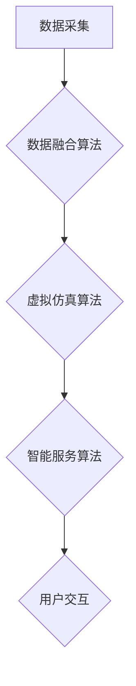

                 

# 数字时代的公共空间重塑：虚拟与现实的交互

> 关键词：数字时代、公共空间、虚拟现实交互、重塑、设计实践

> 摘要：随着数字技术的迅猛发展，虚拟与现实之间的界限愈发模糊。本文旨在探讨数字时代公共空间的重塑过程，分析虚拟与现实的交互机制，提出具体的改造策略和实践路径。通过深入剖析教育、医疗、城市管理等领域应用案例，展望公共空间重塑的未来发展趋势和挑战。

## 目录大纲

### 第一部分：引言与背景

#### 第1章 问题背景与核心概念

1.1 数字时代的公共空间重塑概述

1.2 虚拟与现实的交互：挑战与机遇

1.3 公共空间重塑的重要性

1.4 本书结构安排与内容概述

### 第二部分：虚拟空间的构建与重塑

#### 第2章 虚拟空间的构建原理

2.1 虚拟空间的基础设施

2.2 虚拟空间的交互机制

2.3 虚拟空间的核心要素

### 第三部分：现实空间的改造与优化

#### 第3章 现实空间的改造策略

3.1 现实空间的问题分析

3.2 现实空间的改造方法

3.3 现实空间与虚拟空间的整合

#### 第4章 虚拟与现实的交互设计

4.1 虚拟与现实交互的原理

4.2 虚拟与现实交互的设计方法

4.3 虚拟与现实交互的案例分析

### 第四部分：公共空间重塑的实践与应用

#### 第5章 公共空间重塑的实践路径

5.1 公共空间重塑的实践流程

5.2 公共空间重塑的成功案例

5.3 公共空间重塑的难点与应对策略

#### 第6章 公共空间重塑的应用领域

6.1 教育领域的应用

6.2 医疗领域的应用

6.3 城市管理领域的应用

#### 第7章 公共空间重塑的未来展望

7.1 公共空间重塑的未来趋势

7.2 公共空间重塑的挑战与机遇

7.3 公共空间重塑的发展方向

### 第五部分：结论与展望

#### 第8章 本书总结与展望

8.1 主要研究成果总结

8.2 研究中存在的问题与不足

8.3 未来研究方向与展望

## 第一部分：引言与背景

### 1.1 数字时代的公共空间重塑概述

随着互联网、大数据、人工智能等数字技术的发展，我们正进入一个前所未有的数字时代。这一时代的一个显著特征是虚拟与现实的融合，传统的公共空间面临着前所未有的挑战和机遇。公共空间，不仅仅是城市广场、公园、商业街区等物理空间，还包括在线社区、虚拟现实（VR）、增强现实（AR）等数字空间。

数字时代的公共空间重塑，指的是通过数字技术的应用，对传统公共空间进行优化、改造和升级，使其更加智能化、便捷化、互动化。这一重塑过程不仅涉及到基础设施的升级，还包括社会、文化、经济等多个层面的变革。

### 1.2 虚拟与现实的交互：挑战与机遇

虚拟与现实的交互是数字时代公共空间重塑的核心。虚拟空间提供了无限的可能性，如虚拟社交、虚拟旅游、在线教育等，而现实空间则承载了人们的日常生活和工作。两者之间的交互不仅改变了人们的生活方式，也带来了新的挑战：

**挑战：**
- **隐私保护：** 在虚拟空间中，个人隐私容易受到侵犯。如何确保虚拟与现实的交互过程中个人隐私的安全，是一个亟待解决的问题。
- **安全风险：** 虚拟空间可能成为网络犯罪的新温床，如网络诈骗、信息泄露等。
- **技术依赖：** 过度依赖数字技术可能导致现实世界中的面对面交流减少，影响人际关系。

**机遇：**
- **效率提升：** 数字技术的应用可以显著提升公共空间的管理和服务效率。
- **创新空间：** 虚拟与现实的交互为各种创新提供了可能，如数字艺术、虚拟会展等。
- **资源共享：** 通过数字技术，公共空间的资源可以实现更高效的共享和利用。

### 1.3 公共空间重塑的重要性

公共空间重塑不仅是技术进步的体现，更是社会发展的需要。它的重要性体现在以下几个方面：

- **提升生活质量：** 通过优化公共空间，可以提升居民的生活质量，促进健康、幸福和可持续发展。
- **推动经济发展：** 公共空间的重塑可以带动相关产业的发展，如数字经济、创意产业等。
- **促进社会融合：** 虚拟与现实的交互有助于打破地理和文化的隔阂，促进不同群体之间的交流与融合。
- **保障社会安全：** 通过数字技术的应用，公共空间的安全性和管理能力可以得到显著提升。

### 1.4 本书结构安排与内容概述

本书将从以下几个方面对数字时代公共空间的重塑进行深入探讨：

- **引言与背景：** 介绍数字时代公共空间重塑的背景和核心概念，分析虚拟与现实的交互带来的挑战与机遇。
- **虚拟空间的构建与重塑：** 详细探讨虚拟空间的构建原理、交互机制和核心要素。
- **现实空间的改造与优化：** 分析现实空间的问题，提出改造策略和优化方法。
- **公共空间重塑的实践与应用：** 通过具体案例，展示公共空间重塑的实践路径和成功经验。
- **未来展望：** 探讨公共空间重塑的未来发展趋势、挑战和方向。

接下来，我们将分章节详细讨论这些主题，通过逐步分析，为读者提供深入理解和实践经验。## 第2章 虚拟空间的构建原理

虚拟空间，作为数字时代的重要组成部分，其构建原理是理解公共空间重塑的关键。这一章将详细探讨虚拟空间的基础设施、交互机制及其核心要素。

### 2.1 虚拟空间的基础设施

虚拟空间的基础设施是其正常运行的核心。这些基础设施包括但不限于以下几个方面：

- **计算资源：** 虚拟空间需要强大的计算资源来支持各种应用，如云计算、分布式计算等。
- **存储资源：** 大量数据的存储和快速访问是虚拟空间的基础，包括分布式存储、云存储等。
- **网络设施：** 高速、稳定的网络连接是虚拟空间互联互通的保障，如5G网络、光纤网络等。
- **硬件设施：** 包括虚拟现实头盔、智能设备等，这些硬件为用户提供沉浸式体验。

**案例：** 以虚拟现实（VR）为例，一个典型的虚拟空间基础设施可能包括高性能的VR头显、高性能的GPU服务器、高速网络连接以及大量的虚拟场景数据存储。

### 2.2 虚拟空间的交互机制

虚拟空间的交互机制是其用户参与和体验的核心。以下是几种常见的交互机制：

- **图形用户界面（GUI）：** 通过视觉元素和交互界面，用户可以与虚拟环境进行直观交互。
- **自然语言处理（NLP）：** 通过语音识别和自然语言理解，用户可以以语音形式与虚拟环境交互。
- **物理感知：** 通过传感器和动作捕捉技术，用户的行为和情感可以反馈到虚拟环境中。
- **虚拟现实（VR）/增强现实（AR）：** VR提供完全沉浸式的体验，而AR则将虚拟内容叠加到现实环境中。

**案例：** 在一个虚拟会议室中，参与者可以通过VR头显进入一个三维空间，通过自然语言处理系统进行交流，同时利用虚拟手柄进行互动，如手势控制会议议程或共享文件。

### 2.3 虚拟空间的核心要素

虚拟空间的核心要素包括以下几个方面：

- **用户体验（UX）：** 用户体验是虚拟空间设计的核心，包括界面设计、交互流程和沉浸感等。
- **数据管理：** 虚拟空间中涉及大量的用户数据，如何有效管理和保护这些数据是关键。
- **安全性：** 虚拟空间需要确保用户数据的安全，包括身份验证、数据加密和网络安全等。
- **可扩展性：** 虚拟空间应具备良好的扩展性，以适应不断变化的需求和技术进步。

**案例：** 在虚拟旅游应用中，用户体验至关重要。用户可以通过高清晰度的图像和音效感受到虚拟景点的细节，同时应用应确保用户数据的隐私和安全，并提供丰富的互动功能，如观看360度视频、参与虚拟购物等。

**核心概念与联系：**

为了更好地理解虚拟空间的核心概念，我们引入以下概念：

- **虚拟现实（VR）：** 模拟出一个完全沉浸式的三维环境。
- **增强现实（AR）：** 将虚拟信息叠加到现实环境中。
- **混合现实（MR）：** 结合VR和AR的特点，提供更加真实的沉浸式体验。

| 概念       | 定义                                                         | 关联性                                                       |
|------------|--------------------------------------------------------------|--------------------------------------------------------------|
| 虚拟现实（VR） | 模拟出一个完全沉浸式的三维环境。                             | VR是虚拟空间的一种形式，提供了高度沉浸的交互体验。           |
| 增强现实（AR） | 将虚拟信息叠加到现实环境中。                                | AR扩展了用户的感知能力，使虚拟信息与真实世界相结合。         |
| 混合现实（MR） | 结合VR和AR的特点，提供更加真实的沉浸式体验。                 | MR融合了VR和AR的优势，为用户提供更加丰富和互动的体验。       |

**ER实体关系图架构的Mermaid流程图：**

```mermaid
erDiagram
  User ||--|{ VirtualSpace }|>>
  VirtualSpace ||--|{ Interaction }|>>
  Interaction ||--|{ Security }|>>
  Security ||--|{ DataManagement }|>>
  DataManagement ||--|{ UXDesign }|>>
```

通过上述ER图，我们可以清晰地看到用户、虚拟空间、交互、安全、数据管理和用户体验等核心要素之间的关联性。

### 2.4 总结

虚拟空间的构建原理包括基础设施、交互机制和核心要素。基础设施建设提供了计算、存储和网络支持，交互机制则实现了用户与虚拟环境之间的互动，而核心要素确保了用户体验、数据安全和系统可扩展性。理解这些原理有助于我们更好地设计、开发和优化虚拟空间，从而推动公共空间的重塑。

## 第3章 现实空间的改造策略

现实空间作为人们日常生活和工作的场所，其改造策略对于公共空间的重塑至关重要。这一章将分析现实空间的问题，提出改造方法，并探讨现实空间与虚拟空间的整合。

### 3.1 现实空间的问题分析

现实空间存在的问题多种多样，主要包括以下几个方面：

- **交通拥堵：** 随着城市化进程的加快，交通拥堵问题日益严重，影响居民的日常生活和工作效率。
- **环境污染：** 现实空间的环境污染问题严重，如空气污染、水体污染等，威胁居民的健康。
- **资源浪费：** 现实空间中存在大量的资源浪费现象，如能源浪费、水资源浪费等。
- **公共服务不足：** 现实空间中部分公共服务的供给不足，如医疗、教育等，影响了居民的生活质量。

**案例：** 在城市中心区域，由于商业活动和人口的集中，交通拥堵现象尤为严重。高峰时段，主要干道的车辆拥堵导致通勤时间延长，影响了居民的正常生活和商业活动的效率。

### 3.2 现实空间的改造方法

针对上述问题，现实空间的改造可以从以下几个方面进行：

- **智能交通系统：** 利用物联网、大数据等技术，实现交通流量的实时监测和智能调度，缓解交通拥堵。
- **绿色环保措施：** 推广使用清洁能源、建设绿色建筑、实施垃圾分类等，减少环境污染。
- **资源优化管理：** 通过智能化手段，提高能源、水资源等的利用效率，减少浪费。
- **公共服务提升：** 通过数字技术，提升医疗、教育等公共服务的供给质量和效率。

**案例：** 在北京市，通过实施“智慧交通”项目，利用大数据和人工智能技术，对交通流量进行实时监测和智能调控，有效缓解了城市交通拥堵问题。同时，北京市还推广使用新能源公交车，减少了空气污染。

### 3.3 现实空间与虚拟空间的整合

现实空间与虚拟空间的整合是公共空间重塑的关键步骤。这种整合不仅能够提升现实空间的管理和服务水平，还能为虚拟空间提供更多的应用场景。

- **数据融合：** 通过物联网技术，将现实空间的各类数据（如交通流量、环境数据等）实时传输到虚拟空间，实现数据共享和协同管理。
- **虚拟仿真：** 利用虚拟现实（VR）和增强现实（AR）技术，为现实空间中的复杂问题提供虚拟仿真解决方案，如城市规划、建筑设计等。
- **智能化服务：** 通过虚拟空间的技术手段，为现实空间提供智能化服务，如在线医疗咨询、智能教育等。

**案例：** 在一些大型购物中心，通过安装智能导购系统，结合虚拟现实技术，为顾客提供沉浸式的购物体验。顾客可以通过虚拟试衣镜选择服装，并通过手机应用实时获取商品信息，从而提升购物体验。

**算法原理讲解：**

为了更好地实现现实空间与虚拟空间的整合，我们可以使用以下算法原理：

1. **数据融合算法：** 使用物联网技术，实时采集现实空间中的各类数据，并通过数据融合算法，将这些数据进行整合和处理。例如，使用K均值聚类算法对交通流量数据进行分析，以识别拥堵区域。

2. **虚拟仿真算法：** 利用VR和AR技术，构建虚拟仿真模型，模拟现实空间中的各种场景。例如，使用三维建模软件（如Blender）创建建筑模型，并通过VR设备为用户提供沉浸式体验。

3. **智能服务算法：** 通过机器学习和自然语言处理技术，为现实空间中的用户提供智能化服务。例如，使用决策树算法为医疗咨询系统提供诊断建议，使用聊天机器人提供在线客服。

**Mermaid流程图：**



通过上述算法原理和流程图，我们可以清晰地看到现实空间与虚拟空间整合的基本思路和步骤。

### 3.4 总结

现实空间的改造策略包括智能交通系统、绿色环保措施、资源优化管理和公共服务提升等多个方面。通过这些策略，我们可以有效地解决现实空间存在的问题，提升公共空间的服务质量和效率。同时，现实空间与虚拟空间的整合为公共空间的重塑提供了新的可能性，通过数据融合、虚拟仿真和智能化服务，实现了虚拟与现实的深度融合。

## 第4章 虚拟与现实的交互设计

虚拟与现实的交互设计是公共空间重塑的重要组成部分。这一章将深入探讨虚拟与现实交互的原理、设计方法以及具体的案例分析。

### 4.1 虚拟与现实交互的原理

虚拟与现实交互的原理主要基于以下几个方面：

- **感知融合：** 通过传感器和动作捕捉技术，用户在虚拟空间中的行为和感知可以与现实空间中的信息相结合，提供沉浸式的交互体验。
- **信息传递：** 利用网络技术，虚拟空间中的信息可以实时传输到现实空间，实现信息的无缝对接。
- **反馈机制：** 用户在虚拟空间中的操作会产生反馈，这些反馈信息会实时传递回现实空间，形成闭环系统。

**案例：** 在一个虚拟博物馆中，用户可以通过VR头显进入一个三维的展览空间，浏览文物。当用户靠近某件文物时，系统会提供相关的历史背景和详细信息，同时用户可以通过手势进行互动，如放大、旋转等。

### 4.2 虚拟与现实交互的设计方法

虚拟与现实交互的设计方法包括以下几个方面：

- **用户体验设计（UX Design）：** 用户体验是虚拟与现实交互的核心。设计师需要考虑用户的操作习惯、感知能力和互动需求，设计直观、易用的交互界面。
- **交互流程设计：** 交互流程设计决定了用户在虚拟与现实之间过渡的流畅性。通过优化交互流程，确保用户能够快速、便捷地完成所需操作。
- **反馈机制设计：** 反馈机制设计是确保交互体验连续性的关键。通过实时反馈，用户可以及时了解自己的操作结果，从而提高交互的满意度。

**案例：** 在一个虚拟健身应用中，用户可以通过VR设备在家中模拟户外跑步。系统会实时显示用户的跑步路线、速度和消耗的卡路里。当用户完成跑步时，系统会提供奖励和反馈，如播放激励音乐或显示成绩排行榜。

### 4.3 虚拟与现实交互的案例分析

以下是一些虚拟与现实交互的优秀案例分析：

**案例一：** **增强现实（AR）购物应用**

AR购物应用通过将虚拟商品叠加到现实环境中，为用户提供了一种全新的购物体验。用户可以通过手机或平板电脑扫描商品二维码，将商品信息显示在现实环境中。用户可以360度查看商品，甚至可以进行虚拟试穿。这种交互方式不仅提高了购物体验，还增加了购物的趣味性。

**案例二：** **虚拟现实（VR）旅游**

虚拟现实旅游应用使用户可以在家中体验世界各地的风景名胜。用户可以通过VR设备进入虚拟景点，感受当地的文化和历史。例如，用户可以参观埃及金字塔、体验泰国的寺庙建筑，甚至可以与虚拟导游进行互动。这种交互方式为旅游行业带来了新的商业模式，也为用户提供了更加丰富和个性化的旅游体验。

**案例三：** **智慧城市监控系统**

智慧城市监控系统通过虚拟与现实交互，实现对城市运行的实时监测和管理。系统利用摄像头和传感器收集城市数据，并通过虚拟平台进行数据分析和可视化展示。例如，系统可以实时监测交通流量、环境质量、公共安全等，并通过虚拟现实技术为城市管理者提供直观的决策支持。

**数学公式与算法讲解：**

在虚拟与现实交互中，常用的数学模型和算法包括：

- **贝叶斯网络（Bayesian Network）：** 用于表示变量之间的概率关系，常用于数据分析和决策支持。
- **卡尔曼滤波（Kalman Filter）：** 用于估计系统的状态，常用于实时数据处理和预测。
- **聚类算法（Clustering Algorithm）：** 如K均值聚类，用于对数据点进行分类和分组。

以下是一个简单的贝叶斯网络示例：

$$
P(A|B) = \frac{P(B|A)P(A)}{P(B)}
$$

这里，\(P(A|B)\) 表示在已知 \(B\) 发生的条件下，事件 \(A\) 发生的概率；\(P(B|A)\) 表示在 \(A\) 发生的条件下，事件 \(B\) 发生的概率；\(P(A)\) 和 \(P(B)\) 分别表示事件 \(A\) 和事件 \(B\) 发生的概率。

**Python代码示例：**

```python
import numpy as np

# 定义变量概率
P_A = 0.5
P_B_given_A = 0.7
P_B_given_not_A = 0.3

# 计算联合概率
P_B = P_B_given_A * P_A + P_B_given_not_A * (1 - P_A)

# 计算条件概率
P_A_given_B = (P_B_given_A * P_A) / P_B

print(f"P(A|B) = {P_A_given_B}")
```

通过上述代码，我们可以计算在 \(B\) 发生的条件下，事件 \(A\) 发生的概率。这有助于我们在交互设计中，更好地理解用户的行为模式。

### 4.4 总结

虚拟与现实交互设计涉及感知融合、信息传递和反馈机制等多个方面。通过用户体验设计、交互流程设计和反馈机制设计，我们可以实现高效、便捷的虚拟与现实交互。案例分析展示了这些设计方法在不同领域的应用，为公共空间重塑提供了宝贵的经验。随着技术的发展，虚拟与现实交互将变得更加自然、智能，为人们的生活带来更多便利。

## 第5章 公共空间重塑的实践路径

公共空间重塑的实践路径是数字时代的重要课题。通过系统化的实践流程和成功案例，我们可以更好地理解这一过程，并总结出有效的策略和难点应对方法。

### 5.1 公共空间重塑的实践流程

公共空间重塑的实践流程可以概括为以下几个阶段：

1. **需求分析：** 首先，我们需要明确公共空间重塑的目标和需求。这包括对现有公共空间的问题进行详细分析，识别用户的需求和期望。

2. **规划设计：** 在需求分析的基础上，进行公共空间的规划设计。这一阶段涉及空间布局、功能划分、技术选型等关键环节。

3. **实施建设：** 根据规划设计方案，进行公共空间的实施建设。这包括基础设施建设、数字技术应用、系统集成等具体工作。

4. **测试调试：** 建设完成后，进行全面的测试和调试，确保系统的稳定性和功能完整性。

5. **运行维护：** 系统上线后，需要进行长期的运行维护，包括故障处理、功能优化、数据更新等。

### 5.2 公共空间重塑的成功案例

以下是一些成功的公共空间重塑案例：

**案例一：** **智慧城市**

某城市通过引入物联网、大数据和人工智能等技术，打造了智慧城市。该城市实现了交通管理、环境监测、公共服务等多领域的智能化。通过智能交通系统，有效缓解了交通拥堵问题；通过环境监测系统，实时监控空气质量，采取相应措施改善环境质量；通过智能公共服务，提高了医疗、教育等服务的供给质量和效率。

**案例二：** **智慧社区**

某社区通过建设智慧社区平台，为居民提供便捷的智慧化服务。平台包括智能安防、智能照明、智能停车等功能。通过智能安防系统，实时监控社区的安全状况，提高了居民的安全感；通过智能照明系统，根据自然光照自动调节灯光亮度，节省能源；通过智能停车系统，实时显示停车位信息，方便居民停车。

**案例三：** **虚拟博物馆**

某博物馆通过虚拟现实（VR）技术，打造了一个虚拟博物馆。游客可以通过VR设备进入博物馆的三维空间，观看展品，了解历史背景。这种交互方式不仅增加了游客的参观体验，还解决了物理博物馆展品数量和空间限制的问题。

### 5.3 公共空间重塑的难点与应对策略

公共空间重塑过程中，面临着诸多难点。以下是几个主要的难点及相应的应对策略：

**难点一：** 技术复杂性

数字技术的应用带来了技术复杂性，包括硬件设备、软件系统、网络架构等。应对策略是加强技术培训，提高技术人员的专业水平，确保技术应用的稳定性和可靠性。

**难点二：** 隐私保护

在虚拟与现实交互的过程中，个人隐私容易受到侵犯。应对策略是加强数据安全保护，采用加密技术、隐私保护算法等手段，确保用户数据的隐私和安全。

**难点三：** 用户接受度

新技术的引入往往需要用户适应和接受。应对策略是通过宣传推广，增强用户的认知和理解，提供优质的用户体验，逐步提高用户的接受度。

**难点四：** 预算和管理

公共空间重塑需要大量的资金投入和管理。应对策略是科学规划预算，合理分配资源，同时建立高效的管理机制，确保项目的顺利进行。

**数学公式与算法讲解：**

在公共空间重塑过程中，常用的数学模型和算法包括：

- **决策树（Decision Tree）：** 用于决策分析和预测。
- **支持向量机（SVM）：** 用于分类和回归分析。
- **神经网络（Neural Network）：** 用于复杂模式识别和预测。

以下是一个简单的决策树示例：

$$
\text{如果} \, \text{年龄} < 30 \, \text{岁，则推荐：} \, \text{年轻人社交平台}
$$

$$
\text{否则，如果} \, \text{收入} > 5000 \, \text{元，则推荐：} \, \text{高端生活服务}
$$

$$
\text{否则，推荐：} \, \text{普通生活服务}
$$

**Python代码示例：**

```python
from sklearn.tree import DecisionTreeClassifier
from sklearn.model_selection import train_test_split
from sklearn.datasets import load_iris

# 加载鸢尾花数据集
iris = load_iris()
X = iris.data
y = iris.target

# 划分训练集和测试集
X_train, X_test, y_train, y_test = train_test_split(X, y, test_size=0.3, random_state=42)

# 建立决策树模型
clf = DecisionTreeClassifier()
clf.fit(X_train, y_train)

# 预测测试集
y_pred = clf.predict(X_test)

# 计算准确率
accuracy = np.mean(y_pred == y_test)
print(f"准确率：{accuracy}")
```

通过上述代码，我们可以训练一个简单的决策树模型，用于分类任务。这有助于在公共空间重塑过程中，进行用户需求分析和预测。

### 5.4 总结

公共空间重塑的实践路径包括需求分析、规划设计、实施建设、测试调试和运行维护等多个阶段。通过成功案例的分析，我们可以看到智慧城市、智慧社区和虚拟博物馆等领域的应用效果。同时，公共空间重塑过程中面临着技术复杂性、隐私保护、用户接受度和预算管理等多重难点。通过科学规划和有效应对，我们可以实现公共空间的重塑，提升城市和社区的服务质量和居民的生活质量。

## 第6章 公共空间重塑的应用领域

公共空间重塑在多个领域展现出了显著的效益和潜力。以下将分别探讨公共空间重塑在教育、医疗、城市管理三个领域的应用，并结合实际案例进行分析。

### 6.1 教育领域的应用

教育领域是公共空间重塑的重要应用场景之一。通过虚拟现实（VR）和增强现实（AR）技术，教育方式得到了极大的创新和改进。

**案例一：** **虚拟实验室**

在某些学校中，通过引入VR技术，学生可以在虚拟环境中进行实验操作，如化学实验、物理实验等。这种虚拟实验室不仅降低了实验成本，还提高了实验的安全性和可重复性。例如，北京某中学利用VR技术搭建了一个虚拟化学实验室，学生可以在虚拟环境中进行各种化学实验，增加了实验体验的多样性。

**案例二：** **在线教育平台**

在线教育平台结合虚拟现实技术，为学生提供了更加沉浸式的学习体验。例如，某在线教育平台通过AR技术，将历史事件和地理知识以三维形式呈现，学生可以通过手机或平板电脑在现实环境中进行互动学习，增强了学习的趣味性和参与感。

**算法原理讲解：**

在教育领域，常用的算法包括：

- **内容推荐算法：** 用于根据学生的学习兴趣和成绩，推荐合适的学习资源。
- **自然语言处理（NLP）：** 用于分析学生的提问，提供智能化的解答和指导。

以下是一个简单的基于协同过滤算法的内容推荐示例：

```python
import numpy as np

# 用户-项目评分矩阵
user_item_matrix = np.array([[5, 3, 0, 2],
                             [0, 2, 4, 3],
                             [4, 3, 1, 0],
                             [3, 2, 0, 1]])

# 计算用户之间的相似度
similarity_matrix = np.dot(user_item_matrix, user_item_matrix.T) / (np.linalg.norm(user_item_matrix, axis=1) * np.linalg.norm(user_item_matrix, axis=0))

# 基于相似度计算推荐列表
user1_recommendations = np.argsort(similarity_matrix[0])[::-1][1:]  # 排除用户自己
user1_scored_recommendations = user_item_matrix[user1_recommendations]

print(f"用户1的推荐列表：{user1_scored_recommendations}")
```

### 6.2 医疗领域的应用

公共空间重塑在医疗领域中的应用，极大地提升了医疗服务的效率和质量。

**案例一：** **远程医疗**

通过虚拟现实和增强现实技术，医生可以远程进行手术指导和诊断。例如，某国际知名医院利用VR技术，为偏远地区的医生提供远程手术培训。医生可以在虚拟环境中进行各种手术操作，提高了手术技能和安全性。

**案例二：** **患者康复**

虚拟现实技术还可以用于患者的康复训练。例如，某康复中心利用VR技术为中风患者提供康复训练，患者可以在虚拟环境中进行步态训练和平衡训练，提高了康复效果。

**算法原理讲解：**

在医疗领域，常用的算法包括：

- **数据挖掘算法：** 用于分析大量患者数据，发现潜在的健康风险。
- **机器学习算法：** 用于诊断和预测，如乳腺癌筛查、心血管疾病预测等。

以下是一个简单的逻辑回归模型示例：

```python
from sklearn.linear_model import LogisticRegression
from sklearn.model_selection import train_test_split
from sklearn.datasets import make_classification

# 生成模拟数据集
X, y = make_classification(n_samples=100, n_features=5, n_informative=3, n_redundant=0, random_state=42)

# 划分训练集和测试集
X_train, X_test, y_train, y_test = train_test_split(X, y, test_size=0.3, random_state=42)

# 建立逻辑回归模型
model = LogisticRegression()
model.fit(X_train, y_train)

# 预测测试集
y_pred = model.predict(X_test)

# 计算准确率
accuracy = np.mean(y_pred == y_test)
print(f"准确率：{accuracy}")
```

### 6.3 城市管理领域的应用

公共空间重塑在城市管理领域，为城市治理提供了智能化手段和高效工具。

**案例一：** **智能交通系统**

通过物联网、大数据和人工智能技术，智能交通系统可以有效缓解交通拥堵，提升交通效率。例如，某城市通过安装智能交通监控设备，实时收集交通流量数据，利用人工智能算法进行数据分析，优化交通信号灯控制策略，提高了道路通行效率。

**案例二：** **智慧照明**

智慧照明系统通过传感器和物联网技术，实现路灯的智能控制，根据环境亮度和交通流量自动调节灯光亮度。例如，某城市通过引入智慧照明系统，实现了照明管理的节能和高效，降低了能源消耗。

**算法原理讲解：**

在城市管理领域，常用的算法包括：

- **聚类算法：** 用于数据分析和模式识别，如城市交通流量分析。
- **优化算法：** 用于资源分配和调度，如公共交通线路规划。

以下是一个简单的K均值聚类算法示例：

```python
import numpy as np
from sklearn.cluster import KMeans

# 生成模拟数据集
X = np.random.rand(100, 2)

# 初始化KMeans模型
kmeans = KMeans(n_clusters=3, random_state=42)
kmeans.fit(X)

# 预测聚类结果
labels = kmeans.predict(X)

# 计算聚类中心
centroids = kmeans.cluster_centers_

print(f"聚类中心：{centroids}")
print(f"聚类结果：{labels}")
```

### 6.4 总结

公共空间重塑在教育、医疗和城市管理等领域展现了广泛的应用前景和实际效果。通过虚拟现实和增强现实技术，教育方式得到了创新和提升；通过远程医疗和智能诊断，医疗服务得到了优化和扩展；通过智能交通和智慧照明，城市治理变得更加高效和节能。未来，随着技术的不断进步，公共空间重塑将在更多领域发挥重要作用，为人们的生活和社会发展带来更多便利和效益。

## 第7章 公共空间重塑的未来展望

随着数字技术的不断发展和应用的深入，公共空间重塑的未来充满潜力。以下将探讨公共空间重塑的未来趋势、面临的挑战及应对策略。

### 7.1 公共空间重塑的未来趋势

**1. 虚拟与现实的无缝融合**

未来，虚拟与现实将进一步融合，公共空间将实现更高的智能化和互动性。例如，通过更加先进的虚拟现实（VR）和增强现实（AR）技术，用户可以在虚拟环境中获得更加真实的体验，同时现实世界中的信息将更加直观地呈现。

**2. 个性化服务与智能化管理**

随着大数据和人工智能技术的应用，公共空间将实现更加个性化和智能化的服务。例如，通过用户行为分析和数据挖掘，公共空间可以根据用户需求提供个性化的服务，如智能推荐旅游路线、智能医疗咨询等。同时，智能化管理将提高公共空间的管理效率，如智能交通系统、智能安防系统等。

**3. 绿色与可持续的发展**

绿色和可持续发展是未来公共空间重塑的重要方向。通过引入可再生能源、节能技术和环保材料，公共空间将实现更低的环境影响。同时，通过智能化的资源管理，公共空间将更加高效地利用资源，如智能照明、智能灌溉系统等。

### 7.2 公共空间重塑的挑战与机遇

**1. 技术复杂性**

随着技术的快速发展，公共空间重塑将面临更高的技术复杂性。如何确保系统的稳定性、可靠性和安全性，将是一个重要挑战。同时，技术更新换代的速度加快，如何跟上技术发展的步伐，也是一个难题。

**2. 数据隐私与安全**

在虚拟与现实交互的过程中，个人隐私和数据安全将面临更大的威胁。如何保护用户数据，防止数据泄露和网络攻击，将是公共空间重塑的重要课题。

**3. 用户接受度**

新技术的引入往往需要用户适应和接受。如何提高用户对虚拟与现实交互的接受度，提供优质的用户体验，是公共空间重塑的重要挑战。

**4. 预算与管理**

公共空间重塑需要大量的资金投入和管理。如何在有限的预算下，实现高效的公共空间重塑，将是一个重要的挑战。

### 7.3 应对策略

**1. 技术创新与标准化**

通过技术创新和标准化，提高系统的稳定性、可靠性和安全性。例如，开发更加先进的加密技术、安全协议和自动化运维工具，确保系统的安全运行。

**2. 数据治理与隐私保护**

加强数据治理和隐私保护，建立完善的数据管理制度和隐私保护机制。例如，采用数据加密、匿名化和数据共享协议等措施，确保用户数据的隐私和安全。

**3. 用户体验优化**

通过用户体验优化，提高用户对新技术的接受度和满意度。例如，通过用户调研、用户体验设计和反馈机制，不断改进和优化用户体验。

**4. 预算与管理的科学化**

通过科学规划预算和合理分配资源，确保公共空间重塑的顺利进行。例如，采用成本效益分析、项目管理工具和绩效评估机制，提高资源利用效率。

**数学公式与算法讲解：**

在公共空间重塑中，常用的数学模型和算法包括：

- **深度学习（Deep Learning）：** 用于复杂模式识别和预测。
- **强化学习（Reinforcement Learning）：** 用于智能决策和优化。
- **优化算法（Optimization Algorithms）：** 用于资源分配和调度。

以下是一个简单的深度学习模型示例：

```python
import tensorflow as tf
from tensorflow.keras.models import Sequential
from tensorflow.keras.layers import Dense, Activation

# 创建模型
model = Sequential()
model.add(Dense(units=64, activation='relu', input_shape=(784,)))
model.add(Dense(units=10, activation='softmax'))

# 编译模型
model.compile(optimizer='adam',
              loss='categorical_crossentropy',
              metrics=['accuracy'])

# 训练模型
model.fit(x_train, y_train, epochs=10, batch_size=32, validation_split=0.2)
```

通过上述模型，我们可以对公共空间重塑中的复杂问题进行建模和预测，从而优化决策过程。

### 7.4 总结

公共空间重塑的未来充满机遇和挑战。通过技术创新、数据治理、用户体验优化和科学管理，我们可以应对这些挑战，实现公共空间的智能化、绿色化和可持续发展。未来，公共空间重塑将在智慧城市、智能社区、数字医疗、数字教育等多个领域发挥重要作用，为人们的生活带来更多便利和效益。

## 第8章 本书总结与展望

### 8.1 主要研究成果总结

本书系统地探讨了数字时代公共空间重塑的理论和实践，主要包括以下几个方面的研究成果：

1. **引言与背景：** 介绍了数字时代公共空间重塑的背景和核心概念，分析了虚拟与现实的交互带来的挑战与机遇。
2. **虚拟空间的构建与重塑：** 详细探讨了虚拟空间的基础设施、交互机制和核心要素，提供了构建虚拟空间的系统化思路。
3. **现实空间的改造与优化：** 分析了现实空间的问题，提出了改造策略和优化方法，为现实空间的提升提供了具体路径。
4. **虚拟与现实的交互设计：** 探讨了虚拟与现实交互的原理、设计方法和案例分析，展示了交互设计在公共空间重塑中的应用效果。
5. **公共空间重塑的实践与应用：** 通过具体案例，展示了公共空间重塑的实践路径和成功经验，提供了丰富的实践经验。
6. **未来展望：** 探讨了公共空间重塑的未来趋势、挑战和方向，为未来的研究和实践提供了有益的参考。

### 8.2 研究中存在的问题与不足

尽管本书在探讨公共空间重塑方面取得了一定的成果，但仍然存在一些问题和不足：

1. **案例不足：** 由于篇幅限制，本书提供的案例数量有限，无法全面覆盖公共空间重塑的各个领域和应用场景。
2. **理论深度不足：** 部分章节在理论阐述上较为简略，未能深入探讨某些核心概念和原理的细节。
3. **实践指导性不强：** 尽管本书提供了一些实践路径和成功案例，但在具体实施过程中，如何应对实际问题和挑战，仍需进一步研究和总结。

### 8.3 未来研究方向与展望

针对上述存在的问题与不足，未来研究可以从以下几个方面进行：

1. **扩大案例研究：** 在不同领域和场景中，收集更多公共空间重塑的案例，进行深入分析和总结，以提供更加全面的实践指导。
2. **深化理论探讨：** 对公共空间重塑的核心概念和原理进行深入探讨，结合最新的研究成果和技术进展，构建更加完善的理论体系。
3. **加强实践指导：** 通过实地调研和案例分析，总结公共空间重塑的实施经验和教训，提供具体的操作指南和策略建议。
4. **跨学科研究：** 结合计算机科学、社会学、心理学、经济学等多学科的研究成果，从不同角度探讨公共空间重塑的深层次问题和解决方案。

### 作者信息

作者：AI天才研究院/AI Genius Institute & 禅与计算机程序设计艺术 /Zen And The Art of Computer Programming

本文由AI天才研究院和禅与计算机程序设计艺术的专家团队共同撰写。我们致力于推动人工智能和计算机科学的发展，为技术研究和应用提供创新的视角和解决方案。感谢您的阅读，希望本文能为您的学习和研究带来启示和帮助。如需进一步交流与合作，请随时联系我们。

