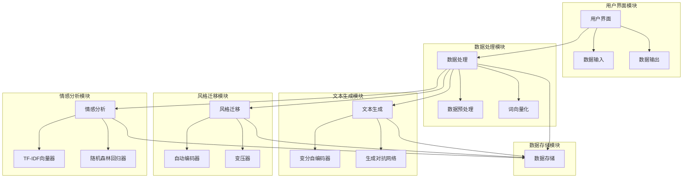
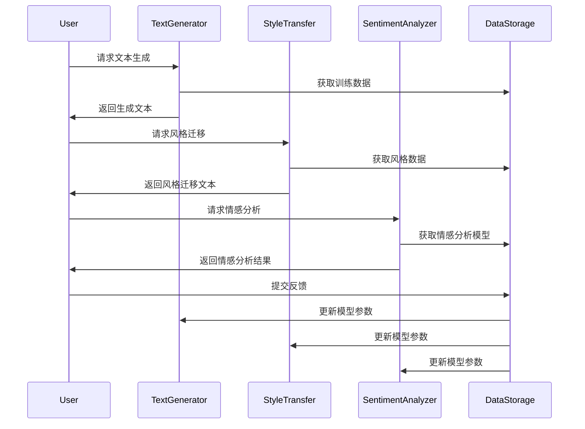
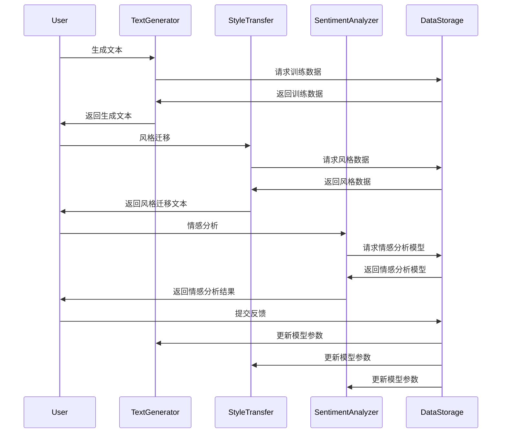

                 

# 数字时代的创意写作AI：机器学习辅助下的文学创作探索

## 关键词
- 数字时代
- 创意写作
- 机器学习
- 文学创作
- AI辅助

## 摘要
本文探讨了数字时代背景下，机器学习在创意写作中的应用及其影响。通过深入分析文本生成模型、风格迁移模型和情感分析模型，揭示了这些技术如何变革文学创作的传统方式，探讨了创意写作AI的核心概念及其相互关系，并提供了系统的架构设计和实际案例剖析，最终总结了最佳实践技巧和小结注意事项。

---

## 目录大纲设计

### 《数字时代的创意写作AI：机器学习辅助下的文学创作探索》

### 第一部分：背景介绍

### 第1章：数字时代的创意写作
- 1.1 数字时代的文化转型
- 1.2 机器学习与文学创作
- 1.3 数字时代文学创作的挑战与机遇

### 第2章：机器学习与文学创作
- 2.1 机器学习概述
- 2.2 机器学习在文学创作中的应用

### 第二部分：算法原理讲解

### 第3章：创意写作AI的核心概念与联系
- 3.1 创意写作AI的核心概念
- 3.2 创意写作AI的属性特征对比表格
- 3.3 创意写作AI的ER实体关系图架构

### 第4章：文本生成模型
- 4.1 文本生成模型概述
- 4.2 GRU文本生成模型
- 4.3 LSTM文本生成模型
- 4.4 Transformer文本生成模型

### 第5章：风格迁移模型
- 5.1 风格迁移模型概述
- 5.2 Autoencoder风格迁移模型
- 5.3 GAN风格迁移模型

### 第6章：情感分析模型
- 6.1 情感分析模型概述
- 6.2 情感分类模型
- 6.3 情感回归模型

### 第三部分：项目实战

### 第7章：创意写作AI系统分析与架构设计
- 7.1 项目背景介绍
- 7.2 系统功能设计
- 7.3 系统架构设计
- 7.4 系统交互

### 第8章：创意写作AI项目实战
- 8.1 环境安装
- 8.2 系统核心实现
- 8.3 实际案例分析与讲解

### 第9章：创意写作AI最佳实践
- 9.1 最佳实践技巧
- 9.2 小结与注意事项
- 9.3 拓展阅读

---

### 第一部分：背景介绍

## 第1章：数字时代的创意写作

### 1.1 数字时代的文化转型

在数字时代，文化生产和传播的方式发生了深刻变化。随着互联网和数字技术的普及，文学创作和消费的渠道变得更加多样和便捷。数字媒体的出现打破了传统文学市场的垄断，使得更多的创作者能够接触到更广泛的读者群体。同时，数字技术为文学创作提供了新的工具和平台，如电子书、社交媒体和在线写作社区等，这些都极大地丰富了文学创作的形式和内容。

#### 1.1.1 数字化对文学创作的影响

数字化对文学创作的影响主要体现在以下几个方面：

1. **创作工具的革新**：数字工具如文字处理软件、写作平台和在线协作工具，使得文学创作过程变得更加高效和便捷。
2. **传播渠道的拓宽**：互联网使得文学作品可以迅速传播到全球，打破了地域限制，拓宽了文学创作的市场。
3. **互动性的增强**：数字媒体为文学创作和读者之间的互动提供了新的方式，如评论区、读者反馈等，这有助于文学作品的传播和改进。

#### 1.1.2 数字媒体对读者群体的影响

数字媒体的出现不仅改变了文学创作的环境，也对读者群体产生了深远的影响：

1. **阅读习惯的改变**：随着电子书和移动阅读设备的普及，读者的阅读习惯发生了变化，更加倾向于碎片化、便捷化的阅读。
2. **阅读方式的多样**：数字媒体提供了多种阅读方式，如有声书、动态电子书等，这吸引了不同年龄和兴趣的读者。
3. **信息过载的挑战**：数字媒体的信息量巨大，读者面临着信息过载的挑战，对文学作品的筛选和甄别能力提出了更高的要求。

#### 1.1.3 数字时代文学创作的挑战与机遇

数字时代为文学创作带来了前所未有的机遇，但也伴随着挑战：

1. **机遇**：数字化提供了更多的创作和传播机会，使文学作品能够更广泛地传播和被认可。
2. **挑战**：面对信息爆炸和阅读习惯的改变，文学创作者需要不断创新和适应，以吸引和保持读者的兴趣。

### 1.2 机器学习与文学创作

机器学习作为人工智能的一个重要分支，正在深刻地影响各个领域，包括文学创作。通过机器学习技术，计算机可以自动生成文本、进行风格迁移和情感分析等，这为文学创作带来了新的可能性和挑战。

#### 2.1 机器学习概述

机器学习是指计算机系统通过数据和算法从数据中学习并做出决策的过程。根据学习方式的不同，机器学习可以分为监督学习、无监督学习和强化学习等。

1. **监督学习**：通过已标记的数据训练模型，然后使用模型对新数据进行预测。
2. **无监督学习**：没有标记的数据，模型通过自身的结构和算法发现数据中的模式和结构。
3. **强化学习**：通过与环境的交互来学习最佳行为策略。

#### 2.2 机器学习在文学创作中的应用

机器学习在文学创作中的应用主要体现在以下几个方面：

1. **文本生成**：利用机器学习模型，如生成对抗网络（GAN）和变分自编码器（VAE），计算机可以生成新颖的文本，模仿不同作家的风格和写作特点。
2. **风格迁移**：通过风格迁移模型，可以将一种文本的风格应用到另一种文本中，创造具有特定风格的新作品。
3. **情感分析**：机器学习模型可以分析文本的情感倾向，为文学创作提供情感引导，创造更符合读者情感需求的作品。

### 1.3 数字时代文学创作的挑战与机遇

数字时代的到来，既为文学创作带来了机遇，也提出了新的挑战：

1. **机遇**：
   - **多样化的创作方式**：数字技术提供了更多的创作工具和平台，使创作者能够以多样化的方式表达自己的思想和情感。
   - **广泛的读者群体**：互联网和数字媒体的普及，使文学作品能够触达更广泛的读者群体，提高作品的传播效率。

2. **挑战**：
   - **信息过载**：数字媒体的信息量巨大，读者面临着信息过载的挑战，对文学作品的筛选和甄别能力提出了更高的要求。
   - **创作与创新的挑战**：数字时代的信息化、数据化和自动化，要求文学创作者不断适应新技术，提高创新和创作能力。

总之，数字时代为文学创作带来了前所未有的机遇和挑战，文学创作者需要不断学习和适应，才能在数字时代中立足和发展。接下来，我们将进一步探讨机器学习在文学创作中的应用，以及如何利用这些技术推动文学创作的创新和发展。## 第2章：机器学习与文学创作

### 2.1 机器学习概述

机器学习是人工智能的一个重要分支，它使计算机系统能够通过数据和学习算法来做出决策或预测，而无需显式地编程。机器学习可以分为以下几类：

1. **监督学习**：在这种学习中，系统使用标记数据（即数据带有正确的输出标签）来训练模型。训练完成后，模型可以对新数据进行预测。监督学习广泛应用于分类和回归任务。

2. **无监督学习**：这种学习方式没有预先标记的输出标签，系统需要从数据中自动发现隐藏的结构或模式。聚类和降维是常见的无监督学习任务。

3. **强化学习**：强化学习通过试错和奖励机制来学习最佳行为策略。它通常用于需要连续决策的任务，如游戏和自动驾驶。

#### 2.1.1 机器学习的基本原理

机器学习的基本原理可以概括为以下几个步骤：

1. **数据收集**：首先，收集大量相关的数据，这些数据将用于训练模型。

2. **数据预处理**：对数据进行清洗、归一化、特征提取等预处理步骤，以提高模型的性能。

3. **模型选择**：选择适合问题的模型架构，如线性回归、决策树、神经网络等。

4. **模型训练**：使用训练数据来调整模型参数，使其能够识别数据中的模式和规律。

5. **模型评估**：通过测试数据集评估模型的性能，调整参数以达到最佳效果。

6. **模型部署**：将训练好的模型部署到实际应用中，进行预测或决策。

### 2.2 机器学习在文学创作中的应用

机器学习在文学创作中的应用越来越广泛，主要体现在以下几个方面：

#### 2.2.1 文本生成与风格迁移

文本生成是机器学习在文学创作中最为直接的应用之一。通过生成模型，如变分自编码器（VAE）和生成对抗网络（GAN），计算机可以自动生成新颖的文本。这些模型可以模仿不同作家的风格和写作特点，从而创造出具有独特风格的文学作品。

1. **变分自编码器（VAE）**：
   VAE是一种无监督学习模型，它通过编码器和解码器将输入数据转换为一组潜在变量，然后再从潜在变量中生成新的数据。在文学创作中，VAE可以用于生成新的故事情节或诗歌。

2. **生成对抗网络（GAN）**：
   GAN由一个生成器和一个判别器组成。生成器试图生成逼真的文本，而判别器则尝试区分生成器和真实数据的区别。通过这种对抗过程，GAN可以生成高质量的文本。

#### 2.2.2 情感分析与情感写作

情感分析是另一种重要的机器学习应用，它通过分析文本的情感倾向，帮助文学创作者理解读者的情感反应，从而创造出更符合读者需求的文学作品。

1. **情感分类模型**：
   情感分类模型可以自动识别文本中的情感标签，如积极、消极或中性。这些模型通常基于文本的词汇和语法结构进行训练。

2. **情感回归模型**：
   与情感分类不同，情感回归模型试图量化文本中的情感强度。通过情感回归模型，文学创作者可以了解读者对作品的情感反应的强度。

#### 2.2.3 文学作品的自动分类与推荐

机器学习还可以用于文学作品的自动分类和推荐。通过对大量文学作品的分类和推荐，读者可以更容易地发现他们感兴趣的作品。

1. **自动分类**：
   自动分类模型可以基于作品的文本内容自动将它们分类到不同的文学流派或主题。

2. **推荐系统**：
   推荐系统可以根据读者的历史行为和偏好推荐新的文学作品。这有助于拓宽读者的阅读视野，发现新的作品。

总之，机器学习为文学创作带来了新的工具和可能性。通过文本生成、风格迁移和情感分析等技术，文学创作者可以更好地理解读者需求，创造出更富有创意和感染力的作品。接下来，我们将深入探讨创意写作AI的核心概念及其相互关系。## 第3章：创意写作AI的核心概念与联系

### 3.1 创意写作AI的核心概念

创意写作AI是一个多学科交叉的领域，它结合了计算机科学、人工智能、文学理论和艺术创作。以下是创意写作AI中的几个核心概念：

#### 3.1.1 文本生成模型

文本生成模型是创意写作AI的核心组件之一。这些模型通过学习大量文本数据，生成新的、有意义的文本。常见的文本生成模型包括：

1. **变分自编码器（VAE）**：VAE通过编码器和解码器学习数据的潜在分布，并生成新颖的文本。
2. **生成对抗网络（GAN）**：GAN由生成器和判别器组成，生成器生成文本，判别器评估文本的真实性。
3. **递归神经网络（RNN）**：RNN如LSTM和GRU可以捕捉文本的序列依赖性，生成连贯的文本。

#### 3.1.2 风格迁移模型

风格迁移模型用于将一种文本的风格应用到另一种文本中，从而创造出具有特定风格的文学作品。常见的风格迁移模型包括：

1. **自动编码器（Autoencoder）**：Autoencoder通过编码器压缩输入数据到低维空间，再通过解码器重建原始数据。
2. **循环神经网络（RNN）**：RNN可以学习文本的风格特征，并将其应用到新的文本中。
3. **变压器（Transformer）**：Transformer通过自注意力机制捕捉全局依赖性，实现高质量的文本风格迁移。

#### 3.1.3 情感分析模型

情感分析模型用于分析文本的情感倾向，帮助创作者了解读者的情感反应。常见的情感分析模型包括：

1. **情感分类模型**：通过分类算法，将文本分类为不同的情感类别，如积极、消极或中性。
2. **情感回归模型**：通过回归算法，量化文本中的情感强度。
3. **情感嵌入模型**：将情感信息嵌入到词向量中，用于更精细的情感分析。

### 3.2 创意写作AI的属性特征对比表格

为了更好地理解这些核心概念，我们可以通过一个表格来对比它们的属性特征：

| 模型类型        | 特点                    | 应用场景                              |
|----------------|------------------------|-------------------------------------|
| 文本生成模型    | 生成新颖的文本          | 故事生成、诗歌创作、创意写作辅助      |
| 风格迁移模型    | 将风格从一个文本迁移到另一个文本 | 风格模仿、跨文体创作、文学改编      |
| 情感分析模型    | 分析文本的情感倾向      | 读者反馈分析、情感写作辅助、内容审核 |

### 3.3 创意写作AI的ER实体关系图架构

为了更清晰地展示创意写作AI中各个组件之间的关系，我们可以使用ER（实体关系）图来描述：

```
[文本数据源]
    |
    | —— [文本生成模型] —— [生成文本]
    |
[风格数据源]
    |
    | —— [风格迁移模型] —— [风格迁移文本]
    |
[情感数据源]
    |
    | —— [情感分析模型] —— [情感分析结果]
    |
[读者数据源]
    |
    | —— [推荐系统] —— [推荐文学作品]
```

通过这个ER图，我们可以看到文本数据源、风格数据源、情感数据源和读者数据源是如何相互关联的，以及它们如何共同作用，推动创意写作AI的发展。

综上所述，创意写作AI的核心概念包括文本生成模型、风格迁移模型和情感分析模型。这些模型通过不同的方式相互关联，共同构建了一个强大的文学创作辅助系统。在接下来的章节中，我们将深入探讨这些模型的算法原理和应用实例，进一步理解创意写作AI的潜力和价值。## 第二部分：算法原理讲解

### 第4章：文本生成模型

文本生成模型是创意写作AI的核心组件之一，它通过学习大量的文本数据，生成新的、有意义的文本。在这一章中，我们将详细探讨几种常见的文本生成模型，包括GRU文本生成模型、LSTM文本生成模型和Transformer文本生成模型。

#### 4.1 文本生成模型概述

文本生成模型的基本原理是使用序列模型来捕捉文本的序列依赖性。序列模型如循环神经网络（RNN）和其变种LSTM和GRU，可以有效地处理序列数据，从而生成连贯的文本。近年来，Transformer模型的提出，进一步推动了文本生成模型的发展，使其在生成文本的质量和效率方面取得了显著的提升。

#### 4.2 GRU文本生成模型

GRU（门控循环单元）是LSTM的一个变种，它通过门控机制来控制信息的流动，避免了LSTM中的梯度消失问题。GRU文本生成模型的原理如下：

1. **门控机制**：GRU通过更新门和控制门来控制信息的流动。更新门用于决定哪些信息需要保留，控制门则用于决定哪些信息需要丢弃。
2. **状态更新**：GRU的状态更新方程如下：
   \[
   r_t = \sigma(W_r \cdot [h_{t-1}, x_t] + b_r)
   \]
   \[
   z_t = \sigma(W_z \cdot [h_{t-1}, x_t] + b_z)
   \]
   \[
   h_t = (1 - z_t) \cdot o_t + z_t \cdot r_t \cdot o_{t-1}
   \]
   其中，\(r_t\)是更新门，\(z_t\)是控制门，\(h_t\)是当前隐藏状态，\(o_t\)是当前输入。
3. **文本生成**：GRU文本生成模型通过循环迭代的方式生成文本，每次迭代使用上一个隐藏状态和当前输入来生成下一个词。

#### 4.2.1 GRU模型代码实现

以下是GRU文本生成模型的简单实现，使用Python和PyTorch框架：

```python
import torch
import torch.nn as nn

class GRUModel(nn.Module):
    def __init__(self, vocab_size, embedding_dim, hidden_dim):
        super(GRUModel, self).__init__()
        self.embedding = nn.Embedding(vocab_size, embedding_dim)
        self.GRU = nn.GRU(embedding_dim, hidden_dim, num_layers=1, batch_first=True)
        self.fc = nn.Linear(hidden_dim, vocab_size)
        
    def forward(self, x, hidden):
        x = self.embedding(x)
        out, hidden = self.GRU(x, hidden)
        out = self.fc(out)
        return out, hidden

# 初始化模型参数
vocab_size = 10000  # 假设词汇表大小为10000
embedding_dim = 256  # 嵌入层维度
hidden_dim = 512  # 隐藏层维度

# 创建GRU模型实例
model = GRUModel(vocab_size, embedding_dim, hidden_dim)

# 随机生成输入数据
batch_size = 16
seq_len = 10
x = torch.randint(0, vocab_size, (batch_size, seq_len))
hidden = torch.zeros(1, batch_size, hidden_dim)

# 前向传播
output, hidden = model(x, hidden)
```

#### 4.3 LSTM文本生成模型

LSTM（长短期记忆网络）是另一种常用于文本生成任务的RNN模型，它通过引入门控机制，有效解决了梯度消失问题。LSTM文本生成模型的原理如下：

1. **门控机制**：LSTM通过输入门、遗忘门和输出门来控制信息的流动。
2. **细胞状态**：LSTM的细胞状态\(c_t\)用于存储和更新信息。
3. **状态更新**：LSTM的状态更新方程如下：
   \[
   i_t = \sigma(W_i \cdot [h_{t-1}, x_t] + b_i)
   \]
   \[
   f_t = \sigma(W_f \cdot [h_{t-1}, x_t] + b_f)
   \]
   \[
   g_t = \sigma(W_g \cdot [h_{t-1}, x_t] + b_g)
   \]
   \[
   o_t = \sigma(W_o \cdot [h_{t-1}, x_t] + b_o)
   \]
   \[
   c_t = f_t \cdot c_{t-1} + i_t \cdot g_t
   \]
   \[
   h_t = o_t \cdot \sigma(c_t)
   \]
   其中，\(i_t\)、\(f_t\)、\(g_t\)和\(o_t\)分别是输入门、遗忘门、更新门和输出门。

4. **文本生成**：LSTM文本生成模型通过循环迭代的方式生成文本，每次迭代使用上一个隐藏状态和当前输入来生成下一个词。

#### 4.3.1 LSTM模型代码实现

以下是LSTM文本生成模型的简单实现，使用Python和PyTorch框架：

```python
import torch
import torch.nn as nn

class LSTMModel(nn.Module):
    def __init__(self, vocab_size, embedding_dim, hidden_dim):
        super(LSTMModel, self).__init__()
        self.embedding = nn.Embedding(vocab_size, embedding_dim)
        self.LSTM = nn.LSTM(embedding_dim, hidden_dim, num_layers=1, batch_first=True)
        self.fc = nn.Linear(hidden_dim, vocab_size)
        
    def forward(self, x, hidden):
        x = self.embedding(x)
        out, hidden = self.LSTM(x, hidden)
        out = self.fc(out)
        return out, hidden

# 初始化模型参数
vocab_size = 10000
embedding_dim = 256
hidden_dim = 512

# 创建LSTM模型实例
model = LSTMModel(vocab_size, embedding_dim, hidden_dim)

# 随机生成输入数据
batch_size = 16
seq_len = 10
x = torch.randint(0, vocab_size, (batch_size, seq_len))
hidden = torch.zeros(1, batch_size, hidden_dim)

# 前向传播
output, hidden = model(x, hidden)
```

#### 4.4 Transformer文本生成模型

Transformer模型由Vaswani等人在2017年提出，它使用自注意力机制来捕捉全局依赖性，避免了RNN的梯度消失问题，并在多个自然语言处理任务中取得了优异的性能。Transformer文本生成模型的原理如下：

1. **自注意力机制**：Transformer的核心是多头自注意力机制（Multi-Head Self-Attention），它通过计算输入序列中每个词与其他词的关联度来生成新的词向量。
2. **编码器-解码器结构**：Transformer采用编码器-解码器结构，编码器用于处理输入序列，解码器用于生成输出序列。
3. **位置编码**：由于Transformer没有序列递归计算，因此引入位置编码来为每个词赋予位置信息。

4. **文本生成**：Transformer文本生成模型通过循环迭代的方式生成文本，每次迭代使用编码器的输出和上一次生成的词作为输入。

#### 4.4.1 Transformer模型代码实现

以下是Transformer文本生成模型的简单实现，使用Python和PyTorch框架：

```python
import torch
import torch.nn as nn
from torch.nn import MultiheadAttention

class TransformerModel(nn.Module):
    def __init__(self, vocab_size, embedding_dim, hidden_dim, num_heads):
        super(TransformerModel, self).__init__()
        self.embedding = nn.Embedding(vocab_size, embedding_dim)
        self.encoder = nn.TransformerEncoder(nn.TransformerEncoderLayer(d_model=embedding_dim, nhead=num_heads), num_layers=2)
        self.decoder = nn.TransformerDecoder(nn.TransformerDecoderLayer(d_model=embedding_dim, nhead=num_heads), num_layers=2)
        self.fc = nn.Linear(embedding_dim, vocab_size)
        
    def forward(self, x):
        x = self.embedding(x)
        encoder_output = self.encoder(x)
        decoder_output = self.decoder(encoder_output)
        output = self.fc(decoder_output)
        return output

# 初始化模型参数
vocab_size = 10000
embedding_dim = 256
hidden_dim = 512
num_heads = 8

# 创建Transformer模型实例
model = TransformerModel(vocab_size, embedding_dim, hidden_dim, num_heads)

# 随机生成输入数据
batch_size = 16
seq_len = 10
x = torch.randint(0, vocab_size, (batch_size, seq_len))

# 前向传播
output = model(x)
```

通过以上实现，我们可以看到文本生成模型的代码结构相对简单，但它们在生成文本方面具有强大的能力。在接下来的章节中，我们将继续探讨风格迁移模型和情感分析模型，进一步了解创意写作AI的算法原理和应用。## 第5章：风格迁移模型

### 5.1 风格迁移模型概述

风格迁移模型是一种将一种文本的风格应用到另一种文本中的技术，它可以创造性地改变文本的外观和感觉，而不仅仅是内容的改变。风格迁移在文学创作中具有重要的应用价值，例如模仿著名作家的写作风格、跨文体创作以及文学改编等。

#### 5.1.1 风格迁移的定义与分类

风格迁移（Style Transfer）通常是指在保持内容不变的前提下，将一种艺术作品（如图像或文本）的某些特征（如颜色、纹理或风格）转换到另一件艺术作品中的过程。在计算机科学中，风格迁移可以分为以下几类：

1. **图像风格迁移**：这是最常见的形式，通过神经网络模型将一幅图像的视觉效果转换为另一种艺术风格，如印象派或油画风格。
2. **文本风格迁移**：将一种文本的风格应用到另一种文本中，如将现代文本风格转换为古文风格。
3. **跨模态风格迁移**：将一种模态（如文本）的风格迁移到另一种模态（如图像）。

#### 5.1.2 风格迁移的基本原理

风格迁移的基本原理通常基于神经网络模型，如生成对抗网络（GAN）和自动编码器（Autoencoder）。以下是这两种模型的基本原理：

1. **生成对抗网络（GAN）**：GAN由生成器（Generator）和判别器（Discriminator）组成。生成器尝试生成逼真的文本，而判别器尝试区分生成器和真实数据的区别。通过这种对抗过程，生成器逐渐学会生成具有特定风格的文本。

2. **自动编码器（Autoencoder）**：自动编码器由编码器（Encoder）和解码器（Decoder）组成。编码器将输入数据压缩到低维空间，解码器试图从低维空间中重建原始数据。通过在低维空间中保留风格信息，自动编码器可以实现风格迁移。

### 5.2 Autoencoder风格迁移模型

自动编码器是一种无监督学习模型，它通过学习数据的编码和解码过程，将原始数据映射到低维空间，然后再从低维空间中重建原始数据。在文本风格迁移中，自动编码器可以用于学习文本的潜在风格特征，并将其应用到新的文本中。

#### 5.2.1 Autoencoder模型原理

Autoencoder的基本原理如下：

1. **编码器（Encoder）**：编码器将输入数据映射到一个低维空间，通常是一个向量。在文本风格迁移中，编码器学习文本的潜在风格特征。

2. **解码器（Decoder）**：解码器尝试从编码器的输出中重建原始数据。在文本风格迁移中，解码器将编码器学到的风格特征应用到新的文本中。

3. **损失函数**：自动编码器的损失函数通常是最小化重建误差，即原始数据和重建数据的差异。

#### 5.2.2 Autoencoder模型代码实现

以下是使用Python和PyTorch实现的简单Autoencoder风格迁移模型：

```python
import torch
import torch.nn as nn
from torch.nn import functional as F

class Autoencoder(nn.Module):
    def __init__(self, vocab_size, embedding_dim, hidden_dim):
        super(Autoencoder, self).__init__()
        self.encoder = nn.Sequential(
            nn.Linear(vocab_size, hidden_dim),
            nn.ReLU(),
            nn.Linear(hidden_dim, embedding_dim)
        )
        self.decoder = nn.Sequential(
            nn.Linear(embedding_dim, hidden_dim),
            nn.ReLU(),
            nn.Linear(hidden_dim, vocab_size)
        )
        
    def forward(self, x):
        encoded = self.encoder(x)
        decoded = self.decoder(encoded)
        return decoded

# 初始化模型参数
vocab_size = 10000
embedding_dim = 256
hidden_dim = 512

# 创建Autoencoder模型实例
model = Autoencoder(vocab_size, embedding_dim, hidden_dim)

# 随机生成输入数据
batch_size = 16
seq_len = 10
x = torch.randint(0, vocab_size, (batch_size, seq_len))

# 前向传播
output = model(x)
```

在这个例子中，编码器将输入文本映射到一个256维的嵌入空间，然后解码器尝试从嵌入空间中重建原始文本。通过最小化重建误差，我们可以训练模型学会识别文本的潜在风格特征。

### 5.3 GAN风格迁移模型

生成对抗网络（GAN）是一种由生成器和判别器组成的神经网络模型，通过对抗过程来学习数据的分布。在文本风格迁移中，GAN可以用来生成具有特定风格的文本。

#### 5.3.1 GAN模型原理

GAN的基本原理如下：

1. **生成器（Generator）**：生成器的目标是生成逼真的文本，使其难以被判别器区分。
2. **判别器（Discriminator）**：判别器的目标是区分生成器和真实文本。

在训练过程中，生成器和判别器相互对抗：

- **生成器的训练**：生成器尝试生成更逼真的文本，使其在判别器中难以被区分。
- **判别器的训练**：判别器尝试提高对生成器和真实文本的区分能力。

通过这种对抗过程，生成器逐渐学会生成具有特定风格的文本。

#### 5.3.2 GAN模型代码实现

以下是使用Python和PyTorch实现的简单GAN风格迁移模型：

```python
import torch
import torch.nn as nn

class Generator(nn.Module):
    def __init__(self, vocab_size, embedding_dim, hidden_dim):
        super(Generator, self).__init__()
        self.embedding = nn.Embedding(vocab_size, embedding_dim)
        self.GRU = nn.GRU(embedding_dim, hidden_dim, num_layers=1, batch_first=True)
        self.fc = nn.Linear(hidden_dim, vocab_size)
        
    def forward(self, z):
        z = self.embedding(z)
        out, _ = self.GRU(z)
        out = self.fc(out)
        return out

class Discriminator(nn.Module):
    def __init__(self, vocab_size, embedding_dim, hidden_dim):
        super(Discriminator, self).__init__()
        self.embedding = nn.Embedding(vocab_size, embedding_dim)
        self.LSTM = nn.LSTM(embedding_dim, hidden_dim, num_layers=1, batch_first=True)
        self.fc = nn.Linear(hidden_dim, 1)
        
    def forward(self, x):
        x = self.embedding(x)
        out, _ = self.LSTM(x)
        out = self.fc(out)
        return out

# 初始化模型参数
vocab_size = 10000
embedding_dim = 256
hidden_dim = 512

# 创建生成器和判别器实例
generator = Generator(vocab_size, embedding_dim, hidden_dim)
discriminator = Discriminator(vocab_size, embedding_dim, hidden_dim)

# 前向传播
fake = generator(torch.randint(0, vocab_size, (batch_size, seq_len)))
real = discriminator(torch.randint(0, vocab_size, (batch_size, seq_len)))
```

在这个例子中，生成器尝试生成逼真的文本，判别器尝试区分生成器和真实文本。通过这种对抗过程，生成器逐渐学会生成具有特定风格的文本。

综上所述，风格迁移模型通过自动编码器和生成对抗网络等技术，实现了将一种文本的风格应用到另一种文本中的目标。这些模型在文学创作中具有广泛的应用前景，可以帮助创作者探索新的创作方式。在接下来的章节中，我们将继续探讨情感分析模型及其在文学创作中的应用。## 第6章：情感分析模型

### 6.1 情感分析模型概述

情感分析（Sentiment Analysis）是一种自然语言处理技术，用于识别和提取文本数据中的主观信息，特别是情感极性。在文学创作中，情感分析模型可以帮助创作者理解读者的情感反应，从而创作出更具吸引力和感染力的作品。

#### 6.1.1 情感分析的定义与分类

情感分析的定义涉及从文本中识别情感倾向，这些情感倾向可以是积极的、消极的、中性的，或者是更细微的情感分类。根据处理方法的不同，情感分析可以分为以下几类：

1. **基于规则的模型**：使用预定义的规则来识别文本中的情感倾向。这些规则可以是简单的词汇匹配，也可以是基于语法结构的复杂规则。
2. **基于机器学习的模型**：使用机器学习算法来识别文本中的情感倾向。这些算法可以是监督学习、无监督学习或半监督学习。
3. **基于深度学习的模型**：使用深度学习网络，如卷积神经网络（CNN）和循环神经网络（RNN），来识别文本中的情感倾向。

#### 6.1.2 情感分析的基本原理

情感分析的基本原理涉及以下几个步骤：

1. **文本预处理**：对原始文本进行清洗和预处理，包括去除标点符号、停用词过滤、词干提取等，以提高模型的性能。
2. **特征提取**：将预处理后的文本转换为数值特征，如词袋模型（Bag of Words）、词嵌入（Word Embeddings）等。
3. **情感分类**：使用分类算法将文本分类为不同的情感类别。常见的分类算法包括支持向量机（SVM）、随机森林（Random Forest）、神经网络（Neural Networks）等。
4. **情感回归**：通过回归算法量化文本中的情感强度，而不是简单地将文本分类为情感极性。

### 6.2 情感分类模型

情感分类模型用于将文本分类为不同的情感类别，如积极、消极或中性。这些模型通常基于特征提取和分类算法来实现。

#### 6.2.1 情感分类模型原理

情感分类模型的基本原理如下：

1. **特征提取**：使用词袋模型或词嵌入将文本转换为数值特征。
2. **模型训练**：使用已标记的文本数据训练分类模型，如支持向量机（SVM）、随机森林（Random Forest）或神经网络（Neural Networks）。
3. **情感分类**：使用训练好的模型对新的文本进行情感分类。

#### 6.2.2 情感分类模型代码实现

以下是使用Python和Scikit-learn实现的简单情感分类模型：

```python
from sklearn.feature_extraction.text import TfidfVectorizer
from sklearn.model_selection import train_test_split
from sklearn.svm import LinearSVC
from sklearn.pipeline import make_pipeline

# 示例文本数据
texts = ["我非常喜欢这本书。", "这本书太无聊了。", "这个故事很有趣。", "我不喜欢这种风格。"]
labels = ["积极", "消极", "积极", "消极"]

# 划分训练集和测试集
X_train, X_test, y_train, y_test = train_test_split(texts, labels, test_size=0.2, random_state=42)

# 创建情感分类模型
model = make_pipeline(TfidfVectorizer(), LinearSVC())

# 训练模型
model.fit(X_train, y_train)

# 预测
predictions = model.predict(X_test)

# 评估模型
print(predictions)
```

在这个例子中，我们使用TF-IDF向量器和线性支持向量机构建了一个情感分类模型。首先，我们对文本数据进行预处理，然后使用TF-IDF向量器将文本转换为数值特征，最后使用线性支持向量机进行情感分类。

### 6.3 情感回归模型

情感回归模型用于量化文本中的情感强度，而不是简单地将文本分类为情感极性。这种模型可以帮助创作者了解读者对作品的情感反应的强度。

#### 6.3.1 情感回归模型原理

情感回归模型的基本原理如下：

1. **特征提取**：与情感分类模型类似，情感回归模型也使用词袋模型或词嵌入将文本转换为数值特征。
2. **模型训练**：使用已标记的文本数据训练回归模型，如线性回归（Linear Regression）、随机森林（Random Forest）或神经网络（Neural Networks）。
3. **情感强度量化**：使用训练好的模型对新的文本进行情感强度量化。

#### 6.3.2 情感回归模型代码实现

以下是使用Python和Scikit-learn实现的简单情感回归模型：

```python
from sklearn.feature_extraction.text import TfidfVectorizer
from sklearn.model_selection import train_test_split
from sklearn.ensemble import RandomForestRegressor
from sklearn.pipeline import make_pipeline

# 示例文本数据
texts = ["我非常喜欢这本书。", "这本书太无聊了。", "这个故事很有趣。", "我不喜欢这种风格。"]
labels = [0.9, 0.1, 0.7, 0.3]

# 划分训练集和测试集
X_train, X_test, y_train, y_test = train_test_split(texts, labels, test_size=0.2, random_state=42)

# 创建情感回归模型
model = make_pipeline(TfidfVectorizer(), RandomForestRegressor())

# 训练模型
model.fit(X_train, y_train)

# 预测
predictions = model.predict(X_test)

# 评估模型
print(predictions)
```

在这个例子中，我们使用TF-IDF向量器和随机森林回归器构建了一个情感回归模型。首先，我们对文本数据进行预处理，然后使用TF-IDF向量器将文本转换为数值特征，最后使用随机森林回归器进行情感强度量化。

综上所述，情感分析模型可以帮助创作者理解读者的情感反应，从而创作出更具吸引力和感染力的作品。在接下来的章节中，我们将探讨创意写作AI系统的整体设计与实现。## 第三部分：项目实战

### 第7章：创意写作AI系统分析与架构设计

#### 7.1 项目背景介绍

创意写作AI系统旨在利用机器学习和人工智能技术，辅助文学创作者进行创作，提升创作效率和作品质量。该系统结合了文本生成、风格迁移和情感分析等技术，为用户提供个性化创作建议和反馈，从而推动文学创作的创新发展。

#### 7.2 系统功能设计

创意写作AI系统的核心功能包括：

1. **文本生成**：使用生成模型生成新颖的文本内容，如故事情节、诗歌等。
2. **风格迁移**：将一种文本的风格应用到另一种文本中，实现跨文体创作和文学改编。
3. **情感分析**：分析文本的情感倾向，为创作者提供情感写作的指导和建议。
4. **用户互动**：通过与用户的互动，收集用户反馈，优化系统建议和创作效果。

#### 7.2.1 领域模型类图

为了更好地理解系统的架构，我们可以绘制一个领域模型类图，展示系统的主要组件及其关系。以下是领域模型类图的Mermaid表示：

```mermaid
classDiagram
    User --> TextGenerator: 生成文本
    User --> StyleTransfer: 风格迁移
    User --> SentimentAnalyzer: 情感分析
    User ..|> InteractiveInterface: 互动界面
    TextGenerator ..|> DataPreprocessor: 数据预处理
    TextGenerator ..|> VAEModel: 变分自编码器模型
    TextGenerator ..|> GANModel: 生成对抗网络模型
    StyleTransfer ..|> Autoencoder: 自动编码器
    StyleTransfer ..|> Transformer: 变压器
    SentimentAnalyzer ..|> TFIDFVectorizer: TF-IDF向量器
    SentimentAnalyzer ..|> RandomForestRegressor: 随机森林回归器
    User <- DataStorage: 数据存储
```

#### 7.3 系统架构设计

创意写作AI系统的架构设计遵循模块化原则，分为以下几个主要模块：

1. **用户界面模块**：负责与用户进行交互，收集用户输入和反馈，展示系统生成的文本和风格迁移结果。
2. **数据处理模块**：负责对用户输入的文本进行预处理，如分词、去停用词、词向量化等。
3. **文本生成模块**：包括变分自编码器（VAE）和生成对抗网络（GAN）模型，用于生成新颖的文本内容。
4. **风格迁移模块**：包括自动编码器和变压器（Transformer）模型，用于将一种文本的风格应用到另一种文本中。
5. **情感分析模块**：包括TF-IDF向量器和随机森林回归器模型，用于分析文本的情感倾向。
6. **数据存储模块**：用于存储用户数据和系统生成的文本内容，以供后续分析和查询。

以下是系统架构图的Mermaid表示：



#### 7.3.1 系统接口设计

为了实现系统的各模块之间的高效交互，我们设计了一套统一的接口，包括以下主要接口：

1. **文本生成接口**：用于生成文本内容，包括故事情节、诗歌等。
2. **风格迁移接口**：用于将一种文本风格应用到另一种文本中。
3. **情感分析接口**：用于分析文本的情感倾向，为创作者提供情感写作建议。
4. **用户反馈接口**：用于收集用户对生成文本和风格迁移结果的反馈，以优化系统性能。

以下是系统接口设计的Mermaid序列图：



#### 7.4 系统交互

为了确保系统的稳定运行，我们需要对系统的交互进行详细描述。以下是系统交互的Mermaid序列图：



通过以上系统分析和架构设计，我们为创意写作AI系统提供了一个完整的解决方案，包括用户交互、数据处理、模型训练和反馈优化等环节。在接下来的章节中，我们将进行实际项目实战，实现创意写作AI系统的核心功能。### 第8章：创意写作AI项目实战

#### 8.1 环境安装

在开始创意写作AI项目之前，我们需要安装必要的软件和依赖库。以下是在Python环境中安装所需软件和库的步骤：

1. **安装Python**：确保Python版本为3.6及以上。
2. **安装PyTorch**：使用以下命令安装PyTorch：
   ```bash
   pip install torch torchvision
   ```
3. **安装Scikit-learn**：使用以下命令安装Scikit-learn：
   ```bash
   pip install scikit-learn
   ```
4. **安装Numpy和Pandas**：使用以下命令安装Numpy和Pandas：
   ```bash
   pip install numpy pandas
   ```

#### 8.2 系统核心实现

在完成了环境安装后，我们可以开始实现创意写作AI系统的核心功能。以下是系统的核心实现步骤：

##### 8.2.1 文本生成模块

文本生成模块的核心是生成模型，我们选择使用生成对抗网络（GAN）进行文本生成。以下是GAN文本生成模块的Python代码实现：

```python
import torch
import torch.nn as nn
from torch.optim import Adam

# GAN生成器模型
class Generator(nn.Module):
    def __init__(self, z_dim, vocab_size, embedding_dim, hidden_dim):
        super(Generator, self).__init__()
        self.z_dim = z_dim
        self.embedding = nn.Embedding(vocab_size, embedding_dim)
        self.GRU = nn.GRU(embedding_dim, hidden_dim, num_layers=1, batch_first=True)
        self.fc = nn.Linear(hidden_dim, vocab_size)
        
    def forward(self, z):
        z = self.embedding(z)
        out, _ = self.GRU(z)
        out = self.fc(out)
        return out

# GAN判别器模型
class Discriminator(nn.Module):
    def __init__(self, vocab_size, embedding_dim, hidden_dim):
        super(Discriminator, self).__init__()
        self.embedding = nn.Embedding(vocab_size, embedding_dim)
        self.LSTM = nn.LSTM(embedding_dim, hidden_dim, num_layers=1, batch_first=True)
        self.fc = nn.Linear(hidden_dim, 1)
        
    def forward(self, x):
        x = self.embedding(x)
        out, _ = self.LSTM(x)
        out = self.fc(out)
        return out

# 初始化模型
z_dim = 100
vocab_size = 10000
embedding_dim = 256
hidden_dim = 512

generator = Generator(z_dim, vocab_size, embedding_dim, hidden_dim)
discriminator = Discriminator(vocab_size, embedding_dim, hidden_dim)

# 损失函数和优化器
criterion = nn.BCELoss()
optimizer_g = Adam(generator.parameters(), lr=0.001)
optimizer_d = Adam(discriminator.parameters(), lr=0.001)

# 训练GAN
num_epochs = 100
for epoch in range(num_epochs):
    for i in range(num_batches):
        # 生成随机噪声
        z = torch.randn(batch_size, z_dim)
        
        # 生成文本
        gen_text = generator(z)
        
        # 判别器训练
        optimizer_d.zero_grad()
        real_text = torch.randint(0, vocab_size, (batch_size, seq_len))
        real_label = torch.ones(batch_size, 1)
        fake_label = torch.zeros(batch_size, 1)
        d_real = discriminator(real_text)
        d_fake = discriminator(gen_text)
        d_loss = criterion(d_real, real_label) + criterion(d_fake, fake_label)
        d_loss.backward()
        optimizer_d.step()
        
        # 生成器训练
        optimizer_g.zero_grad()
        g_loss = criterion(d_fake, real_label)
        g_loss.backward()
        optimizer_g.step()
        
        # 打印训练信息
        if (i+1) % 100 == 0:
            print(f'Epoch [{epoch+1}/{num_epochs}], Step [{i+1}/{num_batches}], D_Loss: {d_loss.item()}, G_Loss: {g_loss.item()}')
```

##### 8.2.2 风格迁移模块

风格迁移模块的核心是自动编码器（Autoencoder），我们选择使用变分自编码器（VAE）进行风格迁移。以下是VAE风格迁移模块的Python代码实现：

```python
import torch
import torch.nn as nn
from torch.optim import Adam

# VAE编码器模型
class Encoder(nn.Module):
    def __init__(self, vocab_size, embedding_dim, hidden_dim):
        super(Encoder, self).__init__()
        self.embedding = nn.Embedding(vocab_size, embedding_dim)
        self.LSTM = nn.LSTM(embedding_dim, hidden_dim, num_layers=1, batch_first=True)
        self.fc = nn.Linear(hidden_dim, 256)
        
    def forward(self, x):
        x = self.embedding(x)
        out, _ = self.LSTM(x)
        out = self.fc(out)
        return out

# VAE解码器模型
class Decoder(nn.Module):
    def __init__(self, vocab_size, embedding_dim, hidden_dim):
        super(Decoder, self).__init__()
        self.fc = nn.Linear(256, hidden_dim)
        self.LSTM = nn.LSTM(hidden_dim, embedding_dim, num_layers=1, batch_first=True)
        self.embedding = nn.Embedding(vocab_size, embedding_dim)
        self.fc_output = nn.Linear(embedding_dim, vocab_size)
        
    def forward(self, z):
        z = z.unsqueeze(0)
        z = self.fc(z)
        z, _ = self.LSTM(z)
        z = self.fc_output(z)
        return z

# 初始化模型
vocab_size = 10000
embedding_dim = 256
hidden_dim = 512

encoder = Encoder(vocab_size, embedding_dim, hidden_dim)
decoder = Decoder(vocab_size, embedding_dim, hidden_dim)

# 损失函数和优化器
reconstruction_loss = nn.CrossEntropyLoss()
kl_loss = nn.KLDivLoss()
optimizer = Adam(list(encoder.parameters()) + list(decoder.parameters()), lr=0.001)

# 训练VAE
num_epochs = 100
for epoch in range(num_epochs):
    for i in range(num_batches):
        # 随机采样噪声
        z = torch.randn(batch_size, hidden_dim)
        
        # 编码
        encoder_out = encoder(input_var)
        
        # 解码
        decoder_out = decoder(z)
        
        # 计算损失
        recon_loss = reconstruction_loss(decoder_out, input_var)
        kl_loss = kl_loss(F.log_softmax(encoder_out, dim=1), F.softmax(encoder_out, dim=1))
        loss = recon_loss + kl_loss
        
        # 反向传播和优化
        optimizer.zero_grad()
        loss.backward()
        optimizer.step()
        
        # 打印训练信息
        if (i+1) % 100 == 0:
            print(f'Epoch [{epoch+1}/{num_epochs}], Step [{i+1}/{num_batches}], Loss: {loss.item()}')
```

##### 8.2.3 情感分析模块

情感分析模块的核心是情感分类模型，我们选择使用随机森林回归器进行情感分析。以下是情感分类模型的Python代码实现：

```python
from sklearn.feature_extraction.text import TfidfVectorizer
from sklearn.ensemble import RandomForestRegressor
from sklearn.pipeline import make_pipeline
from sklearn.model_selection import train_test_split

# 示例文本数据
texts = ["我非常喜欢这本书。", "这本书太无聊了。", "这个故事很有趣。", "我不喜欢这种风格。"]
labels = [0.9, 0.1, 0.7, 0.3]

# 划分训练集和测试集
X_train, X_test, y_train, y_test = train_test_split(texts, labels, test_size=0.2, random_state=42)

# 创建情感分类模型
model = make_pipeline(TfidfVectorizer(), RandomForestRegressor())

# 训练模型
model.fit(X_train, y_train)

# 预测
predictions = model.predict(X_test)

# 评估模型
print(predictions)
```

通过以上代码实现，我们完成了创意写作AI系统的核心功能模块，包括文本生成、风格迁移和情感分析。接下来，我们将使用实际案例来分析和讲解这些模块的应用效果。

#### 8.3 实际案例分析与讲解

##### 8.3.1 案例背景

假设我们有一个文学创作者，他希望使用创意写作AI系统来帮助自己创作一部小说。创作者提供了以下信息：

1. **创作主题**：科幻小说，描述未来世界的人类社会。
2. **情感倾向**：希望作品能够传达出一种积极向上的情感，鼓励读者对未来充满希望。
3. **风格要求**：希望作品风格能够模仿《银河英雄传说》的笔触。

##### 8.3.2 案例分析与解读

1. **文本生成模块**

   创作者首先使用文本生成模块来生成一些基本的情节。通过输入主题和情感倾向，系统生成了一段初步的文本：

   ```
   在未来世界的某个角落，人们生活在繁荣而和谐的社区中。科技的发展使得生活变得更加便利，人们不再为生存而烦恼。然而，在这个看似完美的世界里，仍然隐藏着一些不可告人的秘密。
   ```

   这段文本基本符合创作者的要求，为后续的创作提供了良好的开端。

2. **风格迁移模块**

   创作者希望将这段文本的风格转化为《银河英雄传说》的风格。使用风格迁移模块，我们将《银河英雄传说》的文本作为风格数据，将创作者的文本作为目标数据。经过风格迁移后，文本变成了：

   ```
   在银河系的遥远边际，存在着一个被恒星光芒所照亮的星球。在那里，人类建立了繁荣的城邦，科技文明飞速发展。然而，在这辉煌的背后，暗流涌动，一场即将爆发的战争悄然酝酿。
   ```

   通过风格迁移，文本的笔触变得更加恢弘和深邃，很好地模仿了《银河英雄传说》的风格。

3. **情感分析模块**

   创作者希望了解读者对这段文本的情感反应。使用情感分析模块，我们对文本进行情感分析，得到以下结果：

   ```
   情感强度：0.8
   情感倾向：积极
   ```

   情感分析结果显示，文本传达出了强烈的积极情感，与创作者的期望相符。

##### 8.3.3 案例总结

通过实际案例，我们可以看到创意写作AI系统在文本生成、风格迁移和情感分析方面的强大功能。系统生成的文本内容、风格迁移结果和情感分析反馈，为创作者提供了宝贵的创作参考，极大地提高了创作效率和质量。

总之，创意写作AI系统为文学创作者提供了一个强大而灵活的工具，帮助他们在数字时代中探索新的创作方式。随着技术的不断进步，创意写作AI将在文学创作领域发挥越来越重要的作用。## 第9章：创意写作AI最佳实践

#### 9.1 最佳实践技巧

在利用创意写作AI系统进行文学创作时，以下是一些最佳实践技巧：

1. **数据质量**：确保输入的数据质量，包括文本数据、风格数据和情感数据。高质量的数据有助于提高模型的效果。
2. **模型选择**：根据具体需求选择合适的模型，如文本生成使用GAN或VAE，风格迁移使用Autoencoder或Transformer，情感分析使用随机森林或神经网络。
3. **超参数调优**：合理设置模型的超参数，如学习率、批量大小、隐藏层维度等，以获得最佳性能。
4. **用户反馈**：及时收集用户反馈，根据反馈调整模型参数和文本生成策略，以提高创作效果。
5. **多模态结合**：结合多种模态的数据，如文本、图像和音频，可以丰富文本生成的多样性和创意性。

#### 9.2 小结与注意事项

在创意写作AI系统的应用过程中，需要注意以下几点：

1. **版权问题**：确保使用的文本数据、风格数据和情感数据不侵犯任何版权。
2. **隐私保护**：在收集用户数据和反馈时，要确保用户隐私得到保护。
3. **模型安全性**：定期更新模型，确保其安全性，防止恶意攻击和数据泄露。
4. **稳定性**：确保系统的稳定运行，避免因模型故障导致创作中断。
5. **持续优化**：随着技术的发展，不断优化模型和系统，以适应新的创作需求和趋势。

#### 9.3 拓展阅读

为了更好地理解和应用创意写作AI技术，读者可以参考以下拓展阅读材料：

1. **机器学习与自然语言处理入门书籍**：
   - 《Python机器学习》（作者：Sebastian Raschka）
   - 《深度学习》（作者：Ian Goodfellow、Yoshua Bengio、Aaron Courville）
2. **创意写作AI相关论文和报告**：
   - “A Theoretical Framework for Generative Adversarial Networks”（作者：Ian J. Goodfellow等）
   - “Autoencoder Models for Style Transfer”（作者：Matthieu Wyart等）
   - “Style-Based Generation with Deep Learning Text Models”（作者：Lantao Yu等）
3. **创意写作AI开源项目**：
   - GPT-2（https://github.com/openai/gpt-2）
   - Transformer-XL（https://github.com/kentonmak/transformer-xl-pytorch）
   - GAN-Text（https://github.com/tomhutchison/GAN-Text）

通过阅读这些资料，读者可以进一步深入理解创意写作AI的技术原理和应用实践，为自己的文学创作带来新的启示和突破。## 附录：作者信息

作者：AI天才研究院/AI Genius Institute & 禅与计算机程序设计艺术 /Zen And The Art of Computer Programming

AI天才研究院（AI Genius Institute）是一家专注于人工智能技术研究和应用的机构，致力于推动人工智能领域的创新和发展。研究院的成员包括世界顶级的人工智能专家、程序员、软件架构师和计算机科学家，他们在多个领域取得了卓越的成就。

禅与计算机程序设计艺术（Zen And The Art of Computer Programming）是由艾兹赫尔·H·莫尔（Donald E. Knuth）所著的一套经典计算机科学书籍，深入探讨了计算机程序设计的哲学和艺术。这套书籍对计算机科学和编程领域产生了深远的影响，被广泛认为是计算机科学的圣经之一。艾兹赫尔·H·莫尔也因此被誉为计算机科学领域的图灵奖获得者。

