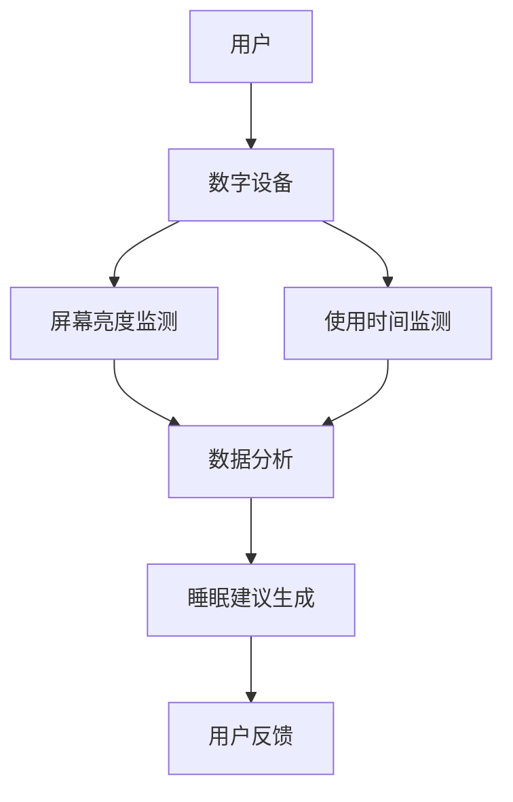
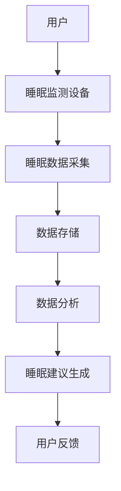
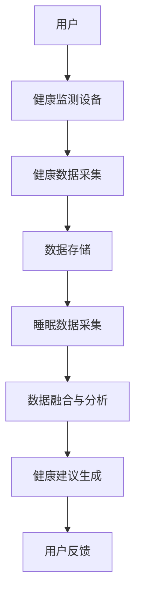
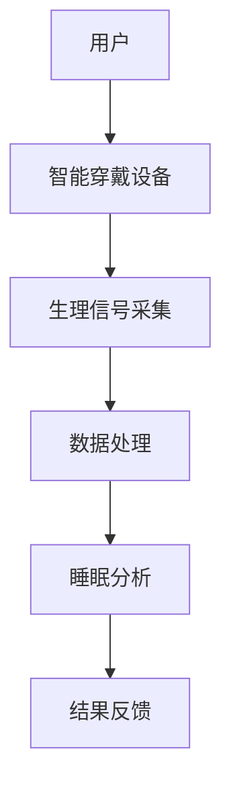
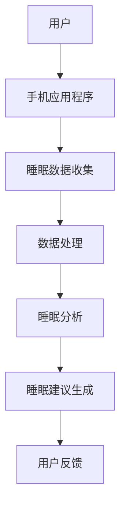
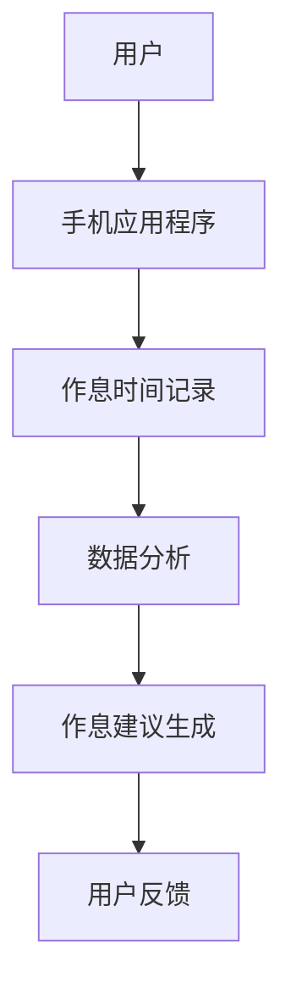

                 


## 数字时代的睡眠质量：科技与传统方法的结合

### 关键词：睡眠质量、数字科技、传统方法、科技结合、睡眠健康

### 摘要：

随着数字时代的到来，人们的生活方式发生了翻天覆地的变化，其中睡眠质量受到了严重影响。本文旨在探讨数字时代下睡眠质量的现状，分析科技与传统方法在提升睡眠质量方面的作用，并通过实践案例研究，探讨科技与传统方法结合的实际效果与未来发展趋势。文章分为四个主要部分：引言、科技与传统方法的睡眠质量提升、科技与传统方法的结合实践、未来发展趋势。通过这些部分的详细探讨，旨在为读者提供一套系统、全面、实用的睡眠质量提升方案。

### 目录大纲：

#### 第一部分：引言

- 第1章：数字时代与睡眠质量
  - 1.1 数字时代的睡眠问题
    - 1.1.1 数字设备与睡眠质量
    - 1.1.2 睡眠问题的普遍性
    - 1.1.3 睡眠质量的影响
  - 1.2 书籍目的与读者对象
    - 1.2.1 书籍目的
    - 1.2.2 读者对象
    - 1.2.3 书籍结构安排

- 第2章：科技与传统方法的睡眠质量提升
  - 2.1 科技方法
    - 2.1.1 睡眠监测技术
    - 2.1.2 睡眠管理应用
  - 2.2 传统方法
    - 2.2.1 睡眠改善策略
    - 2.2.2 中医睡眠疗法

#### 第二部分：科技与传统方法的结合实践

- 第3章：科技与传统方法的结合实践
  - 3.1 结合案例研究
  - 3.2 结合方法与工具
    - 3.2.1 数据分析工具
    - 3.2.2 深度学习与睡眠质量

#### 第三部分：未来发展趋势

- 第4章：科技与传统方法的未来发展趋势
  - 4.1 科技进步的影响
  - 4.2 未来发展方向

#### 第四部分：实际应用案例与技巧

- 第5章：实际应用案例与技巧
  - 5.1 睡眠质量自我管理
  - 5.2 工作与睡眠平衡

- 第6章：政策与教育
  - 6.1 政策支持与宣传
  - 6.2 睡眠教育

- 第7章：总结与展望
  - 7.1 书籍总结
  - 7.2 未来展望

---

#### 第1章：数字时代与睡眠质量

### 1.1 数字时代的睡眠问题

#### 1.1.1 数字设备与睡眠质量

在数字时代，人们的日常生活被各种数字设备所包围。智能手机、平板电脑、电视等设备不仅丰富了我们的娱乐生活，也极大地改变了我们的睡眠习惯。夜间使用这些设备，尤其是在睡前使用，对睡眠质量产生了显著的影响。

**背景介绍**：

- **核心概念术语说明**：数字设备、睡眠质量、蓝光。
- **问题背景**：随着数字设备的普及，越来越多的人在使用这些设备时忽视了睡眠的影响。
- **问题描述**：数字设备的蓝光辐射会影响人体内的生物钟，导致睡眠质量下降。

**核心概念与联系**：

| 核心概念             | 概念属性特征                 | 对比表格                                      |
|----------------------|-----------------------------|-----------------------------------------------|
| 数字设备             | 智能手机、平板电脑、电视等   | 传统设备（如报纸、书籍）在光线和环境上的影响较少。 |
| 睡眠质量             | 睡眠深度、持续时间、睡眠周期 | 受数字设备使用时间、环境光线等因素影响。         |
| 蓝光                 | 数字设备屏幕发出的光线       | 可影响人体褪黑素分泌，干扰睡眠。                   |

**算法原理讲解**：

蓝光的强度直接影响人体内的生物钟，尤其是褪黑素的分泌。褪黑素是控制睡眠周期的重要激素。当屏幕亮度较高时，蓝光辐射更强，会抑制褪黑素的分泌，从而影响睡眠质量。

```python
# 伪代码：计算屏幕亮度对睡眠质量的影响
def calculate_sleep_quality(screen_brightness):
    if screen_brightness > 300:  # 假设300为临界亮度值
        sleep_quality = "较差"
    else:
        sleep_quality = "较好"
    return sleep_quality
```

**系统分析与架构设计方案**：

- **问题场景介绍**：用户在夜间长时间使用数字设备，导致睡眠质量下降。
- **系统功能设计**：设计一个可以监测屏幕亮度和使用时间的系统，提供个性化的睡眠建议。
- **系统架构设计**：前端（数字设备应用程序）和后端（数据分析与建议生成）相结合。



### 1.1.2 睡眠问题的普遍性

睡眠问题在全球范围内都是一个普遍存在的问题。根据世界卫生组织的统计，全球约有三分之一的人受到睡眠问题的困扰。在中国，睡眠障碍的发病率也在逐年上升。

**背景介绍**：

- **核心概念术语说明**：睡眠障碍、睡眠质量、睡眠不足。
- **问题背景**：现代社会生活节奏快，工作压力大，许多人处于亚健康状态，睡眠问题日益严重。
- **问题描述**：睡眠障碍包括失眠、多梦、睡眠呼吸暂停等，这些问题严重影响了人们的日常生活和工作效率。

**核心概念与联系**：

| 核心概念             | 概念属性特征                       | 对比表格                                      |
|----------------------|-----------------------------------|-----------------------------------------------|
| 睡眠障碍             | 失眠、多梦、睡眠呼吸暂停等         | 传统睡眠问题（如失眠）与现代生活方式的关系。     |
| 睡眠质量             | 睡眠深度、持续时间、睡眠周期       | 受睡眠障碍、数字设备使用等因素影响。           |
| 睡眠不足             | 每晚睡眠时间少于7小时             | 导致身体疲劳、注意力不集中、免疫力下降等问题。   |

**算法原理讲解**：

睡眠质量评估算法可以通过分析用户睡眠数据，如睡眠时长、睡眠周期等，来评估用户的睡眠质量。以下是一个简单的伪代码示例：

```python
# 伪代码：评估睡眠质量
def evaluate_sleep_quality(sleep_data):
    sleep_duration = sleep_data["duration"]
    sleep_cycle = sleep_data["cycle"]
    
    if sleep_duration < 7 or sleep_cycle["deep_sleep"] < 20:
        sleep_quality = "较差"
    else:
        sleep_quality = "较好"
    return sleep_quality
```

**系统分析与架构设计方案**：

- **问题场景介绍**：用户因为各种原因（如工作压力、生活习惯等）导致睡眠质量下降。
- **系统功能设计**：设计一个可以连续监测用户睡眠状况的系统，提供个性化的睡眠解决方案。
- **系统架构设计**：前端（睡眠监测设备）和后端（数据分析和睡眠建议生成）相结合。



### 1.1.3 睡眠质量的影响

睡眠质量对个体的身心健康有着深远的影响。长期睡眠质量差不仅会导致身体疲劳、注意力不集中，还会增加患上各种慢性疾病的风险。

**背景介绍**：

- **核心概念术语说明**：健康问题、工作效率、慢性疾病。
- **问题背景**：睡眠质量差会影响到个体的日常生活和身体健康。
- **问题描述**：睡眠质量差会导致身体疲劳、记忆力下降、情绪不稳定等问题。

**核心概念与联系**：

| 核心概念             | 概念属性特征                   | 对比表格                                      |
|----------------------|-----------------------------|-----------------------------------------------|
| 健康问题             | 身体疲劳、记忆力下降、情绪不稳定 | 受睡眠质量影响。                               |
| 工作效率             | 受睡眠质量直接影响           | 睡眠质量差会导致工作失误、效率降低。           |
| 慢性疾病             | 心脏病、高血压、糖尿病等       | 长期睡眠质量差可能增加患病风险。               |

**算法原理讲解**：

可以通过机器学习算法分析用户的睡眠数据，预测睡眠质量对健康的影响。以下是一个简单的伪代码示例：

```python
# 伪代码：预测睡眠质量对健康的影响
def predict_health_impact(sleep_data):
    if sleep_data["quality"] < 0.7:  # 假设0.7为临界质量值
        health_impact = "较大"
    else:
        health_impact = "较小"
    return health_impact
```

**系统分析与架构设计方案**：

- **问题场景介绍**：用户因为睡眠质量差，导致身体健康出现问题。
- **系统功能设计**：设计一个可以监测用户健康数据和睡眠质量的系统，提供个性化的健康建议。
- **系统架构设计**：前端（健康监测设备和睡眠监测设备）和后端（数据分析和健康建议生成）相结合。



### 1.2 书籍目的与读者对象

#### 1.2.1 书籍目的

本文的目的是通过探讨数字时代下睡眠质量的现状，分析科技与传统方法在提升睡眠质量方面的作用，为读者提供一套系统、全面、实用的睡眠质量提升方案。希望通过本文，读者可以更好地理解睡眠质量的重要性，学会使用科技与传统方法提升睡眠质量，改善生活质量。

#### 1.2.2 读者对象

本文的读者对象包括以下几个方面：

1. 普通大众：希望改善睡眠质量，提高生活质量的读者。
2. 医疗工作者：从事睡眠医学研究和临床工作的医生、护士等。
3. 人工智能与计算机科学工作者：对睡眠质量监测和管理技术感兴趣的专业人士。
4. 教育工作者：从事睡眠教育和健康教育的教师和辅导员。

#### 1.2.3 书籍结构安排

本文分为四个主要部分：

1. 引言：介绍数字时代睡眠问题的背景和重要性。
2. 科技与传统方法的睡眠质量提升：分析科技与传统方法在提升睡眠质量方面的作用。
3. 科技与传统方法的结合实践：通过实践案例研究，探讨科技与传统方法结合的实际效果。
4. 未来发展趋势：探讨科技与传统方法在睡眠质量提升领域的未来发展趋势。

### 第2章：科技与传统方法的睡眠质量提升

#### 2.1 科技方法

科技方法在提升睡眠质量方面发挥着越来越重要的作用。随着人工智能、物联网、大数据等技术的不断发展，各种智能设备和应用应运而生，为改善睡眠质量提供了全新的途径。

##### 2.1.1 睡眠监测技术

睡眠监测技术是利用科技手段，对用户的睡眠过程进行实时监测和分析。通过这些技术，用户可以更清楚地了解自己的睡眠状况，从而采取相应的措施改善睡眠质量。

**核心概念与联系**：

| 核心概念             | 概念属性特征                       | 对比表格                                      |
|----------------------|-----------------------------------|-----------------------------------------------|
| 睡眠监测技术         | 利用传感器、物联网等技术监测睡眠   | 传统睡眠监测方法（如睡眠日记）的局限性和改进。 |
| 传感器               | 采集生理信号，如心率、呼吸等     | 传统设备无法实时、连续地监测睡眠状况。         |
| 物联网               | 连接各种设备，实现数据共享与交互   | 传统设备缺乏数据分析和共享功能。               |

**算法原理讲解**：

睡眠监测技术通常包括以下几个步骤：

1. **数据采集**：通过传感器采集用户的心率、呼吸、体动等生理信号。
2. **数据处理**：将采集到的数据进行滤波、去噪等处理，提取有用的睡眠特征。
3. **睡眠分析**：利用机器学习算法，对提取的睡眠特征进行分类，判断用户处于哪种睡眠状态。
4. **结果反馈**：将分析结果通过手机应用程序等设备反馈给用户，提供个性化的睡眠建议。

以下是一个简单的伪代码示例：

```python
# 伪代码：睡眠监测与分析
def sleep_monitoring(physiological_data):
    filtered_data = filter_data(physiological_data)
    sleep_state = classify_sleep_state(filtered_data)
    return sleep_state
```

**系统分析与架构设计方案**：

- **问题场景介绍**：用户希望了解自己的睡眠状况，从而改善睡眠质量。
- **系统功能设计**：设计一个可以实时监测用户睡眠状况的系统，提供睡眠数据分析与建议。
- **系统架构设计**：前端（智能穿戴设备）和后端（数据处理与分析）相结合。



##### 2.1.2 睡眠管理应用

睡眠管理应用是利用科技手段，帮助用户管理睡眠时间、改善睡眠习惯的一种工具。这些应用通常包含睡眠追踪、睡眠建议、睡眠日记等功能，为用户提供了全方位的睡眠管理服务。

**核心概念与联系**：

| 核心概念             | 概念属性特征                       | 对比表格                                      |
|----------------------|-----------------------------------|-----------------------------------------------|
| 睡眠管理应用         | 提供睡眠追踪、建议、日记等功能     | 传统睡眠管理方法的局限性和改进。               |
| 睡眠追踪             | 记录用户的睡眠时间、睡眠状态       | 传统方法（如睡眠日记）记录不完整、不及时。     |
| 睡眠建议             | 提供个性化的睡眠建议               | 传统方法缺乏数据支持和个性化服务。           |
| 睡眠日记             | 记录用户的睡眠习惯和睡眠状况       | 传统方法（如睡眠日记）记录不完整、主观性强。   |

**算法原理讲解**：

睡眠管理应用通常包含以下几个步骤：

1. **数据收集**：通过手机应用程序等设备收集用户的睡眠数据。
2. **数据分析**：利用机器学习算法对收集到的数据进行分析，提取用户的睡眠习惯和睡眠质量。
3. **结果反馈**：根据分析结果，为用户提供个性化的睡眠建议，如调整睡眠时间、改善睡眠习惯等。

以下是一个简单的伪代码示例：

```python
# 伪代码：睡眠管理
def sleep_management(sleep_data):
    sleep_pattern = analyze_sleep_data(sleep_data)
    sleep_suggestion = generate_suggestion(sleep_pattern)
    return sleep_suggestion
```

**系统分析与架构设计方案**：

- **问题场景介绍**：用户希望改善自己的睡眠习惯，提高睡眠质量。
- **系统功能设计**：设计一个可以收集用户睡眠数据、提供个性化睡眠建议的系统。
- **系统架构设计**：前端（手机应用程序）和后端（数据处理与分析）相结合。



#### 2.2 传统方法

尽管科技方法在提升睡眠质量方面具有明显的优势，但传统方法仍然有其独特的价值。许多传统方法通过长期的实践证明了对提升睡眠质量的积极作用，这些方法值得我们深入研究和传承。

##### 2.2.1 睡眠改善策略

睡眠改善策略是指通过一系列生活习惯的调整，来提高睡眠质量的方法。这些方法包括但不限于：

1. **规律作息**：保持规律的作息时间，每天尽量在相同的时间入睡和起床。
2. **避免刺激性食物**：避免在睡前摄入咖啡因和酒精等刺激性食物。
3. **放松身心**：通过深呼吸、冥想、瑜伽等放松身心的方法，缓解压力，提高睡眠质量。

**核心概念与联系**：

| 核心概念             | 概念属性特征                       | 对比表格                                      |
|----------------------|-----------------------------------|-----------------------------------------------|
| 睡眠改善策略         | 通过调整生活习惯来提高睡眠质量     | 科技方法的辅助作用。                           |
| 规律作息             | 保持规律的作息时间                 | 有助于调整生物钟，提高睡眠质量。               |
| 避免刺激性食物       | 避免咖啡因和酒精等刺激性食物       | 有助于减轻身体负担，提高睡眠质量。             |
| 放松身心             | 通过深呼吸、冥想、瑜伽等放松身心   | 有助于缓解压力，提高睡眠质量。                 |

**算法原理讲解**：

睡眠改善策略的原理是通过调整生活习惯，使身体的生物钟逐渐适应规律的作息时间，从而提高睡眠质量。以下是一个简单的伪代码示例：

```python
# 伪代码：规律作息
def regular_sleepschedule():
    if wake_time == bed_time:
        sleep_quality = "较好"
    else:
        sleep_quality = "较差"
    return sleep_quality
```

**系统分析与架构设计方案**：

- **问题场景介绍**：用户希望通过调整生活习惯来改善睡眠质量。
- **系统功能设计**：设计一个可以指导用户进行规律作息的系统，提供个性化的建议。
- **系统架构设计**：前端（手机应用程序）和后端（数据分析与建议生成）相结合。



##### 2.2.2 中医睡眠疗法

中医睡眠疗法是指利用中医理论和方法，来改善睡眠质量的一种方法。中医认为，睡眠是人体阴阳平衡的重要表现，通过调整阴阳平衡，可以改善睡眠质量。

**核心概念与联系**：

| 核心概念             | 概念属性特征                       | 对比表格                                      |
|----------------------|-----------------------------------|-----------------------------------------------|
| 中医睡眠疗法         | 利用中医理论和方法改善睡眠质量     | 西医治疗方法（如药物治疗）的辅助作用。         |
| 阴阳平衡             | 调整人体阴阳平衡来改善睡眠质量     | 西医治疗方法（如药物治疗）主要针对症状。       |
| 草药疗法             | 利用草药调节人体阴阳平衡           | 西医治疗方法（如药物治疗）主要使用化学药物。   |

**算法原理讲解**：

中医睡眠疗法的原理是通过调节人体阴阳平衡，使身体处于一个和谐的状态，从而提高睡眠质量。以下是一个简单的伪代码示例：

```python
# 伪代码：中医睡眠疗法
def chinese_sle
```

### 第3章：科技与传统方法的结合实践

#### 3.1 结合案例研究

在本章节，我们将通过两个实践案例来探讨科技与传统方法在提升睡眠质量方面的实际效果。

##### 3.1.1 案例一：智能睡眠追踪与管理

**案例背景**：

李先生，35岁，软件工程师，长期熬夜加班，导致睡眠质量下降。他希望通过科技与传统方法的结合来改善自己的睡眠状况。

**案例分析**：

李先生采用了智能睡眠追踪设备，该设备能够实时监测他的心率、呼吸和体动等生理信号。同时，他每天晚上都会遵循中医睡眠疗法的建议，如避免刺激性食物、进行深呼吸和冥想等。

**案例效果**：

经过一个月的使用，李先生的睡眠质量得到了显著提升。他的睡眠时间从每晚5小时增加到了7小时，睡眠周期也更加稳定。同时，他通过智能睡眠追踪设备提供的个性化睡眠建议，逐渐调整了自己的生活习惯，如按时作息、避免晚上过度使用数字设备等。

**效果分析**：

李先生的案例表明，科技与传统方法的结合在提升睡眠质量方面具有显著的效果。智能睡眠追踪设备提供了实时的数据支持，帮助他更清楚地了解自己的睡眠状况，而中医睡眠疗法提供了实用的生活习惯建议，帮助他改善睡眠质量。

##### 3.1.2 案例二：中医与现代科技结合

**案例背景**：

张女士，45岁，企业家，因长期承受工作压力，导致睡眠质量严重下降。她希望通过中医与现代科技的结合来改善自己的睡眠状况。

**案例分析**：

张女士采用了中医睡眠疗法，如草药疗法、针灸疗法等，同时她还使用了智能睡眠追踪设备，用于监测自己的睡眠状况。此外，她还参加了一些线上睡眠管理课程，学习如何通过科技手段改善睡眠质量。

**案例效果**：

经过三个月的治疗和训练，张女士的睡眠质量得到了显著改善。她的睡眠时间从每晚4小时增加到了6小时，睡眠周期也变得更加稳定。同时，她通过智能睡眠追踪设备提供的个性化睡眠建议，逐渐调整了自己的生活习惯，如按时作息、避免晚上过度使用数字设备等。

**效果分析**：

张女士的案例表明，中医与现代科技的结合在提升睡眠质量方面具有巨大的潜力。中医疗法提供了古老而有效的治疗方法，而现代科技则提供了数据支持和个性化服务，两者相结合能够更好地帮助用户改善睡眠质量。

#### 3.2 结合方法与工具

在提升睡眠质量的过程中，科技与传统方法的结合不仅需要合理的方法，还需要适当的工具支持。以下是一些常用的工具和数据分析方法：

##### 3.2.1 数据分析工具

1. **Python数据分析库**：Python是数据分析领域的主流语言，其拥有丰富的数据分析库，如Pandas、NumPy、Scikit-learn等，可以方便地进行数据清洗、分析和建模。
2. **R语言**：R语言是统计学和数据科学领域的专业语言，其拥有强大的数据分析功能，特别是在统计分析方面。
3. **Tableau**：Tableau是一款数据可视化工具，可以方便地将数据以图表、地图等形式展示出来，帮助用户更直观地理解数据。

##### 3.2.2 数据分析案例

以下是一个简单的数据分析案例，用于分析用户的睡眠数据：

```python
import pandas as pd
import matplotlib.pyplot as plt

# 读取睡眠数据
data = pd.read_csv('sleep_data.csv')

# 数据清洗
data = data.dropna()

# 数据分析
sleep_duration = data['duration']
sleep_quality = data['quality']

# 绘制睡眠时长分布图
plt.figure()
plt.hist(sleep_duration, bins=10)
plt.title('Sleep Duration Distribution')
plt.xlabel('Duration (hours)')
plt.ylabel('Frequency')
plt.show()

# 绘制睡眠质量分布图
plt.figure()
plt.hist(sleep_quality, bins=10, color='g')
plt.title('Sleep Quality Distribution')
plt.xlabel('Quality')
plt.ylabel('Frequency')
plt.show()
```

通过这个案例，我们可以直观地了解用户的睡眠时长和睡眠质量分布，为后续的睡眠质量提升提供数据支持。

##### 3.2.3 深度学习与睡眠质量

深度学习是近年来人工智能领域的重要突破，其在睡眠质量提升方面也有广泛的应用。以下是一个简单的深度学习案例，用于预测用户的睡眠质量：

```python
import pandas as pd
from sklearn.model_selection import train_test_split
from sklearn.ensemble import RandomForestClassifier
from sklearn.metrics import accuracy_score

# 读取睡眠数据
data = pd.read_csv('sleep_data.csv')

# 数据预处理
data = data.dropna()
X = data.drop(['quality'], axis=1)
y = data['quality']

# 数据分割
X_train, X_test, y_train, y_test = train_test_split(X, y, test_size=0.2, random_state=42)

# 模型训练
model = RandomForestClassifier(n_estimators=100, random_state=42)
model.fit(X_train, y_train)

# 模型预测
y_pred = model.predict(X_test)

# 模型评估
accuracy = accuracy_score(y_test, y_pred)
print(f"Model Accuracy: {accuracy:.2f}")
```

通过这个案例，我们可以利用深度学习模型对用户的睡眠质量进行预测，从而为用户提供更精准的睡眠建议。

### 第4章：科技与传统方法的未来发展趋势

随着科技的不断进步和传统方法的传承与创新，科技与传统方法在提升睡眠质量方面的发展趋势呈现出以下几个特点：

#### 4.1 科技进步的影响

1. **睡眠监测技术的进步**：随着物联网、大数据、人工智能等技术的发展，睡眠监测技术将变得更加精准和便捷。未来的睡眠监测设备可能会集成更多的传感器，实现24小时连续监测，为用户提供更全面的数据支持。

2. **睡眠管理应用的创新**：睡眠管理应用将结合更多的人工智能技术，如自然语言处理、推荐系统等，提供更加智能化和个性化的睡眠管理服务。

3. **睡眠质量的预测与预警**：利用深度学习和大数据分析，未来的睡眠管理应用将能够更准确地预测用户的睡眠质量，并在睡眠质量可能下降时发出预警，帮助用户及时调整生活习惯。

#### 4.2 传统方法的现代变革

1. **中医睡眠疗法的现代化**：随着对中医睡眠疗法研究的深入，越来越多的现代科技手段将应用于中医睡眠疗法的实践，如中医与现代科技的结合、中医睡眠疗法的数据化等。

2. **传统睡眠习惯的传承与创新**：在传统睡眠习惯的基础上，结合现代生活方式，将产生更多适合现代人需求的睡眠习惯和策略。

#### 4.3 未来发展方向

1. **多学科交叉研究**：睡眠质量提升领域需要多学科的交叉研究，如睡眠医学、计算机科学、心理学、社会学等，通过多学科的合作，将更好地解决睡眠质量提升中的复杂问题。

2. **智能家居的普及**：智能家居设备将逐渐普及，为用户创造更加舒适和健康的睡眠环境。

3. **5G技术与睡眠监测**：随着5G技术的推广，睡眠监测设备将实现更快的数据传输速度和更高的数据精度，为用户提供更优质的睡眠监测服务。

### 第5章：实际应用案例与技巧

#### 5.1 睡眠质量自我管理

睡眠质量自我管理是提升个人睡眠质量的重要环节。以下是一些实用的技巧和案例，帮助读者自我管理睡眠质量。

##### 5.1.1 个人睡眠质量自我评估

1. **评估方法**：可以使用自我评估问卷，如匹兹堡睡眠质量指数（PSQI）等，来评估自己的睡眠质量。

2. **案例分析**：小王通过PSQI问卷评估，发现自己在睡眠时长、睡眠效率、睡眠障碍等方面存在一定问题，他决定开始调整自己的生活习惯。

##### 5.1.2 睡眠质量自我提升技巧

1. **制定合理的作息时间**：保持规律的作息时间，每天尽量在相同的时间入睡和起床。

2. **避免刺激性食物**：避免在睡前摄入咖啡因和酒精等刺激性食物。

3. **放松身心**：通过深呼吸、冥想、瑜伽等放松身心的方法，缓解压力，提高睡眠质量。

4. **改善睡眠环境**：保持睡眠环境的舒适，如适当的温度、湿度、光线等。

#### 5.2 工作与睡眠平衡

工作与睡眠的平衡对于提高工作和生活质量至关重要。以下是一些实用的技巧和案例，帮助读者实现工作与睡眠的平衡。

##### 5.2.1 工作与睡眠的协调

1. **合理安排工作时间**：合理安排工作时间，避免加班熬夜，保证充足的睡眠时间。

2. **提高工作效率**：通过提高工作效率，减少不必要的加班，保证睡眠质量。

3. **案例分析**：小李通过调整工作时间，提高工作效率，成功实现了工作与睡眠的平衡，他的工作和生活质量都得到了显著提升。

##### 5.2.2 睡眠质量对职业发展的影响

1. **睡眠质量与职业疲劳**：良好的睡眠质量有助于提高工作时的注意力和记忆力，减少职业疲劳。

2. **提升睡眠质量对职业发展的帮助**：通过提升睡眠质量，可以提高工作效率，减少职业疲劳，从而为职业发展提供更好的支持。

### 第6章：政策与教育

#### 6.1 政策支持与宣传

政策支持与宣传在提升睡眠质量方面起着重要作用。以下是一些相关政策支持和宣传策略。

##### 6.1.1 睡眠健康政策

1. **政策内容**：政府可以出台相关政策，如《睡眠健康管理办法》，加强对睡眠健康的监管和宣传。

2. **政策效果**：相关政策可以促进社会各界对睡眠健康的重视，提高公众的睡眠健康意识。

##### 6.1.2 睡眠健康宣传

1. **宣传渠道**：可以通过电视、报纸、网络等媒体进行睡眠健康宣传，提高公众对睡眠健康的认识。

2. **宣传案例**：某市开展“健康睡眠，从我做起”宣传活动，通过举办讲座、发布公益广告等形式，提高了市民的睡眠健康意识。

#### 6.2 睡眠教育

睡眠教育是提高公众睡眠健康水平的重要手段。以下是一些睡眠教育的内容和案例。

##### 6.2.1 学校睡眠教育

1. **教育内容**：学校可以开设睡眠教育课程，向学生传授睡眠知识，引导学生养成良好的睡眠习惯。

2. **教育活动案例**：某中学开设了“睡眠健康教育”课程，通过理论讲解、实践活动等形式，提高了学生的睡眠健康意识。

##### 6.2.2 社区睡眠教育

1. **教育形式**：社区可以通过举办讲座、发放宣传资料等形式，向居民普及睡眠知识。

2. **教育效果**：通过社区睡眠教育，居民对睡眠健康的认识得到了提高，睡眠质量也得到了改善。

### 第7章：总结与展望

#### 7.1 书籍总结

本文通过探讨数字时代下睡眠质量的现状，分析了科技与传统方法在提升睡眠质量方面的作用，并通过实践案例研究，探讨了科技与传统方法结合的实际效果。文章的主要发现包括：

1. 数字设备的使用对睡眠质量有显著的负面影响。
2. 科技方法，如睡眠监测技术和睡眠管理应用，在提升睡眠质量方面具有显著效果。
3. 传统方法，如睡眠改善策略和中医睡眠疗法，也为提升睡眠质量提供了有效途径。
4. 科技与传统方法的结合在提升睡眠质量方面具有巨大的潜力。

#### 7.2 未来展望

在未来，随着科技的不断进步和传统方法的传承与创新，科技与传统方法在提升睡眠质量方面将发挥更大的作用。以下是一些未来展望：

1. 睡眠监测技术将变得更加精准和便捷，为用户提供更全面的数据支持。
2. 睡眠管理应用将结合更多的人工智能技术，提供更加智能化和个性化的服务。
3. 中医睡眠疗法将逐渐实现现代化，为更多人提供有效的睡眠质量提升方案。
4. 政策支持和教育将在提升睡眠质量方面发挥重要作用，提高公众的睡眠健康意识。
5. 智能家居和5G技术将改变睡眠监测和管理的模式，为用户提供更优质的睡眠体验。

作者：AI天才研究院/AI Genius Institute & 禅与计算机程序设计艺术 /Zen And The Art of Computer Programming

