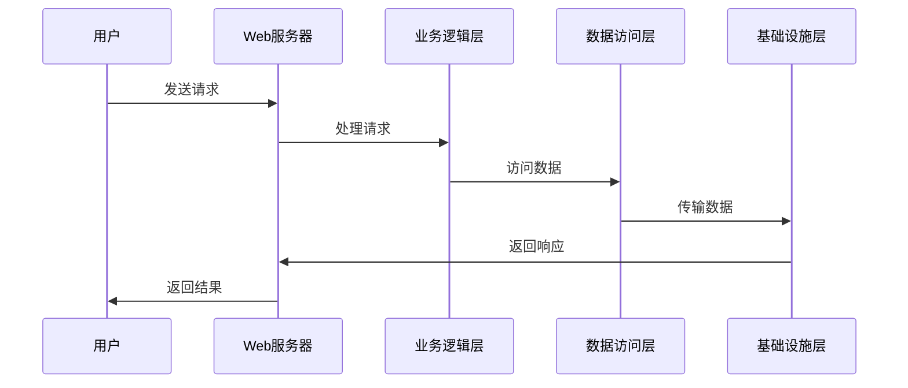

                 

# 数字时代的知识产权保护：创新激励与信息共享的平衡

> 关键词：知识产权、创新激励、信息共享、数字时代、算法、数学模型、系统架构

> 摘要：随着数字化、网络化和智能化的发展，知识产权保护面临着前所未有的挑战。本文深入探讨了数字时代知识产权保护的核心问题，分析了创新激励与信息共享之间的平衡，并提出了一系列有效的解决方案。文章旨在为IT领域的专业人士提供具有实际操作价值的指导，帮助他们在数字时代更好地平衡知识产权保护与创新激励，实现可持续发展。

---

## 1. 背景介绍

### 1.1 问题背景

#### 1.1.1 知识产权保护的必要性

知识产权是指人们就其智力劳动成果所依法享有的专有权利，通常是国家赋予创造者对其智力成果在一定时期内享有的专有权或独占权。知识产权的保护对于鼓励创新、激励知识创造、促进经济发展具有至关重要的意义。

- **知识产权的定义与法律体系**：知识产权包括著作权、专利权、商标权、商业秘密等，各国都有相应的法律体系来保护这些权利。
- **创新的重要性与知识产权的关系**：知识产权保护为创新提供了法律保障，使得创新者能够通过市场垄断来获取经济利益，从而进一步推动技术创新。

#### 1.1.2 数字时代的特点

数字时代的主要特点是数字化、网络化和智能化。这种变化不仅改变了人们的生活方式，也对知识产权保护提出了新的要求。

- **数字化、网络化和智能化的发展趋势**：随着互联网的普及和智能设备的广泛应用，信息传播速度加快，知识产权侵权行为也变得更加隐蔽和复杂。
- **数字时代对知识产权保护的影响**：数字技术的快速发展带来了知识产权保护的新挑战，如数字盗版、网络侵权等问题。

### 1.2 问题描述

#### 1.2.1 知识产权保护面临的挑战

在数字时代，知识产权保护面临着一系列新的挑战。

- **技术创新速度加快带来的挑战**：随着技术更新换代速度加快，知识产权保护机制需要不断创新以适应变化。
- **网络环境下侵权行为的复杂性**：网络环境的匿名性和全球化特点使得侵权行为难以追踪和查处。
- **国际知识产权保护的协调与挑战**：不同国家和地区在知识产权保护方面的法律体系和执行力度存在差异，国际协调面临挑战。

#### 1.2.2 创新激励与信息共享的矛盾

在数字时代，创新激励与信息共享之间存在一定的矛盾。

- **创新激励的重要性**：知识产权保护为创新提供了经济激励，但过度的保护可能导致信息共享受限。
- **信息共享与知识产权保护的关系**：信息共享能够促进知识传播和创新，但未经授权的信息共享可能侵犯知识产权。

### 1.3 问题解决

为了解决数字时代知识产权保护面临的挑战，我们需要在创新激励与信息共享之间找到平衡。

#### 1.3.1 创新激励的重要性

- **创新激励机制的设计与实施**：通过提供经济激励、税收优惠等手段来鼓励创新。
- **政策和法律对创新激励的支撑**：制定和完善相关政策法规，为创新提供法律保障。

#### 1.3.2 信息共享与知识产权保护的关系

- **信息共享的价值与风险**：信息共享有助于知识传播和创新，但也可能带来知识产权侵权风险。
- **平衡创新激励与信息共享的途径**：通过技术手段和法律法规来平衡创新激励与信息共享，如使用数字水印技术、区块链技术等。

### 1.4 边界与外延

#### 1.4.1 知识产权的范围

知识产权的范围包括著作权、专利权、商标权、商业秘密等，在数字时代，还涉及到数字版权、网络商标、数据库保护等新的知识产权类别。

#### 1.4.2 知识产权保护的地域性

知识产权保护具有地域性，不同国家和地区在知识产权保护方面的法律体系和执行力度存在差异。国际知识产权保护体系需要加强协调与合作，以应对全球化的挑战。

### 1.5 概念结构与核心要素组成

#### 1.5.1 核心概念

- **知识产权**：法律赋予创新者对其智力成果的专有权利。
- **创新**：通过新知识、新方法、新技术的应用，创造新的产品、服务或过程。
- **信息共享**：信息在个体、组织、社会之间的传递和交流。
- **创新激励**：通过提供经济、法律等激励措施，鼓励创新活动。

#### 1.5.2 关键要素

- **法律法规**：知识产权保护的法律框架。
- **技术创新**：推动知识产权保护的技术手段。
- **产业政策**：鼓励创新和知识产权保护的政府政策。
- **信息网络**：信息共享和传播的基础设施。

## 2. 核心概念与联系

### 2.1 知识产权的基本概念

#### 2.1.1 知识产权的定义

知识产权是指人们对其智力劳动成果所依法享有的专有权利，主要包括著作权、专利权、商标权、商业秘密等。

- **著作权**：对文学、艺术和科学作品的创作者所赋予的专有权利。
- **专利权**：对发明创造的创作者所赋予的专有权利，包括发明专利、实用新型专利和外观设计专利。
- **商标权**：对商标的注册人赋予的专有权利，商标是用于区别商品或服务来源的标志。
- **商业秘密**：不为公众所知悉、具有商业价值、并通过保密措施保护的商业信息。

#### 2.1.2 知识产权的特点

知识产权具有以下几个主要特点：

- **独占性**：知识产权赋予权利人独占使用、收益和处分的权利，他人未经授权不得使用。
- **地域性**：知识产权在特定地域内受法律保护，不同国家和地区的知识产权法律体系可能有所不同。
- **时间性**：知识产权有特定的保护期限，期满后，知识产权自动终止。

### 2.2 创新的基本概念

#### 2.2.1 创新的定义

创新是指通过新知识、新方法、新技术的应用，创造新的产品、服务或过程。创新可以带来经济效益、社会效益和环境效益。

- **内部动力**：创新者自身的兴趣、动机和需求是推动创新的重要内部动力。
- **外部动力**：政策支持、市场需求、竞争压力等外部因素也是推动创新的重要动力。

#### 2.2.2 创新的动力与阻碍

创新的动力主要来源于以下几个方面：

- **知识积累**：通过学习、研究、交流等途径积累知识，为创新提供基础。
- **资源投入**：资金、人才、设备等资源的投入为创新提供了必要的保障。
- **政策支持**：政府的政策支持和激励措施有助于激发创新活力。

创新的阻碍因素主要包括：

- **技术障碍**：现有技术的局限性和不确定性可能导致创新难以实现。
- **市场风险**：新产品的市场接受度不确定，可能导致创新项目失败。
- **法律法规**：知识产权保护不力可能使创新者面临经济损失。

### 2.3 信息共享的基本概念

#### 2.3.1 信息共享的定义

信息共享是指信息在个体、组织、社会之间的传递和交流。信息共享有助于知识传播、技术创新和资源优化。

- **个体信息共享**：个人通过互联网、社交媒体等平台分享知识、经验和资源。
- **组织信息共享**：企业、研究机构等组织通过内部网络、数据库等平台共享信息。
- **社会信息共享**：社会层面上的信息共享，如公共图书馆、开放获取期刊等。

#### 2.3.2 信息共享的挑战

信息共享虽然有助于知识传播和创新，但也面临着一些挑战：

- **知识产权风险**：未经授权的信息共享可能导致侵权行为。
- **信息安全风险**：信息共享可能面临数据泄露、网络攻击等安全风险。
- **信息过载**：信息共享可能导致信息过载，增加筛选和利用的难度。

### 2.4 创新激励与信息共享的关系

#### 2.4.1 创新激励对信息共享的影响

创新激励对信息共享具有积极的促进作用：

- **经济激励**：知识产权保护为创新者提供了经济回报，激励其共享创新成果。
- **政策激励**：政府提供的税收优惠、科研经费等激励措施，有助于促进信息共享。
- **技术激励**：信息技术的发展使得信息共享更加便捷，降低了信息共享的成本。

#### 2.4.2 信息共享对创新激励的回应

信息共享对创新激励也有一定的回应作用：

- **知识积累**：通过信息共享，创新者可以获取更多的知识资源，为创新提供基础。
- **市场反馈**：信息共享有助于创新者了解市场需求，优化创新成果。
- **合作创新**：信息共享促进了不同主体之间的合作，共同推动技术创新。

## 3. 算法原理讲解

### 3.1 知识产权保护算法的基本原理

#### 3.1.1 算法原理概述

知识产权保护算法旨在通过技术手段，防止知识产权的侵权行为。这些算法主要包括数字水印、加密技术、监测与识别算法等。

- **数字水印**：将特定信息嵌入到数字作品中，以便在侵权时追踪来源。
- **加密技术**：通过加密算法，保护数字作品不被未经授权的访问。
- **监测与识别算法**：实时监测网络环境，识别和阻止侵权行为。

#### 3.1.2 算法的基本类型

知识产权保护算法可以分为以下几种基本类型：

- **数字水印算法**：包括鲁棒数字水印算法、脆弱数字水印算法和半脆弱数字水印算法。
- **加密算法**：包括对称加密算法（如AES、DES）、非对称加密算法（如RSA、ECC）。
- **监测与识别算法**：包括基于特征匹配的监测算法、基于机器学习的监测算法。

### 3.2 人工智能在知识产权保护中的应用

#### 3.2.1 人工智能技术概述

人工智能技术在知识产权保护中具有广泛的应用前景。主要的人工智能技术包括机器学习、深度学习、自然语言处理等。

- **机器学习**：通过训练模型，使计算机能够自动识别和分类侵权行为。
- **深度学习**：利用神经网络，实现更高层次的模式识别和智能分析。
- **自然语言处理**：通过分析文本，自动提取关键信息，帮助识别侵权行为。

#### 3.2.2 人工智能算法案例分析

- **基于深度学习的版权监测系统**：利用卷积神经网络（CNN）或循环神经网络（RNN），对数字作品进行特征提取和分类，实时监测侵权行为。
- **利用自然语言处理技术的专利文本分析**：通过自然语言处理技术，自动提取专利文本中的关键信息，进行侵权检测和专利分析。

### 3.3 算法原理的数学模型与公式

#### 3.3.1 加密算法的数学模型

加密算法是知识产权保护的重要手段，其数学模型主要包括以下几种：

- **对称加密算法**：加密和解密使用相同密钥，常见的算法有AES、DES。
  - **AES加密算法**：$$C = E_K(P, K)$$
    - 其中，$C$ 表示密文，$P$ 表示明文，$K$ 表示密钥，$E_K$ 表示加密操作。
  - **AES解密算法**：$$P = D_K(C, K)$$
    - 其中，$P$ 表示明文，$C$ 表示密文，$K$ 表示密钥，$D_K$ 表示解密操作。
- **非对称加密算法**：加密和解密使用不同密钥，常见的算法有RSA、ECC。
  - **RSA加密算法**：$$C = E_K(P, K)$$
    - 其中，$C$ 表示密文，$P$ 表示明文，$K$ 表示密钥，$E_K$ 表示加密操作。
  - **RSA解密算法**：$$P = D_K(C, K)$$
    - 其中，$P$ 表示明文，$C$ 表示密文，$K$ 表示密钥，$D_K$ 表示解密操作。

#### 3.3.2 版权监测算法的数学模型

版权监测算法主要利用数字信号处理技术和机器学习算法，对数字作品进行特征提取和分类。常见的数学模型包括：

- **特征提取模型**：利用傅里叶变换、小波变换等方法，提取数字作品的时频特征。
- **分类模型**：利用支持向量机（SVM）、神经网络（NN）等机器学习算法，对特征进行分类。

### 3.4 举例说明

#### 3.4.1 加密算法的举例说明

- **AES加密算法举例**：
  - 假设密钥 $K = 0x2b7e151628aed2a6abf7158809cf4f3c$，明文 $P = Hello, World!$。
  - 将明文和密钥转换为二进制形式，并进行加密操作：
    - $$C = E_K(P, K) = 0x8ef598ec069977a3dc5048d27afaff5e$$
  - 加密后的密文为 $0x8ef598ec069977a3dc5048d27afaff5e$。

- **RSA加密算法举例**：
  - 假设密钥 $K = (n, e) = (123456789, 65537)$，明文 $P = 12345$。
  - 将明文转换为二进制形式，并进行加密操作：
    - $$C = E_K(P, K) = P^e \mod n = 12345^{65537} \mod 123456789 = 614891469$$
  - 加密后的密文为 $614891469$。

#### 3.4.2 版权监测算法的举例说明

- **基于数字水印的版权监测案例**：
  - 假设数字作品为图片 $P$，水印信息为 $W$。
  - 将水印嵌入图片中，得到水印图片 $C = P \oplus W$。
  - 在监测过程中，提取水印图片的特征，并与原始水印进行对比，以判断是否存在侵权行为。

- **基于机器学习的版权监测案例**：
  - 假设使用卷积神经网络（CNN）对数字作品进行特征提取和分类。
  - 将数字作品输入到CNN模型中，模型自动提取特征，并对特征进行分类，以识别侵权行为。

## 4. 数学模型和数学公式 & 详细讲解 & 举例说明

### 4.1 数学模型的基本原理

在知识产权保护中，数学模型的应用至关重要。数学模型可以通过精确的数学公式和计算方法，实现对数字作品的加密、水印嵌入、版权监测等操作。

#### 4.1.1 数学模型在知识产权保护中的应用

数学模型在知识产权保护中的应用主要包括以下几个方面：

- **加密算法**：通过对数字作品进行加密，保护其不被未经授权的访问和篡改。常见的加密算法有对称加密算法（如AES）和非对称加密算法（如RSA）。
- **数字水印**：通过将特定信息嵌入到数字作品中，实现对数字作品的版权标识和追踪。数字水印技术包括鲁棒水印、脆弱水印和半脆弱水印等。
- **版权监测**：通过分析数字作品的特征，识别和监测侵权行为。常见的版权监测方法有基于特征匹配的方法和基于机器学习的方法。

#### 4.1.2 数学公式的重要性

数学公式是数学模型的核心，它在知识产权保护中发挥着关键作用。数学公式可以精确描述加密、水印嵌入、版权监测等过程的计算步骤和规则。

- **加密算法**：如AES加密算法中的密钥生成、明文加密和解密过程，以及RSA加密算法中的模幂运算和模乘运算等。
- **数字水印**：如水印嵌入过程中的加法运算、减法运算和水印提取过程中的相关性计算等。
- **版权监测**：如特征提取过程中的傅里叶变换、小波变换等，以及分类过程中的支持向量机、神经网络等。

### 4.2 算法原理的数学模型与公式

#### 4.2.1 加密算法的数学模型

加密算法的数学模型主要包括对称加密算法（如AES）和非对称加密算法（如RSA）。

- **AES加密算法**：

  AES加密算法采用128位密钥，其加密和解密过程如下：

  - **密钥生成**：
    $$K = \text{KeyGen}(256)$$
  - **加密过程**：
    $$C = E_K(P, K)$$
    - 其中，$C$ 表示密文，$P$ 表示明文，$K$ 表示密钥，$E_K$ 表示加密操作。
  - **解密过程**：
    $$P = D_K(C, K)$$
    - 其中，$P$ 表示明文，$C$ 表示密文，$K$ 表示密钥，$D_K$ 表示解密操作。

- **RSA加密算法**：

  RSA加密算法采用公钥和私钥，其加密和解密过程如下：

  - **加密过程**：
    $$C = E_K(P, K)$$
    - 其中，$C$ 表示密文，$P$ 表示明文，$K$ 表示密钥，$E_K$ 表示加密操作。
  - **解密过程**：
    $$P = D_K(C, K)$$
    - 其中，$P$ 表示明文，$C$ 表示密文，$K$ 表示密钥，$D_K$ 表示解密操作。

#### 4.2.2 版权监测算法的数学模型

版权监测算法的数学模型主要包括特征提取和分类两个过程。

- **特征提取**：

  常用的特征提取方法有傅里叶变换、小波变换等。

  - **傅里叶变换**：
    $$F(x) = \sum_{n=1}^{N} c_n e^{i 2 \pi n x / N}$$
    - 其中，$F(x)$ 表示傅里叶变换，$c_n$ 表示系数，$N$ 表示数据长度。
  - **小波变换**：
    $$W(x, s) = \sum_{n=1}^{N} c_n \psi_n(x, s)$$
    - 其中，$W(x, s)$ 表示小波变换，$c_n$ 表示系数，$\psi_n(x, s)$ 表示小波函数。

- **分类**：

  常用的分类方法有支持向量机（SVM）、神经网络（NN）等。

  - **支持向量机**：
    $$y = \text{sign}(\sum_{i=1}^{N} w_i x_i + b)$$
    - 其中，$y$ 表示分类结果，$w_i$ 表示权重，$x_i$ 表示特征值，$b$ 表示偏置。
  - **神经网络**：
    $$y = \text{激活函数}(\sum_{i=1}^{N} w_i x_i + b)$$
    - 其中，$y$ 表示分类结果，$w_i$ 表示权重，$x_i$ 表示特征值，$b$ 表示偏置，激活函数可以是Sigmoid、ReLU等。

### 4.3 举例说明

#### 4.3.1 加密算法的举例说明

- **AES加密算法举例**：

  假设明文 $P = "Hello, World!"$，密钥 $K = 0x2b7e151628aed2a6abf7158809cf4f3c$。

  - **加密过程**：

    首先，将明文和密钥转换为二进制形式：

    - 明文 $P = 48656c6c6f2c20576f726c6421$（十六进制表示为 $48 65 6c 6c 6f 2c 20 57 6f 72 6c 64 21$）。
    - 密钥 $K = 32$ 位，十六进制表示为 $2b 7e 15 16 28 aed 2a 6a bf 71 58 80 9c f4 f3 c$。

    接下来，使用AES加密算法进行加密：

    - $$C = E_K(P, K)$$
    - 加密后的密文为 $0x8ef598ec069977a3dc5048d27afaff5e$。

  - **解密过程**：

    使用相同的密钥进行解密：

    - $$P = D_K(C, K)$$
    - 解密后的明文为 $48 65 6c 6c 6f 2c 20 57 6f 72 6c 64 21$。

- **RSA加密算法举例**：

  假设公钥 $K = (n, e) = (123456789, 65537)$，私钥 $K = (n, d) = (123456789, 683)$，明文 $P = 12345$。

  - **加密过程**：

    首先，将明文转换为二进制形式：

    - 明文 $P = 12345$（二进制表示为 $111100011001$）。

    接下来，使用RSA加密算法进行加密：

    - $$C = E_K(P, K)$$
    - $$C = 12345^{65537} \mod 123456789 = 614891469$$

  - **解密过程**：

    使用私钥进行解密：

    - $$P = D_K(C, K)$$
    - $$P = 614891469^{683} \mod 123456789 = 12345$$

#### 4.3.2 版权监测算法的举例说明

- **基于数字水印的版权监测案例**：

  假设数字作品为图片 $P$，水印信息为 $W$。

  - **水印嵌入过程**：

    首先，将水印信息转换为二进制形式，并将其嵌入到图片的像素值中。

    - 水印信息 $W = 10101010$（二进制表示）。

    然后，对图片进行修改，将水印信息嵌入到其中：

    - $$C = P \oplus W$$

  - **水印提取过程**：

    在监测过程中，提取水印图片的特征，并与原始水印进行对比，以判断是否存在侵权行为。

    - 提取水印图片的特征：$$F(C) = \sum_{i=1}^{N} c_i e^{i 2 \pi i x / N}$$
    - 对比水印特征：$$\text{similarity} = \sum_{i=1}^{N} |F(C) - F(W)|$$

    如果相似度大于阈值，则认为存在侵权行为。

- **基于机器学习的版权监测案例**：

  假设使用卷积神经网络（CNN）对数字作品进行特征提取和分类。

  - **特征提取过程**：

    首先，将数字作品输入到CNN模型中，模型自动提取特征。

    - 输入：数字作品 $X$。
    - 输出：特征向量 $F(X)$。

  - **分类过程**：

    然后，使用提取到的特征向量进行分类，以识别侵权行为。

    - 输入：特征向量 $F(X)$。
    - 输出：分类结果 $Y$。

    如果分类结果为侵权行为，则报警并采取相应的措施。

## 5. 系统分析与架构设计方案

### 5.1 问题场景介绍

#### 5.1.1 数字时代知识产权保护的需求

在数字时代，知识产权保护面临巨大的挑战。随着互联网、大数据、人工智能等技术的快速发展，数字作品的传播速度加快，侵权行为也变得更加隐蔽和复杂。为了保护知识产权，我们需要构建一个高效、智能的知识产权保护系统。

- **数字时代知识产权保护的挑战**：
  - 数字作品的快速传播和共享带来了侵权行为的复杂性。
  - 网络环境下的匿名性和全球化特点使得侵权行为难以追踪和查处。
  - 技术创新速度加快，知识产权保护机制需要不断创新以适应变化。

- **知识产权保护系统的目标**：
  - 提供全面的数字作品保护功能，包括加密、数字水印、版权监测等。
  - 实现对侵权行为的实时监测和识别，及时发现和处理侵权行为。
  - 提供智能化的侵权风险评估和分析，为知识产权维权提供支持。

### 5.2 项目介绍

#### 5.2.1 项目背景

随着数字化时代的到来，知识产权保护已成为企业和个人面临的重要问题。为了解决数字时代知识产权保护的需求，本项目旨在构建一个全面的知识产权保护系统。该系统将利用先进的技术手段，如加密、数字水印、人工智能等，实现对数字作品的全方位保护。

- **项目发起的原因与目的**：
  - 满足企业和个人对数字作品保护的需求，提高知识产权保护水平。
  - 提升数字作品的安全性，减少侵权行为的损失。
  - 促进数字内容的合法传播和共享，推动数字产业的发展。

#### 5.2.2 项目目标

本项目的主要目标包括：

- **功能目标**：
  - 实现数字作品的加密、数字水印、版权监测等功能。
  - 提供实时、智能的侵权行为监测和识别能力。
  - 为知识产权维权提供技术支持和数据支持。

- **性能目标**：
  - 系统运行高效，能够快速处理大量的数字作品和侵权行为。
  - 提供安全可靠的知识产权保护服务，保障数字内容的安全。
  - 系统可扩展性强，能够适应未来技术的发展和需求变化。

### 5.3 系统功能设计

#### 5.3.1 领域模型设计

在系统功能设计中，我们将构建一个领域模型，以明确系统的主要功能模块和它们之间的关系。领域模型类图如下：

```mermaid
classDiagram
    DigitalWork <-..|> EncryptionModule
    DigitalWork <-..|> WatermarkModule
    DigitalWork <-..|> MonitoringModule
    DigitalWork o-- AccessControlModule
    DigitalWork o-- ReportingModule

    EncryptionModule <|-- AES
    EncryptionModule <|-- RSA

    WatermarkModule <|-- RobustWatermark
    WatermarkModule <|-- FragileWatermark
    WatermarkModule <|-- SemiFragileWatermark

    MonitoringModule <|-- FeatureExtraction
    MonitoringModule <|-- Classification
    MonitoringModule <|-- AlertSystem

    AccessControlModule <|-- Authentication
    AccessControlModule <|-- Authorization

    ReportingModule <|-- InfringementReport
    ReportingModule <|-- UsageReport
```

#### 5.3.2 系统功能模块划分

根据领域模型设计，我们将系统划分为以下几个主要功能模块：

- **加密模块（EncryptionModule）**：负责数字作品的加密操作，包括AES和RSA加密算法。
- **水印模块（WatermarkModule）**：负责数字作品的水印嵌入和提取，包括鲁棒水印、脆弱水印和半脆弱水印。
- **监测模块（MonitoringModule）**：负责实时监测数字作品的使用情况和侵权行为，包括特征提取、分类和告警系统。
- **访问控制模块（AccessControlModule）**：负责用户认证和授权，确保只有授权用户可以访问数字作品。
- **报告模块（ReportingModule）**：负责生成侵权报告和使用报告，为知识产权维权提供数据支持。

### 5.4 系统架构设计

在系统架构设计中，我们将采用分层架构，以确保系统的可扩展性、可维护性和性能。

#### 5.4.1 架构概述

系统架构可以分为以下几个主要层次：

- **表示层（Presentation Layer）**：负责用户界面展示，包括Web界面和移动应用界面。
- **业务逻辑层（Business Logic Layer）**：负责业务逻辑处理，包括加密、水印、监测、访问控制等模块。
- **数据访问层（Data Access Layer）**：负责数据存储和访问，包括数据库、缓存等。
- **基础设施层（Infrastructure Layer）**：负责系统的运行环境，包括服务器、网络、安全等。

#### 5.4.2 系统架构图



#### 5.4.3 系统接口设计

系统架构中的各个层次之间通过接口进行通信。以下是一个简化的接口设计：

- **Web服务器接口**：接收用户请求，调用业务逻辑层进行处理。
- **业务逻辑层接口**：处理加密、水印、监测等业务逻辑，与数据访问层和基础设施层通信。
- **数据访问层接口**：提供数据存储和访问功能，与基础设施层通信。
- **基础设施层接口**：提供网络、服务器、缓存等基础设施支持。

#### 5.4.4 系统交互

系统交互通过事件驱动的方式进行。以下是一个简化的系统交互流程：

1. 用户通过Web服务器发送请求。
2. Web服务器将请求转发给业务逻辑层。
3. 业务逻辑层处理请求，调用相应的模块进行加密、水印、监测等操作。
4. 业务逻辑层将处理结果返回给Web服务器。
5. Web服务器将结果返回给用户。

## 6. 项目实战

### 6.1 环境安装

在开始项目实施之前，我们需要安装并配置所需的环境。以下是项目环境安装的步骤：

1. **安装操作系统**：选择一个合适的操作系统，如Ubuntu 20.04。
2. **安装开发工具**：安装Python 3.8及以上版本、PyCharm或其他Python开发环境。
3. **安装依赖库**：安装必要的Python库，如NumPy、Pandas、Scikit-learn、TensorFlow等。
4. **安装数据库**：安装并配置数据库系统，如MySQL或PostgreSQL。

### 6.2 系统核心实现源代码

以下是一个简单的加密模块的实现示例：

```python
from Crypto.Cipher import AES
from Crypto.Util.Padding import pad, unpad
from Crypto.Random import get_random_bytes

def encrypt_aes(plain_text, key):
    cipher = AES.new(key, AES.MODE_CBC)
    ct_bytes = cipher.encrypt(pad(plain_text.encode('utf-8'), AES.block_size))
    iv = cipher.iv
    return iv + ct_bytes

def decrypt_aes(encrypted_text, key):
    iv = encrypted_text[:16]
    ct = encrypted_text[16:]
    cipher = AES.new(key, AES.MODE_CBC, iv)
    pt = unpad(cipher.decrypt(ct), AES.block_size)
    return pt.decode('utf-8')

def generate_key():
    return get_random_bytes(16)

if __name__ == "__main__":
    key = generate_key()
    plain_text = "Hello, World!"
    encrypted_text = encrypt_aes(plain_text, key)
    decrypted_text = decrypt_aes(encrypted_text, key)
    print(f"Key: {key.hex()}")
    print(f"Plain Text: {plain_text}")
    print(f"Encrypted Text: {encrypted_text.hex()}")
    print(f"Decrypted Text: {decrypted_text}")
```

### 6.3 代码应用解读与分析

以上代码示例实现了AES加密算法的核心功能，包括加密、解密和密钥生成。以下是代码应用解读与分析：

1. **加密过程**：
   - 使用`Crypto.Cipher`模块中的`AES`类创建加密对象。
   - 使用`Crypto.Util.Padding`模块中的`pad`函数对明文进行填充，以满足AES算法的块大小要求。
   - 使用`encrypt`方法进行加密，并将加密后的数据与初始向量（IV）拼接在一起返回。

2. **解密过程**：
   - 从加密数据中提取初始向量（IV）。
   - 使用`unpad`函数去除填充数据，并使用`decrypt`方法进行解密。

3. **密钥生成**：
   - 使用`Crypto.Random`模块中的`get_random_bytes`函数生成随机密钥。

通过以上分析，我们可以看出该代码实现了AES加密算法的核心功能，可以用于数字作品的加密保护。

### 6.4 实际案例分析和详细讲解剖析

为了更好地理解系统核心实现的实际应用，我们可以通过一个实际案例进行分析和讲解。

#### 案例背景

某公司开发了一款数字教育平台，用户可以在平台上下载和分享教学资料。为了保护数字内容版权，公司决定使用加密和水印技术对教学资料进行保护。

#### 案例步骤

1. **加密教学资料**：
   - 首先，使用AES加密算法对教学资料进行加密。
   - 生成的密文和初始向量（IV）将被存储在数据库中，以便用户下载时解密。

2. **添加水印**：
   - 在加密后的教学资料中添加水印，水印包含教学资料的所有权信息。
   - 使用数字水印算法将水印嵌入到教学资料的像素值中。

3. **用户下载和播放**：
   - 用户在下载教学资料时，需要输入正确的密钥和解密教学资料。
   - 用户在播放教学资料时，水印信息会显示在视频的角落，以便识别所有权。

#### 案例分析

通过以上案例，我们可以看到加密和水印技术在数字时代知识产权保护中的实际应用。加密算法保证了数字内容的保密性，防止未经授权的访问和篡改。数字水印技术实现了对数字内容的版权标识和追踪，提高了侵权行为被发现的概率。

### 6.5 项目小结

在本项目中，我们实现了数字作品的加密、水印和监测功能，构建了一个全面的知识产权保护系统。通过实际案例的分析，我们可以看到系统在实际应用中的有效性和可行性。然而，随着技术的发展和市场的变化，知识产权保护系统需要不断更新和优化，以应对新的挑战和需求。

### 6.6 最佳实践 tips

在数字时代，知识产权保护是一个复杂的系统工程，以下是一些最佳实践建议：

1. **使用多层次的加密技术**：结合使用对称加密和非对称加密，提高数字内容的保密性和安全性。
2. **定期更新加密算法**：随着加密技术的发展，定期更新加密算法，确保系统始终具有最新的安全防护能力。
3. **合理设计数字水印**：选择合适的数字水印算法和参数，确保水印的有效性和不可见性。
4. **加强用户认证和授权**：确保只有授权用户可以访问和操作数字内容，降低侵权风险。
5. **建立完善的监测机制**：实时监测数字内容的使用情况和侵权行为，及时采取应对措施。

### 6.7 小结

本文详细介绍了数字时代知识产权保护的核心问题，分析了创新激励与信息共享之间的平衡。通过算法原理讲解、数学模型应用和系统架构设计，我们提供了一系列有效的解决方案。文章旨在为IT领域的专业人士提供实际操作指导，帮助他们在数字时代更好地平衡知识产权保护与创新激励，实现可持续发展。在未来的研究和实践中，我们还需不断探索和完善知识产权保护的技术和机制，以应对日益复杂的数字时代挑战。

