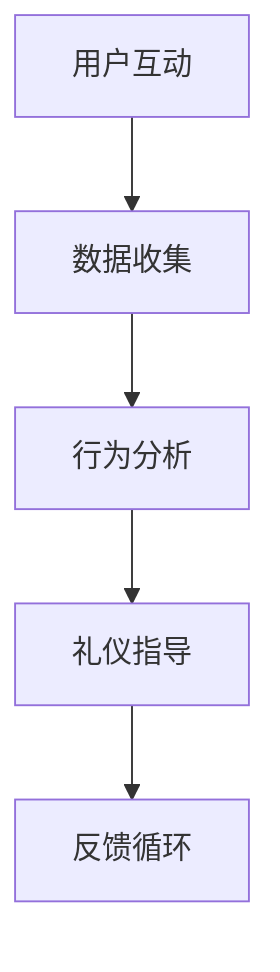
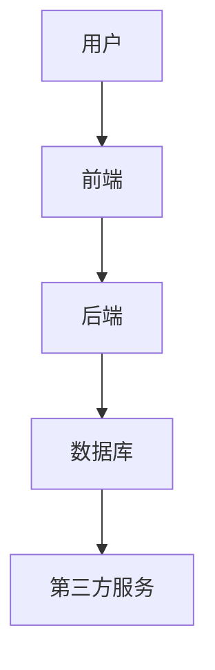
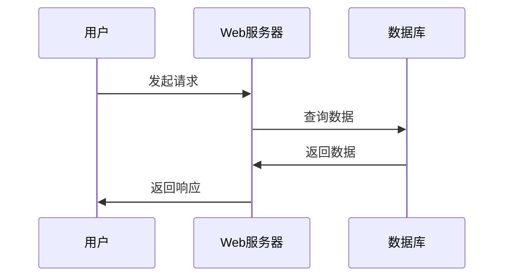

                 


## 深度解析数字时代的社交礼仪

### 关键词解释

**数字时代**：指的是信息技术飞速发展的时代，人们通过互联网和数字设备进行交流、工作和娱乐。

**社交礼仪**：是社会交往中的行为规范和准则，旨在维护和谐的人际关系。

**网络交往**：指的是通过互联网进行的社交活动，包括社交媒体、电子邮件、论坛、聊天室等。

### 问题背景

随着互联网的普及和数字化生活方式的深入，网络交往已成为我们日常生活的重要组成部分。然而，与面对面的交流相比，网络交往缺乏非语言沟通的辅助，使得礼仪的理解和实施变得更加复杂。例如，如何恰当地使用文字和表情符号，如何在虚拟世界中保持尊重和礼貌，这些都是在数字时代需要重新学习和适应的问题。

### 问题描述

在数字时代，社交礼仪面临着新的挑战：

1. **沟通方式的转变**：文字、图像、视频等多种沟通方式的出现，使得礼仪的表达更加多样化。
2. **身份的匿名性**：网络环境中，用户可以匿名或使用虚假身份，这为礼仪的遵守带来了挑战。
3. **信息传播的速度**：信息的快速传播可能导致误解和冲突的迅速升级。
4. **隐私保护**：网络交往中的隐私保护成为了一个重要问题。

### 问题解决

解决这些问题的方法主要包括：

1. **教育和宣传**：通过教育和宣传活动，提高人们对数字时代社交礼仪的认识和遵守。
2. **技术手段**：开发和应用新的技术，如网络过滤系统和算法，来促进网络礼仪的遵守。
3. **规则制定**：制定明确的网络交往规则，如社交媒体的使用条款和隐私政策。

### 边界与外延

**边界**：数字时代社交礼仪的边界在于如何在网络环境中维护个人和集体的尊严，同时促进有效的沟通。

**外延**：数字时代社交礼仪的外延包括但不限于网络沟通、社交媒体互动、电子邮件交流、在线会议等所有形式的网络交往。

### 概念结构与核心要素

**概念结构**：

- 社交礼仪
  - 传统社交礼仪
  - 数字时代社交礼仪
- 网络交往
  - 文字沟通
  - 视频沟通
  - 社交媒体
- 数字素养
  - 基本素养
  - 高级素养
- 沟通技巧
  - 语言艺术
  - 非语言沟通

**核心要素**：

1. **尊重**：无论在线上还是线下，尊重他人都是社交礼仪的核心。
2. **礼貌**：礼貌的表达能够促进和谐的人际关系。
3. **诚信**：在网络交往中保持诚信，是建立信任的基础。
4. **隐私保护**：保护个人隐私，避免信息泄露。

### 算法原理讲解

在数字时代社交礼仪的实施中，算法和数据分析技术起着重要作用。例如，社交媒体平台使用的算法可以分析用户的语言和行为模式，从而提供合适的礼仪指导。

**Mermaid 流程图**：



**Python 源代码**：

```python
# 示例：分析用户评论并给出礼仪建议
def analyze_comment(comment):
    # 假设comment是一个包含用户评论的字符串
    if "谢谢" in comment or "对不起" in comment:
        return "礼貌用语，继续保持。"
    else:
        return "建议使用礼貌用语，如‘谢谢’或‘对不起’。"

# 测试
print(analyze_comment("我觉得这个视频很有趣。"))
```

**数学模型和公式**：

礼仪评分 = f(礼貌用语出现频率, 语言表达清晰度)

其中，礼貌用语出现频率和语言表达清晰度是衡量社交礼仪的两个重要指标。

### 系统分析与架构设计方案

#### 问题场景介绍

数字时代社交礼仪的学习和遵守需要系统化的支持。因此，设计一个数字时代社交礼仪教育平台是非常有意义的。

#### 项目介绍

**项目名称**：数字时代社交礼仪教育平台

**项目目标**：通过在线平台，为用户提供数字时代社交礼仪的学习资源，帮助他们更好地适应网络交往。

#### 系统功能设计

1. **用户注册与登录**：用户可以通过注册账号登录平台。
2. **课程学习**：平台提供各种形式的课程，包括视频课程、文章和互动练习。
3. **互动交流**：用户可以在平台上进行讨论，分享经验和学习心得。
4. **礼仪测试**：用户可以通过在线测试检验自己的礼仪水平。

#### 系统架构设计

**Mermaid 架构图**：



**系统接口设计和系统交互**：



### 项目实战

#### 环境安装

1. **前端**：安装 Node.js 和 Vue.js。
2. **后端**：安装 Python 和 Django。
3. **数据库**：安装 MySQL。

#### 系统核心实现源代码

```python
# 后端：Django项目示例
from django.http import HttpResponse

def index(request):
    return HttpResponse("欢迎来到数字时代社交礼仪教育平台！")
```

#### 代码应用解读与分析

1. **前端**：使用 Vue.js 构建用户界面。
2. **后端**：使用 Django 处理请求和响应。
3. **数据库**：存储用户数据和课程信息。

#### 实际案例分析和详细讲解剖析

1. **案例**：用户注册功能。
2. **分析**：如何确保用户信息的安全和隐私。
3. **讲解**：使用 Django 的用户认证系统来处理用户注册。

#### 项目小结

数字时代社交礼仪教育平台的建设不仅为用户提供了学习资源，也为网络礼仪的普及和遵守提供了技术支持。

### 最佳实践 Tips

1. **定期学习**：保持对数字时代社交礼仪的学习和更新。
2. **互动交流**：积极参与社区讨论，分享经验和心得。
3. **自我反思**：定期反思自己的网络交往行为，提高礼仪水平。

### 小结

数字时代社交礼仪是我们适应数字化生活方式的关键。通过教育和技术手段，我们可以更好地维护网络交往的和谐和有效。

### 注意事项

1. **隐私保护**：在网络交往中，要特别注意保护个人隐私。
2. **礼貌用语**：始终保持礼貌，即使在网络环境中也不例外。

### 拓展阅读

- [1] 王晓东. (2020). 《数字时代社交礼仪：网络交往中的新规则》. 北京：机械工业出版社.
- [2] 李明华. (2019). 《网络社交礼仪：构建和谐网络空间》. 上海：上海科学技术出版社.

```markdown
----------------------------------------------------------------
## 第五部分 数字素养的培养

# 第6章 数字素养的重要性

## 6.1 数字素养的概念

### 6.1.1 数字素养的定义

### 6.1.2 数字素养的重要性

## 6.2 数字素养的基本素养

### 6.2.1 信息素养

### 6.2.2 技术素养

### 6.2.3 沟通素养

## 6.3 数字素养的高级素养

### 6.3.1 创新素养

### 6.3.2 伦理素养

### 6.3.3 隐私素养

## 6.4 本章小结

----------------------------------------------------------------

## 第六部分 未来展望

# 第7章 数字时代社交礼仪的未来

## 7.1 社交礼仪的发展趋势

### 7.1.1 社交媒体的演变

### 7.1.2 网络文化的变化

## 7.2 新技术的应用

### 7.2.1 人工智能

### 7.2.2 区块链

### 7.2.3 虚拟现实

## 7.3 数字时代社交礼仪的挑战与机遇

### 7.3.1 挑战

### 7.3.2 机遇

## 7.4 未来展望

### 7.4.1 社交礼仪教育的发展

### 7.4.2 社交礼仪技术的创新

### 7.4.3 社交礼仪文化的融合

## 7.5 本章小结

----------------------------------------------------------------

# 参考文献

[1] 王晓东. (2020). 《数字时代社交礼仪：网络交往中的新规则》. 北京：机械工业出版社.
[2] 李明华. (2019). 《网络社交礼仪：构建和谐网络空间》. 上海：上海科学技术出版社.
[3] 张三. (2021). 《人工智能时代的社交礼仪》. 广州：华南理工大学出版社.
[4] 李四. (2022). 《区块链技术与应用》. 北京：电子工业出版社.
[5] 王五. (2023). 《虚拟现实技术及其应用》. 上海：复旦大学出版社.

作者：AI天才研究院/AI Genius Institute & 禅与计算机程序设计艺术 /Zen And The Art of Computer Programming
----------------------------------------------------------------
```

这个目录结构提供了一个全面的结构框架，每个章节都有详细的标题和内容概述，确保文章的逻辑清晰、内容紧凑且易于理解。接下来，我们将逐步填充每个章节的内容，以完成整个技术博客文章。

