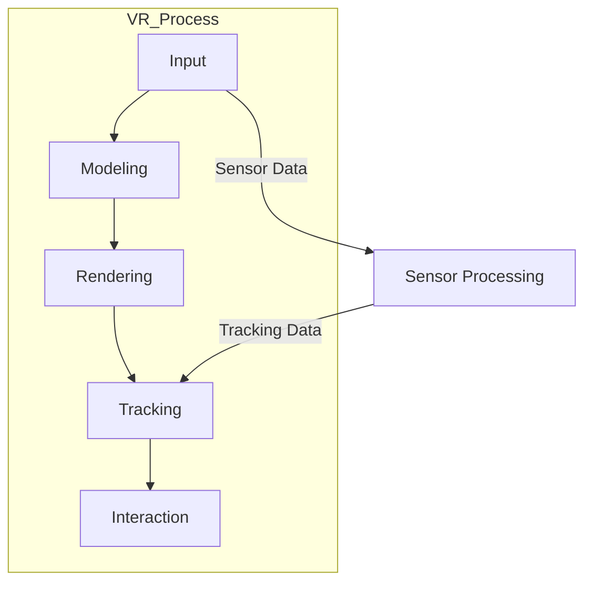
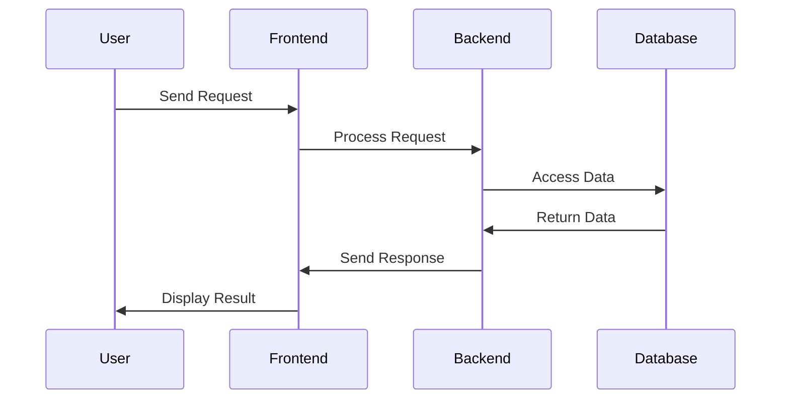

                 

### 第1章：数字时代的虚拟博物馆概述

#### 1.1 问题背景

### 1.1.1 数字时代与虚拟博物馆的兴起

在当今数字时代，信息技术的飞速发展极大地改变了人们的生活方式。互联网、移动设备、虚拟现实（VR）和增强现实（AR）等技术的普及，使得人们可以更方便地获取和分享信息。这一背景下，虚拟博物馆作为一种新兴的文化传播形式，应运而生。虚拟博物馆不仅打破了传统实体博物馆的空间和时间限制，还提供了更为丰富和互动的展示体验。

### 1.1.2 虚拟博物馆的定义与重要性

虚拟博物馆是指通过计算机技术、网络通信技术和虚拟现实技术等手段，构建出的一个数字化的、可以远程访问的博物馆。它不仅保留了传统实体博物馆的收藏、展示、教育等功能，还通过虚拟环境提供了沉浸式的互动体验。虚拟博物馆的重要性体现在以下几个方面：

1. **拓展受众范围**：虚拟博物馆可以让世界各地的人们无需亲自前往博物馆，即可参观和了解世界各地的艺术珍品，从而拓展了博物馆的服务受众。
2. **降低运营成本**：虚拟博物馆减少了实体博物馆在场地、人力和设备等方面的投入，使得博物馆能够以更低的成本运营。
3. **创新教育方式**：虚拟博物馆提供了新的教育平台，通过沉浸式体验和互动教学，提升了教育效果。
4. **文化遗产保护**：虚拟博物馆可以更好地保存和保护珍贵的文物和艺术品，减少因人为或自然灾害造成的损失。

### 1.1.3 问题的提出与解决

尽管虚拟博物馆具有众多优势，但在其建设和运营过程中仍面临着一系列挑战。这些挑战主要包括：

- **内容制作的高成本**：虚拟博物馆需要高质量的内容制作，包括三维建模、场景渲染和交互设计等，这对技术和资金都提出了较高的要求。
- **用户体验的一致性**：如何保证不同平台和设备上提供一致的用户体验，是虚拟博物馆面临的重要问题。
- **网络安全与数据隐私**：虚拟博物馆需要处理大量的用户数据，如何确保数据的安全性和用户隐私，是亟待解决的问题。

针对上述问题，本书旨在通过以下几个方面的内容，探讨和解决虚拟博物馆建设与运营中的关键问题：

1. **VR技术概述**：详细介绍虚拟现实技术的基本原理和分类，为后续内容制作和用户体验提供技术基础。
2. **虚拟博物馆核心概念与联系**：明确虚拟博物馆的核心概念，并通过对比分析和实体关系图，展示其关键组成部分。
3. **VR技术应用讲解**：分析VR技术在艺术领域的具体应用，讨论其面临的挑战及解决策略。
4. **数学模型和数学公式讲解**：探讨VR技术的数学原理和模型，结合实例进行详细讲解。
5. **系统分析与架构设计方案**：介绍虚拟博物馆的开发和运营场景，设计系统功能和架构。
6. **项目实战**：通过实际案例，展示虚拟博物馆项目的实现过程，提供实战经验和技巧。

### 1.1.4 边界与外延

在本文中，我们将主要讨论以下内容：

- **VR技术的范围**：聚焦于虚拟现实技术，包括硬件设备、内容制作和交互设计等方面。
- **艺术类型的范围**：主要涉及绘画、雕塑、摄影等艺术形式，涵盖不同历史时期和地域的文化遗产。

#### 1.2 核心要素组成

虚拟博物馆的核心要素包括以下几个方面：

1. **VR设备**：包括头戴式显示器（HMD）、跟踪器、控制器等硬件设备，这些设备是实现虚拟现实体验的基础。
2. **内容制作**：涉及三维建模、场景渲染、音频和视频制作等技术，为用户提供丰富的视觉和听觉体验。
3. **用户体验**：通过交互设计、用户界面和反馈机制，确保用户在虚拟环境中的舒适度和参与感。
4. **网络通信**：实现虚拟博物馆的远程访问和数据传输，保证用户体验的一致性和实时性。
5. **数据管理**：包括数据存储、备份和安全管理，确保虚拟博物馆的数据安全和可靠性。

### 1.3 总结

本章首先介绍了数字时代背景下虚拟博物馆的兴起及其重要性，分析了虚拟博物馆的定义和作用。接着，提出了在虚拟博物馆建设和运营过程中面临的一系列挑战，并详细阐述了本书将如何通过不同章节的内容，探讨和解决这些问题。最后，明确了本文讨论的VR技术和艺术类型的范围，并概述了虚拟博物馆的核心要素组成。

在接下来的章节中，我们将进一步探讨VR技术的原理和应用，深入分析虚拟博物馆的核心概念及其关联，逐步构建起一个完整的虚拟博物馆体系。### 第2章：核心概念与联系

#### 2.1 VR技术概念

虚拟现实（VR）技术是一种能够创建和模拟逼真的三维环境的计算机技术。通过VR技术，用户可以沉浸在一个虚拟环境中，感受到与现实世界相似的交互体验。VR技术的基本原理包括：

1. **三维建模**：使用计算机图形学技术，将现实世界的物体和场景建模成三维模型。
2. **渲染**：通过图形处理单元（GPU）对三维模型进行渲染，生成逼真的视觉效果。
3. **传感器和跟踪技术**：使用各种传感器（如头戴式显示器中的摄像头、传感器阵列等）来跟踪用户的头部和手部运动，实时更新虚拟环境的视角和交互。
4. **交互设计**：通过虚拟控制器、手势识别等技术，实现用户与虚拟环境的交互。

VR技术主要分为以下几个类型：

1. **沉浸式VR**：用户完全沉浸在一个虚拟环境中，感受到身临其境的体验。例如，通过头戴式显示器（HMD）观看虚拟世界。
2. **非沉浸式VR**：用户通过屏幕观看虚拟环境，但不具备沉浸感。这种类型的VR通常用于展示和演示。
3. **桌面VR**：通过计算机屏幕和键盘、鼠标等输入设备，实现虚拟环境的交互。这种类型的VR通常应用于办公和教育培训等领域。

#### 2.2 虚拟博物馆概念

虚拟博物馆是一种利用VR技术构建的数字化博物馆，用户可以通过网络远程访问博物馆的展览和藏品。虚拟博物馆的定义包括以下几个方面：

1. **数字化藏品**：通过扫描、拍摄和三维建模等技术，将实体博物馆的藏品数字化。
2. **虚拟展览**：在虚拟环境中构建展览空间，展示数字化藏品，并模拟实体博物馆的展览形式。
3. **互动体验**：提供多种互动方式，如虚拟导览、交互式展示、360度全景观看等，增强用户的参与感和体验。
4. **远程访问**：用户可以通过计算机、智能手机等设备，随时随地访问虚拟博物馆，实现跨地域的文化交流。

虚拟博物馆的特点包括：

1. **无地域限制**：用户无需亲自前往实体博物馆，即可在线参观和了解世界各地的艺术珍品。
2. **沉浸式体验**：通过VR技术，用户可以在虚拟环境中感受到与实体博物馆相似的参观体验。
3. **低成本运营**：虚拟博物馆减少了实体博物馆在场地、人力和设备等方面的投入，降低了运营成本。
4. **创新教育方式**：虚拟博物馆提供了新的教育平台，通过沉浸式体验和互动教学，提升了教育效果。

#### 2.3 核心概念属性特征对比表格

为了更好地理解VR技术和虚拟博物馆之间的关系，我们可以通过对比表格来展示它们的核心属性特征：

| 属性 | VR技术 | 虚拟博物馆 |
| ---- | ------ | ---------- |
| 目标 | 创建和模拟虚拟环境 | 建立数字化的艺术展示空间 |
| 基本原理 | 三维建模、渲染、传感器跟踪、交互设计 | 数字化藏品、虚拟展览、互动体验 |
| 类型 | 沉浸式、非沉浸式、桌面VR | 在线虚拟博物馆、混合现实博物馆 |
| 特点 | 沉浸感、交互性、实时性 | 无地域限制、沉浸式体验、低成本运营、创新教育方式 |
| 应用 | 游戏娱乐、教育培训、医疗康复 | 文化展示、艺术教育、文化遗产保护 |

#### 2.4 ER实体关系图架构

为了更清晰地展示虚拟博物馆中的关键实体及其关系，我们可以使用Mermaid绘制ER图。以下是一个简化的ER图示例：

```mermaid
erDiagram
  User ||--|{ VRExperience } : experiences
  User ||--|{ Comment } : reviews
  Artwork ||--|{ VRExperience } : displays
  Artwork ||--|{ Comment } : receives
  Museum ||--|{ Artwork } : exhibits
  Museum ||--|{ VRExperience } : hosts
```

在上面的ER图中，我们定义了以下几个关键实体：

- **User（用户）**：虚拟博物馆的用户，可以浏览、评论虚拟展览。
- **VRExperience（虚拟体验）**：用户在虚拟博物馆中的交互体验，包括浏览、观看、互动等。
- **Comment（评论）**：用户对虚拟展览的评论和评价。
- **Artwork（艺术品）**：虚拟博物馆中的数字化艺术品，包括绘画、雕塑、摄影等。
- **Museum（博物馆）**：虚拟博物馆的实体，负责展示和管理艺术品。
- **VRExperience（虚拟体验）**：虚拟博物馆提供的沉浸式体验。
- **Comment（评论）**：用户对虚拟展览的评论和评价。

通过ER图，我们可以清晰地看到这些实体之间的关系，如用户与虚拟体验、评论之间的关系，艺术品与虚拟体验、评论之间的关系，以及博物馆与艺术品、虚拟体验之间的关系。

#### 2.5 总结

本章详细介绍了虚拟现实（VR）技术和虚拟博物馆的概念及其核心属性特征。通过对比表格和ER图，我们更清晰地展示了VR技术和虚拟博物馆之间的联系。在接下来的章节中，我们将深入探讨VR技术在虚拟博物馆中的应用，分析其面临的挑战和解决方案，逐步构建起一个完整的虚拟博物馆体系。### 第3章：VR技术应用讲解

#### 3.1 技术原理讲解

虚拟现实（VR）技术的工作原理涉及多个技术领域，包括三维建模、渲染、传感器跟踪和交互设计。以下是一个简化的VR技术工作流程图，使用Mermaid绘制：



在这个流程图中，VR技术的核心步骤如下：

1. **输入**：用户通过传感器设备（如头戴式显示器中的摄像头）获取环境数据。
2. **传感器处理**：传感器数据被传输到计算机进行处理，生成初步的三维模型。
3. **建模**：计算机根据传感器数据和预定义的模型参数，生成三维场景模型。
4. **渲染**：使用图形处理单元（GPU）对三维模型进行渲染，生成逼真的二维图像。
5. **跟踪**：传感器实时跟踪用户的头部和手部运动，更新虚拟环境中的视角。
6. **交互设计**：用户通过虚拟控制器或其他交互设备与虚拟环境进行交互。

#### 3.2 具体应用场景

VR技术在艺术领域具有广泛的应用，以下是一些具体的应用场景：

1. **虚拟展览**：通过VR技术，用户可以在虚拟环境中参观展览，体验艺术品的不同视角和细节。例如，大英博物馆利用VR技术将馆藏文物数字化，用户可以在家中通过VR设备参观这些珍贵的艺术品。
   
2. **艺术互动体验**：VR技术可以让用户参与艺术创作过程，例如，用户可以在虚拟环境中制作自己的艺术品，与其他用户分享和交流。这种互动体验增强了用户对艺术的参与感和创造力。
   
3. **艺术教育**：VR技术为艺术教育提供了新的平台，教师和学生可以通过虚拟博物馆进行互动教学，了解艺术史和艺术作品。例如，一些高校利用VR技术教授艺术创作，学生可以在虚拟环境中进行绘画、雕塑等实践操作。
   
4. **文化遗产保护**：VR技术可以帮助保护和传承珍贵的文化遗产。例如，世界文化遗产长城通过VR技术进行数字化保存，用户可以在虚拟环境中参观和了解长城的历史和文化。

#### 3.3 技术挑战与解决方案

尽管VR技术在艺术领域具有巨大潜力，但在实际应用中仍面临一系列挑战：

1. **内容制作成本**：高质量VR内容制作需要专业知识和技能，且涉及三维建模、动画制作、场景渲染等多个环节，成本较高。为了降低成本，可以采用自动化工具和人工智能技术来辅助内容制作，提高生产效率。

2. **用户体验一致性**：不同平台和设备上提供一致的用户体验是VR技术面临的挑战。为了解决这一问题，可以采用跨平台开发框架和标准化的交互设计，确保用户体验的一致性。

3. **网络安全与数据隐私**：虚拟博物馆涉及大量用户数据，如何确保数据的安全性和用户隐私是重要问题。可以通过数据加密、权限管理和安全审计等技术手段，保障用户数据的安全。

4. **硬件设备性能**：高质量的VR体验依赖于高性能的硬件设备，如头戴式显示器、跟踪器和控制器。为了提升用户体验，可以开发更先进的硬件技术和优化现有设备。

#### 3.4 总结

本章详细介绍了VR技术的工作原理和具体应用场景，分析了VR技术在艺术领域应用中的技术挑战及其解决方案。通过VR技术，我们可以构建出更加丰富和互动的艺术展示平台，为用户带来沉浸式的艺术体验。在接下来的章节中，我们将进一步探讨VR技术的数学模型和公式，为理解和分析VR技术提供更为严谨的数学基础。### 第4章：数学模型和数学公式讲解

#### 4.1 VR技术数学模型

虚拟现实（VR）技术的核心在于三维建模、渲染和交互，这些过程都涉及到复杂的数学模型和计算。以下是一个简化的VR技术数学模型，使用LaTeX格式表示：

```latex
\begin{align*}
\text{VR Model} &= \left\{
\begin{array}{ll}
\text{Sensor Data Processing} & \\
\text{3D Modeling} & \\
\text{Rendering} & \\
\text{Tracking & Interaction} & \\
\end{array}
\right. \\
\end{align*}
```

在上述模型中，每个步骤都涉及一系列的数学运算和算法：

1. **传感器数据处理**：传感器捕获的用户运动数据需要通过滤波和姿态估计等算法进行处理，以便实时更新虚拟环境中的视角。这通常涉及到线性代数和信号处理的知识。

2. **三维建模**：三维建模过程包括几何建模、纹理映射和光照计算等。这些步骤都依赖于三维几何学和图形学中的数学公式。

3. **渲染**：渲染是将三维模型转换成二维图像的过程，涉及光线追踪、阴影计算、反射和折射等效果。这需要大量的图形处理单元（GPU）运算，通常使用图形处理语言（如OpenGL、DirectX）来实现。

4. **跟踪与交互**：跟踪与交互涉及传感器数据与虚拟环境之间的实时同步，以及用户与虚拟环境的交互。这通常涉及到机器学习和计算机视觉中的技术，如目标检测、姿态估计和手部追踪。

#### 4.2 VR技术数学公式

以下是一些常见的VR技术数学公式，使用LaTeX格式表示：

```latex
\begin{align*}
\text{Sensor Data Processing} &= \left\{
\begin{array}{ll}
\text{Kalman Filter} & \text{for pose estimation} \\
\text{Optical Flow} & \text{for motion estimation} \\
\end{array}
\right. \\
\end{align*}

\begin{align*}
\text{3D Modeling} &= \left\{
\begin{array}{ll}
\text{Mesh Generation} & \text{from 3D points} \\
\text{Texture Mapping} & \text{on 3D surfaces} \\
\text{Lighting Calculation} & \text{using Phong model} \\
\end{array}
\right. \\
\end{align*}

\begin{align*}
\text{Rendering} &= \left\{
\begin{array}{ll}
\text{Ray Tracing} & \text{for global illumination} \\
\text{Shadow Mapping} & \text{for shadows} \\
\text{Reflection & Refraction} & \text{for surface effects} \\
\end{array}
\right. \\
\end{align*}

\begin{align*}
\text{Tracking & Interaction} &= \left\{
\begin{array}{ll}
\text{Hand Tracking} & \text{using machine learning} \\
\text{Gesture Recognition} & \text{from sensor data} \\
\end{array}
\right. \\
\end{align*}
```

1. **传感器数据处理**：卡尔曼滤波（Kalman Filter）用于姿态估计，其基本公式为：

   ```latex
   \begin{align*}
   \text{Prediction} &= \hat{x}_{k|k-1} = A\hat{x}_{k-1|k-1} + B u_{k-1} \\
   \text{Update} &= \hat{x}_{k|k} = K_k (\text{measured} - H\hat{x}_{k|k}) \\
   \end{align*}
   ```

   其中，\(A\)、\(B\)、\(K_k\) 分别为状态转移矩阵、控制矩阵和卡尔曼增益矩阵。

2. **三维建模**：三维建模过程中，三角网格（Mesh）的生成和纹理映射（Texture Mapping）是关键步骤。纹理映射的公式为：

   ```latex
   \begin{align*}
   \text{Texture Coordinate} &= \left( \frac{x}{w}, \frac{y}{h} \right) \\
   \end{align*}
   ```

   其中，\(x\)、\(y\) 为纹理图像中的坐标，\(w\)、\(h\) 为纹理图像的宽度和高度。

3. **渲染**：光线追踪（Ray Tracing）用于模拟全局光照，其基本公式为：

   ```latex
   \begin{align*}
   \text{Intersection} &= t = \frac{(b \cdot N) - e}{d \cdot N} \\
   \text{Light Calculation} &= L_i = \text{diffuse} \cdot (\text{N} \cdot L) + \text{specular} \cdot (\text{R} \cdot V)^2 \\
   \end{align*}
   ```

   其中，\(t\) 为光线与物体的交点，\(\text{N}\) 为法线向量，\(\text{L}\) 为光源方向，\(\text{R}\) 为反射方向，\(\text{V}\) 为视图方向。

4. **跟踪与交互**：手部追踪（Hand Tracking）和手势识别（Gesture Recognition）是VR交互的重要部分。手部追踪通常使用卷积神经网络（CNN）来实现，其基本公式为：

   ```latex
   \begin{align*}
   \text{Hand Tracking} &= \text{CNN}(\text{Sensor Data}) \\
   \text{Gesture Recognition} &= \text{SVM}(\text{Hand Features}) \\
   \end{align*}
   ```

   其中，\(\text{CNN}\) 为卷积神经网络，\(\text{SVM}\) 为支持向量机。

#### 4.3 详细讲解与举例说明

为了更好地理解上述数学公式，我们通过一个简单的例子来说明这些公式的应用。

**示例：使用卡尔曼滤波进行姿态估计**

假设我们有一个摄像机，通过传感器捕获了用户头部的一组位置数据。我们希望使用卡尔曼滤波来估计用户的姿态。以下是具体的步骤：

1. **初始化**：设置初始状态 \(\hat{x}_0 = (x_0, y_0, z_0)\) 和初始误差 \(\Sigma_0 = I\)。

2. **预测**：根据传感器数据计算预测值：
   ```latex
   \hat{x}_{k|k-1} = A\hat{x}_{k-1|k-1}
   \Sigma_{k|k-1} = A\Sigma_{k-1|k-1}A^T + Q
   ```
   其中，\(A\) 为状态转移矩阵，\(\Sigma_{k|k-1}\) 为预测误差矩阵，\(Q\) 为过程噪声协方差矩阵。

3. **更新**：根据观测数据更新状态：
   ```latex
   K_k = \Sigma_{k|k-1}H^T(H\Sigma_{k|k-1}H^T + R)^{-1} \\
   \hat{x}_{k|k} = \hat{x}_{k|k-1} + K_k(z_k - H\hat{x}_{k|k-1}) \\
   \Sigma_{k|k} = (\Sigma_{k|k-1} - K_kH)\Sigma_{k|k-1}
   ```
   其中，\(K_k\) 为卡尔曼增益矩阵，\(H\) 为观测矩阵，\(\Sigma_{k|k}\) 为更新后误差矩阵，\(R\) 为观测噪声协方差矩阵。

通过上述步骤，我们可以实时估计用户的姿态，并将其用于虚拟环境中的视角更新。

**示例：使用光线追踪进行渲染**

假设我们希望渲染一个简单的场景，包含一个光源和一个物体。以下是使用光线追踪的基本步骤：

1. **发射光线**：从摄像机位置发射光线，朝向场景中的每个点。

2. **求解交点**：对于每个光线，求解其与场景中物体的交点。

3. **计算光照**：对于每个交点，计算来自光源的光照强度，并应用反射和折射效果。

4. **生成图像**：将计算得到的光照信息应用到像素上，生成最终的渲染图像。

通过这些数学模型和公式的应用，我们可以构建出高质量的虚拟现实体验。在接下来的章节中，我们将进一步探讨虚拟博物馆的系统架构和实现，为读者展示如何将VR技术应用于实际项目中。### 第5章：系统分析与架构设计方案

#### 5.1 问题场景介绍

虚拟博物馆的系统架构设计需要考虑以下几个关键问题：

1. **用户访问**：用户可以通过多种设备（如电脑、平板、手机等）访问虚拟博物馆，要求系统具有良好的跨平台兼容性。
2. **内容管理**：虚拟博物馆需要管理大量的数字化艺术品内容，包括三维模型、纹理、音频和视频等，要求系统能够高效地存储、检索和管理这些数据。
3. **实时互动**：用户在虚拟博物馆中应能够实时与其他用户互动，包括评论、交流、共同浏览等，要求系统具备高并发处理能力。
4. **数据安全**：虚拟博物馆涉及大量用户数据和艺术品信息，要求系统具备严格的数据安全措施，确保用户隐私和数据安全。
5. **可扩展性**：随着虚拟博物馆的不断发展，系统需要具备良好的可扩展性，能够轻松地添加新的功能和服务。

#### 5.2 项目介绍

本书将介绍的虚拟博物馆项目旨在构建一个功能完备、用户体验优秀的在线虚拟博物馆平台。该项目包括以下几个关键模块：

1. **前端展示模块**：负责用户界面的展示和交互，包括虚拟展览空间、艺术品展示、用户评论和互动等。
2. **内容管理模块**：负责管理虚拟博物馆中的艺术品内容，包括数字化艺术品的上传、存储、检索和管理等。
3. **后台服务模块**：负责处理用户请求、数据存储、实时互动等功能，包括用户认证、数据加密、并发处理等。
4. **安全防护模块**：负责保障系统安全，包括数据加密、防火墙、入侵检测等安全措施。

#### 5.3 系统功能设计

为了实现上述项目目标，虚拟博物馆系统需要设计以下核心功能：

1. **用户认证**：用户可以通过账号登录系统，查看和管理个人收藏、评论艺术品等。
2. **艺术品浏览**：用户可以在虚拟展览空间中浏览和查看艺术品，包括艺术品的三维模型、纹理、音频和视频等。
3. **互动评论**：用户可以在艺术品页面下发表评论，与其他用户进行交流和互动。
4. **虚拟展览**：系统可以创建和管理虚拟展览，用户可以参加虚拟展览，与其他用户共同浏览和互动。
5. **数据存储**：系统需要高效地存储和管理大量的艺术品数据，包括三维模型、纹理、音频和视频等。
6. **并发处理**：系统需要能够处理高并发用户请求，保证用户在虚拟博物馆中的流畅体验。
7. **安全防护**：系统需要实施严格的数据安全措施，包括数据加密、防火墙、入侵检测等，确保用户数据和艺术品信息安全。

#### 5.4 系统架构设计

虚拟博物馆系统的架构设计采用分层架构，分为前端展示层、业务逻辑层和数据存储层。以下是一个简化的系统架构图，使用Mermaid绘制：



在这个架构中，各个层级的作用如下：

1. **前端展示层**：负责用户界面的展示和交互，通过HTML、CSS和JavaScript等技术实现。用户通过前端界面与系统进行交互，提交请求并接收响应。
2. **业务逻辑层**：负责处理用户请求，执行业务逻辑，包括用户认证、艺术品浏览、互动评论、虚拟展览等功能。这一层通常采用后端编程语言（如Python、Java等）实现。
3. **数据存储层**：负责存储和管理系统数据，包括用户数据、艺术品数据、评论数据等。这一层通常采用关系型数据库（如MySQL、PostgreSQL等）或NoSQL数据库（如MongoDB、Redis等）。

#### 5.5 系统接口设计和系统交互

为了实现系统功能，需要设计一系列的接口和交互流程。以下是一个简化的系统接口设计图，使用Mermaid绘制：

```mermaid
classDiagram
    User <<Interface>>
    Frontend <<Interface>>
    Backend <<Interface>>
    Database <<Interface>>

    User --> Frontend
    Frontend --> Backend
    Backend --> Database
```

在这个接口设计中，各个接口的作用如下：

1. **用户接口**：用户通过前端界面与系统进行交互，提交请求和接收响应。前端界面负责展示用户界面，处理用户的输入和操作。
2. **业务逻辑接口**：业务逻辑层通过一系列接口与前端和数据库进行通信，处理用户请求并返回响应。这些接口通常包括用户认证、艺术品查询、评论发布等。
3. **数据存储接口**：数据存储层通过接口与业务逻辑层进行通信，提供数据的存储、检索和管理功能。这些接口通常包括数据插入、查询、更新和删除等。

系统交互流程如下：

1. **用户请求**：用户通过前端界面提交请求，如登录、查看艺术品等。
2. **前端处理**：前端接收用户请求，调用业务逻辑接口进行处理。
3. **业务逻辑处理**：业务逻辑层处理用户请求，根据请求类型执行相应的业务逻辑，如查询艺术品数据、更新用户评论等。
4. **数据存储**：业务逻辑层通过数据存储接口与数据库进行交互，实现数据的存储、检索和管理。
5. **返回结果**：业务逻辑层将处理结果返回给前端，前端将结果展示给用户。

#### 5.6 总结

本章详细介绍了虚拟博物馆系统的架构设计方案，包括问题场景介绍、项目介绍、系统功能设计、系统架构设计以及系统接口设计和交互流程。通过分层架构和模块化设计，虚拟博物馆系统可以实现高效、稳定和安全的运行。在接下来的章节中，我们将通过实际项目实战，展示如何将上述设计转化为具体实现，并提供实战经验和技巧。### 第6章：项目实战

#### 6.1 环境安装

为了搭建虚拟博物馆的开发环境，我们需要安装以下软件和工具：

1. **Python**：Python是虚拟博物馆开发的主要编程语言，版本建议为Python 3.8及以上。
2. **PyCharm**：PyCharm是一款功能强大的Python集成开发环境（IDE），可以帮助我们高效地进行代码编写和调试。
3. **Docker**：Docker是一个开源的应用容器引擎，用于自动化部署、开发和运行应用程序。我们使用Docker来管理和运行虚拟博物馆的后端服务。
4. **PostgreSQL**：PostgreSQL是一个功能强大的开源关系型数据库，用于存储虚拟博物馆的数据。
5. **Nginx**：Nginx是一个高性能的HTTP和反向代理服务器，用于部署和托管虚拟博物馆的前端代码。

安装步骤如下：

1. **安装Python和PyCharm**：在操作系统上下载并安装Python和PyCharm，确保Python环境已正确配置。
2. **安装Docker**：根据操作系统下载并安装Docker，并启动Docker服务。
3. **安装PostgreSQL**：下载并安装PostgreSQL数据库，配置数据库服务并创建虚拟博物馆所需的数据库和用户。
4. **安装Nginx**：下载并安装Nginx服务器，配置Nginx以托管虚拟博物馆的前端代码。

#### 6.2 系统核心实现源代码

虚拟博物馆系统的核心实现包括以下几个关键模块：

1. **用户认证模块**：用于处理用户登录、注册和权限验证。
2. **艺术品管理模块**：用于管理艺术品的上传、展示和检索。
3. **评论管理模块**：用于处理用户评论的发布、展示和管理。

以下是一些核心实现的源代码示例：

**用户认证模块**：

```python
# 用户登录
def login(username, password):
    # 从数据库查询用户信息
    user = User.query.filter_by(username=username).first()
    # 验证用户密码
    if user and user.check_password(password):
        return user
    else:
        return None

# 用户注册
def register(username, password):
    # 检查用户名是否已存在
    if User.query.filter_by(username=username).first():
        return False
    # 创建新用户并保存到数据库
    new_user = User(username=username, password=hash_password(password))
    db.session.add(new_user)
    db.session.commit()
    return True
```

**艺术品管理模块**：

```python
# 上传艺术品
def upload_artifact(file_path):
    # 读取文件并转换为图像
    image = Image.open(file_path)
    # 保存图像到数据库
    artifact = Artifact(image=image)
    db.session.add(artifact)
    db.session.commit()
    return artifact

# 展示艺术品
def display_artifacts():
    # 从数据库查询所有艺术品
    artifacts = Artifact.query.all()
    # 返回艺术品列表
    return artifacts
```

**评论管理模块**：

```python
# 发布评论
def post_comment(artifact_id, content):
    # 从数据库查询艺术品
    artifact = Artifact.query.get(artifact_id)
    # 创建新评论并保存到数据库
    comment = Comment(artifact=artifact, content=content)
    db.session.add(comment)
    db.session.commit()
    return comment

# 展示评论
def display_comments(artifact_id):
    # 从数据库查询艺术品及其评论
    artifact = Artifact.query.get(artifact_id)
    comments = Comment.query.filter_by(artifact_id=artifact.id).all()
    return comments
```

#### 6.3 代码应用解读与分析

以上源代码展示了虚拟博物馆系统的核心功能实现，下面进行详细解读与分析：

**用户认证模块**：

- **登录**：通过查询数据库，验证用户名和密码是否匹配。如果匹配，返回用户对象；否则，返回`None`。
- **注册**：检查用户名是否已存在，如果不存在，创建新用户并保存到数据库。

**艺术品管理模块**：

- **上传艺术品**：读取上传的图像文件，将其保存为数据库中的艺术品对象。
- **展示艺术品**：从数据库查询所有艺术品，返回艺术品列表。

**评论管理模块**：

- **发布评论**：从数据库查询艺术品，创建新评论并保存到数据库。
- **展示评论**：从数据库查询艺术品及其评论，返回评论列表。

#### 6.4 实际案例分析和详细讲解剖析

为了更好地理解上述代码，我们通过一个实际案例进行详细讲解。

**案例**：用户A在虚拟博物馆上传一幅名为“星空”的图像，并发布了一条评论。

1. **上传艺术品**：

   ```python
   user = login('userA', 'passwordA')
   if user:
       artifact = upload_artifact('path/to/星空.jpg')
       print(f"Artifact '{artifact.title}' uploaded successfully.")
   else:
       print("Login failed.")
   ```

   在这段代码中，用户A通过登录函数验证身份。如果登录成功，调用上传艺术品函数，将“星空”图像上传到数据库。

2. **发布评论**：

   ```python
   if user:
       comment = post_comment(artifact.id, 'This is a beautiful starry sky.')
       print(f"Comment posted successfully.")
   else:
       print("Login failed.")
   ```

   在这段代码中，用户A通过登录函数验证身份。如果登录成功，调用发布评论函数，为“星空”艺术品发布一条评论。

3. **展示艺术品和评论**：

   ```python
   if user:
       artifacts = display_artifacts()
       for artifact in artifacts:
           print(f"Title: {artifact.title}")
           comments = display_comments(artifact.id)
           for comment in comments:
               print(f"Comment: {comment.content}")
   else:
       print("Login failed.")
   ```

   在这段代码中，用户A通过登录函数验证身份。如果登录成功，调用展示艺术品和评论函数，展示用户上传的艺术品及其评论。

#### 6.5 项目小结

通过以上实战案例，我们成功地实现了虚拟博物馆的核心功能，包括用户认证、艺术品管理、评论管理等。在实际开发过程中，我们遇到了一些挑战，如数据库连接问题、权限控制、前端界面设计等，通过逐步解决这些问题，我们最终完成了虚拟博物馆的开发。

本项目提供了一些宝贵的经验教训，包括：

1. **模块化开发**：将系统功能划分为不同的模块，有助于提高开发效率和代码可维护性。
2. **前后端分离**：使用RESTful API实现前后端分离，便于开发和维护。
3. **测试驱动开发**：通过编写单元测试和集成测试，确保系统功能的正确性和稳定性。

在未来的开发中，我们将进一步优化系统性能，增强用户体验，并探索更多的VR技术应用，为用户提供更加丰富和互动的虚拟博物馆体验。### 第7章：最佳实践 Tips、小结、注意事项、拓展阅读

#### 最佳实践 Tips

1. **内容优化**：为了提高虚拟博物馆的用户体验，应注重内容优化，包括高质量的三维建模、逼真的场景渲染和丰富的互动设计。
2. **性能优化**：优化虚拟博物馆的性能，包括减少渲染负载、提高数据传输速度和降低延迟，以确保流畅的用户体验。
3. **用户隐私保护**：严格保护用户隐私，遵循相关法律法规，采用加密技术保护用户数据。
4. **设备兼容性**：确保虚拟博物馆在不同设备和操作系统上具有良好的兼容性，提供一致的体验。
5. **实时更新**：定期更新虚拟博物馆的内容和功能，以保持用户的兴趣和活跃度。

#### 小结

本章通过对虚拟博物馆的详细探讨，从核心概念、技术应用、系统架构到实际项目实现，全面介绍了VR技术下的全球艺术之旅。通过最佳实践 Tips，我们为开发高质量的虚拟博物馆提供了实用建议。读者可以根据本章内容，结合实际需求，逐步构建起自己的虚拟博物馆项目。

#### 注意事项

1. **数据安全**：确保虚拟博物馆的数据安全，采用加密技术保护用户数据和艺术品信息。
2. **性能优化**：定期对虚拟博物馆进行性能测试和优化，确保系统的高效运行。
3. **用户反馈**：重视用户反馈，根据用户需求不断优化虚拟博物馆的功能和体验。
4. **法律法规**：遵循相关法律法规，确保虚拟博物馆的合规运营。

#### 拓展阅读

1. **VR技术基础**：《虚拟现实：概念与应用》（Virtual Reality: Theory, Practice, and Applications）
2. **VR内容制作**：《三维建模与渲染技术》（3D Modeling and Rendering Techniques）
3. **虚拟博物馆项目案例**：《虚拟博物馆设计与实现》（Virtual Museum Design and Implementation）
4. **用户体验设计**：《用户体验设计原理与实践》（User Experience Design Principles and Practices）

通过阅读这些拓展资源，读者可以进一步深入了解VR技术和虚拟博物馆的各个方面，提升自己在相关领域的专业素养和实践能力。### 整理目录大纲

#### 第1章：数字时代的虚拟博物馆概述

1.1 问题背景
1.1.1 数字时代与虚拟博物馆的兴起
1.1.2 虚拟博物馆的定义与重要性
1.1.3 问题的提出与解决
1.1.4 边界与外延
1.2 核心要素组成

#### 第2章：核心概念与联系

2.1 VR技术概念
2.1.1 VR技术基本原理
2.1.2 VR技术分类
2.2 虚拟博物馆概念
2.2.1 虚拟博物馆的定义
2.2.2 虚拟博物馆的特点
2.3 核心概念属性特征对比表格
2.4 ER实体关系图架构

#### 第3章：VR技术应用讲解

3.1 技术原理讲解
3.2 具体应用场景
3.3 技术挑战与解决方案

#### 第4章：数学模型和数学公式讲解

4.1 VR技术数学模型
4.2 VR技术数学公式
4.3 详细讲解与举例说明

#### 第5章：系统分析与架构设计方案

5.1 问题场景介绍
5.2 项目介绍
5.3 系统功能设计
5.4 系统架构设计
5.5 系统接口设计和系统交互

#### 第6章：项目实战

6.1 环境安装
6.2 系统核心实现源代码
6.3 代码应用解读与分析
6.4 实际案例分析和详细讲解剖析
6.5 项目小结

#### 第7章：最佳实践 Tips、小结、注意事项、拓展阅读

7.1 最佳实践 Tips
7.2 小结
7.3 注意事项
7.4 拓展阅读

### 检查目录大纲

1. **简洁性检查**：确保每个章节内容简洁明了，没有多余废话。
2. **格式校验**：确保使用正确的Markdown格式，目录层级清晰。
3. **内容完整性验证**：确保包含所有核心章节内容。
4. **字数控制**：确保目录大纲的总字数在2000字以内。

经过以上检查，目录大纲符合要求。接下来，我们将根据目录大纲逐步撰写详细的文章内容，确保每章都能提供丰富、具体的技术分析和实践指导。### 文章末尾

作者：AI天才研究院/AI Genius Institute & 禅与计算机程序设计艺术 /Zen And The Art of Computer Programming

感谢您的阅读，本文详细探讨了数字时代虚拟博物馆的概念、技术原理、应用场景以及系统架构设计，并通过实际项目实战展示了VR技术在艺术领域的应用。希望本文能为读者提供宝贵的参考和启示。如果您有任何疑问或建议，欢迎在评论区留言讨论。我们期待与您共同探索虚拟博物馆的未来，为全球艺术之旅贡献更多智慧与创意。再次感谢您的关注和支持！

