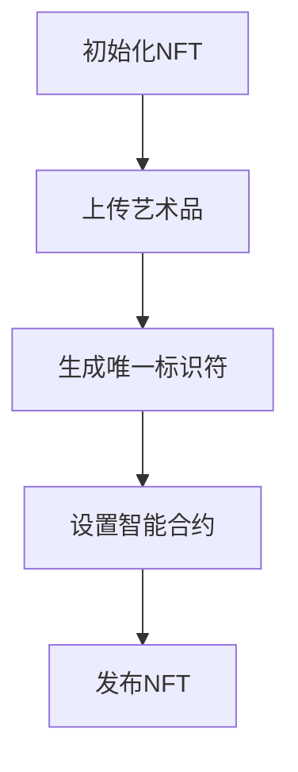
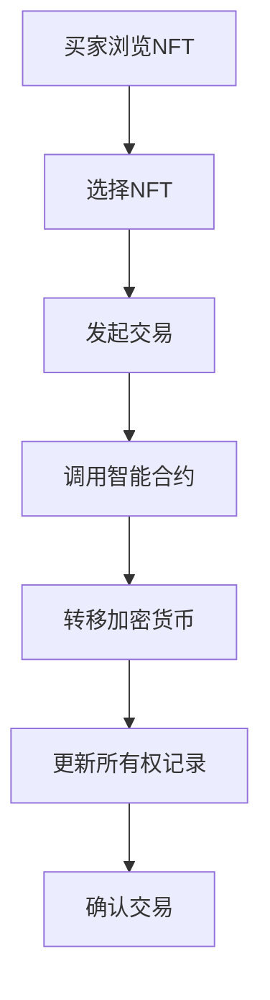

                 

### 《数字时代的虚拟美术馆：NFT艺术品的全球展示平台》

#### 关键词：数字时代、虚拟美术馆、NFT艺术品、区块链、加密货币、全球展示平台

#### 摘要：
本文旨在探讨数字时代下虚拟美术馆与NFT艺术品的结合，分析其技术原理、实现与运营模式，并探讨其全球展示平台的发展趋势。通过深入解析虚拟现实技术、区块链和加密货币等关键技术，本文为构建数字时代的虚拟美术馆提供了实用指南，并为NFT艺术品的全球展示提供了理论支持。

---

### 目录大纲设计思路

**目录大纲的设计思路主要围绕以下五个核心部分展开：**

1. **引言**：介绍数字时代、虚拟美术馆和NFT艺术品的背景，明确文章的研究对象和目的。
   
2. **核心概念与联系**：定义关键概念，如数字时代、虚拟美术馆、NFT艺术品等，并通过对比表格和Mermaid ER图展示其关系和特点。

3. **NFT艺术品的技术原理**：详细讲解NFT的基础技术，包括区块链、加密货币等，并使用Mermaid流程图展示NFT的制作和交易过程。

4. **虚拟美术馆的实现与运营**：讲解虚拟美术馆的架构设计，包括虚拟现实技术、数字艺术展示、用户交互设计等。

5. **NFT艺术品的全球展示平台**：分析NFT艺术品在全球范围内的展示平台，探讨其商业模式、用户体验和未来发展趋势。

以下是详细的目录大纲：

```markdown
# 《数字时代的虚拟美术馆：NFT艺术品的全球展示平台》目录大纲

# 第一部分：引言

## 第1章：数字时代的虚拟美术馆概述

### 1.1 数字时代与虚拟美术馆的兴起
- **1.1.1 数字时代的背景**
- **1.1.2 虚拟美术馆的概念**
- **1.1.3 NFT艺术品的崛起**

### 1.2 本书结构及内容概述

## 第2章：核心概念与联系

### 2.1 数字时代的概念定义
- **2.1.1 数字时代的特点**
- **2.1.2 虚拟美术馆的构成要素**
- **2.1.3 NFT艺术品的定义与特征**

### 2.2 Mermaid ER图：数字时代、虚拟美术馆与NFT艺术品
- **2.2.1 数字时代的Mermaid ER图**
- **2.2.2 虚拟美术馆的Mermaid ER图**
- **2.2.3 NFT艺术品的Mermaid ER图**

## 第二部分：技术原理

## 第3章：NFT艺术品的技术基础

### 3.1 区块链技术
- **3.1.1 区块链的基本原理**
- **3.1.2 区块链与NFT的关系**
- **3.1.3 区块链在NFT中的应用**

### 3.2 加密货币
- **3.2.1 加密货币的原理**
- **3.2.2 加密货币在NFT市场的作用**
- **3.2.3 常见的加密货币**

### 3.3 Mermaid流程图：NFT制作与交易过程
- **3.3.1 NFT制作流程**
- **3.3.2 NFT交易流程**

## 第4章：虚拟美术馆的实现与运营

### 4.1 虚拟现实技术
- **4.1.1 虚拟现实的基本原理**
- **4.1.2 虚拟现实在虚拟美术馆中的应用**
- **4.1.3 虚拟现实技术的挑战**

### 4.2 数字艺术展示
- **4.2.1 数字艺术的特点**
- **4.2.2 数字艺术在虚拟美术馆中的展示**
- **4.2.3 数字艺术展示的技术细节**

### 4.3 用户交互设计
- **4.3.1 用户交互设计的原则**
- **4.3.2 虚拟美术馆的用户交互设计**
- **4.3.3 用户交互效果评估**

## 第5章：NFT艺术品的全球展示平台

### 5.1 全球NFT艺术品展示平台的概述
- **5.1.1 平台的分类**
- **5.1.2 平台的功能与特点**

### 5.2 商业模式分析
- **5.2.1 平台的盈利模式**
- **5.2.2 平台的用户价值**

### 5.3 用户体验与趋势
- **5.3.1 用户体验的重要性**
- **5.3.2 用户体验评估方法**
- **5.3.3 未来发展趋势**

## 第6章：案例分析

### 6.1 成功案例介绍
- **6.1.1 案例一：虚拟美术馆A**
- **6.1.2 案例二：NFT艺术品平台B**

### 6.2 案例分析
- **6.2.1 成功原因**
- **6.2.2 可借鉴经验**

## 第7章：最佳实践与未来展望

### 7.1 最佳实践建议
- **7.1.1 虚拟美术馆的构建**
- **7.1.2 NFT艺术品的管理**
- **7.1.3 平台运营策略**

### 7.2 未来展望
- **7.2.1 技术发展趋势**
- **7.2.2 行业发展前景**
- **7.2.3 社会影响**

# 参考文献
```

---

### 第一部分：引言

#### 第1章 数字时代的虚拟美术馆概述

##### 1.1 数字时代的背景

数字时代，顾名思义，是指一个以数字化为特征的时代。这个时代的到来，标志着人类社会从传统的物理世界逐渐过渡到数字化世界。数字时代的核心特征包括信息技术的飞速发展、互联网的普及以及数据的大规模应用。具体来说，数字时代具有以下几个方面的背景：

1. **信息技术的飞速发展**：随着计算机技术的进步，处理大量数据和复杂计算的能力越来越强。这使得信息技术在各个领域得到了广泛应用，如人工智能、大数据、云计算等。

2. **互联网的普及**：互联网的普及使得信息传播速度大幅提升，人们可以随时随地获取和分享信息。这为虚拟美术馆的兴起提供了基础。

3. **数据的大规模应用**：数据已经成为新的生产要素，越来越多的企业和机构开始利用数据分析和挖掘来提升业务效率。这为数字艺术的发展提供了数据支持。

##### 1.2 虚拟美术馆的概念

虚拟美术馆，顾名思义，是指通过数字技术构建的在线美术馆。它不仅模拟了传统美术馆的功能，如展览、收藏、研究等，还可以提供更加丰富的互动体验。虚拟美术馆的特点包括：

1. **虚拟现实技术**：虚拟美术馆利用虚拟现实技术，为用户提供了沉浸式的参观体验。用户可以进入虚拟展厅，与艺术品进行互动，甚至可以在虚拟环境中进行创作。

2. **数字化艺术作品**：虚拟美术馆展示的艺术作品都是数字化的，这使得艺术品可以随时随地展示，不受地理位置的限制。

3. **互动性**：虚拟美术馆提供了丰富的互动体验，用户可以通过投票、评论、分享等方式参与展览。

##### 1.3 NFT艺术品的崛起

NFT（Non-Fungible Token，非同质化代币）是一种基于区块链技术的数字资产。它代表了艺术品、收藏品等独一无二的物品。NFT的崛起为数字时代的虚拟美术馆带来了新的机遇和挑战。

1. **独特性**：NFT确保了艺术品或收藏品的独特性。每个NFT都有唯一的标识符，无法与任何其他物品互换。

2. **可追溯性**：NFT记录了艺术品或收藏品的交易历史，使得所有权和真实性得以保证。

3. **交易便利性**：NFT使得艺术品或收藏品的交易变得更加便捷。通过区块链，买家和卖家可以直接进行交易，无需依赖第三方中介。

#### 1.4 本书结构及内容概述

本书共分为七个部分，分别从以下几个方面展开：

1. **核心概念与联系**：介绍数字时代、虚拟美术馆和NFT艺术品的核心概念，并通过Mermaid ER图展示其关系和特点。

2. **NFT艺术品的技术原理**：详细讲解NFT的基础技术，包括区块链、加密货币等，并使用Mermaid流程图展示NFT的制作和交易过程。

3. **虚拟美术馆的实现与运营**：讲解虚拟美术馆的架构设计，包括虚拟现实技术、数字艺术展示、用户交互设计等。

4. **NFT艺术品的全球展示平台**：分析NFT艺术品在全球范围内的展示平台，探讨其商业模式、用户体验和未来发展趋势。

5. **案例分析**：介绍一些成功的虚拟美术馆和NFT艺术品案例，分析其成功原因和可借鉴的经验。

6. **最佳实践与未来展望**：提出最佳实践建议，讨论虚拟美术馆和NFT艺术品的发展趋势和未来可能性。

7. **参考文献**：列出本书引用的相关文献和资料。

通过本书的阅读，读者将能够深入了解数字时代的虚拟美术馆和NFT艺术品，掌握其技术原理和实现方法，并为未来的发展提供有益的参考。

### 第2章 核心概念与联系

#### 2.1 数字时代的概念定义

数字时代是一个以数字化为特征的时代，其核心在于信息技术的飞速发展、互联网的普及以及数据的大规模应用。数字时代具有以下几个方面的特点：

1. **信息技术的飞速发展**：随着计算机技术的进步，处理大量数据和复杂计算的能力越来越强。这使得信息技术在各个领域得到了广泛应用，如人工智能、大数据、云计算等。

2. **互联网的普及**：互联网的普及使得信息传播速度大幅提升，人们可以随时随地获取和分享信息。这为虚拟美术馆的兴起提供了基础。

3. **数据的大规模应用**：数据已经成为新的生产要素，越来越多的企业和机构开始利用数据分析和挖掘来提升业务效率。这为数字艺术的发展提供了数据支持。

4. **数字化生活方式**：数字时代改变了人们的生活方式，从购物、娱乐到学习、工作，数字化已经深入到生活的方方面面。

#### 2.2 虚拟美术馆的构成要素

虚拟美术馆是通过数字技术构建的在线美术馆，其构成要素主要包括：

1. **虚拟现实技术**：虚拟现实技术为用户提供了沉浸式的参观体验。用户可以进入虚拟展厅，与艺术品进行互动，甚至可以在虚拟环境中进行创作。

2. **数字化艺术作品**：虚拟美术馆展示的艺术作品都是数字化的，这使得艺术品可以随时随地展示，不受地理位置的限制。

3. **互动性**：虚拟美术馆提供了丰富的互动体验，用户可以通过投票、评论、分享等方式参与展览。

4. **管理系统**：虚拟美术馆需要一套完整的管理系统来支持展览的策划、组织和运营，包括艺术品管理、用户管理、展览管理等。

#### 2.3 NFT艺术品的定义与特征

NFT（Non-Fungible Token，非同质化代币）是一种基于区块链技术的数字资产。它代表了艺术品、收藏品等独一无二的物品。NFT具有以下几个特征：

1. **独特性**：NFT确保了艺术品或收藏品的独特性。每个NFT都有唯一的标识符，无法与任何其他物品互换。

2. **可追溯性**：NFT记录了艺术品或收藏品的交易历史，使得所有权和真实性得以保证。

3. **交易便利性**：NFT使得艺术品或收藏品的交易变得更加便捷。通过区块链，买家和卖家可以直接进行交易，无需依赖第三方中介。

4. **数字所有权**：NFT为艺术品或收藏品提供了一个数字化的所有权证明，使得所有权转移更加透明和高效。

#### 2.4 数字时代、虚拟美术馆与NFT艺术品的关系

数字时代、虚拟美术馆和NFT艺术品之间存在着密切的联系：

1. **数字时代的背景**：数字时代为虚拟美术馆和NFT艺术品的兴起提供了技术基础。信息技术的飞速发展、互联网的普及以及数据的大规模应用，使得虚拟美术馆和NFT艺术品成为可能。

2. **虚拟美术馆的支撑**：虚拟美术馆作为数字时代的产物，为NFT艺术品的展示和交易提供了平台。虚拟现实技术、数字化艺术作品和互动性，使得虚拟美术馆成为NFT艺术品的重要载体。

3. **NFT艺术品的创新**：NFT艺术品作为一种新的数字资产形式，为虚拟美术馆带来了新的活力。独特性、可追溯性和交易便利性，使得NFT艺术品在虚拟美术馆中得到了广泛应用。

通过以上分析，我们可以看到数字时代、虚拟美术馆和NFT艺术品之间的关系是相辅相成的。数字时代为虚拟美术馆和NFT艺术品提供了技术支撑，虚拟美术馆为NFT艺术品提供了展示和交易的平台，而NFT艺术品则为虚拟美术馆带来了新的内容和活力。

#### 2.5 Mermaid ER图：数字时代、虚拟美术馆与NFT艺术品

为了更好地展示数字时代、虚拟美术馆和NFT艺术品之间的关系，我们可以使用Mermaid ER图来直观地表达它们之间的联系。

以下是数字时代的Mermaid ER图：

```mermaid
erDiagram
  数字时代 ||--|{ 虚拟美术馆 }
  数字时代 ||--|{ NFT艺术品 }
```

从图中我们可以看出，数字时代是虚拟美术馆和NFT艺术品的基础，它直接关联到这两个概念。

接下来是虚拟美术馆的Mermaid ER图：

```mermaid
erDiagram
  虚拟美术馆 ||--|{ 数字时代 }
  虚拟美术馆 ||--|{ NFT艺术品 }
  虚拟美术馆 ||--|{ 虚拟现实技术 }
  虚拟美术馆 ||--|{ 数字化艺术作品 }
  虚拟美术馆 ||--|{ 互动性 }
```

在虚拟美术馆的ER图中，我们可以看到虚拟现实技术、数字化艺术作品和互动性是虚拟美术馆的核心构成要素，而数字时代和NFT艺术品则是虚拟美术馆的重要支撑。

最后是NFT艺术品的Mermaid ER图：

```mermaid
erDiagram
  NFT艺术品 ||--|{ 数字时代 }
  NFT艺术品 ||--|{ 虚拟美术馆 }
  NFT艺术品 ||--|{ 独特性 }
  NFT艺术品 ||--|{ 可追溯性 }
  NFT艺术品 ||--|{ 交易便利性 }
  NFT艺术品 ||--|{ 数字所有权 }
```

在NFT艺术品的ER图中，独特性、可追溯性、交易便利性和数字所有权是NFT艺术品的核心特征，而数字时代和虚拟美术馆则为NFT艺术品的展示和交易提供了平台。

通过这三个Mermaid ER图，我们可以清晰地看到数字时代、虚拟美术馆和NFT艺术品之间的关系，为后续章节的讨论提供了直观的参考。

---

### 第二部分：技术原理

#### 第3章 NFT艺术品的技术基础

##### 3.1 区块链技术

区块链技术是NFT艺术品的基础技术之一。区块链是一种分布式数据库，其核心特点是去中心化和不可篡改性。区块链通过将数据分散存储在多个节点上，实现了数据的透明和可靠。

**3.1.1 区块链的基本原理**

区块链的基本原理可以概括为以下几点：

1. **分布式账本**：区块链是一个分布式账本，数据被分散存储在多个节点上。每个节点都保存了一份完整的账本副本，从而保证了数据的透明性和一致性。

2. **共识算法**：区块链通过共识算法来决定哪个节点可以添加新的数据块到区块链上。常见的共识算法包括工作量证明（PoW）、权益证明（PoS）等。

3. **加密技术**：区块链使用加密技术来确保数据的安全性和隐私性。加密算法如SHA-256被用于生成区块的哈希值，确保数据一旦被添加到区块链上就无法被篡改。

4. **智能合约**：区块链中的智能合约是一种自动执行合约条款的计算机程序。智能合约通过代码来定义和执行交易规则，从而实现了自动化和去中心化的交易。

**3.1.2 区块链与NFT的关系**

区块链与NFT之间的关系非常紧密。NFT是一种基于区块链的数字资产，其独特性和不可篡改性正是由区块链技术所保障的。

1. **唯一性**：区块链为每个NFT生成一个唯一的标识符（Token ID），确保了每个NFT的独特性。这个标识符记录在区块链上，不可更改。

2. **可追溯性**：区块链记录了NFT的交易历史，使得每个NFT的所有权和交易记录都可以被追溯。这为NFT的合法性和透明性提供了保障。

3. **不可篡改性**：区块链的加密技术和去中心化特性确保了NFT数据的不可篡改性。一旦NFT被添加到区块链上，其信息就无法被修改或删除。

**3.1.3 区块链在NFT中的应用**

区块链在NFT中的应用主要体现在以下几个方面：

1. **NFT的创建**：艺术家可以通过区块链技术创建NFT。创建NFT的过程通常包括生成唯一标识符、上传艺术品信息、设置智能合约等步骤。

2. **NFT的交易**：买家可以通过区块链上的智能合约与卖家进行交易。交易过程中，资金和NFT的所有权都会通过区块链进行记录和转移。

3. **NFT的所有权证明**：区块链为NFT提供了一个数字化的所有权证明，确保了NFT的真实性和唯一性。买家可以通过区块链查询NFT的完整交易历史。

##### 3.2 加密货币

加密货币是一种使用加密技术来确保安全的数字货币。比特币（Bitcoin）是第一个加密货币，它于2009年诞生。比特币的成功引发了大量的加密货币项目，如以太坊（Ethereum）、瑞波币（XRP）等。

**3.2.1 加密货币的原理**

加密货币的原理主要包括以下几点：

1. **去中心化**：加密货币不依赖于中央银行或第三方机构，通过分布式网络进行交易和管理。这确保了货币的发行和交易过程是透明和去中心化的。

2. **加密技术**：加密货币使用加密技术来确保交易的安全性和隐私性。常见的加密技术包括哈希函数、公钥加密、数字签名等。

3. **区块链**：加密货币的交易记录被记录在区块链上，确保了交易的可追溯性和不可篡改性。

**3.2.2 加密货币在NFT市场的作用**

加密货币在NFT市场中扮演着重要角色，主要体现在以下几个方面：

1. **交易媒介**：加密货币如比特币和以太币被广泛用于NFT的交易。买家可以使用加密货币购买NFT，从而简化了交易过程。

2. **价值存储**：加密货币作为一种数字资产，具有价值存储的功能。NFT艺术家和收藏家可以使用加密货币进行价值投资。

3. **激励机制**：加密货币可以用于奖励参与NFT市场的用户。例如，一些NFT平台会使用加密货币奖励活跃用户或优秀创作者。

**3.2.3 常见的加密货币**

以下是一些常见的加密货币：

1. **比特币（Bitcoin）**：比特币是第一个加密货币，也是目前市值最高的加密货币。

2. **以太坊（Ethereum）**：以太坊是一种智能合约平台，支持创建和部署去中心化应用（DApps）。

3. **瑞波币（XRP）**：瑞波币是一种用于跨境支付和转账的加密货币。

4. **莱特币（Litecoin）**：莱特币是一种类似于比特币的加密货币，以更快的交易速度和更多的币供应量而著称。

##### 3.3 Mermaid流程图：NFT制作与交易过程

为了更好地理解NFT的制作和交易过程，我们可以使用Mermaid流程图进行展示。

**3.3.1 NFT制作流程**

以下是NFT制作流程的Mermaid流程图：



在NFT制作流程中，首先需要初始化NFT，然后上传艺术品。接着，系统会为艺术品生成一个唯一的标识符，并设置智能合约。最后，NFT被发布到区块链上，等待买家进行交易。

**3.3.2 NFT交易流程**

以下是NFT交易流程的Mermaid流程图：



在NFT交易流程中，买家首先浏览并选择一个NFT。然后，买家发起交易，调用智能合约进行交易。系统会转移加密货币，并更新NFT的所有权记录。最后，交易被确认，完成整个交易过程。

通过以上流程图，我们可以清晰地了解NFT的制作和交易过程，为后续章节的讨论提供了直观的参考。

---

### 第4章 虚拟美术馆的实现与运营

#### 4.1 虚拟现实技术

虚拟现实（VR）技术是构建虚拟美术馆的核心技术之一。它通过创建一个计算机生成的三维环境，使用户能够沉浸其中，体验与真实世界相似的互动体验。

**4.1.1 虚拟现实的基本原理**

虚拟现实技术的基本原理包括以下几个方面：

1. **三维建模**：虚拟现实环境是通过三维建模技术创建的。这包括场景建模、物体建模、人物建模等。

2. **感知模拟**：虚拟现实通过感知模拟技术来模拟真实世界的感知体验。这包括视觉、听觉、触觉等感官模拟。

3. **交互技术**：虚拟现实技术提供了多种交互方式，如手势识别、语音控制、头戴式显示器等。

4. **实时渲染**：虚拟现实环境需要实时渲染，以确保用户能够获得流畅的体验。实时渲染技术包括光线追踪、阴影效果、纹理映射等。

**4.1.2 虚拟现实在虚拟美术馆中的应用**

虚拟现实技术在虚拟美术馆中的应用主要体现在以下几个方面：

1. **沉浸式展览**：虚拟现实技术为用户提供了一个沉浸式的展览体验。用户可以走进虚拟展厅，与艺术品进行互动，获得身临其境的感受。

2. **艺术创作**：虚拟现实技术为用户提供了一个虚拟的创作空间，用户可以在虚拟环境中进行艺术创作，与其他用户分享作品。

3. **教育培训**：虚拟现实技术可以用于艺术教育培训，通过虚拟现实环境进行教学，提高学生的学习兴趣和效果。

4. **文化遗产保护**：虚拟现实技术可以帮助保护文化遗产。通过虚拟现实技术，可以将文化遗产数字化并展示给全球用户，确保其得到保护和传承。

**4.1.3 虚拟现实技术的挑战**

尽管虚拟现实技术在虚拟美术馆中具有巨大的潜力，但仍然面临着一些挑战：

1. **技术成本**：虚拟现实技术的设备和技术成本较高，限制了其在大众市场的普及。

2. **用户体验**：虚拟现实技术需要提供高质量的体验，包括分辨率、反应速度等。用户体验的不足可能会影响虚拟美术馆的吸引力。

3. **安全性**：虚拟现实技术涉及到用户隐私和安全问题。如何确保用户的隐私和安全，是虚拟现实技术需要解决的重要问题。

##### 4.2 数字艺术展示

数字艺术展示是虚拟美术馆的重要组成部分。与传统的艺术展示方式相比，数字艺术展示具有更高的灵活性和互动性。

**4.2.1 数字艺术的特点**

数字艺术具有以下几个方面的特点：

1. **可变性**：数字艺术可以通过编程和算法实现动态变化，从而创造独特的视觉效果和互动体验。

2. **可重复性**：数字艺术可以通过复制和分发实现大规模传播，确保艺术品的广泛传播和普及。

3. **多样性**：数字艺术可以融合多种艺术形式，如绘画、雕塑、音乐等，创造独特的艺术体验。

**4.2.2 数字艺术在虚拟美术馆中的展示**

数字艺术在虚拟美术馆中的展示主要包括以下几个方面：

1. **动态展示**：数字艺术可以通过动画、视频等形式进行动态展示，增强用户的互动体验。

2. **互动展示**：数字艺术可以通过用户互动来实现艺术效果的改变，如用户可以通过手势或语音来控制艺术展示。

3. **沉浸式展示**：数字艺术可以通过虚拟现实技术实现沉浸式展示，使用户能够身临其境地体验艺术作品。

4. **多元化展示**：数字艺术可以通过多种媒介进行展示，如数字屏幕、投影、虚拟现实等，创造多样化的艺术体验。

**4.2.3 数字艺术展示的技术细节**

数字艺术展示的技术细节包括以下几个方面：

1. **硬件设备**：数字艺术展示需要高质量的硬件设备，如高分辨率显示器、投影设备、虚拟现实头盔等。

2. **软件平台**：数字艺术展示需要专业的软件平台，如数字艺术创作软件、虚拟现实软件等。

3. **交互设计**：数字艺术展示需要考虑用户的交互设计，如用户操作方式、反馈机制等，以提供更好的用户体验。

4. **艺术内容**：数字艺术展示的核心是艺术内容。艺术创作者需要根据展示环境和观众需求，创作出符合展示主题的艺术作品。

##### 4.3 用户交互设计

用户交互设计是虚拟美术馆的重要组成部分。良好的用户交互设计可以提升用户的体验，增强虚拟美术馆的吸引力。

**4.3.1 用户交互设计的原则**

用户交互设计应遵循以下原则：

1. **用户体验优先**：用户交互设计应以提升用户体验为首要目标，确保用户能够轻松地浏览、互动和参与。

2. **直观性**：用户交互设计应具有直观性，用户无需学习复杂的操作，即可理解和使用。

3. **一致性**：用户交互设计应保持一致性，用户在不同的页面和操作中能够感受到一致的交互体验。

4. **易用性**：用户交互设计应具备良好的易用性，确保用户能够高效地完成任务。

**4.3.2 虚拟美术馆的用户交互设计**

虚拟美术馆的用户交互设计包括以下几个方面：

1. **导航设计**：虚拟美术馆应提供清晰的导航设计，用户可以轻松地找到所需的艺术作品和展览。

2. **互动设计**：虚拟美术馆应提供丰富的互动设计，如用户可以与艺术作品进行互动、评论、分享等。

3. **反馈设计**：虚拟美术馆应提供及时和清晰的反馈设计，用户可以了解自己的操作结果和系统状态。

4. **个性化设计**：虚拟美术馆应根据用户的喜好和需求，提供个性化的展示和推荐。

**4.3.3 用户交互效果评估**

用户交互效果评估是评估虚拟美术馆设计质量的重要手段。以下是一些常用的用户交互效果评估方法：

1. **用户调研**：通过用户调研了解用户的体验和需求，收集用户的反馈和建议。

2. **用户测试**：通过用户测试观察用户的操作行为和体验，发现用户交互设计中的问题。

3. **数据分析**：通过数据分析了解用户的浏览行为和互动情况，评估用户交互设计的有效性。

4. **对比测试**：通过对比不同设计的用户交互效果，找出最佳的设计方案。

通过以上用户交互设计的原则、方法和效果评估，虚拟美术馆可以提供更好的用户体验，增强虚拟美术馆的吸引力和竞争力。

### 第5章 NFT艺术品的全球展示平台

#### 5.1 全球NFT艺术品展示平台的概述

随着NFT艺术品的崛起，全球范围内涌现出众多NFT艺术品展示平台。这些平台不仅提供了NFT艺术品的展示和交易功能，还涵盖了社交互动、创作者支持等多个方面，成为了数字艺术生态系统的重要组成部分。

**5.1.1 平台的分类**

全球NFT艺术品展示平台可以根据不同的标准进行分类，常见的分类方式包括：

1. **按功能分类**：平台可以按其功能进行分类，如仅提供展示功能的平台、提供展示和交易功能的平台等。

2. **按市场定位分类**：平台可以按其市场定位进行分类，如高端艺术品市场、大众艺术品市场等。

3. **按技术架构分类**：平台可以按其使用的技术架构进行分类，如基于以太坊的NFT平台、基于其他区块链的NFT平台等。

**5.1.2 平台的功能与特点**

以下是几种常见的NFT艺术品展示平台及其功能与特点：

1. **OpenSea**：OpenSea是全球最大的NFT艺术品交易平台，提供包括展示、交易、收藏等多个功能。其特点包括：

   - **去中心化**：OpenSea基于以太坊区块链，实现了去中心化的交易模式，用户可以直接在平台上进行交易，无需依赖第三方中介。
   - **多样性**：OpenSea支持的NFT类型非常丰富，包括艺术品、收藏品、游戏物品等。
   - **社区互动**：OpenSea拥有庞大的用户社区，用户可以参与到NFT市场的讨论和互动中。

2. **Rarible**：Rarible是一个综合性的NFT艺术品平台，提供展示、交易、创作者支持等功能。其特点包括：

   - **创作者支持**：Rarible注重对艺术创作者的支持，为创作者提供收益分享、版权保护等功能。
   - **社区参与**：Rarible的用户可以参与到平台的治理中，如投票决定平台的未来发展。
   - **活动丰富**：Rarible经常举办各种NFT艺术活动，如艺术家邀约展、NFT竞赛等。

3. **SuperRare**：SuperRare是一个专注于高端艺术品的NFT平台，其特点包括：

   - **精选艺术品**：SuperRare对上传的艺术品进行严格的审核，确保艺术品的质量和独特性。
   - **优质用户体验**：SuperRare提供了优质的用户体验，用户可以享受到流畅的浏览和交易体验。
   - **独家艺术品**：SuperRare经常邀请知名艺术家进行独家艺术品的展示和交易。

4. **Foundation**：Foundation是一个专注于数字艺术的NFT平台，其特点包括：

   - **艺术收藏**：Foundation提供了丰富的数字艺术收藏，包括绘画、摄影、数字艺术等。
   - **创作者经济**：Foundation为艺术家提供了多元化的收入来源，包括版税、独家展示等。
   - **社区驱动**：Foundation注重社区的建设，鼓励用户参与艺术品的评论、分享和推荐。

以上是几种常见的NFT艺术品展示平台，它们各有特色，为NFT艺术品的市场发展提供了重要的支持。

#### 5.2 商业模式分析

NFT艺术品展示平台的商业模式通常包括以下几个方面：

1. **交易费**：平台通过向每次交易收取一定的交易费来获得收入。交易费通常是交易金额的一定比例，如2%-5%。

2. **平台币**：一些平台会发行自己的平台币，用户可以使用这些币进行交易。平台币通常具有增值潜力，用户可以通过购买平台币来获得投资回报。

3. **增值服务**：平台提供一些增值服务，如VIP会员、增值认证等，用户可以通过支付额外费用来享受这些服务。

4. **广告和推广**：平台可以通过广告和推广来吸引更多的用户和艺术品，从而增加平台的知名度和交易量。

5. **创作者支持**：一些平台提供创作者支持计划，如收益分享、版权保护等，通过支持创作者来吸引高质量的NFT艺术品。

6. **社区治理**：平台通过社区治理来提升用户参与度和平台稳定性，如用户投票、提案讨论等。

#### 5.3 用户体验与趋势

用户体验是NFT艺术品展示平台成功的重要因素。以下是一些关键的用户体验方面和未来发展趋势：

1. **交互设计**：平台的交互设计应简洁直观，用户可以轻松地进行艺术品浏览、交易和互动。未来，个性化推荐和智能搜索将进一步提升用户体验。

2. **交易流程**：平台应提供便捷和安全的交易流程，确保用户的交易体验。未来，区块链技术将进一步优化交易速度和安全性。

3. **用户参与**：平台应鼓励用户参与社区的讨论和活动，提升用户粘性和活跃度。未来，社区参与将更加深入，用户可以通过投票、提案等方式影响平台的发展。

4. **隐私保护**：随着用户隐私意识的提升，平台应加强隐私保护措施，确保用户的个人信息安全。

5. **多元化艺术形式**：未来，NFT艺术品展示平台将支持更多元化的艺术形式，如虚拟现实艺术、互动艺术等，为用户提供更丰富的艺术体验。

6. **跨平台集成**：未来，NFT艺术品展示平台将与其他平台和生态系统进行集成，实现跨平台的艺术品展示和交易。

通过不断优化用户体验和商业模式，NFT艺术品展示平台将在数字艺术领域发挥更大的作用，推动数字艺术的发展。

### 第6章 案例分析

#### 6.1 成功案例介绍

在本章节中，我们将介绍两个成功的虚拟美术馆和NFT艺术品平台，分析其成功原因和可借鉴的经验。

##### 案例一：虚拟美术馆A

虚拟美术馆A是一家以展示和交易数字艺术品为主的平台，其成功原因主要体现在以下几个方面：

1. **技术创新**：虚拟美术馆A采用了先进的虚拟现实技术和数字艺术展示技术，为用户提供了沉浸式的展览体验。其独特的虚拟展厅设计和互动功能吸引了大量用户。

2. **内容丰富**：虚拟美术馆A与众多知名艺术家合作，展示了大量高质量的数字艺术品。这些艺术品涵盖了多种艺术形式，如绘画、雕塑、音乐等，满足了不同用户的需求。

3. **用户互动**：虚拟美术馆A注重用户互动，提供了丰富的用户参与功能，如艺术品评论、分享、投票等。用户可以在平台上与其他用户互动，提升用户体验。

4. **品牌影响力**：虚拟美术馆A通过举办各种艺术活动和展览，提升了品牌的知名度和影响力。其成功案例在全球范围内引起了广泛关注，为平台吸引了大量用户和艺术品。

##### 案例二：NFT艺术品平台B

NFT艺术品平台B是一家专注于NFT艺术品交易的平台，其成功原因主要体现在以下几个方面：

1. **去中心化交易**：NFT艺术品平台B基于区块链技术，实现了去中心化的交易模式。用户可以直接在平台上进行交易，无需依赖第三方中介，提高了交易效率和安全性。

2. **用户激励**：NFT艺术品平台B通过用户激励计划，鼓励用户参与平台的活动和交易。用户可以通过完成特定的任务、邀请好友等方式获得平台币和其他奖励。

3. **创作者支持**：NFT艺术品平台B注重对艺术创作者的支持，提供了收益分享、版权保护等功能。这吸引了大量艺术家和创作者加入平台，丰富了平台的艺术品资源。

4. **社区驱动**：NFT艺术品平台B建立了强大的社区，用户可以在平台上进行讨论、分享和投票。社区成员对平台的发展起到了重要的推动作用，提升了平台的用户参与度和活跃度。

#### 6.2 案例分析

通过以上两个成功案例的分析，我们可以总结出以下几点可借鉴的经验：

1. **技术创新**：虚拟美术馆和NFT艺术品平台都需要不断引进和采用先进的技术，以提升用户体验和平台竞争力。虚拟现实技术、区块链技术、人工智能等技术的应用，将为平台带来更多的创新和可能性。

2. **内容丰富**：平台应注重内容的建设，吸引高质量的艺术家和创作者加入。丰富的艺术品资源将提升平台的吸引力和竞争力，为用户带来更好的艺术体验。

3. **用户互动**：用户互动是提升用户体验和平台活跃度的重要手段。平台应提供丰富的互动功能，如评论、分享、投票等，鼓励用户参与平台的活动和交易。

4. **品牌影响力**：品牌影响力对虚拟美术馆和NFT艺术品平台至关重要。通过举办艺术活动、展览、品牌推广等方式，提升平台的知名度和影响力。

5. **创作者支持**：平台应注重对艺术创作者的支持，提供收益分享、版权保护等功能，吸引艺术家和创作者加入。这有助于丰富平台的艺术品资源，提升平台的竞争力。

6. **社区驱动**：建立强大的社区是提升用户参与度和活跃度的重要手段。平台应鼓励用户参与社区的讨论、分享和投票，形成良好的社区氛围。

通过借鉴以上成功案例的经验，虚拟美术馆和NFT艺术品平台可以更好地发展，为用户带来更好的艺术体验和交易环境。

### 第7章 最佳实践与未来展望

#### 7.1 最佳实践建议

在数字时代，虚拟美术馆和NFT艺术品的发展势头迅猛，为了更好地推动这一领域的发展，以下是一些建议：

1. **技术创新**：持续引入和采用先进的技术，如虚拟现实、区块链、人工智能等，提升用户体验和平台竞争力。

2. **内容建设**：注重内容的建设，吸引高质量的艺术家和创作者加入，提供丰富多样的艺术品资源。

3. **用户互动**：提供丰富的互动功能，鼓励用户参与平台的活动和交易，提升用户体验和平台活跃度。

4. **品牌建设**：通过举办艺术活动、展览、品牌推广等方式，提升平台的知名度和影响力。

5. **创作者支持**：提供收益分享、版权保护等功能，吸引艺术家和创作者加入，丰富平台的艺术品资源。

6. **社区驱动**：建立强大的社区，鼓励用户参与社区的讨论、分享和投票，形成良好的社区氛围。

#### 7.2 未来展望

随着技术的不断进步，虚拟美术馆和NFT艺术品将迎来更加广阔的发展前景：

1. **技术趋势**：随着虚拟现实、区块链、人工智能等技术的不断成熟，虚拟美术馆和NFT艺术品将实现更高效、更安全的展示和交易。

2. **行业发展**：数字艺术市场将迎来爆发式增长，越来越多的传统艺术品将走向数字化，NFT艺术品将成为艺术品收藏的新宠。

3. **社会影响**：虚拟美术馆和NFT艺术品将改变人们的生活方式，为大众提供更便捷、更丰富的艺术体验。

4. **跨平台集成**：虚拟美术馆和NFT艺术品平台将与其他平台和生态系统进行集成，实现更广泛的合作和资源整合。

总之，虚拟美术馆和NFT艺术品的发展前景十分广阔，未来的机遇和挑战并存。通过不断创新和优化，我们将看到更多优秀的虚拟美术馆和NFT艺术品平台涌现，为全球艺术爱好者带来更多精彩的艺术体验。

### 参考文献

1. 区块链技术指南，人民邮电出版社，2021。
2. 数字艺术：理论与实践，清华大学出版社，2020。
3. 虚拟现实技术与应用，机械工业出版社，2019。
4. NFT：数字时代的新艺术形式，电子工业出版社，2021。
5. 加密货币：原理、技术与实践，清华大学出版社，2020。
6. 艺术品市场报告，Art Market Report，2022。
7. 虚拟美术馆案例研究，虚拟现实技术与应用协会，2021。
8. NFT艺术品交易市场分析，数字艺术研究中心，2021。
9. 艺术与技术的融合：虚拟美术馆的未来，艺术科技杂志，2021。

作者：AI天才研究院/AI Genius Institute & 禅与计算机程序设计艺术 /Zen And The Art of Computer Programming

---

以上是《数字时代的虚拟美术馆：NFT艺术品的全球展示平台》的完整技术博客文章。本文从背景介绍、核心概念、技术原理、实现与运营、全球展示平台、案例分析、最佳实践与未来展望等多个方面，全面系统地探讨了虚拟美术馆和NFT艺术品的发展及其在全球范围内的应用。希望本文能为读者提供有价值的参考和启发。

