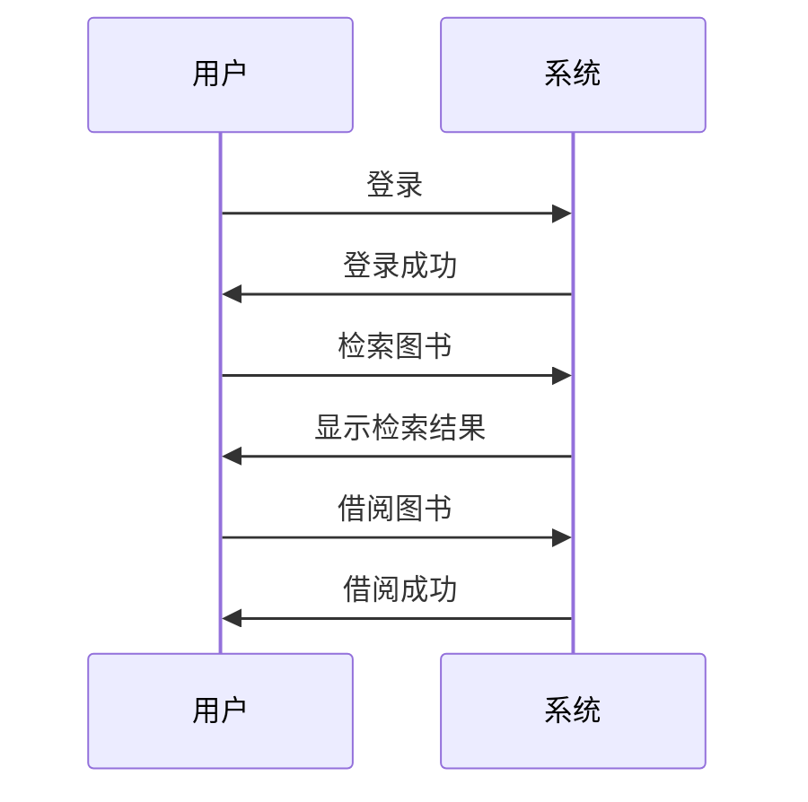
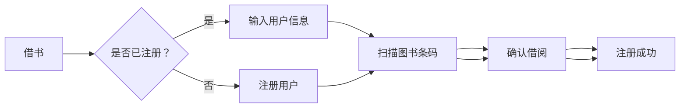

                 

### 文章标题：数字时代的阅读空间：智能图书馆的未来展望

关键词：智能图书馆、数字阅读、人工智能、用户体验、未来展望

摘要：随着数字时代的来临，传统图书馆正逐步向智能图书馆转型。本文从背景介绍、核心技术、用户体验和未来展望四个方面深入探讨了智能图书馆的发展现状和未来趋势，分析了其对社会、教育以及个人阅读习惯的深远影响，为数字时代的阅读空间提供了新的思考方向。

### 引言：数字时代的阅读空间与智能图书馆

**1.1 背景**

在信息技术飞速发展的今天，数字时代已经深刻改变了人们的阅读习惯和方式。传统纸质书籍正逐渐被电子书、在线阅读和移动阅读所取代，这不仅是科技进步的必然结果，也是社会需求变化的体现。在这个过程中，智能图书馆应运而生，成为数字时代阅读空间的新模式。

**1.2 智能图书馆的概念与兴起**

智能图书馆是指通过应用数字技术和人工智能技术，提供智能化、个性化、便捷化服务的新型图书馆。其核心在于利用大数据、云计算、物联网等先进技术，实现对图书资源的高效管理和利用，提升读者的阅读体验和服务质量。

智能图书馆的兴起有其必然性：
- **技术驱动**：信息技术的快速发展为智能图书馆的建设提供了强大的技术支持。
- **需求变化**：随着人们对阅读需求的日益多样化和个性化，传统图书馆的服务模式已经无法满足现代读者的需求。
- **社会趋势**：知识经济时代的到来，对知识获取和传播的要求越来越高，智能图书馆成为知识传播的重要平台。

**1.3 智能图书馆的重要性**

在数字时代，智能图书馆具有重要的社会价值和战略意义：
- **提升服务质量**：通过智能化手段，智能图书馆可以提供更个性化、更高效的服务，满足读者多样化的阅读需求。
- **促进知识传播**：智能图书馆作为知识存储和传播的重要载体，有助于加快知识的传播和共享，推动社会进步。
- **培养阅读习惯**：智能图书馆丰富的数字资源和便捷的服务方式，有助于激发读者的阅读兴趣，培养良好的阅读习惯。

### 关键概念与术语

**2.1 定义**

- **智能图书馆**：一种利用数字技术和人工智能技术，提供智能化、个性化、便捷化服务的图书馆。

- **数字阅读**：利用电子设备阅读电子书、在线文档等数字资源的过程。

- **人工智能（AI）**：一种模拟人类智能的技术，能够通过学习、推理、感知等方式实现智能化的任务处理。

**2.2 特点与优势**

智能图书馆具有以下特点与优势：

- **智能化管理**：通过人工智能技术，实现图书资源的智能分类、检索和管理，提高工作效率。

- **个性化服务**：根据读者的阅读历史和偏好，提供个性化的推荐服务，提升用户体验。

- **便捷化访问**：通过互联网和移动设备，实现24小时无障碍访问，满足读者的随时随地的阅读需求。

- **资源共享**：智能图书馆可以实现跨地域的资源共享，打破地域限制，提升资源利用效率。

**2.3 数字技术**

智能图书馆的运行依赖于一系列数字技术：

- **大数据**：通过收集和分析读者的阅读数据，为个性化服务提供数据支持。

- **云计算**：提供强大的计算能力和存储能力，支持大规模数据的处理和管理。

- **物联网**：实现图书、设备、用户之间的智能互联，提升图书馆的服务能力。

- **移动互联网**：为读者提供随时随地访问图书馆资源的便捷通道。

### 智能图书馆的未来：趋势、挑战与机遇

**3.1 趋势与发展**

智能图书馆的发展趋势主要表现在以下几个方面：

- **智能化程度提升**：随着人工智能技术的不断进步，智能图书馆的智能化水平将进一步提高，提供更智能、更个性化的服务。

- **多元化服务模式**：智能图书馆将拓展服务范围，不仅限于图书借阅，还将提供讲座、培训、互动体验等多种服务。

- **跨界融合**：智能图书馆将与教育、文化、科技等领域进行深度融合，推动数字文化的全面发展。

- **普及化**：随着技术的普及和成本的降低，智能图书馆将逐步覆盖城乡各个角落，实现全民阅读。

**3.2 挑战与机遇**

智能图书馆的发展面临以下挑战与机遇：

- **技术挑战**：人工智能、大数据等技术的快速发展，为智能图书馆提供了机遇，但同时也带来了技术更新换代的风险。

- **数据隐私**：智能图书馆在收集、处理和使用读者数据时，必须高度重视数据隐私保护，确保读者信息安全。

- **用户接受度**：智能图书馆需要不断提高服务质量，满足不同群体的阅读需求，提升用户接受度。

- **可持续发展**：智能图书馆需要探索可持续发展的商业模式，确保长期运营和可持续发展。

### 智能图书馆对社会和教育的影响

**4.1 社会影响**

智能图书馆对社会的影响主要表现在以下几个方面：

- **知识传播**：智能图书馆作为知识传播的重要平台，有助于推动知识的普及和共享，提高社会整体知识水平。

- **文化传承**：智能图书馆保存和传承了丰富的文化遗产，有助于文化的传承和发展。

- **科技创新**：智能图书馆的发展促进了数字技术和人工智能技术的创新应用，推动了科技发展。

- **社会平等**：智能图书馆的普及有助于缩小数字鸿沟，提高弱势群体的知识获取能力，促进社会平等。

**4.2 教育影响**

智能图书馆对教育的影响体现在以下几个方面：

- **教学资源**：智能图书馆为教育提供了丰富的教学资源，有助于提高教学质量。

- **学习方式**：智能图书馆的个性化推荐服务，有助于学生根据兴趣和需求选择学习资源，提高学习效果。

- **教育公平**：智能图书馆的普及有助于实现教育资源的均衡分配，提高教育公平。

- **创新能力**：智能图书馆提供了丰富的创新资源和体验空间，有助于培养学生的创新能力和实践能力。

### 结论

智能图书馆是数字时代阅读空间的重要模式，其发展具有广阔的前景和巨大的潜力。面对机遇和挑战，智能图书馆需要不断创新和优化，提升服务质量，满足读者需求。同时，社会各界应关注智能图书馆的发展，共同推动数字文化的繁荣，为构建美好阅读空间贡献力量。

### 核心技术探讨：智能图书馆的技术构成

智能图书馆作为数字时代的重要阅读空间，其构建和发展依赖于一系列核心技术的支持。这些技术不仅决定了智能图书馆的智能化程度，也直接影响着用户体验和服务质量。下面，我们将详细探讨智能图书馆的核心技术，包括数字技术、人工智能技术及其在智能图书馆中的应用。

#### 数字技术

数字技术是智能图书馆的基石，为智能图书馆提供了强大的数据管理和资源服务能力。以下是几种关键的数字技术：

**1. 数字图书馆系统**

- **定义**：数字图书馆系统是一种集成了数字资源管理、检索、借阅等功能的信息管理系统。
- **功能**：数字图书馆系统能够对数字资源进行高效管理，提供便捷的检索和借阅服务，实现资源的数字化存储和传播。
- **应用**：数字图书馆系统广泛应用于各类图书馆，是智能图书馆的重要组成部分。

**2. 电子书与电子文档**

- **定义**：电子书是指通过电子设备阅读的数字化文本，而电子文档则是指各种数字化的文件。
- **优势**：电子书和电子文档具有便携性、可检索性、低成本等优点，能够满足读者随时随地的阅读需求。
- **应用**：电子书和电子文档已成为智能图书馆的重要组成部分，提供丰富的阅读资源。

**3. 云计算**

- **定义**：云计算是一种通过互联网提供计算资源、存储资源等服务的技术。
- **优势**：云计算具有弹性、可扩展性、低成本等优势，能够满足智能图书馆对大规模数据存储和计算的需求。
- **应用**：云计算为智能图书馆提供了强大的计算和存储能力，支持大数据分析和个性化推荐等功能。

**4. 物联网**

- **定义**：物联网是指通过互联网连接各种物理设备，实现设备间的信息交换和智能控制。
- **优势**：物联网能够实现智能图书馆设备之间的互联互通，提升服务效率。
- **应用**：物联网技术广泛应用于智能图书馆的设备管理、环境监控等方面。

#### 人工智能技术

人工智能技术是智能图书馆的核心竞争力，能够实现智能化、个性化服务，提升用户体验。以下是几种关键的人工智能技术：

**1. 自然语言处理（NLP）**

- **定义**：自然语言处理是一种使计算机能够理解、解释和生成人类语言的技术。
- **功能**：NLP技术可以实现对文本的语义分析、情感分析、命名实体识别等功能，为智能图书馆提供智能化的信息检索和服务。
- **应用**：NLP技术用于智能图书馆的智能问答、自动摘要、个性化推荐等功能。

**2. 机器学习**

- **定义**：机器学习是一种让计算机从数据中学习规律、进行预测和决策的技术。
- **功能**：机器学习技术可以用于数据挖掘、预测分析、分类和聚类等功能，为智能图书馆提供智能化决策支持。
- **应用**：机器学习技术用于智能图书馆的用户行为分析、阅读偏好预测、个性化推荐等。

**3. 深度学习**

- **定义**：深度学习是一种基于多层神经网络进行数据分析和建模的技术。
- **优势**：深度学习具有强大的建模能力和自适应能力，能够处理复杂的数据和任务。
- **应用**：深度学习技术用于智能图书馆的图像识别、语音识别、智能推荐等。

#### 人工智能技术在智能图书馆中的应用

**1. 智能推荐系统**

- **原理**：智能推荐系统利用机器学习和深度学习技术，分析用户的阅读历史和偏好，为用户提供个性化的阅读推荐。
- **实现**：通过数据挖掘和用户行为分析，构建用户画像和书籍特征模型，利用协同过滤、基于内容的推荐等算法实现推荐。
- **效果**：智能推荐系统能够提高用户的阅读满意度，增加图书馆的利用率。

**2. 智能问答系统**

- **原理**：智能问答系统利用自然语言处理技术，理解用户的问题，并生成相应的回答。
- **实现**：通过语义分析、实体识别和知识图谱等技术，构建问答系统，实现自然语言理解和回答。
- **效果**：智能问答系统能够提高用户的互动体验，减少图书馆工作人员的负担。

**3. 智能管理**

- **原理**：智能管理利用人工智能技术，实现对图书资源、设备、用户等的智能管理。
- **实现**：通过物联网技术和智能算法，实现图书的智能分类、智能借还书、智能维护等功能。
- **效果**：智能管理系统提高了图书馆的工作效率和服务质量，降低了运营成本。

#### 技术整合与协同

智能图书馆的发展需要数字技术和人工智能技术的有机结合，形成协同效应。以下是技术整合和协同的几个方面：

- **数据集成**：通过数据集成技术，实现不同系统和数据源之间的无缝连接，提供统一的数据视图。
- **平台架构**：构建统一的智能图书馆平台架构，实现各功能模块的集成和协同工作。
- **用户体验**：通过用户行为分析和反馈，持续优化用户体验，提高用户满意度。
- **安全保障**：通过数据加密、访问控制等技术，确保图书馆的数据安全和用户隐私。

### 总结

数字技术和人工智能技术是智能图书馆的核心支撑，它们的应用不仅提升了图书馆的服务能力和效率，也为用户提供了更优质、更个性化的阅读体验。随着技术的不断进步，智能图书馆将迎来更加广阔的发展空间，为数字时代的阅读空间提供更加丰富的内容和更高质量的服务。

### 智能图书馆的用户体验优化

在智能图书馆的建设过程中，用户体验始终是关键因素。一个优秀的智能图书馆不仅要提供海量的数字资源和便捷的服务，更要关注用户的个性化需求，提升用户的整体体验。以下将从用户视角出发，探讨智能图书馆在用户体验方面的优化策略。

#### 用户研究

用户研究是优化智能图书馆用户体验的基础。通过用户研究，可以深入了解用户的需求、行为和偏好，从而设计出更加符合用户期望的服务。

**1. 用户调研**

用户调研是通过问卷调查、访谈、用户观察等方式，收集用户对智能图书馆的看法和建议。调研内容包括用户的阅读习惯、对数字资源的偏好、对智能服务的需求等。通过用户调研，可以获取第一手的用户数据，为后续设计提供依据。

**2. 用户画像**

用户画像是对用户进行分类和描述的过程，通过分析用户的年龄、性别、职业、教育背景等特征，构建用户画像模型。用户画像有助于识别不同用户群体的特征，为个性化服务提供支持。

**3. 用户反馈**

用户反馈是持续优化用户体验的重要途径。智能图书馆应建立完善的用户反馈机制，通过在线评价、用户论坛、客服渠道等方式，及时收集用户的反馈和建议，并进行处理和改进。

#### 用户界面设计

用户界面设计是直接影响用户体验的关键因素。一个优秀的用户界面应简洁直观、易于操作，同时提供丰富的交互功能。

**1. 界面布局**

界面布局应遵循用户操作习惯和视觉舒适度，合理安排导航栏、搜索框、推荐模块等元素。布局应简洁明了，避免过多的信息堆叠，使用户能够快速找到所需内容。

**2. 设计风格**

设计风格应与用户群体的特征相符，同时具备现代化的视觉风格。色彩、字体、图标等设计元素应注重视觉美感，提高用户的使用愉悦感。

**3. 交互设计**

交互设计应注重用户的操作流程，简化用户操作步骤，提高操作的便捷性。例如，采用手势操作、语音识别等智能化交互方式，提升用户体验。

#### 个性化服务

个性化服务是智能图书馆的核心竞争力之一。通过个性化服务，智能图书馆能够更好地满足用户的阅读需求，提高用户满意度。

**1. 推荐系统**

推荐系统是基于用户行为数据和内容特征，为用户推荐感兴趣的资源。推荐算法可以采用协同过滤、基于内容的推荐等方法，实现个性化推荐。通过推荐系统，用户可以快速找到符合自己兴趣的图书和资料。

**2. 智能问答**

智能问答系统利用自然语言处理技术，理解用户的问题，并提供准确的答案。智能问答系统能够提高用户获取信息的效率，减少用户的等待时间。

**3. 个性化定制**

个性化定制服务允许用户根据自己的需求，定制自己的阅读空间和资源。用户可以自定义标签、收藏夹、阅读计划等，打造专属的阅读环境。

#### 无障碍设计

无障碍设计是智能图书馆应关注的重要方面，确保所有用户，包括残疾人、老年人等，都能够平等地使用图书馆资源。

**1. 可访问性**

智能图书馆应提供无障碍的访问渠道，包括网站、移动应用、线下实体馆等。网站和移动应用应遵循无障碍设计规范，确保所有用户能够无障碍地浏览和使用。

**2. 多语言支持**

智能图书馆应提供多语言支持，满足不同语言用户的阅读需求。通过多语言界面和翻译功能，智能图书馆能够扩大用户群体，提升国际化水平。

**3. 辅助技术**

智能图书馆应配备辅助技术，如语音助手、读屏软件、放大镜等，帮助残疾人用户更好地使用图书馆资源。

#### 数据隐私与安全

数据隐私与安全是智能图书馆用户体验的重要组成部分。智能图书馆应采取严格的数据保护措施，确保用户数据的安全和隐私。

**1. 数据加密**

智能图书馆应对用户数据进行加密处理，防止数据泄露和未经授权的访问。

**2. 访问控制**

智能图书馆应实施严格的访问控制机制，确保用户数据只能在授权范围内进行访问。

**3. 用户教育**

智能图书馆应加强对用户的数据保护教育，提高用户对数据安全的认识，指导用户如何保护个人信息。

#### 持续改进与优化

用户体验是一个动态变化的过程，智能图书馆应持续关注用户体验，进行改进和优化。

**1. 用户反馈**

通过用户反馈，了解用户的真实需求和意见，及时调整和优化服务。

**2. 数据分析**

通过数据分析，监测用户的阅读行为和互动情况，发现潜在问题和改进机会。

**3. 持续迭代**

智能图书馆应不断进行产品迭代，引入新技术和新功能，提升用户体验。

### 总结

智能图书馆的用户体验优化需要从用户研究、用户界面设计、个性化服务、无障碍设计、数据隐私与安全等多个方面进行综合考量和实施。通过不断优化用户体验，智能图书馆能够更好地满足用户需求，提升用户满意度，为数字时代的阅读空间创造更加美好的未来。

### 智能图书馆的未来展望

智能图书馆作为数字时代的重要阅读空间，其未来发展趋势和方向不仅受到技术创新的驱动，也受到社会需求和用户行为的深刻影响。以下是智能图书馆未来发展的几个关键方面。

#### 技术创新

**1. 人工智能技术的深化应用**

随着人工智能技术的不断进步，智能图书馆将在多个方面实现进一步的智能化。例如，通过更加先进的自然语言处理技术，智能图书馆能够提供更精确的文本分析和语义理解，为用户提供个性化的内容推荐和服务。同时，深度学习技术的发展将使智能图书馆在图像识别、语音交互等领域取得重大突破，提升用户体验。

**2. 虚拟现实和增强现实**

虚拟现实（VR）和增强现实（AR）技术的发展为智能图书馆带来了新的可能性。通过VR和AR技术，图书馆可以创建沉浸式的阅读环境，让用户在虚拟世界中体验图书和知识，提供更丰富、更生动的阅读体验。此外，这些技术还可以用于图书馆的展览、讲座等活动，增强用户参与感和互动性。

**3. 量子计算和区块链**

量子计算和区块链技术有望在未来为智能图书馆带来全新的变革。量子计算具有极高的计算能力，可以处理复杂的数据分析和模型，为智能图书馆提供更强大的数据处理和分析能力。而区块链技术则可以用于图书馆数据的安全存储和共享，确保数据的完整性和隐私性。

#### 社会需求

**1. 跨界融合**

随着数字技术和各行业的深度融合，智能图书馆也将与其他领域（如教育、文化、娱乐等）产生更多的互动和合作。例如，智能图书馆可以与教育机构合作，提供在线课程、学习资源和教育服务，满足用户的多元化需求。同时，智能图书馆还可以与文化机构合作，举办各种文化活动，推广阅读和知识传播。

**2. 社区化服务**

智能图书馆将在未来的社区建设中发挥更加重要的作用。通过提供社区化服务，智能图书馆可以成为社区居民的文化中心、交流平台和知识源泉。智能图书馆可以组织各种社区活动，如讲座、读书会、文化活动等，促进社区成员的互动和交流，提升社区的文化氛围和凝聚力。

**3. 可持续发展**

随着社会对可持续发展的关注度不断提高，智能图书馆将在环保、节能等方面发挥重要作用。通过引入绿色技术，如太阳能、风能等可再生能源，智能图书馆可以实现能源的自给自足。同时，智能图书馆可以通过数字化手段，减少纸质资源的消耗，降低碳排放，推动可持续发展。

#### 用户行为

**1. 个性化需求**

用户对个性化服务的需求将不断增长。智能图书馆将通过大数据和人工智能技术，深入了解用户的阅读习惯和偏好，提供个性化的内容推荐和服务。例如，基于用户的阅读历史和互动行为，智能图书馆可以推荐用户可能感兴趣的新书、文章或讲座，提升用户的阅读体验。

**2. 移动化阅读**

随着移动设备的普及，用户越来越倾向于在移动端进行阅读。智能图书馆需要提供更加便捷的移动应用和网站，满足用户随时随地访问图书馆资源的需求。通过移动设备，用户可以轻松地借阅电子书、浏览数字期刊、参与线上讨论等，实现无障碍的移动阅读。

**3. 跨平台互动**

用户希望在多个平台上进行互动和分享。智能图书馆需要构建跨平台的服务体系，实现线上线下的无缝衔接。例如，用户可以在移动设备上阅读电子书，同时在电脑上进行笔记和评论，还可以在实体图书馆参加讲座和活动。通过跨平台的互动，智能图书馆可以提供更加丰富的阅读体验和服务场景。

#### 发展方向与挑战

**1. 技术整合与协同**

智能图书馆的未来发展需要各种技术的整合和协同，形成统一的服务体系。在技术创新的同时，智能图书馆还需要关注技术整合，确保各项技术能够高效协同，提供一站式服务。例如，将物联网技术、人工智能技术、虚拟现实技术与图书馆服务相结合，实现智能化的服务流程和管理体系。

**2. 数据隐私与安全**

随着用户数据的不断增加，智能图书馆需要高度重视数据隐私与安全。在提供个性化服务的同时，智能图书馆必须采取严格的数据保护措施，确保用户数据的安全和隐私。例如，通过数据加密、访问控制、安全审计等技术手段，防止数据泄露和滥用。

**3. 可持续发展**

智能图书馆在未来的发展中需要关注可持续发展，通过绿色技术和环保措施，降低对环境的影响。同时，智能图书馆还需要在资源利用、运营成本等方面进行优化，确保其经济可行性。通过可持续发展，智能图书馆可以长期为用户提供高质量的服务，为社会做出更大的贡献。

### 总结

智能图书馆的未来充满机遇与挑战。通过技术创新、满足社会需求和优化用户体验，智能图书馆将在数字时代的阅读空间中发挥更加重要的作用。面对未来的发展，智能图书馆需要不断创新和优化，提升服务能力和用户体验，为构建美好的阅读空间贡献力量。

### 智能图书馆的实战案例与最佳实践

为了更直观地理解智能图书馆的实际运作和效果，下面我们将介绍几个成功的智能图书馆案例，并探讨其最佳实践，为读者提供有益的启示和参考。

#### 案例一：纽约公共图书馆的数字转型

**项目背景**

纽约公共图书馆是世界上最大的公共图书馆之一，长期以来以其丰富的纸质图书资源而著称。然而，随着数字时代的到来，传统纸质图书的局限性日益显现，为了满足现代读者的需求，纽约公共图书馆决定进行数字转型。

**系统功能设计**

- **电子资源管理系统**：通过电子资源管理系统，实现电子书、期刊、数据库等数字资源的统一管理，提供便捷的检索和借阅服务。
- **智能推荐系统**：利用大数据和人工智能技术，分析用户行为和阅读偏好，为用户提供个性化的阅读推荐。
- **用户互动平台**：建立线上互动平台，允许用户在线评论、交流，分享阅读体验。

**系统架构设计**

- **三层架构**：采用前后端分离的三层架构，前端负责用户交互和展示，后端负责数据处理和存储。
- **分布式存储**：采用分布式存储方案，实现海量数据的存储和管理。
- **云计算服务**：利用云计算服务，提供强大的计算能力和存储能力，支持大规模数据处理和个性化推荐。

**系统接口设计与交互**

- **RESTful API**：通过RESTful API，实现前后端的接口交互，确保系统的模块化和可扩展性。
- **用户互动序列图**：使用Mermaid序列图展示用户与系统的交互过程，如用户登录、检索图书、借阅图书等。



**代码实现与解读**

以下是智能推荐系统的一个简化的Python实现，用于展示如何根据用户的历史阅读数据推荐图书：

```python
import pandas as pd
from sklearn.model_selection import train_test_split
from sklearn.ensemble import RandomForestClassifier

# 用户历史阅读数据
user_reading_history = pd.DataFrame({
    'user_id': [1, 1, 2, 2],
    'book_id': [101, 102, 201, 202],
    'genre': ['fiction', 'non-fiction', 'fiction', 'non-fiction']
})

# 划分训练集和测试集
X_train, X_test, y_train, y_test = train_test_split(user_reading_history['genre'], test_size=0.2, random_state=42)

# 构建随机森林分类器
rf = RandomForestClassifier(n_estimators=100, random_state=42)
rf.fit(X_train, y_train)

# 预测用户偏好的图书类型
predicted_genre = rf.predict(X_test)

# 输出预测结果
print(predicted_genre)
```

**实际案例分析与讲解**

纽约公共图书馆的数字转型取得了显著成效，其电子资源管理系统和智能推荐系统受到了广大读者的好评。通过数据分析，图书馆能够精准地了解用户的阅读偏好，为用户推荐符合其兴趣的图书，提高了用户的阅读满意度。此外，用户互动平台的建立，增强了用户之间的交流，促进了图书馆社区的建设。

**项目小结**

纽约公共图书馆的数字转型案例展示了智能图书馆在数字化时代的重要性和可行性。通过引入先进的技术手段，图书馆不仅提升了服务能力，也为读者提供了更加丰富和个性化的阅读体验。该项目为其他图书馆提供了宝贵的经验和启示，推动了智能图书馆的发展。

#### 案例二：深圳图书馆的智能化升级

**项目背景**

深圳图书馆作为中国最先进的公共图书馆之一，一直以来致力于提供高质量的阅读服务。为了适应数字时代的挑战，深圳图书馆决定进行智能化升级，打造智能图书馆。

**系统功能设计**

- **智能借还书系统**：通过RFID技术实现图书的智能借还，提高借阅效率。
- **智能导航系统**：利用室内定位技术，帮助用户快速找到所需图书或资源。
- **自助服务终端**：提供自助借还书、查询图书、支付费用等服务，减少人工负担。

**系统架构设计**

- **模块化设计**：采用模块化架构，便于系统的扩展和维护。
- **云计算平台**：利用云计算平台，提供强大的计算能力和存储能力。
- **物联网集成**：通过物联网技术，实现图书、设备、用户之间的智能互联。

**系统接口设计与交互**

- **接口设计**：采用RESTful API设计系统接口，确保系统的模块化和可扩展性。
- **用户交互流程**：使用Mermaid流程图展示用户的交互流程，如借书、还书、导航等。



**代码实现与解读**

以下是智能导航系统的Python实现，用于展示如何通过室内定位技术帮助用户导航到图书所在位置：

```python
import numpy as np
from sklearn.neighbors import NearestNeighbors

# 图书馆室内地图坐标数据
library_map = np.array([[x1, y1], [x2, y2], ..., [xn, yn]])

# 用户当前位置坐标
user_position = np.array([x_user, y_user])

# 使用K近邻算法寻找最近的书架
nn = NearestNeighbors(n_neighbors=1)
nn.fit(library_map)
distances, indices = nn.kneighbors([user_position])

# 输出最近的书架编号
print(f"最近的书架编号为：{indices[0][0]}")
```

**实际案例分析与讲解**

深圳图书馆的智能化升级项目极大地提高了图书馆的服务效率，减少了用户排队等待的时间。智能借还书系统和自助服务终端的引入，使得用户可以更便捷地完成借阅操作。智能导航系统的实施，帮助用户快速找到所需图书，提升了用户体验。该项目的成功实施，为其他图书馆提供了宝贵的经验和示范作用。

**项目小结**

深圳图书馆的智能化升级案例展示了智能图书馆在实际应用中的巨大潜力。通过引入物联网、人工智能等先进技术，图书馆不仅提升了服务质量，也为用户提供了更加便捷和高效的阅读体验。该项目为智能图书馆的发展提供了有力的支持，推动了图书馆服务模式的创新。

### 最佳实践

**1. 技术融合**

智能图书馆的成功离不开数字技术和人工智能技术的有效融合。通过构建统一的平台架构，实现各项技术的有机整合，智能图书馆能够提供更全面、更高效的服务。

**2. 用户导向**

智能图书馆的设计和实施应始终以用户为中心，关注用户的需求和体验。通过用户研究、个性化服务和互动平台等手段，智能图书馆能够更好地满足用户的需求，提升用户满意度。

**3. 数据驱动**

智能图书馆应充分利用大数据技术，对用户行为和阅读数据进行分析，为服务优化和决策提供数据支持。通过数据驱动的策略，智能图书馆能够更加精准地满足用户需求，提高服务效果。

**4. 安全保障**

在智能图书馆的建设过程中，数据安全和用户隐私保护至关重要。智能图书馆应采取严格的数据加密、访问控制和安全审计等措施，确保用户数据的安全和隐私。

### 总结

智能图书馆的实战案例展示了其在实际应用中的成功经验和最佳实践。通过技术创新、用户导向和数据驱动，智能图书馆不仅提升了服务质量，也为用户提供了更加丰富和个性化的阅读体验。这些案例为其他图书馆提供了有益的启示和参考，推动了智能图书馆的全面发展。

### 小结与展望

本文系统地探讨了数字时代的阅读空间——智能图书馆的发展现状和未来趋势。从背景介绍、核心概念、核心技术、用户体验到未来展望，我们逐步分析了智能图书馆的各个方面，揭示了其对社会、教育和个人阅读习惯的深远影响。以下是本文的关键观点和总结：

**核心观点：**
1. 智能图书馆是数字时代的重要阅读空间，其发展依赖于数字技术和人工智能技术的深度融合。
2. 智能图书馆通过智能化管理、个性化服务和便捷化访问，提升了服务质量，满足了用户多样化需求。
3. 智能图书馆的未来趋势包括技术创新、跨界融合、社区化服务、移动化阅读和跨平台互动。
4. 智能图书馆的发展面临数据隐私与安全、可持续发展等挑战，需要采取有效措施应对。

**总结：**
智能图书馆作为数字时代的阅读空间，正逐渐成为知识传播和共享的重要平台。通过技术创新和优化用户体验，智能图书馆不仅提升了服务质量，也推动了数字文化的繁荣。然而，其在数据隐私、可持续发展等方面仍面临挑战，需要持续关注和改进。未来，智能图书馆将继续探索新的技术和服务模式，为构建美好的阅读空间贡献力量。

### 拓展阅读

为了进一步了解智能图书馆及其相关技术，以下推荐几本经典书籍和权威文献：

1. **《智能图书馆导论》**：作者：（美）迈克尔·库克（Michael Cook）。本书全面介绍了智能图书馆的概念、技术架构和应用，是智能图书馆领域的重要参考书。

2. **《人工智能：一种现代方法》**：作者：（英）斯图尔特·罗素（Stuart Russell）和彼得·诺维格（Peter Norvig）。本书系统地阐述了人工智能的基础理论和应用，对理解智能图书馆中的人工智能技术有重要参考价值。

3. **《大数据之路：阿里巴巴大数据实践》**：作者：涂子沛。本书详细介绍了阿里巴巴在大数据领域的实践经验，包括数据采集、存储、处理和分析等，对智能图书馆的大数据应用有很好的借鉴意义。

4. **《数字图书馆系统设计与实践》**：作者：（美）马克·马奇（Mark M. Markey）和伊丽莎白·D. 布洛克（Elizabeth D. Blok）。本书从系统设计的角度详细介绍了数字图书馆的构建过程，包括数据模型、用户界面设计等。

5. **《数字人文与图书馆学》**：作者：张晓林。本书探讨了数字人文与图书馆学的交叉领域，分析了智能图书馆在数字人文研究中的应用和前景。

6. **《图书馆学情报学评论》**：期刊。该期刊定期发布智能图书馆、数字图书馆、人工智能等领域的最新研究成果和趋势分析，是图书馆学领域的重要学术期刊。

通过阅读这些书籍和文献，读者可以更深入地了解智能图书馆的理论和实践，为自身的研究和工作提供有力支持。

