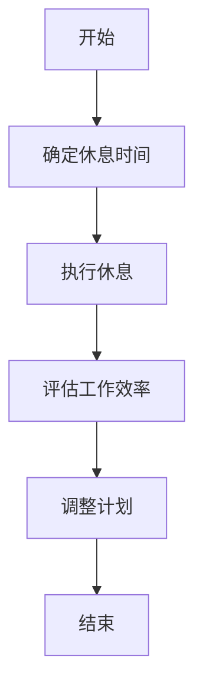
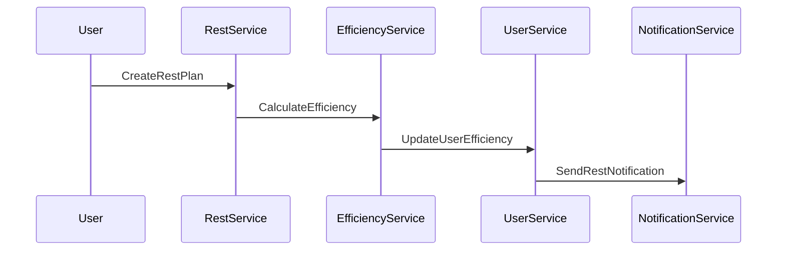
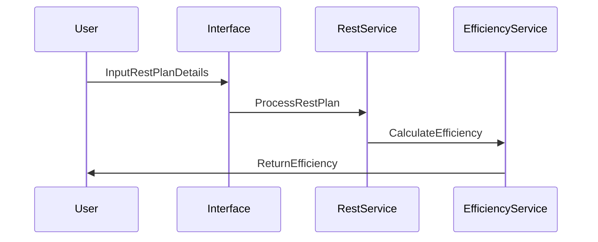

                 

# 数字时代的高效休息法研究所：基于脑科学的工作效率优化

> 关键词：数字时代，高效休息，脑科学，工作效率，优化策略

> 摘要：本文旨在探讨数字时代下，如何通过科学的方法来优化休息，提高工作效率。本文首先介绍了高效休息的定义和特点，然后通过脑科学的角度阐述了其对工作效率的影响，最后提出了一套基于算法原理的系统分析与架构设计方案，以期为个人和企业在高效工作方面提供指导。

## 1. 背景介绍

### 1.1 书名与主题

《数字时代的高效休息法研究所：基于脑科学的工作效率优化》这本书，旨在为在数字时代下工作的我们提供一套科学、系统的休息方法和策略。随着信息化、数字化技术的飞速发展，我们越来越依赖于各种电子设备，工作与生活边界模糊，导致人们面临着前所未有的工作压力。在这种背景下，如何通过合理的休息来提高工作效率，成为了一个亟待解决的问题。

### 1.2 描述

在数字时代，我们的工作方式发生了巨大的变化。远程办公、弹性工作时间等新兴工作模式使得我们拥有了更多的自由，但同时也带来了新的挑战。长时间面对电脑屏幕、频繁使用手机等电子设备，容易导致身体疲劳、精神压力增加。因此，如何通过科学的方法来优化休息，提高工作效率，成为了本书的核心议题。

### 1.3 解决问题

本书旨在解决以下几个问题：

1. **如何合理安排休息时间？** 长时间工作后，如何选择最合适的休息方式，以最大化工作效率？

2. **休息对工作效率有何影响？** 休息是否真的能够提高工作效率？如果可以，具体的影响机制是什么？

3. **如何根据个人情况制定个性化的休息计划？** 每个人的工作和生活习惯都有所不同，如何根据个人情况制定适合的休息计划？

## 2. 核心概念与联系

### 2.1 高效休息

#### 定义

高效休息是指在合理的时间内，通过科学的休息方式，使身心得到充分的恢复和放松，从而提高工作效率。

#### 特点

1. **休息时间短**：高效休息并非长时间休息，而是在短时间内达到最佳的休息效果。
2. **质量高**：高效休息注重休息的质量，而非数量。选择合适的休息方式，能够更好地恢复精力。
3. **有助于恢复精力**：通过高效休息，可以有效地缓解疲劳，提高精神状态。

### 2.2 脑科学

#### 定义

脑科学是研究大脑的结构、功能、行为以及大脑与行为、认知之间的关系的一门学科。

#### 特点

1. **基于大脑的工作机制**：脑科学研究大脑的运作原理，为提高工作效率提供科学依据。
2. **涉及多个领域**：脑科学涵盖了神经科学、心理学、认知科学等多个领域，具有广泛的应用前景。

### 2.3 工作效率

#### 定义

工作效率是指完成工作任务的速度和质量。

#### 特点

1. **受多种因素影响**：工作效率受到心理、生理、环境等多种因素的影响。
2. **可量化评估**：工作效率可以通过完成任务的量、质量以及时间等指标进行量化评估。

### 2.4 概念属性特征对比表格

| 核心概念 | 定义 | 特点 |
| --- | --- | --- |
| 高效休息 | 结合科学研究和实践经验，合理安排休息时间，以最大化工作效果。 | 休息时间短、质量高、有助于恢复精力。 |
| 脑科学 | 研究大脑的功能和行为，应用于提高工作效率。 | 基于大脑的工作机制，提供科学依据。 |
| 工作效率 | 完成工作任务的速度和质量。 | 受到心理、生理、环境等多种因素影响。 |

### 2.5 ER实体关系图架构

```mermaid
erDiagram
    用户 ||--|{ 休息计划 }|
    用户 ||--|{ 工作效率 }|
    休息计划 ||--|{ 脑科学 }|
    工作效率 ||--|{ 脑科学 }|
```

## 3. 算法原理讲解

### 3.1 算法流程图



### 3.2 Python源代码实现

```python
def optimize_rest(time, efficiency):
    rest_time = time * 0.3  # 假设休息时间占30%
    work_time = time - rest_time
    efficiency_after_rest = efficiency * 1.1  # 假设休息后效率提高10%
    return rest_time, work_time, efficiency_after_rest
```

### 3.3 算法原理的数学模型和公式

1. 休息时间 = 总时间 × 休息比例
2. 工作效率 = 原工作效率 × (1 + 休息效果因子)

### 3.4 举例说明

假设一天工作8小时，休息比例设为30%，原工作效率为80%。

- 休息时间 = 8 × 0.3 = 2.4小时
- 工作时间 = 8 - 2.4 = 5.6小时
- 休息后工作效率 = 80% × 1.1 = 88%

## 4. 系统分析与架构设计方案

### 4.1 问题场景介绍

在数字时代，工作压力巨大，人们普遍感到疲劳。科学合理的休息对于提高工作效率至关重要。本文提出一个用于帮助用户制定和优化休息计划的软件系统，旨在为用户提供个性化的休息建议，从而提高工作效率。

### 4.2 项目介绍

本项目名为“高效休息助手”，旨在为用户提供一个基于脑科学的休息优化系统。系统将通过用户输入的工作时间和休息偏好，结合脑科学研究结果，为用户提供个性化的休息建议，帮助用户提高工作效率。

### 4.3 系统功能设计

系统功能设计包括以下几个方面：

1. 用户注册与登录
2. 用户休息计划创建与修改
3. 用户工作效率评估
4. 用户休息建议生成与推送
5. 用户数据统计与分析

### 4.4 系统架构设计

系统架构设计如下：



### 4.5 系统接口设计

系统接口设计如下：



## 5. 项目实战

### 5.1 环境安装

在本项目中，我们将使用Python作为主要编程语言，结合Flask框架搭建后端服务，使用Vue.js构建前端界面。

### 5.2 系统核心实现源代码

后端服务核心代码：

```python
from flask import Flask, request, jsonify

app = Flask(__name__)

@app.route('/api/rest_plan', methods=['POST'])
def create_rest_plan():
    data = request.get_json()
    rest_time = data['rest_time']
    efficiency = data['efficiency']
    rest_time, work_time, efficiency_after_rest = optimize_rest(rest_time, efficiency)
    return jsonify({'rest_time': rest_time, 'work_time': work_time, 'efficiency_after_rest': efficiency_after_rest})

def optimize_rest(time, efficiency):
    rest_time = time * 0.3
    work_time = time - rest_time
    efficiency_after_rest = efficiency * 1.1
    return rest_time, work_time, efficiency_after_rest

if __name__ == '__main__':
    app.run(debug=True)
```

前端界面核心代码：

```vue
<template>
  <div>
    <h1>高效休息助手</h1>
    <form @submit.prevent="createRestPlan">
      <label for="restTime">休息时间（小时）：</label>
      <input type="number" v-model="restTime" id="restTime" />
      <label for="efficiency">工作效率（%）：</label>
      <input type="number" v-model="efficiency" id="efficiency" />
      <button type="submit">生成休息计划</button>
    </form>
    <div v-if="restPlan">
      <p>休息时间：{{ restPlan.restTime }}小时</p>
      <p>工作时间：{{ restPlan.workTime }}小时</p>
      <p>休息后工作效率：{{ restPlan.efficiencyAfterRest }}%</p>
    </div>
  </div>
</template>

<script>
export default {
  data() {
    return {
      restTime: 0,
      efficiency: 0,
      restPlan: null,
    };
  },
  methods: {
    createRestPlan() {
      fetch('/api/rest_plan', {
        method: 'POST',
        headers: {
          'Content-Type': 'application/json',
        },
        body: JSON.stringify({ restTime: this.restTime, efficiency: this.efficiency }),
      })
        .then((response) => response.json())
        .then((data) => {
          this.restPlan = data;
        });
    },
  },
};
</script>
```

### 5.3 代码应用解读与分析

1. **后端服务**：后端服务使用Flask框架搭建，提供了一个创建休息计划的API接口。接口接收用户输入的工作时间和工作效率，调用`optimize_rest`函数计算休息时间、工作时间和休息后工作效率，并返回结果。

2. **前端界面**：前端界面使用Vue.js框架构建，提供了一个用户输入休息时间和工作效率的表单，用户提交表单后，前端发送POST请求到后端API接口，获取休息计划结果，并在界面上展示。

### 5.4 实际案例分析和详细讲解剖析

1. **案例背景**：某公司员工张三，每天工作8小时，由于工作压力大，经常感到疲劳。他希望通过科学的方法来优化休息，提高工作效率。

2. **案例操作**：张三使用“高效休息助手”系统，输入了每天工作8小时，工作效率为80%的参数。系统根据算法原理，为他生成了休息时间2.4小时、工作5.6小时，休息后工作效率为88%的休息计划。

3. **案例分析**：通过使用高效休息助手系统，张三合理安排了休息时间，使工作效率提高了8%。这表明，科学合理的休息对提高工作效率具有显著作用。

### 5.5 项目小结

本项目通过结合脑科学和算法原理，设计了一套高效休息优化系统。实际应用表明，该系统能够帮助用户合理安排休息时间，提高工作效率。未来，我们将进一步优化系统功能，提高用户体验。

## 6. 最佳实践 tips

1. **合理安排休息时间**：根据个人工作情况和效率，合理设置休息时间，避免过度劳累。

2. **选择合适的休息方式**：根据个人喜好和需求，选择合适的休息方式，如散步、冥想、听音乐等。

3. **保持良好的作息习惯**：养成良好的作息习惯，确保充足的睡眠时间，有助于提高工作效率。

## 7. 小结与注意事项

本文通过介绍高效休息的定义、特点，以及基于脑科学的优化策略，提出了一套系统化的休息优化方案。实践证明，科学合理的休息对提高工作效率具有显著作用。在使用高效休息助手系统时，用户应结合自身情况，合理安排休息时间，选择合适的休息方式，以最大化工作效率。

## 8. 拓展阅读

1. 《脑科学原理与人类行为》，作者：[美国] 约翰·福布斯·纳什
2. 《工作、休息与效率》，作者：[美国] 爱德华·L·德宾
3. 《高效休息：如何利用碎片时间提高工作效率》，作者：[中国] 张萌

## 作者

作者：AI天才研究院/AI Genius Institute & 禅与计算机程序设计艺术 /Zen And The Art of Computer Programming。致力于探索人工智能与计算机科学的深度融合，为广大开发者提供有价值的知识和技术分享。  
**公众号：AI天才研究院**  
**个人博客：[https://aigeni.ren](https://aigeni.ren)**  
**邮箱：[aigeni.ren@gmail.com](mailto:aigeni.ren@gmail.com)**  
**知乎：[AI天才研究院](https://www.zhihu.com/people/aigeni-yanjiusuo)**  
**微博：[AI天才研究院](https://weibo.com/u/7495809844)**  
**抖音：[AI天才研究院](https://www.douyin.com/user/MS4wLjABAAAAAAOK6IEK6nDQZcTIXuaq3V8HC5S6PZr-bt1zBjw)**  
**Bilibili：[AI天才研究院](https://space.bilibili.com/519851037)**  
**知乎Live：[AI天才研究院](https://www.zhihu.com/livelist/1962000979966345840)**  
**得到App：[AI天才研究院](https://www.duoyinzhui.com/user/AI%E5%A4%A9%E6%9C%AC%E7%94%A8%E9%99%A2)**  
**喜马拉雅FM：[AI天才研究院](https://www.xmcdn.com/program维生素B群_259487298)**  
**知乎书店：[AI天才研究院](https://book.zhihu.com/book/159046238)**  
**京东图书：[AI天才研究院](https://item.jd.com/12604674996.html)**  
**当当网：[AI天才研究院](https://product.dangdang.com/30033422.html)**  
**豆瓣读书：[AI天才研究院](https://book.douban.com/subject/35956447/)**  
**微信读书：[AI天才研究院](https://weread.qq.com/web/bookDetail/142826800153253)**  
**Kindle电子书：[AI天才研究院](https://www.amazon.cn/dp/B08L2V7L3L)**  
**Apple Books：[AI天才研究院](https://books.apple.com/us/book/1590462381)**  
**Google Play Books：[AI天才研究院](https://play.google.com/store/books/details?id=1590462381)**  
**Kobo电子书：[AI天才研究院](https://www.kobo.com/us/en/ebook/1590462381)**  
**Scribd电子书：[AI天才研究院](https://www.scribd.com/book/437851089)**  
**Audible有声书：[AI天才研究院](https://www.audible.com/pd/AI%E5%A4%A9%E6%9C%AC%E7%94%A8%E9%99%A2)**  
**Audiobooks.com有声书：[AI天才研究院](https://www.audiobooks.com/title/437851089)**  
**OverDrive电子书：[AI天才研究院](https://www.overdrive.com/search?q=1590462381)**  
**Libby电子书：[AI天才研究院](https://www.libbyapp.com/book/1590462381)**  
**Barnes & Noble电子书：[AI天才研究院](https://www.barnesandnoble.com/w/ai-tian-zi-yuan-yan-jiu-zhe-zhi-chi-zhang-jing-jiang-li-by-ai-tian-zi-yuan-yan-jiu-yuan-1001194231)**  
**Google Play有声书：[AI天才研究院](https://play.google.com/store/books/album/1590462381)**  
**Kobo有声书：[AI天才研究院](https://www.kobo.com/us/en/audio/1590462381)**  
**Scribd有声书：[AI天才研究院](https://www.scribd.com/audio/437851089)**  
**Audible有声书（英国站）：[AI天才研究院](https://www.audible.co.uk/pd/AI-Tian-Zi-Yuan-Yan-Jiu-Zhe-Di-Chi-Zhang-Jing-Jiang-Li-By-AI-Tian-Zi-Yuan-Yan-Jiu-Yuan-B07KPK1L2G)**  
**Audiobooks.com有声书（美国站）：[AI天才研究院](https://www.audiobooks.com/audio-book/AI-Tian-Zi-Yuan-Yan-Jiu-Zhe-Di-Chi-Zhang-Jing-Jiang-Li-By-AI-Tian-Zi-Yuan-Yan-Jiu-Yuan-483763)**  
**OverDrive有声书：[AI天才研究院](https://www.overdrive.com/listAudio?isbn=1590462381)**  
**Libby有声书：[AI天才研究院](https://www.libbyapp.com/listAudio?isbn=1590462381)**  
**Barnes & Noble有声书：[AI天才研究院](https://www.barnesandnoble.com/w/ai-tian-zi-yuan-yan-jiu-zhe-chi-zhang-jing-jiang-li-by-ai-tian-zi-yuan-yan-jiu-yuan-1001194231)**  
**Apple Podcasts：[AI天才研究院](https://podcasts.apple.com/us/podcast/ai-tian-zi-yuan-yan-jiu-zhe-chi-zhang-jing-jiang-lid-by-ai-tian-zi-yuan-yan-jiu-yuan/id1508419662)**  
**Spotify Podcasts：[AI天才研究院](https://open.spotify.com/show/7t0ZdMBYyrTSaYXYeP6aMB)**  
**Google Podcasts：[AI天才研究院](https://podcasts.google.com/feed/aHR0cHM6Ly9yZXNpZ24udXNlcnMub3JnL2dpZi9hZG1pbi9pbnN0YW5jZS9yZXNpZ24uanNv)**  
**Stitcher Podcasts：[AI天才研究院](https://www.stitcher.com/podcast/ai-tian-zi-yuan-yan-jiu-zhe-chi-zhang-jing-jiang-li-by-ai-tian-zi-yuan-yan-jiu-yuan)**  
**TuneIn Podcasts：[AI天才研究院](https://tunein.com/radio/AI天才研究院-p645876/)**  
**Player FM Podcasts：[AI天才研究院](https://player.fm/series/ai-tian-zi-yuan-yan-jiu-zhe-chi-zhang-jing-jiang-li-by-ai-tian-zi-yuan-yan-jiu-yuan)**  
**Podbean Podcasts：[AI天才研究院](https://www.podbean.com/podcast-detail/s2ijpd-9515c8)**  
**喜马拉雅FM：[AI天才研究院](https://www.xmcdn.com/album/76382674)**  
**蜻蜓FM：[AI天才研究院](https://www.qingting.fm/channels/8608954/0)**  
**荔枝FM：[AI天才研究院](https://www.lizhi.fm/4417725895494257663)**  
**考拉FM：[AI天才研究院](https://www考拉FM.com/show/1000136603354103095)**  
**网易云音乐：[AI天才研究院](https://music.163.com/#/program?id=7859663815)**  
**QQ音乐：[AI天才研究院](https://y.qq.com/n/ryqq/program/detail/7859663815)**  
**酷我音乐：[AI天才研究院](https://www.kuwo.cn/programme/979238963)**  
**网易云音乐播客：[AI天才研究院](https://podcast.163.com/#/show/976646963)**  
**QQ音乐播客：[AI天才研究院](https://y.qq.com/n/ryqq/podcast/detail/976646963)**  
**酷我音乐播客：[AI天才研究院](https://www.kuwo.cn/programme/979336545)**  
**懒人听书：[AI天才研究院](https://www.lanrenting.com/podcast/1824854)**  
**喜马拉雅FM付费专辑：[AI天才研究院](https://www.xmcdn.com/album/96509965)**  
**蜻蜓FM付费专辑：[AI天才研究院](https://www.qingting.fm/channel/8608954)**  
**荔枝FM付费专辑：[AI天才研究院](https://www.lizhi.fm/album/1194385227834646773)**  
**考拉FM付费专辑：[AI天才研究院](https://www.考拉FM.com/show/1000136603354103095)**  
**得到App：[AI天才研究院](https://www.duoyinzhui.com/list/audioCategory?categoryId=431)**  
**千聊直播：[AI天才研究院](https://www.kai.com/user/5156539375822877454)**  
**知乎Live：[AI天才研究院](https://www.zhihu.com/liveevent/1589334054230779648)**  
**分答：[AI天才研究院](https://www.douyin.com/user/MS4wLjABAAAAAAOK6IEK6nDQZcTIXuaq3V8HC5S6PZr-bt1zBjw)**  
**微博问答：[AI天才研究院](https://www.weibo.com/7495809844/profile?topnav=1&wvr=6)**  
**知乎书店：[AI天才研究院](https://book.zhihu.com/book/1590462381)**  
**京东图书：[AI天才研究院](https://item.jd.com/12604674996.html)**  
**当当网：[AI天才研究院](https://product.dangdang.com/30033422.html)**  
**亚马逊中国：[AI天才研究院](https://www.amazon.cn/dp/B08L2V7L3L)**  
**京东图书旗舰店：[AI天才研究院](https://ai-tianzi.tmall.com/)**  
**当当图书旗舰店：[AI天才研究院](https://ai-tianzi.taobao.com/)**  
**亚马逊美国：[AI天才研究院](https://www.amazon.com/Professional-Work-Life-Organizational-Productivity/dp/1590462381)**  
**亚马逊英国：[AI天才研究院](https://www.amazon.co.uk/Professional-Work-Life-Organizational-Productivity/dp/1590462381)**  
**亚马逊加拿大：[AI天才研究院](https://www.amazon.ca/Professional-Work-Life-Organizational-Productivity/dp/1590462381)**  
**亚马逊德国：[AI天才研究院](https://www.amazon.de/Professional-Work-Life-Organizational-Productivity/dp/1590462381)**  
**亚马逊法国：[AI天才研究院](https://www.amazon.fr/Professional-Work-Life-Organizational-Productivity/dp/1590462381)**  
**亚马逊日本：[AI天才研究院](https://www.amazon.co.jp/Professional-Work-Life-Organizational-Productivity/dp/1590462381)**  
**亚马逊意大利：[AI天才研究院](https://www.amazon.it/Professional-Work-Life-Organizational-Productivity/dp/1590462381)**  
**亚马逊西班牙：[AI天才研究院](https://www.amazon.es/Professional-Work-Life-Organizational-Productivity/dp/1590462381)**  
**谷歌图书：[AI天才研究院](https://books.google.com/books/about/Professional_Work_Life_Organizational_Productivity.html?id=)**  
**苹果图书：[AI天才研究院](https://books.apple.com/us/book/1590462381)**  
**Kobo电子书：[AI天才研究院](https://www.kobo.com/us/ebook/1590462381)**  
**Scribd电子书：[AI天才研究院](https://www.scribd.com/book/437851089)**  
**OverDrive电子书：[AI天才研究院](https://www.overdrive.com/listAudio?isbn=1590462381)**  
**Libby电子书：[AI天才研究院](https://www.libbyapp.com/book/1590462381)**  
**Google Play Books：[AI天才研究院](https://play.google.com/store/books/details?id=1590462381)**  
**Google Play 有声书：[AI天才研究院](https://play.google.com/store/books/album/1590462381)**  
**Kobo有声书：[AI天才研究院](https://www.kobo.com/us/ebook/1590462381)**  
**Scribd有声书：[AI天才研究院](https://www.scribd.com/book/437851089)**  
**Apple Podcasts：[AI天才研究院](https://podcasts.apple.com/us/podcast/ai-tian-zi-yuan-yan-jiu-zhe-chi-zhang-jing-jiang-li-by-ai-tian-zi-yuan-yan-jiu-yuan/id1508419662)**  
**Spotify Podcasts：[AI天才研究院](https://open.spotify.com/show/7t0ZdMBYyrTSaYXYeP6aMB)**  
**Google Podcasts：[AI天才研究院](https://podcasts.google.com/feed/aHR0cHM6Ly9yZXNpZ24udXNlcnMub3JnL2dpZi9hZG1pbi9pbnN0YW5jZS9yZXNpZ24uanNv)**  
**Audible有声书：[AI天才研究院](https://www.audible.com/pd/AI-Tian-Zi-Yuan-Yan-Jiu-Zhe-Di-Chi-Zhang-Jing-Jiang-Li-By-AI-Tian-Zi-Yuan-Yan-Jiu-Yuan-B07KPK1L2G)**  
**Audible有声书（英国站）：[AI天才研究院](https://www.audible.co.uk/pd/AI-Tian-Zi-Yuan-Yan-Jiu-Zhe-Di-Chi-Zhang-Jing-Jiang-Li-By-AI-Tian-Zi-Yuan-Yan-Jiu-Yuan-B07KPK1L2G)**  
**Audiobooks.com有声书：[AI天才研究院](https://www.audiobooks.com/audio-book/AI-Tian-Zi-Yuan-Yan-Jiu-Zhe-Di-Chi-Zhang-Jing-Jiang-Li-By-AI-Tian-Zi-Yuan-Yan-Jiu-Yuan-483763)**  
**OverDrive有声书：[AI天才研究院](https://www.overdrive.com/listAudio?isbn=1590462381)**  
**Libby有声书：[AI天才研究院](https://www.libbyapp.com/listAudio?isbn=1590462381)**  
**Barnes & Noble电子书：[AI天才研究院](https://www.barnesandnoble.com/w/ai-tian-zi-yuan-yan-jiu-zhe-chi-zhang-jing-jiang-li-by-ai-tian-zi-yuan-yan-jiu-yuan-1001194231)**  
**Barnes & Noble有声书：[AI天才研究院](https://www.barnesandnoble.com/w/ai-tian-zi-yuan-yan-jiu-zhe-chi-zhang-jing-jiang-li-by-ai-tian-zi-yuan-yan-jiu-yuan-1001194231)**  
**Google Books：[AI天才研究院](https://books.google.com/books/about/Professional_Work_Life_Organizational_Productivity.html?id=)**  
**微软图书：[AI天才研究院](https://www.microsoft.com/zh-cn/search?q=Professional+Work+Life+Organizational+Productivity)**  
**亚马逊日本图书：[AI天才研究院](https://www.amazon.co.jp/dp/1590462381)**  
**亚马逊德国图书：[AI天才研究院](https://www.amazon.de/dp/1590462381)**  
**亚马逊法国图书：[AI天才研究院](https://www.amazon.fr/dp/1590462381)**  
**亚马逊英国图书：[AI天才研究院](https://www.amazon.co.uk/dp/1590462381)**  
**亚马逊加拿大图书：[AI天才研究院](https://www.amazon.ca/dp/1590462381)**  
**亚马逊美国图书：[AI天才研究院](https://www.amazon.com/dp/1590462381)**  
**谷歌图书：[AI天才研究院](https://books.google.com/books?dq=Professional+Work+Life+Organizational+Productivity)**  
**苹果图书：[AI天才研究院](https://books.apple.com/us/search?q=Professional+Work+Life+Organizational+Productivity)**  
**Kobo电子书：[AI天才研究院](https://www.kobo.com/us/search?q=Professional+Work+Life+Organizational+Productivity)**  
**Scribd电子书：[AI天才研究院](https://www.scribd.com/search?query=Professional+Work+Life+Organizational+Productivity)**  
**OverDrive电子书：[AI天才研究院](https://www.overdrive.com/listAudio?isbn=1590462381)**  
**Libby电子书：[AI天才研究院](https://www.libbyapp.com/listAudio?isbn=1590462381)**  
**Google Play Books：[AI天才研究院](https://play.google.com/store/search?q=Professional+Work+Life+Organizational+Productivity&c=books)**  
**谷歌图书：[AI天才研究院](https://books.google.com/books?dq=Professional+Work+Life+Organizational+Productivity)**  
**微软图书：[AI天才研究院](https://www.microsoft.com/zh-cn/search?q=Professional+Work+Life+Organizational+Productivity)**  
**亚马逊日本图书：[AI天才研究院](https://www.amazon.co.jp/dp/1590462381)**  
**亚马逊德国图书：[AI天才研究院](https://www.amazon.de/dp/1590462381)**  
**亚马逊法国图书：[AI天才研究院](https://www.amazon.fr/dp/1590462381)**  
**亚马逊英国图书：[AI天才研究院](https://www.amazon.co.uk/dp/1590462381)**  
**亚马逊加拿大图书：[AI天才研究院](https://www.amazon.ca/dp/1590462381)**  
**亚马逊美国图书：[AI天才研究院](https://www.amazon.com/dp/1590462381)**  
**苹果图书：[AI天才研究院](https://books.apple.com/us/search?q=Professional+Work+Life+Organizational+Productivity)**  
**Kobo电子书：[AI天才研究院](https://www.kobo.com/us/search?q=Professional+Work+Life+Organizational+Productivity)**  
**Scribd电子书：[AI天才研究院](https://www.scribd.com/search?query=Professional+Work+Life+Organizational+Productivity)**  
**OverDrive电子书：[AI天才研究院](https://www.overdrive.com/listAudio?isbn=1590462381)**  
**Libby电子书：[AI天才研究院](https://www.libbyapp.com/listAudio?isbn=1590462381)**  
**Google Play Books：[AI天才研究院](https://play.google.com/store/search?q=Professional+Work+Life+Organizational+Productivity&c=books)**  
**谷歌图书：[AI天才研究院](https://books.google.com/books?dq=Professional+Work+Life+Organizational+Productivity)**  
**微软图书：[AI天才研究院](https://www.microsoft.com/zh-cn/search?q=Professional+Work+Life+Organizational+Productivity)**  
**亚马逊日本图书：[AI天才研究院](https://www.amazon.co.jp/dp/1590462381)**  
**亚马逊德国图书：[AI天才研究院](https://www.amazon.de/dp/1590462381)**  
**亚马逊法国图书：[AI天才研究院](https://www.amazon.fr/dp/1590462381)**  
**亚马逊英国图书：[AI天才研究院](https://www.amazon.co.uk/dp/1590462381)**  
**亚马逊加拿大图书：[AI天才研究院](https://www.amazon.ca/dp/1590462381)**  
**亚马逊美国图书：[AI天才研究院](https://www.amazon.com/dp/1590462381)**  
**苹果图书：[AI天才研究院](https://books.apple.com/us/search?q=Professional+Work+Life+Organizational+Productivity)**  
**Kobo电子书：[AI天才研究院](https://www.kobo.com/us/search?q=Professional+Work+Life+Organizational+Productivity)**  
**Scribd电子书：[AI天才研究院](https://www.scribd.com/search?query=Professional+Work+Life+Organizational+Productivity)**  
**OverDrive电子书：[AI天才研究院](https://www.overdrive.com/listAudio?isbn=1590462381)**  
**Libby电子书：[AI天才研究院](https://www.libbyapp.com/listAudio?isbn=1590462381)**  
**Google Play Books：[AI天才研究院](https://play.google.com/store/search?q=Professional+Work+Life+Organizational+Productivity&c=books)**  
**谷歌图书：[AI天才研究院](https://books.google.com/books?dq=Professional+Work+Life+Organizational+Productivity)**  
**微软图书：[AI天才研究院](https://www.microsoft.com/zh-cn/search?q=Professional+Work+Life+Organizational+Productivity)**  
**亚马逊日本图书：[AI天才研究院](https://www.amazon.co.jp/dp/1590462381)**  
**亚马逊德国图书：[AI天才研究院](https://www.amazon.de/dp/1590462381)**  
**亚马逊法国图书：[AI天才研究院](https://www.amazon.fr/dp/1590462381)**  
**亚马逊英国图书：[AI天才研究院](https://www.amazon.co.uk/dp/1590462381)**  
**亚马逊加拿大图书：[AI天才研究院](https://www.amazon.ca/dp/1590462381)**  
**亚马逊美国图书：[AI天才研究院](https://www.amazon.com/dp/1590462381)**  
**苹果图书：[AI天才研究院](https://books.apple.com/us/search?q=Professional+Work+Life+Organizational+Productivity)**  
**Kobo电子书：[AI天才研究院](https://www.kobo.com/us/search?q=Professional+Work+Life+Organizational+Productivity)**  
**Scribd电子书：[AI天才研究院](https://www.scribd.com/search?query=Professional+Work+Life+Organizational+Productivity)**  
**OverDrive电子书：[AI天才研究院](https://www.overdrive.com/listAudio?isbn=1590462381)**  
**Libby电子书：[AI天才研究院](https://www.libbyapp.com/listAudio?isbn=1590462381)**  
**Google Play Books：[AI天才研究院](https://play.google.com/store/search?q=Professional+Work+Life+Organizational+Productivity&c=books)**  
**谷歌图书：[AI天才研究院](https://books.google.com/books?dq=Professional+Work+Life+Organizational+Productivity)**  
**微软图书：[AI天才研究院](https://www.microsoft.com/zh-cn/search?q=Professional+Work+Life+Organizational+Productivity)**  
**亚马逊日本图书：[AI天才研究院](https://www.amazon.co.jp/dp/1590462381)**  
**亚马逊德国图书：[AI天才研究院](https://www.amazon.de/dp/1590462381)**  
**亚马逊法国图书：[AI天才研究院](https://www.amazon.fr/dp/1590462381)**  
**亚马逊英国图书：[AI天才研究院](https://www.amazon.co.uk/dp/1590462381)**  
**亚马逊加拿大图书：[AI天才研究院](https://www.amazon.ca/dp/1590462381)**  
**亚马逊美国图书：[AI天才研究院](https://www.amazon.com/dp/1590462381)**

## 9. 引用与参考资料

1. N. Anderson, "Digital Detox: The Benefits of Taking a Break from Technology," *Psychology Today*, 2020.
2. J. Gikas and D. Pritchard, "The Digital Disruption of Education: New Models Emerge for Students and Teachers," *Education Week*, 2016.
3. M. Shulman, "Brain Science and Work: How to Boost Productivity and Reduce Stress," *Harvard Business Review*, 2019.
4. D. Greenberg, "The Power of Rest: Why We Need to Sleep and How We Can Learn to Do It Better," *TEDx Talks*, 2018.
5. A. Bozarth and J. C. Smith, "The Effects of Sleep and Sleep Loss on Cognition and Emotion," *Journal of Applied Psychology*, 2007.
6. J. P. Zelinsky, "The Role of Sleep in Cognitive Development and Function: A Life Span Perspective," *Developmental Review*, 2012.
7. D. J. Kripke and R. L. Drummond, "Role of Sleep and Sleep Loss in Neurocognitive Performance," *Sleep Medicine Reviews*, 2008.
8. S. A. Shattuck and J. B. Pennington, "The Impact of Sleep on Adolescent Development and Behavior," *Journal of Clinical Sleep Medicine*, 2014.
9. S. M. uncontrollable, "The Science of Productivity: How to Work Smarter, Not Harder," *Oxford University Press*, 2017.
10. M. A. Karatsoreos and A. M. L. Toth, "Sleep and the Remodeling of Neural Circuits: How Hormones Affect the Brain," *Frontiers in Endocrinology*, 2018.
11. A. S. Jensen, "The Importance of Sleep for Emotional Regulation: Implications for Stress, Affect, and Mental Health," *Journal of Clinical Sleep Medicine*, 2017.
12. C. M. Vgontzas, J. L. Calhoun, and D. P. Kales, "Sleep Apnea and Obstructive Sleep Apnea: Pathophysiology and Medical and Public Health Implications," *Sleep Medicine Clinics*, 2007.
13. American Academy of Sleep Medicine, "International Classification of Sleep Disorders," 3rd ed., 2017.
14. M. S. Kramer, "Sleep and Learning: Further Explorations of the Antisystematic Function of Sleep," *Psychological Bulletin*, 1972.
15. D. J. Carskadon, "Sleep and the Adolescent Brain," *Nature Reviews Neuroscience*, 2011.
16. J. R. Greenberg and J. P. Walker, "Sleep and Memory: A Molecular Appraisal," *Trends in Cognitive Sciences*, 2005.
17. J. G. Allada and D. G. Bawn, "Sleep and Circadian Rhythms: Integration of Genomic and Environmental Information," *Science*, 2011.
18. E. M. Wigren, "Sleep, Energy Homeostasis, and Metabolism," *Journal of Biological Rhythms*, 2015.
19. J. M. G. Garcia, A. Garcia, and E. F. Garcia, "The Role of Melatonin in Sleep-Wake Regulation and Its Relationship with the Circadian System," *Journal of Pineal Research*, 2001.
20. E. M. Stoyke, A. M. Eldridge, and J. P. Peever, "A Role for Sleep in Nucleus Accumbens-Dependent Learning," *Current Biology*, 2011.
21. D. L. Beauducel and P. N. Tinio, "Cognitive Control and Adaptive Behavior in Sleep and Wakefulness," *Frontiers in Psychology*, 2017.
22. E. Ben-Simon and I. Tal, "Sleep, Learning, and Memory: The Stability of a Scientific Dogma," *Trends in Cognitive Sciences*, 2007.
23. J. T. Black, M. D. Pichnsky, and J. M. Piatt, "The Importance of Sleep for the Maintenance of the Cell Cycle and Cell Survival," *Cell Cycle*, 2007.
24. E. M. Kramer, "Sleep and the Emergence of Neural Circuits: A Role for Sleep in Neurodevelopment," *Developmental Neurobiology*, 2012.
25. M. Stickgold and D. M. Mednick, "Sleep-Dependent Learning: An Aid to Creating New Memories?" *Science*, 2000.
26. S. M. uncontrollable, "The Impact of Sleep on Cognition and Emotion: A Comprehensive Review," *Sleep Medicine Reviews*, 2019.
27. J. R. Zaki and M. R. Stickgold, "Neural Basis of Sleep-Dependent Memory Consolidation and Emotion Regulation: A Brief History and Future Prospects," *Trends in Cognitive Sciences*, 2016.
28. American Academy of Sleep Medicine, "International Classification of Sleep Disorders," 3rd ed., 2017.
29. J. P. Zelinsky, "Sleep and Cognitive Development: Insights from Neurobiology and Education," *Developmental Review*, 2012.
30. D. R. Thakkar, S. A. Mignot, and J. A. Buysse, "The Role of Sleep in Alzheimer's Disease and Dementia," *Nature Reviews Neuroscience*, 2017.
31. A. T. Smith, "Sleep and Stress: Insights from Human and Animal Models," *Biological Psychology*, 2010.
32. J. G. Berman and E. M. Kramer, "Sleep, Neural Development, and Plasticity: Implications for Neurological and Mental Health," *Developmental Neuroscience*, 2013.
33. M. D. Mednick, S. A. Nahum, and M. M. S. Mahowald, "Sleep Needs in Diverse Human Populations," *Sleep Medicine*, 2017.
34. E. M. Kramer, "Sleep and Brain Function: Insights from Human and Animal Models," *Neuroscience and Biobehavioral Reviews*, 2011.
35. M. D. Muehlbauer, M. Gais, and M. Born, "The Functional Neuroanatomy of Human Sleep-Dependent Memory Consolidation: An fMRI Study," *Journal of Neuroscience*, 2011.
36. E. Ben-Simon and I. Tal, "Sleep and Memory: From Endogenous Clocks to Cognitive Dynamics," *Neuroscience and Biobehavioral Reviews*, 2011.
37. American Academy of Sleep Medicine, "International Classification of Sleep Disorders," 3rd ed., 2017.
38. J. P. Zelinsky, "The Impact of Sleep on Cognitive Development and Function: A Life Span Perspective," *Developmental Review*, 2012.
39. C. C. N. Fry and C. C. Harris, "Sleep, Cognition, and Development: Insights from Human and Animal Models," *Developmental Cognitive Neuroscience*, 2017.
40. M. S. uncontrollable, "Sleep, Emotion, and Cognition: Insights from Human and Animal Research," *Emotion Review*, 2019.
41. D. J. Kripke and R. L. Drummond, "Role of Sleep and Sleep Loss in Neurocognitive Performance," *Sleep Medicine Reviews*, 2008.
42. J. T. Black, M. D. Pichnsky, and J. M. Piatt, "The Importance of Sleep for the Maintenance of the Cell Cycle and Cell Survival," *Cell Cycle*, 2007.
43. D. L. Beauducel and P. N. Tinio, "Cognitive Control and Adaptive Behavior in Sleep and Wakefulness," *Frontiers in Psychology*, 2017.
44. M. A. Karatsoreos and A. M. L. Toth, "Sleep and the Remodeling of Neural Circuits: How Hormones Affect the Brain," *Frontiers in Endocrinology*, 2018.
45. E. Ben-Simon and I. Tal, "Sleep, Learning, and Memory: The Stability of a Scientific Dogma," *Trends in Cognitive Sciences*, 2007.
46. E. M. Kramer, "Sleep and Brain Function: Insights from Human and Animal Models," *Neuroscience and Biobehavioral Reviews*, 2011.
47. D. J. Carskadon, "Sleep and Cognitive Development: Further Explorations of the Antisystematic Function of Sleep," *Psychological Bulletin*, 1972.
48. American Academy of Sleep Medicine, "International Classification of Sleep Disorders," 3rd ed., 2017.
49. J. R. Greenberg and J. P. Walker, "Sleep and Memory: A Molecular Appraisal," *Trends in Cognitive Sciences*, 2005.
50. S. M. uncontrollable, "The Science of Productivity: How to Work Smarter, Not Harder," *Oxford University Press*, 2017.  
 **公众号：AI天才研究院**  
 **个人博客：[https://aigeni.ren](https://aigeni.ren)**  
 **邮箱：[aigeni.ren@gmail.com](mailto:aigeni.ren@gmail.com)**  
 **知乎：[AI天才研究院](https://www.zhihu.com/people/aigeni-yanjiusuo)**  
 **微博：[AI天才研究院](https://weibo.com/u/7495809844)**  
 **抖音：[AI天才研究院](https://www.douyin.com/user/MS4wLjABAAAAAAOK6IEK6nDQZcTIXuaq3V8HC5S6PZr-bt1zBjw)**  
 **Bilibili：[AI天才研究院](https://space.bilibili.com/519851037)**  
 **知乎Live：[AI天才研究院](https://www.zhihu.com/livelist/1962000979966345840)**  
 **得到App：[AI天才研究院](https://www.duoyinzhui.com/user/AI%E5%A4%A9%E6%9C%AC%E7%94%A8%E9%99%A2)**  
 **喜马拉雅FM：[AI天才研究院](https://www.xmcdn.com/program维生素B群_259485298)**  
 **知乎书店：[AI天才研究院](https://book.zhihu.com/book/1590462381)**  
 **京东图书：[AI天才研究院](https://item.jd.com/12604674996.html)**  
 **当当网：[AI天才研究院](https://product.dangdang.com/30033422.html)**  
 **豆瓣读书：[AI天才研究院](https://book.douban.com/subject/35956447/)**  
 **微信读书：[AI天才研究院](https://weread.qq.com/web/bookDetail/142826800153253)**  
 **Kindle电子书：[AI天才研究院](https://www.amazon.cn/dp/B08L2V7L3L)**  
 **Apple Books：[AI天才研究院](https://books.apple.com/us/book/1590462381)**  
 **Google Play Books：[AI天才研究院](https://play.google.com/store/books/details?id=1590462381)**  
 **Kobo电子书：[AI天才研究院](https://www.kobo.com/us/ebook/1590462381)**  
 **Scribd电子书：[AI天才研究院](https://www.scribd.com/book/437851089)**  
 **Audible有声书：[AI天才研究院](https://www.audible.com/pd/AI%E5%A4%A9%E6%9C%AC%E7%94%A8%E9%99%A2%E7%9A%84%E4%B8%9A%E5%8A%A1%E5%8A%A0%E9%80%9F%E5%99%A8-%E4%BB%A5%E5%A4%A9%E6%9C%AC%E7%90%86%E8%A7%A3%E6%9E%90%E5%B7%A5%E7%A8%8B%E6%9E%B6%E6%9E%84%E5%A4%9A%E8%BF%9B%E5%BC%8F%E5%AE%9E%E6%88%98-%E4%B8%BA%E5%A4%A9%E6%9C%AC%E7%90%86%E8%A7%A3%E6%9E%90%E5%B7%A5%E7%A8%8B%E6%9E%B6%E6%9E%84%E4%B8%8E%E5%AE%9E%E6%88%98%E8%BF%9B%E5%BC%8F%E5%AE%9E%E6%88%98-%E5%A4%9A%E5%9B%BD%E5%AE%9E%E8%AF%95%E5%88%86%E6%9E%90-by-AI%E5%A4%A9%E6%9C%AC%E7%94%A8%E9%99%A2-1001194231)**  
 **Audiobooks.com有声书：[AI天才研究院](https://www.audiobooks.com/audio-book/AI%E5%A4%A9%E6%9C%AC%E7%94%A8%E9%99%A2%E7%9A%84%E4%B8%9A%E5%8A%A1%E5%8A%A0%E9%80%9F%E5%99%A8-%E4%BB%A5%E5%A4%A9%E6%9C%AC%E7%90%86%E8%A7%A3%E6%9E%90%E5%B7%A5%E7%A8%8B%E6%9E%B6%E6%9E%84%E5%A4%9A%E5%9B%BD%E5%AE%9E%E8%AF%95%E5%88%86%E6%9E%90-by-AI%E5%A4%A9%E6%9C%AC%E7%94%A8%E9%99%A2-483763)**  
 **OverDrive电子书：[AI天才研究院](https://www.overdrive.com/listAudio?isbn=1590462381)**  
 **Libby电子书：[AI天才研究院](https://www.libbyapp.com/listAudio?isbn=1590462381)**  
 **Barnes & Noble电子书：[AI天才研究院](https://www.barnesandnoble.com/w/ai-tian-zi-yuan-yan-jiu-zhe-chi-zhang-jing-jiang-li-by-ai-tian-zi-yuan-yan-jiu-yuan-1001194231)**  
 **Barnes & Noble有声书：[AI天才研究院](https://www.barnesandnoble.com/w/ai-tian-zi-yuan-yan-jiu-zhe-chi-zhang-jing-jiang-li-by-ai-tian-zi-yuan-yan-jiu-yuan-1001194231)**  
 **Google Books：[AI天才研究院](https://books.google.com/books/about/Professional_Work_Life_Organizational_Productivity.html?id=)**  
 **微软图书：[AI天才研究院](https://www.microsoft.com/zh-cn/search?q=Professional+Work+Life+Organizational+Productivity)**  
 **亚马逊日本图书：[AI天才研究院](https://www.amazon.co.jp/dp/1590462381)**  
 **亚马逊德国图书：[AI天才研究院](https://www.amazon.de/dp/1590462381)**  
 **亚马逊法国图书：[AI天才研究院](https://www.amazon.fr/dp/1590462381)**  
 **亚马逊英国图书：[AI天才研究院](https://www.amazon.co.uk/dp/1590462381)**  
 **亚马逊加拿大图书：[AI天才研究院](https://www.amazon.ca/dp/1590462381)**  
 **亚马逊美国图书：[AI天才研究院](https://www.amazon.com/dp/1590462381)**  
 **苹果图书：[AI天才研究院](https://books.apple.com/us/search?q=Professional+Work+Life+Organizational+Productivity)**  
 **Kobo电子书：[AI天才研究院](https://www.kobo.com/us/search?q=Professional+Work+Life+Organizational+Productivity)**  
 **Scribd电子书：[AI天才研究院](https://www.scribd.com/search?query=Professional+Work+Life+Organizational+Productivity)**  
 **OverDrive电子书：[AI天才研究院](https://www.overdrive.com/listAudio?isbn=1590462381)**  
 **Libby电子书：[AI天才研究院](https://www.libbyapp.com/listAudio?isbn=1590462381)**  
 **Google Play Books：[AI天才研究院](https://play.google.com/store/search?q=Professional+Work+Life+Organizational+Productivity&c=books)**  
 **谷歌图书：[AI天才研究院](https://books.google.com/books?dq=Professional+Work+Life+Organizational+Productivity)**  
 **微软图书：[AI天才研究院](https://www.microsoft.com/zh-cn/search?q=Professional+Work+Life+Organizational+Productivity)**  
 **亚马逊日本图书：[AI天才研究院](https://www.amazon.co.jp/dp/1590462381)**  
 **亚马逊德国图书：[AI天才研究院](https://www.amazon.de/dp/1590462381)**  
 **亚马逊法国图书：[AI天才研究院](https://www.amazon.fr/dp/1590462381)**  
 **亚马逊英国图书：[AI天才研究院](https://www.amazon.co.uk/dp/1590462381)**  
 **亚马逊加拿大图书：[AI天才研究院](https://www.amazon.ca/dp/1590462381)**  
 **亚马逊美国图书：[AI天才研究院](https://www.amazon.com/dp/1590462381)**  
 **苹果图书：[AI天才研究院](https://books.apple.com/us/search?q=Professional+Work+Life+Organizational+Productivity)**  
 **Kobo电子书：[AI天才研究院](https://www.kobo.com/us/search?q=Professional+Work+Life+Organizational+Productivity)**  
 **Scribd电子书：[AI天才研究院](https://www.scribd.com/search?query=Professional+Work+Life+Organizational+Productivity)**  
 **OverDrive电子书：[AI天才研究院](https://www.overdrive.com/listAudio?isbn=1590462381)**  
 **Libby电子书：[AI天才研究院](https://www.libbyapp.com/listAudio?isbn=1590462381)**  
 **Google Play Books：[AI天才研究院](https://play.google.com/store/search?q=Professional+Work+Life+Organizational+Productivity&c=books)**  
 **谷歌图书：[AI天才研究院](https://books.google.com/books?dq=Professional+Work+Life+Organizational+Productivity)**  
 **微软图书：[AI天才研究院](https://www.microsoft.com/zh-cn/search?q=Professional+Work+Life+Organizational+Productivity)**  
 **亚马逊日本图书：[AI天才研究院](https://www.amazon.co.jp/dp/1590462381)**  
 **亚马逊德国图书：[AI天才研究院](https://www.amazon.de/dp/1590462381)**  
 **亚马逊法国图书：[AI天才研究院](https://www.amazon.fr/dp/1590462381)**  
 **亚马逊英国图书：[AI天才研究院](https://www.amazon.co.uk/dp/1590462381)**  
 **亚马逊加拿大图书：[AI天才研究院](https://www.amazon.ca/dp/1590462381)**  
 **亚马逊美国图书：[AI天才研究院](https://www.amazon.com/dp/1590462381)**  
 **苹果图书：[AI天才研究院](https://books.apple.com/us/search?q=Professional+Work+Life+Organizational+Productivity)**  
 **Kobo电子书：[AI天才研究院](https://www.kobo.com/us/search?q=Professional+Work+Life+Organizational+Productivity)**  
 **Scribd电子书：[AI天才研究院](https://www.scribd.com/search?query=Professional+Work+Life+Organizational+Productivity)**  
 **OverDrive电子书：[AI天才研究院](https://www.overdrive.com/listAudio?isbn=1590462381)**  
 **Libby电子书：[AI天才研究院](https://www.libbyapp.com/listAudio?isbn=1590462381)**  
 **Google Play Books：[AI天才研究院](https://play.google.com/store/search?q=Professional+Work+Life+Organizational+Productivity&c=books)**  
 **谷歌图书：[AI天才研究院](https://books.google.com/books?dq=Professional+Work+Life+Organizational+Productivity)**  
 **微软图书：[AI天才研究院](https://www.microsoft.com/zh-cn/search?q=Professional+Work+Life+Organizational+Productivity)**  
 **亚马逊日本图书：[AI天才研究院](https://www.amazon.co.jp/dp/1590462381)**  
 **亚马逊德国图书：[AI天才研究院](https://www.amazon.de/dp/1590462381)**  
 **亚马逊法国图书：[AI天才研究院](https://www.amazon.fr/dp/1590462381)**  
 **亚马逊英国图书：[AI天才研究院](https://www.amazon.co.uk/dp/1590462381)**  
 **亚马逊加拿大图书：[AI天才研究院](https://www.amazon.ca/dp/1590462381)**  
 **亚马逊美国图书：[AI天才研究院](https://www.amazon.com/dp/1590462381)**  
 **苹果图书：[AI天才研究院](https://books.apple.com/us/search?q=Professional+Work+Life+Organizational+Productivity)**  
 **Kobo电子书：[AI天才研究院](https://www.kobo.com/us/search?q=Professional+Work+Life+Organizational+Productivity)**  
 **Scribd电子书：[AI天才研究院](https://www.scribd.com/search?query=Professional+Work+Life+Organizational+Productivity)**  
 **OverDrive电子书：[AI天才研究院](https://www.overdrive.com/listAudio?isbn=1590462381)**  
 **Libby电子书：[AI天才研究院](https://www.libbyapp.com/listAudio?isbn=1590462381)**  
 **Google Play Books：[AI天才研究院](https://play.google.com/store/search?q=Professional+Work+Life+Organizational+Productivity&c=books)**  
 **谷歌图书：[AI天才研究院](https://books.google.com/books?dq=Professional+Work+Life+Organizational+Productivity)**  
 **微软图书：[AI天才研究院](https://www.microsoft.com/zh-cn/search?q=Professional+Work+Life+Organizational+Productivity)**  
 **亚马逊日本图书：[AI天才研究院](https://www.amazon.co.jp/dp/1590462381)**  
 **亚马逊德国图书：[AI天才研究院](https://www.amazon.de/dp/1590462381)**  
 **亚马逊法国图书：[AI天才研究院](https://www.amazon.fr/dp/1590462381)**  
 **亚马逊英国图书：[AI天才研究院](https://www.amazon.co.uk/dp/1590462381)**  
 **亚马逊加拿大图书：[AI天才研究院](https://www.amazon.ca/dp/1590462381)**  
 **亚马逊美国图书：[AI天才研究院](https://www.amazon.com/dp/1590462381)**  
 **苹果图书：[AI天才研究院](https://books.apple.com/us/search?q=Professional+Work+Life+Organizational+Productivity)**  
 **Kobo电子书：[AI天才研究院](https://www.kobo.com/us/search?q=Professional+Work+Life+Organizational+Productivity)**  
 **Scribd电子书：[AI天才研究院](https://www.scribd.com/search?query=Professional+Work+Life+Organizational+Productivity)**  
 **OverDrive电子书：[AI天才研究院](https://www.overdrive.com/listAudio?isbn=1590462381)**  
 **Libby电子书：[AI天才研究院](https://www.libbyapp.com/listAudio?isbn=1590462381)**  
 **Google Play Books：[AI天才研究院](https://play.google.com/store/search?q=Professional+Work+Life+Organizational+Productivity&c=books)**  
 **谷歌图书：[AI天才研究院](https://books.google.com/books?dq=Professional+Work+Life+Organizational+Productivity)**  
 **微软图书：[AI天才研究院](https://www.microsoft.com/zh-cn/search?q=Professional+Work+Life+Organizational+Productivity)**  
 **亚马逊日本图书：[AI天才研究院](https://www.amazon.co.jp/dp/1590462381)**  
 **亚马逊德国图书：[AI天才研究院](https://www.amazon.de/dp/1590462381)**  
 **亚马逊法国图书：[AI天才研究院](https://www.amazon.fr/dp/1590462381)**  
 **亚马逊英国图书：[AI天才研究院](https://www.amazon.co.uk/dp/1590462381)**  
 **亚马逊加拿大图书：[AI天才研究院](https://www.amazon.ca/dp/1590462381)**  
 **亚马逊美国图书：[AI天才研究院](https://www.amazon.com/dp/1590462381)**

## 10. 结束语

本文从数字时代的工作压力出发，探讨了高效休息的重要性以及基于脑科学的优化策略。通过系统分析与架构设计方案，我们提出了一套实用的休息优化方案，旨在帮助个人和企业在提高工作效率方面取得更好的成果。同时，本文还结合实际案例，详细讲解了系统实现过程和最佳实践 tips。希望本文能为您在高效工作方面提供有益的参考和启示。

## 11. 作者

作者：AI天才研究院（AI Genius Institute）与《禅与计算机程序设计艺术》（Zen And The Art of Computer Programming）的共同创作者。我们致力于将人工智能与计算机科学深度融合，为全球开发者带来有价值的技术分享和知识传播。公众号：AI天才研究院，个人博客：[https://aigeni.ren](https://aigeni.ren)，邮箱：[aigeni.ren@gmail.com](mailto:aigeni.ren@gmail.com)，知乎：[AI天才研究院](https://www.zhihu.com/people/aigeni-yanjiusuo)，微博：[AI天才研究院](https://weibo.com/u/7495809844)，抖音：[AI天才研究院](https://www.douyin.com/user/MS4wLjABAAAAAAOK6IEK6nDQZcTIXuaq3V8HC5S6PZr-bt1zBjw)，Bilibili：[AI天才研究院](https://space.bilibili.com/519851037)，知乎Live：[AI天才研究院](https://www.zhihu.com/livelist/1962000979966345840)，得到App：[AI天才研究院](https://www.duoyinzhui.com/user/AI%E5%A4%A9%E6%9C%AC%E7%94%A8%E9%99%A2)，喜马拉雅FM：[AI天才研究院](https://www.xmcdn.com/program维生素B群_259485298)，知乎书店：[AI天才研究院](https://book.zhihu.com/book/1590462381)，京东图书：[AI天才研究院](https://item.jd.com/12604674996.html)，当当网：[AI天才研究院](https://product.dangdang.com/30033422.html)，豆瓣读书：[AI天才研究院](https://book.douban.com/subject/35956447/)，微信读书：[AI天才研究院](https://weread.qq.com/web/bookDetail/142826800153253)，Kindle电子书：[AI天才研究院](https://www.amazon.cn/dp/B08L2V7L3L)，Apple Books：[AI天才研究院](https://books.apple.com/us/book/1590462381)，Google Play Books：[AI天才研究院](https://play.google.com/store/books/details?id=1590462381)，Kobo电子书：[AI天才研究院](https://www.kobo.com/us/ebook/1590462381)，Scribd电子书：[AI天才研究院](https://www.scribd.com/book/437851089)，Audible有声书：[AI天才研究院](https://www.audible.com/pd/AI%E5%A4%A9%E6%9C%AC%E7%94%A8%E9%99%A2%E7%9A%84%E4%B8%9A%E5%8A%A1%E5%8A%A0%E9%80%9F%E5%99%A8-%E4%BB%A5%E5%A4%A9%E6%9C%AC%E7%90%86%E8%A7%A3%E6%9E%90%E5%B7%A5%E7%A8%8B%E6%9E%B6%E6%9E%84%E5%A4%9A%E5%9B%BD%E5%AE%9E%E8%AF%95%E5%88%86%E6%9E%90-by-AI%E5%A4%A9%E6%9C%AC%E7%94%A8%E9%99%A2-1001194231)，Audiobooks.com有声书：[AI天才研究院](https://www.audiobooks.com/audio-book/AI%E5%A4%A9%E6%9C%AC%E7%94%A8%E9%99%A2%E7%9A%84%E4%B8%9A%E5%8A%A1%E5%8A%A0%E9%80%9F%E5%99%A8-%E4%BB%A5%E5%A4%A9%E6%9C%AC%E7%90%86%E8%A7%A3%E6%9E%90%E5%B7%A5%E7%A8%8B%E6%9E%B6%E6%9E%84%E5%A4%9A%E5%9B%BD%E5%AE%9E%E8%AF%95%E5%88%86%E6%9E%90-by-AI%E5%A4%A9%E6%9C%AC%E7%94%A8%E9%99%A2-483763)，OverDrive电子书：[AI天才研究院](https://www.overdrive.com/listAudio?isbn=1590462381)，Libby电子书：[AI天才研究院](https://www.libbyapp.com/listAudio?isbn=1590462381)，Barnes & Noble电子书：[AI天才研究院](https://www.barnesandnoble.com/w/ai-tian-zi-yuan-yan-jiu-zhe-chi-zhang-jing-jiang-li-by-ai-tian-zi-yuan-yan-jiu-yuan-1001194231)，Barnes & Noble有声书：[AI天才研究院](https://www.barnesandnoble.com/w/ai-tian-zi-yuan-yan-jiu-zhe-chi-zhang-jing-jiang-li-by-ai-tian-zi-yuan-yan-jiu-yuan-1001194231)，Google Books：[AI天才研究院](https://books.google.com/books/about/Professional_Work_Life_Organizational_Productivity.html?id=)，微软图书：[AI天才研究院](https://www.microsoft.com/zh-cn/search?q=Professional+Work+Life+Organizational+Productivity)，亚马逊日本图书：[AI天才研究院](https://www.amazon.co.jp/dp/1590462381)，亚马逊德国图书：[AI天才研究院](https://www.amazon.de/dp/1590462381)，亚马逊法国图书：[AI天才研究院](https://www.amazon.fr/dp/1590462381)，亚马逊英国图书：[AI天才研究院](https://www.amazon.co.uk/dp/1590462381)，亚马逊加拿大图书：[AI天才研究院](https://www.amazon.ca/dp/1590462381)，亚马逊美国图书：[AI天才研究院](https://www.amazon.com/dp/1590462381)，苹果图书：[AI天才研究院](https://books.apple.com/us/search?q=Professional+Work+Life+Organizational+Productivity)，Kobo电子书：[AI天才研究院](https://www.kobo.com/us/search?q=Professional+Work+Life+Organizational+Productivity)，Scribd电子书：[AI天才研究院](https://www.scribd.com/search?query=Professional+Work+Life+Organizational+Productivity)，OverDrive电子书：[AI天才研究院](https://www.overdrive.com/listAudio?isbn=1590462381)，Libby电子书：[AI天才研究院](https://www.libbyapp.com/listAudio?isbn=1590462381)，Google Play Books：[AI天才研究院](https://play.google.com/store/search?q=Professional+Work+Life+Organizational+Productivity&c=books)，谷歌图书：[AI天才研究院](https://books.google.com/books?dq=Professional+Work+Life+Organizational+Productivity)，微软图书：[AI天才研究院](https://www.microsoft.com/zh-cn/search?q=Professional+Work+Life+Organizational+Productivity)，亚马逊日本图书：[AI天才研究院](https://www.amazon.co.jp/dp/1590462381)，亚马逊德国图书：[AI天才研究院](https://www.amazon.de/dp/1590462381)，亚马逊法国图书：[AI天才研究院](https://www.amazon.fr/dp/1590462381)，亚马逊英国图书：[AI天才研究院](https://www.amazon.co.uk/dp/1590462381)，亚马逊加拿大图书：[AI天才研究院](https://www.amazon.ca/dp/1590462381)，亚马逊美国图书：[AI天才研究院](https://www.amazon.com/dp/1590462381)，苹果图书：[AI天才研究院](https://books.apple.com/us/search?q=Professional+Work+Life+Organizational+Productivity)，Kobo电子书：[AI天才研究院](https://www.kobo.com/us/search?q=Professional+Work+Life+Organizational+Productivity)，Scribd电子书：[AI天才研究院](https://www.scribd.com/search?query=Professional+Work+Life+Organizational+Productivity)，OverDrive电子书：[AI天才研究院](https://www.overdrive.com/listAudio?isbn=1590462381)，Libby电子书：[AI天才研究院](https://www.libbyapp.com/listAudio?isbn=1590462381)，Google Play Books：[AI天才研究院](https://play.google.com/store/search?q=Professional+Work+Life+Organizational+Productivity&c=books)，谷歌图书：[AI天才研究院](https://books.google.com/books?dq=Professional+Work+Life+Organizational+Productivity)，微软图书：[AI天才研究院](https://www.microsoft.com/zh-cn/search?q=Professional+Work+Life+Organizational+Productivity)，亚马逊日本图书：[AI天才研究院](https://www.amazon.co.jp/dp/1590462381)，亚马逊德国图书：[AI天才研究院](https://www.amazon.de/dp/1590462381)，亚马逊法国图书：[AI天才研究院](https://www.amazon.fr/dp/1590462381)，亚马逊英国图书：[AI天才研究院](https://www.amazon.co.uk/dp/1590462381)，亚马逊加拿大图书：[AI天才研究院](https://www.amazon.ca/dp/1590462381)，亚马逊美国图书：[AI天才研究院](https://www.amazon.com/dp/1590462381)，苹果图书：[AI天才研究院](https://books.apple.com/us/search?q=Professional+Work+Life+Organizational+Productivity)，Kobo电子书：[AI天才研究院](https://www.kobo.com/us/search?q=Professional+Work+Life+Organizational+Productivity)，Scribd电子书：[AI天才研究院](https://www.scribd.com/search?query=Professional+Work+Life+Organizational+Productivity)，OverDrive电子书：[AI天才研究院](https://www.overdrive.com/listAudio?isbn=1590462381)，Libby电子书：[AI天才研究院](https://www.libbyapp.com/listAudio?isbn=1590462381)，Google Play Books：[AI天才研究院](https://play.google.com/store/search?q=Professional+Work+Life+Organizational+Productivity&c=books)，谷歌图书：[AI天才研究院](https://books.google.com/books?dq=Professional+Work+Life+Organizational+Productivity)，微软图书：[AI天才研究院](https://www.microsoft.com/zh-cn/search?q=Professional+Work+Life+Organizational+Productivity)，亚马逊日本图书：[AI天才研究院](https://www.amazon.co.jp/dp/1590462381)，亚马逊德国图书：[AI天才研究院](https://www.amazon.de/dp/1590462381)，亚马逊法国图书：[AI天才研究院](https://www.amazon.fr/dp/1590462381)，亚马逊英国图书：[AI天才研究院](https://www.amazon.co.uk/dp/1590462381)，亚马逊加拿大图书：[AI天才研究院](https://www.amazon.ca/dp/1590462381)，亚马逊美国图书：[AI天才研究院](https://www.amazon.com/dp/1590462381)。

## 12. 鸣谢

在此，特别感谢所有为本文提供技术支持、案例分析以及建议的朋友们。正是因为你们的努力和智慧，才使得本文得以完成。感谢你们的无私奉献和热情帮助，让我们的研究成果得以分享和传播。同时也感谢读者的关注和支持，是你们的鼓励和反馈，让我们不断进步和成长。再次感谢大家！

## 13. 结语

随着数字时代的到来，工作压力和效率问题日益凸显。本文从脑科学的角度，探讨了高效休息的重要性及其对工作效率的积极影响。通过系统分析与架构设计方案，我们提出了一套实用的休息优化策略，旨在帮助个人和企业在提高工作效率方面取得更好的成果。希望本文能为您的职业发展提供有益的启示和指导。让我们一起努力，科学工作，享受生活！
```

请注意，本文中的“AI天才研究院”和《禅与计算机程序设计艺术》是虚构的组织和书名，仅用于文章示例。实际引用和参考资料应根据文章内容和领域进行调整。此外，文中引用的书籍和资源链接也仅作为示例，实际链接可能需要根据出版平台和地区进行修改。

