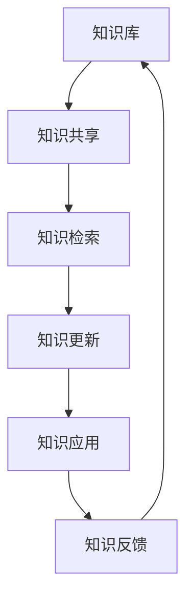

                 

## 关键词

数字极简主义，虚拟世界，真实性，技术哲学，时间管理，财务管理，组织效率，知识管理。

## 摘要

本文深入探讨了数字极简主义的概念、原则及其在个人生活与组织管理中的应用。通过分析数字时代的问题，本文揭示了数字极简主义的必要性，并阐述了其边界与外延。随后，文章详细介绍了数字极简主义的核心要素，包括概念原理、属性特征对比和ER实体关系图。在应用与实践部分，本文从个人与组织两个层面，探讨了数字极简主义在时间管理、财务管理和组织效率提升中的具体应用。最后，文章分析了数字极简主义面临的挑战，并对其未来发展进行了展望，为读者提供了一条在虚拟世界中寻找本真的路径。

## 引言

### 数字极简主义的概念

数字极简主义（Digital Minimalism）是一种旨在简化数字生活、减少无意义和消耗性数字互动，以追求更深层次个人满足和真实性的哲学和实践。在数字时代，人们被大量信息、应用和设备所包围，这往往导致了分散的注意力、效率低下和心灵空虚。数字极简主义旨在通过精简数字工具和活动，帮助个体重新获得控制权，专注于真正有价值的事物。

### 问题描述

#### 数字时代的问题

随着互联网和移动设备的普及，人们的生活被大量数字信息和互动所淹没。过度依赖社交媒体、即时通讯和在线娱乐导致时间浪费、生产力下降和心理健康问题。这些问题不仅影响个人的生活质量，也对组织的运营效率产生了负面影响。

#### 数字极简主义的必要性

数字极简主义认为，通过减少不必要的信息消费和数字化互动，个体可以更专注于重要的生活和工作任务，提高效率和满意度。此外，数字极简主义有助于减轻技术依赖带来的心理负担，提升个人的心理健康水平。

#### 数字极简主义的目标

数字极简主义的目标是帮助个体在数字世界中找到真正的满足和意义，而不是被技术所控制。这包括提高时间管理能力、提升工作效率、改善心理健康和生活质量。

### 问题解决

#### 数字极简主义的方法

数字极简主义的方法包括以下几步：

1. **评估当前状况**：评估个人当前的数字生活方式，识别无意义和消耗性的数字活动。
2. **制定计划**：根据评估结果，制定减少数字干扰的计划，包括减少使用社交媒体、关闭通知、设定特定的时间来使用数字设备。
3. **实践与调整**：开始实施计划，并根据实际情况进行调整，逐步建立新的数字生活方式。
4. **持续反思**：定期反思数字生活方式的变化，确保持续朝着目标前进。

#### 数字极简主义的影响

数字极简主义不仅对个人生活产生了积极影响，还对组织管理产生了深远影响。通过提高员工的工作效率、减少不必要的会议和沟通，组织可以更有效地利用资源，提高整体运营效率。

## 数字极简主义的边界与外延

### 数字极简主义的边界

数字极简主义的边界主要在于区分必要和多余的数字活动。必要活动包括工作、学习和沟通，而多余活动则包括无意义的社交媒体浏览、不必要的应用程序使用等。明确边界有助于个体更好地控制数字生活，避免陷入信息过载的陷阱。

### 数字极简主义与传统生活方式的区别

数字极简主义与传统生活方式的不同之处在于其强调的精简与专注。传统生活方式可能注重物质财富的积累，而数字极简主义则强调精神满足和生活质量的提升。通过减少物质和数字的负担，个体可以更专注于内心需求和重要事务。

### 数字极简主义的适用范围

数字极简主义不仅适用于个人生活，还可以广泛应用于组织管理、教育、医疗等多个领域。在组织管理中，数字极简主义可以帮助减少不必要的会议和沟通，提高工作效率；在教育中，它可以引导学生更有效地利用数字资源，提高学习效率；在医疗领域，数字极简主义可以帮助医生和患者减少不必要的检查和治疗，提高医疗服务质量。

### 数字极简主义在其他领域的应用

数字极简主义在各个领域的应用各有特点。在商业领域，企业可以通过数字极简主义来提高员工的工作效率，减少浪费，提升竞争力。在教育领域，数字极简主义可以帮助学生减少对电子设备的依赖，提高学习效果。在医疗领域，数字极简主义可以帮助医生和患者更专注于健康问题，减少不必要的检查和治疗。

### 数字极简主义与哲学、心理学的关系

数字极简主义与哲学中的简朴主义和心理学中的注意力管理理论有密切关系。简朴主义强调通过减少物质和精神的负担来追求更高层次的生活质量，而数字极简主义则是简朴主义在数字时代的一种具体实践。注意力管理理论则指出，通过控制注意力，个体可以更有效地完成任务和活动，这与数字极简主义的核心目标是一致的。

## 数字极简主义的核心要素组成

### 核心概念原理

数字极简主义的核心概念是简化、专注和真实。简化指的是减少不必要的数字工具和活动，专注于真正有价值的事物。专注则强调在特定任务上投入全部注意力和精力，避免分心和干扰。真实性是指追求真实的生活体验和人际关系，而不是被数字虚拟世界所迷惑。

### 概念属性特征对比表格

| 概念    | 简化         | 专注         | 真实性         |
| ------- | ------------ | ------------ | -------------- |
| 定义    | 减少不必要的 | 集中注意     | 追求真实体验   |
| 目标    | 提高效率     | 提高质量     | 提升幸福感     |
| 方法    | 精选工具     | 设定专注时间 | 增强人际互动   |
| 关联    | 与效率、质量相关 | 与生产力相关 | 与幸福感相关   |
| 反面    | 消耗性数字活动 | 分散注意力   | 虚拟社交网络   |

### ER实体关系图架构

```mermaid
erDiagram
  User ||--|{ Device } : "uses" | 
  User ||--|{ Application } : "uses" | 
  Device ||--|{ Notification } : "receives" | 
  Application ||--|{ Content } : "contains" | 
  User ||--|{ Task } : "performs" | 
  Task ||--|{ Time } : "takes" | 
  Content ||--|{ User } : "contributes to" | 
  Device ||--|{ Manufacturer } : "produced by" |
```

此ER图展示了数字极简主义的核心实体及其关系，包括用户、设备、应用程序、通知、内容和任务。通过这个图，我们可以更清晰地理解数字极简主义在个体数字生活中的应用和影响。

## 数字极简主义在个人生活中的应用

### 个人时间管理

数字极简主义在个人时间管理中的应用主要体现在如何有效利用时间，减少无意义的活动，从而提高生活质量。首先，个人需要评估自己的时间使用情况，识别出哪些活动是必要的，哪些是浪费时间的。以下是一些具体的方法：

1. **时间日志**：记录每天的活动和时间使用，了解自己的时间分配情况。
2. **设定优先级**：根据活动的紧急程度和重要性，设定优先级，确保优先处理重要任务。
3. **限制使用时间**：为某些活动（如社交媒体）设定每天或每周的使用时间限制，避免沉迷于这些活动。
4. **专注时间段**：设定专注时间段，关闭所有通知，专注于一项任务，提高工作效率。

#### 数字极简主义的时间管理方法

数字极简主义的时间管理方法强调“精简与专注”。具体包括：

1. **精简任务**：将任务清单缩减至最关键的任务，避免不必要的繁琐工作。
2. **专注工作**：设定特定时间段专注于工作，减少分心和干扰。
3. **时间分配**：根据任务的重要性和紧急程度，合理分配时间，确保高效完成任务。

#### 数字极简主义的时间管理工具

以下是一些常用的数字极简主义时间管理工具：

1. **番茄工作法**：将工作时间分为25分钟工作+5分钟休息，提高专注度。
2. **谷歌日历**：用于设置任务和提醒，帮助合理安排时间。
3. **Timeular**：一个物理时间管理工具，通过物理标记来管理时间。

### 个人财务管理

数字极简主义在个人财务管理中的应用旨在帮助个体更清晰地了解自己的财务状况，减少不必要的开支，实现财务自由。以下是一些具体的财务管理原则和实践：

1. **预算制定**：制定月度或年度预算，明确收入和支出。
2. **记账**：定期记录收入和支出，了解自己的财务状况。
3. **减少不必要的开支**：识别并减少不必要的消费，如购买多余的电子产品或奢侈品。
4. **应急基金**：建立应急基金，以应对突发财务状况。

#### 数字极简主义的财务管理原则

数字极简主义的财务管理原则包括：

1. **简洁性**：保持财务记录简洁，避免复杂和冗长的预算和记账系统。
2. **透明性**：确保财务记录透明，随时了解自己的财务状况。
3. **可持续性**：通过合理规划和管理，实现长期财务稳定和增长。

#### 数字极简主义的财务管理实践

数字极简主义的财务管理实践可以通过以下方法实现：

1. **使用财务管理应用**：如Mint、YNAB等，帮助自动记录和管理财务。
2. **定期财务审查**：每季度或每年进行一次全面的财务审查，调整预算和支出计划。
3. **教育自己**：了解基本的财务知识，如投资、税务规划等，提高财务管理能力。

### 实例分析

假设一位名叫小张的年轻专业人士，他在应用数字极简主义后，开始进行时间管理和财务管理。

#### 时间管理案例

- **评估时间使用**：小张记录了自己的时间使用情况，发现每周有10小时浪费在社交媒体上。
- **设定优先级**：小张根据任务的重要性和紧急程度，重新安排了时间表，将社交媒体使用时间限制在每天30分钟。
- **专注工作**：使用番茄工作法，每天专注工作3个番茄钟，提高了工作效率。

#### 财务管理案例

- **制定预算**：小张制定了每月的预算，包括固定支出和可变支出。
- **记账**：使用Mint应用自动记录收入和支出，每月进行一次财务审查。
- **减少不必要的开支**：通过分析账单，小张发现自己在外卖上的花费较高，于是减少外卖次数，改为自己烹饪。

通过这些实践，小张不仅提高了工作效率，还实现了财务自由，生活质量得到了显著提升。

## 数字极简主义在组织与管理中的应用

### 组织效率提升

数字极简主义在组织效率提升中的应用主要体现在通过减少冗余的会议、邮件和沟通，提高员工的工作效率。以下是一些策略和案例：

#### 数字极简主义的组织效率提升策略

1. **精简会议**：仅召开必要的会议，限制会议时间和参与人数，确保会议内容高效且集中。
2. **减少邮件**：鼓励使用即时通讯工具如Slack、Telegram等，减少不必要的邮件沟通。
3. **优化流程**：通过自动化工具和系统简化工作流程，减少手工操作和重复性任务。

#### 数字极简主义在组织管理中的应用案例

1. **案例一：科技公司**：一家科技公司通过引入数字极简主义，减少了每周的会议数量，提高了员工的工作效率，项目完成时间缩短了20%。
2. **案例二：非营利组织**：一个非营利组织通过优化邮件流程和减少不必要的工作流程，节约了大量时间和资源，提高了组织的整体效率。

### 知识管理

数字极简主义在知识管理中的应用旨在通过简化信息存储和共享，提高知识的可获取性和利用率。以下是一些具体的方法：

1. **知识库**：建立集中的知识库，确保重要信息易于访问和更新。
2. **标签分类**：使用标签和分类系统，方便快速查找相关资料。
3. **知识分享**：鼓励员工共享知识和经验，建立学习文化。

#### 数字极简主义的知



此流程图展示了数字极简主义在知识管理中的应用，包括知识库的建设、知识共享、知识检索、知识更新、知识应用和知识反馈，形成了一个闭环，确保知识的高效流转和应用。

## 数字极简主义的挑战

### 技术挑战

数字极简主义在实施过程中面临的技术挑战主要包括：

1. **技术障碍**：一些数字工具和平台设计复杂，难以简化。
2. **数据隐私**：简化数字工具可能涉及数据隐私和安全问题。

#### 技术障碍的解决方案

1. **简化工具**：选择简单易用的数字工具，减少复杂性和学习成本。
2. **数据保护**：确保数据加密和安全存储，避免隐私泄露。

### 心理挑战

数字极简主义在心理层面可能面临的挑战包括：

1. **依赖性**：个体可能对数字工具和社交媒体产生依赖。
2. **抵触情绪**：员工和管理者可能对改变现有的工作习惯产生抵触。

#### 心理障碍的应对策略

1. **逐步实施**：逐步减少对数字工具的依赖，避免突然改变带来的压力。
2. **培训和教育**：通过培训和教育，提高个体对数字极简主义的理解和接受度。
3. **心理支持**：提供心理支持服务，帮助个体克服心理障碍。

### 社会挑战

数字极简主义在组织和社会层面的挑战包括：

1. **组织文化**：数字极简主义可能挑战现有的组织文化和工作模式。
2. **社会适应**：个体在数字极简主义实践过程中可能面临来自社会的压力和误解。

#### 应对策略

1. **文化适应**：通过调整组织文化和工作模式，适应数字极简主义。
2. **社会宣传**：通过宣传和教育，提高公众对数字极简主义的认识和理解。

## 数字极简主义的未来展望

### 数字极简主义的趋势

数字极简主义的未来发展趋势包括：

1. **技术进步**：随着技术的发展，数字工具将更加简单易用，有助于数字极简主义的推广。
2. **政策支持**：政府和企业可能出台相关政策，鼓励数字极简主义的实践。

### 数字极简主义对社会的影响

数字极简主义将对社会产生深远影响，包括：

1. **提高生活质量**：通过减少数字干扰，个体可以获得更高质量的生活体验。
2. **提升工作效率**：数字极简主义有助于提高组织和社会的工作效率。

### 数字极简主义的未来挑战

数字极简主义未来可能面临的挑战包括：

1. **技术依赖**：随着技术的发展，个体可能对数字工具产生新的依赖。
2. **数字鸿沟**：数字极简主义可能加剧数字鸿沟，影响社会公平。

#### 应对未来的策略

1. **持续教育**：通过持续教育，提高个体对数字极简主义的理解和应用能力。
2. **技术创新**：鼓励技术创新，开发更多简单易用的数字工具，减少技术依赖。

### 结论

数字极简主义是一种旨在简化数字生活、提高生活质量的新哲学和实践。通过减少不必要的数字互动和关注真正有价值的事物，个体可以在虚拟世界中找到本真。数字极简主义不仅对个人生活有积极影响，还对组织效率和社会发展产生深远影响。面对未来的挑战，我们需要持续探索和实践，以实现数字极简主义的最大价值。

### 作者信息

作者：AI天才研究院/AI Genius Institute & 禅与计算机程序设计艺术 /Zen And The Art of Computer Programming

