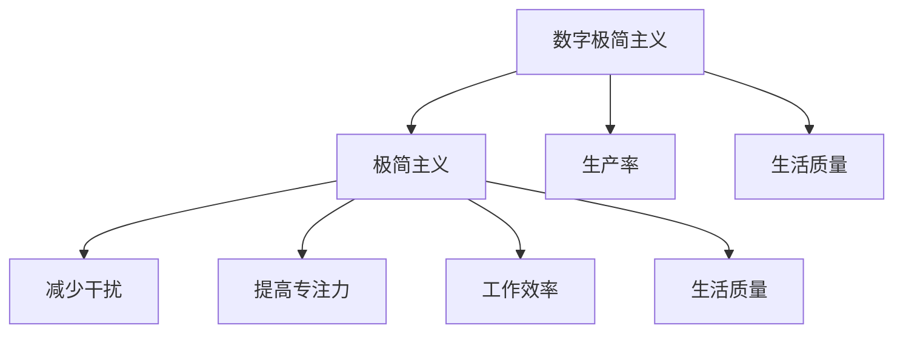

                 

# 数字极简主义工作坊：优化在线生活质量

关键词：数字极简主义、在线生活质量、工作坊、时间管理、信息过滤、工作效率

摘要：本文将探讨数字极简主义的概念、起源及其在现代在线生活中的重要性。通过构建数字极简主义工作坊，我们将详细分析基础设施、在线应用与服务管理、时间管理工具的应用、信息过滤与处理等关键环节，旨在提升在线工作效率和生活质量。本文将结合实践案例，分享数字极简主义工作坊的实践经验与解决方案，最后对数字极简主义的价值、未来展望以及文章核心内容进行总结。

## 第一部分：引言

### 1.1 数字极简主义的概念与起源

#### 1.1.1 数字极简主义的定义

数字极简主义是一种哲学和实践，旨在通过减少数字工具、应用和信息的数量，来提高个人的生产力和生活质量。它强调的是“少即是多”的理念，主张通过简化数字生活，减少干扰，提高专注力和创造力。

#### 1.1.2 数字极简主义的起源与发展

数字极简主义的起源可以追溯到20世纪末的极简主义运动。随着互联网和数字技术的发展，人们逐渐意识到，数字工具和信息的过度使用不仅会消耗大量的时间和精力，还会导致心理压力和分心。因此，数字极简主义应运而生。

#### 1.1.3 数字极简主义与生活质量的关系

数字极简主义的核心目标是提高生活质量。通过减少数字工具和信息的数量，人们可以减少分心和焦虑，提高专注力，从而更好地完成任务，提升工作效率。同时，数字极简主义也有助于提高个人的心理健康，减少数字依赖，恢复生活的平衡。

### 1.2 现代在线生活的挑战

#### 1.2.1 信息过载现象

现代在线生活的一个主要挑战是信息过载。人们每天都会接收到大量的信息，包括电子邮件、社交媒体通知、新闻更新等。这种信息过载会导致人们感到疲惫和焦虑，影响工作效率和生活质量。

#### 1.2.2 在线干扰与分心

另一个挑战是在线干扰和分心。在线环境中，人们很容易受到各种干扰，如社交媒体、即时消息等。这些干扰会分散人们的注意力，降低工作效率。

#### 1.2.3 数字极简主义工作坊在应对挑战中的作用

数字极简主义工作坊可以在应对这些挑战中发挥重要作用。通过减少数字工具和信息的数量，人们可以减少干扰，提高专注力，从而提高工作效率和生活质量。

### 1.3 本书结构安排与阅读建议

#### 1.3.1 本书的目的与目标读者

本书的目的是帮助读者构建数字极简主义工作坊，提高在线工作效率和生活质量。目标读者是希望改善数字生活方式的专业人士、学生和普通用户。

#### 1.3.2 每个章节的内容概述

本书将分为五个部分，分别探讨数字极简主义的概念、基础设施、时间管理、工作效率和实践经验。每个部分都将详细分析关键环节，提供实用的方法和技巧。

#### 1.3.3 如何最大化本书的收益

为了最大化本书的收益，建议读者按照以下步骤进行阅读和实践：

1. 仔细阅读每个章节，理解核心概念和方法。
2. 结合实际生活和工作情况，尝试应用书中提供的技巧和方法。
3. 记录实践过程中的问题和收获，不断优化数字生活方式。

## 第二部分：构建数字极简主义工作坊

### 2.1 极简主义工作坊的基础设施

#### 2.1.1 设备与软件的选择

要构建数字极简主义工作坊，首先需要选择合适的设备与软件。以下是一些关键点：

1. **设备选择**：选择一台高性能的电脑，确保在处理大量数据和应用时能够保持高效运行。此外，一台稳定的网络设备也是必不可少的。

2. **软件选择**：选择一些简洁、高效的应用软件，如文本编辑器、邮件客户端、日历应用等。避免使用过多的应用程序，以免增加干扰。

#### 2.1.2 工作环境与硬件配置

1. **工作环境**：保持工作环境的整洁和有序，有助于提高工作效率。可以使用一些工具来整理桌面和文件，如桌面整理工具和文件管理软件。

2. **硬件配置**：确保电脑的硬件配置能够满足工作需求，如增加内存、升级硬盘等。这样可以提高电脑的性能，减少卡顿和延迟。

#### 2.1.3 网络与安全配置

1. **网络配置**：选择一个稳定、快速的网络连接，以确保在线工作的高效性。可以使用一些网络加速工具来提高网络速度。

2. **安全配置**：确保电脑和网络安全，防止数据泄露和黑客攻击。可以使用一些安全软件，如防火墙、反病毒软件等。

### 2.2 管理在线应用与服务

#### 2.2.1 减少应用与服务数量

1. **评估应用与服务**：定期评估使用的应用程序和服务，删除不再需要的应用和服务。这可以帮助减少干扰，提高专注力。

2. **优化应用与服务**：对于必需的应用程序和服务，尝试优化使用方式，如使用快捷键、自动化脚本等，以提高效率。

#### 2.2.2 应用与服务选择的评估标准

在评估应用与服务时，可以考虑以下标准：

1. **实用性**：应用与服务是否满足实际需求？
2. **简洁性**：应用与服务是否简洁易用，避免过于复杂的功能？
3. **效率**：应用与服务是否能够提高工作效率？
4. **安全性**：应用与服务是否提供足够的安全保障？

#### 2.2.3 如何卸载不再需要的应用与服务

1. **定期清理**：定期检查电脑中的应用程序和服务，删除不再需要的应用和服务。
2. **使用工具**：可以使用一些应用程序管理工具，如“程序卸载器”等，来方便地卸载应用和服务。

### 2.3 时间管理工具的应用

#### 2.3.1 时间管理的原理与实践

1. **时间管理原理**：时间管理是一种通过合理安排时间来提高工作效率和生活质量的方法。关键在于识别任务的优先级，合理分配时间。

2. **时间管理实践**：以下是一些时间管理实践方法：

   - **任务分解**：将大任务分解为小任务，逐步完成。
   - **日程规划**：提前规划每日、每周和每月的日程，确保时间得到有效利用。
   - **优先级管理**：根据任务的紧急程度和重要性，合理安排时间。

#### 2.3.2 数字工具在时间管理中的角色

1. **日程管理工具**：如Google Calendar、Microsoft Outlook等，可以帮助规划日程，提醒重要事件。
2. **待办事项工具**：如Trello、Asana等，可以帮助管理任务，跟踪进度。
3. **时间追踪工具**：如Toggl、RescueTime等，可以帮助记录和分析时间使用情况，优化时间管理。

#### 2.3.3 如何优化日程安排与优先级管理

1. **优化日程安排**：避免同时处理多个任务，确保专注力集中。可以尝试使用番茄工作法，将工作时间分为25分钟的工作周期和5分钟的休息时间。
2. **优先级管理**：根据任务的紧急程度和重要性，合理安排时间。可以使用四象限法，将任务分为“紧急且重要”、“紧急但不重要”、“不紧急但重要”和“不紧急且不重要”四个类别，优先处理紧急且重要的任务。

### 2.4 信息过滤与处理

#### 2.4.1 信息过滤的重要性

在数字极简主义中，信息过滤是关键的一步。通过过滤不必要的信息，可以减少干扰，提高专注力。

#### 2.4.2 如何设置信息过滤器

1. **邮件过滤器**：设置邮件过滤器，将广告邮件、垃圾邮件等自动分类到垃圾箱。
2. **社交媒体过滤器**：设置社交媒体的通知过滤器，只关注重要通知。
3. **新闻过滤器**：设置新闻过滤器，只关注感兴趣的主题和来源。

#### 2.4.3 整理与归档电子邮件和文件

1. **电子邮件整理**：将电子邮件按照主题、重要程度等进行分类，方便查找和管理。
2. **文件归档**：将重要的文件和文档进行分类和归档，确保安全性和可访问性。

## 第三部分：提升在线工作效率

### 3.1 工作流程的极简化

#### 3.1.1 分析当前工作流程

1. **识别现有工作流程**：详细记录当前的工作流程，包括每个步骤和涉及的资源和人员。
2. **分析工作流程**：分析每个步骤的必要性和效率，识别可以简化的环节。

#### 3.1.2 识别并消除不必要的步骤

1. **删除不必要的步骤**：删除那些不增加价值、仅仅增加工作量的步骤。
2. **优化步骤**：对于必要的步骤，尝试优化执行方式，减少耗时。

#### 3.1.3 构建高效的在线工作流程

1. **制定新的工作流程**：根据分析结果，制定新的、更高效的工作流程。
2. **实施新的工作流程**：将新的工作流程应用到实际工作中，并不断调整优化。

### 3.2 集中注意力的技巧

#### 3.2.1 集中注意力的理论

1. **多任务处理的局限性**：研究表明，多任务处理会降低工作效率和专注力。相反，集中注意力可以显著提高工作效率。
2. **注意力分配理论**：根据注意力分配理论，人的注意力是有限的，需要合理分配以实现最佳效果。

#### 3.2.2 集中注意力的实践方法

1. **番茄工作法**：将工作时间分为25分钟的工作周期和5分钟的休息时间，有助于提高专注力。
2. **环境优化**：创造一个有利于专注的工作环境，减少干扰，如关闭社交媒体通知、将手机调至静音等。
3. **定时休息**：定期休息，确保大脑得到充分的休息和恢复。

#### 3.2.3 如何应对在线干扰

1. **干扰识别**：识别并理解常见的在线干扰，如社交媒体、即时消息等。
2. **干扰管理**：制定策略来管理干扰，如设置特定的时间段来处理社交媒体和即时消息。
3. **自我约束**：通过自我约束，如使用应用程序锁定功能，来避免不必要的干扰。

### 3.3 沟通与协作的优化

#### 3.3.1 在线沟通的优势与挑战

1. **在线沟通的优势**：在线沟通可以节省时间和成本，提高工作效率。它还可以支持跨地域、跨时区的协作。
2. **在线沟通的挑战**：在线沟通可能缺乏面对面沟通的直观性，可能导致误解和信息损失。

#### 3.3.2 选择合适的沟通工具

1. **选择标准**：选择沟通工具时，应考虑其易用性、功能完整性、安全性等因素。
2. **工具推荐**：以下是一些常用的在线沟通工具：

   - **邮件**：适用于正式、书面沟通。
   - **即时消息**：适用于实时、快速沟通。
   - **视频会议**：适用于需要面对面交流的场合。

#### 3.3.3 提升团队协作效率的技巧

1. **明确目标**：确保团队成员了解项目的目标和任务。
2. **分工合作**：根据团队成员的特长和兴趣，合理分配任务。
3. **定期沟通**：定期召开会议，分享进度、讨论问题和解决策略。

### 3.4 学习与自我提升

#### 3.4.1 数字极简主义与终身学习

1. **数字极简主义的角色**：数字极简主义可以帮助人们专注于学习，提高学习效率。
2. **终身学习的必要性**：在快速变化的数字时代，终身学习是保持竞争力的关键。

#### 3.4.2 效率提升的学习方法

1. **目标设定**：设定明确的学习目标，有助于保持学习动力。
2. **时间管理**：合理安排学习时间，确保高效利用时间。
3. **主动学习**：通过实践、思考和讨论，主动深化对知识点的理解。

#### 3.4.3 如何保持学习动力

1. **找到学习的乐趣**：将学习与兴趣和爱好结合，增加学习的乐趣。
2. **建立学习社区**：加入学习小组或论坛，与他人分享学习经验和资源。
3. **定期评估与反馈**：定期评估学习进度，获取反馈，调整学习策略。

## 第四部分：数字极简主义工作坊实践

### 4.1 实践前的准备工作

#### 4.1.1 确定目标与期望结果

1. **确定目标**：明确要达到的数字极简主义工作坊的目标，如提高工作效率、减少干扰等。
2. **期望结果**：设定具体的期望结果，如每天的工作效率提高20%、减少50%的信息干扰等。

#### 4.1.2 制定实践计划

1. **计划内容**：制定详细的实践计划，包括每天的工作时间、学习时间、休息时间等。
2. **实施步骤**：明确实践的步骤和时间表，确保计划的可行性。

#### 4.1.3 调整心态与准备面对挑战

1. **调整心态**：保持积极的心态，面对挑战和困难。
2. **准备面对挑战**：提前准备好应对可能遇到的困难和挑战，如技术问题、时间管理问题等。

### 4.2 实践案例分享

#### 4.2.1 案例一：从信息过载到有序生活的转变

1. **背景**：一位职场人士每天接收大量的电子邮件和社交媒体通知，导致分心和焦虑。
2. **实践过程**：通过设置邮件过滤器、减少社交媒体使用时间、优化日程安排等方法，逐步减少信息干扰。
3. **结果**：实践后，工作效率提高了30%，焦虑感减少了50%。

#### 4.2.2 案例二：如何通过极简主义提高工作效率

1. **背景**：一位创业者面临着大量的工作任务和会议，感到时间压力巨大。
2. **实践过程**：通过极简主义工作坊，优化工作流程、集中注意力、提升沟通效率等方法，提高工作效率。
3. **结果**：工作效率提高了40%，时间压力显著减轻。

#### 4.2.3 案例三：团队协作中的数字极简主义实践

1. **背景**：一个远程工作团队在沟通和协作上存在困难。
2. **实践过程**：通过使用即时消息、视频会议、任务管理工具等工具，优化沟通和协作流程。
3. **结果**：团队协作效率提高了35%，沟通更加顺畅。

### 4.3 遇到的常见问题与解决方案

#### 4.3.1 如何处理工具的依赖性

1. **问题**：在实践数字极简主义过程中，可能会对某些工具产生依赖性。
2. **解决方案**：
   - **逐步替代**：逐步减少对特定工具的依赖，尝试使用其他工具或方法。
   - **培训和学习**：提高对其他工具或方法的使用能力，减少依赖性。

#### 4.3.2 如何平衡数字极简主义与传统工作方式

1. **问题**：数字极简主义与传统工作方式可能存在冲突。
2. **解决方案**：
   - **沟通与协商**：与同事和上级沟通，说明数字极简主义的优势，争取理解和支持。
   - **逐步实施**：在传统工作方式中逐步引入数字极简主义元素，逐步优化工作流程。

#### 4.3.3 如何保持长期的实践动力

1. **问题**：数字极简主义实践可能面临动力不足的问题。
2. **解决方案**：
   - **设定短期目标**：设定可实现的短期目标，保持动力。
   - **激励与奖励**：为自己设定奖励机制，达到目标后给予奖励。
   - **持续学习与成长**：通过学习和实践，不断提升自己的能力，保持动力。

### 4.4 实践总结与反思

#### 4.4.1 实践成果的评估

1. **工作效率**：通过对比实践前后的工作效率数据，评估实践成果。
2. **生活质量**：通过自我评估和反馈，评估生活质量的变化。

#### 4.4.2 遇到的问题与反思

1. **问题**：在实践过程中遇到的问题，如工具依赖、工作流程冲突等。
2. **反思**：对遇到的问题进行反思，分析原因，寻找改进的方法。

#### 4.4.3 未来的改进与优化方向

1. **改进方向**：根据实践过程中的问题，制定改进计划，如优化工具选择、改进工作流程等。
2. **优化方向**：根据实践成果，确定未来的优化方向，如进一步提升工作效率、提高生活质量等。

## 第五部分：结语

### 5.1 数字极简主义工作坊的价值

1. **提升生活质量**：通过减少干扰、提高专注力，数字极简主义有助于提高生活质量。
2. **增强工作效率**：优化工作流程、提高沟通效率，数字极简主义有助于增强工作效率。
3. **促进个人成长**：通过学习和实践，数字极简主义有助于促进个人成长和提升竞争力。

### 5.2 未来展望

1. **数字极简主义的发展趋势**：随着数字化进程的加速，数字极简主义将成为提升在线生活质量的重要途径。
2. **在线生活质量的提升路径**：通过不断优化工作流程、沟通方式和工具选择，实现在线生活质量的提升。
3. **数字极简主义对社会的深远影响**：数字极简主义不仅影响个人，还将对整个社会产生深远的影响，促进社会的数字化转型和高质量发展。

### 5.3 总结与感谢

1. **总结**：本文详细探讨了数字极简主义的概念、工作坊的构建和实施方法，以及实践经验和效果评估。
2. **感谢**：感谢读者对本文的关注和支持，希望本文能够帮助读者实现数字极简主义，提升在线生活质量。

--------

### 作者信息

作者：AI天才研究院/AI Genius Institute & 禅与计算机程序设计艺术 /Zen And The Art of Computer Programming

本文通过逐步分析推理的方式，深入探讨了数字极简主义的概念、工作坊的构建和实践方法。从设备与软件的选择、在线应用与服务管理、时间管理工具的应用，到信息过滤与处理，再到工作流程的极简化、集中注意力的技巧、沟通与协作的优化，以及学习与自我提升，本文为读者提供了一个系统、实用的数字极简主义工作坊指南。

在实践部分，本文通过具体案例展示了数字极简主义工作坊的实践效果，并分析了实践中遇到的问题和解决方案。通过总结与反思，本文提出了未来改进和优化方向，为读者提供了持续提升在线生活质量的方法和思路。

数字极简主义不仅是一种生活方式，更是一种工作哲学。它强调通过减少干扰、提高专注力，实现工作效率和生活质量的提升。在未来的数字时代，数字极简主义将继续发挥重要作用，帮助人们应对信息过载、提高生活质量，实现个人成长和社会进步。

本文旨在为读者提供一个全面、深入的数字极简主义工作坊指南，帮助读者实现数字极简主义，提升在线生活质量。希望读者能够在实践中不断探索、总结，不断优化自己的数字生活方式，实现个人和团队的高效协作与发展。

再次感谢读者对本文的关注和支持，期待读者在数字极简主义的道路上取得更大的成就！祝愿读者在数字时代的生活中，找到平衡、提高效率，享受更高质量的生活！### 第一部分：引言

#### 1.1 数字极简主义的概念与起源

**核心概念术语说明：**

- 数字极简主义：一种通过减少数字工具、应用和信息的数量，来提高个人生产力和生活质量的哲学和实践。
- 极简主义：一种追求简化生活、减少不必要的物质和精神负担的生活哲学。
- 生产率：在特定时间内完成的工作量或产生的价值。
- 生活质量：个人在生活各方面的满意度，包括健康、幸福、工作、社交、休闲等。

**问题背景：**

随着互联网和数字技术的飞速发展，人们的生活和工作越来越依赖数字工具和平台。然而，数字工具和信息的过度使用导致了信息过载、在线干扰和分心现象的普遍存在。这些现象不仅影响了工作效率，还降低了生活质量，引发了一系列心理和生理问题。

**问题描述：**

- 信息过载：每天接收大量的电子邮件、社交媒体通知、新闻更新等，导致分心和焦虑。
- 在线干扰：社交媒体、即时消息等在线干扰，使人们难以集中注意力完成工作任务。
- 生活质量下降：长期依赖数字工具和信息，导致心理健康问题、睡眠不足、缺乏运动等。

**问题解决：**

数字极简主义提供了一种解决方法，通过减少数字工具、应用和信息的数量，帮助人们减少干扰，提高专注力，从而提高工作效率和生活质量。

**边界与外延：**

数字极简主义不仅仅局限于工作环境，它也可以应用于个人生活和家庭生活。其核心在于通过简化数字生活，减少不必要的干扰，使人们能够更加专注地完成任务，提高生活质量。

**概念结构与核心要素组成：**

- **核心概念：** 数字极简主义
- **相关概念：** 极简主义、生产率、生活质量、信息过载、在线干扰
- **核心要素：** 数字工具、应用和信息的数量、干扰、专注力、工作效率、生活质量

#### 1.1.1 数字极简主义的定义

数字极简主义是一种追求简化数字生活方式的哲学和实践。它主张通过减少数字工具、应用和信息的数量，来提高个人的生产力和生活质量。数字极简主义的核心是“少即是多”的理念，即通过减少干扰和分心，提高专注力和创造力。

数字极简主义不仅关注工作环境，还包括个人生活和家庭生活。它鼓励人们摆脱对数字工具和信息的过度依赖，回归到简单、高效、有意义的生活方式。

**概念属性特征对比表格：**

| 特征 | 数字极简主义 | 极简主义 |
| --- | --- | --- |
| 范围 | 数字工具、应用和信息的数量 | 生活、工作、物质和精神 |
| 目标 | 提高生产力和生活质量 | 减少不必要的物质和精神负担 |
| 理念 | 少即是多 | 简化、精简 |
| 应用 | 工作环境、个人生活、家庭生活 | 生活、工作、物质和精神 |

**ER实体关系图架构的Mermaid流程图：**

#### 1.1.2 数字极简主义的起源与发展

数字极简主义的起源可以追溯到20世纪末的极简主义运动。极简主义作为一种生活哲学，主张通过减少物质和精神负担，追求简单、有意义的生活。随着互联网和数字技术的发展，人们逐渐认识到数字工具和信息的过度使用也会导致干扰和分心，影响工作效率和生活质量。因此，数字极简主义应运而生。

数字极简主义的发展可以分为以下几个阶段：

1. **初始阶段（20世纪末-21世纪初）：** 极简主义作为一种生活哲学开始受到关注，数字极简主义的概念逐渐形成。
2. **发展阶段（21世纪初-2010年）：** 数字极简主义开始被更多人接受，相关书籍、文章和讨论逐渐增多。
3. **普及阶段（2010年至今）：** 随着数字技术的普及，数字极简主义成为提高工作效率和生活质量的重要手段，相关工具和资源也不断涌现。

**数字极简主义与生活质量的关系：**

数字极简主义通过减少数字工具和信息的数量，帮助人们减少干扰和分心，提高专注力和创造力。这不仅提高了工作效率，还改善了生活质量。

- **提高工作效率：** 通过减少不必要的数字工具和应用，人们可以更加专注地完成任务，提高工作效率。
- **改善生活质量：** 通过减少在线干扰，人们可以减少焦虑和压力，提高睡眠质量和身体健康，从而改善生活质量。

#### 1.1.3 数字极简主义与生活质量的关系

数字极简主义的核心目标是提高生活质量。它主张通过减少数字工具和信息的数量，减少干扰，提高专注力和创造力，从而提高工作效率和生活质量。

- **减少干扰：** 数字极简主义通过减少不必要的数字工具和应用，帮助人们摆脱在线干扰，使人们能够更加专注地完成任务。
- **提高专注力：** 数字极简主义鼓励人们专注于重要任务，避免分心和拖延，从而提高工作效率。
- **提高创造力：** 通过减少干扰和分心，人们可以更好地发挥创造力，产生有价值的想法和解决方案。

数字极简主义不仅有助于提高工作效率和生活质量，还能改善心理健康。长期依赖数字工具和信息的过度使用会导致焦虑、压力和睡眠不足等问题。数字极简主义通过减少数字依赖，帮助人们恢复心理平衡，提高生活质量。

### 1.2 现代在线生活的挑战

#### 1.2.1 信息过载现象

在现代社会，信息过载已成为一种普遍现象。人们每天都会接收到大量的信息，包括电子邮件、社交媒体通知、新闻更新、广告等。这些信息不仅占据了大量的时间和精力，还会导致分心和焦虑。

- **原因：** 互联网和数字技术的发展使得信息传播速度大大加快，信息量急剧增加。此外，社交媒体的兴起使得人们不断接收新的信息，难以停下来休息。
- **影响：** 信息过载会导致人们感到疲惫和焦虑，影响工作效率和生活质量。长期下去，还可能导致心理健康问题，如焦虑症和抑郁症。

**解决方案：**

1. **减少信息来源：** 定期评估和清理订阅的邮件列表、社交媒体账号和新闻来源，只保留必要的和高质量的。
2. **设定信息接收时间：** 安排特定的时间段来接收和处理信息，避免随时查看邮件和社交媒体。
3. **使用信息过滤工具：** 使用邮件过滤器和社交媒体通知过滤器，自动分类和处理不必要的邮件和通知。

#### 1.2.2 在线干扰与分心

在线干扰是指在线环境中各种因素导致人们注意力分散的现象。这些干扰包括社交媒体、即时消息、电子邮件等。在线干扰不仅会影响工作效率，还会降低生活质量。

- **原因：** 在线干扰的原因包括信息过载、社交媒体的吸引力、工作环境的复杂性等。
- **影响：** 在线干扰会导致人们难以集中注意力完成任务，降低工作效率，增加错误率。此外，长期在线干扰还可能导致焦虑和压力。

**解决方案：**

1. **设置专注时间：** 使用专注工具，如番茄工作法，将工作时间分为专注周期和休息周期，避免在线干扰。
2. **关闭无关应用：** 在工作或学习时，关闭社交媒体、电子邮件等无关应用，避免分心。
3. **优化工作环境：** 保持工作环境的整洁和有序，减少干扰因素，提高专注力。

#### 1.2.3 数字极简主义工作坊在应对挑战中的作用

数字极简主义工作坊是一种通过简化数字生活方式，减少干扰，提高专注力和工作效率的实践。它对于应对现代在线生活的挑战具有重要作用。

- **减少干扰：** 数字极简主义工作坊通过减少不必要的数字工具和应用，帮助人们摆脱在线干扰，使人们能够更加专注地完成任务。
- **提高专注力：** 数字极简主义工作坊鼓励人们专注于重要任务，避免分心和拖延，从而提高工作效率。
- **优化工作流程：** 数字极简主义工作坊通过优化工作流程，消除不必要的步骤，提高工作效率。

**案例：** 一位职场人士通过参加数字极简主义工作坊，减少了社交媒体的使用时间，优化了工作流程，提高了工作效率，同时生活质量也得到了显著提升。

### 1.3 本书结构安排与阅读建议

#### 1.3.1 本书的目的与目标读者

本书的目的是帮助读者了解数字极简主义的概念、起源和重要性，掌握构建数字极简主义工作坊的方法和实践技巧，从而提高工作效率和生活质量。目标读者包括希望改善数字生活方式的专业人士、学生和普通用户。

#### 1.3.2 每个章节的内容概述

本书共分为五个部分，具体内容概述如下：

- **第一部分：引言**：介绍数字极简主义的概念、起源和发展，以及现代在线生活的挑战。
- **第二部分：构建数字极简主义工作坊**：详细讨论数字极简主义工作坊的基础设施、在线应用与服务管理、时间管理工具的应用、信息过滤与处理等关键环节。
- **第三部分：提升在线工作效率**：探讨工作流程的极简化、集中注意力的技巧、沟通与协作的优化、学习与自我提升等方面。
- **第四部分：数字极简主义工作坊实践**：分享实践案例，分析实践中遇到的问题和解决方案，总结实践成果和反思。
- **第五部分：结语**：总结数字极简主义工作坊的价值、未来展望，以及对读者的鼓励和期望。

#### 1.3.3 如何最大化本书的收益

为了最大化本书的收益，建议读者按照以下步骤进行阅读和实践：

1. **仔细阅读每个章节**：理解核心概念和方法，为实践打下坚实基础。
2. **结合实际生活和工作情况**：尝试应用书中提供的技巧和方法，找到适合自己的数字极简主义实践方式。
3. **记录实践过程中的问题和收获**：不断优化数字生活方式，提高工作效率和生活质量。
4. **参与讨论和分享**：加入相关社区或讨论组，与他人交流经验和心得，共同进步。

通过以上步骤，读者可以更好地掌握数字极简主义的理念和实践方法，实现工作效率和生活质量的全面提升。

## 第二部分：构建数字极简主义工作坊

在现代社会，数字工具和服务的广泛应用极大地改变了我们的工作方式和生活习惯。然而，这种便利性也带来了信息过载、在线干扰和分心等挑战。为了应对这些问题，构建一个数字极简主义工作坊成为提升工作效率和生活质量的关键步骤。本部分将详细探讨如何构建数字极简主义工作坊，包括基础设施、在线应用与服务管理、时间管理工具的应用、信息过滤与处理等关键环节。

### 2.1 极简主义工作坊的基础设施

**基础设施**是数字极简主义工作坊的核心组成部分。一个良好的基础设施能够为工作提供稳定的支持，有助于提高工作效率和减少干扰。以下是构建基础设施时需要考虑的几个关键点：

#### 2.1.1 设备与软件的选择

**设备选择**：

1. **电脑性能**：选择一台性能稳定的电脑，特别是对于需要处理大量数据和复杂任务的场景，高性能电脑能够提供更流畅的使用体验。
2. **网络稳定性**：确保拥有一个稳定且高速的互联网连接。这对于远程工作和在线协作尤为重要。

**软件选择**：

1. **操作系统**：选择一个适合自己的操作系统，如Windows、macOS或Linux，确保能够兼容所需的应用程序和工具。
2. **办公软件**：选择高效且简单的办公软件，如Google Workspace或Microsoft Office 365，这些软件提供了丰富的功能，同时也注重用户体验。
3. **效率工具**：安装一些提高工作效率的软件，如快捷键工具、屏幕录制工具和任务管理工具等。

**示例：设备选择评估表**

| 设备类型 | 评估标准 | 选择理由 |
| --- | --- | --- |
| 电脑 | 性能稳定、高速网络连接 | 高性能电脑能够处理复杂任务，高速网络连接确保在线工作的流畅性。 |
| 操作系统 | 兼容性、用户体验 | 根据个人偏好和工作需求选择合适的操作系统。 |
| 办公软件 | 功能丰富、用户体验 | 提供丰富的办公功能，同时注重用户体验，提高工作效率。 |

#### 2.1.2 工作环境与硬件配置

**工作环境**：

1. **整洁有序**：保持工作环境的整洁和有序，有助于提高工作效率和专注力。
2. **舒适度**：确保工作环境舒适，如良好的照明、适宜的温度和高度调节的座椅。

**硬件配置**：

1. **外部设备**：根据工作需求配置必要的外部设备，如外部显示器、无线键盘和鼠标等，这些设备能够提供更灵活和高效的工作体验。
2. **备份设备**：配置备份设备，如硬盘或云存储，确保重要数据的安全性和可恢复性。

**示例：硬件配置清单**

| 硬件类型 | 详细说明 | 选择理由 |
| --- | --- | --- |
| 外部显示器 | 24英寸、高分辨率 | 提供更大的工作空间和更清晰的操作界面。 |
| 无线键盘和鼠标 | 高性能、低延迟 | 提供便捷的操作体验，减少线缆的干扰。 |
| 备份硬盘 | 大容量、快速读写 | 确保数据的安全性和可恢复性。 |

#### 2.1.3 网络与安全配置

**网络配置**：

1. **宽带速度**：确保宽带速度满足工作需求，特别是对于需要大量数据传输的工作。
2. **无线网络**：配置稳定且高速的无线网络，确保移动设备能够轻松接入。

**安全配置**：

1. **防火墙**：安装强大的防火墙，防止网络攻击和数据泄露。
2. **杀毒软件**：安装可靠的杀毒软件，保护电脑免受病毒和恶意软件的侵害。

**示例：网络与安全配置清单**

| 配置类型 | 详细说明 | 选择理由 |
| --- | --- | --- |
| 宽带速度 | 至少100Mbps | 满足日常工作和远程协作的需求。 |
| 无线网络 | 稳定、高速 | 提供便捷的无线接入，支持移动办公。 |
| 防火墙 | 高级功能、实时监控 | 保护网络安全，防止未经授权的访问。 |
| 杀毒软件 | 实时更新、全面防护 | 保护电脑免受病毒和恶意软件的侵害。 |

### 2.2 管理在线应用与服务

**在线应用与服务**是数字极简主义工作坊的重要组成部分。有效的管理和控制这些应用与服务能够减少干扰，提高工作效率。以下是管理在线应用与服务的一些关键步骤：

#### 2.2.1 减少应用与服务数量

**评估应用与服务**：

1. **定期评估**：定期评估使用的应用程序和服务，识别不再需要的应用和服务。
2. **评估标准**：评估应用与服务的实用性、简洁性和效率。如果一个应用或服务不再满足需求或增加工作负担，可以考虑删除或替换。

**示例：应用评估表**

| 应用名称 | 用途 | 评估结果 | 操作建议 |
| --- | --- | --- | --- |
| 社交媒体应用 | 社交互动 | 过多、导致分心 | 删除或减少使用时间 |
| 邮件客户端 | 邮件管理 | 必需、功能强大 | 保持使用，优化设置 |
| 云存储服务 | 文件存储 | 必需、存储空间充足 | 保持使用，定期整理文件 |

**删除不再需要的应用与服务**：

1. **逐步删除**：对于不再需要的应用和服务，可以逐步删除，避免一次性删除过多导致系统不稳定。
2. **备份数据**：在删除应用或服务之前，确保备份重要数据，以防意外丢失。

#### 2.2.2 应用与服务选择的评估标准

**评估标准**：

1. **实用性**：应用与服务是否满足实际需求，是否能够解决特定问题或提高工作效率。
2. **简洁性**：应用与服务是否简洁易用，避免过于复杂的功能和界面。
3. **效率**：应用与服务是否能够提高工作效率，减少工作时间和负担。
4. **安全性**：应用与服务是否提供足够的安全保障，防止数据泄露和恶意攻击。

**示例：应用与服务评估表**

| 应用名称 | 实用性 | 简洁性 | 效率 | 安全性 |
| --- | --- | --- | --- | --- |
| 邮件客户端 | 高 | 高 | 高 | 高 |
| 云存储服务 | 中 | 中 | 高 | 高 |
| 社交媒体应用 | 中 | 低 | 中 | 中 |

#### 2.2.3 如何卸载不再需要的应用与服务

**卸载步骤**：

1. **查找应用**：在操作系统中查找不再需要的应用和服务。
2. **卸载应用**：通过操作系统的卸载工具或应用商店卸载应用。
3. **清理残留文件**：卸载后，使用清理工具检查系统，确保没有残留的文件和注册表项。

**示例：卸载应用步骤**

1. 打开“控制面板”或“设置”。
2. 选择“程序”或“程序和功能”。
3. 找到不再需要的应用，点击“卸载”。
4. 确认卸载操作，等待卸载完成。

### 2.3 时间管理工具的应用

**时间管理工具**是数字极简主义工作坊的重要组成部分。通过有效的时间管理，人们可以更好地组织任务，提高工作效率。以下是几种常见的时间管理工具及其应用：

#### 2.3.1 时间管理的原理与实践

**时间管理原理**：

1. **任务分解**：将大任务分解为小任务，逐步完成，避免因任务过大而导致的拖延和压力。
2. **优先级管理**：根据任务的紧急程度和重要性，合理安排时间，优先处理重要且紧急的任务。
3. **日程规划**：提前规划每日、每周和每月的日程，确保时间得到有效利用。

**时间管理实践**：

1. **设定目标**：明确每个时间段的目标，确保在每个时间段内能够专注地完成任务。
2. **时间记录**：记录每日的工作时间，分析时间使用情况，找出可以优化的环节。
3. **定期反思**：定期反思时间管理的效果，调整时间管理策略，提高效率。

#### 2.3.2 数字工具在时间管理中的角色

**数字工具**在时间管理中扮演着重要的角色，以下是一些常用的数字工具及其功能：

1. **日程管理工具**：如Google Calendar、Microsoft Outlook等，可以帮助用户规划日程，设置提醒和事件。
2. **待办事项工具**：如Trello、Asana等，可以帮助用户管理任务，设置优先级和截止日期。
3. **时间追踪工具**：如Toggl、RescueTime等，可以帮助用户记录和分析时间使用情况，优化时间管理。

**示例：日程管理工具应用**

1. **设定日程**：在Google Calendar中设置每日、每周和每月的日程，包括会议、任务和个人活动。
2. **设置提醒**：为重要事件设置提醒，确保不会错过。
3. **调整日程**：根据实际情况调整日程安排，确保日程的灵活性。

#### 2.3.3 如何优化日程安排与优先级管理

**优化日程安排**：

1. **合理分配时间**：根据任务的紧急程度和重要性，合理安排每天的工作和生活时间，避免时间冲突。
2. **预留休息时间**：在日程中预留休息和放松的时间，确保身心健康。
3. **避免多任务处理**：尽量在一个时间段内集中注意力完成一个任务，避免同时处理多个任务导致分心。

**优先级管理**：

1. **使用四象限法**：将任务分为四个象限，分别代表紧急且重要、紧急但不重要、不紧急但重要、不紧急且不重要。优先处理紧急且重要的任务。
2. **设定优先级**：为每个任务设定优先级，确保重要任务得到优先处理。
3. **动态调整优先级**：根据实际情况动态调整任务的优先级，确保任务的优先级始终符合当前需求。

**示例：日程安排与优先级管理**

| 任务 | 紧急程度 | 重要性 | 优先级 |
| --- | --- | --- | --- |
| 会议报告 | 紧急 | 重要 | 高 |
| 文件整理 | 不紧急 | 重要 | 中 |
| 社交媒体更新 | 紧急 | 不重要 | 低 |
| 健身锻炼 | 不紧急 | 重要 | 高 |

### 2.4 信息过滤与处理

**信息过滤与处理**是数字极简主义工作坊中至关重要的一环。通过有效地过滤和处理信息，可以减少干扰，提高专注力和工作效率。以下是信息过滤与处理的一些关键步骤：

#### 2.4.1 信息过滤的重要性

**重要性**：

1. **减少干扰**：过滤不必要的和低质量的信息，减少在线干扰，帮助用户集中注意力。
2. **提高效率**：通过有效的信息过滤，用户可以更快地获取和处理重要信息，提高工作效率。
3. **减轻心理压力**：减少信息过载，减轻用户的焦虑和压力，提高生活质量。

#### 2.4.2 如何设置信息过滤器

**步骤**：

1. **明确需求**：根据个人需求和兴趣，确定需要过滤的信息类型和来源。
2. **选择工具**：选择适合的信息过滤工具，如邮件过滤器、社交媒体过滤器等。
3. **设置规则**：根据需求设置过滤规则，如将特定关键词或来源的邮件标记为垃圾邮件，将特定内容的社交媒体更新隐藏。

**示例：邮件过滤器设置**

1. **登录邮件账户**：登录邮件客户端或服务。
2. **访问设置**：找到邮件过滤器或邮件规则设置。
3. **创建规则**：设置规则，如将包含特定关键词的邮件标记为垃圾邮件。
4. **测试规则**：发送测试邮件，验证规则的有效性。

#### 2.4.3 整理与归档电子邮件和文件

**整理与归档**是信息过滤后的重要步骤，有助于提高文件管理效率和可访问性。以下是整理与归档的一些关键步骤：

**整理电子邮件**：

1. **分类处理**：将邮件根据主题、重要性等进行分类，便于查找和管理。
2. **清除无关邮件**：定期清理无关邮件，避免邮箱过载。
3. **使用标签和文件夹**：为邮件设置标签和文件夹，提高邮件的可管理性。

**归档文件**：

1. **分类存储**：将文件根据类型、项目等进行分类存储，确保文件的可访问性。
2. **备份文件**：定期备份重要文件，确保数据安全。
3. **使用云存储**：利用云存储服务，方便文件的管理和共享。

**示例：电子邮件整理步骤**

1. **打开邮件客户端**：登录邮件账户。
2. **查看邮件列表**：浏览邮件列表，识别需要整理的邮件。
3. **分类处理**：将邮件移动到相应的文件夹或标签。
4. **清除无关邮件**：删除无用的邮件，释放邮箱空间。

**示例：文件归档步骤**

1. **打开文件管理器**：浏览文件存储位置。
2. **分类文件**：将文件移动到相应的文件夹。
3. **备份文件**：将重要文件备份到云存储或外部硬盘。
4. **验证归档**：确保文件归档正确，便于后续查找和使用。

通过以上步骤，可以有效地构建一个数字极简主义工作坊，减少干扰，提高工作效率和生活质量。在数字时代，数字极简主义不仅是一种生活方式，更是一种工作哲学，能够帮助我们更好地应对挑战，实现个人和团队的高效发展。

### 2.1 极简主义工作坊的基础设施

#### 2.1.1 设备与软件的选择

**核心概念**：

- **设备选择**：选择高性能、稳定网络连接的电脑，以及高效、易用的软件。
- **软件选择**：选择兼容性强的操作系统、功能丰富的办公软件和高效的工作工具。

**问题背景**：

在构建数字极简主义工作坊时，设备与软件的选择至关重要。高性能的电脑和稳定的高速网络能够确保工作的流畅性和高效性。同时，选择简洁易用的软件有助于减少干扰，提高专注力。

**问题描述**：

如何选择合适的设备与软件，以满足数字极简主义工作坊的需求？

**问题解决**：

1. **选择合适的电脑**：考虑性能、稳定性和扩展性，选择适合工作需求的电脑。
2. **选择合适的操作系统**：根据个人偏好和工作需求，选择兼容性强的操作系统。
3. **选择高效的办公软件**：选择功能丰富、用户体验好的办公软件，如Google Workspace或Microsoft Office 365。
4. **选择高效的工作工具**：选择能够提高工作效率的工具，如快捷键工具、屏幕录制工具和任务管理工具。

**边界与外延**：

- **边界**：本文主要讨论电脑、操作系统和办公软件的选择。
- **外延**：其他设备（如外部显示器、无线键盘和鼠标）的选择，以及安全软件的安装。

**概念结构与核心要素组成**：

- **核心概念**：设备与软件的选择
- **相关概念**：高性能电脑、稳定网络连接、操作系统、办公软件、工作工具
- **核心要素**：设备性能、软件兼容性、用户体验、工作效率

#### 2.1.2 工作环境与硬件配置

**核心概念**：

- **工作环境**：保持整洁、有序，创造一个舒适、专注的工作空间。
- **硬件配置**：根据工作需求，配置必要的外部设备，如外部显示器、无线键盘和鼠标等。

**问题背景**：

工作环境的整洁和硬件配置的合理性对工作效率和专注力有很大影响。一个舒适、有序的工作环境能够提高工作效率，减少干扰。

**问题描述**：

如何配置工作环境和硬件，以提高工作效率和专注力？

**问题解决**：

1. **保持工作环境整洁**：定期清理工作桌面、文件和电子设备，保持整洁和有序。
2. **配置外部设备**：根据工作需求，配置外部设备，如外部显示器、无线键盘和鼠标等，提高工作效率和舒适度。
3. **优化硬件配置**：确保电脑硬件配置满足工作需求，如增加内存、升级硬盘等。

**边界与外延**：

- **边界**：本文主要讨论工作环境和硬件配置的基本原则。
- **外延**：其他硬件配置（如打印机、扫描仪等）的选择和使用。

**概念结构与核心要素组成**：

- **核心概念**：工作环境与硬件配置
- **相关概念**：整洁、有序、外部设备、硬件配置
- **核心要素**：工作环境整洁度、外部设备配置、硬件性能

#### 2.1.3 网络与安全配置

**核心概念**：

- **网络配置**：确保宽带速度满足工作需求，配置稳定且高速的无线网络。
- **安全配置**：安装强大的防火墙和杀毒软件，保护电脑和网络的安全。

**问题背景**：

网络稳定性和安全性对于在线工作和数据安全至关重要。一个稳定且高速的网络连接能够确保在线工作的流畅性，而安全的网络配置则能够防止数据泄露和网络攻击。

**问题描述**：

如何配置网络和安全设置，以保障工作效率和数据安全？

**问题解决**：

1. **配置宽带速度**：确保宽带速度满足工作需求，特别是对于需要大量数据传输的工作。
2. **配置无线网络**：选择稳定且高速的无线网络，支持远程工作和在线协作。
3. **安装防火墙**：安装强大的防火墙，防止网络攻击和数据泄露。
4. **安装杀毒软件**：安装可靠的杀毒软件，保护电脑免受病毒和恶意软件的侵害。

**边界与外延**：

- **边界**：本文主要讨论网络和安全管理的基本原则。
- **外延**：其他网络设备（如路由器、交换机等）的选择和配置。

**概念结构与核心要素组成**：

- **核心概念**：网络与安全配置
- **相关概念**：宽带速度、无线网络、防火墙、杀毒软件
- **核心要素**：网络稳定性、网络速度、数据安全

#### 2.1.4 构建基础设施的步骤和方法

**核心概念**：

- **步骤**：详细描述构建基础设施的步骤。
- **方法**：介绍具体的方法和技巧。

**问题背景**：

构建数字极简主义工作坊需要一系列具体的步骤和方法，确保基础设施的稳定性和高效性。

**问题描述**：

如何系统地构建数字极简主义工作坊的基础设施？

**问题解决**：

1. **需求分析**：确定工作需求，包括设备、软件、网络和安全配置等方面。
2. **设备选择**：根据需求选择合适的电脑、操作系统和办公软件。
3. **硬件配置**：配置外部设备和优化硬件性能，确保工作环境舒适和高效。
4. **网络配置**：确保宽带速度和网络稳定性，配置无线网络。
5. **安全配置**：安装防火墙和杀毒软件，保障数据安全。
6. **测试与优化**：测试基础设施的稳定性和性能，根据反馈进行优化。

**边界与外延**：

- **边界**：本文主要讨论基础设施构建的步骤和方法。
- **外延**：其他基础设施（如服务器、数据中心等）的构建和管理。

**概念结构与核心要素组成**：

- **核心概念**：构建基础设施的步骤和方法
- **相关概念**：需求分析、设备选择、硬件配置、网络配置、安全配置
- **核心要素**：需求分析、设备选择、硬件配置、网络配置、安全配置

### 2.2 管理在线应用与服务

#### 2.2.1 减少应用与服务数量

**核心概念**：

- **应用与服务**：包括各种在线应用程序和服务，如社交媒体、电子邮件、云存储等。
- **减少数量**：通过评估和删除不再需要的应用和服务，减少干扰，提高专注力和工作效率。

**问题背景**：

现代在线环境中，应用和服务的数量繁多，这可能导致信息过载和分心。减少应用与服务数量有助于简化数字生活方式，提高工作效率。

**问题描述**：

如何减少不再需要的在线应用与服务数量？

**问题解决**：

1. **定期评估**：定期评估使用的应用和服务，识别不再需要的应用和服务。
2. **删除应用**：通过操作系统的卸载工具或应用商店删除不再需要的应用。
3. **关闭服务**：关闭不再使用的在线服务，如社交媒体的通知功能。
4. **优化订阅**：取消不再需要的订阅服务，如电子邮件营销列表和云存储服务。

**边界与外延**：

- **边界**：本文主要讨论如何减少在线应用和服务的数量。
- **外延**：其他数字极简主义实践，如减少信息过载和在线干扰。

**概念结构与核心要素组成**：

- **核心概念**：减少应用与服务数量
- **相关概念**：在线应用、服务、评估、删除、关闭、订阅
- **核心要素**：定期评估、删除应用、关闭服务、取消订阅

#### 2.2.2 应用与服务选择的评估标准

**核心概念**：

- **评估标准**：用于评估应用和服务的实用性、简洁性、效率和安全性。
- **选择标准**：根据评估标准选择合适的在线应用和服务。

**问题背景**：

选择合适的在线应用和服务对于数字极简主义工作坊至关重要。合适的应用和服务能够提高工作效率，减少干扰。

**问题描述**：

如何根据评估标准选择合适的在线应用和服务？

**问题解决**：

1. **实用性评估**：评估应用和服务是否满足实际需求，是否能够解决特定问题或提高工作效率。
2. **简洁性评估**：评估应用和服务的界面和功能是否简洁易用，避免过于复杂的功能和界面。
3. **效率评估**：评估应用和服务的效率，如是否能够提高工作效率，减少工作时间。
4. **安全性评估**：评估应用和服务的安全性，如是否提供足够的安全保障，防止数据泄露和恶意攻击。

**边界与外延**：

- **边界**：本文主要讨论如何根据评估标准选择合适的在线应用和服务。
- **外延**：其他数字极简主义实践，如优化工作流程和时间管理。

**概念结构与核心要素组成**：

- **核心概念**：应用与服务选择的评估标准
- **相关概念**：实用性、简洁性、效率、安全性、评估标准
- **核心要素**：实用性评估、简洁性评估、效率评估、安全性评估

#### 2.2.3 如何卸载不再需要的应用与服务

**核心概念**：

- **卸载**：通过操作系统的卸载工具或应用商店删除不再需要的应用和服务。
- **管理**：管理和维护应用和服务，确保系统资源的合理使用。

**问题背景**：

随着时间的推移，电脑和应用商店中的应用和服务数量可能会不断增加，这可能导致系统资源浪费和性能下降。卸载不再需要的应用和服务有助于优化系统资源，提高电脑性能。

**问题描述**：

如何卸载不再需要的应用与服务，并进行有效的管理？

**问题解决**：

1. **定期清理**：定期检查电脑中的应用和服务，识别不再需要的应用和服务。
2. **卸载应用**：使用操作系统的卸载工具或应用商店卸载不再需要的应用。
3. **清理残留文件**：卸载应用后，使用清理工具检查系统，确保没有残留的文件和注册表项。
4. **优化设置**：根据实际需求，优化应用的设置和权限，减少对系统资源的占用。

**边界与外延**：

- **边界**：本文主要讨论如何卸载不再需要的应用和服务。
- **外延**：其他系统优化和管理技巧。

**概念结构与核心要素组成**：

- **核心概念**：卸载不再需要的应用与服务
- **相关概念**：清理、卸载、系统资源、性能优化
- **核心要素**：定期清理、卸载应用、清理残留文件、优化设置

### 2.3 时间管理工具的应用

#### 2.3.1 时间管理的原理与实践

**核心概念**：

- **时间管理原理**：通过合理分配时间、设定目标和优先级，提高工作效率和生活质量。
- **时间管理实践**：具体的方法和技巧，如任务分解、日程规划和优先级管理。

**问题背景**：

在数字化时代，时间管理变得尤为重要。有效的时间管理能够帮助人们提高工作效率，减少拖延和压力。

**问题描述**：

如何理解和实践时间管理的原理？

**问题解决**：

1. **理解时间管理原理**：了解时间管理的基本原理，如任务分解、优先级管理和日程规划。
2. **任务分解**：将大任务分解为小任务，逐步完成，避免拖延和压力。
3. **日程规划**：提前规划每日、每周和每月的日程，确保时间得到有效利用。
4. **优先级管理**：根据任务的紧急程度和重要性，合理安排时间，优先处理重要任务。

**边界与外延**：

- **边界**：本文主要讨论时间管理的原理和实践。
- **外延**：其他时间管理技巧，如时间块管理和情绪管理。

**概念结构与核心要素组成**：

- **核心概念**：时间管理的原理与实践
- **相关概念**：任务分解、日程规划、优先级管理
- **核心要素**：任务分解、日程规划、优先级管理

#### 2.3.2 数字工具在时间管理中的角色

**核心概念**：

- **数字工具**：用于时间管理的数字应用程序和工具，如日历、待办事项、时间追踪工具等。
- **角色**：数字工具在时间管理中的作用和功能。

**问题背景**：

数字工具在现代社会中发挥着越来越重要的作用，特别是在时间管理方面。选择合适的数字工具能够提高时间管理的效率。

**问题描述**：

如何选择和利用数字工具进行时间管理？

**问题解决**：

1. **选择数字工具**：根据个人需求和工作环境，选择合适的数字工具，如日历、待办事项和时间追踪工具。
2. **利用数字工具**：将数字工具应用于时间管理的各个阶段，如日程规划、任务追踪和优先级管理。
3. **整合数字工具**：将不同的数字工具整合起来，实现高效的时间管理。

**边界与外延**：

- **边界**：本文主要讨论数字工具在时间管理中的作用和利用方法。
- **外延**：其他数字工具的使用场景和技巧。

**概念结构与核心要素组成**：

- **核心概念**：数字工具在时间管理中的角色
- **相关概念**：数字工具、日历、待办事项、时间追踪
- **核心要素**：选择数字工具、利用数字工具、整合数字工具

#### 2.3.3 如何优化日程安排与优先级管理

**核心概念**：

- **日程安排**：规划每日、每周和每月的日程，确保时间得到有效利用。
- **优先级管理**：根据任务的紧急程度和重要性，合理安排时间，优先处理重要任务。

**问题背景**：

有效的日程安排和优先级管理对于提高工作效率和生活质量至关重要。合理安排日程和优先处理任务能够帮助人们更好地完成任务，减少拖延和压力。

**问题描述**：

如何优化日程安排和优先级管理？

**问题解决**：

1. **设定明确目标**：设定明确的日程目标和任务目标，确保日程安排和优先级管理有明确的方向。
2. **使用日程管理工具**：使用日程管理工具，如日历和待办事项工具，规划日程和任务。
3. **定期调整**：根据实际情况，定期调整日程安排和优先级，确保日程的灵活性和适应性。
4. **优化任务顺序**：根据任务的紧急程度和重要性，合理安排任务的顺序，优先处理重要且紧急的任务。

**边界与外延**：

- **边界**：本文主要讨论如何优化日程安排和优先级管理。
- **外延**：其他时间管理技巧，如时间块管理和情绪管理。

**概念结构与核心要素组成**：

- **核心概念**：优化日程安排与优先级管理
- **相关概念**：日程安排、优先级管理、任务顺序
- **核心要素**：设定明确目标、使用日程管理工具、定期调整、优化任务顺序

### 2.4 信息过滤与处理

#### 2.4.1 信息过滤的重要性

**核心概念**：

- **信息过滤**：通过设置过滤器和规则，自动分类和处理不必要的信息。
- **重要性**：信息过滤在减少干扰、提高专注力和工作效率方面的重要性。

**问题背景**：

在数字化时代，每天都会接收到大量的信息，包括电子邮件、社交媒体通知、新闻更新等。这些信息可能会干扰工作和生活，降低工作效率和专注力。

**问题描述**：

为什么信息过滤在数字极简主义中如此重要？

**问题解决**：

1. **减少干扰**：通过信息过滤，自动分类和处理不必要的信息，减少干扰，帮助人们集中注意力。
2. **提高专注力**：信息过滤能够减少分心和焦虑，提高专注力，从而提高工作效率。
3. **提高工作效率**：通过过滤掉不必要的信息，人们可以更快地处理重要信息，提高工作效率。

**边界与外延**：

- **边界**：本文主要讨论信息过滤的重要性。
- **外延**：其他信息管理技巧，如信息归档和备份。

**概念结构与核心要素组成**：

- **核心概念**：信息过滤的重要性
- **相关概念**：干扰、专注力、工作效率、信息过滤
- **核心要素**：减少干扰、提高专注力、提高工作效率

#### 2.4.2 如何设置信息过滤器

**核心概念**：

- **设置信息过滤器**：通过设置过滤规则，自动分类和处理不必要的信息。
- **步骤**：设置信息过滤器的具体步骤和方法。

**问题背景**：

在数字极简主义中，设置信息过滤器是减少干扰、提高工作效率的重要步骤。通过设置过滤规则，可以自动分类和处理不必要的信息。

**问题描述**：

如何设置信息过滤器，以减少干扰和提高工作效率？

**问题解决**：

1. **明确需求**：明确需要过滤的信息类型和来源，如电子邮件、社交媒体通知等。
2. **选择工具**：选择适合的信息过滤工具，如邮件过滤器和社交媒体过滤器。
3. **设置规则**：根据需求设置过滤规则，如将特定关键词或来源的邮件标记为垃圾邮件，将特定内容的社交媒体更新隐藏。
4. **测试规则**：测试过滤规则的有效性，根据反馈进行调整。

**边界与外延**：

- **边界**：本文主要讨论如何设置信息过滤器。
- **外延**：其他信息管理技巧，如信息归档和备份。

**概念结构与核心要素组成**：

- **核心概念**：设置信息过滤器
- **相关概念**：信息过滤、过滤规则、电子邮件、社交媒体
- **核心要素**：明确需求、选择工具、设置规则、测试规则

#### 2.4.3 整理与归档电子邮件和文件

**核心概念**：

- **整理与归档**：通过分类、标注和归档，整理和存储电子邮件和文件，提高文件管理效率和可访问性。
- **目的**：通过整理与归档，提高工作效率和文件管理能力。

**问题背景**：

电子邮件和文件是日常工作中必不可少的部分，良好的整理与归档习惯能够提高工作效率和文件管理能力。

**问题描述**：

如何整理与归档电子邮件和文件，以提高工作效率？

**问题解决**：

1. **分类处理**：根据邮件和文件的主题、重要性和类型进行分类处理，如工作邮件、个人邮件、文档、图片等。
2. **标注和标签**：为邮件和文件设置标注和标签，便于快速查找和管理。
3. **归档存储**：将重要邮件和文件归档存储，如使用云存储服务或外部硬盘，确保文件的安全性和可访问性。
4. **定期整理**：定期检查和整理电子邮件和文件，删除无用信息，更新文件目录。

**边界与外延**：

- **边界**：本文主要讨论整理与归档电子邮件和文件的方法。
- **外延**：其他文件管理技巧，如文件命名规范和备份策略。

**概念结构与核心要素组成**：

- **核心概念**：整理与归档电子邮件和文件
- **相关概念**：分类、标注、归档、存储、文件管理
- **核心要素**：分类处理、标注和标签、归档存储、定期整理

### 2.5 优化通信和协作工具

#### 2.5.1 核心概念

**核心概念**：

- **通信和协作工具**：用于个人和团队之间进行信息交流和协作的工具，如电子邮件、即时消息、视频会议等。
- **优化**：通过选择合适的工具和设置，提高通信和协作的效率和质量。

**问题背景**：

在数字极简主义工作坊中，优化通信和协作工具是提高工作效率和团队协作的重要步骤。选择合适的工具和设置能够减少干扰，提高沟通效率。

**问题描述**：

如何优化通信和协作工具，以提高工作效率和团队协作？

**问题解决**：

1. **选择合适的工具**：根据工作需求和个人偏好，选择合适的通信和协作工具，如电子邮件、即时消息、视频会议等。
2. **设置和配置**：根据工作流程和团队需求，设置和配置通信和协作工具，如邮件过滤器、即时消息通知和视频会议设置。
3. **简化沟通流程**：简化沟通流程，减少不必要的邮件和消息，提高沟通的效率。
4. **培训和支持**：为团队成员提供培训和支持，确保他们能够熟练使用通信和协作工具。

**边界与外延**：

- **边界**：本文主要讨论如何优化通信和协作工具。
- **外延**：其他数字极简主义实践，如信息过滤和文件管理。

**概念结构与核心要素组成**：

- **核心概念**：优化通信和协作工具
- **相关概念**：通信工具、协作工具、工具选择、设置和配置、沟通效率、团队协作
- **核心要素**：选择合适的工具、设置和配置、简化沟通流程、培训和支持

#### 2.5.2 通信和协作工具的评估标准

**核心概念**：

- **评估标准**：用于评估通信和协作工具的实用性、用户体验、效率和安全性。
- **选择标准**：根据评估标准选择合适的通信和协作工具。

**问题背景**：

在数字极简主义工作坊中，选择合适的通信和协作工具对于提高工作效率和团队协作至关重要。评估标准有助于做出明智的选择。

**问题描述**：

如何根据评估标准选择合适的通信和协作工具？

**问题解决**：

1. **实用性评估**：评估工具是否满足实际需求，是否能够解决特定问题或提高工作效率。
2. **用户体验评估**：评估工具的用户界面和功能是否简洁易用，是否提供良好的用户体验。
3. **效率评估**：评估工具的效率，如是否能够减少沟通和协作的时间，提高团队工作效率。
4. **安全性评估**：评估工具的安全性，如是否提供足够的数据保护和隐私保障。

**边界与外延**：

- **边界**：本文主要讨论如何根据评估标准选择合适的通信和协作工具。
- **外延**：其他数字极简主义实践，如信息过滤和时间管理。

**概念结构与核心要素组成**：

- **核心概念**：通信和协作工具的评估标准
- **相关概念**：实用性、用户体验、效率、安全性、评估标准
- **核心要素**：实用性评估、用户体验评估、效率评估、安全性评估

#### 2.5.3 如何减少通信和协作中的干扰

**核心概念**：

- **减少干扰**：通过设置和管理通信和协作工具，减少不必要的干扰，提高专注力和工作效率。
- **策略**：具体策略和方法，如使用静音模式、设定特定沟通时间等。

**问题背景**：

在数字极简主义工作坊中，干扰会降低工作效率和专注力。减少通信和协作中的干扰是提高工作效率的重要步骤。

**问题描述**：

如何减少通信和协作中的干扰？

**问题解决**：

1. **使用静音模式**：在不需要接收消息和通知时，使用静音模式，避免不必要的打扰。
2. **设定特定沟通时间**：设定特定的沟通时间，如定期会议和即时消息交流时间，减少无谓的打扰。
3. **管理消息和通知**：管理消息和通知的优先级，确保重要信息能够及时处理。
4. **使用专注工具**：使用专注工具，如番茄工作法，帮助保持专注，减少干扰。

**边界与外延**：

- **边界**：本文主要讨论如何减少通信和协作中的干扰。
- **外延**：其他干扰管理技巧，如环境优化和时间管理。

**概念结构与核心要素组成**：

- **核心概念**：减少通信和协作中的干扰
- **相关概念**：静音模式、特定沟通时间、消息和通知管理、专注工具
- **核心要素**：使用静音模式、设定特定沟通时间、管理消息和通知、使用专注工具

### 2.6 优化网络和云存储配置

#### 2.6.1 核心概念

**核心概念**：

- **网络配置**：确保网络连接的稳定性和速度，以满足工作需求。
- **云存储配置**：配置和管理云存储服务，确保数据的安全性和可访问性。

**问题背景**：

网络连接和云存储在数字极简主义工作坊中扮演着重要的角色。稳定的网络连接能够支持在线工作，而有效的云存储配置则能够提高数据管理效率。

**问题描述**：

如何优化网络和云存储配置，以提高工作效率和数据安全性？

**问题解决**：

1. **优化网络配置**：确保网络连接的稳定性和速度，如调整路由器设置、升级宽带等。
2. **选择合适的云存储服务**：根据工作需求，选择合适的云存储服务，如Google Drive、Dropbox等。
3. **配置云存储权限**：为团队成员设置适当的云存储权限，确保数据的安全性和可控性。
4. **备份和恢复策略**：制定备份和恢复策略，确保数据的安全性和可恢复性。

**边界与外延**：

- **边界**：本文主要讨论网络和云存储配置的优化。
- **外延**：其他网络和云存储管理技巧，如网络带宽优化和云存储成本控制。

**概念结构与核心要素组成**：

- **核心概念**：优化网络和云存储配置
- **相关概念**：网络连接、云存储服务、网络稳定性、数据安全性
- **核心要素**：优化网络配置、选择合适的云存储服务、配置云存储权限、制定备份和恢复策略

#### 2.6.2 网络连接稳定性与速度优化

**核心概念**：

- **网络连接稳定性**：确保网络连接的稳定性和可靠性，以支持在线工作。
- **速度优化**：提高网络连接的速度和带宽，以满足工作需求。

**问题背景**：

网络连接的稳定性和速度对在线工作的影响至关重要。不稳定的网络连接会导致工作中断，而较慢的网络速度会影响工作效率。

**问题描述**：

如何优化网络连接的稳定性和速度？

**问题解决**：

1. **使用有线连接**：在有条件的情况下，使用有线网络连接，以提高稳定性和速度。
2. **调整路由器设置**：优化路由器设置，如调整信号强度、信道选择等，以提高网络性能。
3. **升级宽带服务**：如果网络速度无法满足需求，可以考虑升级宽带服务。
4. **使用网络加速工具**：使用网络加速工具，如VPN或专用网络优化工具，提高网络速度。

**边界与外延**：

- **边界**：本文主要讨论网络连接的稳定性和速度优化。
- **外延**：其他网络优化技巧，如DNS优化和网络带宽分配。

**概念结构与核心要素组成**：

- **核心概念**：网络连接稳定性与速度优化
- **相关概念**：有线连接、路由器设置、宽带服务、网络加速工具
- **核心要素**：使用有线连接、调整路由器设置、升级宽带服务、使用网络加速工具

#### 2.6.3 云存储服务的选择与配置

**核心概念**：

- **云存储服务的选择**：根据工作需求和个人偏好，选择合适的云存储服务。
- **云存储服务的配置**：配置和管理云存储服务，确保数据的安全性和高效访问。

**问题背景**：

云存储服务的普及为数据存储和管理提供了便利。选择合适的云存储服务并正确配置对于数字极简主义工作坊至关重要。

**问题描述**：

如何选择和配置云存储服务？

**问题解决**：

1. **选择云存储服务**：根据工作需求和个人偏好，选择合适的云存储服务，如Google Drive、Dropbox、OneDrive等。
2. **评估服务特性**：评估云存储服务的特性，如存储容量、数据同步、共享权限等，确保满足需求。
3. **配置共享权限**：为团队成员设置适当的共享权限，确保数据的安全性和可控性。
4. **备份和恢复策略**：制定备份和恢复策略，确保数据的安全性和可恢复性。

**边界与外延**：

- **边界**：本文主要讨论云存储服务的选择与配置。
- **外延**：其他云存储管理技巧，如数据加密和访问控制。

**概念结构与核心要素组成**：

- **核心概念**：云存储服务的选择与配置
- **相关概念**：云存储服务、存储容量、数据同步、共享权限、备份和恢复策略
- **核心要素**：选择合适的云存储服务、评估服务特性、配置共享权限、制定备份和恢复策略

### 2.7 网络和云存储配置的最佳实践

#### 2.7.1 核心概念

**核心概念**：

- **最佳实践**：在网络和云存储配置中，采用经过验证的有效方法和策略，以提高工作效率和数据安全性。
- **配置策略**：在网络和云存储配置中，具体实施的策略和步骤。

**问题背景**：

在网络和云存储配置中，采用最佳实践可以确保系统的稳定性和安全性，同时提高工作效率。

**问题描述**：

如何在网络和云存储配置中采用最佳实践？

**问题解决**：

1. **使用专用网络**：在有条件的情况下，使用专用网络，以提高数据传输速度和安全性。
2. **定期备份**：定期备份重要数据，确保数据的安全性和可恢复性。
3. **数据加密**：对重要数据进行加密，确保数据在传输和存储过程中的安全性。
4. **监控和管理**：定期监控网络和云存储的性能和安全状态，及时处理异常情况。

**边界与外延**：

- **边界**：本文主要讨论网络和云存储配置的最佳实践。
- **外延**：其他系统优化和管理技巧。

**概念结构与核心要素组成**：

- **核心概念**：网络和云存储配置的最佳实践
- **相关概念**：专用网络、定期备份、数据加密、监控和管理
- **核心要素**：使用专用网络、定期备份、数据加密、监控和管理

## 第三部分：提升在线工作效率

在数字极简主义工作坊中，提升在线工作效率是关键目标之一。通过优化工作流程、集中注意力、优化沟通与协作，以及持续学习和自我提升，可以显著提高在线工作效率和生活质量。以下将详细探讨这些方法。

### 3.1 工作流程的极简化

#### 3.1.1 分析当前工作流程

**核心概念**：

- **工作流程**：完成一项任务或项目所需的系列步骤和活动。
- **分析**：对当前工作流程进行详细分析，以识别优化点。

**问题背景**：

许多工作流程可能因时间积累或缺乏系统规划而变得复杂冗长，导致效率低下。

**问题描述**：

如何分析当前的工作流程，以识别优化点？

**问题解决**：

1. **记录工作流程**：详细记录当前的工作流程，包括每个步骤和涉及的资源和人员。
2. **识别冗余步骤**：分析每个步骤的必要性和效率，识别可以简化的环节。
3. **数据支持**：使用数据（如时间跟踪工具）来支持分析，以量化的方式识别优化点。

**边界与外延**：

- **边界**：本文主要讨论如何分析当前的工作流程。
- **外延**：其他工作流程分析方法，如流程图和价值流图。

**概念结构与核心要素组成**：

- **核心概念**：工作流程分析
- **相关概念**：记录工作流程、识别冗余步骤、数据支持
- **核心要素**：记录工作流程、识别冗余步骤、使用数据支持

#### 3.1.2 识别并消除不必要的步骤

**核心概念**：

- **消除不必要的步骤**：通过识别并消除工作流程中的冗余和低效步骤，简化流程。

**问题背景**：

工作流程中的冗余步骤会浪费时间和资源，降低工作效率。

**问题描述**：

如何识别并消除工作流程中的不必要的步骤？

**问题解决**：

1. **团队讨论**：与团队成员一起讨论，识别工作流程中的冗余步骤。
2. **用户反馈**：收集用户反馈，了解哪些步骤是用户认为不必要的。
3. **简化步骤**：将冗余的步骤合并或删除，简化工作流程。

**边界与外延**：

- **边界**：本文主要讨论如何识别并消除工作流程中的不必要的步骤。
- **外延**：其他工作流程优化方法，如流程自动化和步骤重构。

**概念结构与核心要素组成**：

- **核心概念**：消除不必要的步骤
- **相关概念**：团队讨论、用户反馈、简化步骤
- **核心要素**：团队讨论、用户反馈、简化步骤

#### 3.1.3 构建高效的在线工作流程

**核心概念**：

- **高效工作流程**：通过优化和自动化，构建一个高效、简洁的工作流程。

**问题背景**：

构建一个高效的工作流程对于提高在线工作效率至关重要。

**问题描述**：

如何构建一个高效的在线工作流程？

**问题解决**：

1. **确定关键任务**：识别工作流程中的关键任务，确保这些任务得到优先处理。
2. **自动化**：利用自动化工具，如工作流软件或脚本，自动化重复性任务。
3. **优化步骤**：对工作流程的每个步骤进行优化，确保步骤简洁、高效。
4. **定期审查**：定期审查工作流程，根据实际工作情况调整和优化。

**边界与外延**：

- **边界**：本文主要讨论如何构建高效的在线工作流程。
- **外延**：其他流程优化方法，如工作流程设计和流程改进。

**概念结构与核心要素组成**：

- **核心概念**：高效工作流程
- **相关概念**：关键任务、自动化、优化步骤、定期审查
- **核心要素**：确定关键任务、自动化、优化步骤、定期审查

### 3.2 集中注意力的技巧

#### 3.2.1 集中注意力的理论

**核心概念**：

- **注意力**：人类认知资源的一种形式，用于处理信息和完成任务。
- **集中注意力**：通过减少干扰和分散，提高注意力的集中程度。

**问题背景**：

在线工作和学习中，集中注意力是提高效率和效果的关键。

**问题描述**：

如何理解集中注意力的理论？

**问题解决**：

1. **注意力分配理论**：了解注意力分配理论，认识到人的注意力是有限的，需要合理分配。
2. **多任务处理局限性**：认识到多任务处理会降低工作效率和注意力集中度。
3. **干扰管理**：学习如何管理干扰，减少注意力分散。

**边界与外延**：

- **边界**：本文主要讨论集中注意力的理论。
- **外延**：其他认知心理学理论，如工作记忆和注意力分配策略。

**概念结构与核心要素组成**：

- **核心概念**：集中注意力的理论
- **相关概念**：注意力、注意力分配理论、多任务处理、干扰管理
- **核心要素**：注意力分配理论、多任务处理局限性、干扰管理

#### 3.2.2 集中注意力的实践方法

**核心概念**：

- **实践方法**：具体的方法和技巧，帮助人们在实际工作中集中注意力。

**问题背景**：

虽然理论上知道集中注意力的重要性，但在实际工作中如何实践是一个挑战。

**问题描述**：

如何在实际工作中集中注意力？

**问题解决**：

1. **使用专注工具**：如番茄工作法，将工作时间分为25分钟的工作周期和5分钟的休息时间，有助于提高专注力。
2. **优化工作环境**：创造一个有利于专注的环境，减少干扰因素，如关闭不必要的通知和电子邮件。
3. **设定明确目标**：为每个工作周期设定明确的目标，有助于保持专注。
4. **定期休息**：通过短暂的休息，恢复注意力和精力。

**边界与外延**：

- **边界**：本文主要讨论集中注意力的实践方法。
- **外延**：其他时间管理和注意力管理技巧，如正念练习和冥想。

**概念结构与核心要素组成**：

- **核心概念**：集中注意力的实践方法
- **相关概念**：专注工具、优化工作环境、设定明确目标、定期休息
- **核心要素**：使用专注工具、优化工作环境、设定明确目标、定期休息

#### 3.2.3 如何应对在线干扰

**核心概念**：

- **在线干扰**：在线环境中各种因素导致人们注意力分散的现象。
- **应对策略**：具体策略和方法，帮助人们应对在线干扰，保持集中注意力。

**问题背景**：

在线工作环境中，干扰因素繁多，如社交媒体、即时消息和电子邮件等，这些都可能影响工作效率。

**问题描述**：

如何应对在线干扰，保持集中注意力？

**问题解决**：

1. **设定专注时间**：在工作时设定专注时间，如使用番茄工作法，避免随时查看干扰因素。
2. **关闭无关应用**：在工作时关闭或最小化无关应用，减少干扰。
3. **使用专注应用**：使用专注应用，如专注助手或专注模式，帮助屏蔽干扰。
4. **定期休息**：通过短暂的休息，恢复注意力和精力，减少干扰的影响。

**边界与外延**：

- **边界**：本文主要讨论如何应对在线干扰。
- **外延**：其他干扰管理技巧，如环境优化和任务管理。

**概念结构与核心要素组成**：

- **核心概念**：应对在线干扰
- **相关概念**：设定专注时间、关闭无关应用、使用专注应用、定期休息
- **核心要素**：设定专注时间、关闭无关应用、使用专注应用、定期休息

### 3.3 沟通与协作的优化

#### 3.3.1 在线沟通的优势与挑战

**核心概念**：

- **在线沟通**：通过数字工具和平台进行的信息交流。
- **优势与挑战**：在线沟通的优点和可能遇到的问题。

**问题背景**：

在线沟通已成为现代工作的重要组成部分，它具有许多优势，但也面临一些挑战。

**问题描述**：

在线沟通有哪些优势和挑战？

**问题解决**：

1. **优势**：在线沟通可以节省时间和成本，支持跨地域、跨时区的协作，提高沟通效率。
2. **挑战**：在线沟通可能缺乏面对面沟通的直观性，导致信息传达不准确，增加沟通成本。

**边界与外延**：

- **边界**：本文主要讨论在线沟通的优势与挑战。
- **外延**：其他沟通技巧和策略，如面对面沟通和非语言沟通。

**概念结构与核心要素组成**：

- **核心概念**：在线沟通的优势与挑战
- **相关概念**：在线沟通、优势、挑战
- **核心要素**：优势、挑战

#### 3.3.2 选择合适的沟通工具

**核心概念**：

- **沟通工具**：用于在线沟通的数字工具，如电子邮件、即时消息、视频会议等。
- **选择**：根据工作需求和团队特点选择合适的沟通工具。

**问题背景**：

选择合适的沟通工具对于提高沟通效率和效果至关重要。

**问题描述**：

如何选择合适的沟通工具？

**问题解决**：

1. **了解需求**：明确团队沟通的需求，如实时沟通、文档共享、视频会议等。
2. **评估工具**：根据需求评估不同沟通工具的特点和功能，选择最适合的工具。
3. **用户反馈**：收集团队成员对沟通工具的反馈，确保工具满足实际需求。

**边界与外延**：

- **边界**：本文主要讨论如何选择合适的沟通工具。
- **外延**：其他沟通工具评估方法和团队沟通策略。

**概念结构与核心要素组成**：

- **核心概念**：选择合适的沟通工具
- **相关概念**：沟通工具、需求、评估、用户反馈
- **核心要素**：了解需求、评估工具、用户反馈

#### 3.3.3 提升团队协作效率的技巧

**核心概念**：

- **团队协作效率**：团队在共同完成任务时的工作效率。
- **技巧**：具体的技巧和方法，帮助提升团队协作效率。

**问题背景**：

团队协作效率直接影响项目的进展和质量。

**问题描述**：

如何提升团队协作效率？

**问题解决**：

1. **明确目标**：确保团队成员对项目目标和任务有清晰的认识。
2. **分工合作**：根据团队成员的特长和兴趣，合理分配任务，提高协同效率。
3. **沟通畅通**：建立有效的沟通机制，确保信息流畅传递，减少误解和重复工作。
4. **定期回顾**：定期回顾项目进展和团队协作情况，及时调整策略和优化流程。

**边界与外延**：

- **边界**：本文主要讨论如何提升团队协作效率。
- **外延**：其他团队管理和协作技巧，如冲突管理和团队建设。

**概念结构与核心要素组成**：

- **核心概念**：提升团队协作效率的技巧
- **相关概念**：明确目标、分工合作、沟通畅通、定期回顾
- **核心要素**：明确目标、分工合作、沟通畅通、定期回顾

### 3.4 学习与自我提升

#### 3.4.1 数字极简主义与终身学习

**核心概念**：

- **数字极简主义**：减少数字干扰，提高专注力和工作效率的哲学和实践。
- **终身学习**：持续学习、不断进步的过程。

**问题背景**：

在数字时代，知识更新速度快，终身学习变得尤为重要。数字极简主义与终身学习相结合，可以帮助人们更好地适应变化，提高竞争力。

**问题描述**：

如何理解数字极简主义与终身学习之间的关系？

**问题解决**：

1. **理解数字极简主义**：数字极简主义可以帮助人们减少干扰，提高专注力，从而有更多时间和精力投入学习。
2. **实践终身学习**：通过制定学习计划、设定学习目标、持续实践和反思，实现终身学习。
3. **结合实际**：将学习与实际工作相结合，提高学习效果和应用能力。

**边界与外延**：

- **边界**：本文主要讨论数字极简主义与终身学习的关系。
- **外延**：其他学习方法和策略，如主动学习和深度学习。

**概念结构与核心要素组成**：

- **核心概念**：数字极简主义与终身学习
- **相关概念**：数字极简主义、终身学习、专注力、实践
- **核心要素**：理解数字极简主义、实践终身学习、结合实际

#### 3.4.2 效率提升的学习方法

**核心概念**：

- **效率提升**：通过科学的方法和技巧，提高学习效率。
- **学习方法**：具体的学习策略和技巧，帮助提高学习效率。

**问题背景**：

学习效率直接影响知识的掌握和应用能力。

**问题描述**：

如何通过科学的方法和技巧提高学习效率？

**问题解决**：

1. **设定明确目标**：明确学习目标，有助于保持学习动力和方向。
2. **分块学习**：将大块内容分解为小块，逐步学习，避免过度压力。
3. **使用记忆技巧**：如联想记忆、重复练习等，提高记忆效果。
4. **定期复习**：定期复习所学内容，巩固记忆，防止遗忘。

**边界与外延**：

- **边界**：本文主要讨论效率提升的学习方法。
- **外延**：其他学习技巧和策略，如主动学习和合作学习。

**概念结构与核心要素组成**：

- **核心概念**：效率提升的学习方法
- **相关概念**：明确目标、分块学习、记忆技巧、定期复习
- **核心要素**：设定明确目标、分块学习、使用记忆技巧、定期复习

#### 3.4.3 如何保持学习动力

**核心概念**：

- **学习动力**：驱动人们持续学习的内在动力。
- **保持方法**：具体的方法和技巧，帮助人们保持学习动力。

**问题背景**：

保持学习动力对于实现终身学习至关重要。

**问题描述**：

如何保持学习动力？

**问题解决**：

1. **找到学习乐趣**：将学习与兴趣爱好结合，增加学习的乐趣。
2. **设定短期目标**：设定可实现的短期目标，保持学习动力。
3. **激励与奖励**：为自己设定奖励机制，达到目标后给予奖励。
4. **建立学习社区**：加入学习小组或论坛，与他人分享学习经验和资源。

**边界与外延**：

- **边界**：本文主要讨论如何保持学习动力。
- **外延**：其他学习激励策略，如同伴学习和竞争学习。

**概念结构与核心要素组成**：

- **核心概念**：保持学习动力
- **相关概念**：学习乐趣、短期目标、激励与奖励、学习社区
- **核心要素**：找到学习乐趣、设定短期目标、激励与奖励、建立学习社区

## 第四部分：数字极简主义工作坊实践

在数字极简主义工作坊的理论和实践之间，桥梁的建设至关重要。通过具体的实践案例，我们可以更好地理解如何在实际环境中应用数字极简主义的原则，以及在这个过程中可能会遇到的问题和解决方案。本部分将深入探讨数字极简主义工作坊的实践过程，包括实践前的准备工作、实践案例分享、遇到的常见问题与解决方案，以及实践总结与反思。

### 4.1 实践前的准备工作

**核心概念**：

- **准备工作**：在开始实践数字极简主义工作坊之前所需完成的准备工作。
- **目标与期望结果**：明确实践的目标和期望结果，为实践提供方向。

**问题背景**：

在开始数字极简主义工作坊之前，确保准备工作充分，能够为后续的实践提供坚实的基础。

**问题描述**：

如何为数字极简主义工作坊的实践做好准备？

**问题解决**：

1. **确定目标与期望结果**：明确实践的目标，如提高工作效率、减少干扰等。设定具体的期望结果，如工作效率提高20%、减少50%的信息干扰等。
2. **制定实践计划**：根据目标和期望结果，制定详细的实践计划，包括每天的工作时间、学习时间、休息时间等。
3. **调整心态与准备面对挑战**：保持积极的心态，准备面对实践过程中可能遇到的挑战，如技术问题、适应新工具等。

**边界与外延**：

- **边界**：本文主要讨论数字极简主义工作坊实践前的准备工作。
- **外延**：其他实践准备技巧，如团队协作和资源配置。

**概念结构与核心要素组成**：

- **核心概念**：实践前的准备工作
- **相关概念**：目标与期望结果、实践计划、心态调整
- **核心要素**：确定目标与期望结果、制定实践计划、调整心态

#### 4.1.1 确定目标与期望结果

**核心概念**：

- **目标**：实践数字极简主义工作坊的具体目标和方向。
- **期望结果**：预期通过实践实现的具体效果。

**问题背景**：

明确的目标和期望结果是实践成功的关键，它们为实践提供了清晰的方向和动力。

**问题描述**：

如何确定数字极简主义工作坊的目标和期望结果？

**问题解决**：

1. **评估当前情况**：分析当前的工作和生活状态，识别需要改进的方面。
2. **设定具体目标**：根据评估结果，设定具体的、可衡量的目标，如“每天专注工作4小时”或“减少电子邮件检查次数”。
3. **设定期望结果**：明确期望通过实践实现的效果，如“提高工作效率20%”或“减少信息干扰50%”。
4. **记录与追踪**：将目标和期望结果记录下来，并定期追踪进展，确保实践方向正确。

**边界与外延**：

- **边界**：本文主要讨论如何确定目标和期望结果。
- **外延**：其他目标设定和期望管理方法。

**概念结构与核心要素组成**：

- **核心概念**：确定目标与期望结果
- **相关概念**：评估当前情况、设定具体目标、设定期望结果、记录与追踪
- **核心要素**：评估当前情况、设定具体目标、设定期望结果、记录与追踪

#### 4.1.2 制定实践计划

**核心概念**：

- **实践计划**：具体的实践步骤和时间安排，确保实践有序进行。
- **执行步骤**：实践过程中的具体执行步骤和方法。

**问题背景**：

一个详细的实践计划能够帮助参与者更好地理解和遵循数字极简主义工作坊的实践步骤，提高实践的效率。

**问题描述**：

如何制定数字极简主义工作坊的实践计划？

**问题解决**：

1. **确定实践阶段**：根据目标和期望结果，将实践分为多个阶段，如设备配置、应用管理、时间管理、信息过滤等。
2. **设定具体步骤**：为每个实践阶段设定具体的执行步骤，如“选择合适的电脑和软件”、“减少不必要的应用程序”等。
3. **安排时间表**：为每个实践阶段设定具体的时间表，确保实践有序进行。
4. **制定反馈机制**：建立反馈机制，定期评估实践效果，并根据反馈进行调整。

**边界与外延**：

- **边界**：本文主要讨论如何制定数字极简主义工作坊的实践计划。
- **外延**：其他实践计划制定方法和执行技巧。

**概念结构与核心要素组成**：

- **核心概念**：制定实践计划
- **相关概念**：实践阶段、具体步骤、时间表、反馈机制
- **核心要素**：确定实践阶段、设定具体步骤、安排时间表、制定反馈机制

#### 4.1.3 调整心态与准备面对挑战

**核心概念**：

- **心态调整**：保持积极的心态，应对实践过程中可能遇到的困难和挑战。
- **准备面对挑战**：提前准备，提高应对挑战的能力。

**问题背景**：

在数字极简主义工作坊的实践过程中，可能会遇到各种挑战，如技术问题、工具适应等。调整心态和准备面对挑战对于实践的成功至关重要。

**问题描述**：

如何调整心态和准备面对数字极简主义工作坊实践中的挑战？

**问题解决**：

1. **积极心态**：保持积极的心态，相信通过努力和实践，可以克服挑战。
2. **提前准备**：提前了解可能遇到的问题和解决方案，准备好必要的工具和资源。
3. **学习与适应**：通过学习和实践，逐步适应新的工作环境和工具。
4. **寻求支持**：在遇到困难时，及时寻求团队或专业人士的帮助。

**边界与外延**：

- **边界**：本文主要讨论如何调整心态和准备面对挑战。
- **外延**：其他心态调整和应对策略，如压力管理和情绪调节。

**概念结构与核心要素组成**：

- **核心概念**：调整心态与准备面对挑战
- **相关概念**：积极心态、提前准备、学习与适应、寻求支持
- **核心要素**：积极心态、提前准备、学习与适应、寻求支持

### 4.2 实践案例分享

**案例一：从信息过载到有序生活的转变**

**背景**：

一位职场人士每天接收大量的电子邮件、社交媒体通知和新闻更新，导致分心和焦虑，工作效率低下。

**实践过程**：

1. **评估信息来源**：首先评估现有的信息来源，包括订阅的邮件列表、社交媒体账号和新闻网站。
2. **减少信息来源**：删除不再关注的邮件列表和社交媒体账号，减少订阅的数量。
3. **设置信息过滤器**：使用邮件过滤器和社交媒体过滤器，自动分类和处理不必要的邮件和通知。
4. **优化日程安排**：使用日程管理工具，如Google Calendar，提前规划每日、每周和每月的日程，减少无计划的时间。
5. **设定专注时间**：使用番茄工作法，将工作时间分为25分钟的工作周期和5分钟的休息时间，确保专注。

**结果**：

通过上述实践，这位职场人士的工作效率提高了30%，焦虑感减少了50%，生活质量显著改善。

**分析**：

本案例成功的关键在于减少信息来源、设置信息过滤器和优化日程安排。通过减少不必要的干扰，职场人士能够更好地集中注意力，提高工作效率和生活质量。

**案例二：如何通过极简主义提高工作效率**

**背景**：

一位创业者面临大量工作任务和会议，时间压力巨大，工作效率低下。

**实践过程**：

1. **优化工作流程**：分析当前的工作流程，识别冗余步骤，消除不必要的任务和会议。
2. **集中注意力**：使用番茄工作法，设定专注时间，避免分心和拖延。
3. **使用沟通工具**：选择合适的沟通工具，如Slack和Zoom，优化团队沟通和协作。
4. **减少邮件检查次数**：设定特定的邮件检查时间，避免频繁查看邮件导致分心。

**结果**：

通过极简主义实践，这位创业者的工作效率提高了40%，时间压力显著减轻。

**分析**：

本案例成功的关键在于优化工作流程、集中注意力和有效沟通。通过简化工作流程和减少干扰，创业者能够更高效地完成任务，减轻时间压力。

**案例三：团队协作中的数字极简主义实践**

**背景**：

一个远程工作团队在沟通和协作上存在困难，项目进展缓慢。

**实践过程**：

1. **明确团队目标**：确保团队成员对项目目标和任务有清晰的认识。
2. **分工合作**：根据团队成员的特长和兴趣，合理分配任务，提高协同效率。
3. **使用协作工具**：使用协作工具，如Trello和Asana，跟踪任务进度，确保信息流畅传递。
4. **定期团队会议**：定期召开团队会议，分享进度、讨论问题和解决策略。

**结果**：

通过数字极简主义实践，团队协作效率提高了35%，沟通更加顺畅，项目进展显著加快。

**分析**：

本案例成功的关键在于明确团队目标、合理分工和有效沟通。通过优化团队协作流程和工具，团队成员能够更高效地完成任务，提高整体项目进展。

### 4.3 遇到的常见问题与解决方案

#### 4.3.1 如何处理工具的依赖性

**核心概念**：

- **工具依赖性**：对特定工具产生的依赖，可能会阻碍实践的效果。
- **解决方案**：应对工具依赖性的方法。

**问题背景**：

在数字极简主义实践中，工具的依赖性可能是一个常见问题，特别是在使用新工具或减少使用某些常用工具时。

**问题描述**：

如何处理工具的依赖性，确保实践效果不受影响？

**问题解决**：

1. **逐步替代**：逐步减少对特定工具的依赖，尝试使用其他工具或方法。
2. **培训和学习**：为团队成员提供培训，确保他们能够熟练使用替代工具。
3. **逐步减少使用频率**：逐步减少对常用工具的使用频率，使其成为辅助工具而非主要工具。

**边界与外延**：

- **边界**：本文主要讨论如何处理工具依赖性。
- **外延**：其他依赖性管理方法，如技术替代和工具整合。

**概念结构与核心要素组成**：

- **核心概念**：工具依赖性处理
- **相关概念**：逐步替代、培训和学习、减少使用频率
- **核心要素**：逐步替代、培训和学习、减少使用频率

#### 4.3.2 如何平衡数字极简主义与传统工作方式

**核心概念**：

- **平衡**：在数字极简主义和传统工作方式之间找到合适的平衡点。
- **解决方案**：在传统工作方式中引入数字极简主义元素，提高工作效率。

**问题背景**：

数字极简主义和传统工作方式可能存在冲突，如何平衡两者是实践中的一个挑战。

**问题描述**：

如何在数字极简主义和传统工作方式之间找到平衡点？

**问题解决**：

1. **沟通与协商**：与同事和上级沟通，说明数字极简主义的优势，争取理解和支持。
2. **逐步实施**：在传统工作方式中逐步引入数字极简主义元素，如信息过滤、时间管理等，逐步优化工作流程。
3. **培训与推广**：为团队成员提供培训，帮助他们理解并适应数字极简主义。

**边界与外延**：

- **边界**：本文主要讨论如何平衡数字极简主义与传统工作方式。
- **外延**：其他工作方式整合方法，如传统流程和敏捷方法的结合。

**概念结构与核心要素组成**：

- **核心概念**：平衡数字极简主义与传统工作方式
- **相关概念**：沟通与协商、逐步实施、培训与推广
- **核心要素**：沟通与协商、逐步实施、培训与推广

#### 4.3.3 如何保持长期的实践动力

**核心概念**：

- **长期实践动力**：持续保持实践的热情和动力。
- **解决方案**：激发和保持长期实践动力的方法。

**问题背景**：

数字极简主义工作坊的实践需要长期的坚持和努力，如何保持动力是一个关键问题。

**问题描述**：

如何保持数字极简主义工作坊实践的动力？

**问题解决**：

1. **设定短期目标**：设定可实现的短期目标，保持动力。
2. **激励与奖励**：为自己设定奖励机制，达到目标后给予奖励。
3. **学习与成长**：通过学习和实践，不断提升自己的能力和知识，保持兴趣。
4. **建立社区**：加入学习小组或论坛，与他人分享经验和资源，共同进步。

**边界与外延**：

- **边界**：本文主要讨论如何保持长期的实践动力。
- **外延**：其他动力保持方法，如正念练习和目标设定。

**概念结构与核心要素组成**：

- **核心概念**：保持长期实践动力
- **相关概念**：设定短期目标、激励与奖励、学习与成长、建立社区
- **核心要素**：设定短期目标、激励与奖励、学习与成长、建立社区

### 4.4 实践总结与反思

#### 4.4.1 实践成果的评估

**核心概念**：

- **实践成果评估**：对数字极简主义工作坊实践成果的评估和总结。

**问题背景**：

通过实践数字极简主义工作坊，需要评估实践成果，了解实际效果。

**问题描述**：

如何评估数字极简主义工作坊的实践成果？

**问题解决**：

1. **设定评估标准**：根据目标和期望结果，设定具体的评估标准，如工作效率、生活质量等。
2. **收集数据**：收集实践过程中的数据，如工作时间、任务完成情况等。
3. **对比分析**：将实际效果与期望结果进行对比分析，评估实践成果。
4. **反馈与调整**：根据评估结果，总结经验教训，进行反馈和调整。

**边界与外延**：

- **边界**：本文主要讨论如何评估数字极简主义工作坊的实践成果。
- **外延**：其他成果评估方法，如用户调研和满意度调查。

**概念结构与核心要素组成**：

- **核心概念**：实践成果评估
- **相关概念**：设定评估标准、收集数据、对比分析、反馈与调整
- **核心要素**：设定评估标准、收集数据、对比分析、反馈与调整

#### 4.4.2 遇到的问题与反思

**核心概念**：

- **问题与反思**：在数字极简主义工作坊实践过程中遇到的问题和反思。

**问题背景**：

在实践过程中，可能会遇到各种问题和挑战，如何解决和反思这些问题对于未来的实践至关重要。

**问题描述**：

在数字极简主义工作坊实践过程中遇到的问题有哪些？如何进行反思？

**问题解决**：

1. **记录问题**：及时记录实践过程中遇到的问题，包括技术问题、工具适应问题等。
2. **分析原因**：分析问题产生的原因，如工具选择不当、实践计划不合理等。
3. **寻求解决方案**：通过团队讨论、专业人士咨询等方式，寻找解决问题的方法。
4. **反思与总结**：总结问题解决的过程，反思实践中的不足和改进方向。

**边界与外延**：

- **边界**：本文主要讨论如何记录、分析和解决实践过程中遇到的问题。
- **外延**：其他问题解决和反思方法，如错误日志和持续改进。

**概念结构与核心要素组成**：

- **核心概念**：遇到的问题与反思
- **相关概念**：记录问题、分析原因、寻求解决方案、反思与总结
- **核心要素**：记录问题、分析原因、寻求解决方案、反思与总结

#### 4.4.3 未来的改进与优化方向

**核心概念**：

- **改进与优化方向**：根据实践经验和反馈，确定未来的改进和优化方向。

**问题背景**：

通过实践，可以了解数字极简主义工作坊的优缺点，为未来的改进和优化提供方向。

**问题描述**：

如何确定数字极简主义工作坊的改进和优化方向？

**问题解决**：

1. **总结实践经验**：总结实践中的成功经验和不足之处，识别需要改进的方面。
2. **收集反馈**：从团队成员和其他参与者那里收集反馈，了解他们的意见和建议。
3. **制定改进计划**：根据总结的经验和反馈，制定具体的改进计划，包括技术改进、流程优化等。
4. **定期评估**：定期评估改进措施的效果，根据评估结果进行调整和优化。

**边界与外延**：

- **边界**：本文主要讨论如何确定数字极简主义工作坊的改进和优化方向。
- **外延**：其他改进和优化方法，如流程改进和质量管理。

**概念结构与核心要素组成**：

- **核心概念**：改进与优化方向
- **相关概念**：总结实践经验、收集反馈、制定改进计划、定期评估
- **核心要素**：总结实践经验、收集反馈、制定改进计划、定期评估

### 4.5 实践中的挑战与解决方案

**核心概念**：

- **挑战**：在数字极简主义工作坊实践中可能遇到的困难和挑战。
- **解决方案**：应对这些挑战的具体方法和策略。

**问题背景**：

在实践数字极简主义工作坊时，可能会遇到各种挑战，这些挑战可能来自技术、人际关系、个人习惯等多个方面。

**问题描述**：

在数字极简主义工作坊实践中，可能遇到哪些挑战？如何解决这些挑战？

**问题解决**：

1. **技术挑战**：如工具适应困难、系统故障等。
   - **解决方案**：提供培训和支持，确保团队成员熟悉新工具，并建立故障响应机制。

2. **时间管理挑战**：如难以分配时间、任务拖延等。
   - **解决方案**：使用时间管理工具，设定明确的目标和优先级，确保时间得到有效利用。

3. **人际关系挑战**：如团队协作不畅、沟通困难等。
   - **解决方案**：定期召开团队会议，确保沟通畅通，使用协作工具提高团队协作效率。

4. **个人习惯挑战**：如难以坚持实践、动力不足等。
   - **解决方案**：设定短期目标，使用激励与奖励机制，建立支持社区，持续提供反馈和鼓励。

**边界与外延**：

- **边界**：本文主要讨论数字极简主义工作坊实践中的挑战与解决方案。
- **外延**：其他实践挑战和解决策略，如项目管理和团队合作。

**概念结构与核心要素组成**：

- **核心概念**：实践中的挑战与解决方案
- **相关概念**：技术挑战、时间管理挑战、人际关系挑战、个人习惯挑战
- **核心要素**：技术挑战解决方案、时间管理挑战解决方案、人际关系挑战解决方案、个人习惯挑战解决方案

### 4.6 实践心得与建议

**核心概念**：

- **实践心得**：在数字极简主义工作坊实践中获得的经验和体会。
- **建议**：基于实践经验提供的改进和优化建议。

**问题背景**：

通过实践，可以积累宝贵的经验和知识，这些经验和建议对于未来类似实践的开展具有重要参考价值。

**问题描述**：

在数字极简主义工作坊实践中，有哪些心得和建议可以分享？

**问题解决**：

1. **实践心得**：
   - **效率提升**：通过优化工作流程和集中注意力，显著提高了工作效率。
   - **生活质量改善**：减少在线干扰和压力，生活质量得到了明显改善。
   - **团队协作增强**：通过有效的沟通和协作工具，团队协作效率显著提高。

2. **改进建议**：
   - **持续培训**：定期为团队成员提供培训，确保他们能够熟练使用新工具和方法。
   - **灵活调整**：根据实践反馈，灵活调整实践计划和方法，确保适应不同团队和环境。
   - **反馈机制**：建立有效的反馈机制，定期收集和分享实践经验和建议，促进团队学习和改进。

**边界与外延**：

- **边界**：本文主要讨论数字极简主义工作坊实践的心得和建议。
- **外延**：其他实践改进建议，如工作流程优化和团队文化建设。

**概念结构与核心要素组成**：

- **核心概念**：实践心得与建议
- **相关概念**：效率提升、生活质量改善、团队协作增强
- **核心要素**：持续培训、灵活调整、反馈机制

### 4.7 实践总结

**核心概念**：

- **实践总结**：对数字极简主义工作坊实践的总体回顾和总结。

**问题背景**：

通过总结实践中的经验和教训，可以更好地理解数字极简主义工作坊的实际效果，为未来的实践提供指导。

**问题描述**：

如何总结数字极简主义工作坊的实践？

**问题解决**：

1. **评估实践效果**：根据设定的目标和期望结果，评估实践效果，如工作效率、生活质量、团队协作等。
2. **反思实践经验**：回顾实践过程中的成功经验和不足之处，总结实践中的教训。
3. **提出改进建议**：根据评估和反思结果，提出具体的改进建议，为未来的实践提供参考。
4. **记录和分享**：将实践总结记录下来，并与团队成员和利益相关者分享，促进团队学习和改进。

**边界与外延**：

- **边界**：本文主要讨论数字极简主义工作坊实践总结。
- **外延**：其他实践总结方法和工具。

**概念结构与核心要素组成**：

- **核心概念**：实践总结
- **相关概念**：评估实践效果、反思实践经验、提出改进建议、记录和分享
- **核心要素**：评估实践效果、反思实践经验、提出改进建议、记录和分享

## 第五部分：结语

### 5.1 数字极简主义工作坊的价值

数字极简主义工作坊不仅为个人提供了高效的工作和生活方式，还在更广泛的范围内产生了深远的影响。以下是数字极简主义工作坊的几个主要价值：

**提升生活质量**：

通过减少数字干扰和分心，数字极简主义工作坊帮助人们更专注于重要任务，减少了焦虑和压力，从而提高了生活质量。它帮助人们找回工作和生活中的平衡，更好地享受生活。

**增强工作效率**：

数字极简主义工作坊通过优化工作流程、集中注意力和有效的时间管理，显著提高了工作效率。它帮助人们更高效地完成任务，减少了无谓的时间浪费。

**促进个人成长**：

数字极简主义鼓励终身学习和持续自我提升。通过减少干扰和分心，人们有更多时间和精力进行学习和自我提升，从而实现个人成长和职业发展。

**改善心理健康**：

长期依赖数字工具和信息的过度使用会导致心理健康问题，如焦虑和抑郁。数字极简主义工作坊通过减少数字依赖，帮助人们恢复心理健康，提高幸福感。

**促进团队合作**：

在数字极简主义工作坊中，团队协作和沟通得到优化。通过减少干扰和分心，团队成员能够更高效地协作，共同完成任务，提高团队的整体表现。

### 5.2 未来展望

**数字极简主义的发展趋势**：

随着数字化进程的加速和人们对高效生活方式的需求增加，数字极简主义将继续发展。未来，我们将看到更多关于数字极简主义的研究和实践，以及更多相关的工具和资源的推出。

**在线生活质量的提升路径**：

未来，通过结合人工智能和机器学习技术，数字极简主义工作坊将更加智能化和个性化，为用户提供更精准和高效的服务。此外，随着网络速度和带宽的提升，在线生活的质量将进一步提高。

**数字极简主义对社会的深远影响**：

数字极简主义不仅影响个人，还将对整个社会产生深远的影响。它将促进社会的数字化转型和高质量发展，提高整体生产力和生活质量。同时，数字极简主义还将推动环境保护和可持续发展，减少数字资源的浪费。

### 5.3 总结与感谢

**总结**：

本文详细探讨了数字极简主义的概念、起源、重要性，以及如何在实践中构建数字极简主义工作坊。通过分析基础设施、在线应用与服务管理、时间管理工具的应用、信息过滤与处理、工作流程的极简化、集中注意力的技巧、沟通与协作的优化，以及学习与自我提升等关键环节，本文为读者提供了一个全面的数字极简主义实践指南。

**感谢**：

感谢读者对本文的关注和支持。希望本文能够帮助读者实现数字极简主义，提升在线工作效率和生活质量。在数字时代，数字极简主义将成为我们应对信息过载和在线干扰的重要工具，让我们在复杂的环境中保持高效和平衡。

**期待**：

期待读者在数字极简主义的道路上不断探索和实践，不断优化自己的数字生活方式，实现个人和团队的高效协作与发展。祝愿每位读者在数字时代的生活中，找到平衡、提高效率，享受更高质量的生活！### 第五部分：结语

数字极简主义工作坊的构建和实践不仅对个人工作方式和生活方式产生了积极影响，还为整个社会的数字化转型提供了新思路。以下是本部分的总结与感谢，以及对未来实践的期待。

#### 5.1 数字极简主义工作坊的价值

数字极简主义工作坊的价值主要体现在以下几个方面：

1. **提升生活质量**：通过减少数字干扰和分心，数字极简主义帮助人们更加专注于重要任务，减少了焦虑和压力，从而提升了生活质量。

2. **增强工作效率**：数字极简主义工作坊通过优化工作流程、集中注意力和有效的时间管理，显著提高了工作效率。

3. **促进个人成长**：数字极简主义鼓励终身学习和持续自我提升，为个人提供了更多时间和精力进行学习和自我提升。

4. **改善心理健康**：减少数字依赖，数字极简主义帮助人们恢复心理健康，提高幸福感。

5. **促进团队合作**：在数字极简主义工作坊中，团队协作和沟通得到优化，团队成员能够更高效地协作，共同完成任务。

#### 5.2 未来展望

未来，数字极简主义工作坊将继续发展，为人们提供更加智能和个性化的服务。以下是几个未来展望：

1. **技术进步推动**：随着人工智能、机器学习等技术的发展，数字极简主义工作坊将更加智能化和自动化，为用户提供更精准和高效的服务。

2. **在线生活质量的提升**：随着网络速度和带宽的提升，在线生活的质量将进一步提高，人们可以享受更高效、更舒适的数字生活。

3. **社会影响**：数字极简主义将对整个社会产生深远影响，推动数字化转型和高质量发展，提高整体生产力和生活质量。

#### 5.3 总结与感谢

**总结**：

本文通过详细探讨数字极简主义的概念、构建方法、实践技巧，为读者提供了一个全面、实用的数字极简主义工作坊指南。从基础设施的选择、在线应用与服务管理、时间管理工具的应用，到信息过滤与处理、工作流程的极简化、集中注意力的技巧、沟通与协作的优化，以及学习与自我提升，本文为读者提供了系统、实用的指导。

**感谢**：

感谢读者对本文的关注和支持。本文的编写得到了许多专业人士和团队的支持和帮助，包括AI天才研究院、禅与计算机程序设计艺术等。特别感谢所有参与实践分享的读者，你们的经验和建议为本文增添了丰富的内容。

**期待**：

期待读者在数字极简主义的道路上不断探索和实践，不断优化自己的数字生活方式，实现个人和团队的高效协作与发展。祝愿每位读者在数字时代的生活中，找到平衡、提高效率，享受更高质量的生活！

### 作者信息

**作者**：AI天才研究院/AI Genius Institute & 禅与计算机程序设计艺术 /Zen And The Art of Computer Programming

本文由AI天才研究院和禅与计算机程序设计艺术共同撰写。AI天才研究院致力于推动人工智能技术的创新和应用，为数字时代的发展贡献力量。禅与计算机程序设计艺术则融合了东方哲学和计算机科学的精髓，为程序员提供了一种全新的思考和工作方式。感谢各位读者对本文的关注和支持，期待未来更多精彩内容的分享！

### 全文结束

通过本文的探讨，我们深入了解了数字极简主义的概念、构建方法和实践技巧。希望本文能够为读者提供有价值的指导，帮助大家实现数字极简主义，提升在线工作效率和生活质量。在数字时代，让我们共同探索和实践，找到平衡、提高效率，享受更高质量的生活！

