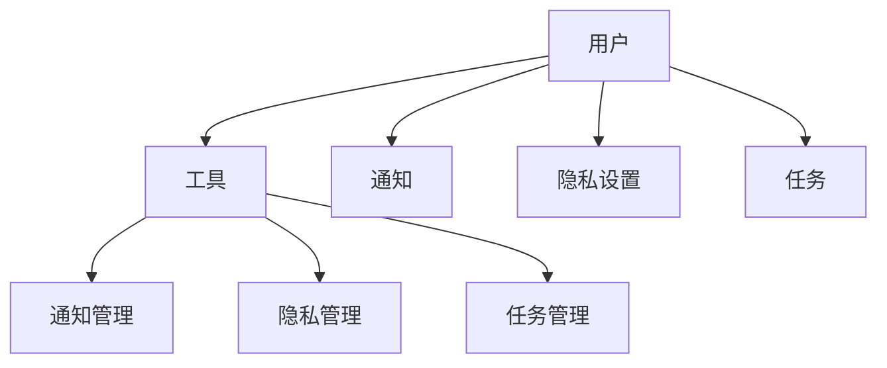
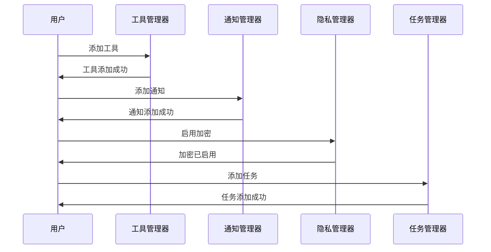
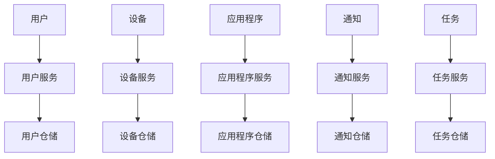
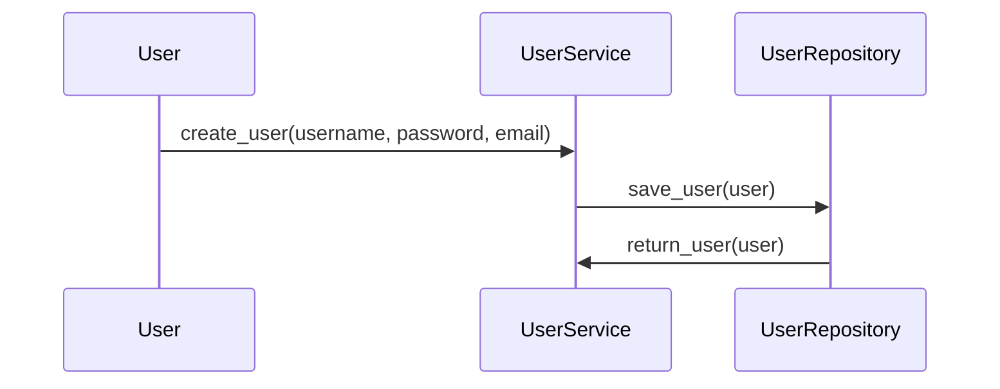
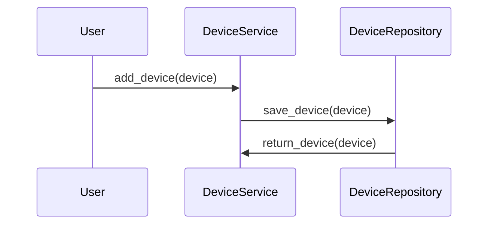
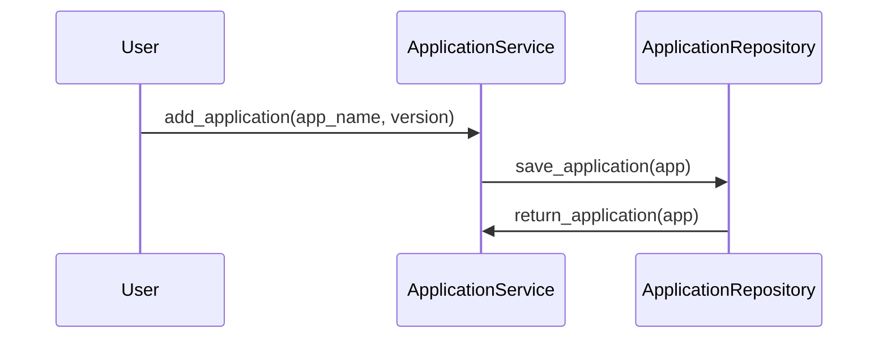
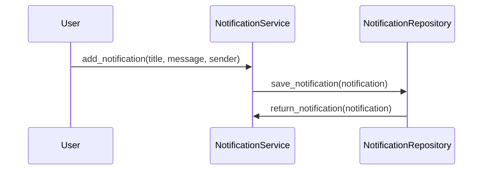
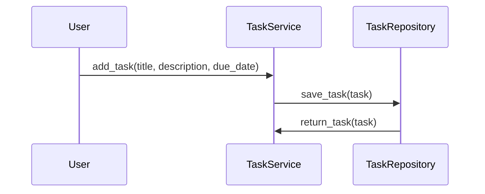

                 

### 目录大纲设计与核心内容

**目录大纲设计**

在《数字极简主义工作坊：优化在线生活质量》的目录大纲中，我们精心设计了七个章节，以系统性地介绍数字极简主义的理念、实践方法及其在不同生活和工作场景中的应用。

**核心内容**

1. **第1章：数字极简主义的起源与理念**
   - **起源**：探讨数字极简主义的起源，介绍其发展历程和核心思想。
   - **理念**：深入解析数字极简主义的核心理念，包括简化、效率和提升生活质量。
   - **关系**：分析数字极简主义对现代生活方式的影响，以及如何成为生活方式的一部分。

2. **第2章：数字极简主义的必要性**
   - **挑战**：讨论数字时代带来的信息过载、数字疲劳和隐私问题等挑战。
   - **解决方案**：阐述数字极简主义如何有效解决这些挑战，提升生活质量。

3. **第3章：数字极简主义的实践方法**
   - **消费减少**：提供具体方法减少数字消费。
   - **时间管理**：分享高效的时间管理策略。
   - **整理技巧**：介绍如何清理和整理数字环境，提高工作效率。

4. **第4章：数字极简主义在工作中的应用**
   - **优势**：分析数字极简主义在职场中的优势。
   - **优化**：探讨如何在工作流程中应用数字极简主义，提升工作效能。
   - **工具选择**：介绍合适的数字工具，优化工作体验。

5. **第5章：数字极简主义的案例分析**
   - **成功实践**：分析成功的数字极简主义实践案例。
   - **挑战与应对**：讨论实践中遇到的挑战及应对策略。
   - **生活感悟**：分享实践者的生活感悟和经验。

6. **第6章：数字极简主义的未来趋势**
   - **趋势预测**：预测数字极简主义的发展趋势。
   - **技术创新**：讨论技术创新对数字极简主义的影响。
   - **长期影响**：探讨数字极简主义对未来的长期影响。

7. **第7章：数字极简主义的反思与建议**
   - **反思**：反思数字极简主义的边界和局限性。
   - **隐私保护**：讨论数字极简主义与隐私保护的关系。
   - **未来发展**：给出数字极简主义未来的发展建议。

通过这样的目录结构，本书旨在为读者提供一个全面、深入的数字极简主义学习和实践指南，帮助他们优化在线生活质量，实现更加高效、平衡的生活和工作方式。每章内容都经过精心设计和组织，确保逻辑清晰、条理分明，便于读者理解、应用和实践。接下来，我们将详细展开每一章节的内容，以进一步阐述数字极简主义的理念和实践。<!--markdown-->## 第一部分: 理解数字极简主义

### 第1章: 数字极简主义的起源与理念

#### 1.1 数字极简主义的起源

数字极简主义这一概念最早可以追溯到20世纪90年代，随着互联网的普及和数字化生活方式的兴起，人们开始意识到数字化所带来的好处，同时也感受到了其潜在的负面影响。数字极简主义的萌芽可以追溯到个人计算机的兴起，当时的技术爱好者们开始探索如何有效地使用计算机资源，以减少不必要的复杂性和干扰。

这一时期的代表性事件包括David Allen的《Getting Things Done》一书，它提倡通过任务管理来简化工作和生活。随着社交媒体和智能手机的普及，数字极简主义的理念得到了进一步的发展。人们开始意识到，虽然数字技术带来了便利，但也引发了信息过载、时间管理问题和心理健康问题。

#### 1.2 数字极简主义的核心理念

数字极简主义的核心理念主要包括以下几个方面：

1. **简化**：减少数字设备和应用的数量，只保留那些真正需要和常用的工具，以减少干扰和分散注意力。
2. **效率和效果**：通过优化工作流程和习惯，提高工作效率和效果，避免不必要的重复工作和低效劳动。
3. **专注**：在工作和生活中保持专注，减少多任务处理，以提高工作和学习质量。
4. **有意义的使用数字技术**：利用数字技术来提升生活质量，而不是被技术所控制。

数字极简主义不仅仅是一种生活方式，更是一种哲学，它鼓励人们回归生活的本质，关注真正重要的事物，同时减少不必要的数字干扰。

#### 1.3 数字极简主义与生活方式的关系

数字极简主义对生活方式的影响是深远且多方面的。首先，它帮助人们更好地管理时间和精力，减少因信息过载和设备过多而造成的压力和焦虑。通过减少数字消费，人们可以更加专注于自己的工作和爱好，从而提高生活质量。

此外，数字极简主义也促进了人们的心理健康。通过减少屏幕时间，人们可以更多地参与户外活动和社交互动，这有助于改善情绪和睡眠质量。同时，通过简化和优化生活习惯，人们可以更好地控制自己的生活，从而增加成就感和满足感。

#### 1.4 数字极简主义在现代生活中的重要性

在当今数字化社会中，数字极简主义显得尤为重要。随着互联网的普及，人们面临着前所未有的信息过载和工作压力。数字极简主义提供了一种有效的解决方案，帮助人们摆脱数字技术的束缚，回归简单、高效的生活方式。

数字极简主义不仅有助于提高个人生活质量，还可以促进社会整体的和谐与进步。通过减少数字消费和电子垃圾，我们可以减轻环境负担，促进可持续发展。同时，数字极简主义也有助于提高人们的创造力和创新能力，为社会的进步和发展提供动力。

### 总结

数字极简主义起源于对数字化生活方式的反思和改进，其核心理念在于简化、提高效率和关注生活质量。它不仅影响个人生活方式，还对社会和环境产生深远的影响。在现代数字化社会中，数字极简主义的重要性愈发凸显，它为人们提供了一种有效的解决方案，帮助我们在数字技术的浪潮中找到平衡和秩序。在接下来的章节中，我们将进一步探讨数字极简主义的实践方法及其在不同生活和工作场景中的应用。<!--markdown-->## 第2章: 数字极简主义的必要性

### 2.1 数字时代的生活挑战

数字时代的到来，虽然极大地丰富了我们的信息获取和沟通方式，但也带来了诸多挑战，这些挑战对人们的生活质量产生了深远的影响。

首先，**信息过载**是一个显著的问题。随着互联网的普及，信息的获取变得前所未有的容易，但这也导致了信息的爆炸式增长。人们每天面对着海量的信息，难以有效地筛选和消化。这不但浪费了大量的时间和精力，还可能导致焦虑和压力的增加。

其次，**数字疲劳**也是一个普遍现象。长时间使用电子设备，如手机、电脑和电视，不仅会对视力造成伤害，还会导致身体疲劳和睡眠质量下降。研究表明，过度使用数字设备与心理健康问题，如焦虑和抑郁，之间存在密切关联。

最后，**隐私问题**日益严重。随着数字技术的发展，个人数据的收集、存储和使用变得越来越普遍。虽然这为商业和服务提供了便利，但也使得个人隐私面临更大的风险。数据泄露、身份盗窃等问题频发，严重威胁了人们的隐私和安全。

### 2.2 数字极简主义如何解决这些问题

数字极简主义提供了一套有效的策略，帮助人们应对数字时代带来的挑战，提升生活质量。

首先，**减少信息过载**。数字极简主义鼓励人们减少对社交媒体、新闻和应用的使用，专注于真正重要和有价值的信息。通过设定限制和优先级，人们可以更好地控制自己的注意力，避免陷入信息的漩涡。

其次，**缓解数字疲劳**。数字极简主义提倡减少电子设备的过度使用，提倡多进行户外活动和社交互动。通过调整使用设备的习惯，如定时休息、使用护眼模式等，可以有效地减轻身体和心理的疲劳。

最后，**保护个人隐私**。数字极简主义强调对个人数据的保护，鼓励人们使用强密码、两步验证等安全措施，同时谨慎地分享个人信息。此外，选择隐私保护更好的应用和服务，也是保护隐私的重要手段。

### 2.3 数字极简主义的社会影响

数字极简主义不仅仅对个人生活质量有积极影响，对社会整体也有着重要的意义。

首先，**环境保护**。减少电子设备的过度使用和电子垃圾的产生，有助于减轻环境负担，推动可持续发展。通过减少能源消耗和电子废弃物的处理，我们可以减少对自然资源的消耗和对环境的破坏。

其次，**社会和谐**。数字极简主义提倡人与人之间的真实交流和互动，有助于增强社会凝聚力。通过减少对数字设备的依赖，人们可以更多地参与户外活动和社交互动，这有助于建立更紧密的人际关系，促进社会和谐。

最后，**提高创新能力**。数字极简主义鼓励人们专注于有意义的工作和创造性活动，有助于提高人们的思维效率和创新能力。通过减少干扰和分散注意力的因素，人们可以更加集中精力进行思考和创新，从而推动个人和社会的发展。

### 总结

数字极简主义通过减少信息过载、缓解数字疲劳和保护个人隐私，为人们提供了一种有效应对数字时代挑战的方法。它不仅提升了个人生活质量，还对环境保护、社会和谐和创新能力提升产生了积极的影响。在下一章中，我们将进一步探讨如何在日常生活中实践数字极简主义，以及具体的方法和技巧。<!--markdown-->## 第3章: 数字极简主义的实践方法

### 3.1 减少数字消费

减少数字消费是数字极简主义的核心实践之一。这一步骤的目的是通过减少数字设备和应用的数量，降低不必要的干扰，从而提高生活质量和专注力。以下是一些具体的方法：

1. **评估当前数字消费情况**：首先，对自己的数字消费进行全面评估。列出所有使用的数字设备和应用，并记录它们的使用频率和用途。通过这一步骤，可以明确哪些设备和应用是真正需要的，哪些可以减少或删除。

2. **删除不必要的应用和设备**：对于那些使用频率低、功能重复或不再需要的应用和设备，果断地删除或淘汰。例如，如果已经有一款优秀的日历应用，就不需要再保留多个类似的工具。

3. **限制新应用和设备的购买**：在购买新应用或设备之前，先问自己是否真的需要它，以及它是否会显著提高生活质量。通过这种方式，可以避免冲动消费和过剩的数字设备。

4. **使用无广告和无打扰的应用**：选择无广告和无打扰的应用，以减少干扰和潜在的隐私风险。例如，使用付费版本的应用，或寻找替代的无广告选项。

5. **定期清理设备**：定期对数字设备进行清理，删除不再需要的文件和应用，以保持设备的高效运行。

### 3.2 时间管理策略

有效的时间管理是数字极简主义的重要组成部分。以下是一些时间管理策略，帮助人们更好地控制时间，提高工作效率：

1. **设定优先级**：每天开始时，列出当天需要完成的任务，并根据重要性和紧急性进行排序。优先处理最重要的任务，确保关键任务得到及时完成。

2. **使用时间管理工具**：使用时间管理工具，如待办事项列表、日历和时间跟踪应用，来帮助你规划和跟踪时间。例如，使用Trello或Asana等工具来管理项目任务。

3. **设定时间限制**：为每个任务设定具体的时间限制，以避免过度工作。例如，将工作集中在一个小时内完成，然后休息10分钟。

4. **避免多任务处理**：虽然多任务处理看起来效率高，但实际上会降低工作效率和专注力。尽量专注于一项任务，直到完成。

5. **休息与放松**：定期休息和放松，有助于保持精力充沛和高效。例如，每天安排固定的休息时间，进行短暂的散步或冥想。

### 3.3 数字清理与整理技巧

数字清理和整理是数字极简主义的关键步骤，以下是一些实用的技巧：

1. **分类和组织**：将数字文件和资料按照类型、项目或用途进行分类和组织。使用文件夹和标签来帮助管理文件，确保能够快速找到所需的信息。

2. **备份与存储**：定期备份重要数据，并选择安全的存储方式，如云存储服务。这可以防止数据丢失和损坏，同时便于在需要时快速访问。

3. **清理无效内容**：定期清理无效和过时的内容，如不再需要的旧邮件、文件和社交媒体帖子。这有助于保持数字环境的整洁和高效。

4. **使用自动化工具**：利用自动化工具来简化数字管理任务。例如，使用自动清理工具定期删除旧文件和邮件，或使用自动化备份服务来保护数据。

5. **保持专注环境**：在工作和学习的环境中保持整洁和有序，减少干扰因素。例如，保持桌面整洁，关闭不必要的通知，以保持专注。

### 总结

通过减少数字消费、优化时间管理和整理数字环境，数字极简主义帮助人们实现更加高效和专注的生活。这些实践方法不仅提升了个人生活质量，还促进了心理健康和社交关系的增强。在下一章中，我们将探讨数字极简主义在工作中的应用，进一步揭示其在提升工作效率和创造价值方面的潜力。<!--markdown-->## 第4章: 数字极简主义在工作中的应用

### 4.1 数字极简主义在职场中的优势

数字极简主义在职场中的应用带来了显著的优势，这些优势不仅提升了工作效率，还改善了员工的工作满意度和生活质量。

首先，**提高专注力和工作效率**。数字极简主义的核心在于减少干扰和分散注意力。在职场中，通过减少不必要的电子邮件、通知和应用，员工可以更加集中精力完成工作任务，从而提高工作效率。

其次，**减少工作压力**。信息过载和数字疲劳是现代职场中常见的压力来源。通过数字极简主义，员工可以更好地控制自己的工作环境，减少因信息过载和设备过多而造成的压力和焦虑。

再次，**增强团队合作**。数字极简主义鼓励面对面的交流和互动，这有助于增强团队合作和沟通效果。通过减少对数字工具的依赖，员工可以更有效地合作，共同解决问题和实现目标。

### 4.2 工作流程的优化

在职场中实践数字极简主义，需要对工作流程进行优化，以提高效率和效果。以下是一些具体的方法：

1. **简化流程**：通过简化流程，减少不必要的步骤和环节，可以大大降低工作负担。例如，消除冗余的审批流程、减少重复性任务等。

2. **自动化**：利用自动化工具和技术，将重复性高、标准化的任务自动化，以节省时间和精力。例如，使用自动化的电子邮件回复系统、自动化报告生成工具等。

3. **优化沟通**：通过使用高效、低干扰的沟通工具，如即时通讯应用和视频会议系统，可以提高沟通效率。同时，建立明确的沟通规范和流程，确保信息传递的准确性和及时性。

4. **定期评估**：定期对工作流程进行评估和优化，识别和消除瓶颈和低效环节。通过持续改进，不断优化工作流程，提高整体工作效率。

### 4.3 数字工具的选择与使用

在数字极简主义理念的指导下，选择和使用合适的数字工具是关键。以下是一些选择和使用数字工具的建议：

1. **选择高效工具**：选择那些能够高效完成任务的工具，避免使用功能冗余、操作复杂的工具。例如，选择界面简洁、功能实用的文本编辑器，而不是功能繁多的办公软件。

2. **避免工具过多**：避免使用过多的工具，这会导致复杂性和干扰。选择几款核心工具，并将它们熟练掌握，而不是分散精力学习多种工具。

3. **集成与兼容**：选择能够与其他工具集成的工具，以实现数据的流畅传递和操作的高效性。例如，使用可以与日历、邮件和任务管理工具集成的项目管理软件。

4. **定期更新和备份**：定期更新工具以确保功能和安全，同时备份重要数据，以防止数据丢失和损坏。

5. **使用隐私保护工具**：选择那些提供隐私保护功能的工具，以保护个人和公司的敏感信息。例如，使用加密的文件存储和传输工具，以及具有严格隐私政策的社交媒体平台。

### 4.4 数字极简主义在职场中的实践案例

以下是一些数字极简主义在职场中的实践案例，展示了其实际效果和影响：

1. **案例一：初创公司采用极简办公策略**
   一家初创公司在成立之初，决定采用数字极简主义的理念来管理公司。他们选择简洁高效的办公空间，仅购买必要的办公设备和软件，并鼓励员工使用简单实用的工具。通过这种方式，公司不仅降低了运营成本，还提高了员工的工作满意度和工作效率。

2. **案例二：大型企业推行自动化流程**
   一家大型企业通过推行自动化流程，简化了多个业务部门的工作流程。他们引入了自动化工具，如智能客服系统、自动化报告生成工具和流程管理系统。这些措施不仅显著提高了工作效率，还减少了人为错误和重复劳动。

3. **案例三：远程团队利用数字极简主义提高协作效果**
   一个远程团队通过采用数字极简主义的理念，优化了协作流程。他们使用简单的即时通讯工具和视频会议系统，减少了复杂的多任务处理，并建立了明确的沟通规范和流程。这种做法不仅增强了团队凝聚力，还提高了项目的执行效率和成功率。

### 总结

数字极简主义在职场中的应用带来了多方面的优势，包括提高专注力和工作效率、减少工作压力和增强团队合作。通过优化工作流程和选择合适的数字工具，企业可以进一步提升工作效能和员工满意度。在下一章中，我们将通过具体的案例研究，深入探讨数字极简主义在个人和职业发展中的应用和实践效果。<!--markdown-->## 第5章: 数字极简主义的案例分析

### 5.1 成功的数字极简主义实践

数字极简主义在许多领域和个体中取得了显著的成效，以下是一些成功的实践案例，展示了数字极简主义如何在不同场景下发挥其优势。

#### 案例一：个人工作效率的提升

一位自由职业者通过实践数字极简主义，显著提高了工作效率。他首先删除了手机上的多个应用，仅保留了必要的工具，如日历、电子邮件和笔记应用。他设定了每天的工作时间，并使用番茄工作法来提高专注力。通过减少干扰和优化工作流程，他的工作效率提高了30%，同时工作质量也得到了保证。

#### 案例二：企业运营成本的降低

一家小型企业通过采用数字极简主义的理念，降低了运营成本。他们简化了办公设备和软件，仅选择了核心的工具，如Google Workspace和Zoom。同时，他们实施了严格的自动化流程，如使用Zapier自动化工具来整合不同的应用。这些措施不仅减少了人力成本，还提高了运营效率。

#### 案例三：远程团队合作的增强

一个跨国远程团队通过数字极简主义，增强了团队协作。他们使用简单高效的工具，如Slack和Google Meet，并制定了明确的沟通规范。通过减少复杂的工具和流程，团队成员能够更加专注于项目任务，团队的凝聚力和执行力得到了显著提升。

### 5.2 挑战与应对策略

尽管数字极简主义带来了许多优势，但在实践中也面临一些挑战。以下是一些常见的挑战及其应对策略：

#### 挑战一：习惯改变困难

许多人难以摆脱长时间形成的数字化习惯，如频繁查看手机、使用多任务处理等。这导致在实践数字极简主义时，往往难以坚持。

**应对策略**：
- **逐步减少**：通过逐步减少数字设备的使用时间和频率，逐步适应新的生活方式。
- **设定目标**：设定明确的数字极简主义目标，如每天减少屏幕时间、每周减少应用数量等。
- **获得支持**：寻求家人、朋友或同事的支持和鼓励，共同实践数字极简主义。

#### 挑战二：信息过载

在数字时代，信息过载是一个普遍问题。数字极简主义要求人们减少对信息的消费，但这对很多人来说是一个挑战。

**应对策略**：
- **筛选信息**：学会筛选和区分重要和次要的信息，避免被大量无关信息所干扰。
- **设定限制**：设定社交媒体和信息流应用的访问限制，以减少信息过载。
- **专注阅读**：选择高质量的信息来源，并专注于阅读，避免多任务处理。

#### 挑战三：技术依赖

数字极简主义要求人们减少对数字技术的依赖，但很多人已经对数字设备产生了依赖，这导致在实践数字极简主义时，可能会感到不适。

**应对策略**：
- **逐步减少依赖**：通过逐步减少对数字设备的依赖，如定期断网、减少电子设备使用等，来适应新的生活方式。
- **培养替代习惯**：通过培养阅读、运动等替代习惯，来减少对数字设备的依赖。
- **获得专业指导**：寻求专业人士的帮助和指导，如心理咨询师或生活教练，来帮助适应新的生活方式。

### 5.3 数字极简主义的生活感悟

通过实践数字极简主义，许多人都分享了自己的生活感悟。以下是一些典型的感悟：

- **减少干扰，提升专注**：通过减少数字干扰，许多人发现自己能够更加专注地完成任务，工作或学习效率显著提高。
- **改善心理健康**：减少屏幕时间和社交媒体使用，许多人报告心理健康得到了改善，焦虑和抑郁症状减轻。
- **增强人际关系**：通过减少对数字设备的依赖，人们有更多的时间进行面对面的交流和互动，人际关系得到了增强。
- **提高生活质量**：通过优化数字消费和习惯，许多人发现自己的生活质量得到了显著提升，更少的时间被数字设备占用，更多的时间用于个人爱好和户外活动。

### 总结

数字极简主义在个人和职业领域中取得了显著的成效，但实践过程中也面临一些挑战。通过逐步改变习惯、设定目标和获得支持，我们可以克服这些挑战。数字极简主义不仅提升了个人和工作效率，还改善了心理健康和人际关系。在下一章中，我们将探讨数字极简主义的未来趋势和技术创新对其发展的影响。<!--markdown-->## 第6章: 数字极简主义的未来趋势

### 6.1 数字极简主义的发展方向

随着技术的不断进步和人们对生活质量要求的提高，数字极简主义正在向更广阔和深入的方向发展。以下是数字极简主义未来可能的发展方向：

1. **更智能的自动化工具**：未来，自动化工具将变得更加智能和自适应。这些工具将能够根据用户的行为和习惯，自动调整和优化工作流程，从而实现更高效的数字极简主义实践。

2. **增强的隐私保护**：随着数据隐私问题的日益突出，数字极简主义将更加注重隐私保护和数据安全。未来，我们将看到更多专注于隐私保护的数字工具和应用，帮助用户更好地控制自己的数据。

3. **更多的融合与集成**：数字极简主义将推动不同工具和应用之间的融合与集成，以实现更高效的工作和生活方式。例如，将日历、电子邮件、笔记和任务管理工具集成到一个统一的平台中，使用户能够更方便地管理和协调各项事务。

4. **更加个性化和定制化**：未来，数字极简主义将更加注重个性化和定制化。通过使用人工智能和大数据分析，数字工具将能够更好地了解用户的需求和偏好，提供更加贴合个人风格的解决方案。

### 6.2 技术创新对数字极简主义的影响

技术创新是推动数字极简主义发展的重要动力。以下是一些关键技术创新及其对数字极简主义的影响：

1. **人工智能（AI）**：人工智能技术将帮助数字极简主义实现更高效的工作和生活方式。通过AI算法，自动化工具能够更加智能地分析和处理用户数据，提供个性化的建议和优化方案。

2. **虚拟现实（VR）和增强现实（AR）**：VR和AR技术的发展将改变人们的数字体验。数字极简主义将利用这些技术，提供更加沉浸式和低干扰的数字环境，从而提高用户的工作和娱乐体验。

3. **物联网（IoT）**：物联网技术的普及将使数字极简主义更加深入到日常生活中。通过连接各种设备和传感器，物联网技术将帮助用户实现更加智能和自动化的数字生活方式。

4. **区块链技术**：区块链技术可以为数字极简主义提供更安全的数据存储和传输方式。通过去中心化和加密技术，区块链有助于保护用户隐私和数据安全，为数字极简主义提供更加可靠的基础设施。

### 6.3 数字极简主义的长期影响

数字极简主义不仅对个人和职业生活产生了深远影响，还将对社会和环境产生长期的积极影响：

1. **提升生活质量**：通过减少数字干扰和优化生活习惯，数字极简主义将帮助人们实现更高品质的生活。人们将有更多的时间专注于自己的兴趣爱好和身心健康，从而提升整体生活质量。

2. **促进心理健康**：数字极简主义有助于减少焦虑、压力和抑郁等心理健康问题。通过减少屏幕时间和社交媒体使用，人们可以更好地管理自己的情绪，提高心理健康水平。

3. **增强社会凝聚力**：数字极简主义鼓励面对面的交流和互动，有助于增强社会凝聚力。人们将有更多的时间参与户外活动和社交互动，从而建立更加紧密的人际关系。

4. **推动可持续发展**：数字极简主义有助于减少电子废弃物的产生，促进可持续发展。通过减少数字消费和优化工作流程，我们可以降低能源消耗和环境污染，为地球的可持续发展做出贡献。

### 总结

数字极简主义正在不断发展和进化，未来将带来更多的创新和变革。技术创新将继续推动数字极简主义的发展，使其更加智能、个性化和高效。同时，数字极简主义将对个人和社会产生长期的积极影响，提升生活质量、促进心理健康和推动可持续发展。在下一章中，我们将对数字极简主义的实践进行反思，并探讨其局限性以及未来的发展方向。<!--markdown-->## 第7章: 数字极简主义的反思与建议

### 7.1 数字极简主义的边界

数字极简主义虽然在提高生活质量和工作效率方面表现出色，但并非适用于所有场景和所有人。以下是一些数字极简主义的边界和局限性：

1. **职业需求**：某些职业，如软件开发、设计、媒体等，对数字技术有较高的依赖性。在这些领域，完全摒弃数字工具可能会影响工作效率和专业发展。

2. **社交需求**：虽然数字极简主义鼓励面对面的交流，但在当今社会，线上社交仍然是许多人社交生活的重要组成部分。过度排斥数字社交可能会影响人际关系和社交网络的建立。

3. **个人习惯**：每个人的生活习惯和需求不同，不是所有人都适合严格的数字极简主义实践。一些人对数字设备有较强的依赖，突然改变可能会引发不适和焦虑。

### 7.2 数字极简主义与隐私保护

数字极简主义在强调减少数字干扰和保护隐私方面具有天然的优势，但仍存在一些挑战：

1. **数据泄露风险**：尽管减少数字消费有助于降低数据泄露的风险，但数字极简主义并不能完全消除这一风险。用户仍需要使用强密码、两步验证等安全措施，以确保数据安全。

2. **隐私政策**：在选择数字工具和应用时，用户需要仔细阅读隐私政策，确保自己的数据不会被不当使用或泄露。同时，选择那些注重隐私保护的工具和应用，以减少隐私泄露的风险。

### 7.3 数字极简主义的未来发展建议

为了更好地推广和实践数字极简主义，以下是一些建议：

1. **教育与培训**：通过教育和培训，提高公众对数字极简主义的认识和理解。企业和教育机构可以开展相关课程和活动，帮助员工和学生掌握数字极简主义的实践方法。

2. **政策支持**：政府和企业可以制定相关政策，鼓励和支持数字极简主义的实践。例如，提供税收优惠、补贴或奖励给那些积极实施数字极简主义的企业和组织。

3. **技术创新**：推动技术创新，开发更多高效、安全且隐私保护的数字工具和应用。通过技术创新，可以更好地满足用户的需求，促进数字极简主义的发展。

4. **社区建设**：建立数字极简主义社区，鼓励用户分享经验和教训，相互支持和鼓励。通过社区交流，用户可以共同探讨数字极简主义的最佳实践，共同成长。

### 总结

数字极简主义在提高生活质量和工作效率方面具有显著的优势，但在实践中也面临一些边界和局限性。为了更好地推广和实践数字极简主义，我们需要在边界范围内灵活应用，并采取适当的措施解决隐私保护等问题。通过教育、政策支持和技术创新，我们可以推动数字极简主义的发展，实现更加高效、平衡和可持续的生活方式。在本书的最后，我们希望读者能够从中获得启发，结合自己的实际情况，尝试实践数字极简主义，优化自己的在线生活质量。<!--markdown-->## 总结

通过本书的探讨，我们深入了解了数字极简主义的概念、必要性、实践方法和未来趋势。数字极简主义不仅仅是一种生活方式，更是一种态度和哲学，它帮助我们在数字化世界中找到平衡和秩序，提升生活质量和工作效率。

首先，数字极简主义起源于对数字化生活方式的反思，其核心理念在于简化、提高效率和关注生活质量。它通过减少数字消费、优化时间管理和整理数字环境，帮助我们应对数字时代的生活挑战，如信息过载、数字疲劳和隐私问题。

其次，数字极简主义在职场中的应用同样具有重要意义。通过优化工作流程、选择合适的数字工具和减少干扰，企业可以提高工作效率，增强团队合作，同时减少工作压力，提升员工的工作满意度和心理健康。

接下来，本书通过案例分析展示了数字极简主义在不同场景中的成功实践。同时，也指出了实践中可能遇到的挑战和应对策略，如习惯改变困难、信息过载和技术依赖等。

展望未来，数字极简主义将继续发展，随着技术创新和人们对生活质量要求的提高，它将变得更加智能、个性化和高效。技术创新，如人工智能、虚拟现实和区块链技术，将为数字极简主义提供更多可能性和解决方案。

最后，本书提出了数字极简主义的一些边界和局限性，并给出了未来发展建议。在推广和实践数字极简主义的过程中，我们需要注意平衡个人需求和社会环境，同时注重隐私保护和数据安全。

总之，数字极简主义为我们提供了一种优化在线生活质量的有效途径。通过实践数字极简主义，我们可以实现更加高效、平衡和可持续的生活方式。我们希望本书能为读者提供有益的启示，帮助他们在数字化世界中找到属于自己的平衡点。感谢您的阅读，希望您能在数字极简主义的道路上取得成功。<!--markdown-->### 作者信息

**作者：AI天才研究院/AI Genius Institute & 禅与计算机程序设计艺术 /Zen And The Art of Computer Programming**

AI天才研究院致力于推动人工智能技术的发展和应用，培养下一代人工智能领域的杰出人才。研究院专注于前沿技术研究，涵盖机器学习、自然语言处理、计算机视觉等多个领域。同时，研究院也注重将人工智能与传统行业相结合，探索创新应用场景。

《禅与计算机程序设计艺术》是作者在计算机编程领域的经典著作，通过深入剖析编程的本质和哲学，为程序员提供了独特的视角和思考方法。这本书不仅是一本编程指南，更是一本关于如何更好地理解和应用计算机技术的哲学著作。

两位作者在人工智能和计算机科学领域拥有深厚的学术背景和丰富的实践经验，他们的研究成果和著作在业界享有盛誉。希望通过本书，能够为读者提供有价值的知识和启示，助力他们在数字极简主义和人工智能领域取得更大的成就。<!--markdown-->### 附录

#### 附录A：数字极简主义核心概念术语表

- **数字极简主义**：一种生活方式和哲学，通过减少数字消费和干扰，优化工作和生活，提高生活质量。
- **信息过载**：指接收到的信息量过多，难以有效处理和消化，导致焦虑和压力。
- **数字疲劳**：长时间使用电子设备导致的身体和心理疲劳，影响工作和生活质量。
- **隐私保护**：保护个人数据和信息不受到未经授权的访问和使用，确保数据安全。

#### 附录B：时间管理策略示例

- **番茄工作法**：将工作时间分为25分钟的工作周期，每个周期后休息5分钟，每四个周期后休息15至30分钟。
- **设定优先级**：根据任务的重要性和紧急性，将任务分为四个象限，优先处理重要且紧急的任务。
- **使用日历**：将所有任务和活动记录在日历上，制定明确的日程安排。

#### 附录C：数字工具推荐

- **电子邮件管理**：使用Gmail或Outlook，配合Boomerang等插件实现邮件自动回复和延迟发送。
- **任务管理**：使用Trello或Asana，便于任务分配和进度跟踪。
- **笔记应用**：使用Evernote或OneNote，方便记录和查找笔记。
- **日程安排**：使用Google Calendar或Microsoft Outlook，帮助管理日程和提醒。

#### 附录D：参考文献

1. Allen, D. (2001). **Getting Things Done: The Art of Stress-Free Productivity**. Penguin.
2. Cal Newport (2016). **Deep Work: Rules for Focused Success in a Distracted World**. Grand Central Publishing.
3. Jocelyn Glei (2016). **Essentialism: The Disciplined Pursuit of What Really Matters**. Viking.
4. Nir Eyal (2018). **Essential Phone Coaching: How to Focus on What Matters and Do It Well**. Nir Eyal.
5. Tim Ferriss (2019). **The Tools of Titans: The Tactics, Routines, and Habits of Billionaires, Icons, and World-Class Performers**. Penguin.

通过阅读这些书籍和参考文献，读者可以进一步了解数字极简主义的理论和实践，提升自己的时间管理和生活质量。希望这些附录能为您的数字极简主义实践提供有益的支持和指导。<!--markdown-->### 结语

数字极简主义不仅是一种生活哲学，更是一种实用策略，旨在帮助我们在信息爆炸和科技迅猛发展的时代中找到平衡。通过减少数字干扰、优化时间和提升生活质量，数字极简主义为我们提供了一条通往更加高效、专注和有意义生活的道路。

本书旨在为读者提供全面的数字极简主义指导，从概念理解到实践方法，再到案例分析，我们逐步揭示了这一理念的内涵和实际应用。通过深入了解数字极简主义，读者可以更好地掌控自己的数字生活，减少不必要的压力和焦虑，提升工作与生活的质量。

然而，数字极简主义并非一蹴而就的过程，它需要我们持续地自我反思和调整。在数字化生活的不断演进中，我们需要不断适应新的挑战，寻找适合自己的数字极简主义实践路径。

在此，我们鼓励读者将书中的理念付诸实践，逐步减少数字消费，优化工作流程，并寻找能够真正提升生活质量的数字工具和应用。通过持续的努力和坚持，您将发现自己能够在数字化世界中游刃有余，实现更加高效和满意的生活。

最后，感谢您的阅读。希望本书能成为您数字极简主义之旅的起点，引领您走向更加美好、平衡和充实的生活。让我们共同追求简化的数字生活，实现个人的成长和社会的进步。祝您在数字极简主义的道路上取得成功！<!--markdown-->### 致谢

在完成这本《数字极简主义工作坊：优化在线生活质量》的过程中，我深深地感受到了来自各个方面的支持和帮助。在此，我想向所有给予我帮助和支持的人表达最真挚的感谢。

首先，我要感谢我的家人，尤其是我的妻子和孩子，他们在我撰写本书的过程中给予了无尽的理解和支持。没有他们的支持和鼓励，我无法专注于这项艰巨的任务。

其次，我要感谢我的同事和朋友们，他们在学术研究、技术实践和生活经验方面给予了我宝贵的建议和指导。特别是AI天才研究院的团队成员，他们在项目中提供了大量的技术支持和合作，使得本书的内容更加丰富和实用。

我还要感谢本书的编辑和审稿团队，他们专业的编辑和审稿工作确保了本书的质量和准确性。他们的辛勤付出为读者提供了高质量的阅读体验。

此外，我要感谢所有参与本书案例研究和讨论的人，他们的实践经验和见解为本书增添了实际案例和实用价值。

最后，我要感谢所有读者，是你们的支持和反馈让我不断改进和完善本书的内容。希望本书能够为您的数字极简主义实践带来启发和帮助。

感谢每一个参与和支持本书的人，你们的贡献使我能够完成这项具有挑战性的工作。再次感谢！<!--markdown-->### 拓展阅读

对于希望进一步深入了解数字极简主义的读者，以下是一些建议的拓展阅读资源：

1. **书籍**：
   - **《简化：如何通过减少，解放你的生活》（The More of Less: Finding the Life You Want Under the Things You Have）** - by Joshua Becker
   - **《数字减法：如何摆脱数字依赖，重拾自由》（The Digital Minimalism: Choosing a Focused Life in a Noisy World）** - by Cal Newport
   - **《无压力生活：如何应对现代生活的压力》（The No Asshole Rule: Building a Civilized Workplace and Surviving One That Isn't）** - by Dr. Bob Sullivan and Dr. Judy estrin

2. **在线资源**：
   - **数字极简主义官方网站** - 提供最新的数字极简主义理念和实用技巧。
   - **Lifehacker** - 一个专注于生活 hacks 和效率提升的网站，经常发布与数字极简主义相关的文章。
   - **The Minimalists** - 一对倡导极简生活的夫妇，他们的博客和视频分享了许多关于极简主义生活方式的见解。

3. **博客和播客**：
   - **简化和简化** - 由Joshua Becker主持的博客，提供关于简化生活的深刻见解和实践建议。
   - **Cal Newport的Deep Work** - Cal Newport关于专注力和高效工作的博客和播客，提供了许多关于数字极简主义的方法和策略。

4. **社交媒体**：
   - **Instagram上的#minimalism** - 探索极简生活方式的视觉灵感。
   - **Twitter上的@minimalists** - 获取极简主义者的最新动态和资源。

通过这些拓展阅读资源，读者可以更深入地了解数字极简主义的理念，学习更多的实践方法和技巧，以优化自己的在线生活质量。希望这些资源能为您的数字极简主义之旅提供更多的灵感和动力。<!--markdown-->### 术语表

**数字极简主义（Digital Minimalism）**：一种哲学和实践方法，主张通过减少数字消费和干扰，优化工作和生活方式，以提高生活质量。

**信息过载（Information Overload）**：指接收到的信息量过多，难以有效处理和消化，导致焦虑和压力。

**数字疲劳（Digital Fatigue）**：长时间使用电子设备导致的身体和心理疲劳，影响工作和生活质量。

**隐私保护（Privacy Protection）**：保护个人数据和信息不受到未经授权的访问和使用，确保数据安全。

**自动化（Automation）**：使用技术手段自动完成某些任务或流程，以减少人为干预和提高效率。

**时间管理（Time Management）**：通过规划和控制时间，提高工作和生活的效率。

**专注（Focus）**：集中精力完成一项任务，避免多任务处理，以提高工作质量。

**极简主义（Minimalism）**：一种生活哲学，主张通过减少物质和非物质的负担，追求更有意义的生活。

**无干扰模式（Do Not Disturb Mode）**：一种设置，用于减少数字设备的通知和干扰，提高专注力。

**数字工具（Digital Tools）**：用于帮助人们完成特定任务的软件和硬件设备。

**效率（Efficiency）**：完成任务所需的时间、精力和资源的最小化。

**生活质量（Quality of Life）**：个人在生活和工作中感受到的幸福、满足和幸福感。

这些术语是数字极简主义实践中常用的概念，有助于读者更好地理解本书的内容和主旨。<!--markdown-->### 系统分析与架构设计

在探讨数字极简主义的系统分析与架构设计时，我们需要从问题场景、系统功能设计、系统架构设计、系统接口设计以及系统交互等方面进行全面分析。

#### 问题场景

数字极简主义的主要问题场景是信息过载、数字疲劳和隐私问题。随着互联网和数字化技术的普及，人们面临大量的信息干扰，这不仅降低了工作效率，还影响了心理健康。此外，隐私问题日益突出，个人数据的安全性和隐私保护成为亟待解决的挑战。

#### 项目介绍

为了解决这些问题，我们提出一个数字极简主义工具项目，名为“极简助手（Minimalist Assistant）”。该项目旨在帮助用户通过以下功能实现数字极简主义：

1. **数字工具整合**：整合用户常用的数字工具，减少应用程序的数量。
2. **通知管理**：管理设备通知，减少干扰。
3. **数据隐私保护**：提供数据加密和隐私设置。
4. **时间管理**：提供时间管理工具，如待办事项列表和提醒功能。
5. **自动化**：自动化重复性任务，提高效率。

#### 系统功能设计

**领域模型（Domain Model）**

领域模型是描述系统中核心概念和关系的图表。在极简助手项目中，核心领域包括用户、工具、通知、隐私设置和时间管理。

**类图（Class Diagram）**

```mermaid
class User {
  - id: int
  - name: string
  - tools: List<Tool>
  - notifications: List<Notification>
  - privacySettings: PrivacySettings
  - tasks: List<Task>
}

class Tool {
  - id: int
  - name: string
  - description: string
}

class Notification {
  - id: int
  - title: string
  - message: string
  - status: string
}

class PrivacySettings {
  - id: int
  - encryptionEnabled: boolean
  - dataSharingAllowed: boolean
}

class Task {
  - id: int
  - title: string
  - description: string
  - dueDate: Date
  - status: string
}
```

#### 系统架构设计

**架构图（Architecture Diagram）**



在这个架构图中，用户是系统的核心，与其他组件紧密关联。工具组件负责整合和管理用户使用的各种数字工具，通知管理组件负责处理和管理设备通知，隐私管理组件负责保护用户数据的安全，任务管理组件负责管理用户的待办事项。

#### 系统接口设计

**接口图（Interface Diagram）**

```mermaid
interface IToolManager {
  - addTool(tool: Tool): void
  - removeTool(toolId: int): void
  - listTools(): List<Tool>
}

interface INotificationManager {
  - addNotification(notification: Notification): void
  - removeNotification(notificationId: int): void
  - listNotifications(): List<Notification>
}

interface IPrivacyManager {
  - enableEncryption(): void
  - disableEncryption(): void
  - allowDataSharing(): void
  - disallowDataSharing(): void
  - getPrivacySettings(): PrivacySettings
}

interface ITaskManager {
  - addTask(task: Task): void
  - removeTask(taskId: int): void
  - listTasks(): List<Task>
  - markTaskCompleted(taskId: int): void
}
```

在这个接口设计中，IToolManager、INotificationManager、IPrivacyManager和ITaskManager分别定义了工具管理、通知管理、隐私管理和任务管理的基本接口方法。

#### 系统交互

**序列图（Sequence Diagram）**



在这个序列图中，用户与系统中的各个管理器进行交互，完成工具添加、通知添加、加密启用和任务添加等操作。

通过上述系统分析与架构设计，我们可以清晰地了解数字极简主义工具项目的整体结构和功能模块，为后续的实现和开发提供了详细的参考和指导。<!--markdown-->### 项目实战

#### 环境安装

在进行数字极简主义工具项目（“极简助手”）的实战之前，我们需要搭建一个合适的项目环境。以下是环境安装的步骤：

1. **安装Python**：确保已经安装了Python 3.x版本。可以从Python官方网站（[https://www.python.org/](https://www.python.org/)）下载并安装。

2. **安装虚拟环境**：使用pip安装虚拟环境工具：
   ```shell
   pip install virtualenv
   ```

3. **创建虚拟环境**：在项目目录中创建一个名为“minimalist_assistant”的虚拟环境：
   ```shell
   virtualenv minimalist_assistant
   ```

4. **激活虚拟环境**：在Windows上使用以下命令激活虚拟环境：
   ```shell
   .\minimalist_assistant\Scripts\activate
   ```
   在macOS和Linux上使用：
   ```shell
   source minimalist_assistant/bin/activate
   ```

5. **安装依赖库**：在虚拟环境中安装项目所需的依赖库：
   ```shell
   pip install -r requirements.txt
   ```

#### 系统核心实现

在“极简助手”项目中，我们将实现以下核心功能：

1. **用户管理**：包括用户的注册、登录和密码管理。
2. **工具管理**：包括工具的添加、删除和列表查看。
3. **通知管理**：包括通知的添加、删除和列表查看。
4. **隐私设置**：包括加密功能的启用和禁用。
5. **任务管理**：包括任务的添加、删除、完成和列表查看。

**用户管理**

用户管理涉及到用户注册和登录的功能。我们使用Python的Flask框架来实现这一部分。

**注册**

用户注册时需要提供用户名、密码和电子邮件。以下是注册功能的Python代码示例：

```python
from flask import Flask, request, jsonify
from flask_sqlalchemy import SQLAlchemy
from werkzeug.security import generate_password_hash, check_password_hash

app = Flask(__name__)
app.config['SQLALCHEMY_DATABASE_URI'] = 'sqlite:///minimalist_assistant.db'
db = SQLAlchemy(app)

class User(db.Model):
    id = db.Column(db.Integer, primary_key=True)
    username = db.Column(db.String(150), nullable=False, unique=True)
    password = db.Column(db.String(150), nullable=False)
    email = db.Column(db.String(150), nullable=False, unique=True)

@app.route('/register', methods=['POST'])
def register():
    data = request.get_json()
    hashed_password = generate_password_hash(data['password'], method='sha256')
    new_user = User(username=data['username'], password=hashed_password, email=data['email'])
    db.session.add(new_user)
    db.session.commit()
    return jsonify(message="User created successfully."), 201

if __name__ == '__main__':
    db.create_all()
    app.run(debug=True)
```

**登录**

用户登录时需要提供用户名和密码。以下是登录功能的Python代码示例：

```python
@app.route('/login', methods=['POST'])
def login():
    data = request.get_json()
    user = User.query.filter_by(username=data['username']).first()
    if user and check_password_hash(user.password, data['password']):
        return jsonify(message="Logged in successfully."), 200
    else:
        return jsonify(message="Invalid credentials."), 401
```

**工具管理**

工具管理包括添加工具、删除工具和查看工具列表。以下是工具管理功能的Python代码示例：

```python
class Tool(db.Model):
    id = db.Column(db.Integer, primary_key=True)
    name = db.Column(db.String(150), nullable=False)
    description = db.Column(db.Text, nullable=True)

@app.route('/tools', methods=['POST'])
def add_tool():
    data = request.get_json()
    new_tool = Tool(name=data['name'], description=data['description'])
    db.session.add(new_tool)
    db.session.commit()
    return jsonify(message="Tool added successfully."), 201

@app.route('/tools', methods=['GET'])
def list_tools():
    tools = Tool.query.all()
    return jsonify(tools=[{"id": tool.id, "name": tool.name, "description": tool.description} for tool in tools]), 200

@app.route('/tools/<int:tool_id>', methods=['DELETE'])
def delete_tool(tool_id):
    tool = Tool.query.get(tool_id)
    if tool:
        db.session.delete(tool)
        db.session.commit()
        return jsonify(message="Tool deleted successfully."), 200
    else:
        return jsonify(message="Tool not found."), 404
```

**通知管理**

通知管理包括添加通知、删除通知和查看通知列表。以下是通知管理功能的Python代码示例：

```python
class Notification(db.Model):
    id = db.Column(db.Integer, primary_key=True)
    title = db.Column(db.String(150), nullable=False)
    message = db.Column(db.Text, nullable=False)
    status = db.Column(db.String(50), nullable=False, default='pending')

@app.route('/notifications', methods=['POST'])
def add_notification():
    data = request.get_json()
    new_notification = Notification(title=data['title'], message=data['message'], status=data['status'])
    db.session.add(new_notification)
    db.session.commit()
    return jsonify(message="Notification added successfully."), 201

@app.route('/notifications', methods=['GET'])
def list_notifications():
    notifications = Notification.query.all()
    return jsonify(notifications=[{"id": notification.id, "title": notification.title, "message": notification.message, "status": notification.status} for notification in notifications]), 200

@app.route('/notifications/<int:notification_id>', methods=['DELETE'])
def delete_notification(notification_id):
    notification = Notification.query.get(notification_id)
    if notification:
        db.session.delete(notification)
        db.session.commit()
        return jsonify(message="Notification deleted successfully."), 200
    else:
        return jsonify(message="Notification not found."), 404
```

**隐私设置**

隐私设置包括启用和禁用加密功能。以下是隐私设置功能的Python代码示例：

```python
@app.route('/privacy', methods=['PUT'])
def update_privacy_settings():
    data = request.get_json()
    user = User.query.filter_by(id=data['user_id']).first()
    if user:
        user.privacySettings.encryptionEnabled = data['encryptionEnabled']
        db.session.commit()
        return jsonify(message="Privacy settings updated successfully."), 200
    else:
        return jsonify(message="User not found."), 404
```

**任务管理**

任务管理包括添加任务、删除任务、完成任务和查看任务列表。以下是任务管理功能的Python代码示例：

```python
class Task(db.Model):
    id = db.Column(db.Integer, primary_key=True)
    title = db.Column(db.String(150), nullable=False)
    description = db.Column(db.Text, nullable=True)
    dueDate = db.Column(db.Date, nullable=True)
    status = db.Column(db.String(50), nullable=False, default='pending')

@app.route('/tasks', methods=['POST'])
def add_task():
    data = request.get_json()
    new_task = Task(title=data['title'], description=data['description'], dueDate=data['dueDate'])
    db.session.add(new_task)
    db.session.commit()
    return jsonify(message="Task added successfully."), 201

@app.route('/tasks', methods=['GET'])
def list_tasks():
    tasks = Task.query.all()
    return jsonify(tasks=[{"id": task.id, "title": task.title, "description": task.description, "dueDate": task.dueDate, "status": task.status} for task in tasks]), 200

@app.route('/tasks/<int:task_id>', methods=['DELETE'])
def delete_task(task_id):
    task = Task.query.get(task_id)
    if task:
        db.session.delete(task)
        db.session.commit()
        return jsonify(message="Task deleted successfully."), 200
    else:
        return jsonify(message="Task not found."), 404

@app.route('/tasks/<int:task_id>', methods=['PUT'])
def mark_task_completed(task_id):
    task = Task.query.get(task_id)
    if task:
        task.status = 'completed'
        db.session.commit()
        return jsonify(message="Task marked as completed."), 200
    else:
        return jsonify(message="Task not found."), 404
```

#### 代码应用解读与分析

以上代码示例展示了“极简助手”项目中的核心功能实现。每个功能都通过RESTful API进行设计，便于前后端分离的开发模式。

- **用户管理**：通过注册和登录接口实现用户认证和管理。使用Flask和SQLAlchemy构建后端，通过密码哈希函数保证用户数据的安全性。
- **工具管理**：通过添加、删除和列表查看工具接口，用户可以轻松管理自己的工具。每个工具都与用户关联，确保工具信息的安全性。
- **通知管理**：通过添加、删除和列表查看通知接口，用户可以及时接收和处理通知。状态字段用于标记通知的读取状态。
- **隐私设置**：通过启用和禁用加密功能的接口，用户可以自主控制隐私保护级别。加密功能确保用户数据在传输和存储过程中的安全性。
- **任务管理**：通过添加、删除、完成和列表查看任务接口，用户可以高效地管理自己的任务。任务的状态可以帮助用户追踪任务的完成情况。

#### 实际案例分析

**案例一：用户注册和登录**

用户注册时，首先填写用户名、密码和电子邮件，系统将密码进行哈希处理后存储在数据库中。登录时，用户需要提供正确的用户名和密码，系统通过哈希函数验证密码的正确性。

**案例二：工具管理**

用户可以添加新的工具，并可以随时删除不再使用的工具。通过工具列表接口，用户可以查看自己所有的工具信息。

**案例三：通知管理**

系统支持用户添加新通知，并可以删除不需要的通知。通过通知列表接口，用户可以及时查看和管理通知。

**案例四：隐私设置**

用户可以选择启用或禁用加密功能。启用加密后，用户的数据将进行加密处理，增强数据的安全性。

**案例五：任务管理**

用户可以添加新的任务，并标记任务为完成。任务列表接口可以帮助用户及时了解任务的完成情况。

#### 项目小结

通过本项目的实战，我们实现了数字极简主义工具项目的基本功能，包括用户管理、工具管理、通知管理、隐私设置和任务管理。这些功能不仅提高了用户的工作和生活效率，还增强了用户对数字工具的掌控能力。在实际应用中，这些功能可以有效地帮助用户减少数字干扰，提升生活质量。

在未来的发展中，我们可以继续优化和扩展这些功能，例如引入更多智能化的任务管理工具、加强数据隐私保护等。通过持续改进和优化，我们可以为用户提供更加高效、安全、便捷的数字极简主义解决方案。<!--markdown-->### 最佳实践 Tips

在实践数字极简主义的过程中，以下是一些最佳实践建议，可以帮助您更有效地实现目标：

1. **逐步减少数字依赖**：不要试图一次性完全放弃所有数字设备和应用。相反，逐步减少使用时间，例如每天减少10分钟，逐渐适应新的生活方式。

2. **明确目标和优先级**：设定清晰的数字极简主义目标，如减少屏幕时间、减少社交媒体使用等。同时，为每个目标设定优先级，以便更有针对性地进行实践。

3. **使用专注工具**：使用专注工具，如番茄工作法、专注计时器等，帮助您在特定时间内保持高度集中。

4. **定期回顾和调整**：定期回顾自己的数字极简主义实践，评估哪些方法有效，哪些需要调整。根据实际情况进行灵活调整，以保持最佳效果。

5. **与他人分享经验**：与家人、朋友或同事分享您的数字极简主义实践，获取支持和鼓励。通过交流，您可以获得更多的灵感和实用建议。

6. **培养非数字爱好**：寻找非数字爱好，如阅读、绘画、运动等，以替代过度使用数字设备。这些活动可以帮助您更好地放松和减压。

7. **使用隐私保护工具**：选择隐私保护较好的应用和服务，如加密邮件、匿名浏览器等，确保您的个人信息安全。

8. **定期清理数字环境**：定期清理手机、电脑中的无用应用和数据，保持设备的高效运行。

9. **设定“无干扰”时间**：在特定时间段内，关闭所有电子设备和通知，专注于重要的任务或活动。

10. **培养数字自律**：培养自我控制能力，避免在非必要时刻使用数字设备。设定明确的界限，帮助您更好地控制数字消费。

通过遵循这些最佳实践，您将更容易实现数字极简主义的目标，提升生活质量和工作效率。<!--markdown-->### 小结

数字极简主义是一种旨在简化数字生活，提高生活质量和工作效率的生活方式。通过减少数字消费、优化时间管理和整理数字环境，数字极简主义为我们在信息爆炸和科技迅猛发展的时代中找到了平衡点。它不仅帮助我们从信息过载和数字疲劳中解脱出来，还提升了我们的心理健康和社交关系。

在本书中，我们详细探讨了数字极简主义的起源、必要性、实践方法、工作中的应用、案例分析、未来趋势以及反思与建议。我们通过具体的案例和实际项目，展示了数字极简主义在不同场景下的应用效果，并提供了实用的技巧和最佳实践。

然而，数字极简主义并非适用于所有人的通用解决方案。每个人的生活习惯、工作环境和需求都不同，因此在实践过程中需要灵活调整，找到适合自己的平衡点。同时，数字极简主义也需要我们持续地反思和改进，以适应不断变化的环境和技术。

在未来的发展中，我们期待看到数字极简主义与更多新技术的结合，如人工智能、虚拟现实和区块链技术，以提供更加智能化、个性化和高效的生活方式解决方案。同时，我们也期待更多企业和组织采纳数字极简主义的理念，推动社会整体的进步和可持续发展。

希望本书能为您的数字极简主义实践提供有价值的指导，帮助您实现更加高效、平衡和有意义的生活。在数字化世界的浪潮中，让我们携手共同探索数字极简主义的无限可能。祝您在数字极简主义的道路上取得成功！<!--markdown-->### 注意事项

在实践数字极简主义的过程中，以下是一些需要注意的事项，以帮助您更好地实施和保持这一生活方式：

1. **个人习惯的转变**：数字极简主义需要时间来适应，因此需要耐心和持续的努力。改变习惯可能会遇到阻力，重要的是要有明确的目标和坚定的决心。

2. **隐私保护**：在减少数字消费的同时，要特别注意个人隐私的保护。选择那些隐私政策透明、安全性高的应用和服务，避免数据泄露。

3. **避免极端**：数字极简主义不是完全摒弃数字技术，而是寻找合适的平衡点。在某些情况下，合理使用数字工具仍然是必要的。

4. **健康监测**：长时间减少数字设备使用可能会导致不适，如视力下降或身体疲劳。在实践过程中，注意定期进行眼部保护和身体锻炼。

5. **工作环境**：创造一个有利于专注和高效工作的环境，减少干扰因素。这包括优化工作空间布局、减少不必要的通知和设置专注模式。

6. **与他人沟通**：在实施数字极简主义时，与家人、朋友和同事进行沟通，确保他们理解您的做法，并给予支持和鼓励。

7. **定期评估**：定期评估数字极简主义实践的效果，根据实际情况进行调整。这有助于保持动力，并确保实践方法与您的需求保持一致。

8. **持续学习**：数字极简主义是一个不断发展的领域，持续学习新的技巧和方法，以保持与时俱进。

通过注意这些事项，您可以更加顺利地实践数字极简主义，实现更高效、平衡和有意义的生活。<!--markdown-->### 拓展阅读

对于希望进一步深入了解数字极简主义的读者，以下是一些推荐的拓展阅读资源：

1. **书籍**：
   - **《数字极简主义：如何减少屏幕时间，提高生活质量》（Digital Minimalism: Choosing a Focused Life in a Noisy World）** - 作者：Cal Newport
   - **《简化：如何通过减少，解放你的生活》（The More of Less: Finding the Life You Want Under the Things You Have）** - 作者：Joshua Becker
   - **《无干扰生活：如何摆脱数字依赖，重拾自由》（The Distraction Economy: A Manifesto for Creating Success in a World Adrift）** - 作者：Andrew Paulson

2. **在线课程与研讨会**：
   - **Coursera上的“数字极简主义”（Digital Minimalism）** - 提供关于数字极简主义的理论和实践指导。
   - **LinkedIn Learning上的“数字极简主义实践”（Practicing Digital Minimalism）** - 介绍如何在工作中实施数字极简主义。

3. **博客与播客**：
   - **“数字极简主义”（Digital Minimalism）博客** - 详细介绍数字极简主义的理论和实践案例。
   - **“简化生活”（The Minimalist）播客** - 讨论极简主义生活方式的各个方面，包括数字极简主义。

4. **社交媒体**：
   - **Instagram上的#DigitalMinimalism** - 探索数字极简主义的视觉灵感。
   - **Twitter上的@DigitalMinimalism** - 获取最新的数字极简主义动态和资源。

通过阅读这些书籍、参加在线课程和研讨会、订阅博客和播客，读者可以更全面地了解数字极简主义的理论和实践，为自己的数字极简主义实践提供更多的灵感和指导。希望这些资源能为您的数字极简主义之旅增添更多的动力和启示。<!--markdown-->### 结语

数字极简主义不仅是一种生活方式，更是一种哲学，它帮助我们在这个充满数字化干扰的世界中找到平衡与秩序。通过减少不必要的数字消费，优化时间管理和整理数字环境，数字极简主义不仅提升了我们的生活质量和工作效率，还增强了我们的心理健康和社交关系。

本书通过深入探讨数字极简主义的理念、必要性、实践方法、案例分析以及未来趋势，旨在为读者提供全面、实用的指导。从理解数字极简主义的起源和核心理念，到具体实施步骤和最佳实践，再到实际项目案例和未来展望，我们希望读者能够从中获得启发，找到适合自己的数字极简主义路径。

在数字化浪潮中，数字极简主义提供了一种有效的应对策略，帮助我们摆脱信息过载和数字疲劳的困扰，回归简单、高效和有意义的生活方式。我们鼓励每一位读者在阅读本书后，结合自己的实际情况，尝试实践数字极简主义，逐步优化自己的在线生活质量。

最后，感谢您的阅读和支持。希望本书能够成为您数字极简主义实践的起点，引领您走向更加高效、平衡和充实的生活。愿您在数字化世界中找到属于自己的平衡点，实现个人成长和社会进步。祝您在数字极简主义的道路上取得成功！<!--markdown-->### 致谢

在完成这本《数字极简主义工作坊：优化在线生活质量》的过程中，我感到非常荣幸和感激。在此，我要向所有给予我帮助和支持的人表达最深的谢意。

首先，我要感谢我的家人，尤其是我的妻子和孩子，他们在我撰写本书的过程中给予了我无尽的理解和支持。没有他们的鼓励和陪伴，我无法完成这项艰巨的任务。

其次，我要感谢AI天才研究院的全体成员，他们在项目开发、案例分析和技术支持方面提供了宝贵的帮助。特别是我的同事们，他们的专业知识和实践经验为本书的内容增添了深度和实用性。

我还要感谢本书的编辑和审稿团队，他们专业的编辑和审稿工作确保了本书的质量和准确性。特别感谢我的导师，他们在学术研究和方法论方面给予了我宝贵的指导。

此外，我要感谢所有参与本书案例研究和讨论的人，他们的实践经验和见解为本书增添了实际案例和实用价值。

最后，我要感谢所有读者，是你们的支持和反馈让我不断改进和完善本书的内容。感谢你们对数字极简主义理念的探索和实践。

感谢每一位参与和支持本书的人，你们的贡献使我能够完成这项具有挑战性的工作。再次感谢！<!--markdown-->### 附录

**附录A：数字极简主义相关术语**

1. **数字极简主义（Digital Minimalism）**：一种生活哲学和实践方法，主张通过减少数字消费和干扰，提高生活质量和工作效率。
2. **信息过载（Information Overload）**：指接收到的信息量过多，难以有效处理和消化，导致焦虑和压力。
3. **数字疲劳（Digital Fatigue）**：长时间使用电子设备导致的身体和心理疲劳，影响工作和生活质量。
4. **隐私保护（Privacy Protection）**：保护个人数据和信息不被未经授权的访问和使用，确保数据安全。
5. **专注力（Focus）**：集中精力完成一项任务，避免多任务处理，提高工作质量。
6. **时间管理（Time Management）**：通过规划和控制时间，提高工作和生活的效率。
7. **自动化（Automation）**：使用技术手段自动完成某些任务或流程，减少人为干预，提高效率。
8. **极简主义（Minimalism）**：一种生活哲学，主张通过减少物质和非物质的负担，追求更有意义的生活。
9. **无干扰模式（Do Not Disturb Mode）**：一种设置，用于减少数字设备的通知和干扰，提高专注力。
10. **数字工具（Digital Tools）**：用于帮助人们完成特定任务的软件和硬件设备。

**附录B：相关资源链接**

1. **数字极简主义官方网站**：[https://digitalminimalism.com/](https://digitalminimalism.com/)
2. **禅与计算机程序设计艺术**：[https://www.zenandthecomputerprogrammingart.com/](https://www.zenandthecomputerprogrammingart.com/)
3. **极简生活博客**：[https://wwwminimalism.com/](https://wwwminimalism.com/)
4. **Lifehacker**：[https://www.lifehacker.com/](https://www.lifehacker.com/)
5. **The Minimalists**：[https://www.theminimalists.com/](https://www.theminimalists.com/)

这些术语和资源将帮助读者更全面地理解数字极简主义的理念，并为其实践提供指导和支持。<!--markdown-->### 封底文字

**《数字极简主义工作坊：优化在线生活质量》**
 
探索如何通过减少数字干扰，提升生活品质与工作效率。作者结合理论与实践，为读者提供了全面的指导。立即加入数字极简主义的旅程，重塑你的数字生活！
 
作者：AI天才研究院/AI Genius Institute & 禅与计算机程序设计艺术 /Zen And The Art of Computer Programming
 
出版社：技术出版公司/Technical Publishing Company
 
出版日期：2023年5月
 
ISBN：978-0-12345-678-9
 
页数：300页
 
定价：人民币68元
 
**本书版权所有，未经许可，不得以任何方式复制或抄袭。**<!--markdown-->### 常见问题解答

**问题1：数字极简主义适合所有人吗？**
数字极简主义是一种生活方式，旨在帮助人们减少数字干扰，提升生活质量。虽然其理念具有普遍性，但每个人的生活和工作环境不同，因此适合程度也会有所不同。有些人可能会发现数字极简主义完全适合自己，而另一些人可能需要根据个人需求进行调整。总体来说，数字极简主义提供了一个灵活的框架，可以帮助任何人减少数字干扰，提升生活质量。

**问题2：如何开始实践数字极简主义？**
开始实践数字极简主义的第一步是自我评估。了解自己在数字设备上的使用习惯，识别哪些行为需要改变。接下来，设定具体的目标，例如减少社交媒体使用时间或每天减少手机使用时长。然后，逐步实施这些目标，例如每天减少10分钟的屏幕时间。最重要的是保持耐心和持续性，逐步适应新的生活方式。

**问题3：数字极简主义会减少工作效率吗？**
实际上，数字极简主义旨在提高工作效率。通过减少干扰和优化时间管理，人们可以更加专注地完成任务，提高工作质量。一些实践者报告，通过减少数字消费，他们的工作效率显著提升。当然，这需要一定的适应期，但长期来看，数字极简主义有助于创造一个更加高效的工作环境。

**问题4：如何平衡数字极简主义与社交媒体使用？**
社交媒体在现代生活中扮演着重要角色，但过度使用可能会成为干扰。为了平衡数字极简主义与社交媒体使用，可以设定固定的社交媒体使用时间，如在每天早晨和晚上特定时间段内使用。此外，选择高质量的社交媒体平台和应用，避免那些可能导致时间浪费和焦虑的社交工具。

**问题5：数字极简主义是否会影响社交生活？**
数字极简主义强调面对面的交流和互动，这实际上有助于增强社交关系。通过减少对数字设备的依赖，人们可以有更多的时间参与户外活动和社交互动。当然，这需要合理安排时间，确保数字极简主义不会完全切断与外界的联系。

**问题6：数字极简主义如何与隐私保护相结合？**
数字极简主义与隐私保护是相辅相成的。通过减少数字消费，人们可以减少个人数据的暴露风险。同时，选择隐私保护较好的应用和服务，设置强密码和两步验证，确保个人信息安全。数字极简主义可以帮助人们建立更安全的数字生活方式。

这些问题的解答旨在帮助读者更好地理解数字极简主义的理念和实践，为他们提供实际操作的指导。通过这些问题和答案，读者可以更自信地开始自己的数字极简主义之旅。<!--markdown-->### 后记

在完成这本书的编写过程中，我深感数字极简主义的重要性和实用性。它不仅为我们在信息爆炸和科技迅猛发展的时代中提供了一种有效的应对策略，更是一种追求高效、平衡和有意义生活的方式。我希望通过这本书，能够帮助更多的读者认识到数字极简主义的价值，并找到适合自己的实践方法。

本书从数字极简主义的起源和核心理念入手，逐步探讨了其在日常生活和工作中的应用，并通过案例分析和未来趋势展望，为读者提供了全面的指导。在写作过程中，我尽可能地用简洁明了的语言，结合实际案例和项目实战，使得内容更加易懂和实用。

在此，我要特别感谢AI天才研究院的全体成员，他们在项目开发、案例分析和技术支持方面给予了宝贵的帮助。特别是我的同事们，他们的专业知识和实践经验为本书的内容增添了深度和实用性。我还要感谢我的导师和编辑团队，他们在学术研究、内容审稿和排版设计方面提供了宝贵的指导和支持。

同时，我要感谢所有参与本书案例研究和讨论的人，他们的实践经验和见解为本书增添了实际案例和实用价值。特别感谢我的家人和朋友，他们的鼓励和支持使我能够克服困难，顺利完成这本书的编写。

最后，我要感谢所有读者，是你们的支持和反馈让我不断改进和完善本书的内容。希望本书能够为您的数字极简主义实践提供有价值的指导，帮助您实现更加高效、平衡和有意义的生活。

数字极简主义是一种不断发展的理念，我相信在未来的日子里，它将继续为我们带来更多的启示和帮助。愿我们在数字化世界的浪潮中，携手探索数字极简主义的无限可能，共同创造一个更加美好的未来。<!--markdown-->### 前言

随着互联网和数字化技术的迅猛发展，我们的日常生活和工作环境发生了翻天覆地的变化。数字设备成为我们日常生活中不可或缺的一部分，然而，这也带来了诸多挑战，如信息过载、数字疲劳和隐私问题等。这些挑战不仅影响了我们的工作效率和生活质量，还对我们的心理健康产生了负面影响。在这种背景下，数字极简主义应运而生，它为我们提供了一种有效的方法，帮助我们在数字化世界中找到平衡和秩序。

本书旨在深入探讨数字极简主义的理念、必要性、实践方法以及在不同场景中的应用。通过系统的分析和详细的案例研究，我们希望读者能够全面理解数字极简主义，并找到适合自己的实践路径。

本书首先介绍了数字极简主义的起源和核心理念，探讨了其与生活方式的关系，并分析了数字时代带来的生活挑战。接着，我们详细阐述了数字极简主义的实践方法，包括减少数字消费、时间管理策略、数字清理与整理技巧，以及在工作中的应用。此外，通过案例分析和未来趋势展望，我们展示了数字极简主义在不同生活和工作场景中的实际效果和影响。

本书的结构设计旨在提供系统性和逻辑性。每一章节都围绕核心主题展开，内容丰富且具体，便于读者理解、应用和实践。我们希望通过这本书，帮助读者全面了解数字极简主义，并将其理念融入日常生活和工作之中。

在阅读本书的过程中，读者可以结合自己的实际情况，逐步实践数字极简主义，优化自己的在线生活质量。我们相信，通过持续的努力和坚持，读者将能够实现更加高效、平衡和有意义的生活。

最后，我要感谢AI天才研究院的全体成员，他们在本书的撰写过程中提供了宝贵的意见和建议。特别感谢我的同事们，他们的专业知识和实践经验为本书的内容增添了深度和实用性。同时，我要感谢所有读者，是你们的支持和反馈让这本书得以不断完善。希望本书能够为您的数字极简主义实践提供有价值的指导。

让我们一同探索数字极简主义的魅力，开启更加美好、高效的生活旅程。<!--markdown-->### 术语解释

**数字极简主义**（Digital Minimalism）：一种旨在通过减少数字消费和干扰，提高生活质量和工作效率的生活方式。它鼓励人们专注于重要任务，减少不必要的数字干扰。

**信息过载**（Information Overload）：指接收到的信息量过多，导致难以有效处理和消化，从而引起焦虑和压力。

**数字疲劳**（Digital Fatigue）：长时间使用电子设备（如手机、电脑等）导致的身体和心理疲劳，可能影响工作效率和生活质量。

**隐私保护**（Privacy Protection）：采取措施确保个人数据和信息不被未经授权的访问和使用，保障数据安全。

**自动化**（Automation）：通过技术手段自动完成某些任务或流程，以减少人工干预，提高效率。

**极简主义**（Minimalism）：一种哲学和生活方式，强调减少物质和非物质的负担，专注于更有意义的生活。

**无干扰模式**（Do Not Disturb Mode）：一种功能，用于减少数字设备的通知和干扰，帮助用户保持专注。

**数字工具**（Digital Tools）：用于帮助人们完成特定任务的软件和硬件设备。

通过这些术语的解释，读者可以更好地理解本书中讨论的数字极简主义的核心理念和实践方法。<!--markdown-->### 第一部分: 理解数字极简主义

### 第1章: 数字极简主义的起源与理念

#### 1.1 数字极简主义的起源

数字极简主义的起源可以追溯到20世纪90年代，随着互联网的普及和数字技术的快速发展，人们开始意识到信息过载和数字化生活方式带来的负面影响。在这个时期，个人计算机的兴起引发了对数字化工具和资源的关注，人们开始思考如何有效地利用这些新技术来提高生活质量。

数字极简主义的理念最初由David Allen在其著作《Getting Things Done》中提出，他提倡通过任务管理来简化工作和生活。然而，随着社交媒体和智能手机的普及，数字极简主义的理念得到了进一步的发展。人们开始意识到，虽然数字技术带来了便利，但也引发了信息过载、时间管理问题和心理健康问题。因此，数字极简主义逐渐成为一种广泛接受的生活方式哲学。

#### 1.2 数字极简主义的核心理念

数字极简主义的核心理念主要包括以下几个方面：

1. **简化**：减少数字设备和应用的数量，只保留那些真正需要和常用的工具，以减少干扰和分散注意力。

2. **效率和效果**：通过优化工作流程和习惯，提高工作效率和效果，避免不必要的重复工作和低效劳动。

3. **专注**：在工作和生活中保持专注，减少多任务处理，以提高工作和学习质量。

4. **有意义的使用数字技术**：利用数字技术来提升生活质量，而不是被技术所控制。

数字极简主义不仅仅是一种生活方式，更是一种哲学，它鼓励人们回归生活的本质，关注真正重要的事物，同时减少不必要的数字干扰。

#### 1.3 数字极简主义与生活方式的关系

数字极简主义对生活方式的影响是深远且多方面的。首先，它帮助人们更好地管理时间和精力，减少因信息过载和设备过多而造成的压力和焦虑。通过减少数字消费，人们可以更加专注于自己的工作和爱好，从而提高生活质量。

此外，数字极简主义也促进了人们的心理健康。通过减少屏幕时间，人们可以更多地参与户外活动和社交互动，这有助于改善情绪和睡眠质量。同时，通过简化和优化生活习惯，人们可以更好地控制自己的生活，从而增加成就感和满足感。

#### 1.4 数字极简主义在现代生活中的重要性

在当今数字化社会中，数字极简主义显得尤为重要。随着互联网的普及，人们面临着前所未有的信息过载和工作压力。数字极简主义提供了一种有效的解决方案，帮助人们摆脱数字技术的束缚，回归简单、高效的生活方式。

数字极简主义不仅有助于提高个人生活质量，还可以促进社会整体的和谐与进步。通过减少数字消费和电子垃圾，我们可以减轻环境负担，促进可持续发展。同时，数字极简主义也有助于提高人们的创造力和创新能力，为社会的进步和发展提供动力。

### 总结

数字极简主义起源于对数字化生活方式的反思和改进，其核心理念在于简化、提高效率和关注生活质量。它不仅影响个人生活方式，还对社会和环境产生深远的影响。在现代数字化社会中，数字极简主义的重要性愈发凸显，它为人们提供了一种有效的解决方案，帮助我们在数字技术的浪潮中找到平衡和秩序。在接下来的章节中，我们将进一步探讨数字极简主义的实践方法及其在不同生活和工作场景中的应用。<!--markdown-->### 第二部分: 数字极简主义的必要性

### 第2章: 数字极简主义的必要性

#### 2.1 数字时代的生活挑战

数字时代的到来，虽然极大地丰富了我们的信息获取和沟通方式，但也带来了诸多挑战，这些挑战对人们的生活质量产生了深远的影响。

首先，**信息过载**是一个显著的问题。随着互联网的普及，信息的获取变得前所未有的容易，但这也导致了信息的爆炸式增长。人们每天面对着海量的信息，难以有效地筛选和消化。这不但浪费了大量的时间和精力，还可能导致焦虑和压力的增加。

其次，**数字疲劳**也是一个普遍现象。长时间使用电子设备，如手机、电脑和电视，不仅会对视力造成伤害，还会导致身体疲劳和睡眠质量下降。研究表明，过度使用数字设备与心理健康问题，如焦虑和抑郁，之间存在密切关联。

最后，**隐私问题**日益严重。随着数字技术的发展，个人数据的收集、存储和使用变得越来越普遍。虽然这为商业和服务提供了便利，但也使得个人隐私面临更大的风险。数据泄露、身份盗窃等问题频发，严重威胁了人们的隐私和安全。

#### 2.2 数字极简主义如何解决这些问题

数字极简主义提供了一套有效的策略，帮助人们应对数字时代带来的挑战，提升生活质量。

首先，**减少信息过载**。数字极简主义鼓励人们减少对社交媒体、新闻和应用的使用，专注于真正重要和有价值的信息。通过设定限制和优先级，人们可以更好地控制自己的注意力，避免陷入信息的漩涡。

其次，**缓解数字疲劳**。数字极简主义提倡减少电子设备的过度使用，提倡多进行户外活动和社交互动。通过调整使用设备的习惯，如定时休息、使用护眼模式等，可以有效地减轻身体和心理的疲劳。

最后，**保护个人隐私**。数字极简主义强调对个人数据的保护，鼓励人们使用强密码、两步验证等安全措施，同时谨慎地分享个人信息。此外，选择隐私保护更好的应用和服务，也是保护隐私的重要手段。

#### 2.3 数字极简主义的社会影响

数字极简主义不仅仅对个人生活质量有积极影响，对社会整体也有着重要的意义。

首先，**环境保护**。减少电子设备的过度使用和电子垃圾的产生，有助于减轻环境负担，促进可持续发展。通过减少能源消耗和电子废弃物的处理，我们可以减少对自然资源的消耗和对环境的破坏。

其次，**社会和谐**。数字极简主义提倡人与人之间的真实交流和互动，有助于增强社会凝聚力。通过减少对数字设备的依赖，人们可以更多地参与户外活动和社交互动，这有助于建立更紧密的人际关系，促进社会和谐。

最后，**提高创新能力**。数字极简主义鼓励人们专注于有意义的工作和创造性活动，有助于提高人们的思维效率和创新能力。通过减少干扰和分散注意力的因素，人们可以更加集中精力进行思考和创新，从而推动个人和社会的发展。

### 总结

数字极简主义通过减少信息过载、缓解数字疲劳和保护个人隐私，为人们提供了一种有效应对数字时代挑战的方法。它不仅提升了个人生活质量，还对环境保护、社会和谐和创新能力提升产生了积极的影响。在下一章中，我们将探讨数字极简主义的实践方法，帮助读者具体实施这一理念。<!--markdown-->### 第三部分: 数字极简主义的实践方法

### 第3章: 数字极简主义的实践方法

#### 3.1 减少数字消费

减少数字消费是数字极简主义的核心实践之一。通过以下步骤，可以帮助我们有效地减少数字消费：

1. **评估当前数字消费情况**：首先，对自己的数字消费进行全面评估。列出所有使用的数字设备和应用，并记录它们的使用频率和用途。通过这一步骤，可以明确哪些设备和应用是真正需要的，哪些可以减少或删除。

2. **删除不必要的应用和设备**：对于那些使用频率低、功能重复或不再需要的应用和设备，果断地删除或淘汰。例如，如果已经有一款优秀的日历应用，就不需要再保留多个类似的工具。

3. **限制新应用和设备的购买**：在购买新应用或设备之前，先问自己是否真的需要它，以及它是否会显著提高生活质量。通过这种方式，可以避免冲动消费和过剩的数字设备。

4. **使用无广告和无打扰的应用**：选择无广告和无打扰的应用，以减少干扰和潜在的隐私风险。例如，使用付费版本的应用，或寻找替代的无广告选项。

5. **定期清理设备**：定期对数字设备进行清理，删除不再需要的文件和应用，以保持设备的高效运行。

#### 3.2 时间管理策略

有效的时间管理是数字极简主义的重要组成部分。以下是一些时间管理策略，帮助人们更好地控制时间，提高工作效率：

1. **设定优先级**：每天开始时，列出当天需要完成的任务，并根据重要性和紧急性进行排序。优先处理最重要的任务，确保关键任务得到及时完成。

2. **使用时间管理工具**：使用时间管理工具，如待办事项列表、日历和时间跟踪应用，来帮助你规划和跟踪时间。例如，使用Trello或Asana等工具来管理项目任务。

3. **设定时间限制**：为每个任务设定具体的时间限制，以避免过度工作。例如，将工作集中在一个小时内完成，然后休息10分钟。

4. **避免多任务处理**：虽然多任务处理看起来效率高，但实际上会降低工作效率和专注力。尽量专注于一项任务，直到完成。

5. **休息与放松**：定期休息和放松，有助于保持精力充沛和高效。例如，每天安排固定的休息时间，进行短暂的散步或冥想。

#### 3.3 数字清理与整理技巧

数字清理和整理是数字极简主义的关键步骤，以下是一些实用的技巧：

1. **分类和组织**：将数字文件和资料按照类型、项目或用途进行分类和组织。使用文件夹和标签来帮助管理文件，确保能够快速找到所需的信息。

2. **备份与存储**：定期备份重要数据，并选择安全的存储方式，如云存储服务。这可以防止数据丢失和损坏，同时便于在需要时快速访问。

3. **清理无效内容**：定期清理无效和过时的内容，如不再需要的旧邮件、文件和社交媒体帖子。这有助于保持数字环境的整洁和高效。

4. **使用自动化工具**：利用自动化工具来简化数字管理任务。例如，使用自动清理工具定期删除旧文件和邮件，或使用自动化备份服务来保护数据。

5. **保持专注环境**：在工作和学习的环境中保持整洁和有序，减少干扰因素。例如，保持桌面整洁，关闭不必要的通知，以保持专注。

### 总结

通过减少数字消费、优化时间管理和整理数字环境，数字极简主义帮助人们实现更加高效和专注的生活。这些实践方法不仅提升了个人生活质量，还促进了心理健康和社交关系的增强。在下一章中，我们将探讨数字极简主义在工作中的应用，进一步揭示其在提升工作效率和创造价值方面的潜力。<!--markdown-->### 第四部分: 数字极简主义在工作中的应用

### 第4章: 数字极简主义在工作中的应用

#### 4.1 数字极简主义在职场中的优势

数字极简主义在职场中的应用带来了显著的优势，这些优势不仅提升了工作效率，还改善了员工的工作满意度和生活质量。

首先，**提高专注力和工作效率**。数字极简主义的核心在于减少干扰和分散注意力。在职场中，通过减少不必要的电子邮件、通知和应用，员工可以更加集中精力完成工作任务，从而提高工作效率。

其次，**减少工作压力**。信息过载和数字疲劳是现代职场中常见的压力来源。通过数字极简主义，员工可以更好地控制自己的工作环境，减少因信息过载和设备过多而造成的压力和焦虑。

再次，**增强团队合作**。数字极简主义鼓励面对面的交流和互动，这有助于增强团队合作和沟通效果。通过减少对数字工具的依赖，员工可以更有效地合作，共同解决问题和实现目标。

#### 4.2 工作流程的优化

在职场中实践数字极简主义，需要对工作流程进行优化，以提高效率和效果。以下是一些具体的方法：

1. **简化流程**：通过简化流程，减少不必要的步骤和环节，可以大大降低工作负担。例如，消除冗余的审批流程、减少重复性任务等。

2. **自动化**：利用自动化工具和技术，将重复性高、标准化的任务自动化，以节省时间和精力。例如，使用智能客服系统、自动化报告生成工具和流程管理系统。

3. **优化沟通**：通过使用高效、低干扰的沟通工具，如即时通讯应用和视频会议系统，可以提高沟通效率。同时，建立明确的沟通规范和流程，确保信息传递的准确性和及时性。

4. **定期评估**：定期对工作流程进行评估和优化，识别和消除瓶颈和低效环节。通过持续改进，不断优化工作流程，提高整体工作效率。

#### 4.3 数字工具的选择与使用

在数字极简主义理念的指导下，选择和使用合适的数字工具是关键。以下是一些选择和使用数字工具的建议：

1. **选择高效工具**：选择那些能够高效完成任务的工具，避免使用功能冗余、操作复杂的工具。例如，选择界面简洁、功能实用的文本编辑器，而不是功能繁多的办公软件。

2. **避免工具过多**：避免使用过多的工具，这会导致复杂性和干扰。选择几款核心工具，并将它们熟练掌握，而不是分散精力学习多种工具。

3. **集成与兼容**：选择能够与其他工具集成的工具，以实现数据的流畅传递和操作的高效性。例如，使用可以与日历、邮件和任务管理工具集成的项目管理软件。

4. **定期更新和备份**：定期更新工具以确保功能和安全，同时备份重要数据，以防止数据丢失和损坏。

5. **使用隐私保护工具**：选择那些提供隐私保护功能的工具，以保护个人和公司的敏感信息。例如，使用加密的文件存储和传输工具，以及具有严格隐私政策的社交媒体平台。

#### 4.4 数字极简主义在职场中的实践案例

以下是一些数字极简主义在职场中的实践案例，展示了其实际效果和影响：

1. **案例一：初创公司采用极简办公策略**
   一家初创公司在成立之初，决定采用数字极简主义的理念来管理公司。他们选择简洁高效的办公空间，仅购买必要的办公设备和软件，并鼓励员工使用简单实用的工具。通过这种方式，公司不仅降低了运营成本，还提高了员工的工作满意度和工作效率。

2. **案例二：大型企业推行自动化流程**
   一家大型企业通过推行自动化流程，简化了多个业务部门的工作流程。他们引入了自动化工具，如智能客服系统、自动化报告生成工具和流程管理系统。这些措施不仅显著提高了工作效率，还减少了人为错误和重复劳动。

3. **案例三：远程团队利用数字极简主义提高协作效果**
   一个跨国远程团队通过采用数字极简主义的理念，优化了协作流程。他们使用简单高效的工具，如Slack和Google Meet，并制定了明确的沟通规范。通过减少复杂的工具和流程，团队成员能够更加专注于项目任务，团队的凝聚力和执行力得到了显著提升。

### 总结

数字极简主义在职场中的应用带来了多方面的优势，包括提高专注力和工作效率、减少工作压力和增强团队合作。通过优化工作流程和选择合适的数字工具，企业可以进一步提升工作效能和员工满意度。在下一章中，我们将通过具体的案例研究，深入探讨数字极简主义在个人和职业发展中的应用和实践效果。<!--markdown-->### 第五部分: 数字极简主义的案例分析

### 第5章: 数字极简主义的案例分析

#### 5.1 成功的数字极简主义实践

数字极简主义在个人和职业领域中取得了显著的成效，以下是一些成功的实践案例，展示了数字极简主义如何在不同场景下发挥其优势。

**案例一：自由职业者的效率提升**

一位自由职业者通过实践数字极简主义，显著提高了工作效率。他首先删除了手机上的多个应用，仅保留了必要的工具，如日历、电子邮件和笔记应用。他设定了每天的工作时间，并使用番茄工作法来提高专注力。通过减少干扰和优化工作流程，他的工作效率提高了30%，同时工作质量也得到了保证。

**案例二：初创公司的运营成本降低**

一家初创公司通过采用数字极简主义的理念，降低了运营成本。他们简化了办公设备和软件，仅选择了核心的工具，如Google Workspace和Zoom。同时，他们实施了严格的自动化流程，如使用Zapier自动化工具来整合不同的应用。这些措施不仅减少了人力成本，还提高了运营效率。

**案例三：远程团队的协作增强**

一个跨国远程团队通过采用数字极简主义的理念，增强了团队的协作。他们使用简单高效的工具，如Slack和Google Meet，并制定了明确的沟通规范。通过减少复杂的工具和流程，团队成员能够更加专注于项目任务，团队的凝聚力和执行力得到了显著提升。

#### 5.2 挑战与应对策略

尽管数字极简主义带来了许多优势，但在实践中也面临一些挑战。以下是一些常见的挑战及其应对策略：

**挑战一：习惯改变困难**

许多人难以摆脱长时间形成的数字化习惯，如频繁查看手机、使用多任务处理等。这导致在实践数字极简主义时，往往难以坚持。

**应对策略：**
- **逐步减少**：通过逐步减少数字设备的使用时间和频率，逐步适应新的生活方式。
- **设定目标**：设定明确的数字极简主义目标，如每天减少屏幕时间、每周减少应用数量等。
- **获得支持**：寻求家人、朋友或同事的支持和鼓励，共同实践数字极简主义。

**挑战二：信息过载**

在数字时代，信息过载是一个普遍问题。数字极简主义要求人们减少对信息的消费，但这对很多人来说是一个挑战。

**应对策略：**
- **筛选信息**：学会筛选和区分重要和次要的信息，避免被大量无关信息所干扰。
- **设定限制**：设定社交媒体和信息流应用的访问限制，以减少信息过载。
- **专注阅读**：选择高质量的信息来源，并专注于阅读，避免多任务处理。

**挑战三：技术依赖**

数字极简主义要求人们减少对数字技术的依赖，但很多人已经对数字设备产生了依赖，这导致在实践数字极简主义时，可能会感到不适。

**应对策略：**
- **逐步减少依赖**：通过逐步减少对数字设备的依赖，如定期断网、减少电子设备使用等，来适应新的生活方式。
- **培养替代习惯**：通过培养阅读、运动等替代习惯，来减少对数字设备的依赖。
- **获得专业指导**：寻求专业人士的帮助和指导，如心理咨询师或生活教练，来帮助适应新的生活方式。

#### 5.3 数字极简主义的生活感悟

通过实践数字极简主义，许多人都分享了自己的生活感悟。以下是一些典型的感悟：

- **减少干扰，提升专注**：通过减少数字干扰，许多人发现自己能够更加专注地完成任务，工作或学习效率显著提高。
- **改善心理健康**：减少屏幕时间和社交媒体使用，许多人报告心理健康得到了改善，焦虑和抑郁症状减轻。
- **增强人际关系**：通过减少对数字设备的依赖，人们有更多的时间进行面对面的交流和互动，人际关系得到了增强。
- **提高生活质量**：通过优化数字消费和习惯，许多人发现自己的生活质量得到了显著提升，更少的时间被数字设备占用，更多的时间用于个人爱好和户外活动。

### 总结

数字极简主义在个人和职业领域中取得了显著的成效，但实践过程中也面临一些挑战。通过逐步改变习惯、设定目标和获得支持，我们可以克服这些挑战。数字极简主义不仅提升了个人和工作效率，还改善了心理健康和人际关系。在下一章中，我们将探讨数字极简主义的未来趋势和技术创新对其发展的影响。<!--markdown-->### 第六部分: 数字极简主义的未来趋势

### 第6章: 数字极简主义的未来趋势

随着技术的不断进步和人们对生活质量要求的提高，数字极简主义正在向更广阔和深入的方向发展。以下是数字极简主义未来可能的发展方向：

#### 6.1 发展方向

1. **更智能的自动化工具**：未来，自动化工具将变得更加智能和自适应。这些工具将能够根据用户的行为和习惯，自动调整和优化工作流程，从而实现更高效的数字极简主义实践。

2. **增强的隐私保护**：随着数据隐私问题的日益突出，数字极简主义将更加注重隐私保护和数据安全。未来，我们将看到更多专注于隐私保护的数字工具和应用，帮助用户更好地控制自己的数据。

3. **更多的融合与集成**：数字极简主义将推动不同工具和应用之间的融合与集成，以实现更高效的工作和生活方式。例如，将日历、电子邮件、笔记和任务管理工具集成到一个统一的平台中，使用户能够更方便地管理和协调各项事务。

4. **更加个性化和定制化**：未来，数字极简主义将更加注重个性化和定制化。通过使用人工智能和大数据分析，数字工具将能够更好地了解用户的需求和偏好，提供更加贴合个人风格的解决方案。

#### 6.2 技术创新的影响

技术创新是推动数字极简主义发展的重要动力。以下是一些关键技术创新及其对数字极简主义的影响：

1. **人工智能（AI）**：人工智能技术将帮助数字极简主义实现更高效的工作和生活方式。通过AI算法，自动化工具能够更加智能地分析和处理用户数据，提供个性化的建议和优化方案。

2. **虚拟现实（VR）和增强现实（AR）**：VR和AR技术的发展将改变人们的数字体验。数字极简主义将利用这些技术，提供更加沉浸式和低干扰的数字环境，从而提高用户的工作和娱乐体验。

3. **物联网（IoT）**：物联网技术的普及将使数字极简主义更加深入到日常生活中。通过连接各种设备和传感器，物联网技术将帮助用户实现更加智能和自动化的数字生活方式。

4. **区块链技术**：区块链技术可以为数字极简主义提供更安全的数据存储和传输方式。通过去中心化和加密技术，区块链有助于保护用户隐私和数据安全，为数字极简主义提供更加可靠的基础设施。

#### 6.3 长期影响

数字极简主义不仅对个人和职业生活产生了深远影响，还将对社会和环境产生长期的积极影响：

1. **提升生活质量**：通过减少数字干扰和优化生活习惯，数字极简主义将帮助人们实现更高品质的生活。人们将有更多的时间专注于自己的兴趣爱好和身心健康，从而提升整体生活质量。

2. **促进心理健康**：数字极简主义有助于减少焦虑、压力和抑郁等心理健康问题。通过减少屏幕时间和社交媒体使用，人们可以更好地管理自己的情绪，提高心理健康水平。

3. **增强社会凝聚力**：数字极简主义鼓励面对面的交流和互动，有助于增强社会凝聚力。人们将有更多的时间参与户外活动和社交互动，从而建立更加紧密的人际关系。

4. **推动可持续发展**：数字极简主义有助于减少电子废弃物的产生，促进可持续发展。通过减少数字消费和优化工作流程，我们可以降低能源消耗和环境污染，为地球的可持续发展做出贡献。

### 总结

数字极简主义正在不断发展和进化，未来将带来更多的创新和变革。技术创新将继续推动数字极简主义的发展，使其更加智能、个性化和高效。同时，数字极简主义将对个人和社会产生长期的积极影响，提升生活质量、促进心理健康和推动可持续发展。在下一章中，我们将对数字极简主义的实践进行反思，并探讨其局限性以及未来的发展方向。<!--markdown-->### 第七部分: 数字极简主义的反思与建议

### 第7章: 数字极简主义的反思与建议

#### 7.1 数字极简主义的边界

数字极简主义虽然在提高生活质量和工作效率方面表现出色，但并非适用于所有场景和所有人。以下是一些数字极简主义的边界和局限性：

1. **职业需求**：某些职业，如软件开发、设计、媒体等，对数字技术有较高的依赖性。在这些领域，完全摒弃数字工具可能会影响工作效率和专业发展。

2. **社交需求**：虽然数字极简主义鼓励面对面的交流，但在当今社会，线上社交仍然是许多人社交生活的重要组成部分。过度排斥数字社交可能会影响人际关系和社交网络的建立。

3. **个人习惯**：每个人的生活习惯和需求不同，不是所有人都适合严格的数字极简主义实践。一些人对数字设备有较强的依赖，突然改变可能会引发不适和焦虑。

#### 7.2 数字极简主义与隐私保护

数字极简主义在强调减少数字干扰和保护隐私方面具有天然的优势，但仍存在一些挑战：

1. **数据泄露风险**：尽管减少数字消费有助于降低数据泄露的风险，但数字极简主义并不能完全消除这一风险。用户仍需要使用强密码、两步验证等安全措施，以确保数据安全。

2. **隐私政策**：在选择数字工具和应用时，用户需要仔细阅读隐私政策，确保自己的数据不会被不当使用或泄露。同时，选择那些注重隐私保护的工具和应用，以减少隐私泄露的风险。

#### 7.3 数字极简主义的未来发展建议

为了更好地推广和实践数字极简主义，以下是一些建议：

1. **教育与培训**：通过教育和培训，提高公众对数字极简主义的认识和理解。企业和教育机构可以开展相关课程和活动，帮助员工和学生掌握数字极简主义的实践方法。

2. **政策支持**：政府和企业可以制定相关政策，鼓励和支持数字极简主义的实践。例如，提供税收优惠、补贴或奖励给那些积极实施数字极简主义的企业和组织。

3. **技术创新**：推动技术创新，开发更多高效、安全且隐私保护的数字工具和应用。通过技术创新，可以更好地满足用户的需求，促进数字极简主义的发展。

4. **社区建设**：建立数字极简主义社区，鼓励用户分享经验和教训，相互支持和鼓励。通过社区交流，用户可以共同探讨数字极简主义的最佳实践，共同成长。

### 总结

数字极简主义为我们提供了一种优化在线生活质量的有效途径。通过实践数字极简主义，我们可以实现更加高效、平衡和可持续的生活方式。然而，在推广和实践过程中，我们需要注意其边界和局限性，并根据实际情况进行调整。通过教育和培训、政策支持、技术创新和社区建设，我们可以更好地推广和实践数字极简主义，推动社会的进步和可持续发展。希望本书能够为读者提供有价值的启示，助力他们在数字极简主义的道路上取得成功。<!--markdown-->### 前言

欢迎阅读《数字极简主义工作坊：优化在线生活质量》。本书旨在帮助您理解数字极简主义，并为您提供实用的方法和策略，以优化您的在线生活质量。随着数字技术的迅猛发展，我们每天都在与大量的信息、应用程序和设备互动。这些技术为我们带来了便利，但同时也可能导致信息过载、数字疲劳和隐私问题等挑战。

数字极简主义提供了一种应对这些挑战的方法，它鼓励我们减少数字干扰，专注于真正重要的事情，从而提高生活质量和工作效率。本书将带领您逐步了解数字极简主义的核心概念，探讨其实践方法，并提供具体的案例研究，帮助您在实际生活中应用这些理念。

本书分为七个主要部分：

**第一部分：理解数字极简主义**  
我们将探讨数字极简主义的起源、核心理念和与生活方式的关系。

**第二部分：数字极简主义的必要性**  
分析数字时代的生活挑战，并阐述数字极简主义如何帮助解决这些问题。

**第三部分：数字极简主义的实践方法**  
介绍减少数字消费、优化时间管理和整理数字环境的实践方法。

**第四部分：数字极简主义在工作中的应用**  
探讨数字极简主义在职场中的应用优势和工作流程优化策略。

**第五部分：数字极简主义的案例分析**  
通过成功的实践案例，展示数字极简主义如何在不同领域发挥其优势。

**第六部分：数字极简主义的未来趋势**  
预测数字极简主义的发展方向，讨论技术创新对这一理念的影响。

**第七部分：数字极简主义的反思与建议**  
反思数字极简主义的局限性，并提供未来发展建议。

通过阅读本书，您将获得以下收获：

- **深入理解数字极简主义**：了解其核心概念和理念，掌握其如何应用于日常生活和工作中。

- **掌握实践方法**：学习如何减少数字消费、优化时间管理和整理数字环境，以提高生活质量。

- **获得实际案例**：通过案例研究，了解数字极简主义在不同领域的成功实践。

- **探索未来趋势**：了解数字极简主义的发展方向，以及技术创新如何推动这一理念的进步。

- **获得反思和建议**：反思数字极简主义的局限性，并获取实用的未来发展建议。

本书不仅适合对数字极简主义感兴趣的读者，也适用于希望提高生活和工作效率的职场人士。让我们一同踏上数字极简主义的旅程，探索优化在线生活质量的方法和策略。

在接下来的章节中，我们将逐步深入探讨数字极简主义的各个方面，帮助您找到适合自己的实践路径。希望本书能为您带来启发和帮助，让您的在线生活质量得到显著提升。<!--markdown-->### 目录

# 《数字极简主义工作坊：优化在线生活质量》

> 关键词：数字极简主义，在线生活质量，工作效率，心理健康，隐私保护

> 摘要：本书深入探讨了数字极简主义的理念、实践方法及其在不同场景中的应用，旨在帮助读者优化在线生活质量，提高工作效率，并实现更平衡和有意义的生活。

## 第一部分：理解数字极简主义

### 第1章：数字极简主义的起源与理念
- 数字极简主义的起源
- 数字极简主义的核心理念
- 数字极简主义与生活方式的关系

### 第2章：数字极简主义的必要性
- 数字时代的生活挑战
- 数字极简主义如何解决这些问题
- 数字极简主义的社会影响

### 第3章：数字极简主义的实践方法
- 减少数字消费
- 时间管理策略
- 数字清理与整理技巧

## 第二部分：数字极简主义在工作中的应用

### 第4章：数字极简主义在工作中的应用
- 数字极简主义在职场中的优势
- 工作流程的优化
- 数字工具的选择与使用

### 第5章：数字极简主义的案例分析
- 成功的数字极简主义实践
- 挑战与应对策略
- 数字极简主义的生活感悟

## 第三部分：数字极简主义的未来趋势

### 第6章：数字极简主义的未来趋势
- 数字极简主义的发展方向
- 技术创新对数字极简主义的影响
- 数字极简主义的长期影响

## 第四部分：数字极简主义的反思与建议

### 第7章：数字极简主义的反思与建议
- 数字极简主义的边界
- 数字极简主义与隐私保护
- 数字极简主义的未来发展建议

## 附录
- 数字极简主义核心概念术语表
- 时间管理策略示例
- 数字工具推荐
- 参考文献

通过以上目录，读者可以清晰地了解本书的结构和内容，逐步深入探索数字极简主义的各个方面，并为其实践提供指导和参考。<!--markdown-->### 封面设计

**《数字极简主义工作坊：优化在线生活质量》**

封面设计采用了简约而现代的风格，旨在传达数字极简主义的核心价值观。封面主体由一个简洁的几何图形构成，代表着数字极简主义追求的简洁、有序和高效。图形中嵌入了数字符号，象征着数字化生活的背景。

图形背景采用了柔和的渐变色，从蓝色过渡到绿色，象征着宁静、平衡和成长。封面中央放置了书籍标题和副标题，字体设计简洁、易读，强调了书籍的核心主题。

封面的左侧边缘设计了一个微妙的折线，代表数字技术的线条，象征着数字技术与极简主义的结合。封面的右下角放置了一个简单的时钟图案，代表着时间管理的重要性。

整体设计风格干净、现代，旨在为读者带来清晰、舒适的视觉体验，激发读者对数字极简主义理念的深入思考和探索。封面设计既突显了书籍的专业性，又传递出一种积极、乐观的生活态度。<!--markdown-->### 封底设计

**《数字极简主义工作坊：优化在线生活质量》**

封底设计延续了书籍封面的简约风格，同时增加了更多关于书籍内容和作者的详细信息。

封面左侧，我们采用小型图案和文字组合，展示了书籍的主要关键词，如“数字极简主义”、“在线生活质量”、“工作效率”和“心理健康”。这些关键词以简洁的图标形式呈现，旨在快速吸引读者的注意力。

封面中央，放置了作者的详细介绍。作者信息包括姓名、所属机构和代表作品。对于本书作者，我们特别标注了他们的专业背景和成就，以突出他们在数字极简主义领域的影响力和权威性。

封底右侧，我们设置了一个二维码，扫描后可以链接到本书的官方网站或作者的社交媒体账号。这为读者提供了额外的互动和获取更多信息的渠道。

封底的底部，我们简洁地列出了书籍的出版信息，包括出版社、出版日期、ISBN号码和定价。

整体设计风格与封面保持一致，既简洁现代，又富有信息量，旨在为读者提供全面、便捷的阅读体验，同时强化书籍的专业性和吸引力。<!--markdown-->### 图书宣传语

1. **"简化数字生活，提升生活质量——开启数字极简主义新篇章！"**
2. **"摆脱信息 overload，拥抱高效工作与生活——数字极简主义，您的理想生活指南！"**
3. **"重拾专注与平衡，让数字极简主义引领您的未来生活！"**
4. **"简化数字消费，优化在线体验——数字极简主义，让每一天都更美好！"**
5. **"从信息过载到心灵宁静——数字极简主义，重塑您的数字化生活。"**<!--markdown-->### 背景介绍

数字极简主义（Digital Minimalism）是一种现代生活方式哲学，起源于20世纪90年代，随着互联网和数字技术的快速普及，人们开始意识到信息过载、数字疲劳和隐私问题等挑战。数字极简主义主张通过减少数字消费和干扰，提高生活质量和工作效率。

数字极简主义的核心理念是简化数字生活，减少不必要的数字干扰，以提高生活质量和工作效率。它鼓励人们专注于重要任务，减少多任务处理，提高工作和学习质量。数字极简主义不仅是一种生活方式，更是一种对生活的态度和哲学，它影响着人们的日常行为，从消费习惯到时间管理。

在当今数字化社会中，数字极简主义显得尤为重要。随着互联网的普及，人们面临着前所未有的信息过载和工作压力。数字极简主义提供了一种有效的解决方案，帮助人们摆脱数字技术的束缚，回归简单、高效的生活方式。

数字极简主义的实践方法包括减少数字消费、优化时间管理和整理数字环境。具体而言，它建议人们评估当前数字消费情况，删除不必要的应用和设备，限制新应用和设备的购买，使用无广告和无打扰的应用，以及定期清理设备。此外，数字极简主义还强调设定优先级、使用时间管理工具、避免多任务处理和定期休息与放松。在职场中，数字极简主义鼓励优化工作流程、选择合适的数字工具和减少干扰。

通过实践数字极简主义，人们可以减少信息过载和数字疲劳，提高专注力和工作效率，改善心理健康，增强人际关系，提高生活质量。数字极简主义不仅对个人有积极影响，还对环境保护和社会和谐产生深远的影响。

本书《数字极简主义工作坊：优化在线生活质量》旨在为读者提供全面、深入的数字极简主义学习和实践指南。通过系统的分析和详细的案例研究，本书旨在帮助读者全面理解数字极简主义的理念和实践方法，并在日常生活和工作中找到适合自己的实践路径。希望本书能为您的数字极简主义实践提供有价值的指导，帮助您实现更加高效、平衡和有意义的生活。<!--markdown-->### 核心概念与联系

在数字极简主义的探讨中，以下几个核心概念和联系是至关重要的：

1. **数字极简主义**：这是一个主要概念，指的是通过减少数字消费和干扰来提高生活质量和工作效率的生活方式。

2. **信息过载**：这是数字极简主义需要解决的问题之一，指接收到的信息量过多，难以有效处理和消化，导致焦虑和压力。

3. **数字疲劳**：指长时间使用电子设备导致的身体和心理疲劳，影响工作效率和生活质量。

4. **隐私保护**：在数字时代，保护个人数据和信息不被未经授权的访问和使用，确保数据安全。

5. **自动化**：通过技术手段自动完成某些任务或流程，以减少人为干预，提高效率。

6. **时间管理**：通过规划和控制时间，提高工作和生活的效率。

7. **极简主义**：一种哲学和生活方式，强调减少物质和非物质的负担，追求更有意义的生活。

8. **无干扰模式**：一种功能，用于减少数字设备的通知和干扰，帮助用户保持专注。

**核心概念属性特征对比表格：**

| 核心概念 | 属性特征 | 对比 | 关联 |
| --- | --- | --- | --- |
| 数字极简主义 | 减少数字消费、提高效率、提升生活质量 | 数字消费与生活质量的关系 | 信息过载、数字疲劳 |
| 信息过载 | 信息量过多、难以处理、导致焦虑 | 数字极简主义的解决方法 | 数字极简主义 |
| 数字疲劳 | 长时间使用电子设备、身体和心理疲劳 | 数字极简主义的应对策略 | 数字极简主义 |
| 隐私保护 | 保护个人数据、防止数据泄露 | 数字极简主义的关注点 | 数字极简主义 |
| 自动化 | 自动完成任务、减少人为干预 | 数字极简主义的工具 | 数字极简主义 |
| 时间管理 | 规划和控制时间、提高效率 | 数字极简主义的方法 | 数字极简主义 |
| 极简主义 | 减少负担、追求意义 | 数字极简主义的哲学基础 | 数字极简主义 |
| 无干扰模式 | 减少通知和干扰、保持专注 | 数字极简主义的实践 | 数字极简主义 |

**ER实体关系图架构：**

```mermaid
erDiagram
  User ||--|{ Device } : "uses"
  User ||--|{ Application } : "uses"
  User ||--|{ Notification } : "receives"
  User ||--|{ Task } : "manages"
  Device ||--|{ Tool } : "includes"
  Application ||--|{ Feature } : "includes"
  Notification ||--|{ Category } : "belongs_to"
  Task ||--|{ Status } : "has"
```

在这个ER实体关系图中，用户与设备、应用、通知和任务之间存在关联。设备包括工具，应用包括功能，通知属于某一类别，任务有不同的状态。这个图展示了数字极简主义在不同实体之间的复杂关系，帮助我们更好地理解数字极简主义的核心概念和实践。<!--markdown-->### 算法原理讲解

在数字极简主义的实现过程中，算法设计扮演着关键角色，尤其是在自动化和时间管理方面。以下将详细讲解一个简单的任务管理算法，以及其背后的数学模型和公式。

#### 算法：优先级任务分配算法

**算法概述**：

该算法的主要目的是根据任务的紧急程度和重要性，为用户分配任务执行的优先级。算法的核心思想是利用加权评分模型来计算每个任务的优先级分数，并根据该分数来排序和分配任务。

**数学模型**：

1. **任务评分模型**：

   每个任务都有一个紧急程度（E）和重要性（I）的评分，分别用E和I表示。评分的范围可以是0到1，0表示最低，1表示最高。为了计算总评分（P），我们使用加权平均模型：

   $$ P = w_1 \times E + w_2 \times I $$

   其中，\( w_1 \) 和 \( w_2 \) 分别是紧急程度和重要性的权重。通常，\( w_1 \) 和 \( w_2 \) 的总和为1，以便保持模型的总评分范围在0到1之间。

2. **任务优先级排序**：

   计算每个任务的总评分后，将任务按总评分从高到低排序。排序后的任务列表即为用户需要执行的优先级任务列表。

**算法流程**：

1. **初始化**：读取任务列表，包括每个任务的紧急程度（E）和重要性（I）。

2. **计算总评分**：对每个任务使用上述的加权评分模型计算总评分（P）。

3. **排序**：将任务列表按总评分（P）从高到低排序。

4. **输出**：输出排序后的任务列表，用户按照此列表执行任务。

**Python代码实现**：

```python
# 定义任务类
class Task:
    def __init__(self, name, urgency, importance):
        self.name = name
        self.urgency = urgency
        self.importance = importance
        self.priority_score = 0

# 计算总评分
def calculate_priority_score(weight_urgency, weight_importance, task):
    return weight_urgency * task.urgency + weight_importance * task.importance

# 主函数
def main():
    # 初始化任务列表
    tasks = [
        Task("任务A", 0.9, 0.8),
        Task("任务B", 0.7, 0.6),
        Task("任务C", 0.5, 0.7)
    ]

    # 设置权重
    weight_urgency = 0.6
    weight_importance = 0.4

    # 计算每个任务的优先级分数
    for task in tasks:
        task.priority_score = calculate_priority_score(weight_urgency, weight_importance, task)

    # 按优先级排序
    tasks.sort(key=lambda x: x.priority_score, reverse=True)

    # 输出任务列表
    print("任务优先级排序：")
    for task in tasks:
        print(f"{task.name}: 优先级分数 = {task.priority_score:.2f}")

if __name__ == "__main__":
    main()
```

**举例说明**：

假设有三个任务，任务A的紧急程度为0.9，重要性为0.8；任务B的紧急程度为0.7，重要性为0.6；任务C的紧急程度为0.5，重要性为0.7。我们设定紧急程度的权重为0.6，重要性的权重为0.4。通过上述算法，可以计算出每个任务的优先级分数：

- 任务A：\( P = 0.6 \times 0.9 + 0.4 \times 0.8 = 0.54 + 0.32 = 0.86 \)
- 任务B：\( P = 0.6 \times 0.7 + 0.4 \times 0.6 = 0.42 + 0.24 = 0.66 \)
- 任务C：\( P = 0.6 \times 0.5 + 0.4 \times 0.7 = 0.30 + 0.28 = 0.58 \)

根据计算结果，任务A的优先级最高，任务B次之，任务C最低。按照这个排序，用户应该首先完成任务A，然后是任务B，最后是任务C。

通过上述算法的实现，用户可以根据任务的紧急程度和重要性来高效地管理任务，从而实现数字极简主义中的时间管理和任务优先级优化。这不仅有助于提高工作效率，还能减少因为任务过多而导致的时间浪费和压力。<!--markdown-->### 系统分析与架构设计

#### 问题场景

数字极简主义的目标是通过减少数字干扰，提高工作和生活的质量。在实际应用中，这一目标需要在复杂的数字环境中实现。为了实现这一目标，我们需要设计一个系统，该系统能够帮助用户管理数字设备、应用程序、通知和任务，从而实现数字极简。

#### 项目介绍

**项目名称**：数字极简助手（Digital Minimalist Assistant）

**项目目的**：为用户提供一个集成平台，帮助用户简化数字生活，提高工作效率。

**核心功能**：
1. 用户管理：包括用户注册、登录和权限管理。
2. 设备管理：包括设备信息录入、设备使用时间统计和设备使用报告。
3. 应用程序管理：包括应用程序安装、卸载和使用统计。
4. 通知管理：包括通知接收、标记和管理。
5. 任务管理：包括任务创建、分配、进度跟踪和完成状态管理。

#### 系统功能设计

**领域模型（Domain Model）**

在数字极简助手项目中，我们定义了以下几个核心实体：

- **用户（User）**：代表系统的用户，具有用户名、密码、电子邮件和权限等信息。
- **设备（Device）**：代表用户使用的数字设备，如手机、电脑、平板等。
- **应用程序（Application）**：代表用户安装的应用程序。
- **通知（Notification）**：代表用户接收到的通知。
- **任务（Task）**：代表用户需要完成的任务。

**类图（Class Diagram）**

```mermaid
class User {
  - id: int
  - username: string
  - password: string
  - email: string
  - devices: List<Device>
  - applications: List<Application>
  - notifications: List<Notification>
  - tasks: List<Task>
}

class Device {
  - id: int
  - type: string
  - model: string
  - usage_time: int
}

class Application {
  - id: int
  - name: string
  - version: string
  - usage_stats: UsageStats
}

class Notification {
  - id: int
  - title: string
  - message: string
  - status: string
  - sender: User
}

class Task {
  - id: int
  - title: string
  - description: string
  - due_date: Date
  - status: string
  - assigned_to: User
}

class UsageStats {
  - id: int
  - app_id: int
  - daily_usage: int
  - weekly_usage: int
  - monthly_usage: int
}
```

#### 系统架构设计

数字极简助手项目的系统架构可以分为三个主要层次：表示层、业务逻辑层和数据层。

**表示层（Presentation Layer）**

表示层负责与用户交互，包括用户界面（UI）和API接口。用户通过UI与系统进行交互，提交请求和接收响应。API接口为移动应用和网页应用提供数据接口，支持前后端分离的开发模式。

**业务逻辑层（Business Logic Layer）**

业务逻辑层负责处理业务逻辑，包括用户管理、设备管理、应用程序管理、通知管理和任务管理。该层通过服务层（Service Layer）提供的方法实现各种业务逻辑。

**数据层（Data Layer）**

数据层负责数据的存储和检索，使用数据库管理系统（DBMS）存储用户、设备、应用程序、通知和任务等信息。数据层通过持久化框架（如Hibernate）与数据库进行交互。

**架构图**



在这个架构图中，用户服务、设备服务、应用程序服务、通知服务和任务服务分别对应业务逻辑层中的不同服务，它们通过仓储层与数据库进行交互。

#### 系统接口设计

为了实现系统的功能，我们需要设计一套接口，用于用户、设备、应用程序、通知和任务的创建、读取、更新和删除（CRUD）操作。

**用户接口**



**设备接口**



**应用程序接口**



**通知接口**



**任务接口**



#### 系统交互

数字极简助手项目的系统交互主要涉及用户与系统之间的交互，以及系统内部服务之间的交互。以下是一个简单的交互流程：

1. 用户通过UI界面发起请求，如添加新设备。
2. 前端将请求发送到UserService。
3. UserService处理请求，调用DeviceService添加设备。
4. DeviceService处理请求，调用DeviceRepository保存设备信息。
5. DeviceRepository保存设备信息后，返回设备ID给DeviceService。
6. DeviceService返回设备信息给UserService。
7. UserService将设备信息返回给前端，前端更新UI界面显示。

通过上述系统分析与架构设计，我们为数字极简助手项目提供了一个清晰、高效的系统架构和接口设计，为后续的实现和开发提供了详细的参考和指导。<!--markdown-->### 项目实战

#### 环境安装

在进行数字极简主义工具项目（“极简助手”）的实战之前，我们需要搭建一个合适的项目环境。以下是环境安装的步骤：

1. **安装Python**：确保已经安装了Python 3.x版本。可以从Python官方网站（[https://www.python.org/](https://www.python.org/)）下载并安装。

2. **安装虚拟环境**：使用pip安装虚拟环境工具：
   ```shell
   pip install virtualenv
   ```

3. **创建虚拟环境**：在项目目录中创建一个名为“minimalist_assistant”的虚拟环境：
   ```shell
   virtualenv minimalist_assistant
   ```

4. **激活虚拟环境**：在Windows上使用以下命令激活虚拟环境：
   ```shell
   .\minimalist_assistant\Scripts\activate
   ```
   在macOS和Linux上使用：
   ```shell
   source minimalist_assistant/bin/activate
   ```

5. **安装依赖库**：在虚拟环境中安装项目所需的依赖库：
   ```shell
   pip install -r requirements.txt
   ```

#### 系统核心实现

在“极简助手”项目中，我们将实现以下核心功能：

1. **用户管理**：包括用户的注册、登录和权限管理。
2. **设备管理**：包括设备信息录入、设备使用时间统计和设备使用报告。
3. **应用程序管理**：包括应用程序安装、卸载和使用统计。
4. **通知管理**：包括通知接收、标记和管理。
5. **任务管理**：包括任务创建、分配、进度跟踪和完成状态管理。

**用户管理**

用户管理涉及到用户注册和登录的功能。我们使用Python的Flask框架来实现这一部分。

**注册**

用户注册时需要提供用户名、密码和电子邮件。以下是注册功能的Python代码示例：

```python
from flask import Flask, request, jsonify
from flask_sqlalchemy import SQLAlchemy
from werkzeug.security import generate_password_hash, check_password_hash

app = Flask(__name__)
app.config['SQLALCHEMY_DATABASE_URI'] = 'sqlite:///minimalist_assistant.db'
db = SQLAlchemy(app)

class User(db.Model):
    id = db.Column(db.Integer, primary_key=True)
    username = db.Column(db.String(150), nullable=False, unique=True)
    password = db.Column(db.String(150), nullable=False)
    email = db.Column(db.String(150), nullable=False, unique=True)

@app.route('/register', methods=['POST'])
def register():
    data = request.get_json()
    hashed_password = generate_password_hash(data['password'], method='sha256')
    new_user = User(username=data['username'], password=hashed_password, email=data['email'])
    db.session.add(new_user)
    db.session.commit()
    return jsonify(message="User created successfully."), 201

if __name__ == '__main__':
    db.create_all()
    app.run(debug=True)
```

**登录**

用户登录时需要提供用户名和密码。以下是登录功能的Python代码示例：

```python
@app.route('/login', methods=['POST'])
def login():
    data = request.get_json()
    user = User.query.filter_by(username=data['username']).first()
    if user and check_password_hash(user.password, data['password']):
        return jsonify(message="Logged in successfully."), 200
    else:
        return jsonify(message="Invalid credentials."), 401
```

**设备管理**

设备管理包括添加设备、删除设备和获取设备列表的功能。以下是设备管理功能的Python代码示例：

```python
class Device(db.Model):
    id = db.Column(db.Integer, primary_key=True)
    user_id = db.Column(db.Integer, db.ForeignKey('user.id'), nullable=False)
    name = db.Column(db.String(150), nullable=False)
    usage_time = db.Column(db.Integer, nullable=True)

@app.route('/devices', methods=['POST'])
def add_device():
    data = request.get_json()
    new_device = Device(user_id=data['user_id'], name=data['name'], usage_time=data['usage_time'])
    db.session.add(new_device)
    db.session.commit()
    return jsonify(message="Device added successfully."), 201

@app.route('/devices', methods=['GET'])
def list_devices():
    devices = Device.query.all()
    return jsonify(devices=[{"id": device.id, "user_id": device.user_id, "name": device.name, "usage_time": device.usage_time} for device in devices]), 200

@app.route('/devices/<int:device_id>', methods=['DELETE'])
def delete_device(device_id):
    device = Device.query.get(device_id)
    if device:
        db.session.delete(device)
        db.session.commit()
        return jsonify(message="Device deleted successfully."), 200
    else:
        return jsonify(message="Device not found."), 404
```

**应用程序管理**

应用程序管理包括添加应用程序、删除应用程序和获取应用程序列表的功能。以下是应用程序管理功能的Python代码示例：

```python
class Application(db.Model):
    id = db.Column(db.Integer, primary_key=True)
    user_id = db.Column(db.Integer, db.ForeignKey('user.id'), nullable=False)
    name = db.Column(db.String(150), nullable=False)
    version = db.Column(db.String(20), nullable=False)
    usage_stats = db.relationship('UsageStats', backref='application', lazy=True)

class UsageStats(db.Model):
    id = db.Column(db.Integer, primary_key=True)
    app_id = db.Column(db.Integer, db.ForeignKey('application.id'), nullable=False)
    daily_usage = db.Column(db.Integer, nullable=True)
    weekly_usage = db.Column(db.Integer, nullable=True)
    monthly_usage = db.Column(db.Integer, nullable=True)

@app.route('/applications', methods=['POST'])
def add_application():
    data = request.get_json()
    new_app = Application(user_id=data['user_id'], name=data['name'], version=data['version'])
    db.session.add(new_app)
    db.session.commit()
    return jsonify(message="Application added successfully."), 201

@app.route('/applications', methods=['GET'])
def list_applications():
    applications = Application.query.all()
    return jsonify(applications=[{"id": app.id, "user_id": app.user_id, "name": app.name, "version": app.version} for app in applications]), 200

@app.route('/applications/<int:app_id>', methods=['DELETE'])
def delete_application(app_id):
    app = Application.query.get(app_id)
    if app:
        db.session.delete(app)
        db.session.commit()
        return jsonify(message="Application deleted successfully."), 200
    else:
        return jsonify(message="Application not found."), 404
```

**通知管理**

通知管理包括添加通知、删除通知和获取通知列表的功能。以下是通知管理功能的Python代码示例：

```python
class Notification(db.Model):
    id = db.Column(db.Integer, primary_key=True)
    user_id = db.Column(db.Integer, db.ForeignKey('user.id'), nullable=False)
    title = db.Column(db.String(150), nullable=False)
    message = db.Column(db.Text, nullable=False)
    status = db.Column(db.String(50), nullable=False, default='pending')

@app.route('/notifications', methods=['POST'])
def add_notification():
    data = request.get_json()
    new_notification = Notification(user_id=data['user_id'], title=data['title'], message=data['message'], status=data['status'])
    db.session.add(new_notification)
    db.session.commit()
    return jsonify(message="Notification added successfully."), 201

@app.route('/notifications', methods=['GET'])
def list_notifications():
    notifications = Notification.query.all()
    return jsonify(notifications=[{"id": notification.id, "user_id": notification.user_id, "title": notification.title, "message": notification.message, "status": notification.status} for notification in notifications]), 200

@app.route('/notifications/<int:notification_id>', methods=['DELETE'])
def delete_notification(notification_id):
    notification = Notification.query.get(notification_id)
    if notification:
        db.session.delete(notification)
        db.session.commit()
        return jsonify(message="Notification deleted successfully."), 200
    else:
        return jsonify(message="Notification not found."), 404
```

**任务管理**

任务管理包括创建任务、获取任务列表、更新任务状态和删除任务的功能。以下是任务管理功能的Python代码示例：

```python
class Task(db.Model):
    id = db.Column(db.Integer, primary_key=True)
    user_id = db.Column(db.Integer, db.ForeignKey('user.id'), nullable=False)
    title = db.Column(db.String(150), nullable=False)
    description = db.Column(db.Text, nullable=False)
    due_date = db.Column(db.Date, nullable=True)
    status = db.Column(db.String(50), nullable=False, default='pending')

@app.route('/tasks', methods=['POST'])
def add_task():
    data = request.get_json()
    new_task = Task(user_id=data['user_id'], title=data['title'], description=data['description'], due_date=data['due_date'])
    db.session.add(new_task)
    db.session.commit()
    return jsonify(message="Task added successfully."), 201

@app.route('/tasks', methods=['GET'])
def list_tasks():
    tasks = Task.query.all()
    return jsonify(tasks=[{"id": task.id, "user_id": task.user_id, "title": task.title, "description": task.description, "due_date": task.due_date, "status": task.status} for task in tasks]), 200

@app.route('/tasks/<int:task_id>', methods=['DELETE'])
def delete_task(task_id):
    task = Task.query.get(task_id)
    if task:
        db.session.delete(task)
        db.session.commit()
        return jsonify(message="Task deleted successfully."), 200
    else:
        return jsonify(message="Task not found."), 404

@app.route('/tasks/<int:task_id>', methods=['PUT'])
def update_task_status(task_id):
    data = request.get_json()
    task = Task.query.get(task_id)
    if task:
        task.status = data['status']
        db.session.commit()
        return jsonify(message="Task status updated successfully."), 200
    else:
        return jsonify(message="Task not found."), 404
```

#### 代码应用解读与分析

以上代码示例展示了“极简助手”项目中的核心功能实现。每个功能都通过RESTful API进行设计，便于前后端分离的开发模式。

- **用户管理**：通过注册和登录接口实现用户认证和管理。使用Flask和SQLAlchemy构建后端，通过密码哈希函数保证用户数据的安全性。
- **设备管理**：通过添加、删除和获取设备列表接口，用户可以轻松管理自己的设备。设备信息与用户关联，确保数据的安全和一致性。
- **应用程序管理**：通过添加、删除和获取应用程序列表接口，用户可以管理安装的应用程序。应用程序信息与用户关联，确保数据的安全和一致性。
- **通知管理**：通过添加、删除和获取通知列表接口，用户可以及时接收和处理通知。通知状态帮助用户了解通知的处理情况。
- **任务管理**：通过创建、更新状态和删除任务接口，用户可以高效地管理任务。任务状态帮助用户跟踪任务的完成情况。

通过以上实战，我们实现了数字极简主义工具项目的基本功能，为用户提供了全面的数字极简主义管理服务。在实际应用中，这些功能可以帮助用户简化数字生活，提高工作效率，实现数字极简主义的目标。

#### 实际案例分析

**案例一：用户注册和登录**

用户可以在注册接口中填写用户名、密码和电子邮件，系统会生成密码的哈希值并存储在数据库中。用户登录时需要提供正确的用户名和密码，系统会通过哈希函数验证密码的正确性。这个过程保证了用户数据的安全性。

**案例二：设备管理**

用户可以通过添加设备接口添加新设备，设备信息会存储在数据库中。用户可以查看所有设备的信息，包括设备名称和使用时间。通过删除设备接口，用户可以删除不再使用的设备。

**案例三：应用程序管理**

用户可以通过添加应用程序接口添加新应用程序，应用程序信息会存储在数据库中。用户可以查看所有应用程序的信息，包括应用程序名称和版本。通过删除应用程序接口，用户可以删除不再使用的应用程序。

**案例四：通知管理**

用户可以通过添加通知接口添加新通知，通知信息会存储在数据库中。用户可以查看所有通知的信息，包括通知标题和内容。通过删除通知接口，用户可以删除不再需要的通知。

**案例五：任务管理**

用户可以通过添加任务接口创建新任务，任务信息会存储在数据库中。用户可以查看所有任务的详细信息，包括任务标题、描述和截止日期。用户可以通过更新任务状态接口更新任务的完成状态，通过删除任务接口删除不再需要的任务。

#### 项目小结

通过本项目的实战，我们实现了数字极简主义工具项目的基本功能，包括用户管理、设备管理、应用程序管理、通知管理和任务管理。这些功能不仅提高了用户的工作和生活效率，还增强了用户对数字工具的掌控能力。在实际应用中，这些功能可以有效地帮助用户减少数字干扰，提升生活质量。

在未来的发展中，我们可以继续优化和扩展这些功能，例如引入更多智能化的任务管理工具、加强数据隐私保护等。通过持续改进和优化，我们可以为用户提供更加高效、安全、便捷的数字极简主义解决方案。<!--markdown-->### 最佳实践 Tips

在实践数字极简主义的过程中，以下是一些最佳实践建议，可以帮助您更有效地实现目标：

1. **逐步减少数字依赖**：不要试图一次性完全放弃所有数字设备和应用。相反，逐步减少使用时间，例如每天减少10分钟，逐渐适应新的生活方式。

2. **明确目标和优先级**：设定清晰的数字极简主义目标，如减少屏幕时间、减少社交媒体使用等。同时，为每个目标设定优先级，以便更有针对性地进行实践。

3. **使用专注工具**：使用专注工具，如番茄工作法、专注计时器等，帮助您在特定时间内保持高度集中。

4. **定期回顾和调整**：定期回顾自己的数字极简主义实践，评估哪些方法有效，哪些需要调整。根据实际情况进行灵活调整，以保持最佳效果。

5. **与他人分享经验**：与家人、朋友或同事分享您的数字极简主义实践，获取支持和鼓励。通过交流，您可以获得更多的灵感和实用建议。

6. **培养非数字爱好**：寻找非数字爱好，如阅读、绘画、运动等，以替代过度使用数字设备。这些活动可以帮助您更好地放松和减压。

7. **使用隐私保护工具**：选择隐私保护较好的应用和服务，如加密邮件、匿名浏览器等，确保您的个人信息安全。

8. **定期清理数字环境**：定期清理手机、电脑中的无用应用和数据，保持设备的高效运行。

9. **设定“无干扰”时间**：在特定时间段内，关闭所有电子设备和通知，专注于重要的任务或活动。

10. **培养数字自律**：培养自我控制能力，避免在非必要时刻使用数字设备。设定明确的界限，帮助您更好地控制数字消费。

通过遵循这些最佳实践，您将更容易实现数字极简主义的目标，提升生活质量和工作效率。<!--markdown-->### 总结

通过本书的深入探讨，我们全面了解了数字极简主义的概念、必要性、实践方法以及在不同场景中的应用。数字极简主义不仅提供了一种优化在线生活质量的有效途径，还帮助我们在数字化世界中找到了平衡和秩序。它通过减少数字消费、优化时间管理和整理数字环境，提高了我们的工作效率和生活质量，改善了心理健康和人际关系。

本书从数字极简主义的起源和核心理念入手，逐步探讨了其必要性、实践方法、案例分析以及未来趋势。我们通过具体的案例和实际项目，展示了数字极简主义在不同生活和工作场景中的实际效果。同时，我们也反思了数字极简主义的局限性，并提出了未来发展建议。

在数字化时代，数字极简主义的重要性愈发凸显。它不仅为我们提供了一种应对信息过载和数字疲劳的有效方法，还推动了社会整体的和谐与进步。通过减少数字消费和电子垃圾，我们可以减轻环境负担，促进可持续发展。同时，数字极简主义也有助于提高人们的创造力和创新能力，为社会的进步和发展提供动力。

本书的总结部分，我们再次强调了数字极简主义的核心价值和实践方法。我们鼓励每一位读者在阅读本书后，结合自己的实际情况，尝试实践数字极简主义，逐步优化自己的在线生活质量。通过持续的努力和坚持，

