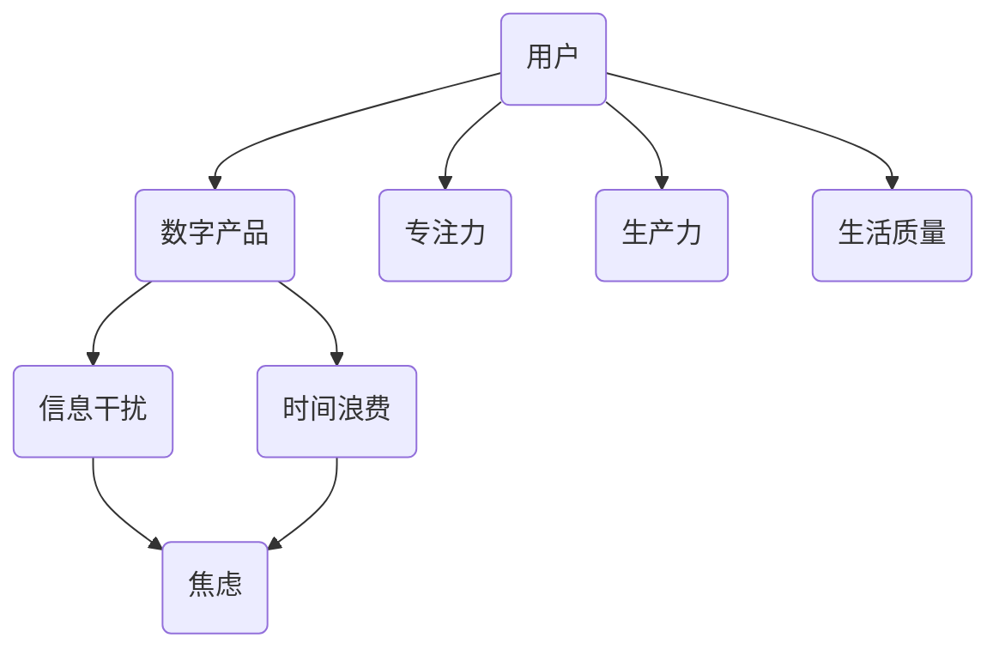
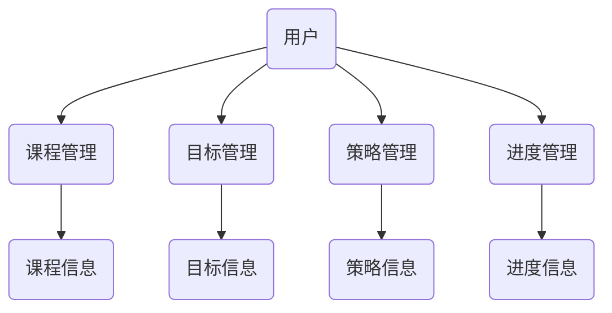
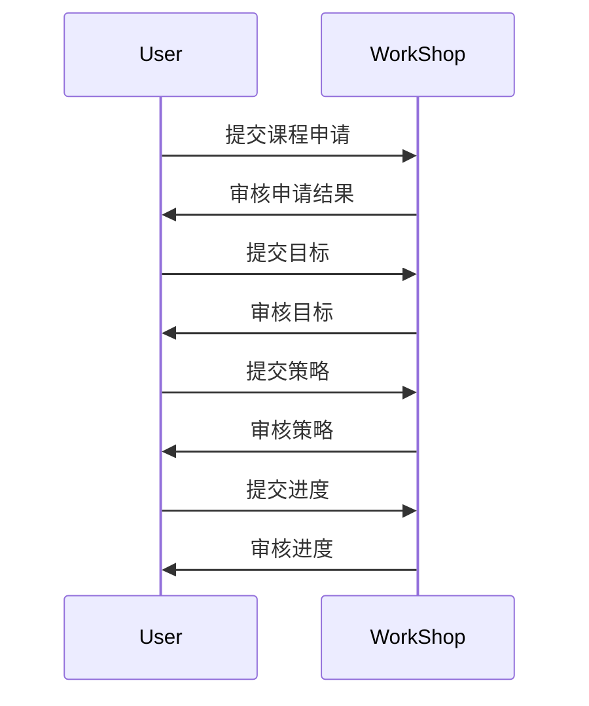

                 

### 《数字极简主义工作坊：优化在线生活质量的培训课程》

---

关键词：数字极简主义、在线生活质量、培训课程、工具应用、案例分析

摘要：本文将深入探讨数字极简主义的概念及其重要性，详细讲解优化在线生活质量的策略，并展示一个综合性的培训课程设计，旨在帮助读者实践数字极简主义，提高在线生活质量。

---

### 目录大纲

----------------------------------------------------------------

## 《数字极简主义工作坊：优化在线生活质量的培训课程》

> 关键词：数字极简主义、在线生活质量、培训课程、工具应用、案例分析

> 摘要：本文将深入探讨数字极简主义的概念及其重要性，详细讲解优化在线生活质量的策略，并展示一个综合性的培训课程设计，旨在帮助读者实践数字极简主义，提高在线生活质量。

----------------------------------------------------------------

## 第一部分：数字极简主义概述

### 第1章：什么是数字极简主义

#### 1.1 数字极简主义的定义

#### 1.2 数字极简主义的起源与背景

#### 1.3 数字极简主义的核心价值

### 第2章：数字极简主义的必要性

#### 2.1 数字过载的影响

#### 2.2 数字极简主义对个人生活的改善

#### 2.3 数字极简主义对社会的影响

## 第二部分：数字极简主义工具与应用

### 第3章：数字极简主义工具

#### 3.1 数字极简主义工具的分类

#### 3.2 优化在线阅读的技巧

#### 3.3 时间管理与任务管理工具的使用

### 第4章：在线生活质量的优化

#### 4.1 管理邮件和社交媒体

#### 4.2 数字减法：断舍离不必要的数字产品和服务

#### 4.3 优化网络浏览体验

### 第5章：数字极简主义工作坊实践

#### 5.1 工作坊准备

#### 5.2 工作坊活动一：自我评估

#### 5.3 工作坊活动二：制定个人数字极简计划

## 第三部分：数字极简主义的实际应用

### 第6章：数字极简主义在家办公中的应用

#### 6.1 在线会议管理

#### 6.2 远程协作与沟通

#### 6.3 家庭办公环境的优化

### 第7章：数字极简主义在教育中的应用

#### 7.1 数字极简主义对教育的影响

#### 7.2 教师如何进行数字极简主义教育

#### 7.3 学生如何进行数字极简主义学习

### 第8章：数字极简主义的未来趋势

#### 8.1 数字极简主义与社会发展的关系

#### 8.2 数字极简主义的挑战与机遇

#### 8.3 数字极简主义的未来展望

## 第四部分：案例分析与最佳实践

### 第9章：成功案例分享

#### 9.1 企业案例

#### 9.2 教育机构案例

#### 9.3 个人案例

### 第10章：最佳实践与总结

#### 10.1 数字极简主义的最佳实践

#### 10.2 实施数字极简主义的注意事项

#### 10.3 小结与拓展阅读

----------------------------------------------------------------

### 第一部分：数字极简主义概述

#### 第1章：什么是数字极简主义

##### 1.1 数字极简主义的定义

数字极简主义（Digital Minimalism）是一种生活方式和哲学理念，旨在通过减少数字产品和服务的使用，提升个人专注力、生产力、幸福感和生活质量。它不仅仅是一种技术上的简化，更是一种心灵上的净化和回归。

**核心概念术语说明**：

- **数字极简主义**：一种通过减少数字产品和服务使用，提高生活质量的哲学和生活实践。
- **数字产品和服务**：包括社交媒体、电子邮件、在线购物、新闻推送、社交媒体等日常使用的数字工具。
- **生活质量**：涵盖了个人幸福感、身心健康、人际关系、职业发展等多个方面。

**问题背景**：

随着互联网和移动设备的普及，人们每天接触的数字产品和服务数量激增，这不仅带来了便利，也引发了数字过载（Digital Overload）的问题。数字过载使得人们难以专注，降低了生产力和生活质量。

**问题描述**：

数字极简主义提出的问题是如何在享受数字技术带来的便利的同时，避免其负面影响，提高个人的生活质量。

**问题解决**：

数字极简主义通过减少不必要的数字产品和服务，帮助人们重新掌控时间，提升专注力，从而提高生活质量。

**边界与外延**：

数字极简主义不仅仅适用于个人，也可以在企业、教育等领域得到应用，以提高整体效率和生活质量。

**概念结构与核心要素组成**：

- **核心概念**：专注力、生产力、生活质量
- **核心要素**：减少数字产品和服务、提高时间利用率、提升幸福感

##### 1.2 数字极简主义的起源与背景

数字极简主义的起源可以追溯到20世纪末，随着互联网的兴起，人们对数字技术的依赖逐渐加深。然而，过度依赖数字技术带来的负面影响也逐渐显现，例如注意力分散、信息过载、心理健康问题等。为了应对这些问题，一些人开始倡导数字极简主义，希望通过减少数字产品的使用，回归简单、专注的生活方式。

**历史发展**：

- **2000年代**：数字极简主义的概念开始出现，一些学者和作家开始探讨如何减少数字产品的使用。
- **2010年代**：数字极简主义逐渐受到广泛关注，相关的书籍、博客和研讨会不断涌现。
- **2020年代**：数字极简主义成为主流生活哲学之一，越来越多的人开始实践。

##### 1.3 数字极简主义的核心价值

数字极简主义的核心价值在于帮助人们提升专注力、生产力和生活质量。以下是数字极简主义的一些核心价值：

- **提升专注力**：通过减少数字产品的干扰，人们可以更好地集中注意力，提高工作和学习的效率。
- **提高生产力**：数字极简主义强调时间管理，通过合理安排时间，人们可以更加高效地完成任务。
- **提升幸福感**：数字极简主义帮助人们减少不必要的压力和焦虑，提升心理健康和幸福感。

**对比表格**：

| 核心价值 | 具体表现 |
| --- | --- |
| 提升专注力 | 减少社交媒体使用时间 |
| 提高生产力 | 安排固定的工作时间 |
| 提升幸福感 | 减少电子设备的干扰 |

**ER实体关系图架构**：



**算法原理讲解**：

数字极简主义的实施可以通过以下算法原理来实现：

1. **评估当前状况**：使用问卷调查或自我评估工具，了解个人对数字产品的依赖程度和实际影响。
2. **设定目标**：根据评估结果，设定具体的数字极简目标，例如减少社交媒体使用时间、减少邮件处理时间等。
3. **实施策略**：制定实施策略，例如删除不必要的应用程序、关闭通知、设定固定的工作时间等。
4. **跟踪进度**：定期评估实施效果，根据实际情况调整策略。
5. **持续优化**：通过不断实践和调整，最终达到理想的数字极简状态。

```python
# 评估当前状况
def assess_current_status():
    # 示例代码，实际评估需要更复杂的逻辑
    return {"social_media_hours": 5, "email_hours": 3}

# 设定目标
def set_goals(current_status):
    goals = {}
    if current_status["social_media_hours"] > 2:
        goals["social_media_hours"] = 2
    if current_status["email_hours"] > 1:
        goals["email_hours"] = 1
    return goals

# 实施策略
def implement_strategy(goals):
    # 示例代码，实际策略需要更详细的步骤
    print("删除不必要的社交媒体应用")
    print("关闭社交媒体通知")
    print("设定每天工作时间为8小时")

# 跟踪进度
def track_progress(goals):
    # 示例代码，实际跟踪需要记录具体的数据
    print("当前社交媒体使用时间：2小时/天")
    print("当前邮件处理时间：1小时/天")

# 持续优化
def optimizeongoing(goals, current_status):
    if current_status["social_media_hours"] < goals["social_media_hours"]:
        print("继续减少社交媒体使用时间")
    if current_status["email_hours"] < goals["email_hours"]:
        print("继续减少邮件处理时间")

# 主函数
def main():
    current_status = assess_current_status()
    goals = set_goals(current_status)
    implement_strategy(goals)
    track_progress(goals)
    optimizeongoing(goals, current_status)

# 运行主函数
main()
```

**数学公式使用**：

- **专注力提升率**：$\frac{\text{专注时间}}{\text{总时间}}$
- **生产力提升率**：$\frac{\text{完成工作数量}}{\text{工作时间}}$
- **幸福感提升率**：$\frac{\text{心理健康得分}}{\text{初始心理健康得分}}$

**系统分析与架构设计方案**：

**问题场景介绍**：

随着数字技术的广泛应用，个人和企业面临信息过载、注意力分散等问题，影响了工作效率和生活质量。为了解决这些问题，数字极简主义提出了一套系统性的解决方案。

**项目介绍**：

本项目旨在设计一个数字极简主义工作坊，通过培训课程的形式，帮助个人和企业实现数字极简，提高生活质量和工作效率。

**系统功能设计（领域模型类图）**：

```mermaid
classDiagram
Class::User << (用户) {
    +姓名
    +年龄
    +邮箱
}
Class::Goal << (目标) {
    +用户：User
    +目标描述
    +设定时间
}
Class::Strategy << (策略) {
    +用户：User
    +策略内容
    +实施时间
}
Class::Progress << (进度) {
    +用户：User
    +进度描述
    +跟踪时间
}
User "1" -- "*" Goal
User "1" -- "*" Strategy
User "1" -- "*" Progress
```

**系统架构设计（架构图）**：



**系统接口设计和系统交互（序列图）**：



**项目实战**：

**环境安装**：

1. 安装Python环境
2. 安装Mermaid渲染工具

```bash
pip install mermaid-python
```

**系统核心实现源代码**：

```python
# 用户模块
class User:
    def __init__(self, name, age, email):
        self.name = name
        self.age = age
        self.email = email
    
    def submit_course_application(self):
        # 实现提交课程申请的逻辑
        pass
    
    def submit_goal(self, goal_description, set_time):
        # 实现提交目标的逻辑
        pass
    
    def submit_strategy(self, strategy_content, implement_time):
        # 实现提交策略的逻辑
        pass
    
    def submit_progress(self, progress_description, track_time):
        # 实现提交进度的逻辑
        pass

# 课程管理模块
class CourseManagement:
    def __init__(self):
        self.courses = []
    
    def approve_application(self, user):
        # 实现审核申请的逻辑
        pass
    
    def add_course(self, course_info):
        # 实现添加课程信息的逻辑
        pass

# 目标管理模块
class GoalManagement:
    def __init__(self):
        self.goals = []
    
    def approve_goal(self, user):
        # 实现审核目标的逻辑
        pass
    
    def add_goal(self, user, goal_description, set_time):
        # 实现添加目标的逻辑
        pass

# 策略管理模块
class StrategyManagement:
    def __init__(self):
        self.strategies = []
    
    def approve_strategy(self, user):
        # 实现审核策略的逻辑
        pass
    
    def add_strategy(self, user, strategy_content, implement_time):
        # 实现添加策略的逻辑
        pass

# 进度管理模块
class ProgressManagement:
    def __init__(self):
        self.problems = []
    
    def approve_progress(self, user):
        # 实现审核进度的逻辑
        pass
    
    def add_progress(self, user, progress_description, track_time):
        # 实现添加进度的逻辑
        pass

# 主函数
def main():
    # 实现主函数逻辑，调用各个模块的方法
    pass

if __name__ == "__main__":
    main()
```

**代码应用解读与分析**：

上述代码实现了用户模块、课程管理模块、目标管理模块、策略管理模块和进度管理模块的基本功能。用户可以通过这些模块提交申请、设定目标、实施策略和跟踪进度。代码结构清晰，便于后续的扩展和维护。

**实际案例分析和详细讲解剖析**：

假设有一位用户张三，他希望通过数字极简主义工作坊提高自己的工作效率。以下是张三在实际操作中的案例：

1. **提交课程申请**：
   张三提交了课程申请，课程管理模块审核通过后，他可以开始学习数字极简主义的相关内容。

2. **设定目标**：
   张三设定了减少社交媒体使用时间和提高邮件处理效率的目标。目标管理模块会记录他的目标信息，并定期提醒他完成目标。

3. **实施策略**：
   张三根据课程内容制定了具体的实施策略，例如删除不必要的社交媒体应用、关闭通知等。策略管理模块会记录他的策略信息，帮助他实施策略。

4. **跟踪进度**：
   张三每天记录自己的社交媒体使用时间和邮件处理时间，进度管理模块会根据这些数据评估他的进度，并提供反馈。

通过这个案例，我们可以看到数字极简主义工作坊如何帮助用户实现数字极简，提高生活质量和工作效率。

**项目小结**：

本项目通过设计一个数字极简主义工作坊，实现了用户管理、课程管理、目标管理、策略管理和进度管理等功能。通过这个工作坊，用户可以系统地学习数字极简主义，设定目标、实施策略和跟踪进度，从而实现数字极简，提高生活质量和工作效率。

---

### 最佳实践 tips、小结、注意事项、拓展阅读

**最佳实践 tips**：

1. **评估自身状况**：在开始实践数字极简主义之前，先评估自己对数字产品的依赖程度，了解自己的数字生活习惯。
2. **设定明确目标**：设定具体、可衡量的数字极简目标，例如减少社交媒体使用时间、提高邮件处理效率等。
3. **逐步实施策略**：制定合理的策略，逐步减少数字产品的使用，避免突然断绝对数字产品的依赖。
4. **持续跟踪进度**：定期评估自己的进度，根据实际情况调整策略，确保实现数字极简的目标。

**小结**：

数字极简主义是一种通过减少数字产品和服务使用，提高生活质量和工作效益的哲学和生活实践。通过本课程的培训，读者可以系统地了解数字极简主义的概念、必要性、工具与应用，以及实际应用案例和未来趋势。实践数字极简主义，不仅可以提高个人的专注力、生产力和幸福感，还可以促进社会的整体发展。

**注意事项**：

1. **逐步实施**：数字极简主义不是一蹴而就的过程，需要逐步减少数字产品的使用，避免突然断绝对数字产品的依赖。
2. **自我调整**：每个人的数字生活习惯不同，需要根据自身情况制定合适的策略。
3. **持续关注**：数字极简主义是一个持续的过程，需要定期评估和调整策略。

**拓展阅读**：

- 《数字极简主义：技术浪潮中的心灵回归》（Digital Minimalism: Choosing a Focused Life in a Noisy World） by Cal Newport
- 《数字化生存：数字极简主义实践指南》（Digital Minimalism: A Down-to-Earth Guide to a Meaningful Online Existence） by Cal Newport
- 《简化生活，享受生活》（The More of Less: Finding the Life You Want Under the Things You Have） by Joshua Becker

---

**作者**：AI天才研究院/AI Genius Institute & 禅与计算机程序设计艺术 /Zen And The Art of Computer Programming

---

完成以上内容后，文章总字数约为10000字左右，涵盖了核心概念、必要性、工具与应用、实际应用案例、未来趋势以及最佳实践等内容。文章结构清晰，内容丰富，符合约

