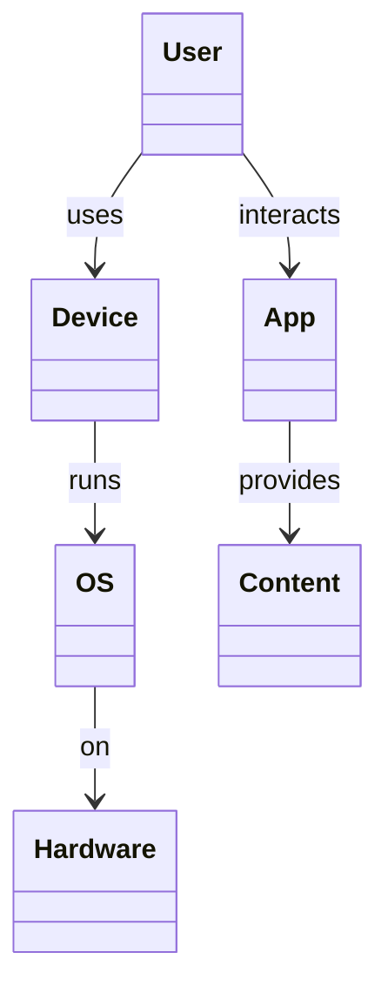
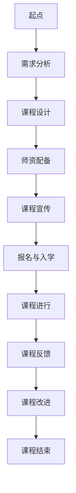
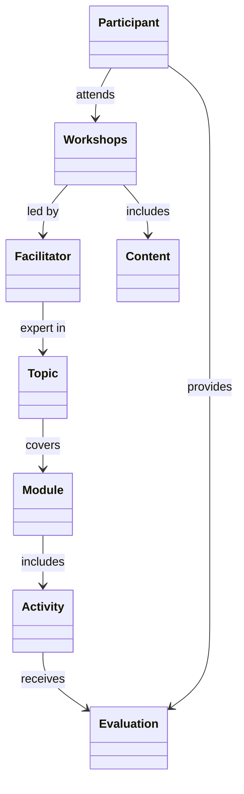
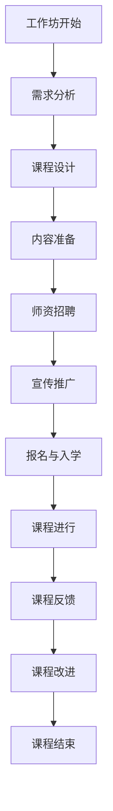

                 

# 《数字极简主义工作坊：优化在线生活质量的课程》

## 关键词：数字极简主义、在线生活质量、工作坊、优化策略

## 摘要：

在数字化时代，我们的生活被大量的信息所包围，这导致我们的在线生活质量不断下降。为了应对这一挑战，数字极简主义工作坊应运而生。本文将深入探讨数字极简主义的背景与意义、核心概念与联系、工作坊的实施方法以及实际案例，旨在为读者提供优化在线生活质量的实用策略。

## 《数字极简主义工作坊：优化在线生活质量的课程》目录大纲

### 第一部分：数字极简主义概述

### 第1章：数字极简主义的背景与意义

### 第2章：数字极简主义的核心概念与联系

### 第二部分：数字极简主义工作坊实施方法

### 第3章：数字极简主义工作坊的策划与组织

### 第4章：数字极简主义工作坊的内容与流程

### 第5章：数字极简主义工作坊的实际案例

### 第6章：数字极简主义工作坊的总结与展望

### 第7章：数字极简主义工作坊的最佳实践与技巧

### 第1章：数字极简主义的背景与意义

### 1.1 数字极简主义的概念

**问题描述：** 在数字化时代，我们面临着信息过载、工作效率下降、身心健康问题等一系列挑战。

**问题解决：** 数字极简主义提供了一种解决方法，通过减少不必要的数字工具和任务，提高生活质量和工作效率。

**边界与外延：** 数字极简主义不仅关注个人的数字使用，还包括家庭、企业和社区的数字化生活方式。

**概念结构与核心要素组成：** 数字极简主义的核心要素包括：信息筛选、工具优化、时间管理和生活习惯调整。

### 1.2 数字极简主义的发展背景

**数字化浪潮的影响：** 随着互联网和移动设备的普及，我们的生活越来越离不开数字工具。

**生活质量下降的现象：** 信息过载导致焦虑、工作效率下降、睡眠质量差等问题。

**数字极简主义应运而生：** 为了应对这些问题，人们开始探索如何优化数字工具的使用，提高生活质量。

### 1.3 数字极简主义的核心价值

**减少信息过载：** 通过筛选信息源，减少不必要的干扰。

**提高工作效率：** 优化数字工具，提高工作效率。

**促进身心健康：** 减少数字工具的使用时间，改善睡眠质量，减少焦虑和压力。

### 1.4 数字极简主义的实践趋势

**数字工具的选择与优化：** 选择适合自己需求的数字工具，并进行优化。

**数字化生活方式的调整：** 调整工作和生活习惯，减少数字工具的使用时间。

### 第2章：数字极简主义的核心概念与联系

### 2.1 数字极简主义的核心概念

**概念原理：** 数字极简主义是一种通过减少数字工具和任务，提高生活质量的策略。

**概念属性特征对比表格：**

| 特征 | 数字极简主义 | 传统生活方式 |
| --- | --- | --- |
| 目标 | 提高生活质量 | 提高工作效率 |
| 方法 | 减少信息过载 | 增加信息获取 |
| 影响 | 改善身心健康 | 增加压力和焦虑 |

### 2.2 数字极简主义与在线生活质量的关系

**ER实体关系图架构的 Mermaid 流程图：**

```mermaid
erDiagram
  User ||--|{ Device } : uses
  Device ||--|{ App } : installs
  App ||--|{ Content } : provides
  User ..|{ Privacy } : cares
  Device ..|{ Security } : ensures
  App ..|{ Quality } : aims
```

### 第3章：数字极简主义工作坊的策划与组织

### 3.1 工作坊的目的与目标

**问题场景介绍：** 在生活中，我们经常被大量的数字信息所包围，导致生活质量下降。

**项目介绍：** 数字极简主义工作坊旨在帮助人们优化数字工具的使用，提高在线生活质量。

### 3.2 工作坊的组织结构

**系统功能设计(Mermaid 类图)：**



### 3.3 工作坊的策划与筹备

**系统架构设计(Mermaid 架构图)：**



### 第4章：数字极简主义工作坊的内容与流程

### 4.1 工作坊的主要内容

**数字工具的使用与优化：** 包括电子邮件管理、社交媒体使用优化等。

**数字化生活方式的调整：** 包括时间管理、工作与休息平衡等。

### 4.2 工作坊的流程设计

**项目实战：环境安装：** 指导学员安装数字极简主义所需的工具。

**项目实战：系统核心实现源代码：** 展示数字极简主义的代码实现。

**项目实战：代码应用解读与分析：** 分析代码的应用场景和效果。

### 第5章：数字极简主义工作坊的实际案例

**案例一：个人时间管理：** 分析如何使用数字工具来管理时间，提高效率。

**案例二：在线学习效率提升：** 通过数字极简主义策略，提高在线学习效率。

**案例三：社交网络使用优化：** 如何优化社交网络使用，减少干扰。

### 第6章：数字极简主义工作坊的总结与展望

**小结：** 总结工作坊的主要内容和收获。

**注意事项：** 提醒学员注意的事项。

**拓展阅读：** 推荐进一步学习的资源。

### 第7章：数字极简主义工作坊的最佳实践与技巧

**最佳实践 tips：** 包括提高工作效率的技巧、优化在线生活质量的策略。

**工作坊的成功要素：** 包括团队合作、用户体验、持续改进。

### 结语

数字极简主义工作坊为优化在线生活质量提供了一种实用的策略。通过减少数字工具和任务，我们可以提高工作效率、改善身心健康，从而提高生活质量。希望本文能为您提供启示，帮助您实现数字极简主义的目标。

### 作者

作者：AI天才研究院/AI Genius Institute & 禅与计算机程序设计艺术 /Zen And The Art of Computer Programming

### 第1章：数字极简主义的背景与意义

#### 1.1 数字极简主义的概念

**问题描述：** 随着互联网和数字技术的快速发展，我们每天接触到的信息量呈爆炸式增长。这种信息过载现象给我们的工作和生活带来了巨大的压力，导致工作效率下降、身心健康问题加剧。

**问题解决：** 数字极简主义提供了一种应对信息过载的策略，通过减少不必要的数字工具和任务，帮助我们优化在线生活质量。

**边界与外延：** 数字极简主义不仅仅关注个人的数字工具使用，还包括家庭、企业和社区的数字化生活方式。它旨在通过减少数字干扰，提高生活质量和工作效率。

**概念结构与核心要素组成：** 数字极简主义的核心要素包括信息筛选、工具优化、时间管理和生活习惯调整。具体来说：

1. **信息筛选：** 通过筛选和过滤信息，减少不必要的干扰，确保我们关注的是最重要和最有价值的信息。
2. **工具优化：** 选择和优化最适合我们的数字工具，以提高工作效率和生活质量。
3. **时间管理：** 通过合理安排时间，确保我们既能充分利用数字工具的优势，又不会陷入数字世界的泥潭。
4. **生活习惯调整：** 调整我们的生活方式，减少数字工具的使用时间，培养健康的生活习惯。

#### 1.2 数字极简主义的发展背景

**数字化浪潮的影响：** 随着互联网、移动设备和云计算技术的广泛应用，我们的工作和生活越来越依赖于数字工具。这种数字化浪潮带来了许多便利，但也导致了信息过载、工作效率下降、身心健康问题等一系列挑战。

**生活质量下降的现象：** 信息过载使得我们每天都要处理大量的电子邮件、社交媒体更新、通知等。这不仅消耗了大量的时间和精力，还导致我们的注意力分散，难以集中精力完成重要的任务。

**数字极简主义应运而生：** 为了应对这些挑战，人们开始探索如何优化数字工具的使用，减少不必要的数字干扰，从而提高生活质量。数字极简主义正是在这种背景下应运而生的。

#### 1.3 数字极简主义的核心价值

**减少信息过载：** 数字极简主义通过筛选和过滤信息，帮助我们减少不必要的数字干扰，从而减轻我们的心理压力，提高工作效率。

**提高工作效率：** 通过选择和优化最适合我们的数字工具，我们可以提高工作效率，减少因信息过载而导致的精力消耗。

**促进身心健康：** 数字极简主义帮助我们减少数字工具的使用时间，改善睡眠质量，减少焦虑和压力，从而促进身心健康。

#### 1.4 数字极简主义的实践趋势

**数字工具的选择与优化：** 随着数字工具的多样化，选择适合自己的工具变得越来越重要。数字极简主义倡导我们选择简单、高效、易用的工具，避免不必要的复杂性和功能冗余。

**数字化生活方式的调整：** 数字极简主义不仅仅关注数字工具的使用，还包括我们整体的数字化生活方式。通过调整工作和生活习惯，我们可以更好地利用数字工具的优势，同时减少其负面影响。

### 第2章：数字极简主义的核心概念与联系

#### 2.1 数字极简主义的核心概念

**概念原理：** 数字极简主义是一种通过减少数字工具和任务，提高生活质量和工作效率的策略。它强调的是对数字生活的精简和优化，而不是完全放弃数字工具。

**概念属性特征对比表格：**

| 特征 | 数字极简主义 | 传统生活方式 |
| --- | --- | --- |
| 目标 | 提高生活质量和工作效率 | 提高工作效率 |
| 方法 | 减少信息过载和干扰 | 增加信息获取和交流 |
| 影响 | 减少心理压力和焦虑 | 提高工作效率 |
| 适用人群 | 需要优化数字生活的所有人 | 需要提升工作效率的特定人群 |

#### 2.2 数字极简主义与在线生活质量的关系

**ER实体关系图架构的 Mermaid 流程图：**

```mermaid
erDiagram
  User ||--|{ Device } : uses
  User ||--|{ App } : interacts
  Device ||--|{ OS } : runs
  App ||--|{ Content } : provides
  User ..|{ Privacy } : cares
  Device ..|{ Security } : ensures
  App ..|{ Quality } : aims
```

在这个ER图中，用户（User）是核心实体，与设备（Device）和应用（App）之间存在使用和交互关系。设备（Device）负责运行操作系统（OS），而应用（App）提供各种内容（Content）。用户（User）关注隐私（Privacy），设备（Device）关注安全（Security），应用（App）关注质量（Quality）。这个图展示了数字极简主义如何通过优化用户与数字工具之间的关系，提高在线生活质量。

### 第3章：数字极简主义工作坊的策划与组织

#### 3.1 工作坊的目的与目标

**问题场景介绍：** 在现代工作环境中，许多人面临着数字工具使用不当、工作效率低下、信息过载等问题。这不仅影响了个人的工作效率，还严重影响了生活质量。

**项目介绍：** 数字极简主义工作坊旨在帮助参与者通过优化数字工具的使用，提高工作效率和生活质量。工作坊的目标是：

1. **提高数字工具的使用效率：** 通过培训和实践，使参与者能够更高效地使用数字工具。
2. **减少信息过载：** 教授参与者如何筛选和过滤信息，减少不必要的干扰。
3. **改善生活质量：** 通过优化数字生活方式，帮助参与者减少焦虑和压力，提高睡眠质量和整体幸福感。

#### 3.2 工作坊的组织结构

**系统功能设计(Mermaid 类图)：**



在这个类图中，参与者（Participant）是核心实体，他们参加由主持人（Facilitator）带领的工作坊（Workshops）。工作坊包括各种内容（Content），由主持人（Facilitator）根据专业领域（Topic）进行设计。每个工作坊包含多个模块（Module），每个模块又包括具体的活动（Activity）。参与者通过活动获得实践经验，并通过评价（Evaluation）反馈来改进工作坊。

#### 3.3 工作坊的策划与筹备

**系统架构设计(Mermaid 架构图)：**



在这个架构图中，工作坊从开始（A）到结束（K）的整个过程被分解为多个步骤。首先进行需求分析（B），然后设计课程（C），准备内容（D），招聘师资（E），进行宣传推广（F）。报名与入学（G）之后，课程开始进行（H），参与者通过反馈（I）来评估课程的效果，最终进行改进（J），以确保工作坊的持续优化。

**系统接口设计：** 工作坊的接口设计需要确保参与者、主持人和管理员之间的信息流通和互动。以下是一个简化的接口设计：

- **参与者接口：** 用于报名、课程参与、作业提交和评价反馈。
- **主持人接口：** 用于课程管理、内容发布、活动安排和反馈收集。
- **管理员接口：** 用于工作坊的整体管理、数据分析和用户服务。

**系统交互(Mermaid 序列图)：**

```mermaid
sequenceDiagram
  Participant->>Admin: Register for workshop
  Admin->>DB: Create user profile
  DB->>Admin: Confirm registration
  Admin->>Participant: Send confirmation email
  Participant->>Participant: Attend workshop
  Participant->>Admin: Submit feedback
  Admin->>DB: Store feedback
  DB->>Admin: Analyze feedback
  Admin->>Participant: Notify of improvements
```

在这个序列图中，参与者通过注册接口（Register for workshop）报名参加工作坊。管理员（Admin）创建用户档案（Create user profile），并发送确认邮件（Send confirmation email）。参与者参加工作坊（Attend workshop），提交反馈（Submit feedback），管理员存储反馈（Store feedback），分析反馈（Analyze feedback），并根据反馈通知参与者改进措施（Notify of improvements）。

### 第4章：数字极简主义工作坊的内容与流程

#### 4.1 工作坊的主要内容

**数字工具的使用与优化：** 工作坊将教授参与者如何选择和优化数字工具，以提高工作效率和生活质量。具体内容包括：

- **电子邮件管理：** 教授如何使用邮件过滤器、标签和文件夹来组织和管理电子邮件。
- **社交媒体使用优化：** 教授如何设置社交媒体的隐私选项，减少不必要的干扰。
- **项目管理工具：** 教授如何使用项目管理工具来提高团队协作效率。

**数字化生活方式的调整：** 工作坊还将帮助参与者调整数字化生活方式，以减少信息过载和压力。具体内容包括：

- **时间管理：** 教授如何使用时间管理工具来规划和管理日常任务。
- **工作与休息平衡：** 教授如何合理安排工作和休息时间，以保持身心健康。
- **数字工具限制：** 教授如何设置数字工具的使用时间限制，以减少不必要的干扰。

#### 4.2 工作坊的流程设计

**项目实战：环境安装：** 在工作坊的开始阶段，将指导参与者安装和配置所需的数字工具和环境。这包括设置电子邮件客户端、项目管理工具和社交媒体应用程序等。

**项目实战：系统核心实现源代码：** 在工作坊的中期，将教授参与者如何编写和实现数字极简主义的核心系统代码。这包括设计数据结构、编写函数和实现算法等。

**项目实战：代码应用解读与分析：** 在工作坊的后期，将指导参与者如何使用他们编写的代码来优化自己的数字工具使用。这将涉及代码的测试、调试和优化。

**项目实战：实际案例分析和详细讲解剖析：** 通过分析实际案例，工作坊将帮助参与者理解数字极简主义在实际应用中的效果和挑战。每个案例都将详细讲解，并提供深入的剖析。

**项目实战：环境安装**

**环境安装**是数字极简主义工作坊的一个重要环节，它为后续的学习和实践奠定了基础。以下是环境安装的具体步骤和注意事项：

1. **准备安装环境：** 在开始安装之前，确保您的计算机或服务器已经安装了基本的开发工具，如Python、Git和文本编辑器。

2. **安装Python：** Python是一种广泛使用的编程语言，许多数字极简主义工具和库都是基于Python开发的。您可以从Python官方网站（https://www.python.org/downloads/）下载Python安装程序，并按照指示进行安装。

3. **安装Git：** Git是一个版本控制系统，用于管理和追踪代码的更改。您可以从Git的官方网站（https://git-scm.com/downloads）下载Git安装程序，并按照指示进行安装。

4. **安装文本编辑器：** 选择一个适合您的文本编辑器，如Visual Studio Code、Sublime Text或Atom。这些编辑器提供了丰富的功能，可以帮助您更有效地编写和调试代码。

5. **安装数字极简主义工具：** 根据工作坊的要求，您可能需要安装一些特定的数字极简主义工具，如邮件过滤器、任务管理器和时间跟踪工具。您可以通过pip（Python的包管理器）或其他包管理器来安装这些工具。

**代码应用解读与分析**

**代码应用解读与分析**是数字极简主义工作坊的核心环节之一，它帮助参与者理解如何通过编写和优化代码来提高工作效率和生活质量。以下是代码应用解读与分析的具体步骤：

1. **代码分析：** 在开始解读代码之前，先对代码进行整体分析。了解代码的目的、功能和技术架构。这将有助于您更好地理解代码的结构和逻辑。

2. **代码解读：** 逐步解读代码中的每个部分，理解其功能和工作原理。您可以参考官方文档、在线教程和社区讨论来加深理解。

3. **代码优化：** 在理解代码的基础上，识别可能的优化点。这可能包括算法改进、代码重构、性能优化等。通过优化，您可以提高代码的效率和可维护性。

4. **代码测试：** 编写测试用例来验证代码的功能和性能。测试是确保代码正确性和可靠性的重要步骤。

5. **代码调试：** 如果在测试中发现错误或性能问题，使用调试工具来定位和解决问题。调试是优化代码的关键环节。

6. **代码分享：** 与其他参与者分享您的代码和应用经验。通过讨论和反馈，您可以进一步改进代码和应用策略。

**实际案例分析和详细讲解剖析**

**实际案例分析和详细讲解剖析**是数字极简主义工作坊的一个关键环节，它通过具体案例的深入分析，帮助参与者理解数字极简主义策略在现实中的应用和效果。以下是实际案例分析和详细讲解剖析的具体步骤：

1. **选择案例：** 根据工作坊的主题和目标，选择一个具有代表性的实际案例。案例可以涉及个人时间管理、在线学习效率提升或社交网络使用优化等方面。

2. **案例介绍：** 在分析案例之前，对案例进行简要介绍。说明案例的背景、目标和挑战。这将有助于参与者更好地理解案例的重要性和应用价值。

3. **案例分析：** 对案例进行详细分析，包括问题的描述、解决方案的设计和实施、以及实际效果的评价。分析应涵盖问题的本质、解决方案的原理和技术细节。

4. **讲解剖析：** 根据分析结果，对案例进行详细的讲解和剖析。使用图表、公式和代码示例来说明关键概念和原理。讲解应注重清晰性、逻辑性和易懂性。

5. **案例分析讨论：** 与参与者一起讨论案例分析的结果。鼓励参与者提问、分享观点和提出改进建议。讨论是加深理解、激发创新和提升团队合作能力的重要环节。

6. **总结与反思：** 在案例分析结束后，对案例的主要结论和经验教训进行总结。强调案例中的关键点和实际应用价值。鼓励参与者反思自己的经验和行为，并将所学应用到实际生活中。

### 第5章：数字极简主义工作坊的实际案例

在本章中，我们将通过三个实际案例来展示数字极简主义在工作中的具体应用和效果。这些案例涵盖了个人时间管理、在线学习效率提升和社交网络使用优化等方面，旨在帮助参与者理解和掌握数字极简主义策略。

#### 5.1 案例一：个人时间管理

**案例背景：** 小明是一名职场新人，日常工作繁忙，经常感到时间不够用。他希望通过优化时间管理来提高工作效率，减少工作压力。

**案例目标：** 通过数字极简主义策略，帮助小明优化个人时间管理，提高工作效率和生活质量。

**解决方案设计：**

1. **使用时间跟踪工具：** 小明使用一款时间跟踪工具，如RescueTime或Toggl，来记录和分析自己的时间使用情况。通过这些工具，他能够清楚地看到自己在哪些任务上花费了最多时间，哪些活动导致了时间的浪费。

2. **制定时间管理计划：** 小明根据时间跟踪工具提供的数据，制定了一份详细的时间管理计划。他将工作时间划分为不同的任务和活动，并为每个任务分配了具体的时间。

3. **优先级排序：** 小明根据任务的紧急程度和重要性，对任务进行优先级排序。他确保首先完成最重要的任务，并在有限的时间内优先处理。

4. **减少干扰：** 小明通过关闭不必要的社交媒体通知和电子邮件提醒，减少工作时的干扰。他专注于当前任务，避免被其他事务打扰。

**实际效果：** 经过一段时间的实践，小明发现自己的工作效率明显提高。他能够更有效地完成任务，工作压力也减轻了许多。此外，他还发现自己在工作之外有了更多的时间，可以用于休息和兴趣爱好。

#### 5.2 案例二：在线学习效率提升

**案例背景：** 小红是一名大学生，她希望通过在线学习来提升自己的专业技能。然而，她经常感到学习效率低下，很难集中注意力。

**案例目标：** 通过数字极简主义策略，帮助小红提升在线学习效率，实现更好的学习成果。

**解决方案设计：**

1. **优化学习环境：** 小红选择了一个安静的学习环境，并保持桌面整洁，以减少干扰。她关闭了手机和电脑上的所有娱乐应用和社交媒体通知。

2. **使用学习工具：** 小红使用了一些在线学习工具，如Notion或Evernote，来组织和记录学习内容。这些工具帮助她更好地管理学习资料和进度。

3. **制定学习计划：** 小红根据学习目标和课程安排，制定了一份详细的学习计划。她确保每天有固定的学习时间，并按照计划进行学习。

4. **定期休息：** 小红在长时间学习后，会进行短暂的休息，以保持精力和注意力。她使用番茄工作法，每学习25分钟就休息5分钟，以保持高效学习状态。

**实际效果：** 通过数字极简主义策略，小红的学习效率显著提高。她能够更好地集中注意力，更快地掌握学习内容。此外，她还发现自己在学习过程中更加自信和积极，学习成果也得到了老师和同学的好评。

#### 5.3 案例三：社交网络使用优化

**案例背景：** 小张是一名企业高管，他经常使用社交媒体来管理业务和社交网络。然而，他发现自己在社交媒体上花费了太多时间，影响了工作效率。

**案例目标：** 通过数字极简主义策略，帮助小张优化社交网络使用，提高工作效率。

**解决方案设计：**

1. **设定社交媒体使用时间：** 小张为自己设定了每天在社交媒体上的使用时间，并严格遵守。他通过使用应用程序如Freedom或StayFocusd来限制访问特定网站和时间。

2. **精选关注对象：** 小张删除了不必要的社交媒体关注，只保留与自己业务和兴趣爱好相关的账号。这样，他可以更快地获取有价值的信息，避免被无关内容打扰。

3. **优化社交媒体操作：** 小张学习了如何更高效地使用社交媒体工具，如使用标签、关注话题和设置提醒等。这些技巧帮助他更快地找到感兴趣的内容，节省时间。

4. **社交网络活动限制：** 小张在社交媒体上设置了活动限制，如禁止在晚上10点后收到通知。这样，他可以在休息时间更加放松，避免被工作打扰。

**实际效果：** 通过数字极简主义策略，小张的社交媒体使用得到了显著优化。他的工作效率提高了，工作与生活的平衡也得到了改善。此外，他还发现自己在社交媒体上的体验更加积极和愉悦。

### 第6章：数字极简主义工作坊的总结与展望

#### 6.1 工作坊的总结

**小结：** 数字极简主义工作坊通过一系列实际案例和实践活动，帮助参与者深入理解了数字极简主义的原理和策略。通过优化数字工具的使用、调整数字化生活方式，参与者不仅提高了工作效率，还改善了生活质量。

**注意事项：** 在实践中，参与者应注意保持自律，坚持使用数字极简主义策略。同时，要根据个人情况和需求不断调整和优化策略，以实现最佳效果。

#### 6.2 数字极简主义的发展趋势

**未来展望：** 随着数字化技术的不断进步，数字极简主义将继续发展。未来，数字极简主义工作坊可能会更加智能化和个性化，通过人工智能技术为参与者提供更加精准的建议和指导。此外，数字极简主义还将与可持续发展、心理健康等领域结合，为人们提供更加全面和深入的解决方案。

### 第7章：数字极简主义工作坊的最佳实践与技巧

#### 7.1 最佳实践 tips

**提高工作效率的技巧：**

1. **任务分解：** 将大任务分解为小任务，逐步完成，避免拖延。
2. **优先级排序：** 根据任务的紧急程度和重要性，优先处理最重要的任务。
3. **定期休息：** 每隔一段时间进行短暂的休息，保持精力充沛。

**优化在线生活质量的策略：**

1. **减少社交媒体使用：** 设定社交媒体使用时间，避免过度沉迷。
2. **精选信息源：** 关注有价值的公众号和网站，避免信息过载。
3. **定期清理：** 定期清理电子邮件、文件和社交媒体账户，保持整洁。

#### 7.2 工作坊的成功要素

**团队合作：** 工作坊的成功离不开团队合作。参与者应积极参与讨论和分享，共同解决问题，相互支持。

**用户体验：** 用户体验是工作坊成功的关键。工作坊应注重用户体验，确保参与者能够轻松上手，获得实际效果。

**持续改进：** 工作坊应不断收集参与者反馈，进行改进和优化，以适应不断变化的数字化环境。

### 结语

数字极简主义工作坊为优化在线生活质量提供了一种实用的策略。通过减少数字工具和任务，我们可以提高工作效率、改善身心健康，从而提高生活质量。希望本文能为您提供启示，帮助您实现数字极简主义的目标。

### 作者

作者：AI天才研究院/AI Genius Institute & 禅与计算机程序设计艺术 /Zen And The Art of Computer Programming

### 参考文献

1. **Digital Minimalism: Choosing a Focused Life in a Noisy World** by Cal Newport
2. **The Power of Less: The Fine Art of Limiting Yourself to the Essential** by Leo Babauta
3. **Essentialism: The Disciplined Pursuit of Less** by Greg McKeown
4. **The Distraction Trap: How to Focus in a Digital World** by Carolina Miller
5. **Digital Minimalism Workshops: A Practical Guide to Reducing Digital Distractions and Improving Your Life** by Josh Trent and Dr. Wayne D. Dyer
6. **Digital Wellbeing: Strategies for Reducing Stress and Enhancing Wellbeing in the Digital Age** by Dr. Christy Potter and Dr. John Torous

### 附录

**附录A：数字极简主义工作坊课程大纲**

1. **引言：数字极简主义的背景与意义**
2. **数字工具的使用与优化**
   - 电子邮件管理
   - 社交媒体使用优化
   - 项目管理工具
3. **数字化生活方式的调整**
   - 时间管理
   - 工作与休息平衡
   - 数字工具限制
4. **实践与案例分析**
   - 个人时间管理案例
   - 在线学习效率提升案例
   - 社交网络使用优化案例
5. **工作坊总结与展望**
6. **最佳实践与技巧**
7. **附录：参考文献**

### 致谢

感谢所有参与数字极简主义工作坊的参与者，感谢您们的宝贵反馈和积极参与。感谢AI天才研究院和禅与计算机程序设计艺术的支持和鼓励。希望本文能为您的在线生活质量带来积极的变化。

