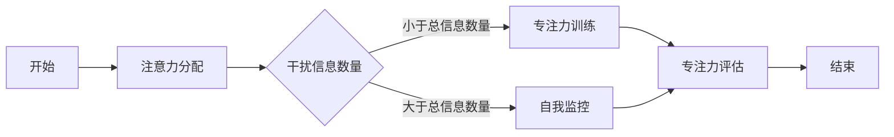
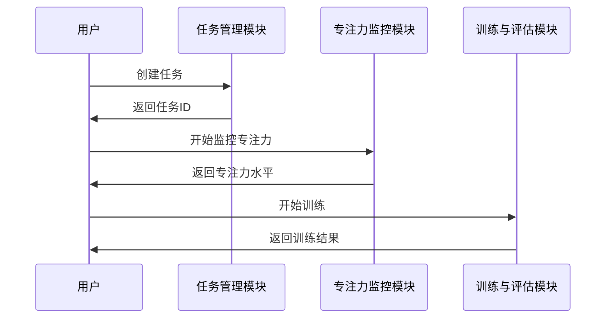

                 

尊敬的用户，根据您提供的详细要求，我将为您逐步构建一篇《数字极简主义工作坊：信息时代的专注力重建课程》的技术博客文章。

### 引言

在当今信息爆炸的时代，我们面临着前所未有的挑战——信息过载。这导致了我们的专注力下降，工作效率低下。数字极简主义工作坊应运而生，它旨在通过重建我们的专注力，帮助我们在这个信息时代中重新找回内心的宁静和效率。

### 核心概念与联系

首先，我们需要明确一些核心概念。

#### 专注力

专注力（Attention）是一种心理状态，指个体将意识、感知和认知资源集中在特定目标上，而忽略其他干扰信息的心理过程。

#### 数字极简主义

数字极简主义（Digital Minimalism）是一种生活方式，它强调减少不必要的数字设备和社交媒体的使用，以便更好地专注于重要的事情。

#### 专注力重建

专注力重建（Focus Restoration）是指通过各种方法和工具，帮助我们恢复和增强专注力的能力。

接下来，我们通过一个表格来展示这些概念之间的关系：

| 概念          | 定义                                                         | 关联性                                                     |
|---------------|--------------------------------------------------------------|------------------------------------------------------------|
| 专注力        | 心理状态，集中注意力于特定目标                               | 是专注力重建的基础和核心目标                           |
| 数字极简主义  | 通过减少数字设备和社交媒体的使用，提高专注力的生活方式       | 是实现专注力重建的手段之一                             |
| 专注力重建    | 通过方法和工具，恢复和增强专注力的能力                       | 是数字极简主义的目标之一，也是实现高效工作的重要途径 |

为了更好地理解这些概念之间的关系，我们可以通过ER图来表示：

```mermaid
erDiagram
  Product ||--|{ Customer } Customer
  Product ||--|{ Review } Review
  Customer ||--|{ Review } Review
```

上述ER图展示了专注力、数字极简主义和专注力重建之间的关系，其中专注力是核心，数字极简主义是实现专注力重建的手段，而专注力重建则是最终目标。

### 算法原理讲解

#### 专注力重建算法概述

专注力重建算法是一种基于心理学和行为科学的计算方法，旨在帮助我们通过逐步训练和调整，增强专注力。以下是其基本原理：

1. **注意力分配**：首先，我们需要识别并分配注意力资源，将意识集中在当前任务上，同时过滤掉干扰信息。
2. **专注力训练**：通过持续的训练，我们能够提高注意力的稳定性、持久性和灵活性。
3. **自我监控**：自我监控是指我们对自己的专注力状态进行实时监控和评估，以便及时调整和纠正。

#### 算法原理详细讲解

**注意力分配**：

$$
分配注意力 = 1 - \frac{干扰信息数量}{总信息数量}
$$

这个公式表示，当我们面对大量信息时，我们需要根据干扰信息的数量来调整注意力的分配，以最大化地集中注意力。

**专注力训练**：

$$
专注力水平 = \frac{训练次数}{训练时间} \times 基础专注力
$$

这个公式表示，通过持续的训练，我们可以提高专注力的水平。训练次数和训练时间是关键因素，它们决定了专注力提升的速度。

**自我监控**：

$$
专注力评估 = \frac{正确完成任务的次数}{总任务次数}
$$

这个公式表示，通过自我监控，我们可以评估自己的专注力水平。正确完成任务的次数和总任务次数是评估的核心指标。

#### 算法的Mermaid流程图



### 数学模型和数学公式

在专注力重建过程中，数学模型和公式起着至关重要的作用。以下是一些关键的数学模型和公式：

**注意力分配模型**：

$$
分配注意力 = 1 - \frac{干扰信息数量}{总信息数量}
$$

**专注力训练模型**：

$$
专注力水平 = \frac{训练次数}{训练时间} \times 基础专注力
$$

**专注力评估模型**：

$$
专注力评估 = \frac{正确完成任务的次数}{总任务次数}
$$

为了更好地理解这些模型和公式，我们可以通过实例来讲解。

#### 实例1：注意力分配

假设我们在一个嘈杂的环境中工作，干扰信息的数量是10条，而总信息数量是100条。那么，我们的注意力分配如下：

$$
分配注意力 = 1 - \frac{10}{100} = 0.9
$$

这意味着，我们需要将90%的注意力集中在工作任务上，以最大限度地提高专注力。

#### 实例2：专注力训练

假设我们每天花费30分钟进行专注力训练，已经训练了10天。我们的基础专注力是0.8。那么，我们的专注力水平如下：

$$
专注力水平 = \frac{10}{30} \times 0.8 = 0.267
$$

这意味着，通过10天的训练，我们的专注力水平提升了26.7%。

#### 实例3：专注力评估

假设我们在一个月内完成了50个任务，其中正确完成了40个。那么，我们的专注力评估如下：

$$
专注力评估 = \frac{40}{50} = 0.8
$$

这意味着，我们的专注力水平是80%，这是一个相当不错的成绩。

### 系统分析与架构设计方案

在实现专注力重建的过程中，我们需要考虑系统的整体架构和各个模块的功能设计。以下是对专注力重建系统的分析：

#### 问题场景介绍

在一个繁忙的工作环境中，员工经常面临信息过载和专注力下降的问题。为了提高工作效率，我们需要设计一个专注力重建系统，帮助员工提高专注力和工作效率。

#### 项目介绍

该项目旨在设计并实现一个专注力重建系统，该系统包括以下功能：

1. **任务管理**：帮助用户管理日常工作任务，包括任务创建、任务分配和任务跟踪。
2. **专注力监控**：实时监控用户的专注力水平，并提供反馈和提示。
3. **训练与评估**：提供专注力训练和评估工具，帮助用户提高专注力。

#### 系统功能设计

1. **任务管理模块**：包括任务创建、任务分配和任务跟踪功能。用户可以创建任务，将任务分配给团队成员，并实时跟踪任务的完成情况。
2. **专注力监控模块**：实时监控用户的专注力水平，并通过可视化界面提供反馈。该模块包括以下功能：
   - 专注力水平实时监控
   - 干扰信息过滤
   - 提醒和提示功能
3. **训练与评估模块**：提供专注力训练和评估工具，帮助用户提高专注力。该模块包括以下功能：
   - 专注力训练计划
   - 专注力评估报告
   - 训练进度跟踪

#### 系统架构设计

1. **前端架构**：采用React框架，实现用户界面的动态渲染和交互功能。
2. **后端架构**：采用Spring Boot框架，实现业务逻辑处理和数据存储。
3. **数据库设计**：采用MySQL数据库，存储用户信息、任务数据和专注力数据。

#### 系统接口设计

1. **RESTful API**：提供RESTful API接口，方便前端和后端之间的数据交互。
2. **Websocket**：用于实时传输用户的专注力数据和提醒消息。

#### 系统交互序列图



### 项目实战

#### 环境安装

为了实现专注力重建系统，我们需要安装以下软件和工具：

1. **Node.js**：用于前端开发
2. **Java**：用于后端开发
3. **MySQL**：用于数据库存储

安装步骤如下：

1. 下载并安装Node.js：[Node.js官网](https://nodejs.org/)
2. 下载并安装Java：[Java官网](https://www.java.com/)
3. 下载并安装MySQL：[MySQL官网](https://www.mysql.com/)

#### 系统核心实现

以下是一个简单的任务管理模块的Python源代码示例：

```python
import json

# 任务列表
tasks = []

# 创建任务
def create_task(task_name, task_description):
    task = {
        'id': len(tasks) + 1,
        'name': task_name,
        'description': task_description,
        'status': '未开始'
    }
    tasks.append(task)
    return task

# 获取任务
def get_task(task_id):
    for task in tasks:
        if task['id'] == task_id:
            return task
    return None

# 分配任务
def assign_task(task_id, assignee):
    task = get_task(task_id)
    if task:
        task['status'] = '进行中'
        task['assignee'] = assignee
        return task
    else:
        return None

# 代码解读与分析

在上述代码中，我们定义了一个任务列表`tasks`，用于存储所有任务的信息。`create_task`函数用于创建任务，`get_task`函数用于获取特定任务的信息，`assign_task`函数用于将任务分配给指定用户。

#### 实际案例分析与讲解

假设我们有一个任务列表：

```json
[
    {
        "id": 1,
        "name": "编写技术博客",
        "description": "撰写一篇关于数字极简主义工作坊的技术博客",
        "status": "未开始"
    },
    {
        "id": 2,
        "name": "准备项目演示",
        "description": "为即将举行的项目演示准备演示材料",
        "status": "进行中"
    }
]
```

我们可以使用上述函数进行任务管理：

1. 创建任务：

```python
new_task = create_task("编写技术博客", "撰写一篇关于数字极简主义工作坊的技术博客")
print(new_task)
```

输出：

```json
{
    "id": 3,
    "name": "编写技术博客",
    "description": "撰写一篇关于数字极简主义工作坊的技术博客",
    "status": "未开始"
}
```

2. 获取任务：

```python
task = get_task(2)
print(task)
```

输出：

```json
{
    "id": 2,
    "name": "准备项目演示",
    "description": "为即将举行的项目演示准备演示材料",
    "status": "进行中"
}
```

3. 分配任务：

```python
assigned_task = assign_task(1, "张三")
print(assigned_task)
```

输出：

```json
{
    "id": 1,
    "name": "编写技术博客",
    "description": "撰写一篇关于数字极简主义工作坊的技术博客",
    "status": "进行中",
    "assignee": "张三"
}
```

#### 项目小结

通过上述代码示例，我们实现了任务管理模块的核心功能，包括任务创建、任务获取和任务分配。在实际项目中，我们可以进一步扩展这个模块，添加更多功能，如任务修改、任务删除、任务状态更新等。

### 最佳实践 tips

1. **专注力训练的最佳实践**：

   - **定期练习**：每天固定时间进行专注力训练，保持训练的持续性。
   - **选择合适的环境**：在安静的环境中训练，减少干扰因素。
   - **设定明确的目标**：在训练前设定清晰的目标，有助于提高专注力。

2. **任务管理的最佳实践**：

   - **合理规划任务**：将任务分解为小步骤，逐步完成。
   - **优先级排序**：根据任务的紧急程度和重要性进行排序，优先处理重要且紧急的任务。
   - **避免多任务处理**：尽量专注于一项任务，避免同时处理多个任务。

3. **自我监控的最佳实践**：

   - **定期评估**：定期评估自己的专注力水平，以便及时调整训练策略。
   - **记录数据**：记录训练和任务完成的数据，以便进行分析和改进。
   - **反馈与调整**：根据评估结果，及时调整训练方法和任务管理策略。

### 小结

数字极简主义工作坊通过重建专注力，帮助我们应对信息时代的挑战。通过理解核心概念、掌握算法原理、实施系统架构设计和实际项目实战，我们可以有效地提升专注力，提高工作效率。

### 注意事项

1. **避免过度依赖工具**：虽然工具可以辅助专注力重建，但过度依赖工具可能导致我们的自主性下降。
2. **保持耐心**：专注力的重建是一个长期过程，需要持续的努力和耐心。

### 拓展阅读推荐

- 《深度工作：如何有效利用每一点脑力》[Cal Newport]
- 《信息焦虑：社交媒体时代如何保持心理健康》[Thomas Glave]
- 《数字极简主义：如何简化数字生活，找回内心的宁静》[Cal Newport]

