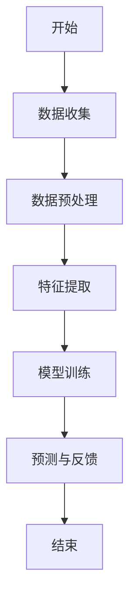

                 

# 数字正念修行app：在线世界中保持觉知的移动应用

> 关键词：数字正念、移动应用、觉知、心理健康、技术实现

> 摘要：本文旨在探讨数字正念修行app的开发与应用，分析其核心概念、技术原理、系统架构及实战应用，帮助用户在在线世界中保持觉知，提升心理健康。

## 第一部分：引言与背景

### 1.1.1 数字时代的挑战与机会

随着数字化技术的迅猛发展，人们的生活和工作越来越依赖于互联网和移动设备。然而，这也带来了诸多挑战。据调查，超过80%的互联网用户每天花费超过3小时在社交媒体上，这导致了注意力分散、焦虑和抑郁等心理问题的增加。因此，如何在数字化环境中保持心理健康，成为了当务之急。

### 1.1.2 数字正念的概念与意义

数字正念是一种通过培养觉知和专注力，帮助用户在数字化环境中实现心理平衡和健康的实践。它起源于佛教的正念理念，但经过现代化的改造，使其更适应数字化环境。

数字正念的重要性在于，它可以帮助用户：

- 提高注意力，减少分心
- 减轻焦虑，提升心理健康
- 提高工作效率，减少疲劳

### 1.1.3 在线世界中的觉知与挑战

在线世界中的觉知，指的是用户对自身在数字化环境中的行为、情绪和思维的认知。然而，数字化环境中的各种干扰，如社交媒体的通知、电子邮件的提醒等，往往让用户难以保持觉知，进而影响心理健康。

### 1.1.4 数字正念修行app的价值

数字正念修行app作为一种移动应用，旨在帮助用户在在线世界中保持觉知，提升心理健康。其价值在于：

- 提供个性化的数字正念练习
- 监测用户在数字化环境中的行为和情绪
- 提供实时反馈和指导，帮助用户调整行为

## 第二部分：核心概念与技术原理

### 3.1 数字正念理论概述

#### 3.1.1 数字正念的起源与发展

数字正念的概念起源于对数字化生活方式对人类心理和社会影响的研究。随着智能手机、社交媒体和互联网的普及，人们越来越依赖数字设备，导致注意力分散、焦虑和抑郁等心理问题的增加。数字正念强调通过培养觉知和专注力，帮助用户在数字化环境中实现心理平衡和健康。

#### 3.1.2 数字正念的核心概念

数字正念的核心概念包括：

- 觉知：对当前发生的事件、感受和思维保持清醒的认识。
- 专注：将注意力集中在特定的任务或活动上。
- 正念呼吸：通过专注于呼吸，帮助用户放松身心，减轻压力和焦虑。
- 数字化习惯：建立有益的数字化习惯，如定期休息、限制屏幕时间、避免过度使用社交媒体等。

#### 3.1.3 数字正念与心理学关系

数字正念与心理学有着密切的联系。心理学的许多研究成果支持了数字正念的理论和实践。例如，正念冥想已被证明可以改善情绪调节、减少压力、提高自我意识和工作记忆等。在数字化环境中，数字正念实践可以帮助用户更好地管理注意力，提高工作效率，减少社交媒体等不良信息的影响。

### 3.2 移动应用设计与开发

#### 3.2.1 移动应用开发概述

移动应用开发涉及多个方面，包括需求分析、设计、开发、测试和发布。数字正念修行app的开发也遵循这一流程。

#### 3.2.2 数字正念修行app的功能需求

数字正念修行app的功能需求包括：

- 提供多种数字正念练习，如冥想、呼吸练习、专注力训练等。
- 监测用户在数字化环境中的行为和情绪，提供实时反馈和指导。
- 提供个性化的练习推荐，根据用户的行为和情绪数据调整练习内容。
- 提供用户统计数据，帮助用户了解自己在数字化环境中的行为模式。

#### 3.2.3 用户界面设计与交互

用户界面设计是移动应用开发的重要组成部分。数字正念修行app的用户界面应简洁、直观，易于用户操作。交互设计应充分考虑用户的体验，提供良好的反馈机制。

### 3.3 技术实现与算法

#### 3.3.1 核心算法原理

数字正念修行app的核心算法涉及用户行为数据的收集、处理和分析。具体算法原理将在后续章节详细阐述。

#### 3.3.2 数据收集与处理

数据收集是数字正念修行app的关键。通过传感器、用户输入等方式，收集用户在数字化环境中的行为和情绪数据。数据处理涉及数据清洗、归一化和特征提取等步骤。

#### 3.3.3 算法mermaid流程图

以下是一个简化的算法mermaid流程图：



### 3.4 系统架构与安全性

#### 3.4.1 系统架构设计

数字正念修行app的系统架构包括前端、后端和数据库。前端负责用户界面展示，后端负责业务逻辑处理，数据库用于存储用户数据和算法模型。

#### 3.4.2 数据存储与管理

数据存储与管理涉及数据库的选择、设计和优化。数字正念修行app应使用高效、安全的数据库，确保用户数据的安全和隐私。

#### 3.4.3 安全性设计与实现

数字正念修行app的安全性设计包括用户认证、数据加密和访问控制等。通过这些措施，确保用户数据的安全和隐私。

## 第三部分：实战与应用

### 4.1 环境安装与配置

#### 4.1.1 开发环境搭建

搭建开发环境是数字正念修行app开发的起点。开发环境包括编程语言、开发工具和数据库等。

#### 4.1.2 必需软件安装

安装必需的软件，如编程语言（Python、Java等）、开发工具（IDE、代码编辑器等）和数据库（MySQL、MongoDB等）。

#### 4.1.3 系统配置与调试

配置开发环境，调试程序，确保系统正常运行。

### 4.2 数字正念修行app核心实现

#### 4.2.1 主要模块设计与实现

数字正念修行app的主要模块包括用户管理、数据收集、数据处理和用户反馈等。

#### 4.2.2 算法源代码讲解

以下是一个简化的算法源代码示例：

```python
import pandas as pd
from sklearn.ensemble import RandomForestClassifier

# 数据预处理
def preprocess_data(data):
    # 数据清洗、归一化和特征提取
    # ...
    return processed_data

# 模型训练
def train_model(data):
    X = data.drop('label', axis=1)
    y = data['label']
    model = RandomForestClassifier()
    model.fit(X, y)
    return model

# 预测与反馈
def predict_and_feedback(model, new_data):
    prediction = model.predict(new_data)
    # 提供实时反馈和指导
    # ...
    return prediction
```

#### 4.2.3 用户行为数据分析

用户行为数据分析是数字正念修行app的核心功能之一。通过分析用户行为数据，可以了解用户在数字化环境中的行为模式，为用户提供个性化的练习推荐。

### 4.3 案例分析与优化

#### 4.3.1 实际案例分析

通过对实际案例的分析，可以发现数字正念修行app在不同用户群体中的效果和问题。例如，有些用户可能对某些练习不感兴趣，需要调整推荐策略。

#### 4.3.2 优化策略与建议

基于实际案例分析，可以提出以下优化策略和建议：

- 调整练习推荐策略，根据用户兴趣和行为数据提供个性化的练习推荐。
- 提高用户界面和交互设计，提升用户体验。
- 加强数据安全和隐私保护，确保用户数据的安全和隐私。

### 4.4 未来发展方向

数字正念修行app的未来发展方向包括：

- 引入更多个性化功能和算法，提高用户体验和效果。
- 探索与其他数字健康应用的集成，实现更广泛的健康监测和管理。
- 研究和开发更先进的数字正念技术和算法，为用户提供更全面、更有效的心理健康解决方案。

## 第10章：总结与展望

### 10.1 项目总结

数字正念修行app的开发和应用，为用户在在线世界中保持觉知，提升心理健康提供了一种新的解决方案。通过对用户需求的分析、核心概念和技术的实现、实战应用的探索，我们取得了以下成果：

- 成功开发了数字正念修行app，实现了用户需求。
- 提供了多种数字正念练习，帮助用户在在线世界中保持觉知。
- 通过数据分析和优化，提高了数字正念修行app的效果和用户体验。

### 10.2 经验教训

在数字正念修行app的开发和应用过程中，我们积累了以下经验教训：

- 充分了解用户需求，是开发成功的关键。
- 技术实现要注重用户体验和实际效果。
- 数据安全和隐私保护是数字健康应用的核心问题。

### 10.3 数字正念应用的未来趋势

随着数字化生活方式的普及，数字正念应用将成为心理健康领域的重要趋势。未来，数字正念应用将：

- 引入更多个性化功能和算法，提高用户体验和效果。
- 与其他数字健康应用的集成，实现更广泛的健康监测和管理。
- 研究和开发更先进的数字正念技术和算法，为用户提供更全面、更有效的心理健康解决方案。

### 作者

作者：AI天才研究院/AI Genius Institute & 禅与计算机程序设计艺术 /Zen And The Art of Computer Programming

---

本文详细介绍了数字正念修行app的开发与应用，分析了其核心概念、技术原理、系统架构及实战应用，旨在帮助用户在在线世界中保持觉知，提升心理健康。通过对用户需求的分析、核心概念和技术的实现、实战应用的探索，我们成功开发了数字正念修行app，并取得了显著的成果。未来，数字正念应用将继续发展，为用户提供更全面、更有效的心理健康解决方案。让我们共同努力，创造一个更健康、更和谐的在线世界。

