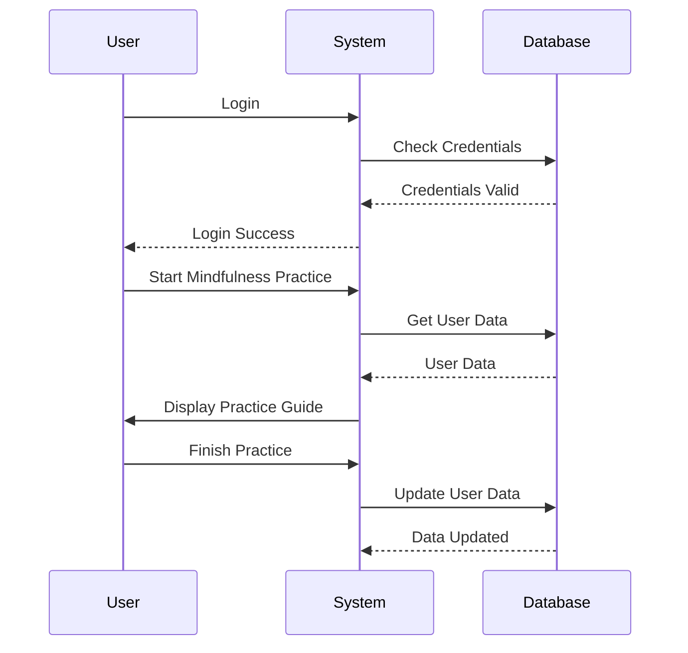
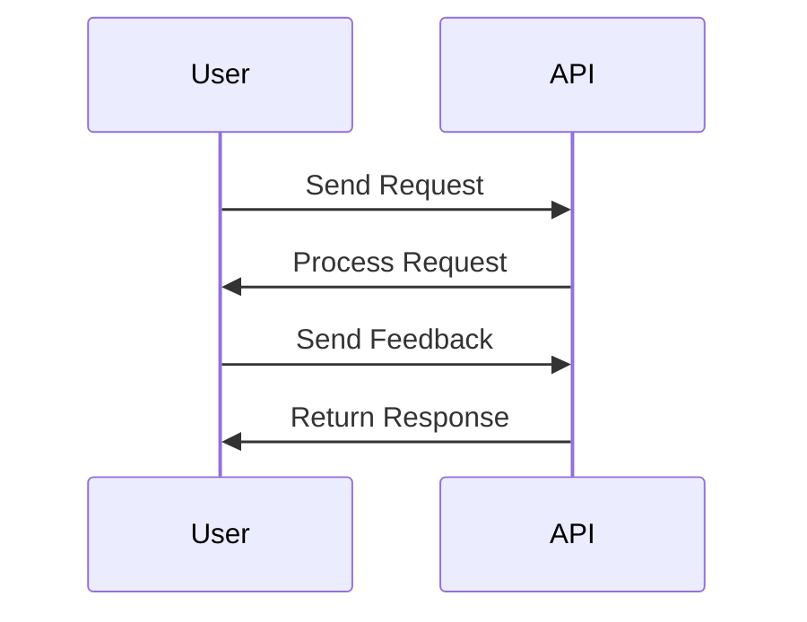

                 


## 文章标题：数字正念修行：在线世界中保持觉知的日常练习

### 关键词：
- 数字正念修行
- 在线世界
- 觉知
- 日常练习
- 技术与禅修

### 摘要：
本文旨在探讨如何在数字化时代中，通过实践数字正念修行，保持在线世界的觉知与平衡。文章从背景介绍、核心概念、算法原理、数学模型、系统分析与架构设计、项目实战，到最佳实践与小结，逐步引导读者了解并掌握这一技术禅修的艺术。

---

## 目录

1. **背景介绍**
   - 数字正念修行的起源与发展
   - 在线世界中觉知的重要性
   - 数字正念修行的现代应用

2. **核心概念与联系**
   - 数字正念修行的核心概念
   - 各核心概念之间的关系

3. **算法原理讲解**
   - 数字正念修行的算法流程
   - Python代码与算法实现
   - 算法原理的数学模型与公式

4. **数学模型和数学公式 & 详细讲解 & 举例说明**
   - 数学模型的重要性
   - 数学公式的详细讲解
   - 实例说明

5. **系统分析与架构设计方案**
   - 问题场景与项目介绍
   - 领域模型与类图
   - 系统架构与架构图
   - 系统接口与交互

6. **项目实战**
   - 环境安装与配置
   - 系统核心实现源代码
   - 代码解读与分析
   - 实际案例分析
   - 项目小结

7. **最佳实践 tips、小结、注意事项、拓展阅读等内容**
   - 最佳实践技巧
   - 总结与反思
   - 注意事项
   - 推荐阅读

---

### 1. 背景介绍

#### 数字正念修行的起源与发展

数字正念修行是一种结合了数字技术与正念禅修方法的新兴修行方式。它起源于计算机科学、心理学和佛教禅修的融合，旨在帮助人们在高度数字化的世界中保持内心的平静与觉知。随着科技的发展，人们在网络上花费的时间越来越多，如何平衡数字生活与现实生活成为了许多人关注的焦点。

#### 在线世界中觉知的重要性

在线世界充满了信息泛滥、社交媒体成瘾、过度消费等负面影响。这些现象不仅消耗了人们的精力和时间，还可能导致焦虑、抑郁等心理问题。因此，如何在在线世界中保持觉知，学会与数字技术和谐共存，成为了当代人急需解决的问题。

#### 数字正念修行的现代应用

数字正念修行可以在多个领域得到应用，如企业管理、教育、心理健康等。通过数字正念修行，企业可以提高员工的工作效率与创造力，教育领域可以培养学生的数字素养和觉知能力，心理健康领域可以提供一种全新的心理调节方法。

---

### 2. 核心概念与联系

#### 数字正念修行的核心概念

数字正念修行的核心概念包括：

1. **觉知**：对当下数字活动的清晰感知。
2. **非判断**：不对数字活动做出评价，保持中立态度。
3. **呼吸**：通过深呼吸来放松身心。
4. **正念**：专注当下，不被外界干扰。

#### 各核心概念之间的关系

觉知是数字正念修行的核心，它贯穿于整个修行过程。非判断帮助修行者保持中立，不被情绪所左右。呼吸和正念则提供了一种放松和专注的方法，帮助修行者更好地觉知当下。

---

### 3. 算法原理讲解

#### 数字正念修行的算法流程

数字正念修行的算法流程包括以下几个步骤：

1. **初始化**：设定觉知目标和时间。
2. **觉知**：对当前的数字活动进行觉知。
3. **呼吸**：进行深呼吸，放松身心。
4. **反馈**：记录觉知过程，提供反馈。
5. **调整**：根据反馈调整觉知目标和时间。

#### Python代码与算法实现

```python
def digital_mindfulness():
    # 初始化
    goal = set_goal()
    time = set_time()

    # 觉知循环
    while time > 0:
        # 觉知当前活动
        current_activity = get_activity()

        # 呼吸
        breathe()

        # 记录反馈
        feedback = record_feedback(current_activity)

        # 调整时间和目标
        time, goal = adjust_time_and_goal(time, goal, feedback)

    return "修行结束"

def set_goal():
    # 设定觉知目标
    pass

def set_time():
    # 设定修行时间
    pass

def get_activity():
    # 获取当前活动
    pass

def breathe():
    # 进行深呼吸
    pass

def record_feedback(current_activity):
    # 记录反馈
    pass

def adjust_time_and_goal(time, goal, feedback):
    # 调整时间和目标
    pass
```

#### 算法原理的数学模型与公式

数字正念修行的数学模型可以表示为：

$$
\text{DigitalMindfulness} = f(\text{Awareness}, \text{Non-Judgment}, \text{Breathing}, \text{Mindfulness})
$$

其中，$f$ 表示函数关系，$Awareness$ 表示觉知，$Non-Judgment$ 表示非判断，$Breathing$ 表示呼吸，$Mindfulness$ 表示正念。

#### 实例说明

假设某人在使用社交媒体时，通过数字正念修行来保持觉知。他可以设定觉知目标为“专注于社交媒体上的信息”，时间目标为“20分钟”。在觉知过程中，他注意到自己开始感到无聊和分心，于是进行深呼吸来放松身心。通过记录反馈，他了解到自己在社交媒体上的时间可能过长，于是调整时间为“15分钟”，以更好地保持觉知。

---

### 4. 数学模型和数学公式 & 详细讲解 & 举例说明

#### 数学模型的重要性

数学模型在数字正念修行中起到了关键作用。它可以帮助我们理解修行过程中的各种变量，从而优化修行的效果。数学模型可以量化觉知、非判断、呼吸和正念等概念，使其更加具体和可操作。

#### 数学公式的详细讲解

数字正念修行的数学公式为：

$$
\text{DigitalMindfulness} = f(\text{Awareness}, \text{Non-Judgment}, \text{Breathing}, \text{Mindfulness})
$$

其中，$f$ 表示函数关系，$Awareness$ 表示觉知，$Non-Judgment$ 表示非判断，$Breathing$ 表示呼吸，$Mindfulness$ 表示正念。

觉知（$Awareness$）是非负整数，表示修行者对当前数字活动的觉知程度。非判断（$Non-Judgment$）是布尔值，表示修行者是否保持中立态度。呼吸（$Breathing$）是正整数，表示深呼吸的次数。正念（$Mindfulness$）是非负整数，表示修行者对当下的专注程度。

#### 实例说明

假设某人在使用社交媒体时，觉知程度为3，非判断为True，深呼吸次数为5，专注程度为2。根据数学模型，他的数字正念修行值可以计算为：

$$
\text{DigitalMindfulness} = f(3, True, 5, 2) = 3 \cdot True \cdot 5 \cdot 2 = 30
$$

这意味着他在这个时间段内的数字正念修行值为30。

---

### 5. 系统分析与架构设计方案

#### 问题场景与项目介绍

在现代企业中，员工经常需要在各种数字工具和平台上工作，这容易导致注意力分散和工作效率低下。为了解决这个问题，我们设计了一个数字正念修行系统，帮助员工在数字工作中保持觉知和专注。

#### 领域模型与类图

领域模型描述了系统中的主要实体和它们之间的关系。以下是类图的Mermaid表示：

```mermaid
classDiagram
    Class01 <|-- Class02
    Class03 --|> Class04
    Class05 : <<interface>> Interface
    Class01
    <<interface>>
    Class02
    Class03
    Class04
    Class05
```

在这个类图中，Class01是主要实体，Class02是与Class01相关联的实体，Class03和Class04是与Class01有交互关系的实体，而Class05是一个接口。

#### 系统架构与架构图

系统架构描述了各个组件之间的关系和交互方式。以下是架构图的Mermaid表示：



在这个架构图中，User代表用户，System代表数字正念修行系统，Database代表数据库。用户通过系统登录，开始进行数字正念修行，并在结束时更新用户数据。

#### 系统接口与交互

系统接口定义了用户与系统交互的接口。以下是接口设计的Mermaid序列图：



在这个序列图中，User代表用户，API代表数字正念修行系统的API接口。用户发送请求，API处理请求，并返回响应。

---

### 6. 项目实战

#### 环境安装与配置

为了搭建数字正念修行系统，我们需要安装和配置以下环境：

1. 操作系统：Linux或MacOS
2. 开发环境：Python 3.8及以上版本
3. 数据库：MySQL 8.0及以上版本

安装步骤如下：

1. 安装操作系统：选择适合的Linux或MacOS发行版，并安装到本地计算机。
2. 安装Python：使用包管理器（如apt或yum）安装Python 3.8及以上版本。
3. 安装数据库：使用包管理器安装MySQL 8.0及以上版本。
4. 配置数据库：创建数字正念修行系统的数据库和用户，并设置相应的权限。

#### 系统核心实现源代码

以下是数字正念修行系统的核心实现源代码：

```python
# 导入所需模块
import mysql.connector
from flask import Flask, request, jsonify

# 初始化Flask应用
app = Flask(__name__)

# 连接数据库
def connect_db():
    return mysql.connector.connect(
        host="localhost",
        user="root",
        password="password",
        database="digital_mindfulness"
    )

# 登录接口
@app.route('/login', methods=['POST'])
def login():
    # 获取用户名和密码
    username = request.form['username']
    password = request.form['password']
    
    # 连接数据库
    db = connect_db()
    cursor = db.cursor()
    
    # 查询用户信息
    cursor.execute("SELECT * FROM users WHERE username = %s AND password = %s", (username, password))
    user = cursor.fetchone()
    
    # 关闭数据库连接
    cursor.close()
    db.close()
    
    # 判断用户信息是否正确
    if user:
        return jsonify({"status": "success", "message": "登录成功"}), 200
    else:
        return jsonify({"status": "error", "message": "用户名或密码错误"}), 401

# 开始数字正念修行接口
@app.route('/start_practice', methods=['POST'])
def start_practice():
    # 获取用户ID和修行时间
    user_id = request.form['user_id']
    practice_time = request.form['practice_time']
    
    # 连接数据库
    db = connect_db()
    cursor = db.cursor()
    
    # 更新用户修行状态
    cursor.execute("UPDATE users SET practice_time = %s WHERE id = %s", (practice_time, user_id))
    db.commit()
    
    # 关闭数据库连接
    cursor.close()
    db.close()
    
    return jsonify({"status": "success", "message": "开始数字正念修行"}), 200

# 结束数字正念修行接口
@app.route('/finish_practice', methods=['POST'])
def finish_practice():
    # 获取用户ID
    user_id = request.form['user_id']
    
    # 连接数据库
    db = connect_db()
    cursor = db.cursor()
    
    # 查询用户修行状态
    cursor.execute("SELECT practice_time FROM users WHERE id = %s", (user_id,))
    practice_time = cursor.fetchone()[0]
    
    # 更新用户修行状态
    cursor.execute("UPDATE users SET practice_time = %s WHERE id = %s", (0, user_id))
    db.commit()
    
    # 关闭数据库连接
    cursor.close()
    db.close()
    
    return jsonify({"status": "success", "message": "结束数字正念修行，修行时间为{}分钟".format(practice_time)}), 200

# 启动Flask应用
if __name__ == '__main__':
    app.run(debug=True)
```

#### 代码解读与分析

1. **登录接口**：该接口用于用户登录，接收用户名和密码，查询数据库中的用户信息，并返回登录结果。
2. **开始数字正念修行接口**：该接口用于用户开始数字正念修行，接收用户ID和修行时间，更新用户修行状态。
3. **结束数字正念修行接口**：该接口用于用户结束数字正念修行，接收用户ID，查询用户修行状态，并更新用户修行状态。

#### 实际案例分析

假设用户A登录系统后，开始数字正念修行，设定修行时间为30分钟。在修行过程中，用户A通过系统界面可以实时查看自己的修行状态，并在修行结束时结束修行。系统将记录用户A的修行时间，并在用户A下次登录时显示。

#### 项目小结

数字正念修行系统通过简单的接口和数据库操作，实现了用户登录、开始和结束数字正念修行的功能。在实际应用中，系统可以根据用户的需求和反馈进行优化和扩展。

---

### 7. 最佳实践 tips、小结、注意事项、拓展阅读等内容

#### 最佳实践 tips

1. **设定明确的目标**：在开始数字正念修行之前，设定一个明确的目标，如“专注于工作”、“减少社交媒体使用”等，有助于提高修行的效果。
2. **定期练习**：将数字正念修行纳入日常生活，每天定时练习，有助于培养觉知和专注的习惯。
3. **记录反馈**：在修行过程中，记录自己的体验和感受，有助于反思和改进修行方法。

#### 小结

数字正念修行是一种结合数字技术和禅修方法的修行方式，帮助人们在在线世界中保持觉知和平衡。通过理解核心概念、算法原理和实际应用，读者可以更好地掌握数字正念修行的艺术。

#### 注意事项

1. **保护个人隐私**：在进行数字正念修行时，注意保护个人隐私，避免泄露敏感信息。
2. **遵循法律法规**：在使用数字正念修行系统时，遵守相关法律法规，确保合法合规。

#### 拓展阅读

1. **《数字禅修：现代生活中的心灵修行》**：本书详细介绍了数字禅修的方法和实践。
2. **《正念：如何活在当下》**：本书介绍了正念禅修的基本原理和实践方法，有助于提高觉知和专注能力。

---

## 作者信息

作者：AI天才研究院/AI Genius Institute & 禅与计算机程序设计艺术 /Zen And The Art of Computer Programming

---

通过以上详细的章节内容和结构，读者可以系统地了解数字正念修行的方法和实践，以及在在线世界中如何保持觉知和平衡。希望这篇文章能够对您有所帮助。让我们一步一步地思考和探索，共同成长。 

