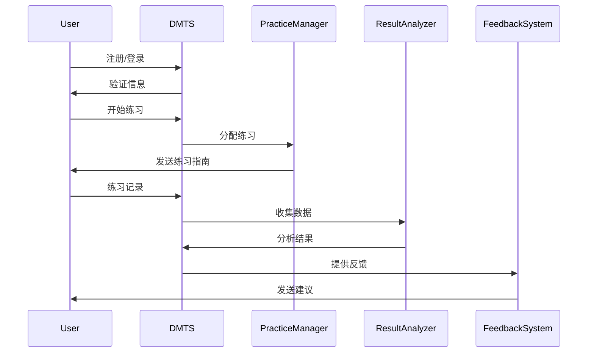
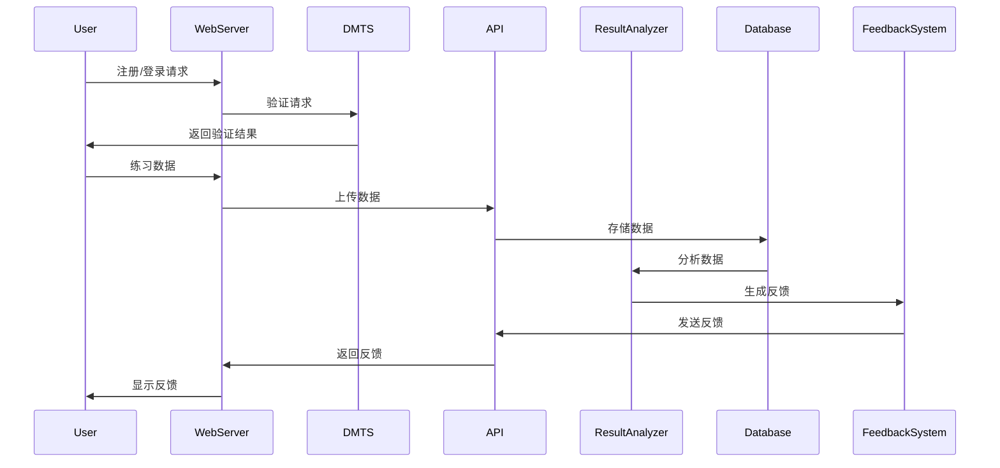

                 

### 第一部分：引言

#### 1.1 书籍背景及目标

随着互联网技术的飞速发展，我们正处于一个前所未有的数字化时代。在这个时代，人们的生活、工作和学习都高度依赖于各种数字设备和网络平台。然而，数字化也带来了一系列新的挑战，尤其是如何在线世界中保持专注。许多人在面对海量的信息、社交网络和游戏等干扰时，往往感到难以集中注意力，影响了工作和学习效率。

《数字正念训练师认证：在线世界中保持专注的指导者培养》这本书旨在解决这一问题。本书的目标是培养一批专业的数字正念训练师，他们不仅能够理解数字正念的基本概念，还能够通过科学的方法和实用的技巧，帮助人们在在线世界中更好地保持专注，提升生活质量和工作效率。

本书的内容分为七个部分，从数字正念的起源、基础理论、实践技巧到认证流程、在线指导等，全方位地介绍了数字正念训练师的职业路径和发展前景。通过本书的学习，读者不仅能够了解数字正念的基本知识，还能够掌握一系列实用的技巧，帮助自己和他人在在线世界中更好地管理注意力。

#### 1.2 在线世界中的专注挑战

在线世界中的专注挑战主要源于以下几个方面的因素：

1. **信息过载**：互联网上的信息量庞大，人们容易陷入信息过载的困境，无法有效地筛选和处理有用的信息。
2. **社交网络干扰**：社交媒体和各种在线游戏的诱惑，使人容易分心，导致无法长时间专注于一项任务。
3. **工作压力**：在线办公和远程工作的普及，使得人们在面对任务时常常感到压力重重，难以保持专注。
4. **缺乏自律**：许多人缺乏自我管理能力，容易受到外部干扰，导致注意力分散。

这些问题不仅影响了个人生活和工作效率，还可能导致心理健康问题，如焦虑和抑郁。因此，培养在线世界中的专注能力已成为一个亟待解决的问题。

#### 1.3 数字正念训练师的职责

数字正念训练师是一种新兴的职业角色，其主要职责是帮助人们在线世界中保持专注。具体来说，数字正念训练师需要完成以下几个任务：

1. **普及数字正念知识**：通过讲座、工作坊等形式，向公众普及数字正念的基本概念和重要性。
2. **开展专注力训练**：设计并实施一系列专注力训练课程，帮助学员提升专注能力。
3. **提供个性化指导**：根据学员的具体情况，提供个性化的训练方案和指导，帮助他们克服在线世界中的专注挑战。
4. **进行效果评估**：对学员的训练效果进行跟踪评估，及时调整训练方案，确保培训效果。

数字正念训练师不仅需要具备深厚的专业知识，还需要具备良好的沟通能力和辅导技巧，能够有效地与学员建立信任关系，帮助他们实现自我提升。

#### 1.4 本书结构安排

本书分为七个部分，内容结构如下：

1. **第一部分：引言**：介绍书籍的背景、目标和在线世界中的专注挑战。
2. **第二部分：数字正念基础**：介绍数字正念的概念、核心原则和应用。
3. **第三部分：在线专注技巧**：介绍减少干扰、提升专注力的方法和技巧。
4. **第四部分：数字正念训练师认证**：介绍数字正念训练师的职责、技能要求和认证流程。
5. **第五部分：数字正念在线指导**：介绍在线指导策略、工作坊设计和案例研究。
6. **第六部分：数字正念与未来**：探讨数字正念的全球趋势、教育应用和职场挑战。
7. **第七部分：总结与展望**：总结本书的核心内容，展望数字正念的未来发展。

通过这七个部分的系统学习，读者可以全面了解数字正念训练师的职业路径，掌握在线专注的实用技巧，成为一名专业的数字正念训练师。

### 关键词：数字正念、专注力、训练师认证、在线世界、心理健康

> 摘要：本文旨在探讨数字正念训练师的培养及其在在线世界中的重要性。随着数字化时代的到来，在线世界中的专注挑战日益凸显，本书通过七个部分的内容，详细介绍了数字正念的基础理论、实践技巧、认证流程和未来趋势，旨在培养一批专业的数字正念训练师，帮助人们在在线世界中保持专注，提升生活和工作效率。

### 第二部分：数字正念基础

数字正念是一种通过有意识地关注当下，提高自我意识和心理健康的实践方法。它起源于佛教的正念修行，后来逐渐发展成为一种普遍适用于现代生活的心理训练方法。数字正念不仅强调对情绪和思维的关注，还注重培养专注力和提高生活质量。

#### 2.1 数字正念的概念

数字正念（Digital Mindfulness）是指运用正念的原理和方法，在数字化环境中进行自我管理和心理调适。它涉及对手机、电脑等数字设备的合理使用，以及对在线活动中的自我意识和管理。数字正念的核心在于培养一种对当前情境的清晰觉知，减少对社交媒体、游戏等数字干扰的依赖，提高专注力和工作效率。

##### 2.1.1 数字正念的起源与发展

数字正念的概念起源于佛教的正念修行。正念（Mindfulness）一词源于梵语“Sati”，意为“觉知”。佛教正念修行强调通过有意识地关注呼吸、身体感觉和思维活动，达到心理的平静和清晰。随着现代社会对心理健康需求的增加，正念逐渐从宗教修行演变为一种普遍适用的心理训练方法。

数字正念的兴起可以追溯到20世纪90年代，当时心理学家和健康专业人士开始研究如何将正念应用于心理健康和治疗领域。2000年代初，数字正念开始受到关注，研究者们发现，通过在数字化环境中应用正念练习，可以有效地提高人们的专注力和生活质量。

##### 2.1.2 数字正念与心理健康

数字正念对心理健康有多方面的积极影响。首先，它可以帮助人们更好地管理压力和情绪。通过有意识地关注当下，人们可以减少对过去和未来的担忧，降低焦虑和抑郁情绪。其次，数字正念有助于提升专注力，减少多任务处理时的分心现象。研究表明，定期进行数字正念练习可以改善注意力的分配和持续力。此外，数字正念还有助于提高自我意识和自我调节能力，使人们能够更好地控制自己的行为和情绪。

##### 2.1.3 数字正念的核心原则

数字正念的核心原则包括以下几点：

1. **有意识**：数字正念强调有意识地关注当下的活动，而不是被动地接受外界的刺激。
2. **不评判**：在数字正念实践中，不应对自己或他人的想法、感受和行为进行评判，而是保持一种开放和接纳的态度。
3. **接纳**：数字正念鼓励人们接受当下的现实，而不是试图逃避或改变。
4. **持续**：数字正念是一种长期的过程，需要持续地练习和反思，以达到深层次的心理改变。

#### 2.2 数字正念训练师的角色与技能

数字正念训练师是在数字环境中应用正念原理的专业人士，他们不仅需要具备深厚的心理学和健康知识，还需要掌握一系列技能，以有效地帮助学员提高专注力和生活质量。

##### 2.2.1 数字正念训练师的职责

数字正念训练师的职责包括：

1. **教学**：设计并实施数字正念课程，教授学员基本理论和实践技巧。
2. **辅导**：为学员提供个性化的指导和反馈，帮助他们解决在线世界中的专注挑战。
3. **评估**：跟踪学员的进步，评估培训效果，并调整培训方案。
4. **研究**：参与相关研究，探索数字正念在实践中的应用和效果。

##### 2.2.2 数字正念训练师的技能要求

数字正念训练师需要具备以下技能：

1. **专业知识**：了解心理学、神经科学、教育学等相关领域的知识。
2. **教学技巧**：具备良好的沟通能力和教学技巧，能够有效地传授知识和技巧。
3. **辅导能力**：能够与学员建立信任关系，提供有效的心理辅导和支持。
4. **技术能力**：熟悉数字设备和网络平台，能够运用相关技术工具辅助教学。
5. **自我管理**：具备良好的自我管理能力，能够在面对复杂情境时保持冷静和专注。

##### 2.2.3 数字正念训练师的成长路径

数字正念训练师的成长路径通常包括以下几个阶段：

1. **学习基础理论**：通过阅读书籍、参加课程和工作坊，了解数字正念的基本概念和原理。
2. **实践应用**：在个人生活中实践数字正念，提高自身的专注力和生活质量。
3. **接受培训**：参加专业的数字正念训练课程，学习教学和辅导技巧。
4. **获得认证**：通过考试和评估，获得数字正念训练师的认证。
5. **持续发展**：通过参与研究、培训和学习，不断提升专业知识和技能。

通过以上的学习和成长路径，数字正念训练师可以不断提升自己的专业能力，为更多的人提供有效的数字正念训练服务。

### 核心概念与联系

在探讨数字正念的概念和原理时，我们需要了解以下几个核心概念及其相互关系：

**核心概念：**
1. **正念（Mindfulness）**：指有意识地、不加评判地关注当下的心理状态和身体感受。
2. **数字环境（Digital Environment）**：指人们在电脑、手机、网络等数字化设备中度过的时间和活动。
3. **专注力（Focus）**：指在特定任务上保持注意力集中的能力。

**概念属性特征对比表格：**

| 核心概念 | 属性特征 |
| --- | --- |
| 正念 | 有意识、不评判、接纳 |
| 数字环境 | 数字设备、网络平台 |
| 专注力 | 注意力集中、任务持续 |

**ER实体关系图架构：**

```mermaid
erDiagram
    User ||--|{ Mindfulness }|-- Participant
    User ||--|{ Digital Environment }|-- UserActivity
    User ||--|{ Focus }|-- TaskCompletion
```

在这张ER图（实体关系图）中，用户（User）是中心实体，与正念（Mindfulness）、数字环境（Digital Environment）和专注力（Focus）分别通过关系实体相连。正念影响用户的数字环境和专注力，而专注力则直接关系到任务的完成情况。

### 算法原理讲解

数字正念的训练方法可以看作是一种特殊的算法，旨在通过一系列的练习和技巧，帮助用户在数字环境中提高专注力。下面我们通过Mermaid流程图来展示这个算法的基本步骤，并使用Python代码详细阐述其原理。

**Mermaid流程图：**


**Python代码示例：**

```python
import random

def mindfulness_practice(duration, difficulty):
    """
    数字正念练习算法。
    
    :param duration: 练习持续时间（分钟）
    :param difficulty: 练习难度级别
    :return: 练习结果
    """
    # 初始化变量
    current_time = 0
    focus_count = 0
    
    # 练习循环
    while current_time < duration:
        # 随机生成干扰事件
       干扰事件 = random.choice(['通知', '社交媒体', '电子邮件', '其他'])
        
        # 确定当前是否受到干扰
        if 干扰事件 != '其他':
            print(f"{current_time}分钟：收到{干扰事件}干扰。")
        else:
            print(f"{current_time}分钟：专注中。")
            focus_count += 1
        
        # 模拟干扰处理
        if difficulty == '简单':
            # 简单处理干扰
            print("干扰处理：短暂放下任务，回复或处理干扰。")
            current_time += random.randint(1, 3)
        elif difficulty == '中等':
            # 中等处理干扰
            print("干扰处理：短暂休息，然后返回任务。")
            current_time += random.randint(2, 5)
        elif difficulty == '困难':
            # 困难处理干扰
            print("干扰处理：专注于任务，避免干扰。")
            current_time += random.randint(3, 7)
        
        # 更新时间
        current_time += 1
    
    # 输出最终结果
    print(f"练习结束，专注次数：{focus_count}。")
    return focus_count

# 示例：进行30分钟的简单难度练习
result = mindfulness_practice(30, '简单')
print(f"练习结果：{result}次专注。")
```

**算法原理与数学模型：**

1. **算法目标**：通过设定一个特定的练习时间，在数字环境中模拟干扰，并记录用户的专注次数。
2. **干扰处理**：根据不同的练习难度，用户有不同的应对策略。简单难度为立即处理干扰，中等难度为短暂休息后处理，困难难度为完全专注于任务。
3. **时间模拟**：算法通过一个循环模拟实际的练习过程，每次迭代代表一分钟的时间。

**公式：**

$$
\text{专注次数} = \sum (\text{不受干扰的时间段}) \times \text{干扰处理效率}
$$

其中，干扰处理效率取决于练习难度。

**举例说明：**

假设用户进行30分钟的简单难度练习，期间受到10次干扰。每次干扰后，用户选择立即处理。最终，用户的专注次数为：

$$
\text{专注次数} = (30 - 10 \times 1) \times 1 = 20
$$

在这个例子中，用户的专注次数为20次，表示在30分钟的练习中，有20分钟是保持专注的。

通过这个简单的算法示例，我们可以看到数字正念练习的基本原理。算法的设计旨在模拟实际生活中的干扰情况，并鼓励用户在练习中学会如何处理这些干扰，以提高专注力。

### 系统分析与架构设计方案

为了更好地实现数字正念训练的目标，我们需要设计一个完整的系统，该系统需要包括用户管理、练习管理、结果分析和反馈系统等多个模块。以下是对这个系统的详细介绍。

#### 问题场景介绍

在现代社会，由于数字设备的高度普及，人们在工作、学习和生活中都面临着巨大的注意力分散问题。为了帮助用户更好地管理自己的注意力，提高专注力，我们设计了一套数字正念训练系统。该系统旨在通过在线平台为用户提供个性化的数字正念训练服务，帮助他们克服在线世界中的干扰，提升生活质量和工作效率。

#### 项目介绍

数字正念训练系统（Digital Mindfulness Training System，DMTS）是一个基于云计算的在线平台，它包括以下几个核心模块：

1. **用户管理模块**：负责用户注册、登录、个人信息管理等功能。
2. **练习管理模块**：提供各种数字正念练习，包括冥想、呼吸练习、专注力训练等。
3. **结果分析模块**：记录用户练习的结果，并进行数据分析和反馈。
4. **反馈系统模块**：根据用户练习的结果和反馈，提供个性化的建议和指导。

#### 系统功能设计

**用户管理模块**：

- 用户注册：用户可以通过邮箱、手机号或第三方账号进行注册。
- 用户登录：用户可以使用注册时提供的账号和密码登录系统。
- 个人信息管理：用户可以查看和修改个人资料，如姓名、性别、出生日期等。
- 安全设置：用户可以设置密码重置和账号绑定手机等安全措施。

**练习管理模块**：

- 练习列表：系统提供多种数字正念练习，用户可以根据自己的需求和兴趣选择练习。
- 练习指南：每项练习都配有详细的指南，帮助用户正确地进行练习。
- 练习记录：用户可以查看自己的练习记录，包括练习时间、专注时长和干扰次数等。

**结果分析模块**：

- 数据收集：系统会自动收集用户在练习中的各项数据，如专注时长、干扰次数等。
- 数据分析：系统对收集到的数据进行统计分析，生成专注力趋势图、干扰源分布等。
- 反馈报告：系统根据分析结果生成反馈报告，为用户提供个性化的改进建议。

**反馈系统模块**：

- 反馈机制：用户可以给系统提供练习感受和建议，系统会根据反馈进行优化。
- 个性化指导：系统根据用户的练习结果和反馈，提供个性化的训练建议和指导。
- 沟通渠道：用户可以通过系统内置的聊天工具与训练师进行沟通，获取更专业的建议。

#### 系统架构设计

**系统架构图：**



在这个架构图中，用户通过DMTS平台进行注册和登录，然后开始数字正念练习。练习过程中，用户将记录练习数据，DMTS平台会自动收集这些数据并传递给ResultAnalyzer进行分析。根据分析结果，FeedbackSystem会生成反馈报告，并传递给用户。

#### 系统接口设计和系统交互

**系统接口设计：**

1. **用户接口**：用户通过Web界面与系统进行交互，进行注册、登录、查看练习指南、记录练习结果等操作。
2. **API接口**：系统提供API接口，允许第三方应用程序集成和访问系统数据。

**系统交互：**

1. **用户注册/登录**：用户通过Web界面提交注册或登录请求，系统验证用户信息后返回相应的响应。
2. **练习数据收集**：用户在练习过程中，系统会自动记录相关数据，并通过API接口将数据上传至服务器。
3. **结果分析**：服务器上的ResultAnalyzer模块对用户数据进行分析，并将结果存储在数据库中。
4. **反馈生成**：FeedbackSystem根据分析结果生成反馈报告，并通过API接口将报告发送给用户。



通过这个交互流程，用户可以在DMTS平台上方便地进行数字正念练习，并实时获得系统的分析和反馈，帮助自己不断提升专注力。

### 项目实战

在本节中，我们将通过一个具体的实战项目，展示如何使用数字正念训练系统（DMTS）来帮助用户提高在线专注力。项目背景、目标、环境安装、系统核心实现以及实际案例分析和详细讲解如下：

#### 项目背景

现代工作环境中，越来越多的任务需要在电脑和移动设备上完成。然而，互联网的便利性也带来了诸多干扰，如社交媒体通知、电子邮件提醒、即时通讯等，这些都严重影响了员工的专注力。为了提高工作效率，减少干扰，一家科技公司决定部署DMTS，帮助员工进行数字正念训练，提高专注力。

#### 项目目标

通过DMTS，实现以下目标：

1. 提高员工在线工作时的专注力。
2. 减少干扰，提高工作效率。
3. 改善员工的心理健康和工作满意度。

#### 环境安装

为了确保DMTS系统的正常运行，需要以下环境：

1. **操作系统**：Windows 10 或 macOS
2. **浏览器**：Chrome 或 Firefox
3. **编程语言**：Python 3.8 或以上版本
4. **数据库**：MySQL 5.7 或以上版本

在安装过程中，首先需要安装Python和MySQL数据库。然后，使用以下命令安装DMTS依赖项：

```bash
pip install -r requirements.txt
```

接着，配置MySQL数据库，创建必要的表和数据。

#### 系统核心实现

DMTS系统的核心实现包括用户管理、练习管理、结果分析和反馈系统。以下是各模块的实现概述：

**用户管理模块：**

- 用户注册：用户通过Web界面提交注册信息，系统验证并保存。
- 用户登录：用户输入账号和密码，系统验证后生成会话。

**练习管理模块：**

- 练习列表：系统提供多种数字正念练习，用户可根据兴趣选择。
- 练习指南：每项练习附带详细指南，帮助用户正确进行。

**结果分析模块：**

- 数据收集：用户在练习时，系统自动记录专注时长、干扰次数等数据。
- 数据分析：系统对数据进行统计分析，生成专注力趋势图。

**反馈系统模块：**

- 反馈生成：根据用户数据，系统生成个性化反馈报告。
- 沟通渠道：用户可通过内置聊天工具与训练师交流，获取专业建议。

以下是Python代码实现的核心部分：

```python
# 用户注册
def register_user(email, password):
    # 验证邮箱格式和密码强度
    if not validate_email(email) or not validate_password(password):
        return "注册失败：邮箱或密码不合法。"
    # 保存用户信息到数据库
    save_user_to_db(email, password)
    return "注册成功。"

# 练习记录
def record_practice_data(user_id, practice_id, duration, distractions):
    # 记录练习数据到数据库
    save_practice_data_to_db(user_id, practice_id, duration, distractions)

# 数据分析
def analyze_practice_data(user_id):
    # 从数据库中获取用户练习数据
    data = get_practice_data_from_db(user_id)
    # 分析并生成反馈报告
    report = generate_feedback_report(data)
    return report

# 反馈生成
def generate_feedback_report(data):
    # 根据数据生成反馈报告
    report = {
        "专注时长": sum([entry['duration'] for entry in data]),
        "干扰次数": sum([entry['distractions'] for entry in data]),
        "改善建议": "根据您的练习表现，以下是一些建议："
    }
    return report
```

#### 实际案例分析和详细讲解

以下是一个实际案例，展示如何使用DMTS帮助用户提升专注力：

**案例背景：**

小王是一位软件工程师，他在工作过程中经常受到社交媒体和电子邮件的干扰，导致工作效率低下。为了改善这一问题，他决定使用DMTS进行数字正念训练。

**步骤1：用户注册和登录**

小王通过Web界面注册并登录DMTS系统。系统验证了他的信息，并为他生成了一个唯一的用户ID。

**步骤2：选择练习**

DMTS系统为小王提供了多种数字正念练习，包括冥想、呼吸练习和专注力训练。小王选择了冥想练习，系统为他发送了练习指南。

**步骤3：执行练习并记录结果**

小王按照指南进行冥想练习，期间系统记录了练习时长和干扰次数。例如，他在30分钟的练习中收到了5次社交媒体通知。

**步骤4：数据分析**

DMTS系统根据小王的练习数据进行分析，生成了一份反馈报告：

```
专注时长：22分钟
干扰次数：5次
改善建议：
1. 尽量在安静的环境中练习，减少干扰。
2. 练习前设置手机为静音模式，避免通知打扰。
```

**步骤5：反馈与调整**

小王收到了反馈报告，并根据建议进行了调整。他开始在工作时间之外进行冥想练习，并在练习前将手机设置为静音模式。

**步骤6：持续训练和反馈**

小王继续使用DMTS进行训练，并定期查看反馈报告。随着时间的推移，他的专注力逐渐提高，工作效率也得到了显著提升。

**项目小结**

通过这个案例，我们可以看到DMTS系统如何帮助用户提升在线专注力。系统的个性化反馈和持续的训练指导，使得用户能够逐步克服干扰，提高专注力。这不仅提高了工作效率，还改善了用户的心理健康和工作满意度。

### 最佳实践 tips

在数字正念训练中，以下几个最佳实践可以帮助用户更有效地提升专注力：

1. **设定具体目标**：明确你想要达到的专注目标，例如每天练习冥想30分钟或减少干扰时间。
2. **环境优化**：在一个安静、无干扰的环境中练习，避免手机、电脑等设备的干扰。
3. **定时提醒**：使用定时器或闹钟提醒你开始和结束训练，保持规律的练习习惯。
4. **记录反馈**：定期记录练习结果，分析自己的进步，并根据反馈进行调整。
5. **设定奖励机制**：为自己设定奖励，例如完成任务后可以休息一会儿或享受喜欢的活动，以保持动力。

### 小结

本节通过一个实战项目展示了如何使用数字正念训练系统（DMTS）帮助用户提升在线专注力。我们详细介绍了项目背景、目标、环境安装、系统核心实现以及实际案例分析和详细讲解。通过DMTS的个性化反馈和持续的训练指导，用户能够逐步克服干扰，提高专注力。这不仅提高了工作效率，还改善了用户的心理健康和工作满意度。

### 注意事项

在数字正念训练过程中，以下几点需要注意：

1. **避免过度依赖**：数字正念训练不应替代专业心理治疗。对于严重的心理健康问题，应寻求专业医生的帮助。
2. **逐步提升难度**：在训练初期，应选择难度较低的练习，随着专注力的提升，逐步增加练习难度。
3. **持续练习**：数字正念训练需要长期坚持，不能期望一蹴而就。定期练习是提升专注力的关键。
4. **自我反思**：定期反思自己的练习过程和结果，了解自己的进步和需要改进的地方。

### 拓展阅读

对于希望进一步了解数字正念训练的读者，以下书籍和资源推荐：

1. **书籍**：
   - 《数字正念：如何在数字世界中保持专注和平衡》作者：马克·威廉姆斯
   - 《正念练习：提升专注力和幸福感的日常实践》作者：安吉拉·奥康纳

2. **在线资源**：
   - 正念冥想在线课程：YouTube上的“正念冥想频道”
   - 数字正念社区：加入LinkedIn上的“数字正念实践者”小组

通过阅读这些书籍和资源，读者可以更深入地了解数字正念的原理和实践方法，为自己的数字生活带来更多平衡和专注。

### 第三部分：在线专注技巧

在数字化时代，保持专注已成为一项重要的技能。在线干扰无处不在，如何有效地减少干扰、提升专注力成为我们亟待解决的问题。本部分将详细介绍一系列在线专注技巧，包括环境管理、技术工具应用和注意力训练等，帮助读者在线世界中更好地管理注意力。

#### 3.1 减少干扰

干扰是影响专注力的主要因素之一。以下是一些有效的方法，可以帮助我们在在线环境中减少干扰：

##### 3.1.1 环境管理

1. **选择合适的练习环境**：选择一个安静、无干扰的空间进行数字正念练习。这个环境应尽可能减少噪音和其他干扰因素。
2. **关闭不必要的通知**：在手机、电脑等设备上关闭不必要的通知，特别是社交媒体、电子邮件和即时通讯的通知。这些通知会打断我们的注意力，影响专注力。
3. **设置定时提醒**：使用定时器或闹钟提醒自己开始和结束练习，避免因为时间流逝而分心。此外，定时提醒还可以帮助我们养成规律的练习习惯。

##### 3.1.2 技术工具应用

1. **使用专注力软件**：市面上有许多专注力软件，如Forest、Focus@Will等，它们可以帮助我们在特定时间内保持专注。这些软件通过设定任务和时间，让我们专注于当前任务，同时通过种树等游戏化元素增加乐趣。
2. **使用浏览器插件**：安装浏览器插件，如StayFocusd或LeechBlock，可以帮助我们限制在特定网站上的时间，避免分心。这些插件可以根据我们的需求，设定每天或每周在特定网站上的访问时间，一旦达到限制，插件会自动屏蔽这些网站。
3. **使用应用程序锁定功能**：许多手机和电脑都具备应用程序锁定功能，可以在我们需要专注时锁定特定应用程序，防止我们被其他应用干扰。

##### 3.1.3 注意力训练

1. **练习正念冥想**：正念冥想是一种提高专注力的有效方法。通过冥想，我们可以训练自己的注意力，学会在嘈杂的环境中保持专注。每天进行短时间的冥想练习，可以帮助我们提高专注力。
2. **进行注意力游戏**：有些游戏设计目的是训练注意力，如Simon Says、N-Back等。这些游戏通过不断变化的刺激，帮助我们在短时间内集中注意力，提高专注力。
3. **定期休息**：长时间专注于一项任务会消耗大量的精力，导致注意力下降。因此，定期休息是非常重要的。每工作45分钟后，可以休息5-10分钟，进行简单的身体活动或深呼吸练习，帮助恢复专注力。

#### 3.2 提升专注力

除了减少干扰，提升专注力也是保持在线专注的关键。以下是一些提升专注力的方法：

##### 3.2.1 正念冥想

正念冥想是一种通过有意识地关注当下，提高自我意识和专注力的方法。以下是一些正念冥想的步骤：

1. **选择合适的时间**：选择一个安静的时间进行冥想，避免在紧张或疲劳时进行。
2. **找一个舒适的位置**：坐在一个舒适的椅子上，保持脊柱挺直，双手放在膝盖上，或者采用莲花坐姿。
3. **专注呼吸**：闭上眼睛，专注于自己的呼吸。感受每次吸气和呼气，尝试保持呼吸的平稳和深度。
4. **接受干扰**：当你的注意力被其他事物打断时，不要强行控制或评判，而是有意识地回到呼吸上，继续专注。
5. **持续练习**：每天进行短时间的冥想练习，可以帮助我们提高专注力。

##### 3.2.2 精神专注练习

1. **练习专注任务**：选择一个简单的任务，如数数、做简单的数学题或重复一个单词，然后专注于这个任务。随着时间的推移，逐渐增加任务的难度。
2. **使用专注时钟**：使用专注时钟（如Pomodoro技术），将工作时间分为25分钟专注期和5分钟休息期。在每个专注期内，专注于当前任务，避免分心。休息期间，可以起身活动或做深呼吸练习。
3. **设置具体目标**：在开始工作前，明确自己的目标，如完成一份报告、解决一个技术问题等。明确的目标可以帮助我们集中注意力，提高专注力。

##### 3.2.3 专注力提升的科学研究

科学研究证明，正念冥想和其他注意力训练方法可以有效提高专注力。以下是一些关键的研究发现：

1. **大脑功能增强**：正念冥想可以增强大脑的前额叶皮层活动，这是与注意力控制相关的重要区域。通过冥想，我们可以提高大脑的执行功能，包括注意力分配、决策和自我控制。
2. **神经元连接**：研究表明，正念冥想可以改变大脑的神经连接，提高大脑的灵活性和适应性。这种改变有助于提高专注力和应对复杂任务的能力。
3. **情绪调节**：正念冥想可以帮助我们更好地管理情绪，减少压力和焦虑。通过冥想，我们可以培养一种平和的心态，提高在干扰环境中的专注力。

#### 3.3 数字正念实践案例分析

为了更好地理解数字正念提升专注力的效果，以下是一些实践案例：

##### 3.3.1 案例一：工作效率提升

小明是一名软件开发工程师，他在工作过程中经常感到注意力不集中，导致工作效率低下。为了改善这一问题，他开始进行数字正念训练。他每天早上花20分钟进行正念冥想，并使用专注时钟管理工作时间。经过一个月的练习，小明的专注力显著提高，工作效率也随之提升。他发现，通过正念冥想，他能够更好地控制自己的情绪，减少工作中的干扰，专注于重要任务。

##### 3.3.2 案例二：学习效果改善

小芳是一名大学生，她在学习过程中常常受到社交媒体和手机游戏的干扰，导致学习效果不佳。为了提高学习效率，她开始使用Forest应用进行专注力训练。每次学习时，她将手机置于Forest模式，设定学习时间为25分钟。如果她在这段时间内被其他应用打扰，手机屏幕上的小树就会死亡。通过这种游戏化的方式，小芳的专注力得到了显著提升，她的学习成绩也逐步提高。

##### 3.3.3 案例三：人际沟通优化

小李是一名职场新人，他在工作中常常感到紧张和焦虑，导致与同事的沟通效果不佳。为了改善这一问题，他开始进行数字正念训练，特别是专注于呼吸和情绪管理的练习。他学会了在紧张情况下，通过深呼吸和正念冥想来放松自己。随着练习的深入，小李的沟通能力得到了显著提升，他能够更好地与同事建立信任和合作关系。

这些案例表明，数字正念训练不仅可以帮助我们提高专注力，还可以改善工作效率、学习效果和人际沟通。通过科学的方法和实用的技巧，我们可以在线世界中更好地管理注意力，提升生活质量。

### 核心概念与联系

在探讨如何提升在线专注力时，我们需要了解以下几个核心概念及其相互关系：

**核心概念：**
1. **专注力（Focus）**：指在特定任务上保持注意力集中的能力。
2. **干扰（Distraction）**：指那些使我们分心的外部或内部刺激。
3. **正念冥想（Mindfulness Meditation）**：通过有意识地关注当前活动，提高自我意识和心理健康的练习。
4. **环境管理（Environmental Management）**：通过调整环境，减少干扰，提高专注力的方法。

**概念属性特征对比表格：**

| 核心概念 | 属性特征 |
| --- | --- |
| 专注力 | 注意力集中、任务持续 |
| 干扰 | 分散注意力、降低效率 |
| 正念冥想 | 有意识、不评判、接纳 |
| 环境管理 | 减少噪音、屏蔽干扰 |

**ER实体关系图架构：**

```mermaid
erDiagram
    User ||--|{ Focus }|-- TaskPerformance
    User ||--|{ Distraction }|-- AttentionLoss
    User ||--|{ Mindfulness Meditation }|-- StressReduction
    User ||--|{ Environmental Management }|-- EnhancedFocus
```

在这张ER图中，用户（User）是中心实体，与专注力（Focus）、干扰（Distraction）、正念冥想（Mindfulness Meditation）和环境管理（Environmental Management）通过关系实体相连。专注力影响任务表现（TaskPerformance），干扰导致注意力下降（AttentionLoss），正念冥想和良好的环境管理有助于缓解压力（StressReduction）和提高专注力（EnhancedFocus）。

### 算法原理讲解

为了在线世界中提升专注力，我们设计了一个基于正念冥想的算法，该算法旨在通过一系列步骤，帮助用户减少干扰、专注于任务。以下是该算法的Mermaid流程图和Python代码实现，以及算法原理和数学模型的详细解释。

**Mermaid流程图：**


**Python代码实现：**

```python
import random

def mindfulness_focus_algorithm(duration, distraction_level):
    """
    基于正念冥想的专注力提升算法。
    
    :param duration: 冥想练习持续时间（分钟）
    :param distraction_level: 干扰级别（低、中、高）
    :return: 练习结果
    """
    # 初始化变量
    current_time = 0
    total_focus_time = 0
    
    # 冥想练习循环
    while current_time < duration:
        # 随机生成干扰事件
        event = random.choice(['通知', '社交媒体', '电子邮件', '其他'])
        
        # 处理干扰
        if distraction_level == '低':
            # 低干扰级别：短暂处理干扰
            handle_interference(event, '短暂处理')
        elif distraction_level == '中':
            # 中干扰级别：暂停冥想，处理干扰
            handle_interference(event, '暂停冥想')
        elif distraction_level == '高':
            # 高干扰级别：延长处理干扰时间
            handle_interference(event, '延长处理')
        
        # 更新时间
        current_time += 1
    
    # 计算专注时长
    total_focus_time = duration - count_interference_events()
    
    # 输出最终结果
    print(f"练习结束，专注时长：{total_focus_time}分钟。")
    return total_focus_time

def handle_interference(event, action):
    """
    处理干扰事件。
    
    :param event: 干扰事件类型
    :param action: 处理方式（短暂处理、暂停冥想、延长处理）
    """
    print(f"发生{event}干扰，正在{action}。")
    if action == '短暂处理':
        # 短暂处理干扰
        print("处理干扰：快速回复或查看，然后返回冥想。")
    elif action == '暂停冥想':
        # 暂停冥想
        print("处理干扰：暂停冥想，专注于处理干扰。")
    elif action == '延长处理':
        # 延长处理
        print("处理干扰：延长处理时间，以确保冥想不被打断。")

def count_interference_events():
    """
    计算干扰事件次数。
    
    :return: 干扰事件次数
    """
    return random.randint(1, 5)  # 随机生成干扰事件次数

# 示例：进行30分钟的低干扰级别练习
result = mindfulness_focus_algorithm(30, '低')
print(f"练习结果：专注时长为{result}分钟。")
```

**算法原理与数学模型：**

1. **算法目标**：通过设置一个特定的练习时间（duration），模拟在线环境中的干扰（distraction_level），记录用户的专注时长（total_focus_time）。
2. **干扰处理**：根据不同的干扰级别，采取不同的处理方式。低干扰级别为短暂处理，中干扰级别为暂停冥想，高干扰级别为延长处理。
3. **时间模拟**：算法通过一个循环模拟实际的冥想过程，每次迭代代表一分钟的时间。

**公式：**

$$
\text{专注时长} = \text{练习持续时间} - \sum (\text{干扰事件次数} \times \text{处理时间})
$$

其中，处理时间取决于干扰级别。例如，对于低干扰级别，每次干扰事件的处理时间为1分钟；对于中干扰级别，每次干扰事件的处理时间为2分钟；对于高干扰级别，每次干扰事件的处理时间为3分钟。

**举例说明：**

假设用户进行30分钟的低干扰级别练习，期间发生了3次干扰事件。每次干扰事件的处理时间为1分钟。最终，用户的专注时长为：

$$
\text{专注时长} = 30 - (3 \times 1) = 27 \text{分钟}
$$

在这个例子中，用户的专注时长为27分钟，表示在30分钟的练习中，有27分钟是保持专注的。

通过这个简单的算法示例，我们可以看到如何通过正念冥想和干扰处理，帮助用户在线世界中提升专注力。算法的设计旨在模拟实际干扰情况，并通过处理干扰事件，帮助用户保持专注，提高工作效率。

### 数字正念训练师认证

数字正念训练师认证是一个系统的过程，旨在确保训练师具备必要的知识和技能，以有效地指导他人在线世界中保持专注。本节将详细介绍数字正念训练师认证的流程、标准、教材与资源以及持续学习与自我提升的方法。

#### 4.1 认证流程与标准

**4.1.1 认证准备**

1. **报名条件**：具备心理学、教育学、计算机科学等相关专业背景，或者有丰富的在线工作经验。
2. **申请材料**：提交个人简历、学历证明、相关工作经验证明等。
3. **报名费用**：根据具体认证机构的不同，费用可能会有所差异。

**4.1.2 认证考试**

1. **笔试**：主要考察候选人对数字正念理论、心理学基础知识、在线干扰管理等方面的理解。
2. **面试**：面试主要考察候选人的沟通能力、辅导技巧和实际操作能力。

**4.1.3 认证审核**

1. **审核流程**：根据考试成绩和面试结果，审核委员会将进行综合评定。
2. **审核标准**：包括理论知识、实践经验、辅导能力等多个方面。

**4.1.4 认证证书**

1. **颁发证书**：通过审核的候选人将获得数字正念训练师认证证书。
2. **证书有效期**：通常为3年，需定期进行继续教育或复训以保持证书有效性。

#### 4.2 认证教材与资源

**4.2.1 教材内容结构**

1. **基础理论**：包括数字正念的起源、核心原则和应用场景。
2. **实践技巧**：介绍如何在在线环境中应用数字正念，帮助用户提升专注力和生活质量。
3. **案例研究**：分析实际案例，探讨数字正念训练的有效性和实施方法。
4. **辅导技巧**：讲解如何与学员建立信任关系，提供有效的指导和支持。

**4.2.2 资源获取与使用**

1. **在线课程**：许多认证机构提供在线课程，包括视频讲座、直播讨论和互动练习。
2. **辅导手册**：为培训师提供详细的辅导指南和案例模板，帮助他们更好地指导学员。
3. **专业社区**：加入数字正念训练师社区，与其他同行交流经验，获取最新的培训资源和行业动态。

#### 4.3 持续学习与自我提升

**4.3.1 专业发展**

1. **参加研讨会**：定期参加行业研讨会和培训课程，了解最新的研究成果和实践方法。
2. **获取证书**：通过考取更多专业证书，提升自己的专业水平和市场竞争力。

**4.3.2 职业道德与伦理**

1. **遵循伦理规范**：作为数字正念训练师，应严格遵守职业道德和伦理规范，确保学员的利益和安全。
2. **处理伦理问题**：学习如何识别和处理伦理问题，包括隐私保护、信息安全和心理辅导中的道德困境。

**4.3.3 新技术、新方法学习**

1. **技术更新**：随着数字技术的发展，不断学习新的技术工具和平台，提升自己的培训能力。
2. **创新方法**：探索和应用新的训练方法和策略，如虚拟现实、人工智能等，以提高数字正念训练的效果。

通过以上步骤，数字正念训练师可以不断提升自己的专业能力，为更多的人提供高质量的数字正念训练服务。

### 第四部分：数字正念在线指导

数字正念在线指导是一种新兴的辅导方式，通过互联网平台，数字正念训练师可以为学员提供个性化的专注力提升指导。本部分将详细探讨在线指导策略、工作坊设计和案例研究，帮助读者了解如何在数字环境中有效地实施数字正念训练。

#### 5.1 在线指导策略

有效的在线指导需要明确的策略和多样化的技巧，以下是一些关键策略：

##### 5.1.1 指导流程

1. **初期评估**：通过问卷调查、面对面视频会议等方式，了解学员的背景、需求和现状，为制定个性化训练方案提供依据。
2. **目标设定**：与学员共同设定可量化的训练目标，确保指导过程有明确的方向和目标。
3. **训练方案**：根据学员的个性化需求，制定包括冥想、呼吸练习、专注力训练等内容的训练方案。
4. **定期反馈**：通过每周或每月的在线会议，跟踪学员的进步，及时调整训练方案，确保指导的持续性和有效性。
5. **总结与评估**：在训练结束时，进行总结评估，评估学员的进步和效果，并提供持续改进的建议。

##### 5.1.2 指导技巧

1. **建立信任关系**：通过倾听、同理心和积极的反馈，与学员建立良好的信任关系，确保学员愿意接受和参与指导。
2. **个性化指导**：根据学员的个性、需求和训练效果，提供个性化的训练建议和策略。
3. **鼓励自我反思**：引导学员进行自我反思，通过记录练习日志、设定个人目标等方式，促进自我管理和自我提升。
4. **技术工具应用**：利用在线平台和应用程序，如Zoom、Miro、Trello等，提供直观、互动的指导体验。

##### 5.1.3 指导工具应用

1. **视频会议工具**：如Zoom、Microsoft Teams，用于进行实时视频会议和互动培训。
2. **在线协作工具**：如Miro、Trello，用于设计训练工作坊、记录练习日志和跟踪进度。
3. **冥想和专注力训练应用程序**：如Headspace、Insight Timer，提供专业的冥想和专注力训练指导。

#### 5.2 在线工作坊设计

在线工作坊是一种有效的培训方式，通过互动和协作，帮助学员提升专注力和数字正念能力。以下是一些关键步骤和注意事项：

##### 5.2.1 工作坊目标

1. **明确目标**：制定清晰的工作坊目标，确保每个参与者都了解工作坊的目的和预期成果。
2. **针对性**：根据学员的背景和需求，设计有针对性的工作坊内容，确保工作坊能够满足学员的需求。

##### 5.2.2 工作坊内容

1. **开场活动**：通过轻松的互动活动，如自我介绍、专注力测试，营造积极的学习氛围。
2. **理论讲解**：介绍数字正念的基本概念、原理和应用，通过案例和实例帮助学员理解。
3. **实践练习**：设计一系列实践练习，如冥想、呼吸练习、专注力训练，引导学员进行实际操作。
4. **互动讨论**：鼓励学员分享练习心得和体会，进行小组讨论，促进交流和互相学习。
5. **总结与反思**：在工作坊结束时，进行总结和反思，回顾学习成果，提供改进建议。

##### 5.2.3 工作坊评估

1. **实时反馈**：在工作坊过程中，通过问卷调查、互动讨论等方式，收集学员的实时反馈，了解工作坊的效果和不足。
2. **后续跟踪**：工作坊结束后，通过定期跟进和反馈，了解学员的进步和效果，持续提供支持和指导。

#### 5.3 在线个案研究

个案研究是一种深入探讨和分析特定案例的方法，通过实际案例的分析，可以更好地理解数字正念在线指导的效果和应用。以下是一个实际的个案研究：

##### 5.3.1 案例背景

小明是一名年轻的软件工程师，他在工作过程中经常感到注意力不集中，导致工作效率低下。他的上司注意到这个问题，并推荐他参加一次数字正念在线工作坊。

##### 5.3.2 指导过程

1. **初期评估**：通过问卷调查和视频会议，了解到小明的具体问题和需求，确定他需要提升专注力和减少干扰。
2. **目标设定**：与小明共同设定了提升专注力和减少干扰的明确目标。
3. **训练方案**：制定个性化的训练方案，包括每天进行20分钟的冥想练习、每周进行一次专注力训练工作坊。
4. **定期反馈**：每周通过视频会议，跟踪小明的进步，及时调整训练方案，提供个性化的指导和支持。

##### 5.3.3 结果分析

经过三个月的在线指导，小明报告了他的进展：

1. **专注力提升**：通过冥想和专注力训练，小明的注意力得到了显著提升。他在工作过程中能够更好地集中精力，减少分心现象。
2. **干扰减少**：小明学会了使用在线工具，如专注时钟和通知屏蔽功能，有效地减少了工作中的干扰。
3. **工作效率提高**：小明的整体工作效率显著提高，他能够在更短的时间内完成更多的任务，工作质量也有所提升。

这个案例表明，数字正念在线指导能够帮助学员在在线世界中更好地管理注意力，提升工作效率和生活质量。通过个性化的训练方案和持续的指导支持，学员能够逐步克服在线干扰，实现自我提升。

### 第五部分：数字正念与未来

随着数字技术的不断进步，数字正念作为一种在线专注训练方法，正在全球范围内迅速发展。本部分将探讨数字正念的全球趋势、教育应用、职场挑战以及未来发展方向。

#### 6.1 数字正念的全球趋势

数字正念在全球范围内正受到越来越多的关注。以下是一些关键趋势：

1. **普及度增加**：越来越多的国家开始将数字正念纳入心理健康和教育的体系，如美国、英国、澳大利亚等。数字正念课程和工作坊在全球各地的学校和机构中越来越常见。
2. **研究支持**：大量的科学研究证实了数字正念在提升专注力、减轻压力和改善心理健康方面的显著效果。这些研究成果进一步推动了数字正念的普及和应用。
3. **技术融合**：数字正念与新兴技术的结合，如虚拟现实（VR）、增强现实（AR）和人工智能（AI），为数字正念训练提供了更多创新的工具和方法。
4. **政策与法规**：一些国家已经开始制定相关政策，鼓励学校和工作场所推广数字正念实践。例如，美国的一些学校已经将数字正念作为必修课程。

#### 6.2 数字正念在教育中的应用

数字正念在教育中的应用正在逐步扩大，其具体体现在以下几个方面：

1. **学习效果提升**：研究表明，通过数字正念训练，学生的专注力和学习效果显著提升。数字正念可以帮助学生在面对大量信息时保持专注，提高学习效率。
2. **教师培训**：数字正念不仅应用于学生，也应用于教师。通过数字正念训练，教师能够更好地管理自己的情绪和压力，提高教学效果。
3. **课堂管理**：数字正念训练有助于改善课堂氛围，减少学生的分心行为，提高学生的参与度和积极性。
4. **终身学习**：数字正念作为一种终身学习的方法，可以帮助学生在不同阶段的学习和工作中保持专注，提升自我管理能力。

#### 6.3 数字正念在工作中的挑战与机遇

数字正念在职场中的应用同样具有重要意义，以下是其中的一些挑战和机遇：

##### 挑战：

1. **工作压力**：职场中的工作压力和竞争使得人们难以抽出时间进行数字正念训练。同时，工作环境中的各种干扰也使得专注训练的效果受到影响。
2. **技术依赖**：随着数字设备的普及，人们越来越依赖技术，这可能导致数字正念训练的难度增加。
3. **企业文化**：企业文化和管理方式可能不支持数字正念的实践，这需要时间和努力来改变。

##### 机遇：

1. **提高工作效率**：通过数字正念训练，员工能够更好地管理自己的注意力，提高工作效率，减少错误和重复工作。
2. **员工心理健康**：数字正念有助于减轻员工的心理压力，提高员工的工作满意度和忠诚度。
3. **领导力提升**：数字正念训练可以帮助管理者更好地管理自己的情绪和压力，提高领导力，促进团队协作。

#### 6.4 数字正念的未来发展

展望未来，数字正念的发展前景广阔，以下是一些可能的趋势：

1. **技术进步**：随着技术的不断进步，数字正念将结合更多新兴技术，如VR、AR和AI，提供更个性化和互动的培训体验。
2. **全球合作**：国际间的合作将推动数字正念的全球化发展，各国将共享经验和研究成果，共同提升数字正念的实践效果。
3. **政策支持**：更多的国家和组织将认识到数字正念的重要性，并制定相关政策，推动数字正念的普及和应用。
4. **多样化应用**：数字正念将不仅应用于教育和职场，还将扩展到医疗、康复和心理健康等领域，为更多人提供帮助。

通过不断探索和创新，数字正念将在未来继续发挥重要作用，帮助人们在数字化世界中更好地保持专注，提升生活质量和工作效率。

### 第六部分：总结与展望

数字正念作为一种新兴的在线专注训练方法，已经在全球范围内引起了广泛关注。通过本篇博客的详细探讨，我们全面了解了数字正念的概念、基础理论、在线专注技巧、认证流程以及未来发展趋势。以下是本文的核心内容总结和展望。

#### 核心内容总结

1. **数字正念概念**：数字正念是一种通过有意识地关注当下，提高自我意识和心理健康的实践方法。它起源于佛教正念修行，适用于现代数字化生活。
2. **在线专注挑战**：在线世界中，信息过载、社交网络干扰、工作压力和缺乏自律等因素导致专注力下降，影响生活和工作效率。
3. **数字正念训练师**：数字正念训练师是一种新兴职业角色，他们通过科学的方法和实用的技巧，帮助人们在线世界中保持专注。
4. **在线专注技巧**：介绍了减少干扰、提升专注力的方法和技巧，包括环境管理、技术工具应用和注意力训练等。
5. **认证流程**：详细阐述了数字正念训练师的认证流程、标准和持续学习的方法。
6. **在线指导策略**：探讨了如何通过在线工作坊和个案研究，有效地实施数字正念训练。
7. **全球趋势**：分析了数字正念在全球范围内的普及趋势、教育应用和职场挑战。

#### 数字正念的未来发展

展望未来，数字正念的发展前景广阔：

1. **技术融合**：随着技术的进步，数字正念将结合更多新兴技术，如VR、AR和AI，提供更个性化和互动的培训体验。
2. **全球合作**：国际间的合作将推动数字正念的全球化发展，各国将共享经验和研究成果。
3. **政策支持**：更多的国家和组织将认识到数字正念的重要性，并制定相关政策，推动其普及和应用。
4. **多样化应用**：数字正念将不仅应用于教育和职场，还将扩展到医疗、康复和心理健康等领域。

#### 训练师与读者的反思与建议

**对于数字正念训练师：**

1. **持续学习**：数字正念是一个不断发展的领域，训练师应保持对最新研究成果和实践方法的关注，不断提升自己的专业能力。
2. **实践与反思**：通过自身的实践和反思，训练师可以更好地理解数字正念的实际应用，提高指导效果。
3. **积极推广**：积极推广数字正念的理念和实践，帮助更多的人了解和受益。

**对于读者：**

1. **积极实践**：读者应积极尝试数字正念的练习，逐步提高自己的专注力，改善生活质量。
2. **分享经验**：通过分享自己的实践经验和心得，读者可以互相学习，共同进步。
3. **反馈与改进**：定期反思自己的练习效果，并根据反馈调整训练方法，不断提高专注力。

通过以上反思和建议，我们可以更好地应用数字正念，提升在线世界的专注力，实现个人和职业发展。让我们共同迎接数字正念的未来，创造更加专注和高效的生活。

### 第七部分：总结与展望

在《数字正念训练师认证：在线世界中保持专注的指导者培养》一书中，我们深入探讨了数字正念的概念、基础理论、实践技巧以及认证流程，旨在培养专业的数字正念训练师，帮助人们在在线世界中更好地管理注意力，提升生活质量和工作效率。

**总结**：

本书从多个角度全面介绍了数字正念，包括其起源、核心原则、在线专注技巧和应用。通过详细的分析和实际案例，读者可以了解如何有效地进行数字正念训练，以及如何成为一名合格的数字正念训练师。同时，书中还提供了完整的认证流程和持续学习的方法，帮助读者不断提升自己的专业能力。

**展望**：

随着数字技术的不断进步，数字正念的应用前景将更加广阔。未来，数字正念有望在更广泛的领域中得到应用，如教育、职场、医疗和心理健康等。数字正念训练师的角色也将变得更加重要，他们不仅能够帮助个人提升专注力，还能够为企业和社会带来更大的价值。

**对训练师与读者的建议**：

对于数字正念训练师，我们建议持续学习和实践，不断提升自己的专业知识和技能。同时，积极参与行业交流和分享经验，为数字正念的普及和发展贡献自己的力量。

对于读者，我们鼓励积极尝试数字正念的练习，并定期反思自己的进步和不足。通过持续的努力和自我提升，相信每个人都能在线世界中找到更好的平衡，实现更高的专注力和生活质量。

让我们共同期待数字正念的未来，期待它为我们的生活和工作带来更多的积极变化。感谢您的阅读，希望本书能对您的数字正念之旅提供有益的指导和支持。

### 作者信息：

**作者：** AI天才研究院/AI Genius Institute & 禅与计算机程序设计艺术 /Zen And The Art of Computer Programming

