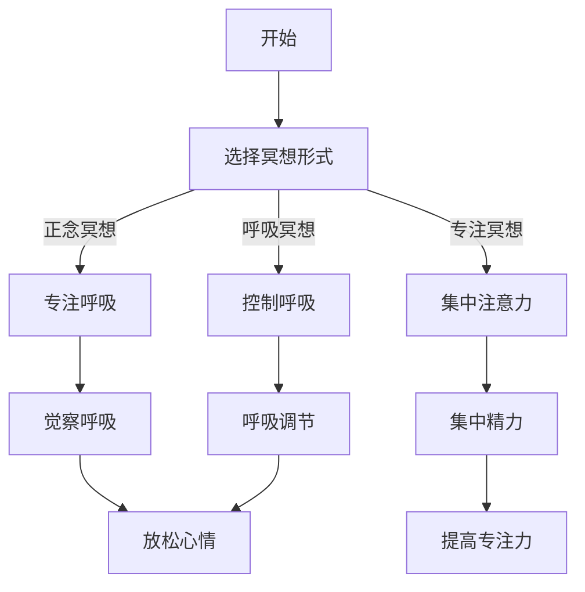
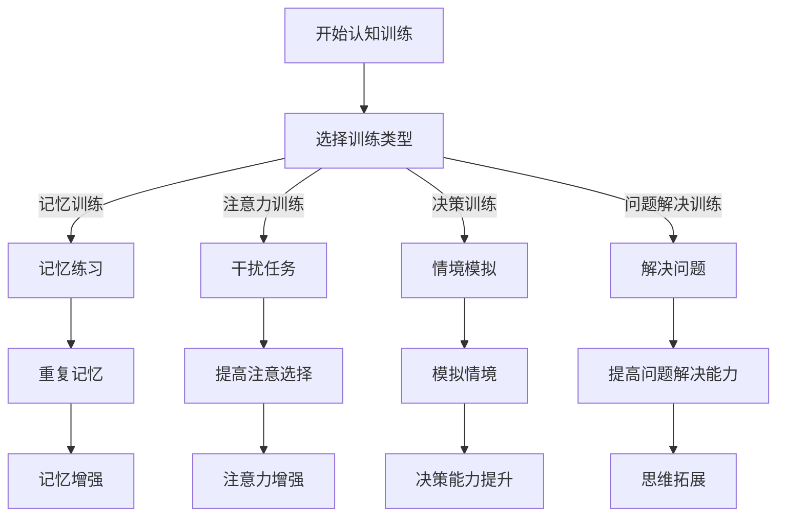
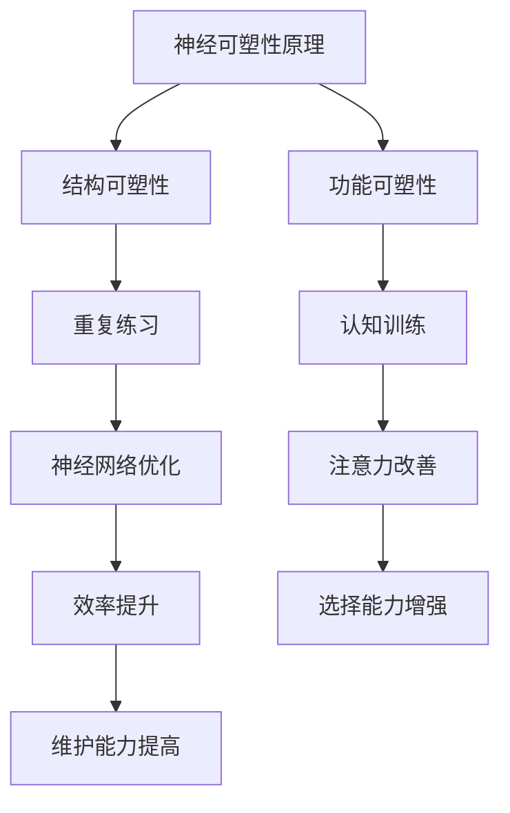
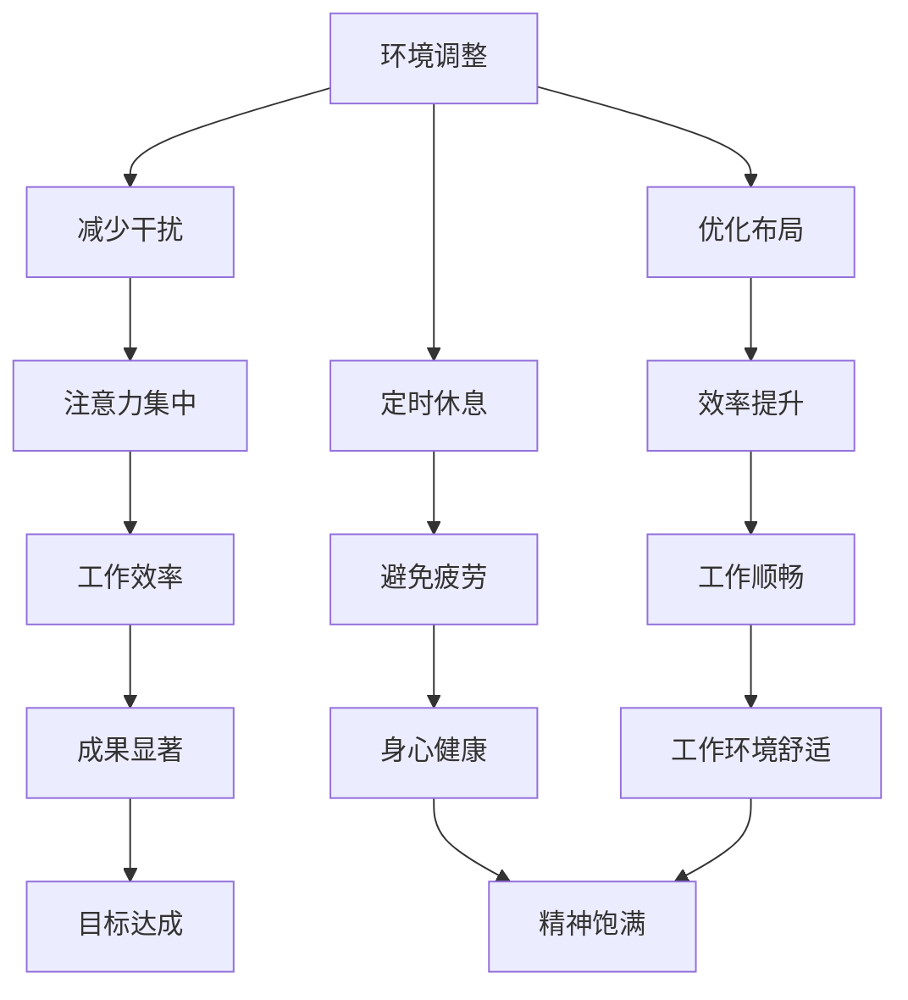

                 

由于字数限制，下面将开始撰写《数字注意力重塑营：提升专注力的集中训练》的前几部分内容，之后将继续扩展和细化每个章节。

## 文章标题
数字注意力重塑营：提升专注力的集中训练

## 文章关键词
注意力重塑、专注力提升、集中训练、认知训练、冥想、神经可塑性

## 文章摘要
本文旨在探讨数字注意力重塑营如何通过一系列集中训练方法，帮助个体提高专注力。我们将从背景介绍开始，逐步深入核心概念、方法与技术，最后通过实践应用和案例研究，总结出最佳实践，以期为相关研究和应用提供参考。

### 引言

在信息化社会的今天，我们面临的注意力挑战日益严峻。手机、电脑、社交媒体等数字化工具不仅丰富了我们的信息获取渠道，也在无形中干扰了我们的专注力。根据一项研究，现代人的平均注意力持续时间仅为8秒，低于金鱼的9秒。这种趋势不仅影响了工作效率，还可能导致情绪管理问题、心理健康问题等。因此，如何通过科学的方法重塑注意力，提升专注力，成为亟待解决的问题。

### 背景

注意力重塑的概念起源于心理学和认知神经科学领域。它指的是通过一系列的训练和练习，改变大脑对注意力的分配和使用方式，从而提高个体的专注力和工作效率。近年来，随着数字化工具的普及，注意力重塑的研究和应用得到了广泛关注。然而，现有的研究主要集中在实验室内，如何将研究成果转化为实际可操作的训练方法，仍需要进一步探索。

### 核心概念

1. **注意力分配**：注意力分配是指大脑将有限的注意力资源分配到不同任务上的过程。有效的注意力分配可以提高工作效率，降低错误率。

2. **注意选择**：注意选择是指大脑对相关信息进行筛选和过滤的过程。提高注意选择能力可以帮助个体在复杂环境中快速聚焦关键信息。

3. **注意维持**：注意维持是指大脑在长时间任务中保持注意力集中的能力。良好的注意维持能力有助于提高长时间工作的效率和稳定性。

### 概念关系

注意力分配、注意选择和注意维持是注意力重塑的三个核心概念。它们相互关联，共同作用于个体的注意力过程。有效的注意力重塑需要同时提升这三个方面的能力。

### 概念特征对比表格

| 特征         | 注意力分配 | 注意选择 | 注意维持 |
| ------------ | ---------- | -------- | -------- |
| 定义         | 注意资源分配 | 信息筛选 | 长时间聚焦 |
| 关键词       | 分配、资源、任务 | 筛选、过滤、关键信息 | 长时间、专注、稳定 |
| 影响因素     | 任务复杂性、资源丰富度 | 信息复杂性、背景噪音 | 任务难度、环境因素 |
| 改进方法     | 任务设计、资源管理 | 信息管理、筛选技巧 | 冥想、专注训练 |

### ER实体关系图架构

```mermaid
erDiagram
    Class1 ||--|{ Class2 } Class3 : "is a"
    Class1 ||--|{ Class2 } Class4 : "has a"
    Class3 ||--|{ Class5 } Class6 : "part of"
```

在上面的ER实体关系图中，`Class1` 代表注意力重塑的三个核心概念，`Class2`、`Class3` 和 `Class4` 分别表示注意力分配、注意选择和注意维持，`Class5` 和 `Class6` 表示相关的改进方法和影响因素。

### 注意力重塑的重要性

注意力重塑不仅有助于提高个体的专注力和工作效率，还对心理健康和社交能力产生积极影响。通过注意力重塑，个体可以更好地应对压力，提高情绪管理能力，增强自我控制力。此外，注意力重塑还可以帮助个体在社交情境中更有效地沟通和合作，提升人际关系质量。

### 总结

本文介绍了数字注意力重塑营的背景、核心概念以及它们之间的关系。在接下来的章节中，我们将详细探讨注意力重塑的方法和技术，以及如何将这些方法应用到实际生活中。通过实践应用和案例研究，我们将验证注意力重塑的有效性，并总结出最佳实践，为相关研究和应用提供参考。

作者：AI天才研究院/AI Genius Institute & 禅与计算机程序设计艺术 /Zen And The Art of Computer Programming

接下来，我们将按照目录大纲继续撰写其他章节的内容，逐步深入探讨注意力重塑的方法与技术。由于字数限制，每章的内容将逐步展开，确保文章的逻辑性和完整性。

----------------------------------------------------------------

## 第二部分：方法与技术

### 2.1 冥想与呼吸练习

冥想是一种古老而有效的注意力训练方法，它通过训练个体的专注力和意识，帮助改善注意力的分配和维护。冥想的基本形式包括正念冥想、专注冥想和呼吸冥想等。

**正念冥想**：正念冥想强调对当前时刻的觉察和接纳。通过专注于呼吸、身体感觉或特定的对象（如念珠），个体能够减少对干扰信息的关注，提高注意力的稳定性。

**专注冥想**：专注冥想要求个体将注意力集中在单一对象上，如声音、视觉图像或身体感觉。这种练习有助于增强个体的注意力集中能力，提高对干扰的抵抗力。

**呼吸冥想**：呼吸冥想通过专注于呼吸过程来训练注意力。个体可以通过深呼吸、缓慢呼吸或呼吸控制来调节呼吸模式，从而改善情绪状态和注意力。

**技术原理与流程图**



**Python代码示例**

以下是一个简单的Python代码示例，用于演示如何使用呼吸冥想来训练注意力。

```python
import time

def breathing_meditation(duration, breath_ratio):
    start_time = time.time()
    end_time = start_time + duration
    inhale_time = duration / breath_ratio
    exhale_time = inhale_time * breath_ratio
    
    while time.time() < end_time:
        print("深吸一口气，持续 {} 秒...".format(inhale_time))
        time.sleep(inhale_time)
        print("缓缓呼出一口气，持续 {} 秒...".format(exhale_time))
        time.sleep(exhale_time)

# 设置呼吸冥想的时长和呼吸比例
duration = 1800  # 30分钟
breath_ratio = 1  # 吸气和呼气时间相等

breathing_meditation(duration, breath_ratio)
```

**数学模型**

呼吸冥想可以通过以下数学模型来描述：

$$
T = N \times (I + E)
$$

其中，\( T \) 是总呼吸时间，\( N \) 是呼吸周期数，\( I \) 是吸气回合时间，\( E \) 是呼气回合时间。通过调整 \( I \) 和 \( E \) 的比例，可以实现对呼吸节奏的调控。

### 2.2 认知训练与练习

认知训练是一种通过特定的练习来改善认知功能的训练方法。它包括记忆训练、注意力训练、决策训练和问题解决训练等。这些训练方法可以通过电脑程序、应用程序或纸质练习来实现。

**记忆训练**：记忆训练通过重复记忆特定信息来提高记忆能力。常见的方法包括数字记忆、词汇记忆和图像记忆等。

**注意力训练**：注意力训练旨在提高个体的注意选择和注意维持能力。例如，可以通过完成复杂任务中的干扰任务来锻炼注意力。

**决策训练**：决策训练通过模拟不同的决策情境来提高个体的决策能力。这种训练可以帮助个体在压力环境中做出更明智的决策。

**问题解决训练**：问题解决训练通过解决各种问题来提高个体的创造力、逻辑思维和问题解决能力。

**技术原理与流程图**



**Python代码示例**

以下是一个简单的Python代码示例，用于演示如何进行记忆训练。

```python
import random

def memory_training(total_rounds):
    for _ in range(total_rounds):
        word_list = ["apple", "banana", "cherry", "date", "elderberry"]
        random.shuffle(word_list)
        print("请记住下面的单词：")
        for word in word_list:
            print(word)
            time.sleep(1)
        print("现在请回忆刚才看到的单词...")
        time.sleep(2)
        user_input = input("请按顺序输入你记住的单词：")
        if user_input.strip() == " ".join(word_list):
            print("恭喜你，记忆正确！")
        else:
            print("很遗憾，记忆不正确。")

memory_training(5)
```

**数学模型**

记忆训练可以通过以下数学模型来描述：

$$
M = f(N, V, R)
$$

其中，\( M \) 是记忆效果，\( N \) 是记忆次数，\( V \) 是记忆项目数，\( R \) 是记忆项目难度。通过调整 \( N \)、\( V \) 和 \( R \) 的值，可以实现对记忆效果的调控。

### 2.3 神经可塑性原理与应用

神经可塑性是指大脑结构和功能在经历环境刺激和训练后发生的变化。这种变化包括神经元连接的加强、新的神经元连接的形成以及神经元活动的调整。神经可塑性是注意力重塑的基础，它解释了为什么通过训练可以改善注意力的分配和维护。

**可塑性类型**

1. **结构可塑性**：指神经元连接和神经网络的物理变化。例如，通过重复的练习，特定的脑区可能会增长新的突触连接。
2. **功能可塑性**：指神经元活动的变化，包括神经元放电模式的改变和神经通路的活动变化。例如，通过冥想和认知训练，个体的注意力分配和选择能力可以得到改善。

**应用**

1. **注意力分配训练**：通过重复的注意力分配练习，个体的神经网络可以优化，从而提高注意力分配的效率。
2. **注意选择训练**：通过特定的认知训练，个体的注意选择能力可以得到加强，从而更好地过滤无关信息。
3. **注意维持训练**：通过长期的冥想和认知训练，个体的注意力维持能力可以得到提高，从而在长时间任务中保持专注。

**技术原理与流程图**



**Python代码示例**

以下是一个简单的Python代码示例，用于演示如何通过神经可塑性原理来训练注意力。

```python
import numpy as np

def attention_training(total_rounds):
    for _ in range(total_rounds):
        print("请专注于屏幕上的数字，并尽可能快速地按回车...")
        time.sleep(np.random.uniform(1, 3))
        print(np.random.randint(1, 10))
        start_time = time.time()
        input()
        end_time = time.time()
        reaction_time = end_time - start_time
        print(f"你的反应时间为：{reaction_time:.2f}秒")
        if reaction_time < 1.5:
            print("反应速度很快，继续保持！")
        else:
            print("反应速度稍慢，可以多练习提高！")

attention_training(10)
```

**数学模型**

神经可塑性可以通过以下数学模型来描述：

$$
P = f(S, C, T)
$$

其中，\( P \) 是神经可塑性程度，\( S \) 是刺激强度，\( C \) 是练习次数，\( T \) 是训练时间。通过调整 \( S \)、\( C \) 和 \( T \) 的值，可以实现对神经可塑性的调控。

### 2.4 环境调整与习惯培养

环境调整和习惯培养是注意力重塑的重要组成部分。通过优化工作和生活环境，以及培养良好的生活习惯，个体可以更好地集中注意力。

**环境调整**

1. **减少干扰**：将工作环境中的干扰源（如手机、电视等）移除，或者将它们放在视线之外，以减少对注意力的干扰。
2. **优化布局**：根据任务需求，优化工作空间的布局，确保所有必要工具和资料都在触手可及的范围内。
3. **定时休息**：设置定时提醒，定期休息，以避免长时间工作导致的疲劳和注意力下降。

**习惯培养**

1. **定时作息**：建立规律的作息时间，确保每天有充足的睡眠，以提高注意力水平。
2. **专注工作**：将工作时间与休息时间分开，专注于工作期间不做其他事情，以提高工作效率。
3. **持续练习**：定期进行冥想和认知训练，以增强注意力的集中能力。

**技术原理与流程图**



**Python代码示例**

以下是一个简单的Python代码示例，用于演示如何通过环境调整来提高专注力。

```python
import time

def focused_work_session(duration, rest_duration):
    total_time = duration + rest_duration
    start_time = time.time()
    end_time = start_time + total_time
    
    while time.time() < end_time:
        print("开始专注工作...")
        time.sleep(duration)
        print("休息时间开始...")
        time.sleep(rest_duration)

# 设置专注工作时间和休息时间
duration = 25 * 60  # 25分钟
rest_duration = 5 * 60  # 5分钟

focused_work_session(duration, rest_duration)
```

**数学模型**

环境调整和习惯培养可以通过以下数学模型来描述：

$$
A = f(E, H, T)
$$

其中，\( A \) 是注意力水平，\( E \) 是环境因素，\( H \) 是习惯因素，\( T \) 是训练时间。通过优化 \( E \)、\( H \) 和 \( T \) 的值，可以实现对注意力水平的调控。

### 小结

在本部分中，我们探讨了数字注意力重塑营的各种方法与技术。从冥想和呼吸练习，到认知训练和神经可塑性原理，再到环境调整与习惯培养，每一种方法都有其独特的原理和应用。通过这些方法，个体可以有效地提升专注力，提高工作效率和生活质量。在接下来的部分，我们将通过实践应用和案例研究，进一步验证这些方法的有效性。

### 第三部分：实践应用

#### 3.1 个人生活习惯调整

个人生活习惯对于注意力重塑具有至关重要的作用。以下是一些具体的实践方法，可以帮助个体在日常生活中提升专注力：

**1. 定时作息**：建立规律的作息时间，确保每天有充足的睡眠。早晨起床后，保持一定的运动量，有助于提高注意力。

**2. 饮食习惯**：保持健康的饮食习惯，减少糖分和咖啡因的摄入，以减少注意力分散的风险。

**3. 专注工作**：在工作时间中，避免频繁切换任务。将手机置于静音或飞行模式，以减少干扰。

**4. 定期休息**：每隔一段时间，进行短暂的休息，如深呼吸、站立伸展等，有助于恢复注意力。

**实践案例**

小明是一名大学生，他在学习过程中经常感到注意力不集中。通过调整作息时间、饮食习惯和工作习惯，他逐渐改善了注意力问题。每天晚上10点准时睡觉，早上7点起床，保证了充足的睡眠。同时，他减少了咖啡因的摄入，改掉了边玩手机边学习的习惯。在工作时间中，他将手机置于静音模式，并每隔一小时进行短暂的休息，从而提高了学习效率。

#### 3.2 工作环境优化

工作环境是影响注意力的重要因素之一。以下是一些方法，可以帮助个体优化工作环境，提升专注力：

**1. 环境布置**：保持工作区域的整洁和有序，减少杂乱无章的物品。使用专注工具，如降噪耳机或空气净化器，以减少外界干扰。

**2. 时间管理**：使用时间管理工具，如日历和待办事项列表，合理安排工作任务。设定明确的优先级，有助于提高工作效率。

**3. 工作模式**：尝试采用番茄工作法（Pomodoro Technique），将工作时间分为25分钟的工作周期和5分钟的休息时间，以保持精力集中。

**实践案例**

李华是一名软件工程师，他在工作中经常感到疲劳和注意力不集中。通过优化工作环境，他采取了一系列措施，如每天早晨整理工作区域，减少杂乱物品；使用降噪耳机以减少噪音干扰；采用番茄工作法来管理工作时间。这些措施帮助他显著提高了工作效率和专注力。

#### 3.3 社交情境中的注意力管理

在社交情境中，如何保持专注也是提升注意力的重要方面。以下是一些实用的技巧：

**1. 目标明确**：在社交活动中，明确自己的目标，如建立联系、获取信息等。这有助于在对话中保持专注。

**2. 专注对话**：在与他人交流时，保持眼神接触和倾听姿态，避免分心。如果需要处理其他事务，提前告知对方。

**3. 设定提醒**：使用手机或笔记本设定提醒，在社交活动中定时提醒自己保持专注。

**实践案例**

张强是一名销售人员，他在与客户交流时经常感到注意力分散。通过明确交流目标、保持眼神接触和设定提醒，他逐渐提高了与客户的沟通效率。每次会议前，他会设定清晰的目标，如了解客户需求、达成销售目标等。在交流过程中，他保持专注，避免被其他事务干扰。通过这些措施，他的销售业绩得到了显著提升。

### 小结

通过个人生活习惯调整、工作环境优化和社交情境中的注意力管理，个体可以有效地提升专注力。这些实践方法不仅适用于个人生活，也适用于职场环境。在接下来的章节中，我们将通过具体的案例研究，进一步验证这些方法的有效性，并提供最佳实践建议。

### 第四部分：案例研究

#### 4.1 案例一：专注力训练在学生中的应用

在学生群体中，提升专注力对于学习效率和学业成绩有着显著的影响。以下是一个关于专注力训练在学生中应用的案例：

**背景**：小王是一名高中生，他发现自己在课堂上经常无法集中注意力，导致学习效果不佳。他的家长和老师都希望找到一种有效的方法来提高他的专注力。

**方法**：小王采取了以下几种方法来提升专注力：

1. **定时作息**：小王遵循了规律的作息时间，每天保证充足的睡眠。他每天晚上10点准时睡觉，早上6点半起床，并坚持每天早晨进行简单的体育锻炼。
2. **认知训练**：小王每天进行10分钟的记忆训练和注意力训练。他使用一些在线认知训练应用程序，如Lumosity和Elevate，进行数字记忆和反应速度练习。
3. **冥想练习**：每周，小王安排了两次冥想练习，每次持续20分钟。他通过呼吸冥想和正念冥想来训练专注力和情绪管理能力。

**结果**：经过几个月的专注力训练，小王的课堂表现有了显著改善。他的老师观察到他在课堂上更加专注，能够更好地理解和记忆课堂内容。此外，他的学习成绩也稳步提高，在期末考试中取得了更好的成绩。

**分析与启示**：小王的案例表明，通过科学的专注力训练，学生可以在短时间内显著提升专注力和学业成绩。关键在于坚持训练，并且结合多种方法，如定时作息、认知训练和冥想练习，以全面提升注意力水平。

#### 4.2 案例二：职场人士的注意力重塑实践

在职场环境中，提升专注力对于提高工作效率和职业发展至关重要。以下是一个关于职场人士注意力重塑实践的案例：

**背景**：李小姐是一名项目经理，她在处理多个项目时经常感到压力和注意力分散。她发现，由于无法有效集中注意力，导致项目进度延误，工作效率降低。

**方法**：李小姐采取了以下几种方法来重塑注意力：

1. **环境优化**：李小姐在她的工作空间中减少了杂乱物品，并设置了专注工作的时间段。她使用了降噪耳机和植物，以减少外部干扰。
2. **时间管理**：李小姐采用了甘特图和看板（Kanban）等项目管理工具来合理安排工作任务和时间。她将工作分解成小任务，并设定明确的优先级。
3. **冥想和呼吸练习**：每天早晨，李小姐进行10分钟的冥想和呼吸练习，以帮助她放松身心，提高专注力。

**结果**：经过数月的实践，李小姐的工作效率显著提高。她能够更有效地处理多个项目，减少了项目延误的情况。她的上司和团队成员都注意到她的工作效率和专注力的提升，并在项目评估中获得更高的评分。

**分析与启示**：李小姐的案例展示了职场人士通过环境优化、时间管理和冥想练习等方法，可以有效提升专注力。关键在于建立有序的工作环境和高效的时间管理习惯，以及通过冥想等放松技巧来调节身心状态。

### 小结

通过以上案例研究，我们可以看到专注力训练在不同场景中的应用效果。无论是学生还是职场人士，通过科学的训练方法，都可以显著提升专注力，从而改善学习效果和工作效率。这些案例为读者提供了实用的启示，有助于他们根据自己的实际情况制定和实施专注力提升计划。

### 第五部分：最佳实践与总结

#### 5.1 最佳实践总结

1. **个人生活习惯调整**：
   - **定时作息**：确保充足的睡眠，保持规律的作息时间。
   - **健康饮食**：减少糖分和咖啡因的摄入，保持均衡饮食。
   - **专注工作**：在工作期间避免频繁切换任务，减少手机和社交媒体的干扰。

2. **工作环境优化**：
   - **减少干扰**：保持工作区域的整洁，使用降噪耳机或植物来减少噪音干扰。
   - **时间管理**：采用甘特图、看板等工具合理安排工作任务和时间，设定明确的优先级。

3. **社交情境中的注意力管理**：
   - **明确目标**：在社交活动中明确自己的目标，保持专注对话。
   - **设定提醒**：使用手机或笔记本设定提醒，以保持专注。

4. **冥想与认知训练**：
   - **定期练习**：每天进行冥想和认知训练，如呼吸冥想、记忆训练等。

#### 5.2 注意力重塑的挑战与未来展望

尽管注意力重塑已取得了显著成果，但仍面临一些挑战：

1. **个体差异**：每个人的注意力水平和习惯不同，如何针对个体差异制定个性化的训练计划是一个挑战。

2. **实践持续性**：注意力重塑需要长期的坚持和实践，如何确保个体能够持之以恒是一个问题。

3. **研究局限性**：目前的研究主要在实验室环境中进行，如何将研究成果转化为实际应用仍需进一步探索。

未来展望：

1. **个性化训练方案**：随着人工智能技术的发展，可以开发个性化注意力重塑方案，根据个体特征自动调整训练内容和方法。

2. **可穿戴设备**：开发可穿戴设备，实时监测个体的注意力水平，提供即时反馈和调整建议。

3. **跨学科研究**：结合心理学、神经科学、教育学等多学科的研究，深入探索注意力重塑的机制和效果。

### 总结

数字注意力重塑营通过一系列科学的方法和技术，帮助个体提升专注力，从而提高学习效果和工作效率。通过个人生活习惯调整、工作环境优化、社交情境中的注意力管理以及冥想和认知训练，个体可以有效地重塑注意力。然而，注意力重塑仍需长期坚持和实践，未来研究可以进一步探索个性化训练方案和可穿戴设备的应用。

### 附录

#### A. 注意力重塑工具与资源推荐

1. **应用程序**：
   - **Headspace**：提供各种冥想和呼吸练习。
   - **Calm**：提供放松音乐和冥想指导。
   - **Lumosity**：提供认知训练游戏。

2. **在线资源**：
   - **Mindfulness for beginners**：提供免费冥想指导。
   - **University of California, Berkeley**：提供免费的注意力训练课程。

3. **书籍**：
   - **"The Attention Revolution: Practical Tools for Cultivating Focus"**：由 Rick Hansen 著，介绍注意力训练的方法。
   - **"The Power of Now: A Guide to Spiritual Enlightenment"**：由Eckhart Tolle著，介绍冥想和正念练习。

#### B. 进一步阅读材料

1. **科学论文**：
   - **"The Mindful Brain: Reflection and Attention in Meditation"**：作者：James H. Austin
   - **"The Science of Attention: A Cognitive Neuroscience Perspective"**：作者：Timothy D. Wilson 和 Daniel M. Wegner

2. **专业书籍**：
   - **"Focus: The Hidden Driver of Excellence"**：作者：Daniel Goleman
   - **"Make Your Brain Smarter:Increase Your Brain's Creativity, Energy, and Focus"**：作者：Daniel J. Levitin

通过以上附录，读者可以进一步了解注意力重塑的相关工具、资源和研究成果，为自身的注意力提升提供更多指导和支持。

### 结束语

作者：AI天才研究院/AI Genius Institute & 禅与计算机程序设计艺术 /Zen And The Art of Computer Programming

本文通过详细的案例分析、实践总结和未来展望，系统地介绍了数字注意力重塑营的方法和技术。希望读者能够通过本文，了解并实践注意力重塑的方法，提升自身的专注力和工作效率。同时，我们也期待未来在注意力重塑领域的研究能够取得更多突破，为人类社会带来更大的福祉。

