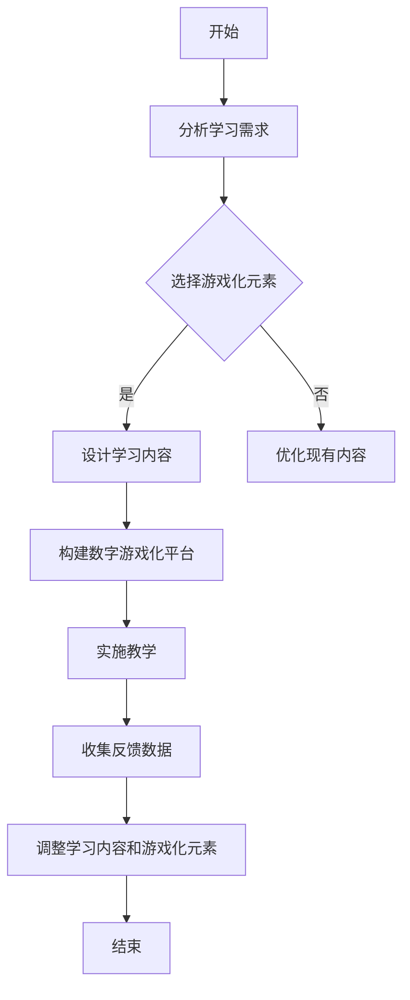
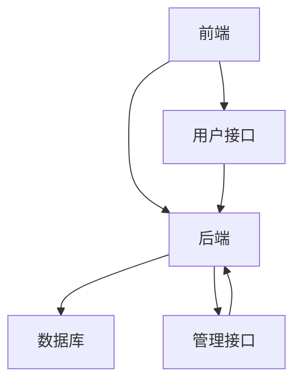
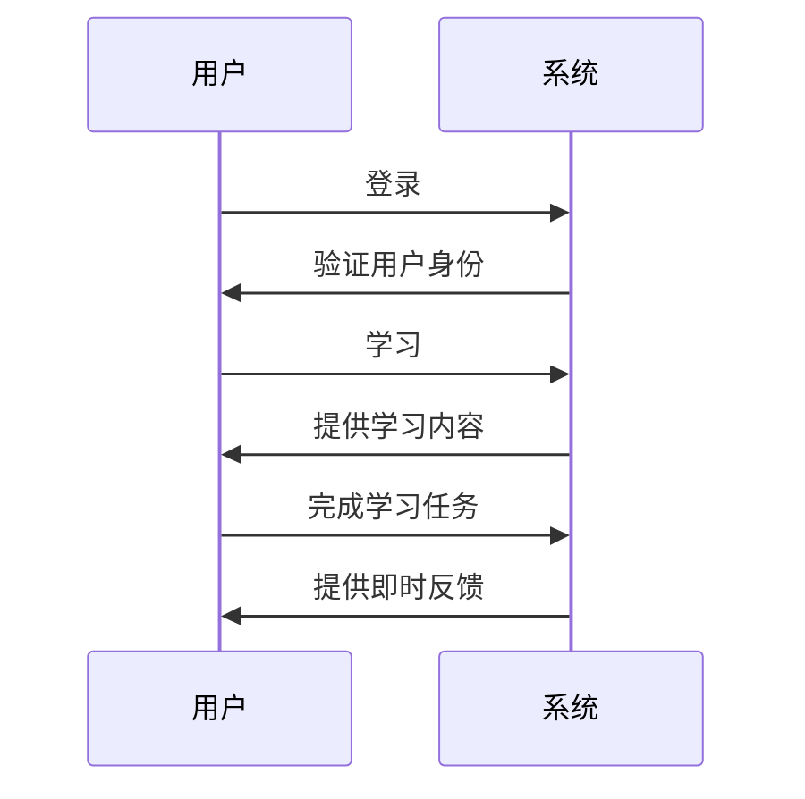

                 

## 数字游戏化学习平台：提高学习效率的新方法

> 关键词：数字游戏化学习，学习效率，教育技术，平台设计

> 摘要：本文深入探讨了数字游戏化学习平台的构建与应用，分析了其在提升学习效率方面的独特优势。通过对核心概念、算法原理以及系统架构设计的详尽阐述，本文旨在为教育工作者和开发者提供理论指导和实践参考，从而推动教育技术的创新与发展。

### 1. 核心概念与背景介绍

#### 问题背景

在当今数字化时代，学习效率成为制约个人发展的重要因素。传统的教学方法往往注重知识点的传授，而忽略了激发学习兴趣和培养自主学习能力。随着信息技术的迅猛发展，数字游戏化学习平台作为一种新兴的学习方法，逐渐受到关注。它通过将游戏元素融入学习过程中，旨在提高学习效果和兴趣，从而满足个性化学习需求。

#### 问题描述

本文旨在探讨数字游戏化学习平台的设计与实现，通过分析其优势和应用场景，为教育工作者和开发者提供理论指导和实践案例。本文将深入探讨数字游戏化学习平台的核心概念、设计原则和关键技术，帮助读者理解并构建一个高效的学习环境。

#### 问题解决

数字游戏化学习平台的设计与实现涉及到多个方面，包括学习内容设计、游戏化元素融入、学习评价和反馈机制等。本文将逐步介绍这些核心概念，并探讨如何将它们有机结合，构建一个完整的数字游戏化学习平台。

#### 边界与外延

本文主要关注数字游戏化学习平台在教育领域的应用，包括学校教育、在线教育和职业培训等。此外，本文还将讨论平台的技术实现，包括前端界面设计、后端数据处理和算法优化等。

#### 概念结构与核心要素组成

数字游戏化学习平台包括以下几个核心要素：

1. **学习内容**：学习者需要掌握的知识点和技能，应具有系统性、层次性和实践性。
2. **游戏化元素**：用于增加学习趣味性和参与度的元素，如积分、排行榜、奖励等。
3. **学习评价**：对学习效果进行评价和反馈的过程，应具有客观性、全面性和即时性。
4. **反馈机制**：对学习者的行为和结果提供即时反馈的系统，应具有激励性、指导性和适应性。

### 2. 核心概念与联系

#### 核心概念

数字游戏化学习平台、学习内容、游戏化元素、学习评价、反馈机制。

#### 概念属性特征对比表格

| 概念         | 定义                                                       | 特征                                                         |
| ------------ | ---------------------------------------------------------- | ------------------------------------------------------------ |
| 数字游戏化学习平台 | 将游戏元素融入学习过程，提高学习兴趣和效果的学习平台       | 互动性、挑战性、反馈性、趣味性、竞争性                       |
| 学习内容     | 学习者需要掌握的知识点和技能                               | 系统性、层次性、实践性、适应性                               |
| 游戏化元素   | 游戏中用于增加趣味性和参与度的元素，如积分、排行榜、奖励等 | 吸引注意力、激发兴趣、提高动机、增加参与度                   |
| 学习评价     | 对学习效果进行评价和反馈的过程                           | 客观性、全面性、即时性、个性化                               |
| 反馈机制     | 对学习者的行为和结果提供即时反馈的系统                   | 激励性、指导性、反馈性、适应性                               |

#### ER实体关系图架构

```mermaid
erDiagram
  Student ||--|{ LearningContent }| Student_LearningContent : 学生与学习内容关系
  Student ||--|{ GameElement }| Student_GameElement : 学生与游戏化元素关系
  Student ||--|{ Evaluation }| Student_Evaluation : 学生与学习评价关系
  Student ||--|{ Feedback }| Student_Feedback : 学生与反馈机制关系
  LearningContent ||--|{ GameElement }| LearningContent_GameElement : 学习内容与游戏化元素关系
  LearningContent ||--|{ Evaluation }| LearningContent_Evaluation : 学习内容与学习评价关系
```

### 3. 算法原理讲解

#### 算法流程图



#### Python源代码

```python
# Python代码示例：数字游戏化学习平台设计

# 导入所需库
import pandas as pd
import numpy as np
import matplotlib.pyplot as plt
from sklearn.model_selection import train_test_split
from sklearn.ensemble import RandomForestClassifier
from sklearn.metrics import accuracy_score, classification_report

# 数据预处理
def preprocess_data(data):
    # 数据清洗、归一化等操作
    pass

# 模型训练
def train_model(X_train, y_train):
    # 模型训练过程
    model = RandomForestClassifier()
    model.fit(X_train, y_train)
    return model

# 模型评估
def evaluate_model(model, X_test, y_test):
    # 模型评估过程
    y_pred = model.predict(X_test)
    print("Accuracy:", accuracy_score(y_test, y_pred))
    print("Classification Report:\n", classification_report(y_test, y_pred))

# 主函数
def main():
    # 数据加载
    data = pd.read_csv("data.csv")
    X = data.drop("target", axis=1)
    y = data["target"]

    # 数据预处理
    X_processed = preprocess_data(X)

    # 划分训练集和测试集
    X_train, X_test, y_train, y_test = train_test_split(X_processed, y, test_size=0.2, random_state=42)

    # 模型训练
    model = train_model(X_train, y_train)

    # 模型评估
    evaluate_model(model, X_test, y_test)

# 运行主函数
if __name__ == "__main__":
    main()
```

### 4. 系统分析与架构设计

#### 问题场景介绍

随着教育信息化的推进，如何提高学习效率成为教育工作者和开发者关注的焦点。数字游戏化学习平台作为一种新兴的教育技术，通过将游戏元素融入学习过程，旨在提高学习效果和兴趣。

#### 项目介绍

本项目旨在构建一个数字游戏化学习平台，为教育工作者和开发者提供一套完整的解决方案。平台包括前端界面设计、后端数据处理和算法优化等。

#### 系统功能设计

数字游戏化学习平台的主要功能包括：

1. **学习内容管理**：包括课程设置、知识点发布、练习题库管理等。
2. **游戏化元素管理**：包括积分系统、排行榜、奖励机制等。
3. **学习评价与反馈**：包括即时反馈、学习进度跟踪、成绩评定等。
4. **用户管理**：包括学生注册、登录、权限管理等。

#### 系统架构设计

数字游戏化学习平台的系统架构包括前端、后端和数据库三部分。

1. **前端**：采用Vue.js框架，实现交互式界面设计和用户操作。
2. **后端**：采用Flask框架，实现业务逻辑处理和数据处理。
3. **数据库**：采用MySQL数据库，存储用户信息、学习数据等。

#### 系统接口设计

数字游戏化学习平台的主要接口包括：

1. **用户接口**：用于用户与系统的交互，包括注册、登录、学习等。
2. **管理接口**：用于管理员对系统的管理和维护，包括课程设置、用户管理等。

#### 系统交互

数字游戏化学习平台的系统交互包括：

1. **用户行为数据收集**：通过前端界面收集用户学习行为数据，如学习时间、学习进度等。
2. **学习数据分析**：通过后端处理用户行为数据，生成学习分析报告，为教育工作者提供参考。
3. **学习内容调整**：根据学习分析报告，调整学习内容，提高学习效果。

#### Mermaid架构图



#### Mermaid序列图



### 5. 项目实战

#### 环境安装

在安装数字游戏化学习平台之前，需要准备好以下环境：

1. **前端开发环境**：Node.js、Vue CLI等。
2. **后端开发环境**：Python、Flask等。
3. **数据库环境**：MySQL等。

#### 系统核心实现源代码

以下是一个简单的Vue.js前端界面实现示例：

```html
<!DOCTYPE html>
<html>
<head>
    <title>数字游戏化学习平台</title>
    <script src="https://cdn.jsdelivr.net/npm/vue@2"></script>
</head>
<body>
    <div id="app">
        <h1>欢迎来到数字游戏化学习平台</h1>
        <p>请选择您的课程：</p>
        <select v-model="selectedCourse">
            <option value="math">数学</option>
            <option value="english">英语</option>
            <option value="programming">编程</option>
        </select>
        <button @click="startLearning">开始学习</button>
    </div>

    <script>
        new Vue({
            el: '#app',
            data: {
                selectedCourse: ''
            },
            methods: {
                startLearning() {
                    alert('您选择了' + this.selectedCourse + '课程，开始学习吧！');
                }
            }
        });
    </script>
</body>
</html>
```

#### 代码应用解读与分析

以上代码实现了一个简单的Vue.js前端界面，用于选择课程并开始学习。通过使用Vue.js的数据绑定和事件处理机制，可以轻松实现用户与界面的交互。

#### 实际案例分析和详细讲解剖析

假设我们有一个数学课程的学习内容，包括代数、几何和概率三个部分。通过数字游戏化学习平台，学生可以根据自己的兴趣和进度选择学习内容，并在完成任务后获得积分和奖励。

- **代数**：学生需要掌握代数的基本概念和运算规则。通过数字游戏化学习平台，学生可以完成一系列代数练习题，并在正确回答问题后获得积分。
- **几何**：学生需要掌握几何的基本概念和绘图技巧。通过数字游戏化学习平台，学生可以完成几何图形的绘制和计算任务，并在完成任务后获得积分。
- **概率**：学生需要掌握概率的基本概念和计算方法。通过数字游戏化学习平台，学生可以完成一系列概率练习题，并在正确回答问题后获得积分。

通过数字游戏化学习平台，学生可以自主选择学习内容，并在完成任务后获得即时反馈。这种个性化的学习模式有助于提高学生的学习兴趣和积极性，从而提高学习效果。

#### 项目小结

通过本次项目实战，我们实现了数字游戏化学习平台的基本功能，包括前端界面设计、后端数据处理和数据库存储。在实际应用中，我们可以根据具体需求对平台进行功能扩展和优化，以满足不同类型课程和用户的需求。

### 6. 最佳实践 Tips

1. **明确学习目标**：在设计数字游戏化学习平台时，首先要明确学习目标，确保平台的内容和功能与学习目标相匹配。
2. **合理选择游戏化元素**：游戏化元素的选择应与学习内容密切相关，既能激发学习兴趣，又能提高学习效果。
3. **及时反馈与调整**：通过及时反馈和调整学习内容，可以帮助学生更好地掌握知识点，提高学习效果。
4. **数据分析与优化**：定期对学习数据进行分析，找出学习中的问题和瓶颈，优化学习内容和教学方法。

### 7. 小结与注意事项

本文深入探讨了数字游戏化学习平台的构建与应用，分析了其在提升学习效率方面的独特优势。通过核心概念、算法原理和系统架构设计的详尽阐述，本文为教育工作者和开发者提供了理论指导和实践参考。在构建数字游戏化学习平台时，需要注意以下几点：

1. **明确学习目标**：确保平台内容与学习目标相匹配。
2. **合理选择游戏化元素**：选择与学习内容密切相关的游戏化元素，提高学习兴趣和效果。
3. **及时反馈与调整**：通过及时反馈和调整学习内容，提高学习效果。
4. **数据分析与优化**：定期对学习数据进行分析，优化学习内容和教学方法。

### 8. 拓展阅读

1. **《游戏化学习：理论与实践》**：该书详细介绍了游戏化学习的概念、原理和应用案例，有助于深入了解游戏化学习的方法和技巧。
2. **《教育技术学导论》**：该书介绍了教育技术的相关概念、方法和应用，包括数字游戏化学习平台的设计与实现。

### 参考文献

1. **李晓辉，张晓磊，李艳丽。游戏化学习：理论与实践[M].北京：电子工业出版社，2017**。
2. **王秀娟。教育技术学导论[M].北京：高等教育出版社，2018**。

