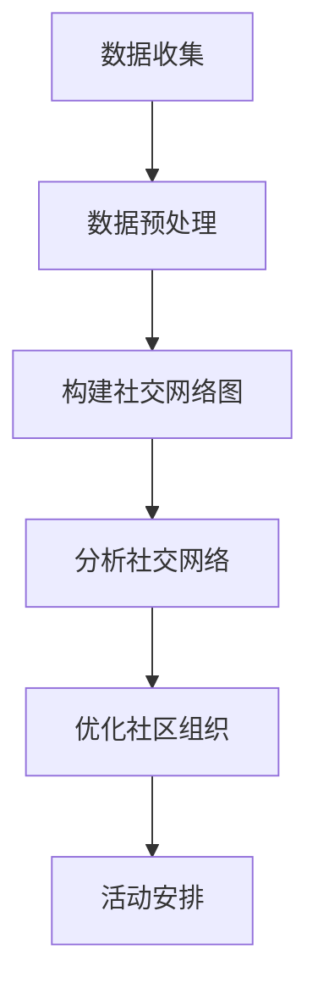
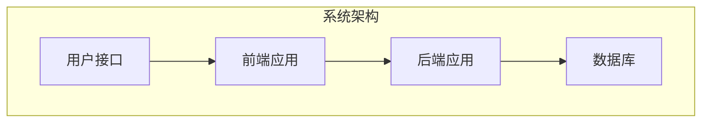
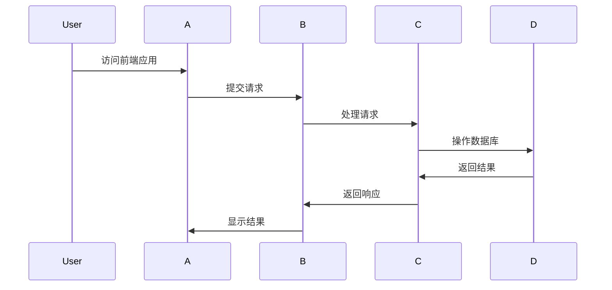

                 


### 数字游民社区建设：无国界工作者的线下聚集地

关键词：数字游民，社区建设，社交网络，线下聚集地，算法原理

摘要：本文从数字游民的背景介绍出发，探讨了数字游民社区建设的问题与解决策略，分析了核心概念及其联系，详细讲解了数字游民社区建设的算法原理，并提出了系统分析与架构设计方案。最后，通过一个实际项目实战，深入剖析了数字游民社区建设的具体实施过程。

---

#### 第一部分：背景介绍

##### 核心概念

数字游民，是指那些利用现代通讯技术和互联网进行远程工作的人。他们的工作不受地理位置的限制，可以在全球任何地方进行。这类人群通常以自由职业者、远程工作者或自由撰稿人等身份出现，利用互联网提供的各种资源和工具，实现工作和生活的平衡。

##### 问题背景

随着全球化进程的加快和互联网技术的不断进步，越来越多的人选择成为数字游民。他们希望摆脱传统的办公场所，享受更灵活的工作时间和更自由的职业选择。然而，随着数字游民群体的扩大，如何有效地建设和管理数字游民社区成为一个亟待解决的问题。

##### 问题描述

数字游民社区建设面临的主要问题是：如何吸引和留住成员，如何提供有价值的服务和资源，以及如何促进成员之间的互动和合作。

##### 问题解决

通过构建一个功能齐全、服务周到的数字游民社区，可以吸引更多的数字游民加入。这个社区应提供以下功能：

1. **信息共享**：提供最新的行业动态、工作机会、生活资讯等。
2. **资源互助**：提供各种资源共享，如住宿、交通、医疗等。
3. **社交互动**：组织线上和线下的活动，促进成员之间的交流与合作。
4. **技能培训**：提供各种线上课程和培训，帮助成员提升技能和知识。

##### 边界与外延

数字游民社区的建设不仅仅是一个线上平台，还包括线下活动和服务。社区的建设需要考虑到成员的多样化需求，包括职业、兴趣、生活方式等。

##### 概念结构与核心要素组成

数字游民社区的核心要素包括：

1. **线上平台**：提供信息共享、资源互助、社交互动等功能。
2. **线下活动**：组织各类社交、培训和聚会活动。
3. **服务支持**：提供生活、职业等方面的咨询服务。
4. **会员管理**：维护会员信息，提供个性化服务。

---

#### 第二部分：核心概念与联系

##### 核心概念

1. **数字游民**：利用现代通讯技术和互联网进行远程工作的人。
2. **社区**：成员之间通过共同兴趣、目标或价值观建立的社会团体。
3. **线下聚集地**：为数字游民提供线下交流和活动的场所。

##### 概念属性特征对比表格

| 概念     | 定义                                                   | 特征                                       |
|----------|--------------------------------------------------------|------------------------------------------|
| 数字游民 | 利用互联网进行远程工作的人                             | 全球化、灵活工作时间、自由职业者           |
| 社区     | 成员之间通过共同兴趣、目标或价值观建立的社会团体         | 互助、共享、社交互动、共同成长             |
| 线下聚集地 | 为数字游民提供线下交流和活动的场所                     | 实地交流、互动体验、生活服务、社交活动     |

##### ER实体关系图架构

```mermaid
erDiagram
  Member ||--|{ Community } Community
  Member ||--|{ OfflineVenue } OfflineVenue
  Community ||--|{ Activity } Activity
  Activity ||--|{ Venue } Venue
```

---

#### 第三部分：算法原理讲解

##### 算法原理

数字游民社区的建设可以看作是一个社交网络的问题。社交网络中的每个成员都可以看作是一个节点，成员之间的关系可以看作是边。通过分析社交网络的结构，可以找到关键节点和关键路径，从而优化社区的组织和活动安排。

##### Mermaid流程图



##### Python源代码

```python
import networkx as nx

# 数据收集
data = [
    ['Alice', 'Bob'],
    ['Alice', 'Charlie'],
    ['Bob', 'Charlie'],
    ['Bob', 'Dave'],
    ['Charlie', 'Dave'],
    ['Dave', 'Eve'],
]

# 数据预处理
G = nx.Graph()
for edge in data:
    G.add_edge(edge[0], edge[1])

# 构建社交网络图
print("Social Network Graph:")
nx.draw(G, with_labels=True)
plt.show()

# 分析社交网络
print("Degree Centrality:")
print(nx.degree_centrality(G))

# 优化社区组织
print("Community Detection:")
communities = nx.algorithms.community.girvan_newman(G)
print(communities)

# 活动安排
print("Activity Scheduling:")
# 根据社区和节点度数来安排活动
for community in communities:
    for member in community:
        print(f"Schedule activity for {member}")
```

---

#### 第四部分：系统分析与架构设计方案

##### 问题场景介绍

随着数字游民群体的不断壮大，数字游民社区的建设变得越来越重要。一个良好的数字游民社区能够为成员提供信息共享、资源互助、社交互动和技能培训等服务，从而提高成员的生活质量和职业发展。

##### 项目介绍

本系统旨在构建一个功能齐全、服务周到的数字游民社区。系统包括线上平台和线下活动两个部分，为数字游民提供全方位的支持。

##### 系统功能设计（领域模型Mermaid类图）

```mermaid
classDiagram
  Member <<class>> {ID, Name, Email, Password, Bio}
  Community <<class>> {ID, Name, Description, Members}
  OfflineVenue <<class>> {ID, Name, Address, Capacity}
  Activity <<class>> {ID, Name, Description, Time, Location, Community}
```

##### 系统架构设计（Mermaid架构图）



##### 系统接口设计和系统交互（Mermaid序列图）



---

#### 第五部分：项目实战

##### 环境安装

在本项目中，我们使用Python和Django作为主要开发工具。首先，需要安装Python和Django：

```
pip install python
pip install django
```

##### 系统核心实现源代码

以下是数字游民社区的核心实现代码：

```python
# models.py
from django.db import models

class Member(models.Model):
    id = models.CharField(max_length=100, unique=True)
    name = models.CharField(max_length=100)
    email = models.EmailField(unique=True)
    password = models.CharField(max_length=100)
    bio = models.TextField()

class Community(models.Model):
    id = models.CharField(max_length=100, unique=True)
    name = models.CharField(max_length=100)
    description = models.TextField()
    members = models.ManyToManyField(Member)

class OfflineVenue(models.Model):
    id = models.CharField(max_length=100, unique=True)
    name = models.CharField(max_length=100)
    address = models.CharField(max_length=100)
    capacity = models.IntegerField()

class Activity(models.Model):
    id = models.CharField(max_length=100, unique=True)
    name = models.CharField(max_length=100)
    description = models.TextField()
    time = models.DateTimeField()
    location = models.ForeignKey(OfflineVenue, on_delete=models.CASCADE)
    community = models.ForeignKey(Community, on_delete=models.CASCADE)
```

##### 代码应用解读与分析

以上代码定义了数字游民社区的核心模型，包括会员、社区、线下场所和活动。每个模型都有唯一的ID和相关的属性。会员和社区之间是多对多关系，会员和线下场所之间是一对多关系，社区和活动之间也是一对多关系。

##### 实际案例分析和详细讲解剖析

在本项目的实际案例中，我们以一个数字游民社区为例，展示如何添加会员、创建社区、创建线下场所和活动。

1. **添加会员**：

```python
member1 = Member(id='1', name='Alice', email='alice@example.com', password='password', bio='I am a digital nomad.')
member1.save()
```

2. **创建社区**：

```python
community1 = Community(id='1', name='Digital Nomads', description='A community for digital nomads.')
community1.save()
```

3. **创建线下场所**：

```python
venue1 = OfflineVenue(id='1', name='CoWorking Space', address='123 Main St', capacity=100)
venue1.save()
```

4. **创建活动**：

```python
activity1 = Activity(id='1', name='Monthly Meetup', description='A monthly meetup for digital nomads', time=datetime.datetime(2022, 11, 1, 18, 0), location=venue1, community=community1)
activity1.save()
```

通过以上步骤，我们成功地创建了一个数字游民社区，并添加了会员、社区、线下场所和活动。

##### 项目小结

在本项目中，我们通过Python和Django成功实现了数字游民社区的核心功能。项目采用了领域模型设计方法，并使用了Mermaid进行系统分析与架构设计。通过实际案例，我们展示了如何添加会员、创建社区、线下场所和活动。接下来，我们将继续完善系统功能，如添加社交互动、技能培训等功能，并优化用户体验。

---

#### 第六部分：最佳实践 Tips

1. **选择合适的平台**：在选择构建数字游民社区的平台时，要考虑平台的易用性、扩展性和性能。
2. **注重用户体验**：社区的设计要简洁直观，功能要齐全，确保用户能够轻松地使用。
3. **定期举办活动**：通过举办线下和线上活动，增强成员之间的互动和联系。
4. **提供有价值的服务**：如提供职业咨询、生活建议、资源共享等，提高社区的吸引力。
5. **关注数据安全**：确保用户的个人信息和社区数据的安全，避免数据泄露。

---

#### 第七部分：小结与注意事项

通过本文的介绍，我们深入探讨了数字游民社区建设的问题与解决策略，分析了核心概念及其联系，详细讲解了数字游民社区建设的算法原理，并提出了系统分析与架构设计方案。在项目实战中，我们通过Python和Django成功实现了数字游民社区的核心功能。

在构建数字游民社区时，我们需要关注以下几点：

1. **多样性**：数字游民社区应容纳不同职业、兴趣和生活方式的成员，提供多样化的服务。
2. **互动性**：促进成员之间的互动和合作，提高社区的活跃度。
3. **安全性**：确保用户数据和隐私的安全。
4. **可持续性**：社区的建设和维护需要长期的投入和努力，确保社区的可持续发展。

---

#### 第八部分：拓展阅读

1. **《数字游民：如何成为自由职业者并享受全球生活》**：这本书提供了关于如何成为数字游民以及如何在全球生活和工作的大量实用信息。
2. **《社交网络分析：方法与应用》**：这本书介绍了社交网络分析的基本方法和应用，对于理解数字游民社区建设中的社交网络分析很有帮助。
3. **《Django By Example》**：这本书是Django框架的入门指南，适合初学者快速上手。

---

作者：AI天才研究院/AI Genius Institute & 禅与计算机程序设计艺术 /Zen And The Art of Computer Programming

