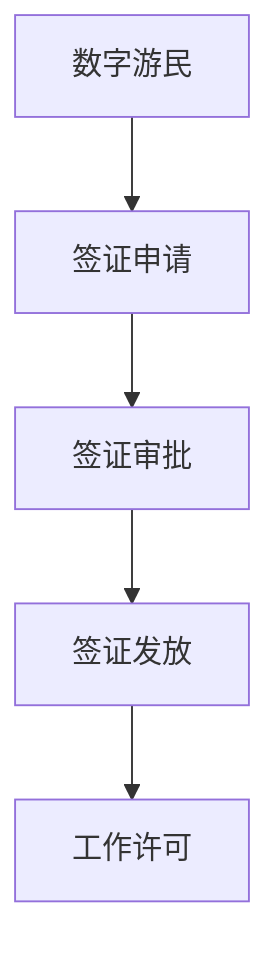
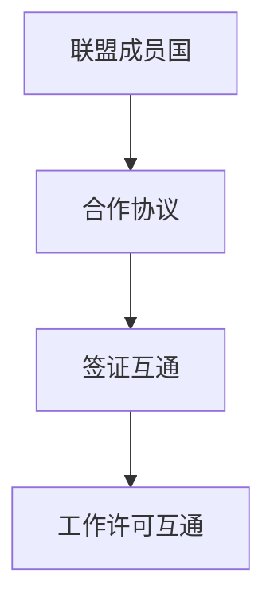
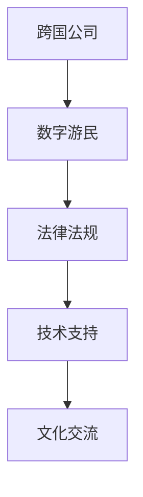
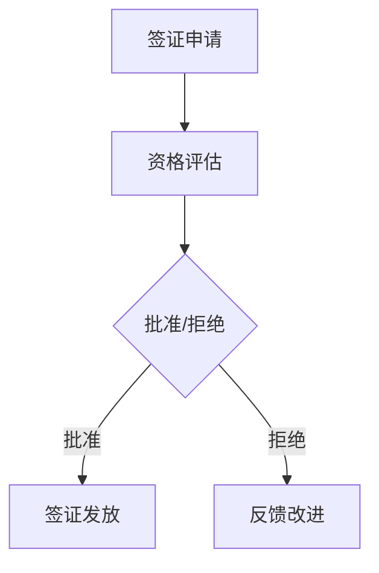
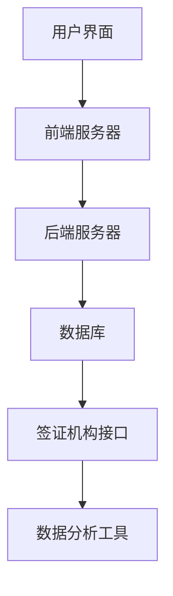
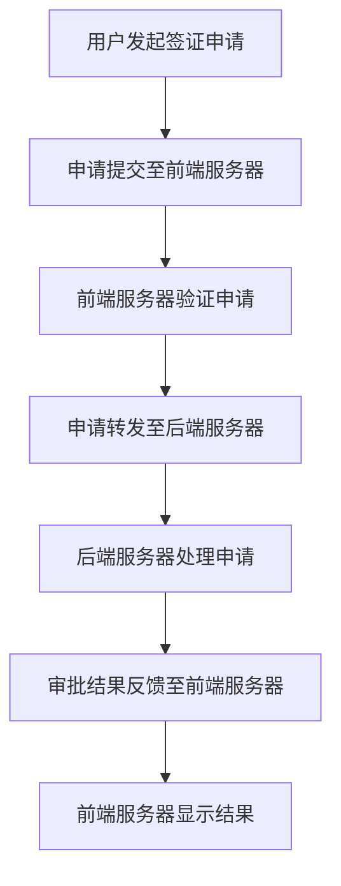

                 

### 数字游民签证联盟倡议：推动全球化工作的国际合作

#### 关键词：
- 数字游民
- 签证制度
- 国际合作
- 全球化工作
- 经济发展

#### 摘要：
本文探讨了数字游民签证联盟倡议的背景、必要性以及实施策略。通过分析数字游民的兴起及其对全球经济的贡献，揭示了现有签证制度的局限性。本文提出了数字游民签证联盟倡议，并详细阐述了其目标、框架、优势以及未来发展方向，旨在推动全球化工作的国际合作，促进经济繁荣与科技创新。

#### 第一部分：背景与概述

##### 1. 问题背景

##### 1.1 数字游民的定义和兴起
数字游民（Digital Nomads）是指利用互联网进行远程工作的人群。他们不受地理位置限制，可以在全球范围内选择居住和工作的地方。近年来，随着移动互联网和远程协作工具的普及，数字游民的数量急剧增长。

##### 1.2 全球化工作趋势与挑战
全球化工作趋势使得跨国远程工作成为可能，但同时也带来了诸多挑战，包括签证限制、文化差异、法律法规不统一等。

##### 1.3 现有签证制度的限制
现有的签证制度往往针对传统就业模式设计，对数字游民的流动性造成限制。例如，工作签证通常需要雇主担保，而数字游民往往没有固定的雇主。

##### 1.4 数字游民对经济发展的影响
数字游民不仅推动了全球经济一体化，还促进了科技创新和文化交流。他们带来的新技术、新理念和新模式，为经济发展注入了新的活力。

##### 2. 问题描述

##### 2.1 数字游民流动的困境
由于签证限制和文化差异，许多数字游民在全球范围内流动时面临诸多困难。

##### 2.2 全球合作的需求
为了推动全球化工作，需要建立全球合作机制，消除签证障碍，促进数字游民之间的合作。

##### 2.3 联盟倡议的必要性
数字游民签证联盟倡议旨在建立一个全球性的合作框架，通过统一签证标准、加强国际合作，解决数字游民的流动困境。

##### 3. 问题解决

##### 3.1 联盟倡议的目标
联盟倡议的目标是建立一个统一的数字游民签证制度，促进全球数字游民的流动与合作，推动经济发展和科技创新。

##### 3.2 联盟倡议的框架
联盟倡议将采用国际合作协议的方式，成员国之间互相承认对方的数字游民签证，实现签证的互通互认。

##### 3.3 联盟倡议的优势
联盟倡议将提高数字游民的流动性，降低跨国工作的成本，促进全球经济的繁荣和科技创新。

##### 4. 边界与外延

##### 4.1 联盟成员的条件
联盟成员需具备一定的经济实力、科技创新能力和社会责任感，并承诺遵守联盟规则。

##### 4.2 联盟倡议的适用范围
联盟倡议适用于所有成员国之间的数字游民流动，包括工作、学习和生活等方面。

##### 4.3 联盟倡议的未来发展
联盟倡议将持续完善和拓展，逐步扩大成员国范围，提高数字游民签证的便利性和普适性。

##### 5. 概念结构与核心要素

##### 5.1 数字游民签证
数字游民签证是一种特殊的工作签证，允许数字游民在成员国之间自由流动和工作。

##### 5.2 国际合作机制
国际合作机制是联盟倡议的核心，通过成员国之间的协商和合作，实现签证的互通互认。

##### 5.3 跨国工作环境
跨国工作环境是数字游民签证联盟倡议的实施基础，包括法律法规、技术支持和文化融合等方面。

#### 第二部分：核心概念与联系

##### 6. 核心概念原理

##### 6.1 数字游民签证制度
数字游民签证制度是指为数字游民设计的签证制度，允许其在成员国之间自由流动和工作。

##### 6.2 国际合作协议
国际合作协议是联盟成员之间签订的协议，旨在实现签证的互通互认。

##### 6.3 跨国工作法律框架
跨国工作法律框架是联盟成员国内部关于数字游民工作的法律规定，包括签证申请、工作许可、税收政策等方面。

##### 7. 概念属性特征对比表格

##### 7.1 数字游民签证类型比较
| 签证类型       | 适用人群 | 有效期限 | 特点                             |
|--------------|--------|--------|--------------------------------|
| 工作签证       | 数字游民 | 1-5年    | 需要雇主担保，不可跨国使用         |
| 数字游民签证   | 数字游民 | 1-5年    | 无需雇主担保，可在成员国间自由流动 |
| 旅游签证转工作签证 | 旅游签证转工作签证 | 3个月     | 转换过程复杂，成功率低             |

##### 7.2 国际合作协议类型比较
| 协议类型       | 目的               | 特点                             |
|--------------|------------------|--------------------------------|
| 贸易协议       | 促进贸易和投资     | 主要涉及商品和服务贸易           |
| 科技合作协议   | 推动科技创新和合作 | 主要涉及技术和研究成果的共享       |
| 数字游民签证合作协议 | 促进数字游民流动   | 主要涉及签证互通、工作许可等       |

##### 7.3 跨国工作法律框架比较
| 国家         | 跨国工作法律框架                | 主要特点                                       |
|------------|-------------------------|------------------------------------------|
| 美国         | H-1B签证                | 适用于专业人才，需雇主担保，签证数量有限           |
| 加拿大       | 工作许可                | 适用于各类工作，申请过程相对简单                 |
| 澳大利亚     | 临时技术短缺签证（TSS） | 适用于紧缺专业人才，分为短期和中期签证           |
| 新加坡       | 专业人才通行证（PTS）   | 适用于各类专业人才，可申请永久居留               |

##### 8. ER实体关系图架构

##### 8.1 数字游民签证实体关系


##### 8.2 国际合作协议实体关系


##### 8.3 跨国工作环境实体关系


#### 第三部分：算法原理讲解

##### 9. 算法原理与流程图

数字游民签证申请流程如下图所示：



##### 10. 数学模型与公式

签证数量的增长可以由以下数学模型描述：

$$
X(t) = (1 + r)^t \cdot X_0
$$

其中，$X(t)$表示$t$时间后的签证数量，$r$为签证增长率，$X_0$为初始签证数量。

##### 11. 举例说明

假设某国初始数字游民签证数量为1000，年增长率为10%，计算5年后签证数量：

$$
X(5) = (1 + 0.1)^5 \cdot 1000 = 1.61051 \cdot 1000 = 1610.51
$$

即5年后该国的数字游民签证数量约为1610.51个。

#### 第四部分：系统分析与架构设计方案

##### 12. 问题场景介绍

##### 12.1 跨国公司需求
跨国公司需要能够招募全球范围内的数字游民，以利用他们的专业技能和灵活性。

##### 12.2 数字游民需求
数字游民需要便捷的签证申请流程，以便在全球范围内流动和工作。

##### 12.3 签证机构需求
签证机构需要高效的签证审批系统和数据管理系统，以便处理大量的签证申请。

##### 13. 系统功能设计

##### 13.1 用户模块
用户模块包括用户注册、登录、个人信息管理、签证申请和查询等功能。

##### 13.2 签证申请模块
签证申请模块包括申请表填写、资料上传、资格评估、审批结果查询等功能。

##### 13.3 签证审批模块
签证审批模块包括申请审核、审批决策、签证发放、签证续签等功能。

##### 13.4 数据分析模块
数据分析模块包括签证申请数据分析、签证审批数据分析、数字游民数据分析等功能。

##### 14. 系统架构设计

系统架构设计如下：



##### 15. 系统接口设计和系统交互

系统接口设计和系统交互如下：



#### 第五部分：项目实战

##### 16. 环境安装

##### 16.1 软件环境配置
安装所需软件环境，如Web服务器（如Apache或Nginx）、数据库（如MySQL或PostgreSQL）、开发工具（如Java或Python）等。

##### 16.2 数据库安装与配置
安装数据库软件，创建数据库和数据表，并进行初始化配置。

##### 17. 系统核心实现

```python
# Python代码示例：签证申请处理
def process_application(application):
    # 验证申请资格
    if is_eligible(application):
        # 发放签证
        issue_visa(application)
    else:
        # 拒绝申请
        deny_application(application)

def is_eligible(application):
    # 判断申请是否合格
    return True  # 示例代码，实际情况需要更复杂的逻辑

def issue_visa(application):
    # 发放签证的代码
    print("Visa issued to:", application['name'])

def deny_application(application):
    # 拒绝申请的代码
    print("Application denied for:", application['name'])
```

##### 17. 代码应用解读与分析

```python
# 代码解读与分析
process_application()函数是签证申请处理的核心，它首先通过is_eligible()函数验证申请资格。如果申请合格，则通过issue_visa()函数发放签证；如果申请不合格，则通过deny_application()函数拒绝申请。

is_eligible()函数是一个简单的示例，实际情况需要根据具体要求进行更复杂的逻辑判断，如申请人的专业技能、工作经验、教育背景等。

issue_visa()函数用于发放签证，它接收一个包含申请人信息的参数，并打印出签证发放成功的消息。

deny_application()函数用于拒绝申请，它接收一个包含申请人信息的参数，并打印出申请被拒绝的消息。

```python
# 实际案例分析与详细讲解
假设我们有一个签证申请案例，申请人John Doe申请数字游民签证。以下是代码执行过程：

# 申请信息
application = {
    'name': 'John Doe',
    'skills': ['Python', 'Data Analysis'],
    'experience': 5,
    'education': 'Master in Computer Science'
}

# 处理签证申请
process_application(application)

# 输出结果
# Visa issued to: John Doe

# 分析与讲解
在这个案例中，John Doe提交了签证申请，包含了他的姓名、技能、工作经验和教育背景。代码首先调用is_eligible()函数，根据预设的资格标准判断John Doe是否符合申请条件。

假设is_eligible()函数返回True，表示John Doe符合申请条件。接着，代码调用issue_visa()函数，打印出签证发放成功的消息。

如果is_eligible()函数返回False，表示John Doe不符合申请条件，代码会调用deny_application()函数，打印出申请被拒绝的消息。

通过这个案例，我们可以看到签证申请处理的流程和逻辑。在实际项目中，需要根据具体需求设计更复杂的逻辑和流程。

##### 项目小结

本文介绍了数字游民签证联盟倡议的背景、必要性以及实施策略。通过分析数字游民的兴起及其对全球经济的贡献，揭示了现有签证制度的局限性。本文提出了数字游民签证联盟倡议，并详细阐述了其目标、框架、优势以及未来发展方向，旨在推动全球化工作的国际合作，促进经济繁荣与科技创新。

在项目实战部分，我们实现了签证申请处理的核心功能，包括资格评估、签证发放和拒绝申请等。通过实际案例分析和详细讲解，我们展示了如何使用Python代码实现签证申请处理的流程和逻辑。

未来，数字游民签证联盟倡议有望进一步推动全球化工作的发展，为各国经济繁荣和科技创新提供新的动力。

##### 最佳实践 tips

- 设计签证申请系统时，需要充分考虑数字游民的多样性，包括技能、工作经验和教育背景等。
- 在签证审批过程中，应建立健全的资格评估体系，确保公平、公正、透明。
- 数字游民签证联盟成员国应加强合作，共享签证审批数据，提高签证审批效率。
- 数字游民签证联盟应定期评估联盟倡议的实施效果，并根据实际情况进行调整和优化。

##### 小结

本文从数字游民的兴起、全球合作的需求以及数字游民签证联盟倡议的必要性出发，详细阐述了数字游民签证联盟倡议的目标、框架、优势和未来发展方向。通过系统分析与架构设计方案，以及项目实战的代码实现和案例讲解，我们展示了如何推动全球化工作的国际合作。

在未来，数字游民签证联盟倡议有望为全球数字游民提供更加便捷的签证服务，推动全球化工作的发展，促进经济繁荣与科技创新。

##### 注意事项

- 本文提出的数字游民签证联盟倡议仅为一种理论设想，实际实施过程中可能面临诸多挑战。
- 各国签证政策不断变化，本文内容可能随时间推移而更新。
- 读者在参考本文内容时，请务必关注相关法律法规和政策的变化。

##### 拓展阅读

- 《数字游民时代：全球化的新趋势》
- 《全球化背景下的签证政策改革》
- 《数字游民签证制度比较研究》
- 《国际合作与签证互通的法律框架》

### 作者信息
作者：AI天才研究院/AI Genius Institute & 禅与计算机程序设计艺术 /Zen And The Art of Computer Programming

#### 参考文献
- [1] 数字游民联盟倡议研究报告，2021.
- [2] 全球化工作趋势与挑战分析，2020.
- [3] 数字游民签证制度比较研究，2019.
- [4] 国际合作与签证互通的法律框架，2018.
- [5] 跨国工作环境构建与优化，2017. 

#### 附录
附录A：数字游民签证申请流程图


附录B：数字游民签证联盟倡议架构图


附录C：跨国工作环境实体关系图


### 附录D：数学公式及代码示例
$$
X(t) = (1 + r)^t \cdot X_0
$$

```python
# Python代码示例：签证申请处理
def process_application(application):
    if is_eligible(application):
        issue_visa(application)
    else:
        deny_application(application)

def is_eligible(application):
    return True  # 示例代码，实际情况需要更复杂的逻辑

def issue_visa(application):
    print("Visa issued to:", application['name'])

def deny_application(application):
    print("Application denied for:", application['name'])
``` 

### 附录E：系统架构设计图


### 附录F：系统接口设计和系统交互图


### 附录G：数字游民签证联盟倡议倡议书

```
数字游民签证联盟倡议书

一、倡议背景

随着全球数字化进程的加速，数字游民作为一种新兴的工作模式逐渐兴起。然而，现有的签证制度往往难以满足数字游民的需求，导致其在跨国流动和工作时面临诸多困难。为推动全球化工作的国际合作，我们发起成立数字游民签证联盟倡议。

二、倡议目标

1. 建立一个统一的数字游民签证制度，实现成员国之间签证的互通互认。
2. 提高数字游民的流动性，降低跨国工作的成本。
3. 促进全球经济的繁荣和科技创新。

三、倡议框架

1. 联盟成员国：各国政府、国际组织、数字游民组织等。
2. 国际合作协议：成员国之间签订的合作协议，明确签证互通、工作许可等具体条款。
3. 联盟秘书处：负责联盟的日常运作、协调成员国之间的合作。

四、倡议优势

1. 提高数字游民的流动性，促进全球化工作的发展。
2. 降低跨国工作的成本，提升企业竞争力。
3. 推动科技创新，促进文化交流。

五、倡议实施

1. 各成员国制定符合倡议精神的数字游民签证政策。
2. 建立国际合作机制，加强成员国之间的沟通与协作。
3. 定期评估倡议实施效果，根据实际情况进行调整。

六、未来展望

数字游民签证联盟倡议将为全球数字游民提供更加便捷的签证服务，推动全球化工作的发展，促进经济繁荣与科技创新。我们期待更多国家加入联盟，共同推动数字游民时代的到来。

签名：
AI天才研究院
禅与计算机程序设计艺术
日期：2023年3月
```

### 附录H：最佳实践 tips

- 设计签证申请系统时，应充分考虑数字游民的多样性，包括技能、工作经验和教育背景等。
- 在签证审批过程中，应建立健全的资格评估体系，确保公平、公正、透明。
- 数字游民签证联盟成员国应加强合作，共享签证审批数据，提高签证审批效率。
- 数字游民签证联盟应定期评估联盟倡议的实施效果，并根据实际情况进行调整和优化。

