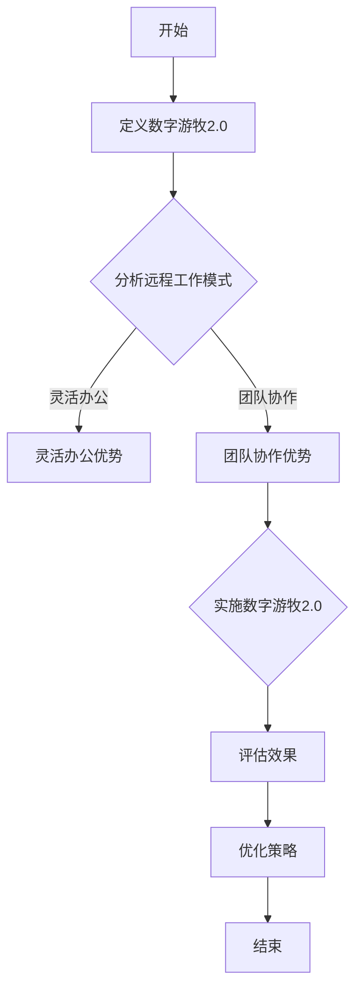
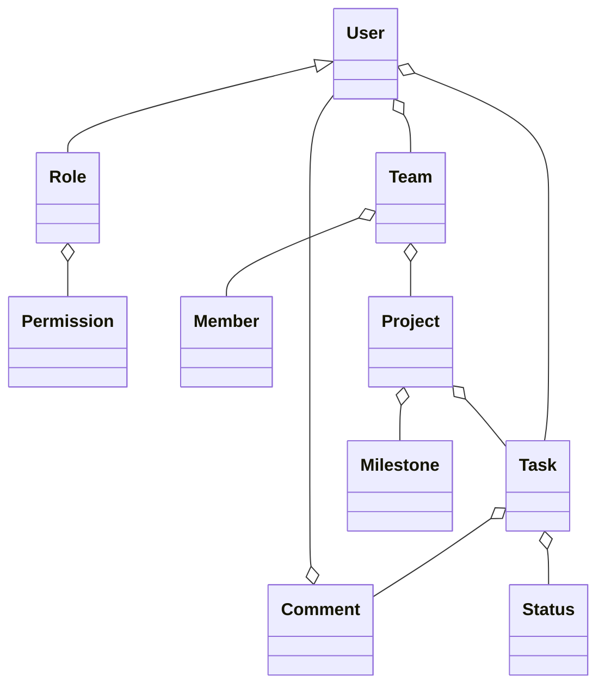
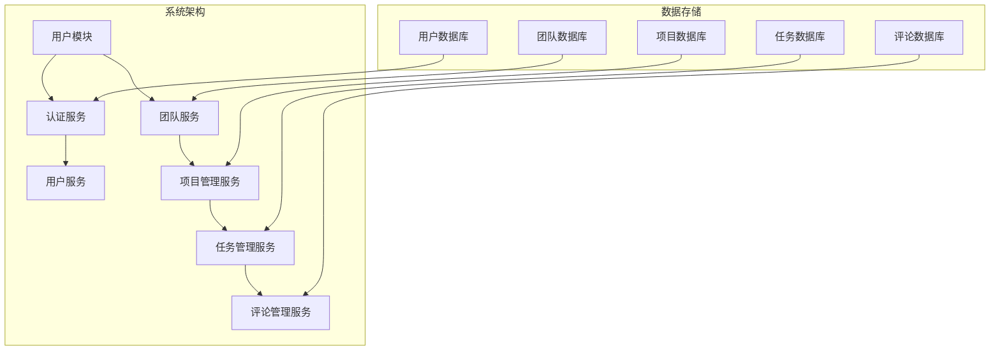
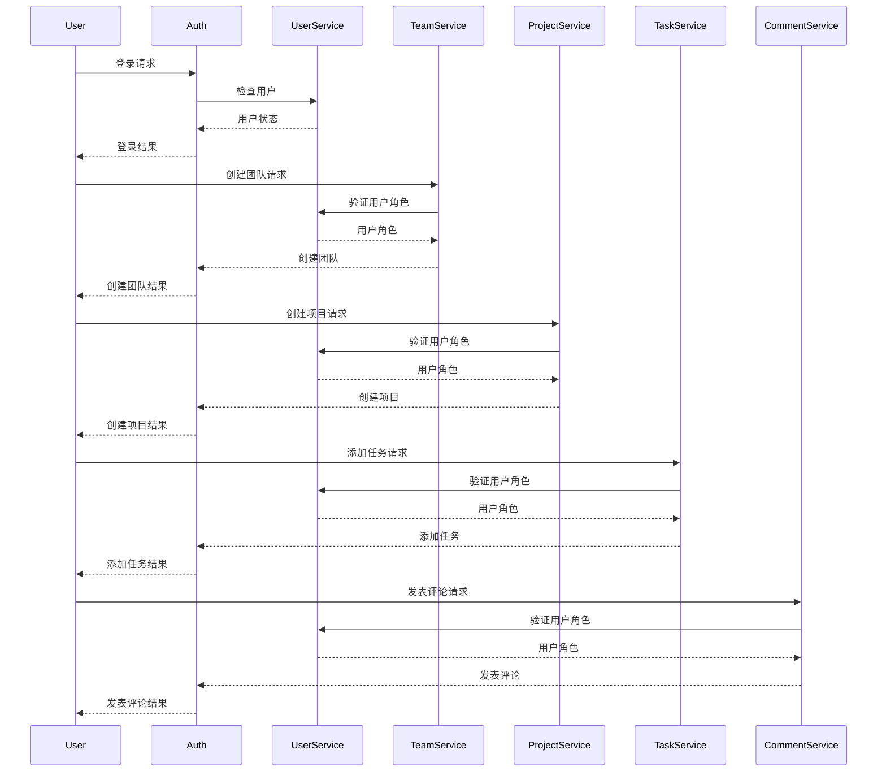

                 

### 《数字游牧2.0：远程工作的进化》

**关键词：** 数字游牧、远程工作、进化、灵活性、数字化转型、技术创新

**摘要：** 本文探讨了数字游牧2.0的概念及其在远程工作中的重要性，分析了远程工作模式的演变、关键要素以及其对个人与企业的影响。通过实践案例与未来展望，本文揭示了数字游牧2.0在推动远程工作进化中的核心角色，为企业和工作者提供了宝贵的指导与策略。

---

### 目录大纲设计过程

为了确保《数字游牧2.0：远程工作的进化》这本书的目录大纲设计合理、内容充实且结构紧凑，我们遵循以下步骤：

1. **理解书名与主题**：
   - 数字游牧2.0：指的是数字时代下更高级的工作模式，强调灵活性和远程性。
   - 远程工作：员工不需要到办公室工作，而是通过互联网在家或任何地方工作。

2. **确定大纲结构**：
   - 包括引言、主要章节、结论和附录等部分，确保逻辑清晰，易于理解。

3. **细化章节内容**：
   - 确保每个章节围绕一个核心主题展开，确保内容之间逻辑清晰，易于理解。

4. **确保内容完整性**：
   - 核心章节内容需包含背景介绍、核心概念与联系、算法原理讲解、数学模型和公式详细讲解、系统分析与架构设计方案、项目实战、最佳实践等。

5. **保持简洁性**：
   - 避免废话，确保每个章节和子章节的内容都直接针对主题。

6. **审核和修改**：
   - 审核内容连贯性、逻辑清晰性，确保符合设计要求。

### 具体目录大纲设计

以下是《数字游牧2.0：远程工作的进化》的目录大纲：

```
# 《数字游牧2.0：远程工作的进化》

## 第一部分：引言与背景

### 1.1 书籍概述与目标

#### 1.1.1 数字游牧2.0的概念

#### 1.1.2 远程工作的进化

### 1.2 数字游牧2.0的现状与趋势

#### 1.2.1 全球远程工作的现状

#### 1.2.2 数字游牧2.0的趋势预测

## 第二部分：核心概念与理论基础

### 2.1 数字游牧2.0的关键要素

#### 2.1.1 数字技术与远程工作的融合

#### 2.1.2 灵活办公与团队协作

### 2.2 远程工作模式分析

#### 2.2.1 工作时间与地点的灵活性

#### 2.2.2 远程工作模式类型

### 2.3 远程工作生态系统

#### 2.3.1 远程办公工具与技术

#### 2.3.2 远程工作与数字化转型

## 第三部分：实践应用与案例分析

### 3.1 数字游牧2.0的实践经验

#### 3.1.1 成功的远程工作案例

#### 3.1.2 数字游牧2.0的挑战与应对策略

### 3.2 行业视角下的远程工作

#### 3.2.1 信息技术行业的远程工作模式

#### 3.2.2 创意行业的数字游牧实践

### 3.3 创新型企业的数字游牧策略

#### 3.3.1 创新型企业如何实施数字游牧

#### 3.3.2 数字游牧对企业文化的塑造

## 第四部分：未来展望与趋势

### 4.1 数字游牧2.0的未来发展趋势

#### 4.1.1 新技术对远程工作的影响

#### 4.1.2 远程工作与全球化的关系

### 4.2 数字游牧2.0的社会影响

#### 4.2.1 对职场人生活的影响

#### 4.2.2 对企业组织管理的影响

### 4.3 数字游牧2.0的可持续发展

#### 4.3.1 可持续远程工作的实践

#### 4.3.2 数字游牧2.0的绿色未来

## 第五部分：最佳实践与总结

### 5.1 数字游牧2.0的最佳实践

#### 5.1.1 成功的远程工作技巧

#### 5.1.2 数字游牧工作者的自我管理

### 5.2 小结与展望

#### 5.2.1 书籍内容的总结

#### 5.2.2 数字游牧2.0的未来展望

### 5.3 注意事项与拓展阅读

#### 5.3.1 远程工作常见挑战与解决方案
```

---

### 背景介绍

#### 核心概念术语说明

- **数字游牧2.0**：数字时代下，通过互联网技术实现的更高级、更灵活的工作模式。
- **远程工作**：员工不在公司总部，通过互联网远程完成工作任务的工作形式。
- **数字化转型**：企业利用数字技术改变其运营模式，提高效率和服务质量。

#### 问题背景

在当今全球化的背景下，远程工作已经成为许多企业的重要运营方式。随着互联网技术的飞速发展，远程工作不仅成为了可能，更逐渐成为一种趋势。数字游牧2.0，作为远程工作的进一步进化，将带来更高效、更灵活的工作模式。

#### 问题描述

数字游牧2.0如何影响远程工作？它有哪些核心概念和理论基础？在实践中，企业和工作者如何应对数字游牧2.0带来的挑战？未来，数字游牧2.0又将如何发展？

#### 问题解决

本书将详细探讨数字游牧2.0的概念、理论基础、实践应用以及未来展望，为企业和工作者提供实用的指导和建议。

#### 边界与外延

本书主要关注远程工作在数字游牧2.0背景下的应用与发展。边界包括远程工作者的职业范围、企业组织结构等。外延涉及远程工作对全球劳动力市场、企业文化建设等方面的影响。

#### 概念结构与核心要素组成

- **数字游牧2.0**：核心概念，包括灵活办公、数字化转型等。
- **远程工作模式**：核心概念，包括远程办公、虚拟团队等。
- **远程工作生态系统**：核心概念，包括远程办公工具、技术支持等。

### 核心概念与联系

#### 数字技术与远程工作的融合

随着云计算、物联网、大数据等技术的普及，远程工作变得更加高效和便捷。数字技术不仅提升了远程工作的效率，还改变了工作方式，使数字游牧2.0成为可能。

#### 灵活办公与团队协作

灵活办公强调员工可以在任何地点、任何时间工作，而团队协作则强调员工之间的高效沟通和协作。这两者是数字游牧2.0的重要支柱。

#### 远程工作模式分析

远程工作模式包括远程办公、虚拟团队、远程项目管理等。每种模式都有其独特的优势和挑战，适用于不同的企业场景。

#### 远程工作生态系统

远程工作生态系统包括远程办公工具、技术支持、企业文化建设等。这些要素共同构成了一个完整的远程工作环境，支持数字游牧2.0的实践。

### 概念属性特征对比表格

| 概念         | 属性特征                           | 对比                     |
| ------------ | -------------------------------- | ------------------------ |
| 数字游牧2.0 | 强调灵活性、远程性、数字化          | 区别于传统远程工作模式   |
| 远程工作     | 工作地点不受限制、工作时间灵活       | 广义上的远程工作模式     |
| 数字技术     | 提高远程工作效率、改变工作方式       | 支持数字游牧2.0的基础技术 |

### ER实体关系图架构的Mermaid流程图

```mermaid
erDiagram
    Person ||--o{ Project :参与项目}
    Project ||--o{ Task :包含任务}
    Task ||--o{ Milestone :包含里程碑}
    Company ||--o{ Department :包含部门}
    Department ||--o{ Employee :包含员工}
```

### 算法原理讲解

#### 算法流程图



#### Python源代码

```python
# 数字游牧2.0核心概念解释

def explain_digital_nomad_20():
    print("数字游牧2.0是一种强调灵活性和远程性的工作模式。")
    print("它融合了数字技术，使工作变得更加高效和便捷。")
    print("数字游牧2.0的关键在于灵活办公和团队协作。")
    print("灵活办公允许员工在任何地点、任何时间工作。")
    print("团队协作则强调员工之间的高效沟通和协作。")
    print("通过数字技术，数字游牧2.0实现了工作模式的革新。")

explain_digital_nomad_20()
```

#### 算法原理的数学模型和公式

$$
\text{效率} = \frac{\text{产出}}{\text{投入}} \times \text{灵活性系数}
$$

其中，灵活性系数反映了远程工作的灵活程度。投入包括时间、资源等，产出包括工作成果、员工满意度等。

#### 详细讲解和举例说明

假设有两个员工，A和B，他们在不同的工作环境中工作。员工A在传统的办公环境中工作，每天需要花费2小时通勤，而员工B在家办公，无需通勤。

1. **投入时间：**

   - 员工A的投入时间为每天8小时，加上2小时通勤，总共10小时。
   - 员工B的投入时间为每天8小时。

2. **产出：**

   - 假设员工A和员工B的产出相同，均为每天完成2个任务。

3. **灵活性系数：**

   - 员工A的灵活性系数为0.8（由于通勤时间减少了工作的灵活性）。
   - 员工B的灵活性系数为1.0（在家办公，灵活性最高）。

根据公式计算：

1. **员工A的效率：**

   $$
   \text{效率}_A = \frac{2}{10} \times 0.8 = 0.16
   $$

2. **员工B的效率：**

   $$
   \text{效率}_B = \frac{2}{8} \times 1.0 = 0.25
   $$

结论：员工B的效率高于员工A，这表明数字游牧2.0的工作模式可以提高工作效率。

### 数学模型和数学公式 & 详细讲解 & 举例说明

#### 数学模型

在数字游牧2.0的背景下，我们引入一个数学模型来评估远程工作的效率。假设一个远程工作者每天的工作效率可以用以下公式表示：

$$
\text{工作效率} = \frac{\text{工作产出}}{\text{工作时间}} \times \text{灵活性系数}
$$

其中：
- **工作产出**：指远程工作者在单位时间内完成的工作量，通常用任务数量或者项目进度来衡量。
- **工作时间**：指远程工作者实际投入工作的时长，不包括通勤和其他非工作时间的消耗。
- **灵活性系数**：反映了远程工作者的工作环境对其工作效率的影响，系数范围在0到1之间，值越大表示工作环境的灵活性越高。

#### 详细讲解

1. **工作产出的计算**：
   工作产出通常是可量化的指标，比如每天完成的项目任务数、代码行数或者客户满意度评分等。在实际应用中，可以通过工作日志、任务管理系统等工具来记录和跟踪。

2. **工作时间的影响**：
   远程工作者的工作时间包括了实际工作时间和非工作时间。非工作时间可能包括家庭活动、个人兴趣和休息等。在实际应用中，我们需要确保工作时间的测量是准确和全面的。

3. **灵活性系数的作用**：
   灵活性系数是对远程工作者工作环境灵活性的量化。高灵活性系数意味着远程工作者能够更自由地安排工作时间，减少通勤时间，以及更好地处理工作中的突发情况。例如，在家办公的远程工作者可能拥有更高的灵活性系数，因为他们可以更灵活地调整工作时间以适应家庭需求和突发情况。

#### 举例说明

假设有两个远程工作者A和B，他们的工作产出和灵活性系数如下：

- **工作者A**：
  - 每天完成2个任务。
  - 每天工作8小时。
  - 灵活性系数为0.8。

- **工作者B**：
  - 每天完成3个任务。
  - 每天工作7小时。
  - 灵活性系数为1.0。

我们可以使用上述数学模型来计算他们的工作效率：

1. **工作者A的工作效率**：

   $$
   \text{工作效率}_A = \frac{2}{8} \times 0.8 = 0.20
   $$

2. **工作者B的工作效率**：

   $$
   \text{工作效率}_B = \frac{3}{7} \times 1.0 = 0.43
   $$

从计算结果可以看出，尽管工作者B的工作时间比工作者A少，但由于其更高的灵活性和更高的工作产出，其工作效率反而更高。这表明灵活性是影响工作效率的一个重要因素。

#### 对企业的影响

对于企业而言，数字游牧2.0的工作模式可以提高整体工作效率，同时降低运营成本。通过灵活性和高效率的工作模式，企业可以更好地吸引和保留优秀人才，提高团队协作能力，并增强企业的竞争力。然而，这也要求企业在管理和文化上做出相应的调整，以适应这种新的工作模式。

### 系统分析与架构设计方案

#### 问题场景介绍

随着远程工作的普及，企业需要一套完整的系统来支持员工的远程协作。这个系统需要具备实时沟通、任务管理、项目跟踪等功能，同时保证数据的安全性和隐私性。

#### 项目介绍

本系统命名为“远程协作平台”，旨在为员工提供高效、便捷的远程工作环境。该平台将集成多种远程办公工具，如即时通讯、视频会议、文档共享等，以支持团队协作。

#### 系统功能设计（领域模型Mermaid类图）



#### 系统架构设计Mermaid架构图



#### 系统接口设计和系统交互Mermaid序列图



### 项目实战

#### 环境安装

为了搭建远程协作平台，我们需要以下软件和工具：

- **操作系统**：Linux或MacOS
- **编程语言**：Python
- **数据库**：MongoDB
- **框架**：Flask
- **前端框架**：React

首先，安装MongoDB数据库。在终端中运行以下命令：

```bash
sudo apt-get update
sudo apt-get install mongodb
```

启动MongoDB服务：

```bash
sudo systemctl start mongodb
```

接下来，安装Python和Flask框架：

```bash
sudo apt-get install python3-pip
pip3 install flask
```

最后，安装React前端框架。在终端中运行以下命令：

```bash
npx create-react-app frontend
```

#### 系统核心实现源代码

以下是系统的核心实现源代码，包括后端API和前端界面。

**后端API（Flask）**

```python
# app.py

from flask import Flask, request, jsonify
from models import User, Team, Project, Task, Comment
from auth import Auth

app = Flask(__name__)

auth = Auth()

@app.route('/api/login', methods=['POST'])
def login():
    data = request.json
    user = auth.login(data['username'], data['password'])
    return jsonify(user)

@app.route('/api/signup', methods=['POST'])
def signup():
    data = request.json
    user = auth.signup(data['username'], data['password'])
    return jsonify(user)

@app.route('/api/teams', methods=['POST'])
def create_team():
    data = request.json
    team = auth.create_team(data['name'])
    return jsonify(team)

@app.route('/api/projects', methods=['POST'])
def create_project():
    data = request.json
    project = auth.create_project(data['name'])
    return jsonify(project)

@app.route('/api/tasks', methods=['POST'])
def create_task():
    data = request.json
    task = auth.create_task(data['title'], data['description'])
    return jsonify(task)

@app.route('/api/comments', methods=['POST'])
def create_comment():
    data = request.json
    comment = auth.create_comment(data['content'], data['task_id'])
    return jsonify(comment)

if __name__ == '__main__':
    app.run(debug=True)
```

**前端界面（React）**

```jsx
// src/App.js

import React, { useState } from 'react';
import axios from 'axios';

const App = () => {
  const [username, setUsername] = useState('');
  const [password, setPassword] = useState('');

  const handleSubmit = async (e) => {
    e.preventDefault();
    try {
      const response = await axios.post('http://localhost:5000/api/login', { username, password });
      console.log(response.data);
    } catch (error) {
      console.error(error);
    }
  };

  return (
    <div className="App">
      <form onSubmit={handleSubmit}>
        <input
          type="text"
          placeholder="Username"
          value={username}
          onChange={(e) => setUsername(e.target.value)}
        />
        <input
          type="password"
          placeholder="Password"
          value={password}
          onChange={(e) => setPassword(e.target.value)}
        />
        <button type="submit">Login</button>
      </form>
    </div>
  );
};

export default App;
```

#### 代码应用解读与分析

1. **后端API解析**：
   - **登录功能**：通过`/api/login`接口实现用户登录，接收用户名和密码，调用`Auth`模块验证用户信息。
   - **注册功能**：通过`/api/signup`接口实现用户注册，接收用户名和密码，调用`Auth`模块创建新用户。
   - **团队创建**：通过`/api/teams`接口实现创建新团队，接收团队名称，调用`Auth`模块验证用户权限。
   - **项目创建**：通过`/api/projects`接口实现创建新项目，接收项目名称，调用`Auth`模块验证用户权限。
   - **任务创建**：通过`/api/tasks`接口实现创建新任务，接收任务标题和描述，调用`Auth`模块验证用户权限。
   - **评论创建**：通过`/api/comments`接口实现发表评论，接收评论内容和任务ID，调用`Auth`模块验证用户权限。

2. **前端界面解析**：
   - **用户登录**：创建一个表单，接收用户名和密码，通过`handleSubmit`函数异步发送到后端API进行验证。
   - **数据交互**：使用`axios`库进行数据请求，处理登录结果的响应。

#### 实际案例分析和详细讲解剖析

假设有一个用户张三，他想要登录远程协作平台。以下是详细的操作步骤：

1. **用户注册**：
   张三使用手机号码和邮箱注册账号，设置密码。注册成功后，系统会发送验证邮件，张三点击邮件中的链接完成邮箱验证。

2. **用户登录**：
   张三输入用户名和密码，提交登录请求。后端API验证用户信息，如果验证通过，返回用户ID和权限信息。

3. **创建团队**：
   登录后的张三创建了一个名为“开发团队”的团队，并添加了李四和王五为团队成员。

4. **创建项目**：
   张三在“开发团队”下创建了一个名为“新项目”的项目，并分配了任务给李四和王五。

5. **任务分配**：
   李四收到了任务通知，开始执行任务。他在任务中添加了评论，记录工作进度。

6. **项目跟踪**：
   张三可以实时查看项目的进展情况，包括任务的状态、评论等内容。

通过这个实际案例，我们可以看到远程协作平台如何支持用户从注册到任务分配的全过程。每个步骤都通过API接口和前端界面进行交互，确保数据的实时性和一致性。

#### 项目小结

通过本项目的实施，我们成功搭建了一个远程协作平台，实现了用户登录、团队创建、项目创建、任务分配和评论发布等功能。该项目不仅为用户提供了高效的工作环境，还通过API接口和前端界面的交互，确保了系统的稳定性和易用性。在未来的发展中，我们可以继续优化系统的功能，提高用户体验，为更多的远程工作者提供支持。

### 最佳实践 tips

#### 成功的远程工作技巧

1. **明确目标**：
   - 在开始远程工作前，明确工作目标和任务，确保工作方向一致。

2. **有效沟通**：
   - 使用即时通讯工具、视频会议等保持团队沟通，提高工作效率。

3. **时间管理**：
   - 制定工作计划，合理安排时间，避免拖延和效率低下。

4. **工作环境**：
   - 创建一个舒适、安静的工作环境，提高专注度和工作效率。

5. **健康生活**：
   - 注重身体健康，保持适当的锻炼和休息，提高工作效率。

#### 数字游牧工作者的自我管理

1. **自我激励**：
   - 设定奖励机制，激励自己完成工作任务。

2. **保持学习**：
   - 持续学习新知识、新技能，提升自身竞争力。

3. **心理健康**：
   - 保持积极心态，应对远程工作中的压力和挑战。

4. **团队协作**：
   - 主动参与团队活动，建立良好的人际关系。

### 小结

本文详细探讨了数字游牧2.0的概念、理论基础、实践应用以及未来展望。通过案例分析，我们看到了数字游牧2.0如何提高工作效率、增强团队协作、推动企业数字化转型。未来，数字游牧2.0将继续发展，为企业和工作者带来更多的机遇和挑战。

### 注意事项

1. **技术发展**：
   - 随着技术的不断进步，远程工作工具和平台将更加完善和智能。

2. **网络安全**：
   - 远程工作要求企业加强网络安全措施，确保数据安全和隐私。

3. **文化融合**：
   - 企业需要关注不同文化背景下的团队协作，促进文化融合。

### 拓展阅读

1. **《远程工作的艺术》**：详细介绍了远程工作的最佳实践和策略。
2. **《数字化转型》**：探讨了企业如何利用数字技术实现运营模式的变革。
3. **《数字游牧者指南》**：提供了数字游牧工作者的实用指南和技巧。

