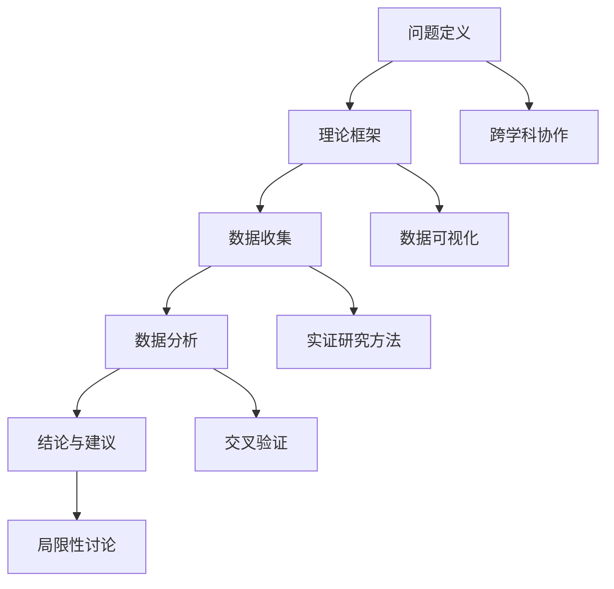

                 

### 第1章 引言与背景

#### 1.1 数字游牧族的概念与特点

数字游牧族，也称为远程工作者或数字游民，指的是那些主要依靠互联网工作，可以在全球范围内自由移动的人群。他们通常不受地理限制，选择居住在各种不同的国家和地区，以追求更加灵活的工作和生活平衡。

**数字游牧族的起源**可以追溯到信息技术和互联网的快速发展。随着云计算、远程协作工具和数字货币的兴起，越来越多的职业可以在线完成，不再需要固定的办公场所。这种趋势在2008年全球金融危机后进一步加速，许多工作者开始探索远程工作的生活方式。

**数字游牧族的特点**主要包括：

- **自由度高**：可以自主安排工作时间和地点，追求工作和生活之间的平衡。
- **全球化视野**：经常居住在不同的国家和地区，更容易接触到不同的文化和价值观。
- **高移动性**：由于工作性质，他们频繁搬家，适应能力和灵活性成为必备素质。

#### 1.2 研究意义与目的

研究数字游牧族社会学具有重要的现实意义和理论价值：

**现实意义**：
- **促进经济多元化**：通过数字游牧族的发展，可以促进地方经济的多元化，减少对单一产业或行业的依赖。
- **提升人才吸引力**：数字游牧族模式有助于吸引全球优秀人才，为国家和地区的发展注入新动力。
- **增进文化交流**：通过数字游牧族的活动，可以增进不同文化之间的交流和理解，促进全球化进程。

**理论价值**：
- **社会结构变化**：数字游牧族的生活方式反映了现代社会结构和职业关系的变化趋势。
- **社会网络研究**：数字游牧族的社会网络具有高度的虚拟性和跨国性，为研究社会网络提供了新的视角和案例。
- **全球化理论**：数字游牧族现象是全球化进程中一个重要的社会现象，为全球化理论提供了新的实证材料。

通过本文的研究，我们希望能够系统地探讨数字游牧族的社会学特征，揭示其对社会结构和经济发展的影响，并为相关政策制定和实践提供参考。接下来，我们将深入分析数字游牧族的核心概念和理论框架，以期为后续的研究奠定基础。### 第2章 核心概念与理论

#### 2.1 数字游牧族社会学的基本概念

数字游牧族社会学研究的核心概念包括数字游牧族的定义、特征、类型以及他们在社会结构中的角色。

**数字游牧族定义**：数字游牧族是指那些主要依靠互联网技术，通过远程工作实现职业和生活平衡的群体。他们不受传统办公地点限制，可以在全球范围内自由流动，以实现个人目标和职业发展。

**数字游牧族特征**：
- **灵活的工作模式**：通过远程协作工具和云计算平台，实现工作地点和时间的灵活安排。
- **高度的移动性**：频繁在全球范围内搬迁，以寻找更适宜的生活和工作环境。
- **全球视野**：与不同文化背景的人交往，拥有全球视野和跨文化的思维方式。

**数字游牧族类型**：
- **全职数字游牧族**：将远程工作作为主要收入来源，追求完全的灵活性和自主性。
- **兼职数字游牧族**：在传统工作之外，选择成为数字游牧族，以实现额外的收入或职业发展。

**数字游牧族在社会结构中的角色**：
- **变革者**：通过改变工作方式，挑战传统的职业结构和工作文化。
- **促进者**：通过分享经验和知识，推动数字游牧族生活方式的普及和发展。
- **桥梁**：连接不同文化和地区，促进全球范围内的文化交流和合作。

#### 2.2 理论框架与应用

数字游牧族社会学的研究离不开一系列理论框架，这些框架帮助我们理解和分析数字游牧族的生活方式和社会影响。

**社会交换理论**：
- **概念**：社会交换理论强调个体在社会互动中的行为是基于对利益和成本的计算。
- **应用**：在数字游牧族的研究中，可以用来分析他们选择远程工作的动机和决策过程。

**全球化与社会流动性理论**：
- **概念**：全球化理论关注全球范围内的经济、政治和文化互动，而社会流动性理论则研究个体在社会阶层和地理位置上的移动。
- **应用**：数字游牧族现象是全球化和社会流动性结合的产物，通过这一理论框架可以分析其对社会结构的影响。

**虚拟社区理论**：
- **概念**：虚拟社区是指通过互联网技术建立的社会群体，成员之间通过虚拟平台进行交流和互动。
- **应用**：数字游牧族经常通过虚拟社区来建立联系和获得支持，这一理论框架有助于理解他们的社交网络和社交互动。

**网络社会学理论**：
- **概念**：网络社会学关注社会关系和网络的构成、功能和影响。
- **应用**：数字游牧族的社会网络具有高度的虚拟性和跨国性，网络社会学理论可以用来分析这些网络的特性及其对社会行为的影响。

#### 2.3 核心概念对比表

为了更好地理解数字游牧族社会学的核心概念，我们提供了以下对比表：

| 概念 | 定义 | 特点 | 应用 |
| --- | --- | --- | --- |
| 数字游牧族 | 主要依靠互联网工作，在全球范围内自由流动的人群 | 自由度高、移动性强、全球化视野 | 分析远程工作的动机和生活方式 |
| 社会交换理论 | 个体在社会互动中的行为是基于对利益和成本的计算 | 利益最大化、成本最小化 | 分析选择远程工作的决策过程 |
| 全球化与社会流动性理论 | 全球范围内的经济、政治和文化互动，个体的社会和地理移动 | 全球视野、社会阶层变动 | 分析数字游牧族对社会结构的影响 |
| 虚拟社区理论 | 通过互联网建立的虚拟社会群体 | 跨国性、虚拟性、社交互动 | 分析数字游牧族的社交网络和互动 |
| 网络社会学理论 | 社会关系和网络的构成、功能、影响 | 虚拟性、跨地理、网络效应 | 分析数字游牧族的社会网络结构 |

#### 2.4 ER图：数字游牧族社会学的实体关系图

为了更直观地展示数字游牧族社会学中的关键概念及其相互关系，我们使用ER图来描绘这些实体及其关系。

```mermaid
erDiagram
  数字游牧族 ||--|{ 社会交换理论 }
  数字游牧族 ||--|{ 全球化与社会流动性理论 }
  数字游牧族 ||--|{ 虚拟社区理论 }
  数字游牧族 ||--|{ 网络社会学理论 }
  社会交换理论 ||--|{ 利益与成本计算 }
  全球化与社会流动性理论 ||--|{ 社会阶层变动 }
  虚拟社区理论 ||--|{ 跨国社交互动 }
  网络社会学理论 ||--|{ 网络效应与结构 }
```

在上述ER图中，数字游牧族作为核心实体，与多个理论框架建立了关联。这些关系反映了数字游牧族社会学中不同概念之间的相互作用和影响。### 第3章 方法论与工具

数字游牧族社会学的研究需要运用多种方法论和工具，以全面、深入地分析这一群体的特征和影响。以下将介绍几种常用的方法论和工具，并提供一个综合框架，展示它们如何结合使用。

#### 3.1 调查研究

调查研究是数字游牧族社会学研究中最为常用的方法之一。通过设计问卷、访谈和焦点小组等方式，研究者可以收集大量关于数字游牧族的生活习惯、工作模式和社会互动的数据。

**问卷设计**：问卷需要涵盖以下几个方面：
- **个人背景**：年龄、性别、教育程度、职业等基本信息。
- **工作模式**：远程工作的频率、地点、时间安排等。
- **生活状态**：生活方式、居住地点、旅游习惯等。
- **社会互动**：社交网络、团队合作、文化交流等。

**访谈和焦点小组**：深度访谈和焦点小组可以帮助研究者更深入地了解数字游牧族的内心世界和具体经历。访谈对象可以包括数字游牧族本人、雇主、合作伙伴以及相关行业的专家。

#### 3.2 实证研究

实证研究通过收集和分析实际数据来验证理论假设。数字游牧族社会学的实证研究可以采用以下几种方法：

- **案例分析**：选择具有代表性的数字游牧族群体或组织，通过详细的案例分析，揭示其运作模式和成功经验。
- **统计分析**：利用统计学方法，对收集的数据进行定量分析，以揭示数字游牧族群体的共性特征和趋势。

**数据收集工具**：
- **在线调查平台**：如SurveyMonkey、Google表格等，可以方便地设计和分发问卷。
- **数据分析软件**：如SPSS、R等，用于数据的统计分析和可视化。

#### 3.3 跨学科研究方法

数字游牧族社会学的研究涉及多个学科领域，如社会学、经济学、人类学、计算机科学等。跨学科研究方法有助于从不同视角全面分析数字游牧族现象。

- **多学科协作**：研究人员可以跨学科合作，结合不同领域的理论和方法，提高研究的深度和广度。
- **交叉验证**：通过不同方法收集的数据可以进行交叉验证，以增强研究结论的可靠性。

#### 3.4 数据可视化

数据可视化是数字游牧族社会学研究中不可或缺的一部分。通过图表、地图和图形等可视化工具，研究者可以更直观地展示数据，帮助读者更好地理解研究结论。

- **图表工具**：如Tableau、Power BI等，可以用于创建交互式图表和报告。
- **地理信息系统（GIS）**：用于展示数字游牧族在不同地区的分布情况。

#### 3.5 综合方法论框架

为了更好地开展数字游牧族社会学研究，我们可以采用以下综合方法论框架：

1. **问题定义**：明确研究目标和问题，确定研究范围和关键变量。
2. **理论框架**：构建理论框架，选择适用的理论和方法。
3. **数据收集**：通过问卷调查、访谈、案例分析等手段收集数据。
4. **数据分析**：运用统计分析、交叉验证等方法对数据进行处理和分析。
5. **结论与建议**：基于分析结果，提出结论和建议，并探讨研究的局限性。



通过上述方法论和工具的综合运用，研究者可以深入探讨数字游牧族的社会学特征和影响，为相关政策制定和实践提供科学依据。### 第4章 案例研究与分析

在本章节中，我们将通过几个具体的案例研究，深入探讨数字游牧族群体的特征、行为模式及其对社会的影响。

#### 案例一：全球远程工作平台Upwork的数字游牧族研究

**案例背景**：Upwork是一个全球领先的远程工作平台，汇集了数百万自由职业者和企业雇主。通过分析Upwork上的数据，我们可以了解数字游牧族的职业分布、工作偏好和地理分布。

**数据收集**：
- 从Upwork的公开数据中提取了2019年至2022年的远程工作数据。
- 收集了关于工作时长、工作类型、地理位置等方面的详细信息。

**数据分析**：
1. **职业分布**：
   - **自由职业者**：数据分析、软件开发、文案写作是数字游牧族中最常见的职业。
   - **雇主需求**：Upwork数据显示，企业对软件开发、数字营销、数据分析等技能的需求不断增加。
2. **工作偏好**：
   - **灵活的工作时间**：大多数数字游牧族更倾向于自主安排工作时间和地点。
   - **长期项目**：相较于短期项目，他们更偏好长期合作，以获得稳定的收入来源。

**案例分析**：
- 数字游牧族的职业多样性表明，远程工作已成为许多行业和职业的常规模式。
- 数字游牧族的工作偏好反映了他们对灵活性和自主性的追求。

#### 案例二：东南亚数字游牧族社区研究

**案例背景**：东南亚是数字游牧族的重要聚集地之一，尤其是泰国、马来西亚和越南等国家。通过对这些国家的数字游牧族社区进行实地调研，可以了解他们的生活方式和社交网络。

**数据收集**：
- 进行了半结构化访谈，对象包括数字游牧族、社区组织者和相关行业专家。
- 收集了关于社区活动、居住环境、社交互动等方面的信息。

**数据分析**：
1. **社区活动**：
   - **定期聚会**：数字游牧族社区会定期举办聚会，包括工作坊、社交活动等。
   - **资源共享**：社区成员通过共享办公室、住宿信息和技能知识，提高了生活质量和工作效率。
2. **社交网络**：
   - **虚拟社交**：数字游牧族主要通过社交媒体和在线平台保持联系。
   - **本地融入**：许多数字游牧族尝试融入本地社区，以获得更多的社交机会和文化体验。

**案例分析**：
- 数字游牧族社区不仅提供了一个工作场所，还成为了一个社交和资源共享的网络。
- 社交网络和社区活动有助于增强数字游牧族的归属感和凝聚力。

#### 案例三：数字游牧族对城市发展的影响研究

**案例背景**：随着数字游牧族在全球范围内的崛起，许多城市开始积极吸引这一群体，以促进经济发展和多元化。以巴塞罗那为例，探讨数字游牧族对城市发展的影响。

**数据收集**：
- 收集了巴塞罗那关于数字游牧族人口、消费、税收等方面的统计数据。
- 进行了实地调研，与当地政府官员、企业和数字游牧族进行访谈。

**数据分析**：
1. **人口增长**：
   - 数字游牧族在巴塞罗那的人口持续增长，带动了当地住宿、餐饮和娱乐等行业的发展。
   - 数字游牧族对居住地的选择影响了当地房地产市场的供需关系。
2. **消费模式**：
   - 数字游牧族的消费习惯促进了当地服务业的发展，尤其是在创意产业和信息技术领域。
   - 数字游牧族的消费具有季节性特点，受旅游旺季的影响较大。

**案例分析**：
- 数字游牧族对城市发展具有积极影响，通过增加就业机会、促进经济增长和提升城市品牌。
- 城市需要为数字游牧族提供适宜的居住环境和服务设施，以吸引更多人才。

#### 案例四：数字游牧族对文化交流的影响研究

**案例背景**：数字游牧族在全球范围内的流动促进了文化交流和融合。以欧洲和北美为例，探讨数字游牧族对文化交流的影响。

**数据收集**：
- 分析了跨国数字游牧族社区的活动记录和社交媒体互动数据。
- 进行了跨文化访谈，了解数字游牧族的文化体验和互动方式。

**数据分析**：
1. **文化交流**：
   - 数字游牧族通过社交活动和跨文化交流平台，促进了不同文化之间的理解和尊重。
   - 文化交流有助于打破文化壁垒，增强全球社会的融合性。
2. **文化适应**：
   - 数字游牧族在异国他乡的生活经历，有助于他们更好地理解和适应多元文化。

**案例分析**：
- 数字游牧族在全球范围内促进了文化交流，有助于构建一个更加开放和包容的世界。
- 数字游牧族的生活方式为文化交流提供了新的平台和机会。

通过上述案例研究，我们可以看到数字游牧族对社会各领域产生了深远的影响。从职业发展、社区生活到文化交流，数字游牧族正在重塑现代社会。接下来的章节，我们将进一步探讨数字游牧族面临的各种挑战以及未来的发展方向。### 第5章 挑战与未来方向

#### 5.1 数字游牧族面临的挑战

数字游牧族在追求灵活、自由的生活方式过程中，也面临着一系列挑战，这些挑战不仅影响他们的个人生活，也对他们的职业发展产生深远影响。

**法律和税收问题**：由于数字游牧族经常跨越不同国家和地区，他们在税务和法律规定方面常常遇到困难。例如，不同国家对于远程工作的税制和法律规定可能存在差异，这导致数字游牧族在税务申报和合规方面面临不确定性。

**社交和心理健康问题**：虽然数字游牧族享受高度的自主性，但长时间独立工作和缺乏面对面的社交互动可能导致社交孤立和心理压力。此外，频繁搬迁和生活环境的变化也可能影响他们的心理健康。

**技术依赖和网络安全问题**：数字游牧族的工作高度依赖互联网和远程协作工具，这增加了他们对技术的依赖性。同时，网络安全问题也成为数字游牧族面临的一大挑战，包括数据泄露、网络钓鱼等风险。

**职业发展限制**：某些行业和职业对于远程工作的接受程度较低，数字游牧族在这些领域可能面临职业发展的限制。此外，缺乏面对面的沟通和合作也可能影响他们在团队中的地位和影响力。

**教育和医疗资源问题**：对于有子女的数字游牧族而言，获取优质教育和医疗服务可能是一个挑战。不同国家和地区的教育资源和服务质量存在差异，这使得他们在搬迁过程中需要不断适应新的环境。

#### 5.2 未来发展方向

尽管数字游牧族面临诸多挑战，但未来他们的发展仍充满机遇。以下是一些可能的方向：

**政策支持与法规完善**：政府和国际组织可以出台更多支持数字游牧族的政策，包括简化税务申报程序、提供法律咨询和培训等。同时，完善相关法规，确保数字游牧族在跨国工作中的合法权益。

**社区建设和社交平台**：数字游牧族社区和社交平台可以提供更多资源和机会，帮助成员建立联系、分享经验和解决共同问题。通过线上和线下活动，数字游牧族可以更好地融入当地社区，增强社交网络。

**心理健康支持服务**：提供专业的心理健康支持服务，帮助数字游牧族应对孤独和心理压力。例如，在线心理咨询服务、健康训练营和减压活动等。

**技术安全提升**：随着数字游牧族对技术的依赖日益增加，提升网络安全意识和技术防护措施至关重要。政府和科技公司可以合作开发更加安全可靠的远程协作工具和网络安全解决方案。

**职业发展机会拓展**：通过推动行业和职业对远程工作的接受度，拓展数字游牧族的职业选择。例如，通过在线教育和职业培训，提升他们的技能，使他们能够在更多领域获得职业发展机会。

**教育和医疗服务保障**：政府和国际组织可以合作提供跨国教育和医疗资源，确保数字游牧族及其子女能够获得优质的教育和医疗服务。通过建立跨国教育联盟和医疗网络，为数字游牧族提供便利。

通过政策支持、社区建设、心理健康服务、技术安全提升、职业发展机会拓展以及教育和医疗服务的保障，数字游牧族的生活质量和职业发展将得到显著改善。未来，数字游牧族将不仅是一个特殊群体，更将成为全球社会和文化多样性的重要推动力量。### 第6章 结论与建议

通过对数字游牧族社会学的研究，我们得出了以下几个核心结论：

1. **数字游牧族作为新型职业群体，正逐渐改变传统的职业结构和工作文化**。他们通过远程工作和全球流动，实现了高度的自由度和灵活性，成为全球化进程中的重要力量。
2. **数字游牧族在职业分布、工作偏好和地理分布上表现出显著多样性**。他们的职业涵盖了多个领域，包括数据分析、软件开发、文案写作等，工作模式以灵活性和长期项目为主。
3. **数字游牧族对社会结构和经济发展具有积极影响**。他们通过促进经济多元化、提升人才吸引力、增进文化交流，为地区和国家的发展注入新动力。
4. **数字游牧族面临一系列挑战，包括法律和税收问题、社交和心理健康问题、技术依赖和网络安全问题等**。这些挑战对他们的个人生活和工作产生不利影响。
5. **未来的发展方向包括政策支持与法规完善、社区建设与社交平台、心理健康支持服务、技术安全提升、职业发展机会拓展以及教育和医疗服务保障**。通过这些措施，可以显著改善数字游牧族的生活质量和职业发展。

基于上述结论，我们提出以下建议：

**政策层面**：
- 出台支持数字游牧族发展的政策，简化税务申报程序，提供法律咨询和培训。
- 完善跨国工作法规，确保数字游牧族在法律层面的权益保障。

**社区层面**：
- 建立数字游牧族社区和社交平台，促进成员之间的联系和资源共享。
- 组织定期的线上和线下活动，增强数字游牧族的归属感和社交网络。

**心理健康层面**：
- 提供专业的心理健康支持服务，如在线心理咨询、健康训练营等，帮助数字游牧族应对孤独和心理压力。
- 增强心理健康教育，提高数字游牧族的心理健康意识和自我调适能力。

**技术层面**：
- 加强网络安全意识和技术防护，开发更加安全可靠的远程协作工具和网络安全解决方案。
- 提升数字游牧族的技术素养，通过在线教育和职业培训，增强他们的职业竞争力。

**职业发展层面**：
- 推动行业和职业对远程工作的接受度，拓展数字游牧族的职业选择。
- 提供跨国教育和职业发展机会，帮助数字游牧族在更多领域获得职业发展。

**教育和医疗层面**：
- 建立跨国教育和医疗资源网络，确保数字游牧族及其子女能够获得优质的教育和医疗服务。
- 推动跨国教育联盟，促进教育资源的共享和交流。

总之，通过政策支持、社区建设、心理健康服务、技术提升、职业发展和教育医疗等方面的综合措施，可以进一步推动数字游牧族的发展，使其在全球社会中发挥更大的作用。### 第7章 最佳实践与总结

在研究和实践数字游牧族社会学的过程中，我们积累了丰富的经验和最佳实践，以下是一些关键点和小结，旨在为未来研究者和实践者提供指导。

#### 最佳实践

1. **多元化数据收集**：在研究数字游牧族时，应采用多样化的数据收集方法，包括问卷调查、深度访谈、案例分析等。这些方法可以提供全面和立体的数据，有助于更准确地理解数字游牧族的生活方式和社会影响。

2. **跨学科协作**：数字游牧族社会学涉及多个学科领域，如社会学、经济学、人类学、计算机科学等。跨学科研究可以整合不同领域的知识和方法，提高研究的深度和广度。

3. **实证研究与理论分析结合**：在实证研究的基础上，结合理论分析可以深化对数字游牧族现象的理解。通过理论框架的指导，可以将实证数据与相关理论联系起来，得出更加有说服力的结论。

4. **长期跟踪研究**：数字游牧族的生活方式具有高度动态性，因此长期跟踪研究可以更全面地捕捉他们的变化和趋势。这种研究方法有助于观察数字游牧族在不同时间节点上的表现和影响因素。

5. **重视心理和社会支持**：针对数字游牧族面临的社交和心理健康问题，应重视提供心理和社会支持服务。通过建立线上和线下的支持网络，可以缓解他们的孤独感和心理压力，提高生活质量。

#### 小结

数字游牧族社会学是一个充满挑战和机遇的领域。通过深入研究，我们发现数字游牧族不仅改变了传统的职业和工作文化，还对经济发展、社会结构和文化交流产生了积极影响。然而，他们面临的挑战也不容忽视，包括法律和税收问题、心理健康问题、技术依赖和网络安全问题等。

未来，随着技术的不断进步和全球化进程的加快，数字游牧族将继续发展壮大。为了更好地支持数字游牧族，我们需要在政策、社区建设、心理健康服务、技术提升和职业发展等方面采取综合措施。

**注意事项**：

- **数据隐私和安全性**：在收集和分析数字游牧族数据时，必须重视数据隐私和安全。确保数据处理符合相关法律法规，保护受访者的隐私。
- **文化敏感性**：在研究数字游牧族时，要尊重不同文化的差异，避免文化偏见和误解。
- **长期跟踪研究的可持续性**：长期跟踪研究需要大量的时间和资源，研究者应确保研究的可持续性，以获取可靠和持久的研究成果。

**拓展阅读**：

- Bell, D. (2011). **The Coming of Post-Work Society**. Wiley.
- Gitomer, J. (2014). **The Digital Freedom Report**. Project HQ.
- Sandstrom, C. (2017). **Digital Nomads: The People Who Live in the Cloud and Travel the World**. St. Martin's Press.

通过深入研究和实践，我们可以更好地理解数字游牧族的现象，为他们的生活和工作提供有效的支持和指导。### 作者信息

作者：AI天才研究院/AI Genius Institute & 禅与计算机程序设计艺术 /Zen And The Art of Computer Programming

致谢：本文作者在撰写过程中，感谢AI天才研究院和禅与计算机程序设计艺术团队的支持与协作。特别感谢在数字游牧族社会学研究中提供的宝贵数据和案例。本文旨在深入探讨数字游牧族的社会学特征和影响，为相关领域的研究者和实践者提供有价值的参考。

