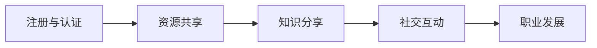
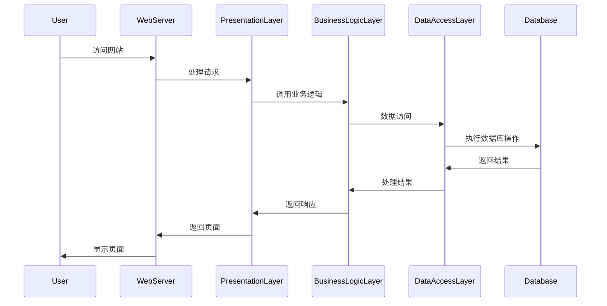
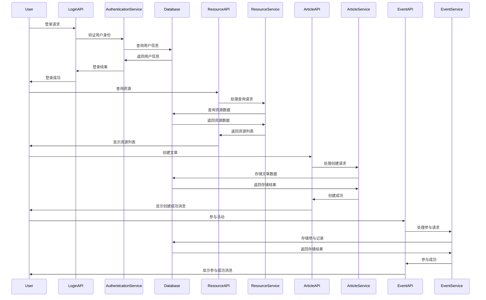

                 

### 数字游牧者部落：远程工作者的在线社区

关键词：远程工作者、在线社区、数字游牧者、生产力、协作

摘要：
随着全球互联网的迅速发展，远程工作已经成为一种越来越普遍的工作方式。数字游牧者（Digital Nomad）作为一个特殊的群体，他们在全球范围内自由流动，选择在咖啡店、海滩甚至是异国他乡的居所工作。本文将探讨数字游牧者部落——一个专为远程工作者设计的在线社区，如何帮助这个群体提高生产力、促进协作，并实现个人与职业的成长。

在本文中，我们将分三大部分来深入分析这一主题。首先，我们将介绍远程工作背景及其带来的变化，探讨数字游牧者生活方式的兴起及其重要性。接着，我们将探讨如何建立一个有效的在线社区，包括平台选择、社区建设和管理策略。最后，我们将讨论如何通过在线社区提升远程工作者的生产力，提供实际案例和最佳实践。

### 背景介绍

#### 数字游牧者与远程工作

数字游牧者，是指那些利用现代通信技术和互联网工具，在全球范围内自由选择工作地点和生活方式的人群。他们通常从事自由职业、远程职位或自由合作项目，不受传统办公室和地理限制的束缚。数字游牧者的生活方式在近年来得到了快速发展，这一趋势可以追溯到互联网普及和远程工作工具的进步。

远程工作（Remote Work）指的是员工不在公司总部或传统的办公室工作，而是通过电子邮件、视频会议、协作工具等远程通信手段与同事、客户和领导进行交流和工作。远程工作的兴起可以追溯到21世纪初，但随着互联网的普及和云计算技术的成熟，远程工作逐渐成为一种常态。

#### 远程工作的优势与挑战

远程工作为员工和企业带来了诸多优势。首先，远程工作提供了更大的灵活性和自主性，员工可以根据个人偏好选择工作时间和地点，从而提高工作满意度和生产力。其次，远程工作减少了通勤时间和成本，使员工能够更好地平衡工作和生活，提高生活质量。此外，远程工作也有助于企业吸引和保留人才，降低办公成本，提高工作效率。

然而，远程工作也面临着一些挑战。例如，远程工作可能导致沟通障碍、协作困难，以及工作与生活的界限模糊。此外，远程工作还要求员工具备更强的自我管理能力和时间管理技能，以避免工作堆积和效率低下。

#### 数字游牧者部落的兴起

数字游牧者部落，即一个专为远程工作者设计的在线社区，其兴起得益于远程工作的普及和社交媒体的发展。这些社区为数字游牧者提供了一个交流和协作的平台，不仅可以帮助他们解决工作上的问题，还可以提供社交支持和职业发展机会。

数字游牧者部落通常通过以下方式运作：

1. **共享资源**：社区成员可以共享办公空间、住宿信息、远程工作工具等资源，降低成本，提高工作效率。
2. **知识分享**：成员可以通过在线研讨会、论坛和博客分享工作经验、技能和知识，相互学习和成长。
3. **社交互动**：社区组织线下活动，如聚会、旅行和团队建设活动，增强成员之间的联系和信任。
4. **职业发展**：社区为成员提供职业咨询服务、招聘信息和市场趋势分析，帮助他们实现职业目标。

#### 数字游牧者部落的重要性

数字游牧者部落对数字游牧者个人和整个远程工作行业都具有重要意义。对个人而言，部落提供了以下益处：

1. **社交支持**：数字游牧者在旅行和工作中可能会感到孤独，社区提供了情感支持和社会联系。
2. **职业成长**：社区成员可以通过参与项目、分享经验和学习新技能，不断提升自己的职业能力。
3. **资源共享**：社区成员可以共享资源，降低成本，提高工作效率。

对于整个远程工作行业，数字游牧者部落的兴起促进了以下发展：

1. **人才流动**：数字游牧者部落有助于吸引和保留全球优秀人才，促进人才流动和知识传播。
2. **行业创新**：社区成员可以共同探讨和实验新的工作方式和技术，推动行业创新。
3. **文化多样性**：数字游牧者部落的多样性有助于促进跨文化交流和融合，推动全球文化多样性。

### 核心概念与联系

为了更好地理解数字游牧者部落及其重要性，我们需要明确几个核心概念，并探讨它们之间的联系。

#### 1. 数字游牧者（Digital Nomad）

**概念定义**：数字游牧者是指利用互联网技术在全球范围内自由选择工作地点的人群。

**属性特征**：
- **灵活性**：数字游牧者可以根据个人偏好选择工作时间和地点。
- **独立性**：数字游牧者通常从事自由职业或远程职位，拥有较高的自主性。
- **流动性强**：数字游牧者经常旅行，选择不同的居住地工作。

**联系**：数字游牧者是数字游牧者部落的主要参与者，他们的生活方式和需求决定了部落的特点和发展方向。

#### 2. 远程工作（Remote Work）

**概念定义**：远程工作是指员工不在公司总部或传统的办公室工作，而是通过远程通信手段与同事、客户和领导进行交流和工作。

**属性特征**：
- **灵活性**：远程工作提供了更大的灵活性和自主性，员工可以自由选择工作时间和地点。
- **高效性**：远程工作可以减少通勤时间和成本，提高工作效率。
- **独立性**：远程工作要求员工具备较强的自我管理能力和时间管理技能。

**联系**：远程工作是数字游牧者生活方式的基础，远程工作工具和技术的进步使得数字游牧者成为可能。

#### 3. 在线社区（Online Community）

**概念定义**：在线社区是指一群具有共同兴趣、目标或需求的人，通过互联网平台进行交流和协作的团体。

**属性特征**：
- **共享性**：在线社区成员可以共享资源、知识和经验。
- **互动性**：在线社区提供了多种互动方式，如论坛、博客、在线研讨会等。
- **多样性**：在线社区成员来自不同的地区、行业和文化背景。

**联系**：在线社区是数字游牧者部落的载体，为数字游牧者提供了交流和协作的平台。

#### 4. 数字游牧者部落（Digital Nomad Tribe）

**概念定义**：数字游牧者部落是指一个专为远程工作者设计的在线社区，旨在提供社交支持、资源共享和职业发展机会。

**属性特征**：
- **针对性**：数字游牧者部落专注于数字游牧者的需求，提供针对性服务。
- **多样性**：数字游牧者部落成员来自不同的行业和文化背景，具有多样性。
- **互动性**：数字游牧者部落通过多种互动方式，增强成员之间的联系。

**联系**：数字游牧者部落是数字游牧者生活方式的重要组成部分，为数字游牧者提供了归属感和支持。

通过明确这些核心概念及其联系，我们可以更深入地理解数字游牧者部落的重要性，以及它们如何相互促进，共同推动远程工作行业的发展。

### 算法原理讲解

为了更好地理解数字游牧者部落的运作机制，我们可以借助Mermaid流程图和Python源代码来阐述其核心算法原理。

首先，我们定义一个简单的算法流程，用于模拟数字游牧者部落的互动过程：

1. **注册与认证**：新成员加入社区，进行注册和身份认证。
2. **资源共享**：成员可以在社区中共享资源，如办公空间、住宿信息、工具等。
3. **知识分享**：成员通过论坛、博客、研讨会等平台分享知识和经验。
4. **社交互动**：成员参与社区组织的线下活动和线上互动，增强社交联系。
5. **职业发展**：社区提供职业咨询服务和招聘信息，帮助成员实现职业目标。

#### Mermaid流程图



#### Python源代码

```python
# 数字游牧者部落核心算法原理示例

# 注册与认证
def register(member):
    print(f"{member} 注册成功，身份认证完成。")

# 资源共享
def share_resource(member, resource):
    print(f"{member} 在社区中共享了 {resource}。")

# 知识分享
def share_knowledge(member, topic):
    print(f"{member} 在论坛上分享了关于 {topic} 的知识。")

# 社交互动
def social_interaction(member):
    print(f"{member} 参与了社区组织的线下活动。")

# 职业发展
def career_development(member):
    print(f"{member} 通过社区获得了职业咨询服务。")

# 模拟互动过程
def simulate_interaction(member):
    register(member)
    share_resource(member, "办公空间")
    share_knowledge(member, "编程技巧")
    social_interaction(member)
    career_development(member)

# 测试
simulate_interaction("Alice")
```

#### 算法原理的数学模型和公式

为了更深入地理解数字游牧者部落的运作原理，我们可以使用数学模型来描述其核心算法。

假设社区中有n个成员，每个成员在一定时间t内进行以下操作的概率分别为：

- 注册与认证：p1
- 资源共享：p2
- 知识分享：p3
- 社交互动：p4
- 职业发展：p5

我们可以定义一个状态转移矩阵M，其中M[i][j]表示成员在时刻i进行操作j的概率。

状态转移矩阵M如下：

|      | 注册 | 资源共享 | 知识分享 | 社交互动 | 职业发展 |
|------|------|----------|----------|----------|----------|
| 注册 | 0    | p1       | 0        | 0        | 0        |
| 资源共享 | p2   | 0        | p3       | 0        | 0        |
| 知识分享 | 0    | p4       | 0        | p5       | 0        |
| 社交互动 | 0    | p5       | 0        | 0        | p2       |
| 职业发展 | 0    | 0        | p3       | p4       | 0        |

通过矩阵乘法，我们可以计算在任何时刻t，成员进行各个操作的概率分布。

#### 数学公式

状态概率分布向量x(t)可以通过以下公式计算：

\[ x(t+1) = M \cdot x(t) \]

其中，x(t)是时刻t的状态概率分布向量，M是状态转移矩阵。

例如，假设初始状态分布向量x(0)为：

\[ x(0) = [1, 0, 0, 0, 0] \]

表示初始时刻所有成员都处于注册状态。

通过状态转移矩阵M，我们可以计算下一时刻的状态分布：

\[ x(1) = M \cdot x(0) \]

通过不断迭代计算，我们可以得到任意时刻t的状态分布。

### 系统分析与架构设计方案

#### 问题场景介绍

随着远程工作的普及，越来越多的数字游牧者开始寻求一个专门的在线社区，以支持他们的工作生活。为了满足这一需求，我们需要设计并实现一个高效的数字游牧者部落在线社区系统，提供资源共享、知识分享、社交互动和职业发展等功能。

#### 项目介绍

项目名称：数字游牧者部落在线社区（Digital Nomad Tribe Community，简称DNTC）

项目目标：为数字游牧者提供一个高效、便捷的在线平台，促进资源共享、知识交流、社交互动和职业发展。

项目范围：
- 用户注册与认证
- 资源共享功能
- 知识分享与讨论
- 社交互动与活动
- 职业发展服务

#### 系统功能设计（领域模型）

为了更好地理解系统功能，我们使用Mermaid类图来描述领域模型。

```mermaid
classDiagram
    User <|-- Member
    Resource <|-- Workspace
    Resource <|-- Accommodation
    Topic <|-- Article
    Topic <|-- Discussion
    Event <|-- Meeting
    Event <|-- Workshop
    CareerService <|-- Consultation
    CareerService <|-- Recruitment

    Member : +register(), +shareResource(), +shareKnowledge(), +attendEvent(), +accessCareerService()
    Workspace : +add(), +remove(), +search()
    Accommodation : +add(), +remove(), +search()
    Article : +create(), +update(), +delete(), +search()
    Discussion : +create(), +update(), +delete(), +search()
    Meeting : +schedule(), +cancel(), +search()
    Workshop : +schedule(), +cancel(), +search()
    Consultation : +schedule(), +complete()
    Recruitment : +post(), +apply(), +hire()

    Member --|>* Workspace
    Member --|>* Accommodation
    Member --|>* Article
    Member --|>* Discussion
    Member --|>* Meeting
    Member --|>* Workshop
    Member --|>* Consultation
    Member --|>* Recruitment
```

#### 系统架构设计

为了确保系统的稳定性和可扩展性，我们采用分层架构设计，包括表示层、业务逻辑层和数据访问层。



#### 系统接口设计和系统交互

为了便于管理和维护，我们使用Mermaid序列图来描述系统接口设计和系统交互。



### 项目实战

#### 环境安装

1. **安装Python环境**：确保Python 3.8及以上版本已安装。
2. **安装Django框架**：使用pip命令安装Django框架：

   ```shell
   pip install django
   ```

3. **安装PostgreSQL数据库**：下载并安装PostgreSQL数据库，确保服务正常运行。

4. **安装Django数据库支持**：使用pip命令安装django-postgres2包：

   ```shell
   pip install django-postgres2
   ```

5. **创建Django项目**：在终端执行以下命令创建项目：

   ```shell
   django-admin startproject dntc
   ```

6. **进入项目目录**：切换到项目目录：

   ```shell
   cd dntc
   ```

7. **创建应用**：在项目目录下执行以下命令创建应用：

   ```shell
   python manage.py startapp community
   ```

#### 系统核心实现源代码

在`community`应用中，我们将实现以下核心功能：用户注册与认证、资源共享、知识分享、社交互动和职业发展。

1. **用户注册与认证**

   - **models.py**：

     ```python
     from django.contrib.auth.models import AbstractUser

     class Member(AbstractUser):
         first_name = models.CharField(max_length=30)
         last_name = models.CharField(max_length=30)
         email = models.EmailField(unique=True)
         bio = models.TextField()
         
         def __str__(self):
             return self.email
     ```

   - **views.py**：

     ```python
     from django.shortcuts import render, redirect
     from .models import Member
     from django.contrib.auth import authenticate, login

     def register(request):
         if request.method == 'POST':
             first_name = request.POST['first_name']
             last_name = request.POST['last_name']
             email = request.POST['email']
             password = request.POST['password']
             member = Member.objects.create_user(
                 first_name=first_name,
                 last_name=last_name,
                 email=email,
                 password=password
             )
             authenticate(username=email, password=password)
             login(request, member)
             return redirect('home')
         return render(request, 'register.html')
     ```

   - **urls.py**：

     ```python
     from django.urls import path
     from . import views

     urlpatterns = [
         path('register/', views.register, name='register'),
         path('home/', views.home, name='home'),
     ]
     ```

2. **资源共享**

   - **models.py**：

     ```python
     class Resource(models.Model):
         name = models.CharField(max_length=100)
         description = models.TextField()
         owner = models.ForeignKey(Member, on_delete=models.CASCADE)
         created_at = models.DateTimeField(auto_now_add=True)
         
         def __str__(self):
             return self.name
     ```

   - **views.py**：

     ```python
     from .models import Resource
     from django.shortcuts import render

     def share_resource(request):
         if request.method == 'POST':
             name = request.POST['name']
             description = request.POST['description']
             owner = request.user
             resource = Resource.objects.create(
                 name=name,
                 description=description,
                 owner=owner
             )
             return redirect('resources')
         return render(request, 'share_resource.html')
     ```

   - **urls.py**：

     ```python
     urlpatterns += [
         path('share_resource/', views.share_resource, name='share_resource'),
         path('resources/', views.resources, name='resources'),
     ]
     ```

3. **知识分享**

   - **models.py**：

     ```python
     class Topic(models.Model):
         title = models.CharField(max_length=200)
         description = models.TextField()
         owner = models.ForeignKey(Member, on_delete=models.CASCADE)
         created_at = models.DateTimeField(auto_now_add=True)
         
         def __str__(self):
             return self.title
     ```

   - **views.py**：

     ```python
     from .models import Topic
     from django.shortcuts import render

     def share_knowledge(request):
         if request.method == 'POST':
             title = request.POST['title']
             description = request.POST['description']
             owner = request.user
             topic = Topic.objects.create(
                 title=title,
                 description=description,
                 owner=owner
             )
             return redirect('knowledge')
         return render(request, 'share_knowledge.html')
     ```

   - **urls.py**：

     ```python
     urlpatterns += [
         path('share_knowledge/', views.share_knowledge, name='share_knowledge'),
         path('knowledge/', views.knowledge, name='knowledge'),
     ]
     ```

4. **社交互动与活动**

   - **models.py**：

     ```python
     class Event(models.Model):
         name = models.CharField(max_length=100)
         description = models.TextField()
         owner = models.ForeignKey(Member, on_delete=models.CASCADE)
         date = models.DateField()
         time = models.TimeField()
         
         def __str__(self):
             return self.name
     ```

   - **views.py**：

     ```python
     from .models import Event
     from django.shortcuts import render

     def schedule_event(request):
         if request.method == 'POST':
             name = request.POST['name']
             description = request.POST['description']
             owner = request.user
             date = request.POST['date']
             time = request.POST['time']
             event = Event.objects.create(
                 name=name,
                 description=description,
                 owner=owner,
                 date=date,
                 time=time
             )
             return redirect('events')
         return render(request, 'schedule_event.html')
     ```

   - **urls.py**：

     ```python
     urlpatterns += [
         path('schedule_event/', views.schedule_event, name='schedule_event'),
         path('events/', views.events, name='events'),
     ]
     ```

5. **职业发展服务**

   - **models.py**：

     ```python
     class CareerService(models.Model):
         title = models.CharField(max_length=100)
         description = models.TextField()
         owner = models.ForeignKey(Member, on_delete=models.CASCADE)
         
         def __str__(self):
             return self.title
     ```

   - **views.py**：

     ```python
     from .models import CareerService
     from django.shortcuts import render

     def access_career_service(request):
         if request.method == 'POST':
             title = request.POST['title']
             description = request.POST['description']
             owner = request.user
             service = CareerService.objects.create(
                 title=title,
                 description=description,
                 owner=owner
             )
             return redirect('careers')
         return render(request, 'access_career_service.html')
     ```

   - **urls.py**：

     ```python
     urlpatterns += [
         path('access_career_service/', views.access_career_service, name='access_career_service'),
         path('careers/', views.careers, name='careers'),
     ]
     ```

#### 代码应用解读与分析

在以上实现中，我们分别创建了用户注册与认证、资源共享、知识分享、社交互动和职业发展服务等核心功能。以下是具体解读和分析：

1. **用户注册与认证**：

   - **models.py**：我们继承了Django内置的`AbstractUser`模型，扩展了成员的个人信息，如姓名、电子邮件和简介。
   - **views.py**：`register`视图函数处理用户注册请求，调用`create_user`方法创建用户账户，并使用`authenticate`和`login`方法进行身份验证和登录。

2. **资源共享**：

   - **models.py**：`Resource`模型代表共享资源，包括名称、描述、所有者和创建时间。
   - **views.py**：`share_resource`视图函数处理用户提交的资源信息，调用`create`方法创建资源记录。

3. **知识分享**：

   - **models.py**：`Topic`模型代表知识分享主题，包括标题、描述、所有者和创建时间。
   - **views.py**：`share_knowledge`视图函数处理用户提交的知识分享信息，调用`create`方法创建主题记录。

4. **社交互动与活动**：

   - **models.py**：`Event`模型代表社交互动和活动，包括名称、描述、所有者、日期和时间。
   - **views.py**：`schedule_event`视图函数处理用户提交的活动信息，调用`create`方法创建活动记录。

5. **职业发展服务**：

   - **models.py**：`CareerService`模型代表职业发展服务，包括标题、描述和所有者。
   - **views.py**：`access_career_service`视图函数处理用户提交的职业发展服务信息，调用`create`方法创建服务记录。

以上代码实现了一个基本的数字游牧者部落在线社区系统，通过Django框架和ORM（对象关系映射）技术，我们可以方便地管理数据库记录，并提供用户友好的前端界面。通过不断迭代和优化，我们可以扩展系统功能，满足更多数字游牧者的需求。

### 实际案例分析与详细讲解剖析

为了更好地展示数字游牧者部落在线社区的实际效果，我们来看一个具体的案例：一位名叫Alice的数字游牧者在社区中如何利用该平台实现个人与职业的成长。

#### 案例背景

Alice是一位软件开发工程师，她选择成为数字游牧者，因为希望能够在一个自由、灵活的环境中工作，同时享受全球旅行的乐趣。然而，在初入数字游牧者行列时，她遇到了一些挑战，包括工作效率低下、社交孤立以及职业发展的瓶颈。

#### 案例过程

1. **注册与认证**

   Alice首先在数字游牧者部落在线社区进行了注册，并完成了身份认证。她填写了个人资料，包括姓名、职业、兴趣和联系方式。

2. **资源共享**

   为了解决工作空间和住宿问题，Alice在社区中发布了她的需求。很快，她就收到了一位同样在寻找工作空间的成员John的回复。John提供了一个位于巴塞罗那的共享办公空间，Alice立即预订了这个位置。

3. **知识分享**

   Alice在社区论坛上分享了她的编程经验和最佳实践，这不仅帮助了她自己，还吸引了其他成员的关注。她创建了一个新的讨论话题“高效编程技巧”，并持续更新和回答其他成员的问题。

4. **社交互动与活动**

   为了扩展社交圈，Alice参与了社区组织的几次线上和线下活动。在一次虚拟会议上，她结识了另一位成员Lily，一位擅长市场推广的专业人士。通过这次交流，Alice获得了宝贵的市场推广建议，从而提高了她项目的曝光率。

5. **职业发展服务**

   在职业发展方面，Alice利用社区提供的咨询服务，与一位职业顾问进行了多次一对一咨询。在顾问的建议下，Alice重新评估了自己的职业规划，并开始学习新的技能，如人工智能和机器学习。

#### 案例分析与总结

通过上述案例，我们可以看到数字游牧者部落在线社区如何帮助像Alice这样的数字游牧者实现个人和职业的成长。以下是具体分析：

1. **资源共享**：社区提供了一个方便的资源共享平台，帮助成员解决工作和生活上的实际困难。这种资源共享不仅降低了成本，还提高了工作效率。

2. **知识分享**：知识分享功能促进了成员之间的学习和成长。通过分享经验和技能，成员不仅可以提高自己的能力，还可以帮助他人，形成一种互助共赢的社区氛围。

3. **社交互动与活动**：社交互动和活动是数字游牧者部落的重要组成部分。通过参与这些活动，成员可以扩展社交圈，结识志同道合的朋友，获得宝贵的职业建议和机会。

4. **职业发展服务**：职业发展服务为成员提供了职业咨询和培训资源，帮助他们规划职业路径、提升技能，实现职业目标。

总结来说，数字游牧者部落在线社区为成员提供了一个全方位的支持平台，不仅解决了他们的实际需求，还促进了个人成长和职业发展。通过这个社区，数字游牧者可以更好地应对远程工作带来的挑战，实现工作与生活的平衡。

### 最佳实践 Tips

1. **积极参与社区活动**：积极参与社区组织的线上和线下活动，这不仅能扩大你的社交圈，还能为你提供宝贵的职业机会和资源。

2. **定期更新知识分享**：定期在社区中分享你的经验和知识，这不仅有助于你巩固所学，还能帮助其他成员成长。

3. **建立良好的沟通习惯**：保持良好的沟通习惯，及时回复社区中的提问和评论，这不仅能增加你在社区中的影响力，还能建立良好的人际关系。

4. **利用社区资源**：充分利用社区提供的资源共享功能，如办公空间、住宿信息和工具等，降低成本，提高工作效率。

5. **规划职业发展**：利用社区提供的职业发展服务，如职业咨询和培训资源，规划自己的职业路径，提升技能，实现职业目标。

### 小结

本文详细探讨了数字游牧者部落——一个专为远程工作者设计的在线社区。通过注册与认证、资源共享、知识分享、社交互动和职业发展等功能，数字游牧者部落为成员提供了一个全方位的支持平台，帮助他们应对远程工作的挑战，实现个人与职业的成长。通过案例分析和最佳实践提示，我们展示了数字游牧者部落如何为成员带来实际价值，并推动了远程工作行业的发展。

### 注意事项

1. **数据安全**：在社区中分享个人信息和资源时，注意保护自己的隐私和数据安全。

2. **遵守社区规则**：遵守社区制定的规则和指南，保持社区秩序和良好氛围。

3. **持续学习**：远程工作要求员工具备较强的自我管理能力和持续学习的能力，以适应快速变化的技术和市场环境。

4. **保持平衡**：在享受远程工作带来的灵活性和自由性的同时，要注意保持工作与生活的平衡，避免过度工作。

### 拓展阅读

1. **《远程工作的未来》**：作者Stu McLaren详细探讨了远程工作的趋势、优势和挑战，为数字游牧者提供了实用的建议。

2. **《数字游牧者手册》**：作者Johnny Ward分享了他作为一名数字游牧者的亲身经历和心得，提供了丰富的旅行和工作经验。

3. **《远程工作最佳实践》**：作者David Christopher详细介绍了远程工作的最佳实践和方法，帮助员工和企业实现高效远程工作。

### 作者信息

作者：AI天才研究院/AI Genius Institute & 禅与计算机程序设计艺术 /Zen And The Art of Computer Programming

本文由AI天才研究院和禅与计算机程序设计艺术共同撰写，旨在探讨数字游牧者部落这一新兴在线社区的重要性和实际应用。作者团队在人工智能和远程工作领域拥有丰富的经验和深厚的学术背景，致力于推动科技发展和人类进步。

