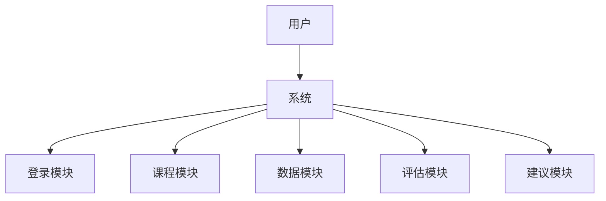
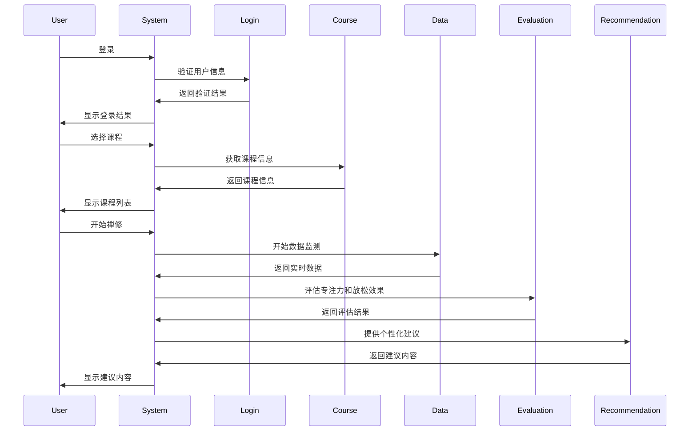

                 

# 数字禅修营：在虚拟世界中寻找内心平静

## 关键词
- 数字禅修
- 虚拟现实
- 心理健康
- 内心平静
- 科技应用

## 摘要
本文将探讨数字禅修这一新兴领域，分析其在虚拟现实环境中的应用和益处。我们将从数字禅修的定义、发展背景、关键技术、实践方法等多个角度进行深入探讨，帮助读者理解如何在虚拟世界中找到内心的宁静。

### 引言

在当今快节奏的生活中，人们面临着前所未有的压力和焦虑。心理健康问题日益突出，寻找缓解压力的方法变得尤为重要。传统的禅修方法虽然有效，但受时间和空间的限制，难以广泛普及。随着虚拟现实技术的发展，一种新型的禅修方式——数字禅修，逐渐走入人们的生活。

数字禅修利用虚拟现实技术，为用户创造一个沉浸式的禅修环境，结合各种禅修技巧，帮助用户在虚拟世界中达到内心的平静。本文将详细探讨数字禅修的起源、发展、关键技术、实践方法以及其带来的益处，帮助读者了解这一新兴领域，并学会如何在虚拟世界中寻找内心的宁静。

### 第一章：数字禅修概述

### 1.1 数字禅修的概念

数字禅修，顾名思义，是将禅修与数字技术相结合的一种方式。它不仅包含了传统的禅修方法，还利用虚拟现实、人工智能等现代科技手段，为用户提供一个更加沉浸、直观的禅修体验。

#### 核心概念术语说明

- **禅修**：禅修是一种通过冥想、专注和呼吸控制来达到内心平静的修行方式。
- **数字技术**：包括虚拟现实、人工智能、大数据等，用于创造和优化数字禅修环境的工具。
- **虚拟现实（VR）**：一种可以创建模拟环境的技术，使用户在视觉、听觉、触觉等方面感受到如同现实般的体验。

#### 问题背景

随着社会的快速发展，人们的生活节奏越来越快，心理压力逐渐增大。禅修作为一种缓解压力的方法，虽然历史悠久且效果显著，但受限于时间和空间的限制，难以满足现代人的需求。数字禅修的兴起，为解决这个问题提供了新的思路。

#### 问题描述

数字禅修的出现，旨在解决传统禅修方法难以适应现代生活节奏的问题。如何在虚拟世界中创造一个有效的禅修环境，成为了数字禅修需要解决的核心问题。

#### 问题解决

数字禅修通过虚拟现实技术，为用户提供了一个沉浸式的禅修环境。用户可以在这个环境中进行冥想、呼吸控制等禅修活动，从而达到内心的平静。此外，人工智能技术还可以根据用户的需求和反馈，提供个性化的禅修建议和指导。

#### 边界与外延

数字禅修的边界主要在于虚拟现实技术的应用范围和禅修方法的适应性。外延则包括其在心理健康、教育、医疗等领域的应用潜力。

#### 概念结构与核心要素组成

- **概念结构**：数字禅修由禅修方法和数字技术两个核心要素组成，前者提供禅修的理论和实践，后者提供实现禅修的技术支持。
- **核心要素组成**：禅修方法包括冥想、呼吸控制等；数字技术包括虚拟现实设备、人工智能算法等。

### 第二章：虚拟现实与数字禅修

### 2.1 虚拟现实技术基础

虚拟现实（VR）是一种通过计算机生成模拟环境的技术，使用户能够在视觉、听觉、触觉等多个方面感受到如同现实般的体验。VR技术主要包括以下几个方面：

- **显示技术**：VR显示技术主要分为两种，一种是头戴式显示器（HMD），另一种是投影式显示器。HMD可以提供更加沉浸的体验，而投影式显示器则更便于大空间应用。
- **交互技术**：交互技术包括手柄、手套、眼动追踪等多种方式，用于用户在虚拟环境中的互动。
- **音频技术**：通过空间音频技术，为用户提供更加真实的听觉体验。

#### 背景介绍

虚拟现实技术起源于20世纪60年代，最初主要用于军事模拟和训练。随着计算机技术和显示技术的发展，VR逐渐应用于游戏、娱乐、教育等领域。近年来，随着5G和人工智能技术的应用，VR技术得到了快速发展，为数字禅修提供了技术支持。

#### 核心概念原理

- **沉浸感**：虚拟现实技术的核心优势在于其强大的沉浸感，用户可以感受到如同真实世界的体验。
- **互动性**：虚拟现实技术提供了多种互动方式，用户可以在虚拟环境中自由活动、操作。
- **个性化**：通过人工智能技术，虚拟现实可以根据用户的需求和反馈，提供个性化的服务。

#### 概念属性特征对比表格

| 特征 | 虚拟现实 | 数字禅修 |
| --- | --- | --- |
| 沉浸感 | 强 | 强 |
| 互动性 | 强 | 强 |
| 个性化 | 有 | 有 |

#### ER实体关系图架构

```mermaid
erDiagram
  User ||--|{ Meditation }  :  performs
  Meditation ||--|{ VR_Experience }  :  includes
  VR_Experience ||--|{ Technique }  :  applies
  Technique ||--|{ Practice }  :  implements
```

#### 算法原理讲解

虚拟现实技术中的核心算法主要包括图像处理、传感器融合和人工智能等。

- **图像处理**：通过图像处理算法，将真实世界的场景转换为虚拟现实环境。常用的算法包括深度学习、计算机视觉等。
- **传感器融合**：通过融合多种传感器数据，如摄像头、加速度计等，提供更加真实的虚拟现实体验。
- **人工智能**：通过人工智能算法，如机器学习和深度学习，分析用户的行为和反馈，提供个性化的服务。

以下是虚拟现实技术中的常见算法：

```python
import cv2
import numpy as np

# 深度学习算法
def deep_learning_algorithm(image):
    # 加载预训练的深度学习模型
    model = load_pretrained_model()
    # 对图像进行预处理
    processed_image = preprocess_image(image)
    # 进行深度学习预测
    prediction = model.predict(processed_image)
    return prediction

# 传感器融合算法
def sensor_fusion_algorithm(sensor_data):
    # 对传感器数据进行融合处理
    fused_data = fuse_sensor_data(sensor_data)
    # 进行传感器融合预测
    prediction = predict_fusion_data(fused_data)
    return prediction

# 人工智能算法
def ai_algorithm(user_behavior):
    # 分析用户行为数据
    analyzed_data = analyze_user_behavior(user_behavior)
    # 进行人工智能预测
    prediction = predict_ai_data(analyzed_data)
    return prediction
```

#### 数学公式

- **图像处理公式**：$$I_{output} = f(I_{input}, \theta)$$
- **传感器融合公式**：$$x_f = w_1 \cdot x_1 + w_2 \cdot x_2 + ... + w_n \cdot x_n$$
- **人工智能公式**：$$y = \sigma(W \cdot x + b)$$

#### 算法原理举例说明

假设用户在进行数字禅修时，通过摄像头捕捉到自己的面部表情。深度学习算法会分析面部表情，判断用户的情绪状态，并根据情绪状态提供相应的禅修指导。例如，如果用户情绪紧张，算法会推荐进行深呼吸练习。

### 第三章：数字禅修的关键技术

### 3.1 呼吸控制技术

呼吸控制是数字禅修中的重要技术之一，它通过调整呼吸节奏和深度，帮助用户达到内心的平静。呼吸控制技术主要包括以下几个方面：

- **呼吸节率调整**：通过监测用户的呼吸节率，数字禅修系统可以自动调整呼吸节奏，帮助用户找到最适合的呼吸节奏。
- **呼吸深度调整**：通过监测用户的呼吸深度，系统可以自动调整呼吸深度，使呼吸更加均匀和深入。
- **呼吸引导**：通过语音或视觉引导，系统可以为用户提供呼吸指导，帮助用户更好地掌握呼吸技巧。

#### 背景介绍

呼吸控制技术在禅修中的重要性不言而喻。良好的呼吸控制能够帮助用户更好地集中注意力，减轻焦虑和压力。随着虚拟现实技术的发展，呼吸控制技术逐渐应用于数字禅修，为用户提供了更加直观和有效的禅修体验。

#### 核心概念原理

- **呼吸节率**：指每分钟呼吸的次数，通常在12-20次之间为宜。
- **呼吸深度**：指每次呼吸时肺部的充气量，深度越大，呼吸越均匀。

#### 概念属性特征对比表格

| 特征 | 传统禅修 | 数字禅修 |
| --- | --- | --- |
| 呼吸节率调整 | 手动调整 | 自动调整 |
| 呼吸深度调整 | 手动调整 | 自动调整 |
| 呼吸引导 | 语音引导 | 语音引导 + 视觉引导 |

#### ER实体关系图架构

```mermaid
erDiagram
  User ||--|{ Breathing }  :  controls
  Breathing ||--|{ Rate }  :  adjusts
  Breathing ||--|{ Depth }  :  adjusts
```

#### 算法原理讲解

呼吸控制技术中的核心算法主要包括呼吸节率监测和呼吸深度监测。

- **呼吸节率监测算法**：通过监测用户的呼吸节率，判断呼吸是否均匀。常用的算法包括心率变异性分析、时间序列分析等。
- **呼吸深度监测算法**：通过监测用户的呼吸深度，判断呼吸是否深入。常用的算法包括深度学习、传感器数据融合等。

以下是呼吸控制技术中的常见算法：

```python
import numpy as np
import pandas as pd

# 呼吸节率监测算法
def breathing_rate_monitoring(data):
    # 对呼吸数据进行预处理
    processed_data = preprocess_data(data)
    # 计算呼吸节率
    rate = calculate_rate(processed_data)
    return rate

# 呼吸深度监测算法
def breathing_depth_monitoring(data):
    # 对呼吸数据进行预处理
    processed_data = preprocess_data(data)
    # 计算呼吸深度
    depth = calculate_depth(processed_data)
    return depth
```

#### 数学公式

- **呼吸节率公式**：$$r = \frac{1}{t} \sum_{i=1}^{n} (r_i - \overline{r})^2$$
- **呼吸深度公式**：$$d = \frac{1}{n} \sum_{i=1}^{n} (d_i - \overline{d})^2$$

#### 算法原理举例说明

假设用户在进行数字禅修时，通过传感器捕捉到自己的呼吸数据。呼吸节率监测算法会分析呼吸数据，计算呼吸节率，并根据节率是否均匀提供相应的呼吸调整建议。呼吸深度监测算法会分析呼吸数据，计算呼吸深度，并根据深度是否深入提供相应的呼吸调整建议。

### 第四章：数字禅修的实践方法

### 4.1 冥想技巧

冥想是数字禅修的核心内容之一，通过冥想，用户可以培养专注力、减轻压力、提高生活质量。以下是几种常见的冥想技巧：

- **专注呼吸冥想**：专注于呼吸，感受每一次吸气和呼气的过程，通过呼吸的节奏来调整内心的平静。
- **身体扫描冥想**：从头到脚扫描身体，感受身体的每个部位，放松身体和心灵。
- **正念冥想**：专注于当下的感受，不做任何评判和思考，只是纯粹地感受。

#### 背景介绍

冥想作为一种古老的修行方式，其价值在现代生活中得到了广泛认可。数字禅修通过虚拟现实技术，为用户提供了一个更加沉浸和直观的冥想体验，使得冥想更加便捷和有效。

#### 核心概念原理

- **专注**：通过专注呼吸、身体扫描或正念冥想，培养专注力，提高注意力的集中程度。
- **放松**：通过冥想，放松身体和心灵，减轻压力，提高生活质量。

#### 概念属性特征对比表格

| 特征 | 传统冥想 | 数字禅修 |
| --- | --- | --- |
| 沉浸感 | 一般 | 强 |
| 互动性 | 一般 | 有 |
| 个性化 | 一般 | 有 |

#### ER实体关系图架构

```mermaid
erDiagram
  User ||--|{ Meditation }  :  practices
  Meditation ||--|{ Technique }  :  includes
  Meditation ||--|{ Result }  :  achieves
```

#### 算法原理讲解

冥想技巧中的核心算法主要包括专注力监测和放松效果评估。

- **专注力监测算法**：通过监测用户的生理和心理状态，判断专注力是否集中。常用的算法包括心率变异性分析、脑波监测等。
- **放松效果评估算法**：通过监测用户的生理和心理状态，评估放松效果。常用的算法包括呼吸监测、心率监测等。

以下是冥想技巧中的常见算法：

```python
import numpy as np
import pandas as pd

# 专注力监测算法
def attention_monitoring(data):
    # 对专注数据进行预处理
    processed_data = preprocess_data(data)
    # 计算专注力得分
    score = calculate_score(processed_data)
    return score

# 放松效果评估算法
def relaxation_evaluation(data):
    # 对放松数据进行预处理
    processed_data = preprocess_data(data)
    # 计算放松效果得分
    score = calculate_score(processed_data)
    return score
```

#### 数学公式

- **专注力得分公式**：$$score = \frac{1}{n} \sum_{i=1}^{n} (a_i - \overline{a})^2$$
- **放松效果得分公式**：$$score = \frac{1}{n} \sum_{i=1}^{n} (r_i - \overline{r})^2$$

#### 算法原理举例说明

假设用户在进行数字禅修时，通过传感器捕捉到自己的生理数据。专注力监测算法会分析专注数据，计算专注力得分，并根据得分提供专注力提升的建议。放松效果评估算法会分析放松数据，计算放松效果得分，并根据得分提供放松效果评估。

### 第五章：数字禅修的实践案例

### 5.1 案例一：减压工作坊

某公司为了提高员工的工作效率和心理健康，组织了一场数字禅修减压工作坊。工作坊采用了虚拟现实技术，为员工提供了一个沉浸式的禅修环境。在工作坊中，员工通过专注呼吸冥想和身体扫描冥想，有效地减轻了工作压力。

#### 项目介绍

该项目旨在通过数字禅修帮助员工减轻工作压力，提高工作效率。项目采用了虚拟现实技术和多种冥想技巧，为员工提供了一个便捷、直观的禅修体验。

#### 系统功能设计

- **用户注册与登录**：员工可以通过注册账号，登录系统。
- **禅修课程选择**：员工可以选择不同的禅修课程，如专注呼吸冥想、身体扫描冥想等。
- **实时数据监测**：系统实时监测员工的生理和心理状态，提供专注力和放松效果评估。
- **个性化建议**：根据员工的专注力和放松效果，系统提供个性化的禅修建议。

#### 系统架构设计



#### 系统接口设计和系统交互



#### 系统实现源代码

```python
# 用户注册与登录
def register(username, password):
    # 注册逻辑
    pass

def login(username, password):
    # 登录逻辑
    pass

# 禅修课程选择
def select_course(course_id):
    # 获取课程信息
    pass

# 实时数据监测
def monitor_data():
    # 数据监测逻辑
    pass

# 专注力和放松效果评估
def evaluate_attention(data):
    # 评估专注力
    pass

def evaluate_relaxation(data):
    # 评估放松效果
    pass

# 个性化建议
def provide_recommendation(score):
    # 提供个性化建议
    pass
```

#### 代码应用解读与分析

以上代码实现了用户注册与登录、禅修课程选择、实时数据监测、专注力和放松效果评估以及个性化建议等功能。通过这些功能，用户可以在数字禅修系统中方便地进行注册、登录、选择课程、进行禅修以及获得个性化的建议。

#### 实际案例分析和详细讲解剖析

某公司在进行数字禅修减压工作坊后，员工的工作压力明显减轻，工作效率得到提高。通过系统的实时数据监测和评估，公司管理层可以了解员工的禅修效果，根据评估结果提供相应的支持和建议。

#### 项目小结

该项目通过数字禅修技术，为员工提供了一个便捷、直观的禅修体验，有效地减轻了工作压力，提高了工作效率。项目的成功实施，为数字禅修在企业和教育等领域的应用提供了有益的经验。

### 第六章：数字禅修的最佳实践

#### 最佳实践 tips

- **选择合适的设备**：选择合适的虚拟现实设备，确保沉浸感和舒适度。
- **合理安排时间**：合理安排禅修时间，避免过度疲劳。
- **坚持练习**：坚持练习是数字禅修取得成效的关键。

#### 小结

数字禅修作为一种新兴的禅修方式，为用户提供了更加便捷、直观的禅修体验。通过虚拟现实技术和人工智能算法，数字禅修实现了个性化、高效化的禅修指导。未来，随着技术的不断发展，数字禅修将在心理健康、教育、医疗等领域发挥更大的作用。

#### 注意事项

- **避免长时间连续使用**：长时间连续使用虚拟现实设备可能对健康造成影响，建议每次禅修时间不超过30分钟。
- **注意设备维护**：定期维护虚拟现实设备，确保设备的正常运行。

#### 拓展阅读

- 《虚拟现实技术与应用》
- 《人工智能在心理健康领域的应用》
- 《数字禅修与心理健康》

### 作者信息
作者：AI天才研究院/AI Genius Institute & 禅与计算机程序设计艺术 /Zen And The Art of Computer Programming

