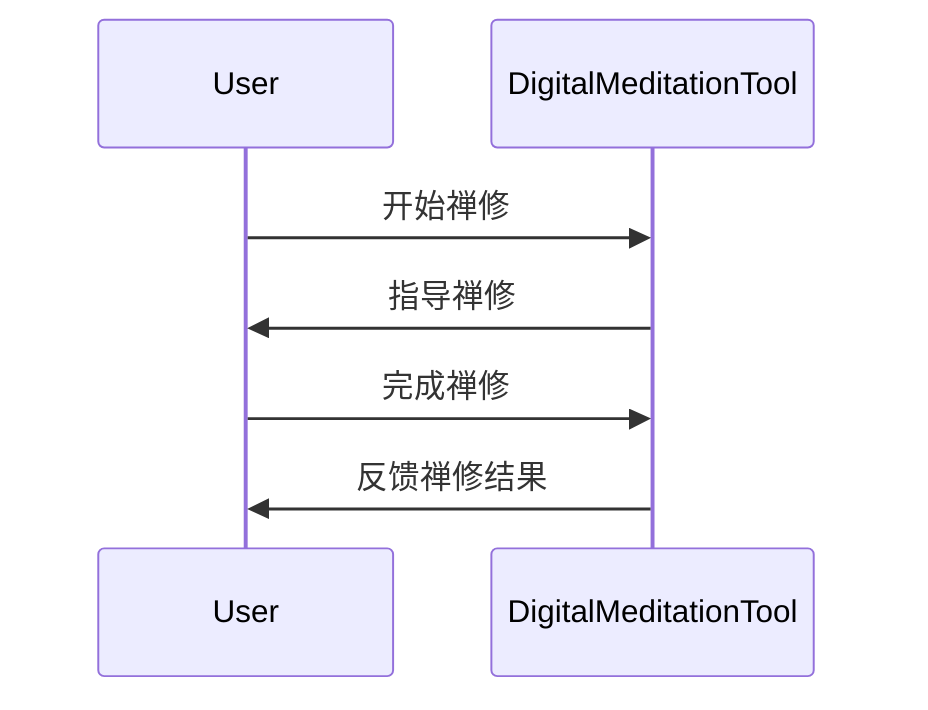

                 

# 数字禅修营：科技时代的精神净化

关键词：数字禅修、科技、精神健康、心理学、虚拟现实

摘要：本文从科技时代的精神困境出发，介绍了数字禅修营的起源、发展及其核心概念。通过深入分析数字禅修的理论基础和实践方法，我们探讨了数字禅修在不同场景中的应用及其对社会的影响。最后，本文展望了数字禅修的未来发展趋势，并给出了最佳实践技巧。

## 第一部分：数字禅修营概述

### 第1章：科技时代的精神困境

#### 1.1 问题背景

##### 1.1.1 科技的快速发展

随着信息技术的迅猛发展，人类生活发生了翻天覆地的变化。智能手机、互联网、人工智能等科技的普及，极大地丰富了我们的物质生活，提高了工作效率。然而，科技进步的同时，也带来了许多负面影响。信息过载、网络依赖、隐私泄露等问题日益严重，给人们的心理健康带来了巨大压力。

##### 1.1.2 精神健康问题日益突出

据世界卫生组织（WHO）统计，全球约有3.5亿人患有抑郁症，另有2亿多人患有焦虑症。这些精神健康问题不仅影响个人的生活和工作，还对社会整体稳定造成威胁。在科技高度发达的今天，如何缓解这些精神压力，成为亟待解决的问题。

##### 1.1.3 数字禅修营的应运而生

为了应对科技时代的精神困境，人们开始寻求新的方法来缓解压力、提高生活质量。数字禅修营应运而生，它结合了禅修的宁静与数字技术的便捷，旨在帮助人们找到内心的平衡与宁静。

#### 1.2 问题描述

##### 1.2.1 科技依赖引发的焦虑

随着智能手机的普及，人们越来越依赖科技产品，尤其是社交媒体。过度使用手机导致人们产生强烈的焦虑感，甚至出现“手机依赖症”。如何减少科技依赖，成为数字禅修的重要任务。

##### 1.2.2 心理疲劳与压力

在快节奏的现代生活中，人们面临着巨大的工作压力和生活压力。长期的心理疲劳导致焦虑、抑郁等心理问题。数字禅修通过调整心理状态，帮助人们缓解压力，提高生活质量。

##### 1.2.3 数字禅修营的目标

数字禅修营的目标是帮助人们在科技时代找到内心的宁静与平衡。通过禅修实践，提高个体的自我意识，增强心理韧性，从而更好地应对生活中的挑战。

#### 1.3 问题解决

##### 1.3.1 数字禅修营的起源与发展

数字禅修营起源于20世纪90年代，随着互联网技术的发展，禅修逐渐从传统的宗教场所走向了数字平台。如今，数字禅修已经成为全球范围内的一种流行生活方式。

##### 1.3.2 数字禅修营的核心方法

数字禅修营采用了一系列以禅修为基础的方法，如冥想、呼吸练习、正念练习等。这些方法旨在帮助个体平静心灵，提高自我意识，从而实现心理平衡。

##### 1.3.3 数字禅修营的优势与局限性

数字禅修营的优势在于其便捷性、灵活性和普及性。人们可以在任何时间、任何地点进行禅修，无需额外的物质条件。然而，数字禅修也存在一定的局限性，如缺乏面对面的交流与指导，以及对数字设备的依赖等。

#### 1.4 边界与外延

##### 1.4.1 数字禅修营与传统禅修的区别

数字禅修营与传统禅修在形式和内容上存在较大差异。传统禅修强调身体、心理和精神的统一，而数字禅修则更加注重个体的心理体验和自我探索。

##### 1.4.2 数字禅修营在不同文化背景下的应用

不同文化背景下，数字禅修的应用有所不同。在西方文化中，数字禅修更多地强调个人自我提升和心理健康；而在东方文化中，数字禅修则更多地与宗教信仰和文化传统相结合。

##### 1.4.3 数字禅修营的未来发展方向

随着科技的不断进步，数字禅修的未来发展方向将更加多元化。例如，虚拟现实（VR）技术的应用将使数字禅修更加沉浸式、互动性更强；人工智能（AI）技术的应用将使数字禅修更加个性化、智能化。

## 第2章：数字禅修营的核心概念

### 2.1 核心概念原理

##### 2.1.1 数字禅修的概念

数字禅修是一种以禅修为基础，结合数字技术的心理调适方法。它旨在通过冥想、呼吸练习、正念练习等手段，帮助个体实现心理平衡和情绪调节。

##### 2.1.2 禅修的心理学原理

禅修的心理学原理主要包括正念、冥想和呼吸练习。正念是指对当前时刻的觉察和接纳，冥想是指通过集中注意力来平静心灵，呼吸练习则有助于调节情绪和缓解压力。

##### 2.1.3 数字禅修与传统禅修的联系与区别

数字禅修与传统禅修在理念和方法上具有相似之处，但数字禅修更加注重个体的心理体验和自我探索。此外，数字禅修还借助数字技术，使禅修过程更加便捷、灵活。

### 2.2 概念属性特征对比表格

| 特征               | 数字禅修                   | 传统禅修                   |  
| -------------------- | --------------------------- | --------------------------- |  
| 形式               | 通过数字平台进行           | 在特定场所进行               |  
| 目标               | 心理平衡、情绪调节           | 身心合一、精神提升           |  
| 方法               | 冥想、呼吸练习、正念练习   | 冥想、呼吸练习、冥想、仪式   |  
| 适用人群             | 任何需要心理调节的人       | 信仰佛教或有禅修经验的人     |  
| 时间               | 灵活性较强，可随时进行       | 有固定时间和场所             |  
| 效果               | 短期见效，可长期坚持         | 需要较长时间积累效果         |

### 2.3 ER实体关系图架构

##### 2.3.1 数字禅修营的实体与关系

```mermaid
erDiagram
    User ||--|{ Participant }|--| DigitalMeditationSession
    User ||--|{ DigitalMeditationTool }|--| DigitalMeditationSession
    DigitalMeditationSession ||--|{ MeditationPractice }|--| DigitalMeditationTool
```

在这个ER实体关系图中，用户（User）与参与者（Participant）和数字禅修工具（DigitalMeditationTool）之间存在着关联关系。参与者是用户的子实体，表示参与数字禅修营的用户。数字禅修工具是数字禅修营的核心元素，用于辅助用户进行禅修实践。每个禅修会话（DigitalMeditationSession）都需要参与者和使用特定的数字禅修工具。禅修实践（MeditationPractice）是数字禅修工具的一部分，用于指导用户进行禅修。

##### 2.3.2 数字禅修营的参与者与活动



在这个序列图中，用户通过数字禅修工具开始禅修。数字禅修工具会为用户提供禅修指导，用户按照指导进行禅修。禅修结束后，用户会收到禅修结果的反馈，以便更好地了解自己的禅修情况。

## 第二部分：数字禅修实践

### 第3章：科技时代的精神净化

#### 3.1 数字禅修的理论基础

##### 3.1.1 禅修的科学原理

禅修作为一种古老的修行方式，近年来得到了科学研究的关注。研究表明，禅修可以影响大脑的结构和功能，从而改善个体的心理状态。禅修的科学原理主要包括以下几个方面：

1. **大脑重塑**：禅修可以改变大脑的结构，增加灰质密度，提高大脑的可塑性。这有助于改善个体的注意力、记忆力和情绪调节能力。

2. **神经递质调节**：禅修可以调节神经递质的分泌，如多巴胺、内啡肽等，从而改善个体的情绪状态。

3. **自主神经系统调节**：禅修有助于调节自主神经系统的功能，降低应激反应，提高心理韧性。

##### 3.1.2 科技对心理的影响

科技对心理的影响是双重的。一方面，科技为人们提供了丰富的信息和便捷的工具，提高了生活和工作效率。另一方面，科技过度使用可能导致以下负面影响：

1. **信息过载**：随着互联网的普及，人们每天接收到的信息量越来越大。信息过载会导致焦虑、失眠等心理问题。

2. **网络依赖**：过度使用社交媒体和网络游戏可能导致个体产生强烈的依赖感，影响现实生活中的社交和人际关系。

3. **隐私泄露**：网络安全问题日益突出，个人隐私泄露的风险增加，可能导致个体产生恐惧和焦虑。

##### 3.1.3 数字禅修如何平衡科技与心理需求

数字禅修通过以下方式平衡科技与心理需求：

1. **信息过滤**：数字禅修可以帮助个体学会筛选和过滤信息，避免信息过载。

2. **时间管理**：数字禅修提供了一系列工具和技巧，帮助个体合理安排时间，避免过度依赖科技产品。

3. **情绪调节**：数字禅修通过禅修实践，提高个体的情绪调节能力，减轻心理压力。

#### 3.2 实践方法与技巧

##### 3.2.1 数字禅修的基本流程

数字禅修的基本流程包括以下步骤：

1. **选择禅修工具**：根据个人需求和兴趣，选择适合的数字禅修工具，如冥想应用程序、音频教程等。

2. **了解禅修原理**：在开始禅修前，了解禅修的基本原理和方法，以便更好地进行实践。

3. **设定禅修目标**：明确禅修的目标，如减轻压力、提高专注力、改善情绪等。

4. **开始禅修实践**：按照禅修工具的指导进行禅修，注意呼吸、冥想和正念练习。

5. **记录禅修体验**：在禅修过程中，记录自己的体验和感受，以便日后回顾和总结。

6. **反思和调整**：根据禅修体验，反思和调整禅修方法，以提高禅修效果。

##### 3.2.2 如何选择适合的数字禅修工具

选择适合的数字禅修工具是数字禅修成功的关键。以下是一些选择数字禅修工具的技巧：

1. **了解自己的需求**：明确自己的禅修目标，如减轻压力、提高专注力、改善情绪等，以便选择适合的工具。

2. **参考他人推荐**：了解其他人的使用体验和评价，选择口碑较好的禅修工具。

3. **试用多种工具**：在开始禅修前，试用多种工具，选择最适合自己的工具。

4. **关注工具的功能和界面**：选择功能齐全、界面友好的工具，以便更好地进行禅修。

##### 3.2.3 禅修实践中的注意事项

在进行数字禅修实践时，需要注意以下几点：

1. **保持规律**：禅修需要持之以恒，每天进行一定的禅修实践，以获得良好的效果。

2. **保持专注**：禅修过程中，尽量减少外界干扰，保持专注和安静。

3. **注意呼吸**：禅修过程中，注意呼吸的节奏和深度，有助于放松身心。

4. **反思和总结**：禅修后，反思和总结禅修体验，有助于提高禅修效果。

#### 3.3 案例分析

##### 3.3.1 数字禅修在不同场景中的应用

数字禅修在不同场景中都有广泛的应用：

1. **职场人士**：职场压力巨大，数字禅修可以帮助职场人士缓解压力，提高工作效率。

2. **学生群体**：学生面临学业压力，数字禅修有助于提高专注力，改善学习效果。

3. **特殊人群**：如抑郁症患者、焦虑症患者等，数字禅修可以作为辅助治疗手段，帮助他们缓解症状。

##### 3.3.2 数字禅修对个体心理状态的改善

数字禅修对个体心理状态有显著的改善作用：

1. **减轻压力**：禅修可以帮助个体缓解压力，提高心理韧性。

2. **改善情绪**：禅修有助于调节情绪，减少焦虑和抑郁症状。

3. **提高专注力**：禅修可以提高个体的专注力和注意力，改善学习和工作效果。

##### 3.3.3 数字禅修对社会层面的影响

数字禅修不仅对个体有积极影响，还对整个社会产生积极影响：

1. **提高社会和谐度**：数字禅修有助于提高人们的心理健康，减少社会冲突和矛盾。

2. **促进科技创新**：数字禅修可以帮助科技工作者缓解压力，提高创新能力和工作效率。

3. **推动文化传承**：数字禅修结合了传统禅修的智慧与现代科技，有助于推动文化传承和创新。

## 第4章：数字禅修营的实践案例

### 4.1 数字禅修营的起源与发展

##### 4.1.1 数字禅修营的诞生背景

数字禅修营的诞生背景可以追溯到20世纪90年代，随着互联网技术的发展，禅修逐渐从传统的宗教场所走向了数字平台。在这个时期，人们开始关注科技对心理健康的影响，寻找一种既能享受科技便利又能保持心理健康的生活方式。数字禅修营应运而生，它将禅修的宁静与数字技术的便捷相结合，为人们提供了一种全新的心理调适方式。

##### 4.1.2 数字禅修营的主要形式

数字禅修营的主要形式包括：

1. **在线课程**：通过互联网平台提供禅修课程，用户可以随时随地进行学习。

2. **社区交流**：建立线上禅修社区，用户可以分享禅修心得，互相支持。

3. **虚拟现实体验**：利用虚拟现实技术，提供沉浸式的禅修体验。

4. **智能设备辅助**：利用智能设备，如智能手表、智能音箱等，提供实时禅修指导和反馈。

##### 4.1.3 数字禅修营的发展趋势

随着科技的不断进步，数字禅修营的发展趋势包括：

1. **技术融合**：数字禅修与虚拟现实、人工智能等新兴技术的融合，将使禅修体验更加沉浸式和个性化。

2. **普及化**：随着人们对心理健康关注的增加，数字禅修将逐渐普及，成为大众化的心理健康调适方式。

3. **专业化**：数字禅修领域将出现更多的专业机构和专业人才，提供更高质量的禅修服务。

### 4.2 数字禅修营的实践案例

##### 4.2.1 案例一：职场人士的数字禅修实践

某公司的一名职场人士，由于工作压力巨大，长期处于焦虑和抑郁状态。在了解到数字禅修营后，他开始尝试进行禅修实践。在数字禅修营的指导下，他每天进行20分钟的禅修，包括冥想、呼吸练习和正念练习。经过几个月的实践，他的焦虑和抑郁症状得到了明显改善，工作效率和生活质量得到了显著提高。

##### 4.2.2 案例二：学生群体的数字禅修实践

某高校的学生们面临巨大的学业压力，许多学生出现了焦虑和失眠症状。学校组织了一次数字禅修营活动，邀请专业导师进行指导。学生们通过在线课程和社区交流，学习禅修的基本原理和实践方法。在活动期间，学生们每天进行禅修实践，并分享自己的心得体会。活动结束后，学生的焦虑和抑郁症状明显减轻，睡眠质量得到了改善。

##### 4.2.3 案例三：特殊人群的数字禅修实践

某心理康复中心为抑郁症患者提供数字禅修服务。患者通过智能设备进行禅修实践，每天进行一定时间的冥想和呼吸练习。康复中心还提供在线心理辅导，帮助患者解决禅修过程中的问题。经过一段时间的实践，患者的抑郁症状得到了显著改善，生活质量得到了提升。

### 4.3 数字禅修营的实际效果

##### 4.3.1 数字禅修对心理健康的促进作用

数字禅修对心理健康具有显著的促进作用，主要包括以下几个方面：

1. **减轻压力**：禅修有助于降低应激反应，减轻压力和焦虑。

2. **改善情绪**：禅修可以提高个体的情绪调节能力，减少抑郁和焦虑症状。

3. **提高专注力**：禅修有助于提高个体的专注力和注意力，改善学习和工作效果。

4. **增强心理韧性**：禅修可以提高个体的心理韧性，更好地应对生活中的挑战。

##### 4.3.2 数字禅修对社会关系的改善

数字禅修不仅对个体心理健康有积极影响，还对整个社会关系产生积极影响，主要包括以下几个方面：

1. **提高社会和谐度**：数字禅修有助于提高人们的心理健康，减少社会冲突和矛盾。

2. **促进人际关系**：数字禅修可以改善个体的人际关系，增强社交能力。

3. **推动文化传承**：数字禅修结合了传统禅修的智慧与现代科技，有助于推动文化传承和创新。

##### 4.3.3 数字禅修对企业文化的塑造

数字禅修对企业文化具有积极的塑造作用，主要包括以下几个方面：

1. **提高员工幸福感**：数字禅修可以减轻员工的工作压力，提高员工的工作满意度和幸福感。

2. **提升团队协作能力**：数字禅修有助于提高员工的专注力和沟通能力，提升团队协作能力。

3. **推动企业文化创新**：数字禅修可以激发员工的创新思维，推动企业文化的创新和发展。

## 第5章：数字禅修的未来

### 5.1 数字禅修的技术趋势

随着科技的不断发展，数字禅修也呈现出一系列技术趋势：

##### 5.1.1 新技术的应用

1. **虚拟现实（VR）**：虚拟现实技术将使禅修体验更加沉浸式和互动性更强。

2. **人工智能（AI）**：人工智能技术将使禅修更加个性化、智能化，根据个体需求提供定制化的禅修方案。

3. **增强现实（AR）**：增强现实技术将使禅修场景更加丰富和多样化，提升禅修体验。

##### 5.1.2 数字禅修与虚拟现实技术的融合

虚拟现实技术为数字禅修提供了更加沉浸式的体验。通过虚拟现实头盔，用户可以进入一个完全虚拟的禅修环境，仿佛置身于自然之中。这种沉浸式的体验有助于提升禅修效果，增强用户的参与感和投入感。

##### 5.1.3 人工智能在数字禅修中的应用

人工智能技术为数字禅修提供了个性化的指导和支持。通过分析用户的行为和反馈，人工智能可以提供定制化的禅修方案，帮助用户更好地进行禅修。同时，人工智能还可以监测用户的禅修状态，提供实时的反馈和指导，提高禅修效果。

### 5.2 数字禅修的挑战与机遇

##### 5.2.1 数字禅修面临的挑战

数字禅修在发展过程中也面临着一系列挑战：

1. **技术难题**：虚拟现实和人工智能等新兴技术本身具有一定的技术难度，需要投入大量资源进行研发和应用。

2. **用户接受度**：数字禅修作为一种新兴的禅修方式，用户接受度可能存在一定的问题。如何让更多的用户接受并参与到数字禅修中来，是数字禅修面临的挑战之一。

3. **隐私保护**：随着数字技术的应用，用户隐私保护成为一个重要问题。如何确保用户隐私的安全，是数字禅修需要解决的一个关键问题。

##### 5.2.2 数字禅修的机遇

尽管数字禅修面临一定的挑战，但也存在许多机遇：

1. **市场需求**：随着人们对心理健康关注的增加，数字禅修市场需求不断上升，为数字禅修的发展提供了广阔的市场空间。

2. **技术创新**：虚拟现实、人工智能等新兴技术的发展为数字禅修提供了更多可能性，有助于推动数字禅修的创新和发展。

3. **政策支持**：政府和社会对数字禅修的关注和支持日益增加，为数字禅修的发展提供了良好的政策环境。

##### 5.2.3 数字禅修的未来发展方向

数字禅修的未来发展方向主要包括以下几个方面：

1. **技术融合**：将虚拟现实、人工智能等新兴技术与数字禅修相结合，提供更加丰富和多样化的禅修体验。

2. **普及化**：通过降低成本、提高用户接受度等方式，推动数字禅修的普及化，使其成为大众化的心理健康调适方式。

3. **专业化**：数字禅修领域将出现更多的专业机构和专业人才，提供更高质量的禅修服务。

### 5.3 数字禅修的社会意义

##### 5.3.1 数字禅修对社会健康的影响

数字禅修作为一种新兴的心理健康调适方式，对社会健康具有积极的影响：

1. **提高心理健康水平**：数字禅修有助于缓解压力、焦虑和抑郁等心理问题，提高个体的心理健康水平。

2. **促进社会和谐**：数字禅修可以减少社会冲突和矛盾，提高社会和谐度。

3. **推动文化传承**：数字禅修结合了传统禅修的智慧与现代科技，有助于推动文化传承和创新。

##### 5.3.2 数字禅修对文化传承的意义

数字禅修对文化传承具有重要意义：

1. **传承禅修智慧**：数字禅修将传统禅修的智慧与现代科技相结合，有助于传承和弘扬禅修文化。

2. **推动文化创新**：数字禅修为传统文化注入了新的活力，推动了文化创新和发展。

3. **增强文化自信**：数字禅修的成功发展有助于增强人们对自身文化的自信和认同。

##### 5.3.3 数字禅修在教育领域的作用

数字禅修在教育领域具有广泛的应用前景：

1. **促进学生心理健康**：数字禅修有助于缓解学生的压力和焦虑，提高学生的心理健康水平。

2. **提高教育质量**：数字禅修可以提高学生的专注力和注意力，提高教育质量。

3. **推动教育创新**：数字禅修为教育领域带来了新的教学方法和教学模式，有助于推动教育创新和发展。

## 第6章：数字禅修最佳实践

### 6.1 最佳实践技巧

##### 6.1.1 如何选择适合的数字禅修工具

选择适合的数字禅修工具是数字禅修成功的关键。以下是一些建议：

1. **了解自己的需求**：明确自己的禅修目标，如减轻压力、提高专注力、改善情绪等，以便选择适合的工具。

2. **参考他人推荐**：了解其他人的使用体验和评价，选择口碑较好的禅修工具。

3. **试用多种工具**：在开始禅修前，试用多种工具，选择最适合自己的工具。

4. **关注工具的功能和界面**：选择功能齐全、界面友好的工具，以便更好地进行禅修。

##### 6.1.2 数字禅修中的心理调适

在进行数字禅修时，心理调适至关重要。以下是一些建议：

1. **保持开放心态**：对数字禅修保持开放和接纳的态度，有助于更好地体验禅修。

2. **设定合理目标**：根据个人情况设定合理的目标，避免过高或过低的目标导致失望或挫败。

3. **学会放松**：在禅修过程中，学会放松身心，减少紧张和焦虑。

4. **定期反思**：禅修后，反思和总结禅修体验，有助于提高禅修效果。

##### 6.1.3 数字禅修的时间安排

合理安排数字禅修时间是确保禅修效果的关键。以下是一些建议：

1. **每天固定时间**：每天设定一个固定的禅修时间，如早晨起床后或晚上睡前。

2. **持之以恒**：禅修需要持之以恒，每天进行一定的禅修实践，以获得良好的效果。

3. **灵活调整**：根据个人需求和实际情况，灵活调整禅修时间，确保禅修的连贯性和稳定性。

### 6.2 小结与注意事项

在数字禅修的过程中，我们需要注意以下几点：

1. **保持耐心**：数字禅修是一个长期的过程，需要耐心和坚持，不能期望一蹴而就。

2. **学会面对挑战**：在禅修过程中，可能会遇到各种困难和挑战，要学会面对和克服。

3. **保持积极心态**：保持积极的心态，对禅修保持信心和热情。

4. **寻求专业指导**：在禅修过程中，如果遇到问题，可以寻求专业指导，以便更好地进行禅修。

### 6.3 拓展阅读

对于对数字禅修感兴趣的朋友，以下是一些拓展阅读推荐：

1. **《数字禅修入门》**：本书系统地介绍了数字禅修的基本原理和实践方法，适合初学者阅读。

2. **《数字禅修与心理健康》**：本书探讨了数字禅修对心理健康的影响，结合心理学研究提供了丰富的实例和分析。

3. **《禅与计算机程序设计艺术》**：本书以禅修的智慧启发计算机程序设计，探讨了禅修与科技融合的无限可能。

## 作者信息

作者：AI天才研究院/AI Genius Institute & 禅与计算机程序设计艺术 /Zen And The Art of Computer Programming

