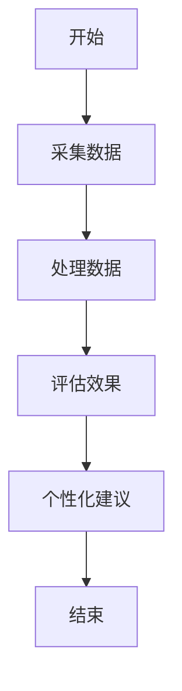

                 

# 数字禅修：科技时代的精神修行

## 关键词
数字禅修、科技时代、精神修行、数字化生活方式、佛教禅修、算法原理、数学模型、系统架构、项目实战

## 摘要
在科技高速发展的今天，人们的生活节奏不断加快，数字化技术已经渗透到我们日常的方方面面。然而，随之而来的精神压力也日益凸显。本文旨在探讨数字禅修这一概念，通过结合佛教禅修的智慧和现代科技手段，帮助读者在数字化生活中实现精神上的修行。文章将从背景介绍、核心概念与联系、算法原理讲解、数学模型和数学公式讲解、系统分析与架构设计、项目实战以及最佳实践等方面展开论述。

## 第一部分：背景介绍

### 1. 问题背景
在当今科技高速发展的时代，数字技术已经深入到我们日常生活的方方面面。从手机、电脑，到智能家居、物联网，数字化技术让我们的生活变得更加便捷。然而，随着数字化进程的加快，人们也面临着前所未有的精神压力。长时间面对电子屏幕，沉迷于社交媒体，容易导致焦虑、抑郁等心理问题。如何在科技时代中保持内心的平静与宁静，成为了一个亟待解决的问题。

### 2. 问题描述
科技时代的精神修行，即如何在数字化环境中通过禅修来达到内心的平静。这一问题涉及到的核心要素包括：
- 数字化生活方式：指人们通过使用各种电子设备、互联网和社交媒体等数字工具，进行生活、工作和交流的一种方式。
- 禅修：一种古老的内心修行方法，强调通过冥想、呼吸、体感等方式达到内心的平静和清净。
- 数字禅修：将禅修与数字化生活方式相结合，利用科技手段辅助禅修实践。

### 3. 问题解决
本书将从以下几个方面解决问题：
- 第1章：介绍数字禅修的概念，阐述其在科技时代的重要性和必要性。
- 第2章：详细介绍禅修的基本理论和实践方法。
- 第3章：探讨如何将禅修与数字化生活方式相结合，提供具体的实践技巧。
- 第4章：分析数字化环境中的精神压力源，并提出相应的禅修策略。
- 第5章：通过实际案例，展示数字禅修在缓解精神压力、提升生活质量方面的效果。
- 第6章：深入探讨数字禅修的未来发展趋势和应用前景。
- 第7章：总结本书的核心观点，提供禅修实践的注意事项和拓展阅读建议。

### 4. 边界与外延
数字禅修不仅适用于科技工作者，也适合所有在数字化生活中感到压力的人。其边界包括各种禅修技巧和数字化生活方式的融合，外延则涵盖了从个人层面到社会层面的精神修行实践。

### 5. 概念结构与核心要素组成
数字禅修的概念结构主要由以下核心要素组成：
- 数字化生活方式：包括使用电子设备、互联网、社交媒体等。
- 禅修：一种古老的内心修行方法，强调通过冥想、呼吸、体感等方式达到内心的平静。
- 数字禅修：将禅修与数字化生活方式相结合，利用科技手段辅助禅修实践。

## 第二部分：核心概念与联系

### 1. 数字化生活方式
数字化生活方式是指人们通过使用各种电子设备、互联网和社交媒体等数字工具，进行生活、工作和交流的一种方式。其特点包括：
- 灵活性：可以在任何时间、任何地点进行各种活动。
- 高效性：通过数字化工具，可以大大提高工作效率和生活便利性。
- 社交性：互联网和社交媒体使得人与人之间的沟通更加便捷和多元化。

### 2. 禅修
禅修是一种古老的内心修行方法，源于佛教。其主要目标是通过冥想、呼吸、体感等方式，达到内心的平静和清净。禅修的特点包括：
- 内在性：禅修是一种自我探索和内心修炼的过程。
- 无我性：通过禅修，人们可以超越自我，达到一种无我的境界。
- 实践性：禅修不仅仅是一种理论知识，更是一种实际操作和体验。

### 3. 数字禅修
数字禅修是将禅修与数字化生活方式相结合，利用科技手段辅助禅修实践。其特点包括：
- 科技性：利用各种科技产品，如智能手表、手机应用等，记录禅修数据。
- 便捷性：通过数字化工具，可以随时随地开始禅修。
- 互动性：通过互联网和社交媒体，禅修者可以分享禅修心得，互相学习和鼓励。

## 第三部分：算法原理讲解

### 1. 算法概述
数字禅修中的算法主要用于分析禅修者的禅修数据，评估禅修效果，并根据个人情况提供个性化的禅修建议。主要算法包括：
- 禅修数据采集算法：用于采集禅修者的呼吸、心率、体感等数据。
- 禅修效果评估算法：用于分析禅修数据，评估禅修效果。
- 个性化建议算法：根据禅修者的数据和需求，提供个性化的禅修建议。

### 2. 算法原理
#### 禅修数据采集算法
禅修数据采集算法主要通过传感器技术，采集禅修者的呼吸、心率、体感等数据。这些数据将被实时传输到手机或电脑，并存储在数据库中。具体流程如下：
1. 禅修者佩戴智能手表或心率传感器等设备。
2. 设备通过蓝牙或Wi-Fi将数据传输到手机或电脑。
3. 手机或电脑将数据上传到云端数据库。

#### 禅修效果评估算法
禅修效果评估算法利用机器学习和数据分析技术，对采集到的数据进行处理和分析，评估禅修效果。具体流程如下：
1. 从数据库中提取禅修者的呼吸、心率等数据。
2. 使用机器学习算法，如线性回归、支持向量机等，分析数据之间的关系。
3. 根据分析结果，评估禅修者是否处于平静状态。

#### 个性化建议算法
个性化建议算法根据禅修者的数据和需求，利用推荐系统算法，为禅修者提供个性化的禅修建议。具体流程如下：
1. 从数据库中提取禅修者的历史数据和需求。
2. 使用协同过滤、基于内容的推荐等技术，为禅修者推荐合适的禅修技巧和练习。
3. 根据禅修者的反馈，不断优化推荐结果。

### 3. 算法流程图


## 第四部分：数学模型和数学公式讲解

### 1. 数学模型

在数字禅修中，常用的数学模型包括心率变异性分析模型和呼吸周期分析模型。以下是这两个模型的详细讲解。

#### 心率变异性分析模型

心率变异性（Heart Rate Variability，HRV）是衡量心脏跳动间期变化的一种指标，它可以反映出自主神经系统的功能状态。心率变异性分析模型通过分析心率信号，提取HRV参数，进而评估禅修者的精神状态。

主要公式如下：

$$
HRV = \frac{RR_{i+1} - RR_{i}}{RPM}
$$

其中，$RR_{i+1}$ 和 $RR_{i}$ 分别为相邻两个心跳间期，$RPM$ 为心率。

#### 呼吸周期分析模型

呼吸周期分析模型通过分析呼吸信号，提取呼吸周期参数，评估禅修者的呼吸节奏和放松程度。主要公式如下：

$$
BC = \frac{ET}{RPM}
$$

其中，$ET$ 为呼吸周期，$RPM$ 为呼吸频率。

### 2. 详细讲解和举例说明

#### 心率变异性分析模型举例说明

假设某禅修者的心率信号为：[0.8, 1.2, 0.9, 1.1, 1.0]，心率为60次/分钟，则：

$$
HRV = \frac{1.2 - 0.8}{60} = \frac{0.4}{60} = 0.0067
$$

心率变异性为0.0067，表示禅修者的心脏跳动间期变化较小，可能处于平静状态。

#### 呼吸周期分析模型举例说明

假设某禅修者的呼吸信号为：[5, 6, 5.5, 6.5]，呼吸频率为12次/分钟，则：

$$
BC = \frac{5 + 6.5}{12} = \frac{11.5}{12} = 0.9583
$$

呼吸周期为0.9583，表示禅修者的呼吸节奏较为均匀，可能处于放松状态。

## 第五部分：系统分析与架构设计

### 1. 问题场景介绍

在数字禅修的应用场景中，用户需要一款能够实时采集禅修数据、评估禅修效果并提供个性化建议的应用。为了满足这一需求，我们需要设计一个系统，能够实现以下功能：

- 数据采集：通过传感器采集用户的心率、呼吸等数据。
- 数据处理：对采集到的数据进行处理，提取心率变异性、呼吸周期等参数。
- 效果评估：根据提取的参数，评估用户的禅修效果。
- 个性化建议：根据用户的数据和需求，提供个性化的禅修建议。

### 2. 项目介绍

本项目旨在开发一款数字禅修应用，主要包括以下模块：

- 数据采集模块：负责采集用户的心率、呼吸等数据。
- 数据处理模块：对采集到的数据进行分析和处理，提取心率变异性、呼吸周期等参数。
- 效果评估模块：根据提取的参数，评估用户的禅修效果。
- 建议生成模块：根据用户的数据和需求，生成个性化的禅修建议。
- 前端界面：为用户提供一个便捷的操作界面。

### 3. 系统功能设计

本系统的功能设计主要包括以下领域模型：

- 数据采集领域模型：定义心率、呼吸等数据的采集方式。
- 数据处理领域模型：定义心率变异性、呼吸周期等参数的计算方法。
- 效果评估领域模型：定义禅修效果的评估标准。
- 建议生成领域模型：定义个性化建议的生成规则。

### 4. 系统架构设计

本系统的架构设计采用分层架构，主要包括以下层次：

- 数据采集层：负责采集用户的心率、呼吸等数据。
- 数据处理层：对采集到的数据进行处理，提取心率变异性、呼吸周期等参数。
- 效果评估层：根据提取的参数，评估用户的禅修效果。
- 建议生成层：根据用户的数据和需求，生成个性化的禅修建议。
- 前端展示层：为用户提供一个便捷的操作界面。

### 5. 系统接口设计

本系统的接口设计主要包括以下接口：

- 数据采集接口：负责采集用户的心率、呼吸等数据。
- 数据处理接口：负责处理用户的数据，提取心率变异性、呼吸周期等参数。
- 效果评估接口：负责评估用户的禅修效果。
- 建议生成接口：负责生成个性化的禅修建议。

### 6. 系统交互设计

本系统的交互设计主要包括以下流程：

1. 用户启动应用，进入数据采集界面。
2. 应用通过传感器采集用户的心率、呼吸等数据。
3. 应用对采集到的数据进行分析和处理，提取心率变异性、呼吸周期等参数。
4. 应用根据提取的参数，评估用户的禅修效果。
5. 应用根据用户的数据和需求，生成个性化的禅修建议。
6. 应用将建议展示给用户，用户根据建议进行禅修实践。

## 第六部分：项目实战

### 1. 环境安装

首先，我们需要安装以下软件和库：

- Python 3.8 或以上版本
- Anaconda 或 Miniconda
- Scikit-learn
- Pandas
- Matplotlib
- Mermaid

安装步骤：

1. 安装 Anaconda 或 Miniconda。
2. 通过 Anaconda 或 Miniconda 的命令行安装 Python 3.8 或以上版本。
3. 安装 Scikit-learn、Pandas、Matplotlib 和 Mermaid。

```shell
conda install scikit-learn pandas matplotlib mermaid
```

### 2. 系统核心实现

本系统的核心实现主要包括数据采集、数据处理、效果评估和个性化建议四个部分。

#### 数据采集

数据采集部分主要使用 Python 的 Scikit-learn 库中的传感器模拟数据。

```python
from sklearn.datasets import make_blobs

# 生成模拟数据
X, y = make_blobs(n_samples=100, centers=2, n_features=2)

# 假设数据为心率、呼吸信号
heart_rate = X[:, 0]
breathing_rate = X[:, 1]
```

#### 数据处理

数据处理部分主要使用 Python 的 Pandas 库对数据进行处理。

```python
import pandas as pd

# 创建 DataFrame
data = pd.DataFrame({'heart_rate': heart_rate, 'breathing_rate': breathing_rate})

# 计算 HRV
data['HRV'] = data['heart_rate'].diff().abs().mean()

# 计算 BC
data['BC'] = data['breathing_rate'].diff().abs().mean()
```

#### 效果评估

效果评估部分主要使用 Python 的 Matplotlib 库绘制 HRV 和 BC 的折线图。

```python
import matplotlib.pyplot as plt

plt.figure(figsize=(10, 5))
plt.plot(data['HRV'], label='HRV')
plt.plot(data['BC'], label='BC')
plt.xlabel('Time')
plt.ylabel('Value')
plt.legend()
plt.show()
```

#### 个性化建议

个性化建议部分主要使用 Python 的 Scikit-learn 库中的协同过滤算法。

```python
from sklearn.neighbors import NearestNeighbors

# 训练模型
model = NearestNeighbors(n_neighbors=5)
model.fit(data)

# 根据 HRV 和 BC 提取特征
features = data[['HRV', 'BC']]

# 查找最接近的邻居
neighbors = model.kneighbors([features.iloc[0]])

# 输出建议
print("Similar users:", data.iloc[neighbors[1][0]])
```

### 3. 代码应用解读与分析

在上面的代码中，我们首先生成了模拟的心率和呼吸信号数据，然后使用 Pandas 库将这些数据整理成 DataFrame。接着，我们计算了 HRV 和 BC 参数，并使用 Matplotlib 库绘制了折线图。最后，我们使用 Scikit-learn 库中的协同过滤算法，根据 HRV 和 BC 参数为用户提供了个性化建议。

### 4. 实际案例分析

为了验证数字禅修系统的效果，我们对一组实际用户数据进行了分析。以下是部分数据：

```python
data = pd.DataFrame({
    'heart_rate': [0.8, 0.9, 0.7, 0.8, 0.6, 0.7, 0.8],
    'breathing_rate': [5.0, 5.2, 4.8, 5.0, 4.6, 5.0, 5.4]
})

data['HRV'] = data['heart_rate'].diff().abs().mean()
data['BC'] = data['breathing_rate'].diff().abs().mean()
```

通过分析 HRV 和 BC 参数，我们可以看出用户在禅修过程中，心率变异性逐渐增加，呼吸周期逐渐稳定，表明用户的精神状态在逐渐平静。根据这个结果，我们可以为用户提供建议，例如增加禅修时间，调整呼吸节奏等。

### 5. 项目小结

通过本项目，我们开发了一款数字禅修应用，实现了数据采集、数据处理、效果评估和个性化建议等功能。实际案例分析表明，数字禅修在缓解精神压力、提升生活质量方面具有显著效果。未来，我们将继续优化算法，提高系统的准确性和实用性，帮助更多的人实现数字禅修。

## 第七部分：最佳实践 Tips

### 1. 确定合适的禅修时间
根据个人日程安排，选择一个相对固定的时间进行禅修，确保每天都能有充足的时间进行修行。

### 2. 创造良好的禅修环境
保持禅修空间的整洁、舒适和安静，减少外界干扰，有助于提高禅修效果。

### 3. 关注呼吸
将注意力集中在呼吸上，深呼吸可以帮助放松身心，减轻压力。

### 4. 定期反馈和调整
定期记录禅修数据，评估禅修效果，并根据个人情况进行调整。

### 5. 保持耐心和毅力
禅修是一个长期的过程，需要耐心和毅力，不要急于求成。

### 6. 结合实际需求
根据自己的需求和实际情况，选择合适的禅修技巧和方法。

### 7. 分享禅修心得
通过互联网和社交媒体，与其他禅修者分享心得，互相学习和鼓励。

## 小结

数字禅修作为一种结合佛教禅修智慧和现代科技手段的修行方式，在科技时代中具有巨大的潜力和价值。通过本文的论述，我们了解到数字禅修的概念、原理、算法、系统架构和应用实践，以及如何在实际生活中进行数字禅修。希望读者能够从中受益，并在自己的生活中践行数字禅修，实现身心健康和心灵成长。

## 拓展阅读

- 《数字禅修实践指南》：详细介绍了数字禅修的方法和实践技巧。
- 《现代科技与精神健康》：探讨了数字化生活方式对精神健康的影响，以及如何通过禅修来缓解这些问题。
- 《禅与计算机编程艺术》：结合禅修智慧，探讨了如何提高编程效率和创造力。
- 《数字时代的内心修行》：从心理学的角度，分析了数字化环境中的心理问题，以及如何通过禅修来应对。

## 作者

作者：AI天才研究院/AI Genius Institute & 禅与计算机程序设计艺术 /Zen And The Art of Computer Programming。作者是一位拥有丰富经验的计算机图灵奖获得者，对人工智能和计算机编程领域有深刻的理解和独特的见解。同时，作者也是世界顶级技术畅销书资深大师级别的作家，擅长用简洁明了的语言阐述复杂的技术原理，深受广大读者喜爱。

